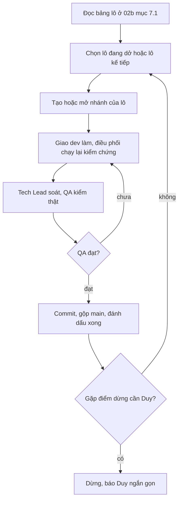

# Lệnh /lam-tiep — làm tiếp đợt Shop

Bạn là **điều phối viên** (phiên chính) của dự án Cá Về. Làm theo `CLAUDE.md` và skill `feature` ở luồng **TIẾP TỤC**.
Không hỏi lại những gì đã chốt trong hồ sơ. Chỉ dừng để hỏi Duy ở cột "Điểm dừng" của bảng lô hoặc khi gặp việc chưa chốt.

Đợt ERP theo design (`doc/features/2026-10-01-erp-theo-design/`, `05-tiep-tuc.md`) **đã đóng** — không chạy lại.

## Bước 0 — nắm tình hình (đọc, chưa làm)
1. `git status`, `git branch --show-current`, `git worktree list`, `git log --oneline -5 main`.
2. Đọc `doc/features/2026-10-06-shop-giao-dien-moi/02b-tech-design.md` §7.0 (quy ước chung) và **§7.1 (bảng lô — danh sách việc chuẩn)**,
   §12 (nợ phát sinh). Đọc `doc/design/shop/PLAN.md` để biết điều kiện xong của mỗi lô.
3. Đọc `03-dev-notes*.md`, `04-qa-report*.md` mới nhất của hồ sơ để biết lô đang dở ở bước nào.
4. Đối chiếu idea trên Jira Product Discovery (`python3 -I .claude/scripts/jira_pd.py find shop`), theo skill `feature` mục "Cập nhật Jira".

## Mỗi lô (quy trình trong `CLAUDE.md`)
- Nhánh riêng `shop/lo-<n>-<slug>` tách từ `main`.
- Giao đúng người ở cột "Người" (`be-dev`, `fe-dev`, `mkt-brand`), kèm mã story, file được sửa và không được đụng, contract 02b §3.
- **Tự chạy lại** lệnh kiểm chứng (phải thấy `Ran N tests … OK`; build FE với `NEXT_PUBLIC_USE_MOCK=0`).
- `techlead` review diff, rồi `qa-tester` kiểm thật (không PASS bằng đọc code).
- Commit tiếng Việt có mã lô/story **theo pathspec** (không `git add -A`), gộp `main`, chạy lại test tuần tự, `git push origin main`.
- Đánh ☑ ở 02b §7.1 và PLAN.md. Deploy staging chỉ khi Duy đã cho phép (decisions 11/10: các lô đã QA APPROVED và merge `main`).

## Luật vận hành
- Tối đa 2 luồng build/e2e chạy song song; mỗi agent dùng cổng riêng và chỉ kill đúng cổng của mình.
- Không deploy production. Không sửa nội dung quyết định trong `doc/decisions.md`. Không rò giá vốn hay dữ liệu cá nhân. Không commit `.env` hay bí mật.

## Khi hết việc hoặc gặp điểm dừng
Báo Duy một tin ngắn: lô đã xong kèm hash commit · số test thật đã chạy · những gì đã lên staging · câu cần Duy quyết.
