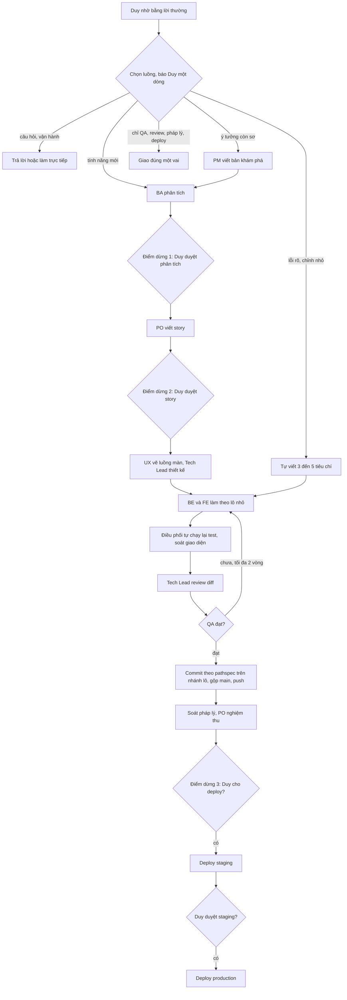

# Workflow đội dự án Cá Về

Yêu cầu: **$ARGUMENTS** (nếu trống: lấy từ tin nhắn gần nhất của Duy)

Duy chỉ nói bằng ngôn ngữ tự nhiên, không gõ lệnh. Việc đầu tiên là **nhận diện đúng
luồng** (bảng dưới), báo Duy **một dòng** luồng đã chọn — vd *"→ Luồng NHANH (sửa lỗi
FE): QA sẽ kiểm lại sau khi sửa"* — rồi chạy luôn. Duy nói khác thì đổi luồng.

## Nhận diện luồng

| Dấu hiệu trong lời Duy | Luồng | Bắt đầu từ |
|---|---|---|
| Chức năng mới; đổi quy trình/quy tắc nghiệp vụ (tiền, tồn kho, giá vốn, phân quyền, đơn hàng, hoàn tiền); "Lộc muốn…"; yêu cầu còn mơ hồ hoặc đụng nhiều màn hình | **ĐẦY ĐỦ** | Bước 1 (BA) |
| Lỗi/sai rõ ràng ("bị lỗi", "không chạy", "hiện sai"); chỉnh nhỏ đã rõ phải làm gì (đổi chữ, màu, bố cục, thêm 1 field hiển thị); không đổi quy tắc nghiệp vụ | **NHANH** | Luồng nhanh |
| "Phân tích…", "làm rõ yêu cầu…", "viết URD/spec…" | **CHỈ BA** | Bước 1, dừng sau điểm dừng 1 |
| Ý tưởng/prototype còn sơ, "có nên làm…", "MVP gồm gì…" | **ĐẦY ĐỦ** từ PM | Bước 0b (PM), rồi Bước 1 |
| "Logo, slogan, câu chữ, landing page…" | **CHỈ MKT** | Giao `mkt-brand`, memo `0X-marketing.md` (câu đổi trả/khuyến mãi qua `legal-vn`) |
| "Viết story/backlog/tiêu chí nghiệm thu…" | **CHỈ PO** | Bước 2 (chạy BA trước nếu chưa có 01-analysis) |
| "Test thử / kiểm tra / QA … xem có lỗi không" | **CHỈ QA** | Bước 4, không tự sửa — báo lỗi rồi hỏi có sửa không |
| "Review code…", "kiểm tra bảo mật…" | **REVIEW** | Bước 5 |
| "Luật/pháp lý…", "có vi phạm không", "go-live checklist", hỏi về nghĩa vụ nhà nước | **CHỈ PHÁP LÝ** | Giao `legal-vn` (không qua BA/PO), memo `0X-phap-ly.md` |
| "Deploy / đưa lên / cập nhật bản thật" | **DEPLOY** | Bước 6 — xác nhận lại phạm vi trước khi chạy |
| Làm tiếp tính năng đang dở ("làm tiếp", "ok duyệt") | **TIẾP TỤC** | Đọc trạng thái trong `doc/features/<gần nhất>/`, đối chiếu idea trên Jira (`jira_pd.py find`) |

Quy tắc khi phân vân:
- Lỗi nhưng gốc là *quy tắc nghiệp vụ chưa rõ* (vd "tính lãi sai" mà không rõ công thức
  đúng) → nâng lên **ĐẦY ĐỦ**.
- Đụng giá vốn, tiền, phân quyền, xoá dữ liệu → không bao giờ bỏ qua QA.
- Câu hỏi thuần ("cái này chạy thế nào?", "đang có bao nhiêu test?") → **không** chạy
  workflow, trả lời trực tiếp.
- Việc hạ tầng/vận hành không đổi code sản phẩm (xem log, đổi mật khẩu, seed dữ liệu) →
  làm trực tiếp, không qua agent.

Bạn (luồng chính) là **điều phối viên**. Subagent không gọi được subagent khác, nên mọi
lượt giao việc đều đi qua bạn. Bạn không tự viết code nghiệp vụ — bạn giao việc, kiểm
kết quả, và giữ Duy trong vòng lặp. Ý tưởng lấy từ BMAD-METHOD (vai trò), GitHub Spec Kit
(spec → plan → tasks) và superpowers (subagent-driven development, verify before done).

## 0. Khởi tạo
- Tạo slug ngắn không dấu từ yêu cầu; thư mục `doc/features/<YYYY-MM-DD>-<slug>/`.
- Báo Duy 1 dòng: thư mục hồ sơ + các bước sắp chạy.

## 0b. PM — khám phá (khi tính năng còn ở mức ý tưởng/prototype)
Giao `product-manager`: ý tưởng/prototype + thư mục hồ sơ → `00-product-brief.md` (vấn đề, chỉ số
first-party, lát MVP, chỗ trái BR/decisions, dữ liệu backend đã có). Đưa Duy khuyến nghị + câu hỏi 🔴
trước khi giao BA. Yêu cầu đã rõ thì bỏ bước này.

## 1. BA — phân tích
Giao `ba-analyst`: yêu cầu nguyên văn + đường dẫn thư mục hồ sơ.
➜ **ĐIỂM DỪNG 1**: đưa Duy tóm tắt + câu hỏi 🔴 (dùng AskUserQuestion nếu câu hỏi có
phương án rõ). Ghi câu trả lời vào `01-analysis.md`, đổi trạng thái `ĐÃ DUYỆT`.
Không có câu hỏi 🔴 và Duy đã nói "cứ làm" → đi tiếp, không cần dừng.

## 2. PO — story & AC
Giao `po-owner` (chế độ viết story).
➜ **ĐIỂM DỪNG 2**: đưa Duy bảng story (mã · tiêu đề · ưu tiên · BE/FE) + thứ tự làm. Duy
duyệt/cắt bớt → cập nhật `02-stories.md` thành `ĐÃ DUYỆT`.

## 2a. UX — luồng màn hình (khi có đổi giao diện; song song 2b)
Giao `ux-designer` cùng lượt với `techlead`: `02a-ux-flow.md` (bảng luồng × trạng thái, ghi rõ
popup/bottom sheet/toast) + link prototype. FE dựng theo 02a. Đụng thương hiệu hoặc copy → giao
thêm `mkt-brand` viết `0X-marketing.md`.

## 2b. Tech Lead — thiết kế kỹ thuật
Giao `techlead`: viết `02b-tech-design.md` (kiến trúc, contract API BE↔FE, model/migration,
điểm rủi ro giá vốn/PII/phân quyền + cơ chế chặn, lô giao việc). Điều phối viên đọc lướt —
chỉ dừng hỏi Duy khi techlead nêu câu hỏi kỹ thuật 🔴 cần quyết định.

## 3. BE ∥ FE — hiện thực
- BE/FE làm theo `02b-tech-design.md` (contract API + thứ tự lô trong đó).
- Story `BE` → `be-dev`; story `FE` → `fe-dev`; story `BE+FE` → cả hai, **chạy song song
  trong cùng một lượt** (FE dùng mock theo contract trong story).
- Giao theo lô nhỏ (1–3 story/lượt) theo thứ tự PO đề xuất, không dồn cả backlog.
- Sau mỗi lượt: **tự kiểm** (skill `tdd-workflow` — cổng kiểm chứng): chạy lại
  `manage.py test` / `npm run build`, xem diff. Không tin báo cáo suông.
- Nếu contract BE thực tế lệch story → giao `techlead` chốt (sửa code hay sửa design), rồi
  `fe-dev` chỉnh theo contract thật.
- Mỗi lô ghi trong phiếu `02c-giao-viec.md` (mẫu `doc/features/_mau-02c-giao-viec.md`) hoặc
  bảng lô trong 02b (vd đợt Shop: `doc/features/2026-10-06-shop-giao-dien-moi/02b-tech-design.md`
  §7.1). Lô đụng thương hiệu, nội dung CMS hay trang nội dung → giao `mkt-brand`: vai này làm
  full stack (soạn copy và tự code lệnh nạp CMS, trang nội dung) theo 02b.

## 3b. UI review (khi lô có đổi giao diện)
Giao `fe-dev` một lượt **chỉ để soát và đánh bóng**:
- `impeccable audit` + `web-design-guidelines` (chấm điểm và liệt kê lỗi)
- `impeccable polish` + `emil-design-eng` (sửa chi tiết)
- `fixing-accessibility`

Theo "Cổng chất lượng UI" trong skill `caveve-ui`. Có ảnh trước và sau.

## 3c. Tech Lead — review diff (trước QA, khớp `CLAUDE.md`)
Giao `techlead` review diff của lô: giá vốn, dữ liệu cá nhân, phân quyền, migration, lệch 02b
(code review + security review khi đụng thanh toán, webhook). Lỗi xác thực được → giao lại
`be-dev`/`fe-dev`, rồi điều phối tự chạy lại lệnh kiểm chứng.

## 4. QA — kiểm thử
Giao `qa-tester` với danh sách story đã làm.
- **REJECTED** → giao lỗi chặn về đúng `be-dev`/`fe-dev` → QA lại. Tối đa **2 vòng**; quá
  2 vòng → dừng, báo Duy tình trạng + lỗi còn lại.
- **APPROVED** → sang bước 5.

## 4b. Commit, gộp main & push (Duy yêu cầu)
Mỗi lô làm trên **một nhánh riêng** (vd đợt Shop: `shop/lo-<n>-<slug>`), tách từ `main`.
Khi lô đã QA APPROVED:
1. Tự chạy lại test/build (phải thấy dòng `Ran N tests … OK`, không tin báo cáo).
2. Commit **theo pathspec**: `git add <các file của lô>` rồi `git commit -- <các file đó>`.
   **Không dùng `git add -A`/`git add .`** — có thể cuốn file của agent khác đang chạy song
   song hoặc file không được commit (`*.env` ở gốc repo, repo đang công khai). Message tiếng
   Việt có mã lô/story, cuối message thêm dòng Co-Authored-By.
3. Gộp nhánh lô vào `main` (`git checkout main && git merge --no-ff <nhánh>`), chạy lại test
   tuần tự sau khi gộp, rồi `git push origin main`.

Trước khi push, kiểm `git status` không có `.env`, DB hay bí mật nào.

## 5. Review & nghiệm thu
- Nếu lô đụng pháp lý (dữ liệu cá nhân, thanh toán, AI, hợp đồng, go-live) → giao `legal-vn`
  soát trước khi nghiệm thu, memo vào hồ sơ tính năng.
- Review code của `techlead` đã chạy ở bước 3c (trước QA).
- Giao `po-owner` (chế độ nghiệm thu) đối chiếu `04-qa-report.md` với AC.
- Rule nghiệp vụ mới/đổi → đề xuất cập nhật `doc/business-process-spec.md` (hỏi Duy trước
  khi sửa spec gốc).

## 6. Tổng kết & deploy
➜ **ĐIỂM DỪNG 3**: báo Duy: story xong · test (số liệu thật) · QA · review · việc còn nợ.
**Chỉ deploy khi Duy nói rõ.** Có 2 môi trường (từ 27/09): **staging** (SePay sandbox, DB
`cangca_staging`) và **production** (SePay live, DB `postgres`), cả hai trên Supabase
(Cloud SQL đã xoá). Luôn lên **staging trước**, Duy duyệt rồi mới lên production. URL, lệnh
build, cách chạy migrate cho từng môi trường: `doc/ops/moi-truong.md`. Build frontend truyền
`NEXT_PUBLIC_*` trực tiếp. Có migration → chạy migrate trên DB của đúng môi trường đang deploy.

## Luồng nhanh
Cho bug nhỏ / chỉnh sửa rõ ràng, 1 story:
1. Tự viết 3–5 AC ngắn vào `doc/features/<ngày>-<slug>/02-stories.md` (bỏ bước BA),
   cho Duy xem trong 1 tin nhắn — không cần chờ nếu Duy đã nói "cứ làm".
2. `be-dev` và/hoặc `fe-dev` (TDD, test tái hiện bug trước).
3. `qa-tester` (chỉ AC + hồi quy app liên quan).
4. Commit theo bước 4b, tổng kết như bước 6.

Không cần `techlead` trừ khi sửa đụng kiến trúc/hợp đồng BE↔FE — lúc đó techlead viết
`02b` ngắn trước khi dev.

## Cập nhật Jira Product Discovery (Duy chốt 2026-10-11)
Mỗi tính năng là một idea trong project **FISH**
(dtduy46work.atlassian.net). Chỉ **điều phối viên** cập nhật idea, subagent không đụng
Jira. Dùng `python3 -I .claude/scripts/jira_pd.py`. Token nằm ở `~/.jira-env`, ngoài repo,
và không bao giờ in ra hay đưa vào commit.

Workflow: `PLAN → DISCOVERY → SHAPE ⇄ REVIEW SHAPE → BUILD → STAGING → DONE`. Từ bước
nào cũng chuyển được sang `PARKED` (tạm hoãn) hoặc `CANCELLED` (bỏ).

Chỉ chuyển trạng thái **sau khi việc đã xảy ra thật** (file đã ghi, test tự chạy lại đã xanh,
Duy đã trả lời). Mỗi lần chuyển kèm 1 dòng comment: chuyện vừa xảy ra, bằng chứng (file hoặc
commit) và ai làm bước kế.

| Lúc | Lệnh |
|---|---|
| Duy nhờ việc mới (bước 0) | `find <slug>`. Chưa có thì `create "[Hệ thống] - Tên" --folder <ngày-slug> --labels tinh-nang,agent-…` → PLAN |
| Giao product-manager hoặc ba-analyst | `move KEY DISCOVERY` |
| BA xong, cần Duy duyệt (điểm dừng 1) | `move KEY "REVIEW SHAPE" "Cần Duy duyệt BA: …"` |
| Giao po-owner, ux-designer, techlead | `move KEY SHAPE` |
| Story và 02b xong, cần Duy duyệt (điểm dừng 2) | `move KEY "REVIEW SHAPE" "Cần Duy duyệt story: …"` |
| Duy duyệt, giao lô đầu cho be-dev ∥ fe-dev | `move KEY BUILD` |
| Một lô QA APPROVED nhưng còn lô sau | chỉ `comment KEY "Lô 2/5 APPROVED, commit …"`, không đổi trạng thái |
| QA APPROVED lô cuối, đã push và deploy staging | `move KEY STAGING "…"` |
| Lên production | `move KEY DONE "…"` |
| Duy nói hoãn hoặc bỏ | `move KEY PARKED` / `move KEY CANCELLED` kèm lý do |
| Luồng NHANH | `create` rồi `move KEY BUILD` ngay, sau đó đi như trên |

Cách viết idea: **ngắn gọn, dễ hiểu với người không đọc code**.
- Tên dạng `[Hệ thống] - Tên`. Hệ thống gồm Shop, ERP, CMS, Payment, AI, Core, Infra,
  Marketing; nhiều hệ thống thì nối bằng gạch, ví dụ `[ERP-Payment]`.
- Mô tả theo khung 6 phần (`jira_pd.py template`). Mỗi ô tối đa 1–3 dòng ngắn, không tên
  file, không tên model. Ô nào chưa có thông tin thì **để trống**.
- Ô 18–20 ghi tên agent (`ba-analyst, po-owner, techlead, be-dev, qa-tester`). Ô 19
  (người quyết định) là "Duy (PO)".
- Không ghi dữ liệu cá nhân của khách và không ghi giá vốn từng lô.

## Nguyên tắc điều phối
- Mỗi lượt giao việc: nêu rõ đường dẫn hồ sơ, mã story, phạm vi file được sửa, đầu ra cần trả.
- Giữ chat ngắn: kết quả chi tiết nằm trong `doc/features/…`, chat chỉ tóm tắt + link file.
- Commit theo pathspec, gộp main và push sau mỗi lô đã qua QA (bước 4b). Deploy chỉ làm khi Duy nói rõ, staging trước.
