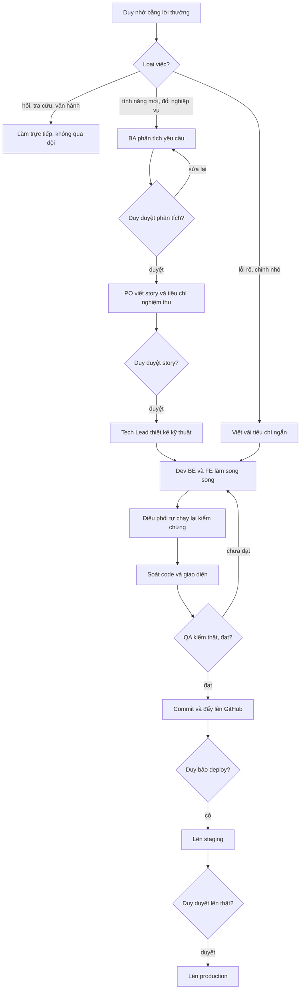

# Cá Về — hướng dẫn cho Claude



Vựa cá B2C (mua lô tại cảng → bán online → quản lý kho/giá vốn). Người dùng là **Duy**
(PO), trao đổi bằng tiếng Việt. Nghiệp vụ & bất biến: skill `caveve-domain`.

## Workflow đội dự án — tự nhận diện, Duy không gõ lệnh

Duy chỉ nhờ bằng lời thường. **Mọi yêu cầu làm thay đổi sản phẩm** (thêm/sửa chức năng,
sửa lỗi, đổi giao diện, đổi quy tắc, viết yêu cầu/story, test thử, review, deploy) →
**gọi skill `feature` trước khi làm gì khác**, để nó chọn luồng và báo Duy một dòng:

```
ĐẦY ĐỦ  (tính năng mới / đổi nghiệp vụ)  BA → [Duy duyệt] → PO → [Duy duyệt] → Tech Lead → BE ∥ FE → UI review → QA → Review → [Duy duyệt] → Deploy
NHANH   (lỗi rõ / chỉnh nhỏ)             AC ngắn → BE/FE → QA → tổng kết
CHỈ BA · CHỈ PO · CHỈ QA · REVIEW · DEPLOY · TIẾP TỤC (việc đang dở)
```
Trong luồng ĐẦY ĐỦ: `product-manager` chạy trước BA khi tính năng còn ở mức ý tưởng/prototype;
`ux-designer` chạy sau PO, song song Tech Lead; `mkt-brand` được gọi khi đụng thương hiệu hoặc copy.
Không chạy workflow cho câu hỏi thuần giải thích/tra cứu, hoặc việc vận hành không đổi
code (xem log, seed dữ liệu, đổi mật khẩu) — làm trực tiếp.

**Model (Duy chốt 2026-09-26, bổ sung techlead + legal-vn 2026-09-27):** lập kế hoạch dùng **Opus**, gồm điều phối viên (phiên chính), `ba-analyst`, `po-owner`, `techlead` và `legal-vn`; Duy chốt 2026-10-06 thêm `product-manager`, `ux-designer` và `mkt-brand` vào nhóm này. Code và test dùng **Sonnet 5.5** (`claude-sonnet-5-5`, Duy nâng 2026-09-30), gồm `be-dev`, `fe-dev` và `qa-tester`. Model khai ở frontmatter `model:` của từng agent; khi gọi Agent thì không ghi đè.

| Vai | Subagent | Skill nạp sẵn | Đầu ra |
|---|---|---|---|
| PM | `product-manager` | caveve-domain, requirement-elicitation | `doc/features/<ngày>-<slug>/00-product-brief.md` |
| BA | `ba-analyst` | requirement-elicitation | `doc/features/<ngày>-<slug>/01-analysis.md` |
| PO | `po-owner` | user-story-writing | `02-stories.md` (+ nghiệm thu) |
| UX | `ux-designer` | caveve-ui, impeccable (chỉ đọc), web-design-guidelines, fixing-accessibility, baseline-ui | `02a-ux-flow.md` + link prototype |
| Marketing/Brand (full stack, Duy chốt 10/10) | `mkt-brand` | caveve-domain, caveve-ui, django-drf-patterns, nextjs-shop-patterns, tdd-workflow | `0X-marketing.md` + code nội dung/CMS (app `content`, trang nội dung Shop) |
| Tech Lead | `techlead` | caveve-domain, django-drf-patterns, nextjs-shop-patterns | `02b-tech-design.md` + review code |
| Pháp lý | `legal-vn` | caveve-domain (+ WebSearch/WebFetch) | `0X-phap-ly.md` trong hồ sơ tính năng hoặc `doc/ops/` |
| BE | `be-dev` | django-drf-patterns, tdd-workflow | code `backend/` `adapter/` + `03-dev-notes.md` |
| FE | `fe-dev` | nextjs-shop-patterns, caveve-ui, impeccable, emil-design-eng, baseline-ui, fixing-accessibility | code `frontend/` `erp-console/` + `03-dev-notes.md` |
| QA | `qa-tester` | e2e-playwright, tdd-workflow | `04-qa-report.md` |

Nguồn gốc các skill (đã viết lại cho dự án): obra/superpowers, github/spec-kit,
bmad-code-org/BMAD-METHOD, wshobson/agents, Jeffallan/claude-skills,
vercel-labs/agent-skills, anthropics/skills, phuryn/pm-skills, alirezarezvani/claude-skills.
Skill UI/UX cài nguyên bản (giữ LICENSE): pbakaus/impeccable, emilkowalski/skills, nextlevelbuilder/ui-ux-pro-max-skill,
ibelick/ui-skills, vercel web-design-guidelines. Hướng thiết kế + chọn skill: `caveve-ui`.

## Người hiện thực: đội Claude (Duy chốt 2026-09-30, thay phân công 28/09)
Từ P8 trở đi **Claude và đội subagent tự code, QA và commit**. Gemini CLI / Antigravity **tạm dừng**
(review 30/09 thấy QA của AGY chấm PASS bằng đọc code, sót 1 Critical + nhiều High). Hồ sơ vẫn giữ
`02c-giao-viec.md` làm phiếu giao việc cho từng lô. Quy trình một lô:
1. Điều phối viên (phiên chính) `git pull`, đọc dòng lô trong 02c, rồi chạy lệnh kiểm chứng để ghi số gốc.
2. Giao `be-dev` ∥ `fe-dev` (chạy song song khi lô ghi BE ∥ FE). Kèm theo mã story, danh sách file được sửa
   và không được đụng, contract từ 02b, test tái hiện của review nếu có.
3. Điều phối viên **tự chạy lại** lệnh kiểm chứng. Không tin báo cáo của subagent khi chưa chạy.
4. `techlead` review diff (giá vốn, dữ liệu cá nhân, phân quyền, migration, lệch 02b).
5. `qa-tester` kiểm theo luật đã siết: không PASS bằng đọc code, có ca ngoài đường thuận, `npm ci` sạch.
6. REJECTED → giao lại dev, quay về bước 3. APPROVED → commit tiếng Việt có mã lô/story, `git push origin main`,
   đánh ☑ ở 02c. Gặp điểm dừng trong 02c → hỏi Duy.

`AGENTS.md`/`.agents/`/`.gemini/` giữ nguyên để có thể bật lại AGY. Không cho hai bên cùng làm một phase.
Skill dùng chung: `.agents/skills/` trỏ về `.claude/skills/`, nên sửa skill ở `.claude/skills/`.

## Môi trường (từ 2026-09-27)
**Staging** (sandbox SePay, DB `cangca_staging`) và **Production** (SePay live, DB `postgres` trên Supabase). Deploy luôn lên staging trước, Duy duyệt rồi mới lên production. Chi tiết URL, secret và lệnh build nằm ở `doc/ops/moi-truong.md`. Build frontend luôn truyền `NEXT_PUBLIC_*` trực tiếp, vì `.env.local` đè lên `.env.production`.

## Luật chung
- **Tài liệu quy trình luôn có sơ đồ Mermaid ở đầu** (Duy chốt 11/10): mọi doc mô tả quy trình, luồng nghiệp vụ, luồng màn, luồng làm việc, deploy hay vận hành (spec, 00/01/02/02a/02b/02c, PLAN, runbook `doc/ops/`, `doc/he-thong/`, skill/agent workflow) phải có một khối ` ```mermaid ` ngay dưới tiêu đề, trước phần chữ. Duy đọc luồng từ sơ đồ này nên nhãn viết tiếng Việt đời thường, ngắn, không mã kỹ thuật; điểm Duy duyệt/quyết định vẽ thành hình thoi. Nhãn có dấu câu thì đặt trong ngoặc kép. Sửa quy trình thì sửa sơ đồ cùng lúc.
- **Git:** mỗi khi xong một tính năng (một lô đã QA APPROVED) thì commit và `git push origin main` lên github.com/DuyduyFedev46/fish. Đây là quy ước Duy đặt ngày 2026-09-25. Repo đang công khai nên không bao giờ commit `.env` hay bí mật.
- **Jira Product Discovery (Duy chốt 2026-10-11):** mỗi tính năng là một idea trong project FISH. Điều phối viên cập nhật trạng thái theo các mốc trong skill `feature` (mục "Cập nhật Jira Product Discovery"), dùng `.claude/scripts/jira_pd.py`; subagent không đụng Jira. Viết idea ngắn gọn, tên `[Hệ thống] - Tên`.
- Không deploy khi Duy chưa yêu cầu.
- Không báo "xong"/"test xanh" khi chưa chạy lệnh kiểm chứng trong lượt đó.
- Không rò giá vốn, không xoá chứng từ, không lật quyết định trong `doc/decisions.md`.
- **Không rò dữ liệu cá nhân của khách** (tên, SĐT, địa chỉ). Quy tắc chi tiết ở bất biến 9 trong skill
  `caveve-domain`. Tóm tắt: API công khai không trả dữ liệu cá nhân, không ghi dữ liệu cá nhân vào log, không
  đưa dữ liệu thật vào test/doc/commit, không gửi cho bên thứ ba khi Duy chưa duyệt. Rò dữ liệu cá nhân là
  lỗi **Critical**. Pháp lý go-live xem ở `doc/ops/go-live-phap-ly.md`.
