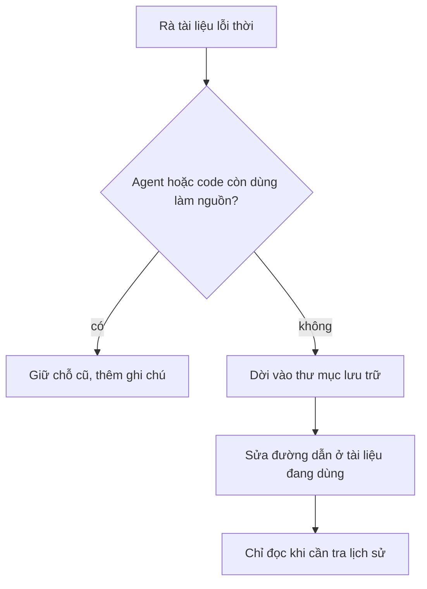

# Lưu trữ tài liệu cũ

Thư mục này giữ tài liệu **đã hết hiệu lực** nhưng còn giá trị tra lịch sử. Không dùng làm nguồn sự thật, không sửa nội
dung. Nguồn hiện hành: `doc/decisions.md`, `doc/business-process-spec.md`, `doc/URD.md`, `backend/README.md` và 02b của hồ
sơ tính năng đang làm. Dời ngày 11/10/2026 theo `doc/ops/ra-soat-tai-lieu-legacy-2026-10-11.md` (Duy duyệt).

| File | Vì sao lưu trữ |
|---|---|
| `BUILD-PLAN.md` | Hợp đồng Phase 2 (14/09): `allocate_fifo`, `nv_kho`, VietQR giả, `models.py` đóng băng. Code đã khác. Chỗ cũ `doc/BUILD-PLAN.md` còn một file trỏ sang đây vì comment trong code nhắc tên này |
| `doctype-mapping.md` | Level 2 mapping ERPNext, chính `decisions.md` đã ghi "ĐÃ LỖI THỜI" (3 tháng/lô, FIFO) |
| `design-shop/AUDIT-DO-DU.md` | Báo cáo soát độ đủ thiết kế Shop 06/10; câu mở đã được trả lời 10–11/10, đường dẫn trong file không còn |
| `design-shop/RENDER-AUDIT.md` | Báo cáo dựng và chụp màn Shop 06/10; công cụ `render-audit/tools/` không có trong repo |
| `features/2026-09-27-tam-tat-thanh-toan/` | Story tạm tắt thanh toán đã hoãn, mô tả banner trên Shop cũ |

Không dời (còn được dùng làm nguồn): `doc/ke-hoach-tong.md` (lệnh `/lam-tiep` của AGY ở `.agents/`, `.gemini/` đọc file
này), hồ sơ `doc/features/2026-09-30-ra-soat-agy/` và `2026-09-30-review-p1-p7/` (test trong `backend/`, `frontend/e2e/`,
`erp-console/e2e/` trỏ tới), `doc/design/shop/DOI-CHIEU-CODE.md` (để sau lô 7).
