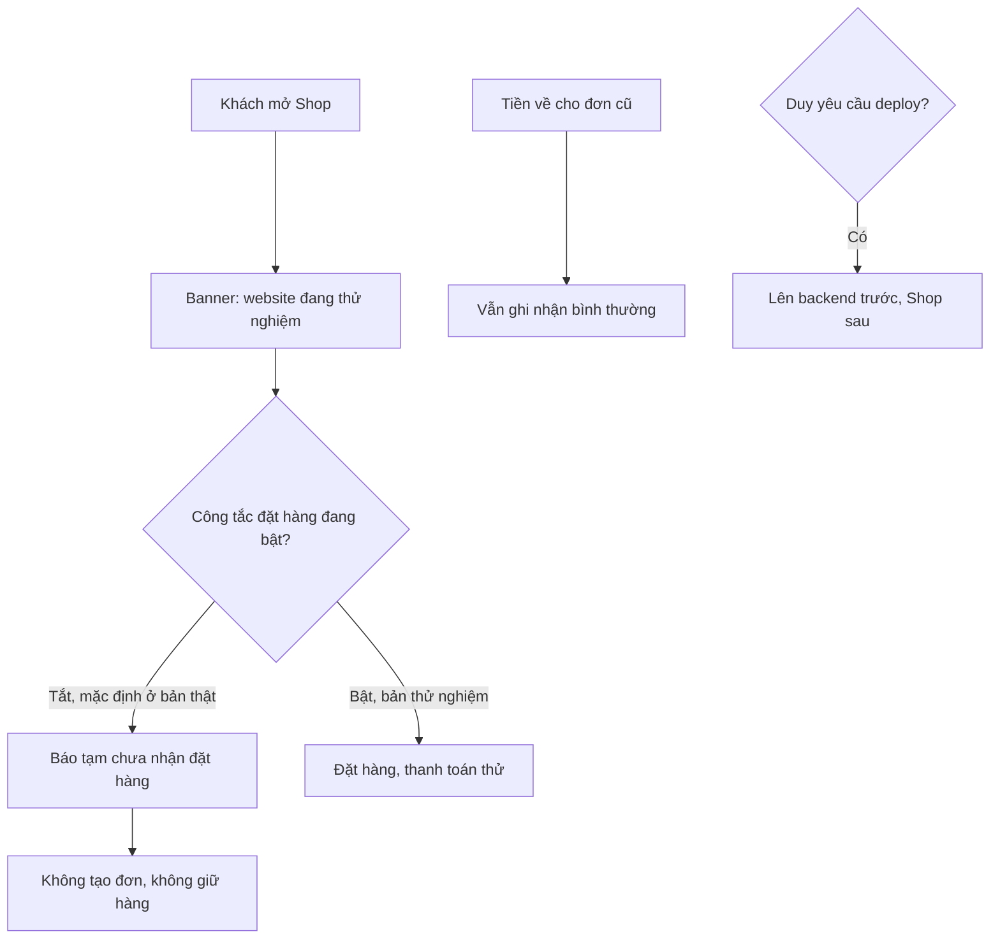

# Tạm tắt thanh toán live · luồng NHANH · 2026-09-27

**Trạng thái:** TẠM HOÃN. Ngày 2026-09-27 Duy bảo khỏi code, Duy tự tắt cổng trên dashboard SePay live. Chưa có code nào được sửa. Khi cần công tắc trong code thì làm tiếp từ file này.

**Bối cảnh:** chưa đủ checklist pháp lý go-live (`doc/ops/go-live-phap-ly.md`) và chưa thông báo website với
Sở Công Thương. Vì vậy production (SePay live) **không được nhận đơn hay tiền thật**. Cả hai môi trường gắn
banner "thử nghiệm" và `noindex`. Staging vẫn đặt hàng và thanh toán sandbox bình thường.

## TT1 — Công tắc tắt đặt hàng và thanh toán (BE)

Biến `SHOP_CHECKOUT_ENABLED` đọc từ env.
- Nếu **không đặt** thì mặc định **bật** khi `SEPAY_ENV != "PRODUCTION"` và **tắt** khi `SEPAY_ENV == "PRODUCTION"`.
  Cách này an toàn: production tự tắt, muốn mở phải đặt `SHOP_CHECKOUT_ENABLED=1` một cách có chủ ý.
- Giá trị `"1"`/`"0"` được đặt tường minh sẽ thắng mặc định.

**Tiêu chí nghiệm thu**
- **TT1-AC1.** Given công tắc tắt, When `POST /api/shop/orders/`, Then trả **503**
  `{"detail": "...", "code": "CHECKOUT_DISABLED"}`. Không tạo `SalesOrder`, không giữ chỗ lô, không đụng tồn.
- **TT1-AC2.** Given công tắc tắt, When `POST /api/shop/orders/<code>/checkout/`, Then trả 503 `CHECKOUT_DISABLED`
  và không trả tham số hay chữ ký SePay.
- **TT1-AC3.** Given công tắc tắt, Then catalog, tra đơn và **IPN SePay vẫn chạy như cũ**. IPN không bị chặn, để
  đơn phát sinh trước khi tắt vẫn ghi nhận được tiền.
- **TT1-AC4.** `GET /api/shop/status/` (công khai) trả `{"checkout_enabled": true|false}`. Response không có dữ liệu
  cá nhân hay cấu hình SePay.
- **TT1-AC5.** Có test cho bảng mặc định: `SEPAY_ENV` là SANDBOX hoặc PRODUCTION, mỗi trường hợp với biến
  không đặt, `"1"` và `"0"`.

## TT2 — Shop hiện trạng thái thử nghiệm (FE)

- **TT2-AC1.** Mọi trang Shop có banner cố định, nằm dưới header hoặc trên cùng, nội dung:
  *"Website đang thử nghiệm nội bộ, chưa bán hàng. Đơn đặt ở đây không có giá trị."*
  Banner điều khiển bằng `NEXT_PUBLIC_TEST_MODE`, **mặc định bật** (không đặt = bật; chỉ `"0"` mới tắt).
- **TT2-AC2.** Khi `NEXT_PUBLIC_TEST_MODE` bật, HTML có `<meta name="robots" content="noindex, nofollow">`.
- **TT2-AC3.** Nếu `GET /api/shop/status/` trả `checkout_enabled=false`:
  - trang giỏ hàng/checkout hiện thông báo *"Tạm thời chưa nhận đặt hàng."*;
  - nút đặt hàng và thanh toán bị vô hiệu;
  - không gọi `createOrder` hay `startCheckoutSession`.
- **TT2-AC4.** Nếu API vẫn trả 503 `CHECKOUT_DISABLED` (trường hợp chạy đua) thì hiện đúng thông báo ở AC3, không
  hiện lỗi chung. Nếu `/status/` lỗi mạng thì giữ hành vi cũ; backend vẫn chặn.
- **TT2-AC5.** Mock mode có `checkout_enabled` (mặc định `true`) để dev chạy được cả hai trạng thái.

## Ngoài phạm vi

- Không đổi ERP.
- Không xoá hay huỷ đơn cũ.
- Không đổi cấu hình SePay.
- Thứ tự deploy (BE trước, FE sau): **chỉ làm khi Duy yêu cầu**.
