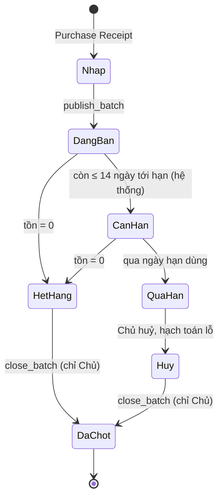
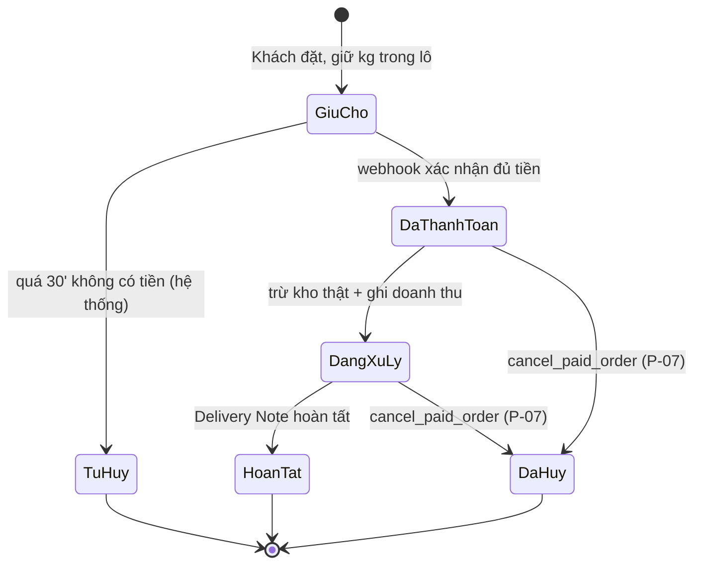
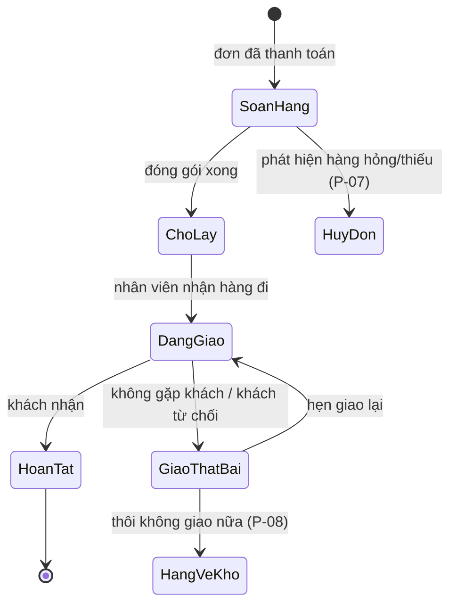
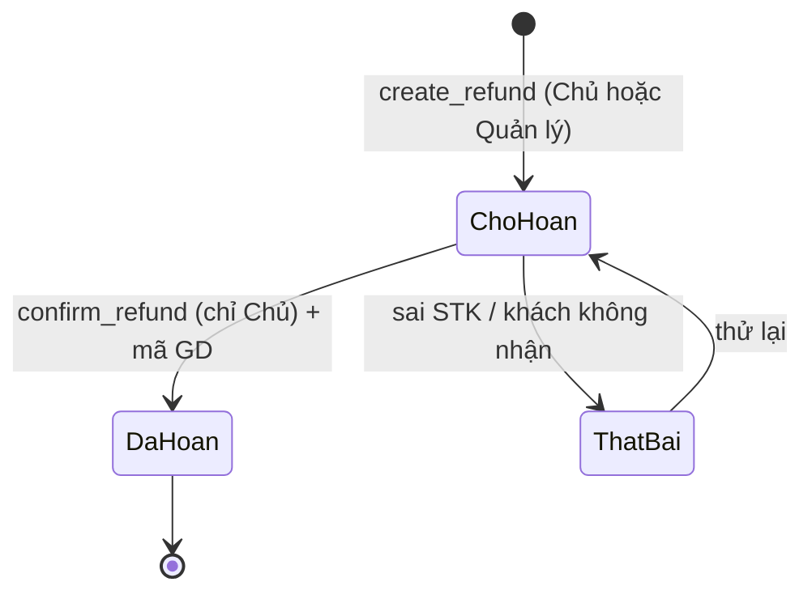

# 0. Cách đọc tài liệu này

## 0.1 Nó khác URD ở chỗ nào
`URD.md` trả lời **hệ thống làm được gì**. Tài liệu này trả lời **nó chạy ra sao khi mọi thứ không như ý**: ai được làm gì, chứng từ đi qua những trạng thái nào, luật nào không được vi phạm, và chuyện gì xảy ra ở từng nhánh hỏng. Đây là đầu vào trực tiếp để viết Django models.

## 0.2 Giới hạn của chữ "full"
Lộc chưa vận hành thực tế. Không thể có "full nghiệp vụ" theo nghĩa mô tả đúng cái đang diễn ra — chỉ có **full độ phủ điểm quyết định**: mọi ô đều có câu trả lời, và mỗi câu trả lời đều nói rõ nó đến từ đâu.

## 0.3 Nhãn nguồn — bắt buộc đọc
| Nhãn | Nghĩa | Cách xử lý |
|---|---|---|
| **(L)** | Lộc phát biểu trực tiếp | Yêu cầu thật, không tự sửa |
| **(D)** | Duy quyết định / suy ra | Quyết định của PO |
| **(PA)** | Product Architect đề xuất — **giả định** | Chọn phương án đơn giản nhất; kiểm chứng khi vận hành thật |

Phần lớn tài liệu này mang nhãn **(PA)**. Đó là bản chất của việc thiết kế trước khi vận hành, không phải điểm yếu — nhưng đừng đọc nó như thể Lộc đã duyệt.

---

# 1. Phân quyền

## 1.1 Vì sao bản v1 sai và sửa thế nào

Bản v1 mô tả quyền bằng **động từ nghiệp vụ** ("được soạn hàng", "được duyệt kiểm kê") với 3 vai trò. Duy chất vấn: phải là CRUD, phải có profile, phải có leader. Ba điểm không ngang nhau:

| Điểm | Kết luận |
|---|---|
| **CRUD** | **Nhận — nhưng CRUD một mình không đủ.** Django `contrib.auth` sinh sẵn `add/change/delete/view` cho mọi model, gán qua Group — đó là xương sống và nên viết đúng dạng đó. Nhưng "nhân viên nhập số kiểm kê, chỉ Chủ duyệt" là **chuyển trạng thái**, "chỉ sửa đơn được gán cho mình" là **phạm vi dòng**, "không thấy cột giá vốn" là **phạm vi cột** — không cái nào diễn đạt được bằng CRUD. Nên: **3 tầng**, CRUD là tầng 1. |
| **Profile** | **Nhận — lật lại quyết định 09/09 của chính tôi.** Bản cũ chốt "tham chiếu thẳng Django User, không cần entity riêng". Sai ở chỗ: `User` không có **số điện thoại**, mà khách và Lộc cần gọi được người đang cầm hàng đi giao. Có `StaffProfile` mỏng. Nhưng dừng ở đó — lương/chấm công/hợp đồng/KPI là phần mềm HR, đưa vào đây là đúng cái lý do đã bỏ Frappe. |
| **Leader** | **Nhận, nhưng vì lý do khác với org chart.** Lý do thật: **Lộc đi cảng mua hàng lúc rạng sáng và không thường trực ở kho.** Bản v1 bắt "chỉ Chủ duyệt" cho kiểm kê, hàng hoàn, huỷ đơn — nghĩa là 10h sáng giao thất bại thì hàng nằm chờ tới khi Lộc rảnh. Đó là nút cổ chai thật. Nếu anh muốn Leader chỉ vì sơ đồ tổ chức thì tôi không đồng ý; vì Lộc vắng mặt thì tôi đồng ý. |

## 1.2 Ba tầng quyền

| Tầng | Cơ chế Django | Diễn đạt được gì |
|---|---|---|
| **1. CRUD theo model** | `auth.Permission` tự sinh + `Group` | Ai được tạo/xem/sửa/xoá loại chứng từ nào |
| **2. Hành động tuỳ biến** | `Meta.permissions` (custom perms) | Duyệt, chốt, huỷ, xác nhận — các chuyển trạng thái |
| **3. Phạm vi dòng & cột** | `get_queryset()` lọc + serializer/Admin tách theo role | Chỉ đơn của mình; ẩn cột giá vốn |

Ba tầng phải cùng tồn tại. Chỉ làm tầng 1 thì nhân viên giao hàng thấy toàn bộ đơn của cả kho và đọc được giá vốn từng lô.

## 1.3 Bốn nhóm quyền — cộng dồn, không phải bậc thang

| Group | Ai | Ghi chú |
|---|---|---|
| `chu` | Lộc | Toàn quyền. Thực tế là superuser, nhưng vẫn định nghĩa Group để phân quyền tường minh |
| `quan_ly` | Người Lộc uỷ quyền khi vắng mặt | Duyệt vận hành, **không** đụng tiền và giá vốn |
| `nv_kho` | Nhập lô, soạn hàng, kiểm kê | |
| `nv_giao` | Giao hàng | Chỉ thấy đơn được gán cho mình |

**Cộng dồn, không xếp bậc (PA)**: một người ở vựa nhỏ vừa nhập kho vừa đi giao — gán cả `nv_kho` lẫn `nv_giao`, không cần role thứ năm. Quản lý thường là `quan_ly` + `nv_kho`. Thiết kế theo Group cộng dồn nên **thêm người kiêm nhiệm không phải sửa code**; thiết kế theo bậc thang thì phải.

## 1.4 Tầng 1 — Ma trận CRUD theo model

Ký hiệu: **C** tạo · **R** xem · **U** sửa · **D** xoá · **–** không có · **\*** giới hạn phạm vi (xem 1.6)

| Model | `chu` | `quan_ly` | `nv_kho` | `nv_giao` |
|---|---|---|---|---|
| ItemGroup, Item, BundleLine | CRUD | R | R | – |
| PriceList, ItemPrice | CRU– | R | – | – |
| PricingRule | CRUD | R | – | – |
| Supplier | CRUD | CRU– | R | – |
| Customer | CRU– | CRU– | R | R\* |
| Warehouse | CRU– | R | R | – |
| PurchaseReceipt | CRU– | CRU– | CRU–\* | – |
| Batch | CRU– | R | R | – |
| PurchaseInvoice | CRU– | R | – | – |
| **PurchaseCost** | CRU– | – | – | – |
| SalesOrder | R | R | R | R\* |
| SalesInvoice | R | R | R\* | – |
| SalesInvoiceLineBatch | R | – | – | – |
| **Refund** | CRU– | CRU– | – | – |
| DeliveryNote | CRU– | CRU– | CRU– | RU\* |
| ReturnToStock | R | R | CR– | CR– |
| StockEntry | CRU– | CRU– | CRU– | – |
| StockReconciliation | CRU– | CRU– | CRU– | – |
| User, StaffProfile | CRUD | R | R\* | R\* |
| AuditLog | R | – | – | – |

**Hai điều đáng chú ý trong bảng này:**

- **Cột D gần như trống.** Trong hệ thống sổ sách, chứng từ **không bao giờ xoá** — chỉ chuyển trạng thái huỷ. `delete_*` chỉ mở cho master data chưa phát sinh giao dịch (Item, ItemGroup, PricingRule, Supplier). Nếu để nguyên mặc định Django là Chủ xoá được Sales Invoice, thì một cú click làm bốc hơi cả doanh thu lẫn dấu vết giá vốn.
- **SalesOrder và SalesInvoice không ai có `C`.** Chúng do **Hệ thống** tạo (khách đặt trên Shop / webhook xác nhận thanh toán). Người dùng không tạo tay được — chống việc ghi doanh thu khống.

## 1.5 Tầng 2 — Quyền hành động tuỳ biến

| Permission | `chu` | `quan_ly` | Vì sao ranh giới nằm ở đây |
|---|:--:|:--:|---|
| `publish_batch` | ✅ | ✅ | Vận hành thuần |
| `approve_stockreconciliation` | ✅ | ✅ | Vận hành, đã có audit log |
| `approve_returntostock` | ✅ | ✅ | Hàng phải xử lý ngay, không chờ được |
| `cancel_paid_order` | ✅ | ✅ | Khách chờ, không chờ được |
| `create_refund` | ✅ | ✅ | Mới là *ghi nhận nợ khách*, tiền chưa đi |
| `close_batch` | ✅ | ❌ | Chốt số lãi/lỗ — đông cứng vĩnh viễn |
| `add_purchasecost` | ✅ | ❌ | Đụng thẳng vào giá vốn |
| `confirm_refund` | ✅ | ❌ | **Tiền thật rời tài khoản** |
| `confirm_payment_manual` | ✅ | ❌ | Phải đối chiếu sao kê ngân hàng — **chỉ Lộc có quyền xem sao kê** |
| `view_costprice` | ✅ | ❌ | Xem 1.7 |
| `view_profitreport` | ✅ | ❌ | Xem 1.7 |
| `manage_staff` | ✅ | ❌ | Tạo tài khoản, đổi Group |

**Đường ranh (PA)**: Quản lý được uỷ **mọi thứ làm khách phải chờ**; Chủ giữ **mọi thứ làm tiền rời túi hoặc làm đổi con số lời lỗ**. `create_refund` tách khỏi `confirm_refund` chính là để cắt đúng đường này — Quản lý dựng được phiếu hoàn ngay lúc sự việc xảy ra, Lộc chỉ cần bấm chuyển khoản khi rảnh.

## 1.6 Tầng 3 — Phạm vi dòng & cột

**Phạm vi dòng** (lọc trong `get_queryset()`, không phải ẩn ở giao diện):

| Chỗ | Luật |
|---|---|
| `nv_giao` trên DeliveryNote | Chỉ đơn có `assigned_to = user`; chỉ sửa được field trạng thái, không sửa dòng hàng |
| `nv_giao` trên SalesOrder / Customer | Chỉ đơn/khách thuộc phiếu giao được gán |
| `nv_kho` trên PurchaseReceipt | Chỉ sửa phiếu do chính mình tạo, **trong ngày**; qua ngày phải nhờ Quản lý |
| Nhân viên trên StaffProfile | Chỉ hồ sơ của chính mình |

**Phạm vi cột** — danh sách field nhạy cảm, chỉ `view_costprice` mới thấy:

`Batch.landed_unit_cost` · `Batch.purchase_rate` · `PurchaseReceipt.rate` · toàn bộ `PurchaseCost` · `SalesInvoiceLineBatch.unit_cost` · mọi cột lãi/lỗ trên báo cáo

> **Cảnh báo triển khai — đây là chỗ rò rỉ dễ nhất.** Django Admin ẩn cột thì dễ, nhưng nếu DRF dùng chung một serializer với `fields = '__all__'` thì API trả về đủ giá vốn cho bất kỳ ai gọi được endpoint. **Phải tách serializer theo Group**, và kiểm thử bằng cách gọi API bằng token nhân viên chứ không phải chỉ nhìn màn hình Admin.

## 1.7 Quản lý có được xem giá vốn không?

Mặc định **KHÔNG** (PA). Lý do: giá mua tại cảng là lợi thế đàm phán của Lộc với đầu mối; ở vựa cá nhân viên thường là người quen, thông tin đi nhanh.

Đây là **mặc định rẻ để lật** — chỉ là gán thêm 2 permission vào Group `quan_ly`, không sửa dòng code nào. Nên tôi chốt luôn thay vì hỏi. Lộc muốn khác thì đổi trong Admin.

## 1.8 StaffProfile — có, nhưng mỏng

| Trong phạm vi | Ngoài phạm vi |
|---|---|
| Số điện thoại (**bắt buộc**) | Lương, phụ cấp |
| Họ tên hiển thị | Chấm công, ca kíp |
| Ngày vào làm | Hợp đồng lao động |
| Trạng thái: đang làm / nghỉ | KPI, đánh giá |
| Ghi chú | Nghỉ phép |

> **Quyết định kiến trúc quan trọng**: mọi FK nghiệp vụ (người giao, người nhập lô, người duyệt) **trỏ vào `User`**, `StaffProfile` chỉ là `OneToOneField` mở rộng. Nếu trỏ FK vào `StaffProfile` thì ai chưa có hồ sơ là không làm được việc, và migrate về sau rất phiền. Chọn sai chiều này là cái đắt duy nhất trong toàn bộ mục 1.

## 1.9 Nghỉ việc & lưu vết

| Mã | Luật |
|---|---|
| BR-PQ-01 | Nhân viên nghỉ → `User.is_active = False` + `StaffProfile.status = nghỉ`. **Không xoá tài khoản.** |
| BR-PQ-02 | Mọi FK trỏ người dùng dùng `on_delete=PROTECT`. Chứng từ cũ phải giữ nguyên tên người thực hiện. |
| BR-PQ-03 | Đổi Group của một người **không** hồi tố lên chứng từ đã tạo. |

## 1.10 AuditLog

Phân quyền mà không có log thì chỉ chặn được nhầm lẫn, không truy được trách nhiệm. Django Admin có `LogEntry` sẵn nhưng **chỉ ghi thao tác trong Admin** — hành động qua API không được ghi. Cần model riêng.

| Mã | Luật |
|---|---|
| BR-PQ-04 | Mọi permission ở **Tầng 2** phải ghi `AuditLog`: ai, khi nào, chứng từ nào, giá trị trước → sau. |
| BR-PQ-05 | Mọi thay đổi `Batch.landed_unit_cost` và mọi `Refund` đổi trạng thái **bắt buộc** có AuditLog — không có log thì từ chối ghi. |
| BR-PQ-06 | AuditLog **chỉ ghi thêm**, không sửa, không xoá, kể cả Chủ. |
| BR-PQ-07 | Hành động của Hệ thống (job huỷ TTL, webhook xác nhận) ghi log với actor = `system`, không mượn tài khoản người. |

## 1.11 Business rules phân quyền

| Mã | Luật |
|---|---|
| BR-PQ-08 | Quyền gán qua **Group**, không gán trực tiếp cho user. Ngoại lệ phải có ghi chú lý do. |
| BR-PQ-09 | Người dùng có thể thuộc **nhiều Group**; quyền là hợp của các Group. |
| BR-PQ-10 | `delete_*` chỉ mở cho master data chưa phát sinh giao dịch. Chứng từ **không bao giờ** xoá — chỉ huỷ bằng trạng thái. |
| BR-PQ-11 | Không người dùng nào tạo tay được SalesOrder / SalesInvoice. |
| BR-PQ-12 | Kiểm soát phạm vi phải nằm ở **queryset và serializer**, không phải ở giao diện. Ẩn nút không phải là phân quyền. |
| BR-PQ-13 | Mỗi Group phải có ít nhất một bài kiểm thử gọi API bằng đúng token của Group đó, xác nhận không lộ field nhạy cảm. |

---

# 2. Danh mục quy trình

| Mã | Quy trình | Actor chính |
|---|---|---|
| P-01 | Quản lý danh mục, giá niêm yết, combo | Chủ |
| P-02 | Mua hàng & nhập lô tại cảng | Chủ, NV kho |
| P-03 | Ghi nhận chi phí mua hàng & tính giá vốn lô | Chủ |
| P-04 | Vòng đời lô & chốt lô | Chủ, Hệ thống |
| P-05 | Bán hàng trên Shop (đặt → giữ chỗ → thanh toán) | Khách, Hệ thống |
| P-06 | Soạn hàng & giao hàng | NV kho, NV giao |
| P-07 | Huỷ đơn & hoàn tiền | Chủ, Quản lý |
| P-08 | Hàng giao thất bại quay về kho | NV giao, Quản lý/Chủ |
| P-09 | Kiểm kê định kỳ & xử lý hao hụt | NV kho, Quản lý/Chủ |
| P-10 | Báo cáo giá vốn & lãi lỗ | Chủ |

---

# 3. P-01 — Danh mục, giá niêm yết, combo

## 3.1 Ba dạng combo *(D chọn hướng "flex", PA giới hạn phạm vi)*

| Dạng | Cơ chế | Kho trừ ở đâu | Dùng khi |
|---|---|---|---|
| **Gói có công thức** (BUNDLE) | `Item.item_type=BUNDLE` + `BundleLine` (thành phần, định mức kg) | Nổ ra thành phần, FEFO từng thành phần *(sửa 2026-09-26, xem decisions.md)* | "Set lẩu 2kg: 1kg tôm + 0.5kg mực + 0.5kg cá" |
| **Đóng gói sẵn** | Không cần cơ chế mới — `Item` thường có lô riêng | Chính lô của nó | Khay 500g đóng sẵn từ lúc nhập |
| **Ưu đãi** (`PricingRule`) | Điều kiện 1 tầng → giảm tiền hoặc % | Từng mặt hàng riêng | "Mua ≥ 3kg tôm giảm 10%" |

**Ranh giới cố ý (PA)** — PricingRule **chỉ 1 tầng điều kiện, không lồng nhau, không cộng dồn** (nhiều rule cùng khớp → chọn rule có lợi nhất cho khách), không mã giảm giá, không ngân sách khuyến mãi. Đây là chỗ dừng có chủ đích: rule engine tổng quát làm chi phí kiểm thử tăng theo cấp số nhân và là thứ giết dự án do một người maintain.

## 3.2 Business rules
| Mã | Luật |
|---|---|
| BR-DM-01 | Mọi mặt hàng bán theo `Kg`. Không có quy đổi đa đơn vị. |
| BR-DM-02 | Giá bán **luôn** lấy từ Item Price hiệu lực tại thời điểm đặt hàng (`valid_from ≤ now ≤ valid_upto`). Không cho nhập giá tay trên đơn. |
| BR-DM-03 | Hai Item Price cùng mặt hàng, cùng bảng giá, **không được chồng lấn** khoảng hiệu lực. |
| BR-DM-04 | BUNDLE có giá niêm yết **độc lập**, không tự tính bằng tổng giá thành phần. |
| BR-DM-05 | BUNDLE **không được chứa BUNDLE khác** (không lồng cấp). |
| BR-DM-06 | Tồn khả dụng của BUNDLE là giá trị **tính ra, không lưu**: `min( floor(tồn khả dụng thành phần i / định mức i) )`. |
| BR-DM-07 | Sửa `BundleLine` **không** hồi tố lên đơn đã đặt — đơn giữ ảnh chụp công thức tại thời điểm đặt. |
| BR-DM-08 | Nhiều PricingRule cùng khớp → áp dụng **duy nhất một** rule có lợi nhất cho khách. Không cộng dồn. |

---

# 4. P-02 — Mua hàng & nhập lô

## 4.1 Luồng
Mua trực tiếp tại cảng, **không có đơn đặt hàng trước** (L). NV kho/Chủ ghi nhận ngay:

`Chọn nhà cung cấp → nhập từng mặt hàng + số kg + đơn giá mua → hệ thống sinh Lô (Batch) → tự tính hạn dùng = ngày nhập + 90 ngày → lô ở trạng thái Nháp`

## 4.2 Business rules
| Mã | Luật |
|---|---|
| BR-MH-01 | Mỗi lần nhập của **một mặt hàng** sinh **một lô riêng**. Không gộp lô kể cả cùng ngày cùng nhà cung cấp — vì giá mua khác nhau. |
| BR-MH-02 | Hạn dùng lô = ngày nhập + `shelf_life_in_days` (mặc định 90). Cho phép sửa tay xuống thấp hơn, **không cho sửa cao hơn**. |
| BR-MH-03 | Mua tại cảng **trả tiền ngay**, Purchase Invoice ghi `is_paid=true`. Không công nợ nhà cung cấp *(PA — mặc định để không treo tiếp; câu hỏi mở #2)*. |
| BR-MH-04 | Purchase Invoice tách riêng khỏi Purchase Receipt (D — kiểm đếm vật lý ≠ ghi chi phí), nhưng phải tồn tại trước khi chốt lô. |
| BR-MH-05 | Lô ở trạng thái **Nháp** không hiện trên Shop. Phải publish thủ công (`publish_batch`). |
| BR-MH-06 | Đơn giá mua là **field nhạy cảm** — NV kho nhập được nhưng không xem lại được phiếu của người khác (xem 1.6). |

---

# 5. P-03 — Chi phí mua hàng & giá vốn lô *(D chốt: có gom landed cost)*

## 5.1 Luồng
`Purchase Cost` là chứng từ riêng, gắn với **một hoặc nhiều** Purchase Receipt:

| Trường | Nội dung |
|---|---|
| Loại chi phí | Đá / Vận chuyển / Bốc vác / Khác |
| Số tiền | |
| Phân bổ theo | **Số kg** hoặc **Giá trị** |
| Áp cho | Danh sách lô nhận phân bổ |

Ghi nhận → cập nhật `Batch.landed_unit_cost = (tổng giá mua lô + chi phí phân bổ vào lô) / số kg nhập`.

**Chỉ Chủ** có `add_purchasecost` — đây là chứng từ đụng thẳng vào giá vốn.

## 5.2 Vấn đề giá vốn hồi tố — và cách xử lý
Chi phí phụ thường về **sau** khi lô đã bán được vài kg. Hai lựa chọn: khoá kỳ (bắt nhập chi phí trong ngày) hay cho nhập sau rồi tính lại. Chọn **tính lại**, với quy ước rõ ràng:

| Con số | Nguồn | Tính chất |
|---|---|---|
| Giá vốn ghi trên dòng hoá đơn | Ảnh chụp `landed_unit_cost` tại thời điểm bán | **Chỉ báo** — có thể lệch nếu chi phí về sau |
| Lãi/lỗ theo **lô** | Tính lại từ `landed_unit_cost` hiện hành | **Nguồn sự thật** |

**Trade-off phải chấp nhận (PA)**: hai con số này có thể không khớp nhau trong lúc lô còn mở. Đổi lại, không phải bắt Lộc nhập đủ chứng từ chi phí ngay tại cảng — điều gần như chắc chắn sẽ không xảy ra trong thực tế. Chốt lô là lúc hai con số hoà giải.

## 5.3 Business rules
| Mã | Luật |
|---|---|
| BR-GV-01 | `Batch.landed_unit_cost` = (giá mua lô + chi phí phân bổ) / số kg nhập ban đầu. Mẫu số **không** đổi khi có hao hụt. |
| BR-GV-02 | Không cho thêm Purchase Cost vào lô **đã chốt**. |
| BR-GV-03 | Mỗi lần `landed_unit_cost` đổi phải ghi AuditLog (BR-PQ-05) — giá vốn là số nhạy cảm, không được đổi âm thầm. |
| BR-GV-04 | Phân bổ theo kg là mặc định. Theo giá trị chỉ dùng khi lô chênh lệch giá mua lớn. |

---

# 6. P-04 — Vòng đời lô

| Mã | Luật |
|---|---|
| BR-LO-01 | Lô **Cận hạn**: hệ thống chỉ **cảnh báo**, không tự giảm giá. Muốn xả giá thì Chủ tạo Item Price mới có `valid_upto` *(PA — tự động giảm giá là quyết định kinh doanh, không để máy làm)*. |
| BR-LO-02 | Lô **Quá hạn** bị loại khỏi tồn khả dụng **ngay**, kể cả còn kg. Không bán được nữa. |
| BR-LO-03 | Huỷ lô quá hạn → toàn bộ giá trị tồn còn lại hạch toán **lỗ hàng hết hạn** vào chính lô đó. |
| BR-LO-04 | **Chốt lô** yêu cầu: tồn = 0 (hoặc đã huỷ phần còn lại), Purchase Invoice đã có, không còn đơn đang mở tham chiếu lô. |
| BR-LO-05 | Lô **đã chốt** khoá vĩnh viễn: không sửa chi phí, không kiểm kê, không hoàn hàng về. Lãi/lỗ đông cứng. |
| BR-LO-06 | Ngưỡng cận hạn 14 ngày là **tham số cấu hình**, không hard-code. |

---

# 7. P-05 — Bán hàng trên Shop

## 7.1 Danh tính khách *(PA)*
Guest checkout, không đăng nhập ở V1. `Customer` gộp theo **số điện thoại** làm khoá tự nhiên — đặt lần 2 cùng SĐT thì gắn vào cùng khách, tự có lịch sử mua. Tra đơn bằng **mã đơn + 4 số cuối SĐT**. Thêm đăng nhập OTP sau này không đổi schema.

Khách **không phải là `User`** trong hệ thống — không có tài khoản, không nằm trong ma trận Group ở mục 1.

## 7.2 State machine đơn hàng

## 7.3 Giữ chỗ, tồn hiển thị, tranh lô cuối *(PA)*
| Mã | Luật |
|---|---|
| BR-BH-01 | **Tồn khả dụng hiển thị trên Shop = tồn sổ − đang giữ chỗ.** Không bao giờ bán vượt. |
| BR-BH-02 | Giữ chỗ ghi ở **mức lô**, khoá dòng lô khi tạo đơn. Hai khách tranh lô cuối: người tạo đơn trước thắng, người sau thấy hết hàng ngay tại bước đặt. |
| BR-BH-03 | TTL giữ chỗ **30 phút** (D). Job nền quét và nhả. |
| BR-BH-04 | Job nhả giữ chỗ phải **idempotent** và có giám sát — job này chết thì hàng bị khoá vô hình, không ai biết cho tới khi Shop báo hết hàng oan. |
| BR-BH-05 | **(D) 2026-09-26** — Chọn lô theo **FEFO** (hết hạn trước xuất trước): trong các lô *bán được* (BR-LO-02 lọc trước), lô có **hạn dùng sớm nhất** xuất trước. Cùng hạn thì lô **nhập sớm hơn** trước; vẫn trùng thì lô **tạo trước** trước, để thứ tự luôn cố định. Áp dụng cho mọi mặt hàng, kể cả từng thành phần combo. Khách không chọn lô (BR-PQ-12); V1 không cho ai chọn tay lô khác FEFO. *(sửa 2026-09-26, xem decisions.md; thay "FIFO theo ngày nhập")* |
| BR-BH-06 | Một dòng đơn **được phép ăn nhiều lô**. Bắt buộc lưu bảng phân bổ: `dòng ↔ lô ↔ số kg ↔ đơn giá vốn`. **Không có bảng này thì không tồn tại báo cáo giá vốn theo lô.** |
| BR-BH-07 | Đơn BUNDLE giữ chỗ **đồng thời tất cả thành phần**; thiếu một thành phần thì cả đơn không tạo được. |
| BR-BH-08 | Giá và công thức BUNDLE **đóng băng** tại thời điểm tạo đơn. Đổi giá niêm yết sau đó không ảnh hưởng đơn đang giữ chỗ. |
| BR-BH-09 | Địa chỉ giao **bắt buộc** ngay bước đặt (L — 100% giao tận nhà). |
| BR-BH-10 | **Không có trường phí giao hàng** trên đơn (L — outscope hoàn toàn). |
| BR-BH-11 | **(D) 2026-09-26** — Phân bổ lô được **chốt một lần lúc tạo đơn**. Khi thanh toán, hệ thống trừ kho đúng các lô đã giữ chỗ, **không chọn lại** lô (kể cả khi đã có lô mới hạn sớm hơn). Đơn đã phân bổ không bị phân bổ lại khi có lô mới hay khi đổi quy tắc chọn lô. *(sửa 2026-09-26, xem decisions.md)* |

## 7.4 Thanh toán
| Mã | Luật |
|---|---|
| BR-TT-01 | Mã VietQR động sinh riêng cho từng đơn, nội dung chuyển khoản mang mã đơn. |
| BR-TT-02 | Webhook đi qua FastAPI adapter → gọi API nội bộ Django. Bên thứ 3 không nối thẳng lõi (D). |
| BR-TT-03 | Webhook phải **idempotent** — SePay có thể gửi lại. Khoá chống trùng: mã giao dịch ngân hàng. |
| BR-TT-04 | **Tiền về ít hơn số đơn** → không tự xác nhận, đẩy vào hàng chờ Chủ xử lý tay. |
| BR-TT-05 | **Tiền về sau khi đơn đã tự huỷ** → không tự khôi phục đơn (hàng có thể đã bán cho người khác). Đẩy vào hàng chờ Chủ → thường dẫn tới hoàn tiền (P-07). |
| BR-TT-06 | Ghi nhận doanh thu tại thời điểm **xác nhận thanh toán** (tiền đã về tài khoản thật), không phải lúc giao xong *(PA)*. |
| BR-TT-07 | Xác nhận thanh toán thủ công (`confirm_payment_manual`) **chỉ Chủ** — thao tác này đòi đối chiếu sao kê, mà sao kê chỉ Lộc truy cập được. Uỷ quyền chỗ này là mở đường ghi doanh thu khống. |

---

# 8. P-06 — Soạn hàng & giao hàng

| Mã | Luật |
|---|---|
| BR-GH-01 | Người giao là **nhân viên nội bộ**, FK trỏ `User` (D). `StaffProfile` cung cấp số điện thoại để khách/Lộc liên hệ. |
| BR-GH-02 | Không có định tuyến, tối ưu lộ trình, chi phí xe cộ (L). |
| BR-GH-03 | Số kg cân khi soạn = số kg khách đặt. **Giả định V1 (PA), chưa kiểm chứng** — không có field "số kg thực xuất". |
| BR-GH-04 | "Giao thất bại" là **trạng thái tạm**, đếm số lần thử. Sau 2 lần thất bại hệ thống nhắc Quản lý/Chủ quyết định *(PA — ngưỡng cấu hình được)*. |
| BR-GH-05 | Chuyển sang **Hoàn tất** là điểm không quay lui. Muốn xử lý sau đó phải qua phiếu hoàn tiền. |
| BR-GH-06 | `nv_giao` chỉ thấy và chỉ sửa được **trạng thái** của phiếu được gán cho mình — không sửa dòng hàng, không xem giá vốn (1.6). |

---

# 9. P-07 — Huỷ đơn & hoàn tiền

## 9.1 Ràng buộc phải biết trước
Đã kiểm chứng trực tiếp trang SePay và tài liệu developer của họ: mô hình VietQR là **tiền vào thẳng tài khoản ngân hàng của Lộc, không qua ví trung gian**, và SePay tự mô tả là nền tảng **giám sát/thông báo biến động số dư**. Tài liệu API chỉ có webhook, tra cứu giao dịch, virtual account, IPN — **không có API hoàn tiền hay chuyển tiền đi**.

Hệ quả: **hoàn tiền tự động qua cổng không khả dụng ở V1.** Hoàn tiền là một lệnh chuyển khoản Lộc bấm trên app ngân hàng. Hệ thống chịu trách nhiệm phần **sổ sách** — vốn mới là phần quan trọng.

## 9.2 Bốn tình huống huỷ
| Tình huống | Thời điểm | Kho | Tiền |
|---|---|---|---|
| Quá TTL không trả tiền | Trước thanh toán | Nhả giữ chỗ, tự động | Không có gì để hoàn |
| Khách đổi ý / Chủ huỷ | Sau thanh toán, trước soạn hàng | Hoàn kho **toàn bộ** về lô gốc | Phiếu hoàn **toàn phần** |
| Soạn hàng phát hiện hàng hỏng/thiếu | Đang soạn | Hoàn kho phần không giao được | Phiếu hoàn **toàn phần hoặc một phần** |
| Giao thất bại, thôi không giao | Sau khi đi giao | Qua P-08 (duyệt tái nhập) | Phiếu hoàn **toàn phần** |

## 9.3 Phiếu hoàn tiền (`Refund`)

| Mã | Luật |
|---|---|
| BR-HT-01 | `Refund` là **entity riêng**, không phải một field trên đơn. Có `method` = `MANUAL_TRANSFER` (V1) hoặc `GATEWAY` (chỗ chừa sẵn, chưa hiện thực). |
| BR-HT-02 | Hỗ trợ hoàn **một phần** — thiếu 1 mặt hàng thì hoàn đúng phần thiếu, phần còn lại vẫn giao. |
| BR-HT-03 | Chuyển sang **Đã hoàn** bắt buộc nhập **mã giao dịch chuyển khoản**. Không cho xác nhận suông. |
| BR-HT-04 | Số tiền hoàn **không được vượt** số đã thu của đơn (trừ đi các lần hoàn trước). |
| BR-HT-05 | Hoàn kho xảy ra ở **thời điểm huỷ**, độc lập với việc tiền đã chuyển hay chưa — kho và tiền là hai sổ tách nhau. |
| BR-HT-06 | Doanh thu đã ghi bị **đảo** tại thời điểm tạo phiếu hoàn, ghi vào đúng kỳ phát sinh hoàn (không sửa kỳ cũ). |
| BR-HT-07 | **Tách quyền**: `create_refund` mở cho Quản lý (khách chờ không được), `confirm_refund` chỉ Chủ (tiền thật rời tài khoản). |
| BR-HT-08 | Mọi chuyển trạng thái Refund ghi AuditLog (BR-PQ-05). |

---

# 10. P-08 — Hàng giao thất bại quay về kho *(PA)*

Hàng đông lạnh đã ra khỏi chuỗi lạnh vài giờ **không đương nhiên bán lại được**. Nhập lại vô điều kiện là cách nhanh nhất để bán hàng hỏng cho khách tiếp theo.

`NV giao mang hàng về → ghi nhận Hàng hoàn (lô gốc, số kg, giờ rời kho, giờ về kho) → Quản lý hoặc Chủ duyệt`

| Quyết định | Kho | Sổ giá vốn |
|---|---|---|
| **Tái nhập** | Cộng lại đúng **lô gốc**, gắn cờ `hàng hoàn` | Không đổi |
| **Huỷ bỏ** | Không cộng lại | Hạch toán **lỗ hàng hỏng** vào lô gốc |

| Mã | Luật |
|---|---|
| BR-HV-01 | Hàng hoàn **luôn** về đúng lô gốc, không tạo lô mới — nếu không, giá vốn lô sai và mất dấu vết. |
| BR-HV-02 | Hàng hoàn **bắt buộc** qua `approve_returntostock`. Nhân viên tạo phiếu nhưng không tự nhập lại kho. |
| BR-HV-03 | Vượt ngưỡng thời gian ngoài chuỗi lạnh → hệ thống **mặc định đề xuất Huỷ bỏ** (người duyệt vẫn có quyền lật). Ngưỡng cấu hình được — **câu hỏi mở #3, cần Lộc cho con số thực tế**. |
| BR-HV-04 | Lô **đã chốt** không nhận hàng hoàn — phải hạch toán lỗ, không mở lại lô. |

---

# 11. P-09 — Kiểm kê & hao hụt

Hàng đông lạnh mất trọng lượng theo thời gian (rút nước, bay hơi đá). Nhập 100kg, tháng sau cân còn 97kg là bình thường, không phải mất trộm. `Stock Reconciliation` **phát hiện** được — nhưng cần nghiệp vụ xử lý con số chênh lệch đó.

`NV kho đếm & nhập số thực tế theo từng lô → hệ thống tính chênh lệch → Quản lý/Chủ duyệt → chênh lệch hạch toán vào lô`

| Mã | Luật |
|---|---|
| BR-KK-01 | Kiểm kê **theo lô**, không theo mặt hàng — gộp mặt hàng thì mất khả năng quy trách nhiệm giá vốn. |
| BR-KK-02 | Người nhập số và người duyệt (`approve_stockreconciliation`) **phải là hai người khác nhau**. Chưa duyệt thì tồn sổ chưa đổi. |
| BR-KK-03 | Chênh lệch **âm** → hạch toán chi phí hao hụt vào lô đó, làm giảm lãi của chính lô đó. |
| BR-KK-04 | Chênh lệch **dương** phải ghi chú lý do — thường là dấu hiệu sai sót ghi chép trước đó, không phải hàng tự sinh ra. |
| BR-KK-05 | Tần suất đề xuất *(PA)*: **hàng tuần**, và **bắt buộc trước khi chốt lô**. |
| BR-KK-06 | Kiểm kê là **tín hiệu cảnh báo sớm** cho giả định BR-GH-03 (cân đúng số đặt). Hao hụt tăng bất thường ⇒ giả định đó có thể sai ⇒ mở lại quyết định "số kg thực xuất". |

---

# 12. P-10 — Báo cáo giá vốn & lãi lỗ *(PA)*

## 12.1 Hai góc nhìn
| Báo cáo | Đơn vị | Nội dung | Tính chất |
|---|---|---|---|
| **Lãi lỗ theo lô** | 1 lô | Doanh thu bán từ lô − (giá mua + chi phí phân bổ + hao hụt + hàng hỏng) | **Nguồn sự thật**. Chốt lô là chốt số. |
| **Lãi lỗ theo kỳ** | Tháng | Tổng doanh thu ghi nhận − tổng giá vốn ghi nhận − hoàn tiền trong kỳ | Điều hành. Có thể lệch nhẹ với tổng theo lô khi lô chưa chốt. |

Cả hai báo cáo nằm sau `view_profitreport` — mặc định chỉ Chủ (1.7).

## 12.2 Business rules
| Mã | Luật |
|---|---|
| BR-BC-01 | Doanh thu ghi nhận tại thời điểm **xác nhận thanh toán**. |
| BR-BC-02 | Giá vốn ghi nhận **cùng thời điểm** với doanh thu, lấy từ bảng phân bổ lô (BR-BH-06). |
| BR-BC-03 | Hoàn tiền ghi vào **kỳ phát sinh hoàn**, không sửa ngược kỳ đã qua. |
| BR-BC-04 | Báo cáo theo lô **tính lại** từ `landed_unit_cost` hiện hành, không dùng số ảnh chụp trên đơn. |
| BR-BC-05 | Lô chưa chốt phải hiển thị nhãn **"tạm tính"** — nếu không, Lộc sẽ đọc số chưa đủ chi phí như số cuối cùng. |

---

# 13. Bảng ngoại lệ tổng hợp

| # | Tình huống | Xử lý | Quy trình |
|---|---|---|---|
| E-01 | Quá 30' không trả tiền | Tự huỷ, nhả giữ chỗ | P-05 |
| E-02 | Tiền về thiếu | Không tự xác nhận, hàng chờ Chủ | BR-TT-04 |
| E-03 | Tiền về sau khi đơn đã huỷ | Hàng chờ Chủ → thường dẫn tới hoàn tiền | BR-TT-05 |
| E-04 | Webhook gửi trùng | Chống trùng bằng mã giao dịch ngân hàng | BR-TT-03 |
| E-05 | Webhook không tới (SePay lỗi) | Màn hình xác nhận thanh toán thủ công, **chỉ Chủ** | BR-TT-07 |
| E-06 | Hai khách tranh lô cuối | Người tạo đơn trước thắng | BR-BH-02 |
| E-07 | Soạn hàng phát hiện hàng hỏng | Huỷ toàn/một phần + phiếu hoàn | P-07 |
| E-08 | Giao 2 lần không gặp khách | Hệ thống nhắc Quản lý/Chủ quyết định | BR-GH-04 |
| E-09 | Hàng giao thất bại về kho | Quản lý/Chủ duyệt tái nhập hoặc huỷ bỏ | P-08 |
| E-10 | Lô quá hạn còn tồn | Loại khỏi bán ngay, Chủ huỷ, hạch toán lỗ | BR-LO-02/03 |
| E-11 | Hao hụt kiểm kê bất thường | Duyệt, hạch toán vào lô, xem lại giả định cân | BR-KK-03/06 |
| E-12 | Job nhả giữ chỗ chết | Cần cảnh báo giám sát — hàng bị khoá vô hình | BR-BH-04 |
| E-13 | Thành phần BUNDLE hết hàng | Combo tự động hết hàng trên Shop | BR-DM-06 |
| E-14 | Chi phí mua về sau khi lô đã bán hết | Nhập trước khi chốt lô, báo cáo lô tính lại | BR-GV-02 |
| E-15 | **Lộc đi cảng, kho phát sinh việc cần duyệt** | Quản lý duyệt vận hành; việc đụng tiền vẫn nằm chờ Chủ | 1.5 |
| E-16 | **Nhân viên nghỉ việc giữa chừng** | `is_active=False`, chứng từ cũ giữ nguyên tên, FK `PROTECT` | BR-PQ-01/02 |
| E-17 | **Một người kiêm hai việc** | Gán nhiều Group, quyền là hợp — không tạo role mới | BR-PQ-09 |

---

# 14. Ảnh hưởng lên data model (đầu vào cho Level 4)

Thực thể **mới** so với `doctype-mapping.md`:

| Thực thể | Vì sao |
|---|---|
| `BundleLine` | Combo dạng gói có công thức |
| `PricingRule` | Combo dạng ưu đãi |
| `PurchaseCost` | Landed cost |
| `SalesInvoiceLineBatch` | Một dòng đơn ăn nhiều lô — nền của mọi báo cáo giá vốn |
| `Refund` | Huỷ & hoàn tiền |
| `ReturnToStock` | Hàng giao thất bại quay về |
| **`StaffProfile`** | `OneToOne` với `User` — SĐT, ngày vào làm, trạng thái |
| **`AuditLog`** | Ghi vết mọi hành động Tầng 2; Django `LogEntry` không phủ được API |

Trường **mới** đáng chú ý: `Item.item_type`, `Batch.status`, `Batch.landed_unit_cost`, `Batch.closed_at`, `DeliveryNote.assigned_to` (FK `User`, `PROTECT`), `DeliveryNote.failed_attempts`, `Customer.phone` (khoá tự nhiên).

**Custom permissions cần khai trong `Meta.permissions`**: `publish_batch`, `close_batch`, `approve_stockreconciliation`, `approve_returntostock`, `cancel_paid_order`, `create_refund`, `confirm_refund`, `confirm_payment_manual`, `view_costprice`, `view_profitreport`, `manage_staff`.

**Fixture khởi tạo**: 4 Group (`chu`, `quan_ly`, `nv_kho`, `nv_giao`) với permission gán sẵn theo mục 1.4 và 1.5 — phải là data migration, không phải bấm tay trong Admin, nếu không thì môi trường dev/staging/prod lệch nhau.

---

# 15. Câu hỏi mở còn lại

**Cần Lộc trả lời (nghiệp vụ, không đoán được):**
1. Combo thực tế Lộc định bán ở dạng nào trong 3 dạng mục 3.1? Có thể nhiều dạng cùng lúc.
2. Mua tại cảng có gối đầu với đầu mối quen không, hay trả ngay 100%? *(Gối đầu ⇒ phải mở lại công nợ nhà cung cấp, hiện đang outscope.)*
3. Hàng ra khỏi chuỗi lạnh bao lâu thì không bán lại được? Con số này quyết định BR-HV-03.
4. Vựa sẽ có bao nhiêu người, và có ai được Lộc tin để uỷ quyền duyệt khi vắng mặt không? *(Nếu chỉ 2 người thì Group `quan_ly` để đó không dùng — vẫn nên định nghĩa sẵn, không tốn gì.)*
5. Xác nhận lại mục tiêu nghiệp vụ ở `URD.md` mục 2.2 — phần PA suy luận, chưa ai phát biểu.

**Duy tự xử lý:**
6. Xác nhận điều kiện/phí SePay trực tiếp với nhà cung cấp trước khi ký; hỏi luôn về đường thẻ quốc tế nếu sau này muốn hoàn tiền tự động.
7. Cơ chế xác thực nội bộ FastAPI ↔ Django (service token) — chi tiết lúc build.

**Chỉ kiểm chứng được khi vận hành thật:**
8. Số kg cân khi soạn có luôn khớp số kg khách đặt không (BR-GH-03). Theo dõi qua hao hụt kiểm kê.

**Nợ kỹ thuật tài liệu:**
9. `doctype-mapping.md` đã lỗi thời (còn ghi "bỏ Sales Order", "bỏ Delivery Note") và chưa có 8 thực thể mới ở mục 14. **Phải viết lại trước khi dịch sang Django models.**

---
*Tài liệu liên quan: `URD.md` (Level 0 — yêu cầu), `ecosystem-l1.md` (Level 1 — hệ sinh thái), `doctype-mapping.md` (Level 2 — ⚠ lỗi thời), `decisions.md` (nhật ký quyết định).*
