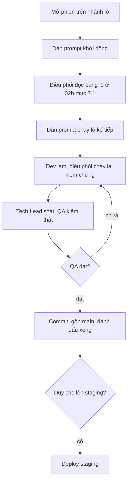

# Prompt dán sẵn cho Claude Code: Shop giao diện mới



> Cập nhật 11/10/2026. **Bảng lô chuẩn là `doc/features/2026-10-06-shop-giao-dien-moi/02b-tech-design.md` §7.1**
> (1-FE, 1-MKT, 1-BE · 2-FE, 2b-BE, 5a-MKT · 2b-ERP · 3+4-BE, 3+4-FE, 5b-MKT · 3b-BE, 3b-FE · 5c-MKT · 7).
> Lô 6 cũ đã xoá (chốt 10/10), chip "Tìm nhiều" đã bỏ. URL Shop tiếng Anh: `/`, `/about/`, `/pages/?slug=`, `/blog/`, `/shop/…`.

Mở một phiên Claude Code trên repo `DuyduyFedev46/fish`. Mỗi lô một nhánh `shop/lo-<n>-<slug>` tách từ `main`.
Phiên chính là **điều phối viên**: giao việc cho `fe-dev` / `be-dev` / `mkt-brand`, tự chạy lại lệnh kiểm chứng, rồi gọi
`techlead` review và `qa-tester` kiểm (quy trình lô trong `CLAUDE.md`).

---

## Prompt 0: khởi động (dán đầu tiên ở mỗi phiên mới)
```
Mình là Duy. Việc của phiên này là code Shop mới theo thiết kế trong doc/design/shop/.
Trước khi làm gì, đọc theo thứ tự: CLAUDE.md, doc/design/shop/README.md, UI-RULES.md, COMPONENTS.md, HUONG-DAN-CODE.md,
rồi doc/features/2026-10-06-shop-giao-dien-moi/02b-tech-design.md (§1 kiến trúc, §3 contract, §7 phiếu giao việc).
Báo mình 5 dòng: lô nào đang ☐ tiếp theo trong 02b §7.1, điều kiện đầu vào đã đủ chưa, còn điểm dừng nào cần mình trả lời.
Chưa sửa code.
```

## Prompt chạy một lô
```
Chạy lô <mã lô, vd 3+4> trong doc/features/2026-10-06-shop-giao-dien-moi/02b-tech-design.md §7.1 theo quy trình lô của CLAUDE.md.
- Tạo nhánh shop/lo-<n>-<slug> từ main.
- Giao đúng người ở cột "Người", kèm mã story, danh sách file "Được sửa" và "Không được đụng" của dòng lô, contract ở 02b §3.
- Màn thiết kế của lô: tra bảng component → lô ở 02b §1.10 và doc/design/shop/README.md.
- Tự chạy lại lệnh kiểm chứng (HUONG-DAN-CODE.md §6 + cột "Kiểm chứng thêm"); techlead review; qa-tester kiểm 360 px và 1280 px, cả ca lỗi.
- APPROVED thì commit theo pathspec, message tiếng Việt có mã lô, gộp main, đánh ☑ ở 02b §7.1. Gặp điểm dừng của lô thì hỏi mình.
```

## Prompt lô 7: QA toàn luồng
```
Chạy lô 7 trong 02b §7.1: qa-tester chạy E2E toàn luồng ở 360 px và 1280 px, so với toàn bộ màn trong doc/design/shop/README.md
(đánh dấu từng màn PASS/FAIL), kiểm G1–G8 và grep không còn sellable_qty, phone_last4, OrderLookup, CountdownTimer.
Không deploy production khi mình chưa duyệt.
```

---

## Prompt sửa một màn lệch thiết kế (dùng bất cứ lúc nào)
```
Màn <route> đang lệch thiết kế doc/design/shop/screens/<file>.dc.html ở: <mô tả>.
Giao fe-dev sửa đúng theo thiết kế và UI-RULES.md. Chụp lại 360 px và 1280 px trước/sau. Không đổi file khác ngoài component của màn đó.
```
