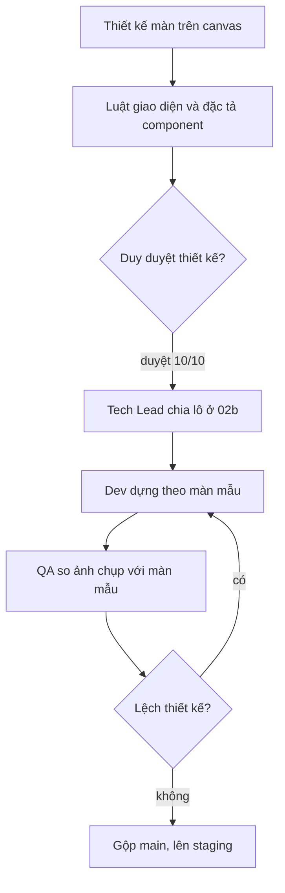

# Thiết kế Shop Cá Về (bản thiết kế 06/10/2026, Duy chốt 10/10/2026)

- **Canvas gốc** (xem trực quan, bấm thử được): https://claude.ai/artifact/SPSQLR5rMEtuBFreYbK96J
- `screens/*.dc.html`: HTML tĩnh, style inline. Mở bằng trình duyệt để xem. Icon và font cần mạng. Thẻ `<sc-if>`, `<sc-for>`, `{{…}}` và khối `<script type="text/x-dc">` là cú pháp của canvas, khi code thì thay bằng state React. Dev đọc cấu trúc, khoảng cách, màu và chữ từ HTML.
- `canvas.json`: vị trí và tên từng màn trên canvas.
- **Luật bắt buộc: `UI-RULES.md`.** Đặc tả từng component (47 cái: giải phẫu, biến thể, trạng thái, props, a11y): **`COMPONENTS.md`**, kèm 7 bảng hình `screens/CMP-*.dc.html`. Cách code: `HUONG-DAN-CODE.md`. Chia lô: `PLAN.md`. Prompt dán cho Claude Code: `PROMPT.md`.
- Số chuẩn (token, chiều cao, bo góc, bóng, chuyển động): `SO-CHUAN.md`. Báo cáo soát độ đủ: `doc/archive/design-shop/AUDIT-DO-DU.md` (đã lưu trữ 11/10, câu mở đã trả lời 10–11/10). Báo cáo dựng và chụp từng màn (lỗi hiển thị đã sửa, chiều cao): `doc/archive/design-shop/RENDER-AUDIT.md` (đã lưu trữ).
- Đối chiếu thiết kế với code và backend hiện tại: `DOI-CHIEU-CODE.md` (Tech Lead, 06/10).
- Dữ liệu trên thiết kế là **dữ liệu giả**. Ô có ngoặc vuông `[…]` là chỗ chờ số liệu thật. Ô "LOGO" chờ file Duy upload.

## Cách đọc
- Mỗi luồng là một hàng: màn đầu là **happy case**, các màn sau là **lỗi hoặc ngoại lệ** của bước đó.
- Tên có `[Popup]` hoặc `[Toast]`: lớp phủ nằm trên màn cha. Trên điện thoại là bottom sheet, dialog hoặc toast; trên máy tính là hộp thoại giữa màn.
- Một trang Next.js responsive phục vụ cả bản điện thoại (390 px) và bản máy tính (1280 px). Hai bộ màn là hai khổ của cùng một trang.
- Mã E-0x khớp bảng ngoại lệ trong `doc/business-process-spec.md`.

## Chốt của Duy trong đợt thiết kế này (06/10/2026), cần ghi `doc/decisions.md` ở lô 0
1. Bố cục bán lẻ kiểu Long Châu. Token giữ theo `DESIGN.md` (một màu nhấn `#1F66D1`).
2. Giá theo kg, **tối thiểu 1 kg**, bước 0,5 kg (bước 0,5 do thiết kế đề xuất, chờ Duy xác nhận). Combo tính theo combo.
3. Tồn kho chỉ hiện "Còn hàng / Sắp hết / Hết", **không hiện số kg**. Hết hàng thì hiện nút **"Liên hệ chúng tôi"**.
4. Không hiện ngày nhập lô.
5. Bỏ hoá đơn điện tử.
6. Shop không hiện luồng hoàn tiền. Đơn huỷ sau khi đã trả tiền ghi "Cá Về sẽ gọi cho bạn".
7. Địa chỉ giao là **một ô**, có nút mở **Google Maps** để tìm, ghim rồi tự điền. Duy đồng ý gửi địa chỉ cho Google; chính sách quyền riêng tư phải nêu việc này.
8. Thanh toán xong thì vào thẳng **trang đơn hàng, cũng là trang tra cứu đơn**. Không có màn "thành công" riêng.
9. Phương thức thanh toán chỉ ghi phương thức (chuyển khoản quét mã QR), **không ghi tên nhà cung cấp cổng thanh toán**.
10. **Có ô nhập mã giảm giá** ở giỏ hàng (Duy chốt 07/10), mỗi đơn tối đa 1 mã. **Lật quyết định cũ "không mã giảm giá"** (`decisions.md` dòng 98, BR-DM-08, URD) nên lô 0 phải ghi quyết định mới. Mặc định thiết kế: không cộng dồn với ưu đãi tự động, lấy cái lợi hơn cho khách (chờ Duy xác nhận).
11. Trang đơn hàng công khai **không hiện người nhận** (tên, số điện thoại, địa chỉ), theo bất biến 9. Mã đơn giữ dạng `SO…` như code.

## Chốt thêm ngày 10/10/2026 (đã ghi `doc/decisions.md` mục "2026-10-10 (tối)")
Nguồn: `doc/features/2026-10-06-shop-giao-dien-moi/01-analysis.md` §11 (nhóm A + V-01…V-12, Duy duyệt). BR mới ở `doc/business-process-spec.md`.
Khi màn `screens/*.dc.html` khác các điểm dưới đây thì **theo điểm dưới đây**; màn sẽ được ux-designer sửa (danh sách ở `01-analysis.md` mục "Màn cần ux-designer sửa").
- Chốt 2 xác nhận **bước 0,5 kg** (BR-BH-22). Chốt 10 xác nhận **không cộng dồn**, lấy lợi hơn, hoà thì giữ ưu đãi tự động; mã công khai, giới hạn tổng lượt, 1 mã/đơn; quyền tạo mã `manage_voucher` chỉ Chủ, uỷ được (BR-DM-17…24).
- Chốt 5 đọc là: Shop **không thu thông tin và không hiển thị** hoá đơn điện tử; nghĩa vụ lập hoá đơn ở hậu trường chốt cùng kế toán. Không ghi "Cá Về không xuất hoá đơn".
- **Phí giao:** bỏ dòng "Phí giao: Báo khi xác nhận đơn". Dưới Tổng ghi "Đã gồm giao hàng. Bạn trả một lần, không trả thêm khi nhận hàng." (BR-BH-30). Khu vực giao: chờ Duy (S-08).
- **Bỏ** dải chip "Tìm nhiều", nút "Vị trí của tôi", nút "Huỷ đơn" ở màn thanh toán, ô "Lô mới về".
- Ô đồng ý **không tick sẵn**; popup bản đồ có dòng thông báo gửi dữ liệu tới Google ngay khi mở (BR-BH-29).
- Tra đơn bằng mã + SĐT đầy đủ hoặc mã tra đơn tạm (BR-BH-25). BottomNav hiện ở Trang chủ, Danh mục, Góc bếp, Tra cứu đơn.
- Trang `terms` tên **"Điều kiện giao dịch chung"** (không "Điều khoản sử dụng"). Biểu tượng thông báo Bộ Công Thương chỉ gắn khi có link.
- Đơn huỷ sau khi đã trả: theo BR-HT-12 (câu A/B và thời hạn chờ Duy, S-12).
- Không cấu trúc lại thư mục code đợt này.

## Danh mục màn (93 bảng: 86 màn + 7 bảng component)

### Điện thoại · A Chọn hàng

| File | Màn | Khổ |
|---|---|---|
| `screens/Home.dc.html` | A1 · Happy · Trang chủ | 390×2310 |
| `screens/Main.dc.html` | A2 · Happy · Danh mục | 390×844 |
| `screens/Product.dc.html` | A3 · Happy · Chi tiết sản phẩm | 390×1330 |
| `screens/A4-Toast.dc.html` | A4 · [Popup] Đã thêm vào giỏ | 390×844 |
| `screens/A5-NotFound.dc.html` | A5 · Lỗi · Tìm không thấy | 390×844 |
| `screens/A6-Offline.dc.html` | A6 · Lỗi · Mất mạng, không tải được hàng | 390×844 |
| `screens/A7-OutOfStock.dc.html` | A7 · Ngoại lệ · Sản phẩm tạm hết | 390×844 |
| `screens/A0-Loading.dc.html` | A8 · Trạng thái · Đang tải | 390×844 |
| `screens/A8-SearchSuggest.dc.html` | A9 · [Popup] Gợi ý khi gõ tìm | 390×844 |
| `screens/A9-ComboDetail.dc.html` | A10 · Happy · Chi tiết combo | 390×1040 |

### Điện thoại · B Giỏ hàng & mã giảm giá

| File | Màn | Khổ |
|---|---|---|
| `screens/Cart.dc.html` | B1 · Happy · Giỏ hàng | 390×844 |
| `screens/B2-RemoveConfirm.dc.html` | B2 · [Popup] Xác nhận bỏ món | 390×844 |
| `screens/B3-CartChanged.dc.html` | B3 · Ngoại lệ · Giá đổi / món đã hết trong giỏ | 390×844 |
| `screens/B4-CartEmpty.dc.html` | B4 · Ngoại lệ · Giỏ trống | 390×844 |
| `screens/B5-VoucherSheet.dc.html` | B5 · [Popup] Nhập mã giảm giá | 390×844 |
| `screens/B6-VoucherApplied.dc.html` | B6 · Happy · Đã áp mã giảm giá | 390×844 |
| `screens/B7-VoucherError.dc.html` | B7 · Lỗi · Mã giảm giá không dùng được | 390×844 |

### Điện thoại · C Đặt hàng

| File | Màn | Khổ |
|---|---|---|
| `screens/Checkout.dc.html` | C1 · Happy · Thông tin nhận hàng | 390×844 |
| `screens/C1b-MapPicker.dc.html` | C1b · [Popup] Chọn vị trí trên Google Maps | 390×844 |
| `screens/C1c-AddressFilled.dc.html` | C1c · Happy · Địa chỉ tự điền từ bản đồ | 390×844 |
| `screens/C2-Invalid.dc.html` | C2 · Lỗi · Nhập thiếu / sai | 390×900 |
| `screens/C3-SoldOut.dc.html` | C3 · [Popup] Hết hàng lúc đặt (E-06) | 390×844 |
| `screens/C4-NetworkError.dc.html` | C4 · [Popup] Lỗi kết nối khi đặt | 390×844 |
| `screens/C5-LocationDenied.dc.html` | C5 · [Popup] Không lấy được vị trí / bản đồ lỗi | 390×844 |
| `screens/B8-VoucherInvalidAtOrder.dc.html` | C6 · [Popup] Mã hết hiệu lực lúc đặt | 390×844 |
| `screens/X2-ShopPaused.dc.html` | C7 · Ngoại lệ · Shop tạm ngưng nhận đơn | 390×1000 |
| `screens/X3-TooManyRequests.dc.html` | C8 · [Popup] Thao tác quá nhanh (429) | 390×844 |
| `screens/X4-PolicyChanged.dc.html` | C9 · [Popup] Chính sách vừa cập nhật (409) | 390×844 |

### Điện thoại · D Thanh toán

| File | Màn | Khổ |
|---|---|---|
| `screens/Payment.dc.html` | D1 · Happy · Thanh toán | 390×844 |
| `screens/D2-PayCancelled.dc.html` | D2 · Lỗi · Huỷ / lỗi trên cổng thanh toán → thanh toán lại | 390×844 |
| `screens/D3-PayPending.dc.html` | D3 · Ngoại lệ · Đang chờ xác nhận tiền | 390×844 |
| `screens/D4-Expired.dc.html` | D4 · [Popup] Hết giờ giữ hàng (E-01) | 390×844 |
| `screens/D5-Underpaid.dc.html` | D5 · Ngoại lệ · Chuyển thiếu tiền (E-02) | 390×844 |
| `screens/D6-LeavePayment.dc.html` | D6 · [Popup] Rời trang thanh toán? | 390×844 |

### Điện thoại · E Sau thanh toán

| File | Màn | Khổ |
|---|---|---|
| `screens/Success.dc.html` | E1 · Happy · Thanh toán xong → vào thẳng trang đơn hàng (tra cứu) | 390×920 |
| `screens/E2-Cancelled.dc.html` | E2 · Ngoại lệ · Đơn bị huỷ → Cá Về gọi lại (E-03, E-07) | 390×844 |
| `screens/E3-Delivered.dc.html` | E3 · Happy · Đơn đã giao | 390×844 |
| `screens/E4-DeliveryFailed.dc.html` | E4 · Ngoại lệ · Giao không thành công (E-08) | 390×844 |
| `screens/E5-PartialCancel.dc.html` | E5 · Ngoại lệ · Huỷ một phần đơn (E-07) | 390×1240 |
| `screens/E6-StatusRules.dc.html` | E6 · Đặc tả · Trạng thái đơn quyết định màn hiển thị | 1280×1706 |

### Điện thoại · F Tra cứu & trang phụ

| File | Màn | Khổ |
|---|---|---|
| `screens/F1-Lookup.dc.html` | F1 · Happy · Tra cứu đơn (mã + SĐT) | 390×844 |
| `screens/F2-LookupNotFound.dc.html` | F2 · Lỗi · Không tìm thấy đơn | 390×844 |
| `screens/P1-Policy.dc.html` | F3 · Trang chính sách (mẫu) | 390×1240 |
| `screens/P2-Contact.dc.html` | F4 · Trang liên hệ | 390×844 |
| `screens/P3-HowToBuy.dc.html` | F5 · Trang cách mua hàng | 390×880 |
| `screens/G1-KitchenList.dc.html` | F6 · Góc bếp · danh sách | 390×1360 |
| `screens/G2-KitchenArticle.dc.html` | F7 · Góc bếp · bài viết | 390×2290 |
| `screens/X1-NotFound404.dc.html` | F8 · Lỗi · Không tìm thấy trang (404) | 390×844 |

### Máy tính · luồng mua

| File | Màn | Khổ |
|---|---|---|
| `screens/DesktopHome.dc.html` | Happy · 1 · Trang chủ | 1280×2040 co giãn |
| `screens/DesktopCategory.dc.html` | Happy · 2 · Danh mục | 1280×1370 co giãn |
| `screens/DesktopProduct.dc.html` | Happy · 3 · Chi tiết sản phẩm | 1280×1630 co giãn |
| `screens/DesktopCart.dc.html` | Happy · 4 · Giỏ hàng | 1280×800 co giãn |
| `screens/DesktopCheckout.dc.html` | Happy · 5 · Thông tin nhận hàng | 1280×800 co giãn |
| `screens/DesktopPayment.dc.html` | Happy · 6 · Thanh toán | 1280×800 co giãn |
| `screens/DesktopSuccess.dc.html` | Happy · 7 · Đơn hàng (sau thanh toán) | 1280×1310 co giãn |

### Máy tính · popup

| File | Màn | Khổ |
|---|---|---|
| `screens/DesktopModalSoldOut.dc.html` | [Popup] Hết hàng lúc đặt (E-06) | 1280×800 |
| `screens/DesktopModalExpired.dc.html` | [Popup] Hết giờ giữ hàng (E-01) | 1280×800 |
| `screens/DesktopMapPicker.dc.html` | [Popup] Chọn vị trí trên Google Maps | 1280×800 |
| `screens/DesktopSearchSuggest.dc.html` | [Popup] Gợi ý khi gõ tìm | 1280×800 |
| `screens/DesktopRemoveConfirm.dc.html` | [Popup] Xác nhận bỏ món | 1280×800 |
| `screens/DesktopNetworkError.dc.html` | [Popup] Lỗi kết nối khi đặt | 1280×800 |
| `screens/DesktopLeavePayment.dc.html` | [Popup] Rời trang thanh toán? | 1280×800 |

### Máy tính · lỗi & ngoại lệ

| File | Màn | Khổ |
|---|---|---|
| `screens/DesktopNotFound.dc.html` | Lỗi · Tìm không thấy | 1280×1140 co giãn |
| `screens/DesktopOutOfStock.dc.html` | Ngoại lệ · Sản phẩm hết hàng | 1280×1530 co giãn |
| `screens/DesktopInvalid.dc.html` | Lỗi · Nhập thiếu / sai | 1280×860 co giãn |
| `screens/DesktopPayCancelled.dc.html` | Lỗi · Thanh toán chưa thành công | 1280×800 co giãn |
| `screens/DesktopPayPending.dc.html` | Ngoại lệ · Đang chờ xác nhận tiền | 1280×800 co giãn |
| `screens/DesktopLookup.dc.html` | Lỗi · Tra cứu không thấy đơn | 1280×1140 co giãn |
| `screens/DesktopToast.dc.html` | [Toast] Đã thêm vào giỏ + giỏ mini | 1280×1370 co giãn |
| `screens/DesktopLoading.dc.html` | Trạng thái · Đang tải | 1280×1300 co giãn |
| `screens/DesktopOffline.dc.html` | Lỗi · Mất mạng | 1280×980 co giãn |
| `screens/DesktopComboDetail.dc.html` | Happy · Chi tiết combo | 1280×1390 co giãn |
| `screens/DesktopCartChanged.dc.html` | Ngoại lệ · Giỏ đổi giá / món hết | 1280×800 co giãn |
| `screens/DesktopUnderpaid.dc.html` | Ngoại lệ · Chuyển thiếu tiền (E-02) | 1280×800 co giãn |
| `screens/DesktopVoucher.dc.html` | Mã giảm giá · đã áp / lỗi | 1280×660 co giãn |
| `screens/DesktopShopPaused.dc.html` | Ngoại lệ · Shop tạm ngưng nhận đơn | 1280×750 co giãn |

### Máy tính · đơn hàng & trang phụ

| File | Màn | Khổ |
|---|---|---|
| `screens/DesktopOrderStates.dc.html` | Đơn hàng · Đã giao / Giao không thành công / Bị huỷ | 1280×1750 co giãn |
| `screens/DesktopPolicy.dc.html` | Trang chính sách + cách mua hàng | 1280×1680 co giãn |
| `screens/DesktopContact.dc.html` | Trang liên hệ | 1280×970 co giãn |
| `screens/DesktopKitchenList.dc.html` | Góc bếp · danh sách | 1280×1410 co giãn |
| `screens/DesktopKitchenArticle.dc.html` | Góc bếp · bài viết | 1280×1620 co giãn |
| `screens/DesktopNotFound404.dc.html` | Lỗi · Không tìm thấy trang (404) | 1280×1090 co giãn |

### Đặc tả header/footer & landing

| File | Màn | Khổ |
|---|---|---|
| `screens/HeaderFooter-Mobile.dc.html` | Header & footer · điện thoại (đặc tả từng link) | 880×3000 |
| `screens/HeaderFooter-Desktop.dc.html` | Header & footer · máy tính (đặc tả từng link) | 1280×2510 |
| `screens/Landing.dc.html` | Landing page — giới thiệu thương hiệu | 1280×3250 co giãn |
| `screens/LandingMobile.dc.html` | Landing page — điện thoại | 390×4190 |

### Bảng component (biến thể × trạng thái × thông số)

| File | Màn | Khổ |
|---|---|---|
| `screens/CMP-1-Tokens.dc.html` | Component · 1 · Token (màu, chữ, khoảng cách, bo góc, bóng, chuyển động, icon) | 1280×4760 |
| `screens/CMP-2-Buttons.dc.html` | Component · 2 · Nút, chip, link, công tắc | 1280×4600 |
| `screens/CMP-3-Inputs.dc.html` | Component · 3 · Ô nhập, địa chỉ, tìm kiếm, tóm tắt lỗi | 1280×5940 |
| `screens/CMP-4-Product.dc.html` | Component · 4 · Thẻ sản phẩm, nhãn tồn, giá, bộ tăng giảm | 1280×7420 |
| `screens/CMP-5-Cart-Order.dc.html` | Component · 5 · Giỏ, thanh toán, đơn hàng | 1280×8890 |
| `screens/CMP-6-Navigation.dc.html` | Component · 6 · Header, điều hướng, footer | 1280×9950 |
| `screens/CMP-7-Overlay-Feedback.dc.html` | Component · 7 · Popup, toast, banner, trạng thái | 1280×11770 |
