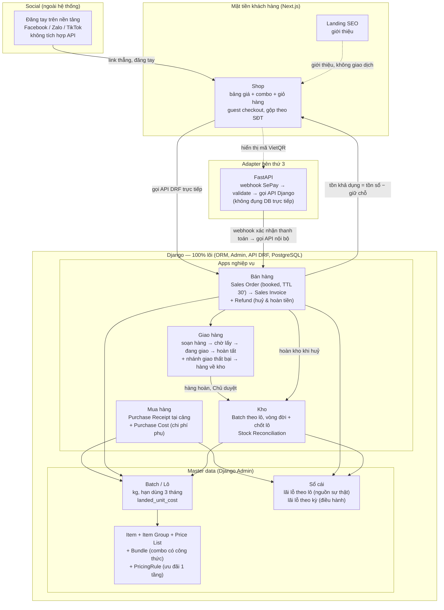

# Level 1 — Ecosystem tổng thể (bản cập nhật 2026-09-10)

Cập nhật sau Level 3 (`business-process-spec.md`): thêm Combo/Ưu đãi, Chi phí mua hàng (landed cost), Hoàn tiền, Hàng hoàn về kho, bước Soạn hàng.

## 1. Platform lõi — Django 100%
Django làm toàn bộ lõi: ORM, migration, Admin panel (back-office cho Lộc/nhân viên — ưu tiên dùng Admin có sẵn hơn tự build CRUD), API (DRF) phục vụ Next.js trực tiếp. Item Master + Item Group + Price List (niêm yết, lưu lịch sử giá theo mùa) + cấu hình Combo và Ưu đãi. Batch/lô là đơn vị vận hành chính — kg, hạn dùng mặc định 3 tháng, có giá vốn sau phân bổ chi phí phụ. Sổ cái tính lãi lỗ theo lô.

## 2. Apps nghiệp vụ (trong Django, tách theo domain)
**Mua hàng** — Purchase Receipt trực tiếp tại cảng (không qua PO), Purchase Invoice tách riêng, Purchase Cost phân bổ chi phí phụ vào giá vốn lô. **Bán hàng** — Sales Order giữ chỗ 30 phút → Sales Invoice khi xác nhận thanh toán; Refund cho huỷ & hoàn tiền (toàn phần/một phần). **Giao hàng** — Delivery Note gồm bước soạn hàng, gán nhân viên nội bộ, có nhánh giao thất bại → hàng về kho chờ Chủ duyệt. **Kho** — Batch với vòng đời và thao tác chốt lô, Stock Reconciliation kiểm kê định kỳ. Mỗi app độc lập (model/admin/API/migration riêng).

## 3. Adapter bên thứ 3 — FastAPI
Lớp mỏng, chỉ tồn tại để cô lập lõi khỏi bên ngoài. Hiện tại: nhận webhook SePay → validate/transform → gọi vào API nội bộ Django. Không đụng DB/ORM trực tiếp. Không bên thứ 3 nào được nối thẳng vào Django — nguyên tắc áp dụng cho mọi tích hợp tương lai, không riêng SePay.

## 4. Mặt tiền khách hàng
Next.js. Landing và Shop tách biệt. Guest checkout, không đăng nhập ở V1 — khách gộp theo số điện thoại, tra đơn bằng mã đơn + 4 số cuối SĐT. **100% đơn hàng giao tận nhà — không có bán tại quầy.**

## 5. Social — ngoài hệ thống, không tích hợp
Đăng tay trên từng nền tảng bằng công cụ có sẵn (Facebook/Zalo/TikTok), dẫn link thẳng vào Shop, không bán trên social. Không có API/OAuth/scheduler nào được xây trong hệ thống cho Social. Nếu cần đo hiệu quả kênh, dùng UTM param trên link + analytics phía Shop.

## 6. Thanh toán & hoàn tiền
VietQR qua SePay (chọn tạm — Duy tự xác nhận điều kiện/phí trước khi ký). Webhook qua adapter FastAPI, tự động xác nhận, khớp TTL 30 phút của Sales Order booked. **Chiều ngược lại không có**: SePay theo mô hình tiền vào thẳng tài khoản người bán, tài liệu API không có hoàn tiền/chuyển tiền đi (đã kiểm chứng 10/09) → hoàn tiền là chuyển khoản tay của Lộc, hệ thống chỉ ghi sổ qua entity `Refund` (có sẵn field `method` để sau này cắm cổng khác vào).

## 7. Nguyên tắc xuyên suốt
Hạn chế tối đa nhập liệu thủ công. Master data làm chuẩn — ưu tiên công cụ có sẵn (Django Admin) hơn tự build. Đơn giản/dễ 1 mình maintain hơn chính xác tuyệt đối, phù hợp quy mô 1 điểm bán. Bên thứ 3 luôn qua lớp adapter, không nối thẳng lõi. Build mới bằng Django, không fork Frappe/ERPNext (chỉ tham chiếu doctype). Phân quyền theo bản chất việc: nhân viên làm việc vật lý, Chủ giữ mọi thứ đụng tới tiền và giá vốn.

## Câu hỏi mở đang treo
1. Lộc xác nhận combo thực tế bán ở dạng nào (3 dạng ở `business-process-spec.md` mục 3.1).
2. Lộc xác nhận mua tại cảng có gối đầu không — gối đầu thì phải mở lại công nợ nhà cung cấp.
3. Lộc cho ngưỡng thời gian ngoài chuỗi lạnh để quyết định tái nhập hay huỷ hàng hoàn.
4. Xác nhận lại mục tiêu nghiệp vụ suy luận ở `URD.md` mục 2.2.
5. Cơ chế xác thực nội bộ giữa FastAPI và Django (service token) — để lại lúc build.
6. Duy xác nhận điều kiện/phí SePay trực tiếp với nhà cung cấp trước khi ký.
7. **Nợ tài liệu**: `doctype-mapping.md` lỗi thời (còn ghi bỏ Sales Order / Delivery Note) và thiếu 6 thực thể mới — viết lại trước khi dịch sang Django models.
