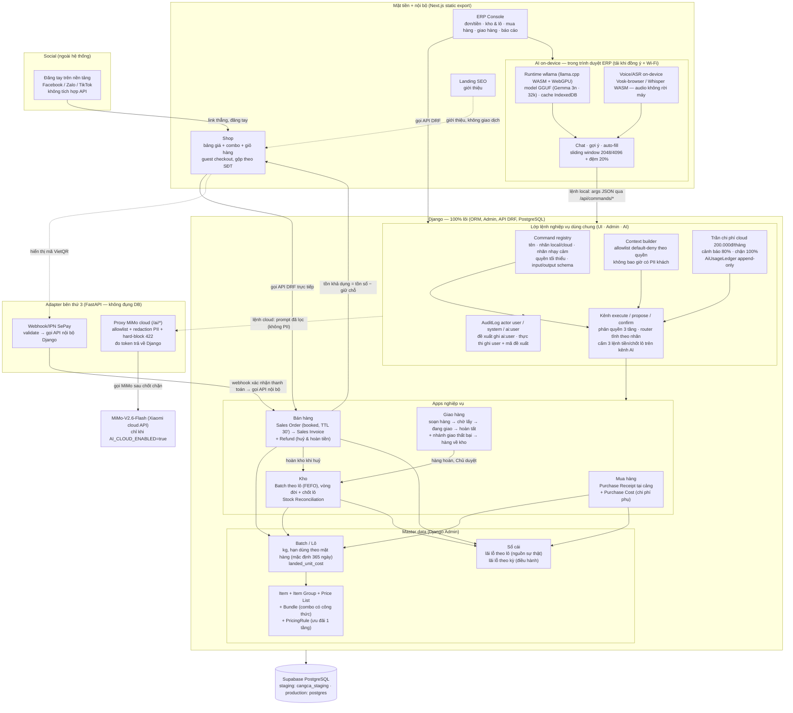

# Level 1 — Ecosystem tổng thể (bản có AI Native, cập nhật 2026-09-27)

Bản 2026-09-10: cập nhật sau Level 3 (`business-process-spec.md`) — thêm Combo/Ưu đãi, Chi phí mua hàng (landed cost), Hoàn tiền, Hàng hoàn về kho, bước Soạn hàng.

Bản này (có AI Native): thêm ERP console, adapter IPN SePay, 2 môi trường Supabase (staging `cangca_staging` / production `postgres`), và lớp AI Native — runtime on-device **wllama + GGUF** trong trình duyệt ERP + **lớp lệnh nghiệp vụ dùng chung** (Command registry, kênh execute/propose/confirm, context builder lọc theo quyền, AiUsageLedger, AuditLog `ai:<user>`) + **proxy MiMo cloud** ở adapter. Chi tiết: `doc/features/2026-09-27-ai-native-erp/02b-tech-design.md`.

```mermaid
flowchart TB
    subgraph FRONT["Mặt tiền + nội bộ (Next.js static export)"]
        LANDING["Landing SEO<br/>giới thiệu"]
        SHOP["Shop<br/>bảng giá + combo + giỏ hàng<br/>guest checkout, gộp theo SĐT"]
        ERP["ERP Console<br/>đơn/tiền · kho & lô · mua hàng · giao hàng · báo cáo"]
        subgraph AIONDEV["AI on-device — trong trình duyệt ERP (tải khi đồng ý + Wi-Fi)"]
            WLLAMA["Runtime wllama (llama.cpp WASM + WebGPU)<br/>model GGUF (Gemma 3n · 32k) · cache IndexedDB"]
            ASR["Voice/ASR on-device<br/>Vosk-browser / Whisper WASM — audio không rời máy"]
            CHAT["Chat · gợi ý · auto-fill<br/>sliding window 2048/4096 + đệm 20%"]
        end
    end

    subgraph SOC["Social (ngoài hệ thống)"]
        SOCIAL["Đăng tay trên nền tảng<br/>Facebook / Zalo / TikTok<br/>không tích hợp API"]
    end

    subgraph ADAPTER["Adapter bên thứ 3 (FastAPI — không đụng DB)"]
        SEPAY["Webhook/IPN SePay<br/>validate → gọi API nội bộ Django"]
        MIMOPROXY["Proxy MiMo cloud (/ai/*)<br/>allowlist + redaction PII + hard-block 422<br/>đo token trả về Django"]
    end

    subgraph CORE["Django — 100% lõi (ORM, Admin, API DRF, PostgreSQL)"]
        subgraph CMDS["Lớp lệnh nghiệp vụ dùng chung (UI · Admin · AI)"]
            REG["Command registry<br/>tên · nhãn local/cloud · nhãn nhạy cảm<br/>quyền tối thiểu · input/output schema"]
            EXEC["Kênh execute / propose / confirm<br/>phân quyền 3 tầng · router tĩnh theo nhãn<br/>cấm 3 lệnh tiền/chốt lô trên kênh AI"]
            CTX["Context builder<br/>allowlist default-deny theo quyền<br/>không bao giờ có PII khách"]
            BUDGET["Trần chi phí cloud 200.000đ/tháng<br/>cảnh báo 80% · chặn 100%<br/>AiUsageLedger append-only"]
            AUDIT["AuditLog actor user / system / ai:user<br/>đề xuất ghi ai:user · thực thi ghi user + mã đề xuất"]
        end
        subgraph APPS["Apps nghiệp vụ"]
            MUA["Mua hàng<br/>Purchase Receipt tại cảng<br/>+ Purchase Cost (chi phí phụ)"]
            BAN["Bán hàng<br/>Sales Order (booked, TTL 30') → Sales Invoice<br/>+ Refund (huỷ & hoàn tiền)"]
            GIAO["Giao hàng<br/>soạn hàng → chờ lấy → đang giao → hoàn tất<br/>+ nhánh giao thất bại → hàng về kho"]
            KHO["Kho<br/>Batch theo lô (FEFO), vòng đời + chốt lô<br/>Stock Reconciliation"]
        end
        subgraph MASTER["Master data (Django Admin)"]
            ITEM["Item + Item Group + Price List<br/>+ Bundle (combo có công thức)<br/>+ PricingRule (ưu đãi 1 tầng)"]
            BATCH["Batch / Lô<br/>kg, hạn dùng theo mặt hàng (mặc định 365 ngày)<br/>landed_unit_cost"]
            LEDGER["Sổ cái<br/>lãi lỗ theo lô (nguồn sự thật)<br/>lãi lỗ theo kỳ (điều hành)"]
        end
    end

    DB[("Supabase PostgreSQL<br/>staging: cangca_staging · production: postgres")]
    MIMOCLOUD["MiMo-V2.6-Flash (Xiaomi cloud API)<br/>chỉ khi AI_CLOUD_ENABLED=true"]

    SOCIAL -->|link thẳng, đăng tay| SHOP
    LANDING -.giới thiệu, không giao dịch.-> SHOP
    SHOP -->|gọi API DRF trực tiếp| BAN
    ERP -->|gọi API DRF| CMDS
    ERP --> AIONDEV
    WLLAMA --> CHAT
    ASR --> CHAT
    CHAT -->|lệnh local: args JSON qua /api/commands/*| CMDS

    BAN -->|tồn khả dụng = tồn sổ − giữ chỗ| SHOP
    SHOP -.hiển thị mã VietQR.-> SEPAY
    SEPAY -->|webhook xác nhận thanh toán → gọi API nội bộ| BAN

    REG --> EXEC
    EXEC --> APPS
    CTX --> EXEC
    BUDGET --> EXEC
    CMDS --> AUDIT
    CMDS -.lệnh cloud: prompt đã lọc (không PII).-> MIMOPROXY
    MIMOPROXY -->|gọi MiMo sau chốt chặn| MIMOCLOUD
    CORE --> DB

    MUA --> BATCH
    BAN --> BATCH
    GIAO -->|hàng hoàn, Chủ duyệt| KHO
    BAN -->|hoàn kho khi huỷ| KHO
    KHO --> BATCH
    BATCH --> ITEM
    MUA --> LEDGER
    BAN --> LEDGER
    KHO --> LEDGER
```

## 1. Platform lõi — Django 100%
Django làm toàn bộ lõi: ORM, migration, Admin panel (back-office cho Lộc/nhân viên — ưu tiên dùng Admin có sẵn hơn tự build CRUD), API (DRF) phục vụ Next.js trực tiếp. Item Master + Item Group + Price List (niêm yết, lưu lịch sử giá theo mùa) + cấu hình Combo và Ưu đãi. Batch/lô là đơn vị vận hành chính — kg, hạn dùng theo mặt hàng (mặc định 365 ngày), có giá vốn sau phân bổ chi phí phụ. Sổ cái tính lãi lỗ theo lô.

## 2. Apps nghiệp vụ (trong Django, tách theo domain)
**Mua hàng** — Purchase Receipt trực tiếp tại cảng (không qua PO), Purchase Invoice tách riêng, Purchase Cost phân bổ chi phí phụ vào giá vốn lô. **Bán hàng** — Sales Order giữ chỗ 30 phút → Sales Invoice khi xác nhận thanh toán; Refund cho huỷ & hoàn tiền (toàn phần/một phần). **Giao hàng** — Delivery Note gồm bước soạn hàng, gán nhân viên nội bộ, có nhánh giao thất bại → hàng về kho chờ Chủ duyệt. **Kho** — Batch với vòng đời và thao tác chốt lô, Stock Reconciliation kiểm kê định kỳ. Mỗi app độc lập (model/admin/API/migration riêng).

## 3. Adapter bên thứ 3 — FastAPI
Lớp mỏng, chỉ tồn tại để cô lập lõi khỏi bên ngoài. Hiện tại: nhận webhook SePay → validate/transform → gọi vào API nội bộ Django. Không đụng DB/ORM trực tiếp. Không bên thứ 3 nào được nối thẳng vào Django — nguyên tắc áp dụng cho mọi tích hợp tương lai, không riêng SePay.

Từ bản có AI Native (2026-09-27) adapter có vai trò thứ hai: **proxy MiMo cloud** (`/ai/*`, Xiaomi là bên thứ 3 thứ hai — cũng bắt buộc qua adapter). Prompt do Django dựng và đã lọc theo quyền (allowlist); adapter chặn lớp cuối trước khi dữ liệu rời máy chủ: loại field ngoài danh sách cho phép → che dữ liệu cá nhân (redaction) → **chặn cứng 422 nếu vẫn còn PII** (không một byte rời adapter), rồi mới gọi MiMo-V2.6-Flash; đo token trả về cho Django ghi sổ mức dùng. Adapter vẫn không đụng DB, không log nội dung prompt; route tắt bằng cấu hình `AI_ROUTE_ENABLED` (mặc định tắt — tiền lệ `SEPAY_BANK_WEBHOOK_ENABLED`).

## 4. Mặt tiền khách hàng
Next.js. Landing và Shop tách biệt. Guest checkout, không đăng nhập ở V1 — khách gộp theo số điện thoại, tra đơn bằng mã đơn + 4 số cuối SĐT. **100% đơn hàng giao tận nhà — không có bán tại quầy.**

**ERP console** (Next.js static export) là mặt tiền nội bộ của Chủ/nhân viên (đăng nhập token DRF, menu theo quyền). Từ bản có AI Native còn chứa **runtime AI on-device (wllama + GGUF)** chạy ngay trong trình duyệt: model chỉ tải khi người dùng đồng ý và đang Wi-Fi (không bao giờ tự tải qua 4G/5G), cache IndexedDB; voice/ASR xử lý on-device, audio không rời máy. Khách hàng trên Shop không có AI (AI Native chỉ trong ERP nội bộ).

## 5. Social — ngoài hệ thống, không tích hợp
Đăng tay trên từng nền tảng bằng công cụ có sẵn (Facebook/Zalo/TikTok), dẫn link thẳng vào Shop, không bán trên social. Không có API/OAuth/scheduler nào được xây trong hệ thống cho Social. Nếu cần đo hiệu quả kênh, dùng UTM param trên link + analytics phía Shop.

## 6. Thanh toán & hoàn tiền
VietQR qua SePay (chọn tạm — Duy tự xác nhận điều kiện/phí trước khi ký). Webhook qua adapter FastAPI, tự động xác nhận, khớp TTL 30 phút của Sales Order booked. **Chiều ngược lại không có**: SePay theo mô hình tiền vào thẳng tài khoản người bán, tài liệu API không có hoàn tiền/chuyển tiền đi (đã kiểm chứng 10/09) → hoàn tiền là chuyển khoản tay của Lộc, hệ thống chỉ ghi sổ qua entity `Refund` (có sẵn field `method` để sau này cắm cổng khác vào).

## 7. Nguyên tắc xuyên suốt
Hạn chế tối đa nhập liệu thủ công. Master data làm chuẩn — ưu tiên công cụ có sẵn (Django Admin) hơn tự build. Đơn giản/dễ 1 mình maintain hơn chính xác tuyệt đối, phù hợp quy mô 1 điểm bán. Bên thứ 3 luôn qua lớp adapter, không nối thẳng lõi. Build mới bằng Django, không fork Frappe/ERPNext (chỉ tham chiếu doctype). Phân quyền theo bản chất việc: nhân viên làm việc vật lý, Chủ giữ mọi thứ đụng tới tiền và giá vốn.

## 8. AI Native — lớp cộng thêm (bản có AI Native, 2026-09-27)

AI **không đổi luồng nghiệp vụ hiện có** — là kênh thao tác thứ ba (cạnh ERP console và Django Admin) đi qua **lớp lệnh nghiệp vụ dùng chung** trong Django: Command registry (tên lệnh, nhãn local/cloud, nhãn nhạy cảm cao/trung bình/thấp, quyền tối thiểu, input/output JSON schema) + kênh execute/propose/confirm + context builder lọc theo quyền (allowlist default-deny) + AuditLog phân biệt 3 actor `user`/`system`/`ai:<user>` + trần chi phí cloud 200.000đ/tháng (cảnh báo 80%, chặn 100%; AiUsageLedger append-only, chỉ Chủ xem). Router **tĩnh theo nhãn lệnh**: lệnh `local` chạy on-device (wllama — không bao giờ bị đẩy lên cloud), lệnh `cloud` qua adapter → MiMo-V2.6-Flash (công tắc `AI_CLOUD_ENABLED` mặc định tắt). AI có **đúng quyền người đăng nhập** (3 tầng phân quyền), hành động Tầng 2 luôn cần người xác nhận; AI không bao giờ tự chạy 3 lệnh tiền/chốt lô (`confirm_refund`, `confirm_payment_manual`, `close_batch`). Dữ liệu cá nhân khách không bao giờ vào prompt của model nào (chặn kỹ thuật ở adapter); tắt `AI_ENABLED` → hệ thống chạy 100% bằng thao tác tay. Hồ sơ đầy đủ: `doc/features/2026-09-27-ai-native-erp/` (ADR, phân tích, story, thiết kế kỹ thuật, research).

## Câu hỏi mở đang treo
1. Lộc xác nhận combo thực tế bán ở dạng nào (3 dạng ở `business-process-spec.md` mục 3.1).
2. Lộc xác nhận mua tại cảng có gối đầu không — gối đầu thì phải mở lại công nợ nhà cung cấp.
3. Lộc cho ngưỡng thời gian ngoài chuỗi lạnh để quyết định tái nhập hay huỷ hàng hoàn.
4. Xác nhận lại mục tiêu nghiệp vụ suy luận ở `URD.md` mục 2.2.
5. Cơ chế xác thực nội bộ giữa FastAPI và Django (service token) — để lại lúc build.
6. Duy xác nhận điều kiện/phí SePay trực tiếp với nhà cung cấp trước khi ký.
7. **Nợ tài liệu**: `doctype-mapping.md` lỗi thời (còn ghi bỏ Sales Order / Delivery Note) và thiếu 6 thực thể mới — viết lại trước khi dịch sang Django models.
