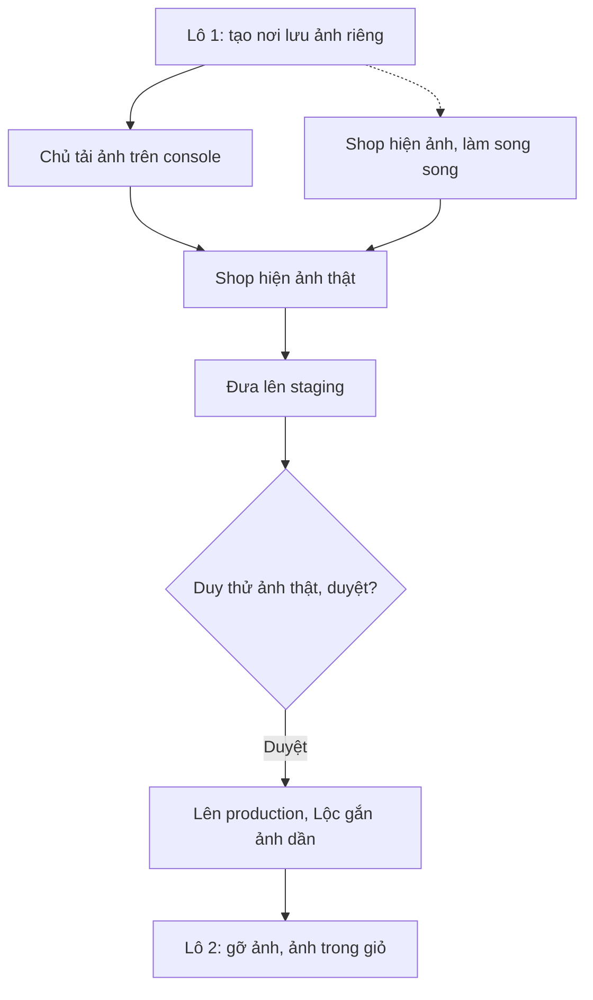

# Ảnh mặt hàng trên Shop — User stories
> PO · 2026-09-27 · Nguồn: 01-analysis.md (ĐÃ DUYỆT 2026-09-26) · Trạng thái: ĐÃ DUYỆT (Duy, 2026-09-27 — C1 5 USD/tháng, C2 chỉ ảnh Lộc chụp, C3 AuditLog là đủ: lấy mặc định)

> **Đổi kế hoạch (Duy, 2026-09-27):** "thê 1 ảnh vào mặt hàng, mặt hàng chưa có ảnh". Tính năng ảnh
> mặt hàng được **kéo lên làm ngay**, không chờ Đợt 3. **Q4 đổi thành "làm ngay, tách khỏi S38"**.
> S38 (hồ sơ `2026-09-24-erp-console-noi-that`) sau này chỉ thêm phần sửa tên, nhóm, hạn dùng, ẩn/hiện
> vào màn Danh mục mà hồ sơ này dựng. S38 không làm lại phần ảnh.
>
> Mã story dùng tiền tố **A** (A1…A5) để khỏi trùng với S1…S48 của hồ sơ console.



## Mục tiêu & thước đo
Khách trả tiền trước qua VietQR mà không nhìn thấy hàng thì khó tin. Hiện tại **không mặt hàng nào có ảnh**,
vì hệ thống chưa có chỗ lưu ảnh.
- **Đo thành công:** (1) sau khi lô 1 lên production, Chủ tự gắn ảnh cho mặt hàng trên console mà không cần
  dev hỗ trợ; (2) số mặt hàng đang bán còn thiếu ảnh (bộ lọc "Chưa có ảnh" ở A2) giảm về 0, hoặc Duy chấp nhận
  những mặt hàng còn lại dùng khung mặc định; (3) Shop không có khung ảnh vỡ hay trống nào.

## Phạm vi
**Trong:**
- Mỗi mặt hàng (kể cả combo) có **1 ảnh** (Q2).
- Chủ và Quản lý tải lên, thay, gỡ ảnh trên **ERP console**, bằng quyền Tầng 2 riêng `catalog.change_item_image` (Q3). Mọi thao tác ghi AuditLog.
- Kiểm tệp và xử lý ảnh: JPEG/PNG/WebP, cấm SVG, tối đa 10 MB, gỡ EXIF, cắt vuông 1:1, xuất 3 cỡ WebP, thay ảnh thì sinh URL mới (Q5–Q10).
- Ảnh lưu ở GCS `asia-southeast1`, **tách bucket staging và production**. Mỗi object đọc công khai; không cho liệt kê, không cho ghi từ ngoài.
- Shop hiện ảnh ở lưới danh mục và trang chi tiết. Mặt hàng chưa có ảnh hiện khung mặc định vẽ bằng code. Ảnh minh hoạ gắn nhãn.
- Giỏ và checkout có ảnh thu nhỏ (Could).

**Ngoài:** xem mục "Để sau".

## Định nghĩa chung dùng trong các story
- **Quyền mới** `catalog.change_item_image` (Tầng 2, khai ở `Item.Meta.permissions`). Data migration gán quyền này cho Group `chu` và `quan_ly`, không gán cho `nv_kho` và `nv_giao`. Quyền này **chỉ** mở API ảnh. Nó không mở `change_item`: Quản lý vẫn không sửa được tên, nhóm, hạn dùng, ẩn/hiện hay giá (spec §1.4 giữ nguyên).
- **Tham số trong settings/env, không hard-code:** `ITEM_IMAGE_BUCKET`, `ITEM_IMAGE_PUBLIC_BASE_URL`, `ITEM_IMAGE_MAX_BYTES` (mặc định 10 485 760), `ITEM_IMAGE_MIN_SIDE_WARN` (mặc định 600), `ITEM_IMAGE_SIZES` (mặc định thumb=160, card=480, detail=1200), `ITEM_IMAGE_STORAGE` (`gcs` | `local`, test và dev dùng `local`).
- **Ảnh thử trong test phải được sinh bằng code lúc chạy test** (ví dụ tạo bằng Pillow). **Không commit tệp ảnh nào vào git**, kể cả fixture (quy ước 2026-09-25, BR-DM-16).

---

## A1 — Nơi lưu ảnh bền vững, tách staging và production · Must · BE (hạ tầng)
**Là** Chủ vựa, **tôi muốn** ảnh mặt hàng được lưu ở nơi không mất khi hệ thống khởi động lại, và ảnh thử trên staging không lẫn sang Shop thật, **để** ảnh tải lên một lần là dùng lâu dài.

Bối cảnh: Q1, BR-DM-16, bảng môi trường ở `doc/ops/moi-truong.md`. Cloud Run chỉ có đĩa tạm, nên không lưu ảnh trên container được. Đây là **story nền**: người dùng chưa thấy gì, nhưng A2 và A4 phụ thuộc vào nó. Story nhỏ nên được tách riêng để QA kiểm cấu hình bảo mật bucket độc lập.

| Mã | Given | When | Then | BR |
|---|---|---|---|---|
| A1-AC1 | Hai bucket `cangca-item-images-keolai-staging` và `cangca-item-images-keolai` đã tạo ở `asia-southeast1` (tên cuối cùng BE chốt và ghi vào `moi-truong.md`) | `gcloud storage buckets describe` từng bucket | Location `ASIA-SOUTHEAST1`; bật uniform bucket-level access; `allUsers` chỉ có `roles/storage.legacyObjectReader` (quyền đọc từng object, **không** có `storage.objects.list`) | BR-DM-16, Q1 |
| A1-AC2 | Trong bucket có 1 object thử | Gọi không đăng nhập `GET https://storage.googleapis.com/<bucket>/<object>` | 200, trả đúng nội dung | Q1 |
| A1-AC3 (bảo mật) | Không đăng nhập | Gọi `GET https://storage.googleapis.com/<bucket>/` (liệt kê) và `PUT`/`POST` ghi một object mới | Liệt kê trả 401/403; ghi trả 401/403; bucket không đổi | Q1, BR-DM-10 |
| A1-AC4 (quyền) | Service account của `cangca-api-staging` | Ghi vào bucket **production** | 403. SA staging chỉ ghi được bucket staging; SA production chỉ ghi được bucket production. Mỗi SA chỉ có `roles/storage.objectCreator` trên bucket của mình, **không có quyền xoá** (BR-DM-14: ảnh cũ được giữ lại) | BR-DM-14 |
| A1-AC5 | `cangca-api-staging` và `cangca-api` | Đọc env | `ITEM_IMAGE_BUCKET` và `ITEM_IMAGE_PUBLIC_BASE_URL` trỏ đúng bucket của môi trường; không có khoá JSON nào trong image hay repo (dùng SA gắn sẵn với Cloud Run) | bất biến 7 |
| A1-AC6 | Máy dev và CI **không có** GCS | `manage.py test` với `ITEM_IMAGE_STORAGE=local` | Toàn bộ test ảnh chạy xanh, không gọi mạng ra GCS | 01-analysis §7 |
| A1-AC7 | Project `keolai-63ec1` | Mở Billing → Budgets | Có budget cảnh báo cho chi phí Cloud Storage ở mức Duy chốt (xem câu hỏi C1) | Q1 |

Ghi chú cho dev: object tải lên đặt `Cache-Control: public, max-age=31536000, immutable`, vì URL không bao giờ bị ghi đè (xem A2-AC4). Cập nhật bảng trong `doc/ops/moi-truong.md` thêm một dòng "Bucket ảnh". Việc tạo bucket và cấp IAM là thao tác hạ tầng, **không phải deploy**. Tuy vậy, tạo bucket production và gắn env cho `cangca-api` chỉ làm khi Duy duyệt deploy.

---

## A2 — Chủ hoặc Quản lý tải lên / thay ảnh mặt hàng trên console · Must · BE+FE
**Là** Chủ vựa (hoặc Quản lý), **tôi muốn** mở Danh mục trên console, chụp hoặc chọn một ảnh cho mặt hàng rồi lưu, **để** khách thấy hàng thật trên Shop.

Bối cảnh: UC-A1, UC-A5 (bộ lọc "Chưa có ảnh"), Q2, Q3, Q5–Q10. Màn `catalog` trên console hiện là Placeholder. Story này dựng **màn Danh mục tối thiểu** (`erp-console/features/catalog/`) gồm danh sách mặt hàng có ảnh thu nhỏ và khung ảnh của từng mặt hàng. Phần sửa tên, hạn dùng, ẩn/hiện vẫn thuộc S38. Lộc hay dùng điện thoại với 4G ở cảng, nên màn này phải dùng được trên điện thoại.

| Mã | Given | When | Then | BR |
|---|---|---|---|---|
| A2-AC1 | Chủ đăng nhập; mặt hàng `CA-THU` chưa có ảnh | Tải lên 1 tệp JPEG 3000×2000 kèm alt text trống | 201. Response có `image.urls.thumb/card/detail`, là 3 ảnh WebP vuông 160, 480 và 1200 px, cắt giữa. `image.alt` = tên mặt hàng. Console hiện ảnh ngay, không cần tải lại trang | BR-DM-09, BR-DM-10, BR-DM-11 |
| A2-AC2 | Như AC1 | Kiểm 3 tệp WebP trong bucket | Không có metadata EXIF hay GPS. Tệp gốc **không** nằm ở URL công khai nào, và response không trả đường dẫn tệp gốc | BR-DM-10 |
| A2-AC3 | Mặt hàng đang **ẩn** (`is_active=False`) | Chủ tải ảnh lên | 201. Chủ chuẩn bị ảnh trước khi mở bán được | UC-A1 |
| A2-AC4 | `CA-THU` đã có ảnh X | Quản lý tải ảnh Y lên (thay ảnh) | 200. Cả 3 URL của Y **khác** URL của X. Các URL của X vẫn tải được (giữ lại, không xoá cứng) | BR-DM-14, Q9 |
| A2-AC5 | Như AC1 hoặc AC4 | Kiểm `AuditLog` | Có đúng 1 dòng mới, action `item_image_add` (lần đầu) hoặc `item_image_replace` (thay), ghi người làm, mặt hàng và `changes` = {id ảnh trước → id ảnh sau, is_illustration trước → sau} | BR-DM-12, BR-PQ-04 |
| A2-AC6 | Tệp PNG 400×400 | Tải lên | 201, kèm `warnings` có mã `LOW_RESOLUTION`. Console hiện dòng "Ảnh nhỏ hơn 600 px, trên Shop có thể bị mờ". Hệ thống không phóng to ảnh: mọi cỡ ≤ 400 px | Q6 |
| A2-AC7 | Tệp WebP 4000×3000 (ảnh chụp thật sinh trong test) | Tải lên | Bản `card` ≤ 60 KB; bản `thumb` ≤ 15 KB | Q7 |
| A2-AC8 | Chủ tick "Ảnh minh hoạ" khi tải | Lưu | `image.is_illustration = true`; AuditLog ghi giá trị này | Q8 |
| A2-AC9 (lỗi) | Tệp SVG; tệp GIF; tệp PDF; tệp `.txt` đổi đuôi thành `.jpg`; tệp HEIC | Tải lên | 400, `code = "BR-DM-10"`, thông điệp tiếng Việt nêu các định dạng được nhận. Mặt hàng giữ nguyên ảnh cũ; không có object mới trong bucket; không có AuditLog | BR-DM-10 |
| A2-AC10 (lỗi) | Tệp 10 MB + 1 byte | Tải lên | 400, `code = "BR-DM-10"`, thông điệp "Ảnh vượt 10 MB" (con số lấy từ `ITEM_IMAGE_MAX_BYTES`). Không lưu gì | BR-DM-10 |
| A2-AC11 (lỗi) | Kho ảnh lỗi (giả lập storage ném lỗi khi ghi) | Tải lên | 503, `code = "BR-DM-16"`, "Chưa lưu được ảnh, thử lại". Mặt hàng giữ ảnh cũ; không có AuditLog | UC-A1 E5 |
| A2-AC12 (lỗi) | Mạng rớt giữa chừng khi đang gửi tệp | Console nhận lỗi mạng | Console báo "Tải ảnh chưa xong, ảnh cũ vẫn giữ nguyên" và có nút Thử lại. Phía máy chủ: mặt hàng không đổi, không có AuditLog | UC-A1 E4 |
| A2-AC13 (lỗi, ghi đè) | Chủ và Quản lý cùng mở `CA-THU` đang có ảnh X; Quản lý đã thay thành Y | Chủ gửi ảnh Z với `expected_image_id = X` | 409, `code = "BR-DM-12"`, "Ảnh vừa được người khác đổi, tải lại để xem". Ảnh vẫn là Y | UC-A1 E6 |
| A2-AC14 (quyền) | NV kho; NV giao; người chưa đăng nhập | Gọi `POST /api/catalog/items/{id}/image/` | 403 (NV kho, NV giao) / 401 (chưa đăng nhập). Không đổi dữ liệu. NV kho mở màn Danh mục thì thấy danh sách và ảnh nhưng **không có** nút Tải / Thay / Gỡ | BR-PQ-12, Q3 |
| A2-AC15 (quyền) | Quản lý có `change_item_image` | Gọi `PATCH /api/catalog/items/{id}/` đổi `name` hoặc `is_active` | 403, tên và trạng thái không đổi. Quyền ảnh không mở rộng sang sửa mặt hàng | Q3, spec §1.4 |
| A2-AC16 | Có 10 mặt hàng đang bán, trong đó 4 chưa có ảnh | Chủ bật bộ lọc "Chưa có ảnh" (`?has_image=false`) | Danh sách đúng 4 mặt hàng đó | UC-A5 |
| A2-AC17 | Chủ mở màn trên điện thoại rộng 375 px | Bấm "Tải ảnh" | Mở được chọn ảnh từ thư viện hoặc chụp bằng camera (`accept="image/jpeg,image/png,image/webp"`). Trong lúc gửi, nút bị khoá và có chỉ báo tiến trình; bấm hai lần không gửi hai lần | UC-A1 |
| A2-AC18 | Django Admin trang mặt hàng | Chủ mở | Thông tin ảnh chỉ đọc (xem trước). Admin không có đường tải ảnh bỏ qua bước kiểm tệp và AuditLog | BR-DM-10, BR-DM-12 |

Giá vốn: story không đụng dữ liệu giá. Response ảnh và danh sách mặt hàng **không** được thêm field giá hay lô nào (bất biến 1). BR-DM-15 (ảnh không lộ bảng giá hay hoá đơn NCC) là quy tắc vận hành: console hiện dòng nhắc cố định dưới nút tải: "Không chụp bảng giá, hoá đơn, tên đầu mối".

### Contract API — A2 (FE dựng mock theo đây)
Lỗi dùng định dạng chung `{"detail": "<tiếng Việt>", "code": "<mã>"}`. Xác thực theo cơ chế console hiện có. FE gửi `FormData` và **không tự đặt** header `Content-Type`.

**1. Tải lên hoặc thay ảnh**: `POST /api/catalog/items/{id}/image/` · quyền `catalog.change_item_image` · `multipart/form-data`

| Trường | Kiểu | Bắt buộc | Ghi chú |
|---|---|---|---|
| `file` | tệp | có | JPEG, PNG hoặc WebP; ≤ `ITEM_IMAGE_MAX_BYTES` |
| `alt_text` | chuỗi ≤ 125 ký tự | không | trống → tên mặt hàng |
| `is_illustration` | `true`/`false` | không | mặc định `false` |
| `expected_image_id` | chuỗi hoặc rỗng | không (FE luôn gửi) | id ảnh FE đang thấy; rỗng = FE thấy mặt hàng chưa có ảnh. Khác với trên máy chủ → 409 |

Response `201` (lần đầu) / `200` (thay ảnh):
```json
{
  "item_id": 12,
  "item_code": "CA-THU",
  "image": {
    "id": "img_7f3c9a1e",
    "alt": "Cá thu cắt khúc",
    "is_illustration": false,
    "urls": {
      "thumb":  "https://storage.googleapis.com/cangca-item-images-keolai-staging/items/12/img_7f3c9a1e/160.webp",
      "card":   "https://storage.googleapis.com/cangca-item-images-keolai-staging/items/12/img_7f3c9a1e/480.webp",
      "detail": "https://storage.googleapis.com/cangca-item-images-keolai-staging/items/12/img_7f3c9a1e/1200.webp"
    },
    "uploaded_at": "2026-09-27T10:15:00+07:00",
    "uploaded_by": "Lộc"
  },
  "warnings": [
    {"code": "LOW_RESOLUTION", "message": "Ảnh nhỏ hơn 600 px, trên Shop có thể bị mờ."}
  ]
}
```
`warnings` là mảng rỗng khi không có cảnh báo. `id` là chuỗi không đoán được, và mỗi lần tải lên sinh một `id` mới. Mẫu đường dẫn object do BE quyết; FE chỉ dùng `urls`.

| Mã HTTP | `code` | Khi nào |
|---|---|---|
| 400 | `BR-DM-10` | sai định dạng, nội dung không phải ảnh, vượt dung lượng, thiếu `file` |
| 400 | `BR-DM-11` | `alt_text` quá 125 ký tự |
| 401 | — | chưa đăng nhập |
| 403 | `BR-PQ-12` | không có `change_item_image` |
| 404 | — | không có mặt hàng |
| 409 | `BR-DM-12` | `expected_image_id` không khớp |
| 503 | `BR-DM-16` | không ghi được vào kho ảnh |

**2. Danh sách và chi tiết mặt hàng trên console**: `GET /api/catalog/items/` và `GET /api/catalog/items/{id}/` (endpoint đã có) thêm field `image` (object như trên, **bỏ** `uploaded_by`, hoặc `null`). Hỗ trợ lọc `?has_image=true|false`. Quyền giữ nguyên `catalog.view_item`.
```json
{"id": 12, "code": "CA-THU", "name": "Cá thu cắt khúc", "item_group": 3, "item_type": "SIMPLE",
 "is_active": true, "image": null}
```

Mock console (`features/catalog/mock.ts`) cần đủ 3 trạng thái: có ảnh, `image: null`, và ảnh có URL hỏng (để thử khung mặc định). Mock không trỏ tới tệp ảnh nào trong repo.

---

## A3 — Chủ hoặc Quản lý gỡ ảnh · Should · BE+FE
**Là** Chủ vựa (hoặc Quản lý), **tôi muốn** gỡ ảnh đã gắn nhầm, **để** Shop quay về khung mặc định thay vì hiện ảnh sai.

Bối cảnh: UC-A2. Should vì "thay ảnh" (A2) đã xử lý phần lớn trường hợp gắn nhầm; gỡ chỉ cần khi không có ảnh đúng để thay.

| Mã | Given | When | Then | BR |
|---|---|---|---|---|
| A3-AC1 | `CA-THU` có ảnh X | Chủ bấm "Gỡ ảnh", xác nhận | 204. `GET` mặt hàng trả `image: null`; Shop trả `image: null`. Các URL của X vẫn còn trong bucket (không xoá cứng) | BR-DM-09, BR-DM-14 |
| A3-AC2 | Như AC1 | Kiểm AuditLog | Đúng 1 dòng `item_image_remove`, ghi người làm, mặt hàng, `changes` = {id ảnh X → null} | BR-DM-12 |
| A3-AC3 | Mặt hàng đang có lô Đang bán | Bấm "Gỡ ảnh" | Hộp xác nhận ghi thêm "Mặt hàng đang bán, khách sẽ thấy khung mặc định". Xác nhận xong vẫn gỡ được | UC-A2 E1 |
| A3-AC4 (lỗi) | Mặt hàng chưa có ảnh | Gọi `DELETE …/image/` | 404, `code = "BR-DM-09"`, "Mặt hàng chưa có ảnh". Không có AuditLog | |
| A3-AC5 (lỗi, ghi đè) | Ảnh đã bị người khác thay từ X thành Y | Gọi `DELETE …/image/?expected_image_id=X` | 409, `code = "BR-DM-12"`. Ảnh Y giữ nguyên | UC-A1 E6 |
| A3-AC6 (quyền) | NV kho / NV giao | Gọi `DELETE …/image/` | 403, ảnh không đổi, không có AuditLog | BR-PQ-12 |

**Contract:** `DELETE /api/catalog/items/{id}/image/?expected_image_id=<id>` · quyền `catalog.change_item_image` → `204` không có body. Lỗi: 401, 403 `BR-PQ-12`, 404 (không có mặt hàng, hoặc `BR-DM-09` nếu chưa có ảnh), 409 `BR-DM-12`.

---

## A4 — Khách thấy ảnh hàng ở lưới danh mục và trang chi tiết · Must · BE+FE
**Là** Khách, **tôi muốn** thấy ảnh từng mặt hàng khi lướt Shop và khi mở chi tiết, **để** biết mình mua gì trước khi chuyển khoản.

Bối cảnh: UC-A3. `ShopCatalogView` và `ShopItemDetailView` hiện chưa trả ảnh; Shop dùng `` thường vì `images.unoptimized: true`. **Ảnh không phải điều kiện hiển thị**: mặt hàng chưa có ảnh vẫn bán bình thường (BR-DM-09). Phần BE nhỏ (thêm 1 field), nên gộp với FE thành một lát dọc.

| Mã | Given | When | Then | BR |
|---|---|---|---|---|
| A4-AC1 | `CA-THU` có ảnh, đang bán, có giá | `GET /api/shop/catalog/` và `GET /api/shop/catalog/CA-THU/` | Mỗi mặt hàng có field `image` = `{alt, is_illustration, urls:{thumb,card,detail}}`. **Không** có `id` ảnh, người tải, đường dẫn tệp gốc hay tên bucket nội bộ ngoài URL công khai | BR-DM-10, 01-analysis §7 |
| A4-AC2 | Mặt hàng đang bán, chưa có ảnh | `GET /api/shop/catalog/` | Mặt hàng **vẫn có** trong danh sách, `image: null` | BR-DM-09 |
| A4-AC3 | Lưới danh mục | Khách mở `/shop` | Mỗi thẻ hiện ảnh `urls.card`, khung vuông 1:1 giữ chỗ trước khi ảnh tải (không nhảy bố cục), `loading="lazy"`, `alt` = `image.alt`. Lưới **không** tải bản `detail` | UC-A3, Q6, Q7 |
| A4-AC4 | Trang chi tiết | Khách mở `/shop/item?code=CA-THU` | Hiện ảnh `urls.detail` trong khung vuông; giá và tồn hiển thị **không chờ** ảnh tải xong | UC-A3 E2 |
| A4-AC5 | Mặt hàng `image: null` | Mở lưới và trang chi tiết | Hiện **khung mặc định** vẽ bằng code (CSS hoặc icon cá nội tuyến, dùng màu theo `caveve-ui`), cùng kích thước khung ảnh thật, kèm tên nhóm hàng. Có `role="img"` và `aria-label` = tên mặt hàng. Trang **không phát request tải tệp ảnh nào** cho khung này | BR-DM-09, BR-DM-16, Q10 |
| A4-AC6 (lỗi) | `image.urls.card` trỏ tới object không tồn tại (404) | Mở lưới | Thẻ đó chuyển sang khung mặc định như AC5. Không có biểu tượng ảnh vỡ; nút "Thêm vào giỏ" vẫn dùng được | UC-A3 E1 |
| A4-AC7 | `image.is_illustration = true` | Mở lưới và chi tiết | Có nhãn chữ "Ảnh minh hoạ" đè lên góc ảnh, đọc được (tương phản ≥ 4.5:1) | Q8 |
| A4-AC8 | Combo `COMBO-LAU` có ảnh riêng; các thành phần có ảnh khác | Mở chi tiết combo | Hiện ảnh **của combo**, không tự lấy ảnh thành phần. Combo chưa có ảnh thì hiện khung mặc định | BR-DM-09 |
| A4-AC9 (giá vốn) | Có lô với `purchase_rate` và `landed_unit_cost` | Gọi 2 endpoint Shop, không đăng nhập | Response không có field giá vốn, lô hay nhà cung cấp nào (test so khớp tập khoá trả về đúng danh sách cho phép) | bất biến 1, BR-DM-15 |
| A4-AC10 (quyền) | Mặt hàng đang ẩn (`is_active=False`) nhưng đã có ảnh | Gọi `GET /api/shop/catalog/<code>/` | 404 như hiện tại. Có ảnh không làm lộ mặt hàng đang ẩn | UC-A1 |
| A4-AC11 | Chạy `NEXT_PUBLIC_USE_MOCK=1 npm run dev` | Mở `/shop` | Mock có đủ 3 trạng thái: có ảnh, `null`, URL hỏng. Repo không thêm tệp `.png/.jpg/.webp/.svg` nào (`git status` sạch các đuôi này) | BR-DM-16 |

### Contract API — A4
`GET /api/shop/catalog/` (mảng) và `GET /api/shop/catalog/{item_code}/` thêm field `image`:
```json
{
  "item_code": "CA-THU",
  "name": "Cá thu cắt khúc",
  "group": "Cá",
  "item_type": "SIMPLE",
  "unit": "Kg",
  "price": "185000",
  "sellable_qty": "12.500",
  "image": {
    "alt": "Cá thu cắt khúc",
    "is_illustration": false,
    "urls": {
      "thumb":  "https://storage.googleapis.com/cangca-item-images-keolai/items/12/img_7f3c9a1e/160.webp",
      "card":   "https://storage.googleapis.com/cangca-item-images-keolai/items/12/img_7f3c9a1e/480.webp",
      "detail": "https://storage.googleapis.com/cangca-item-images-keolai/items/12/img_7f3c9a1e/1200.webp"
    }
  }
}
```
Chưa có ảnh: `"image": null`. Mã lỗi không đổi so với hiện tại (404 khi không có hoặc đang ẩn). FE cập nhật `CatalogItem` trong `frontend/lib/types.ts` và cập nhật mục Shop API trong `doc/BUILD-PLAN.md`.

---

## A5 — Ảnh thu nhỏ trong giỏ và checkout · Could · FE
**Là** Khách, **tôi muốn** thấy ảnh nhỏ cạnh từng dòng trong giỏ và lúc thanh toán, **để** chắc mình chọn đúng món trước khi chuyển khoản.

Bối cảnh: UC-A3 bước 3. Could vì không có ảnh ở đây Khách vẫn đặt đúng (có tên hàng). Việc này rẻ: không cần API mới, chỉ lưu `urls.thumb` và `alt` vào dòng giỏ (`CartContext`, localStorage) lúc thêm vào giỏ.

| Mã | Given | When | Then | BR |
|---|---|---|---|---|
| A5-AC1 | Khách thêm `CA-THU` (có ảnh) vào giỏ | Mở giỏ và trang checkout | Mỗi dòng có ảnh `thumb` vuông 48–64 px, `alt` = tên hàng | UC-A3 |
| A5-AC2 | Giỏ cũ lưu trong localStorage từ trước khi có A5 (không có field ảnh) | Mở giỏ | Không lỗi; dòng đó hiện khung mặc định cỡ nhỏ | BR-DM-09 |
| A5-AC3 (lỗi) | Ảnh đã bị thay hoặc gỡ sau khi Khách thêm vào giỏ, URL cũ lỗi | Mở giỏ | Dòng đó chuyển sang khung mặc định, tổng tiền và nút đặt hàng không bị ảnh hưởng | UC-A3 E1 |
| A5-AC4 (không đổi luồng) | Giỏ có ảnh | Đặt hàng | Payload `POST` tạo đơn **không** gửi URL ảnh (giữ đúng `CreateOrderPayload` hiện tại) | BR-DM-13 |

---

## Thứ tự làm đề xuất và chia lô
| Lô | Story | Ai làm | Lý do |
|---|---|---|---|
| **Lô 1** (Must, cho Duy thấy ảnh chạy từ đầu đến cuối) | A1 → A2, A4 | BE: A1 → A2 → A4 (phần API). FE **song song ngay từ đầu** bằng mock: A4 (Shop) và A2 (màn Danh mục console) | A1 chặn phần BE của A2. A4 phía BE chỉ là thêm field, làm sau A2 để có dữ liệu thật. FE không phải chờ BE vì đã có contract |
| **Lô 2** | A3, A5 | BE+FE (A3), FE (A5) | Gỡ ảnh và ảnh trong giỏ là bổ sung; lô 1 đã đủ để Lộc bắt đầu gắn ảnh |

Deploy: staging trước (bucket staging), Duy thử tải vài ảnh thật từ điện thoại rồi duyệt production. Sau khi lô 1 lên production, Lộc gắn ảnh lần lượt, dùng bộ lọc "Chưa có ảnh" (UC-A5).

## Rủi ro / phụ thuộc
- **Phụ thuộc mới ở backend:** thư viện xử lý ảnh (đọc ảnh, gỡ EXIF, xuất WebP) và thư viện GCS. BE chọn và ghi lý do trong `03-dev-notes.md`. Image Docker phải có thư viện hệ thống để xuất WebP.
- **Schema (bất biến 8):** thêm dữ liệu ảnh (field trên `Item` hoặc model con) và quyền `change_item_image`, kèm migration và data migration gán Group. BE ghi lý do chọn cấu trúc trong `03-dev-notes.md`. Theo gợi ý của BA, nên chọn cấu trúc sau này mở rộng được lên nhiều ảnh mà không phải chuyển dữ liệu.
- **Ảnh đã gỡ hoặc đã thay vẫn truy cập được** qua URL cũ, vì BR-DM-14 giữ tệp 30 ngày và bucket không cho xoá. Rủi ro thấp: URL khó đoán và bucket không cho liệt kê. Việc dọn tệp sau 30 ngày để sau (xem dưới).
- **Tải ảnh lớn qua 4G:** tệp tới 10 MB có thể chậm ở cảng. Trên máy chủ không vỡ gì (A2-AC12), nhưng Lộc có thể phải chờ. Nếu thực tế chậm thì làm "thu nhỏ ảnh ngay trên máy trước khi gửi" (để sau).
- **HEIC:** chưa nhận (A2-AC9). iOS thường tự đổi sang JPEG khi chọn ảnh qua trình duyệt; QA kiểm trên iPhone thật ở staging.
- **Nội dung ảnh (BR-DM-15):** máy không kiểm được; chỉ có dòng nhắc trên console.
- Màn Danh mục console do A2 dựng sẽ là nền cho S38. Cần báo hồ sơ `2026-09-24-erp-console-noi-that` rằng phần "ảnh" trong câu story S38 đã chuyển sang đây.

## Để sau (ngoài phạm vi lần này)
- Job dọn tệp ảnh cũ sau 30 ngày (BR-DM-14): tệp vẫn giữ, chỉ chưa dọn tự động.
- Nhiều ảnh cho một mặt hàng, lướt ảnh; ảnh thành phần trong trang combo.
- Ảnh trong tra cứu đơn (`OrderLookup`), chi tiết đơn và phiếu soạn trên console (Q12).
- og:image theo từng mặt hàng (Q13); hiện `description` trên Shop (Q11); cảnh báo trên Tổng quan (Q14).
- Thu nhỏ ảnh trên máy trước khi gửi; nhận HEIC; CDN.
- Sửa tên, nhóm, hạn dùng, ẩn/hiện trên console: vẫn thuộc S38.

## Câu hỏi cho Duy
| # | Câu hỏi | Mặc định PO nếu Duy không trả lời |
|---|---|---|
| C1 | Mức cảnh báo billing cho ảnh (A1-AC7) là bao nhiêu mỗi tháng? | Budget **5 USD/tháng** cho cả project, cảnh báo ở 50%, 90% và 100%, gửi tới email quản trị billing hiện có của project |
| C2 | Đợt đầu Lộc dùng ảnh tự chụp hay có mặt hàng phải dùng ảnh minh hoạ? Nếu dùng minh hoạ, nguồn nào có quyền sử dụng? | Chỉ dùng ảnh Lộc chụp; thiếu ảnh thì dùng khung mặc định |
| C3 | Chủ **và** Quản lý đều tải được ảnh (Q3). Có muốn Chủ nhận thông báo khi Quản lý đổi ảnh không, hay xem AuditLog là đủ? | Xem AuditLog là đủ (màn Nhật ký thuộc S43) |

---
## Định nghĩa hoàn thành (chung)
Test BE xanh (`manage.py test apps.catalog` và toàn bộ), `frontend` và `erp-console` build sạch (`tsc --noEmit`), QA report APPROVED, không rò giá vốn, repo không thêm tệp ảnh, `doc/ops/moi-truong.md` và `doc/BUILD-PLAN.md` được cập nhật, các BR-DM-09…16 được chép từ 01-analysis vào `doc/business-process-spec.md` §P-01 khi Duy duyệt.
