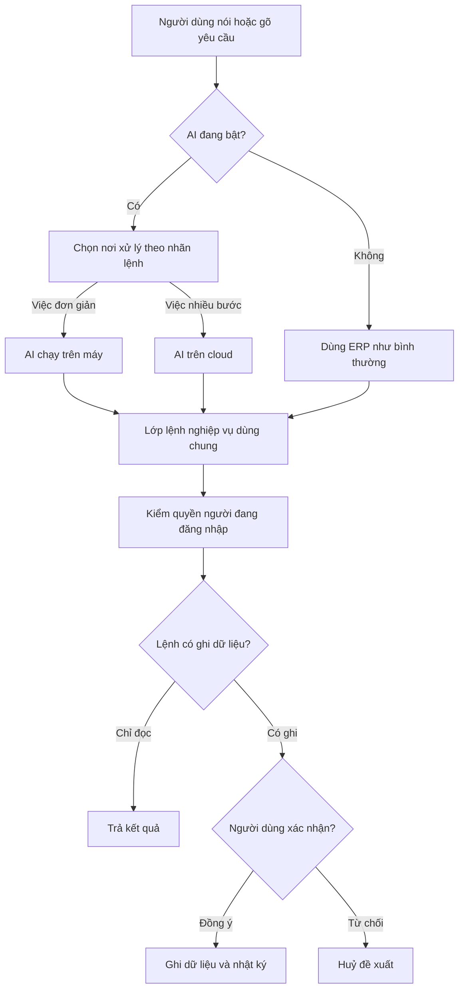

# QUYẾT ĐỊNH KIẾN TRÚC (ADR)
## Dự án Cá Về — AI Native Hybrid với MiMo 7B (On-Device) + MiMo-V2.6-Flash (Cloud)

**Ngày:** 27/09/2026
**Trạng thái:** ĐÃ CHỐT
**Người quyết định:** Duy (Product Architect) + PA

> Bản gốc do Duy dán ngày 2026-09-27, lưu nguyên văn làm nguồn cho feature
> `ai-native-erp`. Hồ sơ phân tích: `01-analysis.md`, story: `02-stories.md`.



---

## 1. BỐI CẢNH

Dự án Cá Về là dự án **free**, cần tích hợp AI Native vào ERP sẵn có. Yêu cầu:
- AI **tích hợp sâu**, không gắn ngoài gọi API.
- **Bật/tắt được** — tắt AI, hệ thống chạy 100%.
- **Hybrid** — tác vụ đơn giản chạy local, tác vụ khó lên cloud.
- **Chi phí thấp** — dự án free, không có ngân sách lớn.
- **Tuân thủ pháp luật Việt Nam** — Luật AI 134/2025, Luật TMĐT 2025.

---

## 2. QUYẾT ĐỊNH

### 2.1. Model On-Device: MiMo 7B

| Thuộc tính | Giá trị |
| :--- | :--- |
| **Model** | **MiMo-7B** (Xiaomi) |
| **Nguồn** | GitHub: `XiaomiMiMo/MiMo`, Hugging Face GGUF |
| **Kích thước** | ~5.3 GB (Q4_K_M) |
| **Context** | 32K token (Base) / 64K token (RL-0530) |
| **RAM cần** | ~5.3 GB (model) + ~4.5 GB (KV cache) = **~9.8 GB** |
| **Runtime** | LiteRT.js hoặc WebLLM (WebGPU) |
| **Thiết bị đích** | Redmi K100 Pro Max 16GB, Xiaomi Pad 7 Pro 12GB |
| **Vai trò** | Xử lý tác vụ đơn giản, agentic, nhập lô bằng giọng |

**Lý do chọn MiMo 7B:**
1. **Tương đương MiMo端侧** — đây chính là nền tảng Xiao AI sử dụng.
2. **Suy luận toán học/logic mạnh** — vượt o1-mini trên AIME, LiveCodeBench.
3. **Có bản GGUF** — chạy được trên thiết bị tiêu dùng.
4. **Context 32K-64K** — đủ cho tác vụ ERP.
5. **Cùng hệ sinh thái với cloud model** — dễ đồng bộ logic.

**Đánh đổi chấp nhận:**
- Chủ yếu text-only (không native audio/image như Gemma 4).
- Context ngắn hơn Gemma 4 (32K vs 128K).
- Cần ~9.8 GB RAM khi dùng full context.

---

### 2.2. Model Cloud: MiMo-V2.6-Flash

| Thuộc tính | Giá trị |
| :--- | :--- |
| **Model** | **MiMo-V2.6-Flash** (Xiaomi) |
| **Tổng tham số** | 309B |
| **Active/token** | 15B |
| **Context** | 256K token (mở rộng 1M) |
| **Giá** | $0.14/1M input, $0.28/1M output |
| **Truy cập** | FastAPI adapter hoặc Puter.js |
| **Vai trò** | Tác vụ phức tạp, suy luận đa bước, agentic workflow |

**Lý do chọn MiMo-V2.6-Flash:**
1. **Rẻ hơn DeepSeek** — $0.14 vs $0.22 per 1M input.
2. **Cùng hệ sinh thái MiMo** — dễ đồng bộ với on-device model.
3. **Context 256K-1M** — xử lý tài liệu dài.
4. **Agent, tool use mạnh** — phù hợp cho workflow phức tạp.
5. **Không có phụ phí giờ cao điểm** — chi phí ổn định.

**Đánh đổi chấp nhận:**
- Là nhà cung cấp Trung Quốc — cần thỏa thuận về dữ liệu.
- Có thể kém hơn DeepSeek ở code thuần.

---

### 2.3. Kiến trúc Hybrid

```
Next.js UI ─┐
Django Admin ├─► Lớp Lệnh nghiệp vụ ─► Phân quyền 3 tầng ─► Model / DB
AI local ───┤   (schema + nhãn local/cloud
AI cloud ───┘    + nhãn nhạy cảm)
   └─ qua FastAPI adapter
```

| Tầng | Model | Xử lý | Ví dụ |
| :--- | :--- | :--- | :--- |
| **Local** | MiMo-7B | Một câu → một lệnh | Nhập lô bằng giọng, tra tồn |
| **Cloud** | MiMo-V2.6-Flash | Nhiều bước, tổng hợp | Báo cáo, phân tích, agentic |

---

### 2.4. Router tĩnh theo nhãn lệnh

**Quyết định:** Router **KHÔNG** dựa vào độ tự tin của model, mà dựa vào **nhãn cố định** trên từng lệnh.

**Lý do:**
- Dễ test, dễ debug.
- Chi phí dự đoán được.
- Không bao giờ tự động đẩy tác vụ đơn giản lên cloud.
- Không phụ thuộc vào model — thay model không ảnh hưởng router.

---

### 2.5. Lớp lệnh nghiệp vụ dùng chung

**Quyết định:** Mọi entry point (UI, Admin, AI local, AI cloud) đều đi qua **cùng một lớp lệnh nghiệp vụ**.

**Schema mỗi lệnh:**

| Trường | Mô tả |
| :--- | :--- |
| **Tên lệnh** | Ví dụ: `nhap_lo`, `tra_ton` |
| **Nhãn local/cloud** | `local` hoặc `cloud` |
| **Nhãn nhạy cảm** | `cao`, `trung bình`, `thấp` |
| **Quyền tối thiểu** | Ví dụ: `nhân viên kho` |
| **Input schema** | JSON schema |
| **Output schema** | JSON schema |

**Ví dụ:**

| Tên lệnh | Nhãn local/cloud | Nhãn nhạy cảm | Quyền tối thiểu |
| :--- | :--- | :--- | :--- |
| `nhap_lo` | local | cao | nhân viên kho |
| `tra_ton` | local | trung bình | nhân viên |
| `bao_cao_ton_kho` | cloud | thấp | quản lý |
| `negotiate_price` | cloud | cao | quản lý |

---

### 2.6. Phân quyền 3 tầng cho AI

**Quyết định:** AI có **đúng quyền của người đang đăng nhập**, không bao giờ vượt quyền.

| Tầng | Quyền | Ví dụ |
| :--- | :--- | :--- |
| **Tầng 1** | Đọc | Xem tồn kho, tra lô |
| **Tầng 2** | Ghi (cần xác nhận) | Nhập lô, tạo đơn, hoàn tiền |
| **Tầng 3** | Quản trị | Xóa lô, sửa giá vốn, cấu hình |

**Luật bắt buộc:**
- Ngữ cảnh đưa cho model cũng **lọc theo quyền** (BR-PQ-13).
- Hành động tầng 2 **luôn cần người xác nhận**.
- AI không bao giờ tự `confirm_refund`, `confirm_payment_manual`, `close_batch`.

---

### 2.7. AuditLog với actor `ai:<user>`

**Quyết định:** AuditLog ghi actor `ai:<user>`, tách khỏi `user` và `system`.

**Lý do:**
- Truy vết được hành động nào do AI đề xuất.
- Phân biệt được lỗi do AI vs lỗi do người dùng.
- Tuân thủ yêu cầu minh bạch của Luật AI.

---

### 2.8. Entry Points đa dạng

**Quyết định:** AI không chỉ là chat, mà xuất hiện ở **10 entry point** khác nhau.

| # | Entry point | Ưu tiên | Ví dụ |
| :--- | :--- | :--- | ---: |
| 1 | **Voice Input** | **1** | Nhập lô bằng giọng |
| 2 | **Inline Suggestions** | **2** | Gợi ý mã hàng trong form |
| 3 | **Auto-fill** | **3** | AI điền sẵn dữ liệu |
| 4 | **Proactive Alerts** | **4** | Cảnh báo lô sắp hết hạn |
| 5 | **Chat** | 5 | Câu hỏi phức tạp |
| 6 | **Image Input** | 6 | Chụp hóa đơn |
| 7 | **Smart Buttons** | 7 | Gợi ý lô FEFO |
| 8 | **Dashboard Insights** | 8 | Tóm tắt dashboard |
| 9 | **Semantic Search** | 9 | Tìm kiếm ngữ nghĩa |
| 10 | **Agent Actions** | 10 | Tự động tạo đơn từ email |

---

### 2.9. Quản lý Context & Chống Crash

**Quyết định:** Triển khai **4 tầng giải pháp** để chống tràn context.

| Tầng | Giải pháp | Độ phức tạp | Trạng thái |
| :--- | :--- | :--- | :--- |
| **1** | **Sliding Window** | Thấp | **Bắt buộc** |
| **2** | **Summarization** | Trung bình | **Nên có** |
| **3** | **RAG cục bộ** | Cao | Tùy chọn |
| **4** | **Bộ nhớ phân tầng** | Rất cao | Chưa cần |

**Ngưỡng cụ thể:**
- `MAX_CONTEXT_TOKENS` = 2048 (máy yếu) hoặc 4096 (máy khá).
- Luôn giữ khoảng đệm an toàn 20%.

---

### 2.10. Tải model thông minh

**Quyết định:** **KHÔNG BAO GIỜ** tự động tải model 2GB qua 4G/5G.

**Chiến lược:**

| Tầng | Tải gì | Khi nào |
| :--- | :--- | :--- |
| **1** | HTML, CSS, JS, hình ảnh | Ngay lập tức |
| **2** | Runtime AI (LiteRT.js) | Sau khi web tương tác được |
| **3** | Model AI (MiMo-7B Q4) | Background, khi có Wi-Fi |

**Quy tắc:**
- Chỉ tải model khi người dùng **chủ động đồng ý**.
- Ưu tiên Wi-Fi. Nếu đang dùng 4G/5G → **cloud fallback**.
- Progressive loading: tải core (~200MB) trước, full sau.
- Cache vào IndexedDB/Cache Storage.

---

### 2.11. Tuân thủ pháp lý

**Quyết định:** Tuân thủ **Luật AI 134/2025/QH15** và **Luật TMĐT 2025 + NĐ 248/2026**.

| Yêu cầu | Cách tuân thủ |
| :--- | :--- |
| **Phân loại rủi ro** | AI thuộc **rủi ro trung bình** (đề xuất, không tự quyết) |
| **Minh bạch** | Thông báo khi người dùng tương tác AI |
| **Human-in-the-loop** | Hành động tầng 2 luôn cần xác nhận |
| **Định danh** | Tuân thủ quy định TMĐT |

**Không cần quan tâm App Store/Google Play** — website thuần túy không thuộc phạm vi.

---

### 2.12. Dev không cần máy mạnh

**Quyết định:** Dev **không cần máy cấu hình cao** để phát triển.

| Giai đoạn | Cần máy mạnh? | Giải pháp |
| :--- | :--- | :--- |
| Viết UI, router, schema | **Không** | Mock, dữ liệu giả |
| Test logic AI | **Không** | LLMock, Chrome built-in AI |
| Spike hiệu năng | **Có, nhưng trên máy đích** | Redmi K100 Pro Max |
| Đo độ trễ | **Có** | Thiết bị tham chiếu |

---

## 3. HỆ QUẢ

### 3.1. Chi phí

| Hạng mục | Chi phí |
| :--- | :--- |
| **On-device** | $0 (tải một lần) |
| **Cloud (Flash)** | ~11 VNĐ/câu |
| **10.000 câu/tháng** | ~110.000 VNĐ |
| **Trần chi phí** | 500.000 VNĐ/tháng |

### 3.2. Hiệu năng

| Chỉ số | Mục tiêu |
| :--- | :--- |
| **Web TTI** | < 2 giây |
| **Model load** | < 30 giây (background) |
| **Agent response** | < 200ms (local) |
| **Cache hit rate** | > 80% |

### 3.3. Backend

- Tốn thêm **20-30% công** so với ERP thường.
- Django Admin phải gọi qua lớp lệnh, không dùng "có sẵn" hoàn toàn.

---

## 4. RỦI RO & GIẢM THIỂU

| Rủi ro | Mức độ | Giảm thiểu |
| :--- | :--- | :--- |
| **MiMo-7B tiếng Việt yếu** | 🔴 Cao | Spike sớm với 50 câu thật |
| **Nhân viên bấm xác nhận mà không đọc** | 🟡 TB | UI buộc tương tác, log thời gian |
| **Rò giá vốn qua AI** | 🔴 Cao | Lọc context theo quyền, audit log |
| **Web Speech API gửi audio lên server** | 🟡 TB | Vosk-browser, Whisper.cpp WASM |
| **Tràn context gây crash** | 🔴 Cao | Sliding Window + Summarization |
| **Chi phí cloud vượt kiểm soát** | 🟡 TB | Trần chi phí, cảnh báo 80%, chặn 100% |
| **Model 2GB quá lớn để tải** | 🟡 TB | Tải có đồng ý, ưu tiên Wi-Fi |

---

## 5. VIỆC TIẾP THEO

### 5.1. Tuần 2-3: Spike

1. **Spike 1 tuần** cho tác vụ nhập lô bằng giọng trên **Redmi K100 Pro Max**.
2. Đo: dung lượng tải, độ trễ, tỉ lệ đúng trên **50 câu nói thật**.
3. Test **MiMo-7B Q4_K_M** với LiteRT.js/WebLLM.
4. So sánh với **Gemma-SEA-LION-v4.5-E2B** và **Llama-3.2-3B-Frog**.

### 5.2. Level 4: Viết schema lớp lệnh

```markdown
| Tên lệnh | Nhãn local/cloud | Nhãn nhạy cảm | Quyền tối thiểu | Input schema | Output schema |
|---|---|---|---|---|---|
| nhap_lo | local | cao | nhân viên kho | {ma_hang, so_luong, don_vi} | {lo_id, trang_thai} |
| tra_ton | local | trung bình | nhân viên | {ma_hang} | {so_luong, vi_tri} |
| bao_cao_ton_kho | cloud | thấp | quản lý | {ky, kho} | {tong_hop} |
```

### 5.3. Cập nhật tài liệu

- `decisions.md`: Thêm **AI Native qua lớp lệnh dùng chung** và **Runtime hybrid với MiMo-7B + MiMo-V2.6-Flash**.
- `URD.md`: Thêm AI Native vào phạm vi, kèm yêu cầu phi chức năng về quyền và dữ liệu của AI.
- `doctype-mapping.md`: Viết lại thành Django models + danh mục lệnh có 2 cột nhãn.

### 5.4. Câu hỏi mở

1. Có chấp nhận gửi câu hỏi (không kèm số liệu) sang Xiaomi (MiMo) không?
2. Trần chi phí cloud mỗi tháng bao nhiêu, anh trả hay Lộc trả?
3. Thỏa thuận với Lộc về quyền code và quyền dùng dữ liệu vận hành.
4. Máy tham chiếu để làm spike (điện thoại thật của nhân viên).

---

## 6. KẾT LUẬN

### 6.1. Quyết định tối ưu

| Hạng mục | Lựa chọn |
| :--- | :--- |
| **Model on-device** | **MiMo-7B** (Q4_K_M, ~5.3GB) |
| **Model cloud** | **MiMo-V2.6-Flash** ($0.14/$0.28) |
| **Runtime local** | LiteRT.js + WebNN |
| **Router** | Tĩnh theo nhãn lệnh |
| **Lớp lệnh** | Dùng chung cho UI, Admin, AI |
| **Phân quyền** | 3 tầng, AI có đúng quyền user |
| **AuditLog** | Actor `ai:<user>` |
| **Entry points** | 10 hình thức, ưu tiên Voice |
| **Chống crash** | Sliding Window + Summarization |
| **Tải model** | Có đồng ý, ưu tiên Wi-Fi |
| **Pháp lý** | Tuân thủ Luật AI 134/2025 |

### 6.2. Giá trị mang lại

**Cho Lộc:**
- Chặn sai giá vốn ngay lúc nhập (lợi ích lớn nhất).
- Nhập lô rảnh tay, chạy offline tại cảng.
- Giảm nút cổ chai khi Lộc vắng mặt.

**Cho Duy:**
- Kiến trúc lớp lệnh mang đi dùng lại được.
- Dữ liệu thực địa tiếng Việt, khó sao chép.
- Hồ sơ năng lực Product Architect.
- Khách tham chiếu để thương mại hóa.

### 6.3. Tầm nhìn

Dự án Cá Về có tiềm năng **định hình lại cách ngành phần mềm VN làm AI** — từ "gắn ngoài" sang "tích hợp sâu", từ "cloud-first" sang "hybrid on-device". Đây không chỉ là một dự án ERP, mà là **nền tảng AI Native** có thể mở rộng ra nhiều ngành dọc khác.

---

*Tài liệu quyết định kiến trúc (ADR) ngày 27/09/2026. Các số liệu và giá tham khảo cần được kiểm chứng lại tại thời điểm triển khai thực tế.*

---

## ĐIỀU CHỈNH SAU RESEARCH + CHỐT CỦA DUY (27/09/2026)

Chi tiết research: `05-deep-research.md` · Phân tích đã duyệt: `01-analysis.md`.

1. **Local AI là bắt buộc (Q1):** model không chạy được on-device thì phải đi tìm model khác (rule BR-AI-16).
2. **Runtime on-device:** LiteRT.js/WebLLM CHƯA hỗ trợ MiMo → dùng **wllama** (llama.cpp WASM, GGUF).
3. **Model spike:** Llama-3.2-3B-Instruct-Frog (ưu tiên 1) + Gemma-SEA-LION-v4.5-E2B (ưu tiên 2);
   MiMo-7B chỉ giữ làm ứng viên nếu spike chứng minh chạy được wllama + tiếng Việt đủ dùng.
   → **ĐÃ THAY BỞI ĐIỂM 9** (Duy chốt Gemma 3n 32k khi duyệt story).
4. **Trần chi phí cloud: 200.000đ/tháng** (Q2 — cận trên của "100–200k"); cảnh báo 80%, chặn 100%.
5. **Cloud + nhãn `cao` được phép ngay (Q5)** — kèm nghĩa vụ: hợp đồng không-huấn-luyện + zero
   retention với nhà cung cấp API, ghi vào hồ sơ phân loại rủi ro. **PII khách vẫn cấm tuyệt đối
   vào prompt (BR-AI-09)** + chốt chặn kỹ thuật ở adapter (allowlist + redaction + hard-block).
6. **Audit (Q6):** bản đề xuất ghi actor `ai:<user>`; dòng thực thi sau xác nhận ghi `user` + note mã đề xuất.
7. **Nghĩa vụ pháp lý mới:** hồ sơ phân loại (rủi ro trung bình) + **thông báo Bộ KH&CN qua cổng
   một cửa AI trước khi bật AI ở production** (Luật AI 134/2025, NĐ 142/2026 — hệ thống mới
   không có chuyển tiếp 12 tháng).
8. ⏳ Chưa chốt: thoả thuận với Lộc (quyền code + dữ liệu vận hành) — Q3. Máy tham chiếu (Q4):
   **Duy chốt 27/09 — Android ≥ 8GB RAM, Windows ≥ 8GB RAM; iPhone tạm chưa hỗ trợ** (chi phí
   lên App Store quá cao). Console là web app (mở được qua Safari) nhưng không cam kết AI local trên iOS.
9. **Model on-device chốt theo Duy (27/09/2026, khi duyệt story):** dùng **Gemma 3n** — context
   **32k token**, GGUF Q4 (~1,9–2,8GB tuỳ bản E2B/E4B), chạy qua wllama (llama.cpp hỗ trợ
   Gemma 3n). S17 chọn bản cụ thể (E2B 2,6B / E4B 4,4B) theo kết quả đo trên máy tham chiếu
   (Q4 — chốt Android/Windows ≥ 8GB).
   Frog/SEA-LION/Sailor giữ làm dự phòng nếu Gemma 3n không chạy được on-device (BR-AI-16).
10. **Hiệu năng không đánh đổi (Duy, 27/09/2026, khi duyệt story):** website/ERP phải chạy mượt
    như khi chưa có AI — AI Native là lớp cộng thêm, không được kéo tụt hiệu năng chung (rule
    mới BR-AI-17): AI code lazy-load, runtime + suy luận chạy ngoài main thread (Web Worker),
    người không bật AI không tải model/code AI, TTI < 2s, AI tắt = hệ thống y hệt như cũ.
