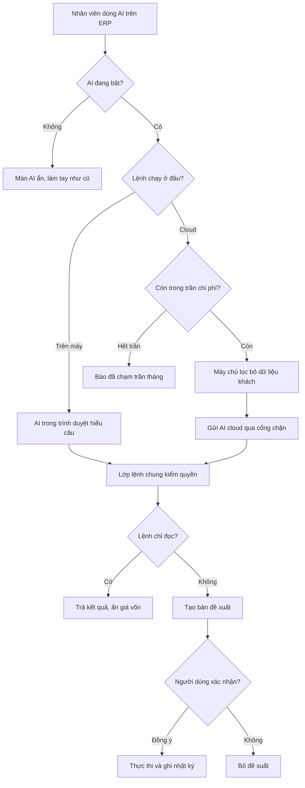
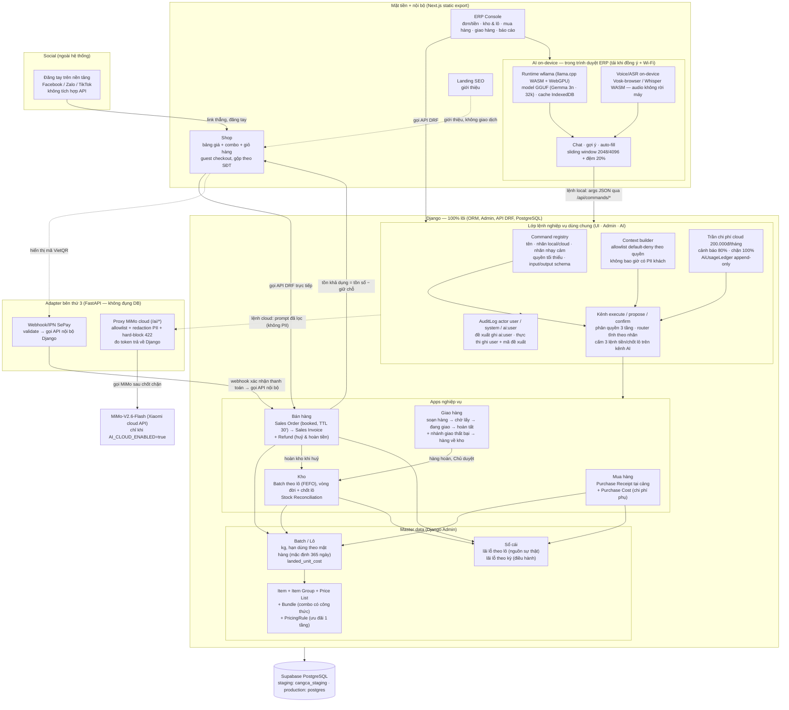

# AI Native ERP — Thiết kế kỹ thuật
> Tech Lead · 2026-09-27 · Nguồn: `02-stories.md` (CHỜ DUYỆT), `01-analysis.md` (ĐÃ DUYỆT, Q1–Q6 đã chốt),
> `00-adr-ai-native.md` (ĐÃ CHỐT — phần "ĐIỀU CHỈNH SAU RESEARCH" THẮNG ADR gốc khi xung đột), `05-deep-research.md`.
>
> Trạng thái: **BẢN THIẾT KẾ** — bám theo story đang CHỜ DUYỆT. PO đổi story → cập nhật mục "Lệch so với story PO"
> (mục 9) và contract tương ứng. FE mock theo đúng contract trong file này; đổi tên field phải báo Tech Lead/PO.



## Mục lục
1. [Kiến trúc tổng thể khi có AI Native](#1-kiến-trúc-tổng-thể-khi-có-ai-native)
2. [Lớp lệnh nghiệp vụ dùng chung](#2-lớp-lệnh-nghiệp-vụ-dùng-chung)
3. [Contract API BE↔FE theo story](#3-contract-api-befe-theo-story)
4. [Model & migration](#4-model--migration)
5. [Context builder & chống tràn context](#5-context-builder--chống-tràn-context)
6. [Cơ chế chặn giá vốn & PII](#6-cơ-chế-chặn-giá-vốn--pii)
7. [Điểm rủi ro bắt buộc + test bắt lỗi](#7-điểm-rủi-ro-bắt-buộc--test-bắt-lỗi)
8. [Thứ tự thực hiện + lô giao việc BE ∥ FE](#8-thứ-tự-thực-hiện--lô-giao-việc-be--fe)
9. [Lệch so với story PO](#9-lệch-so-với-story-po)
10. [Câu hỏi kỹ thuật 🔴](#10-câu-hỏi-kỹ-thuật-)
11. [Mục review (Việc 3 của Tech Lead)](#11-mục-review-việc-3-của-tech-lead)
- [Phụ lục A — Biến env/settings mới](#phụ-lục-a--biến-envsettings-mới)
- [Phụ lục B — Danh mục lệnh khởi đầu (14 lệnh)](#phụ-lục-b--danh-mục-lệnh-khởi-đầu-14-lệnh)
- [Phụ lục C — Kiểm toán hiệu năng (BR-AI-17)](#phụ-lục-c--kiểm-toán-hiệu-năng-br-ai-17)

## Tóm tắt quyết định kỹ thuật (đọc nhanh)

| # | Quyết định | Căn cứ |
|---|---|---|
| 1 | **Bọc + mở rộng, không viết lại lõi** — service layer hiện có là nền của lớp lệnh; thêm app Django mới `apps/ai/`; không đổi model nghiệp vụ hiện có (bất biến 8, lý do ghi trong hồ sơ này) | BR-AI-01, 01-analysis §3.1 |
| 2 | **Registry bằng code** trong Django (không bảng DB — G4/V4) + endpoint catalog lọc theo quyền; thêm field `description` tiếng Việt cho model intent-classify | S01, BR-AI-01 |
| 3 | **Router tĩnh theo nhãn** (không dùng độ tự tin của model): FE chọn runtime theo catalog, BE chặn ngược chiều — lệnh `local` không bao giờ chạy qua kênh cloud ("local giả" cấm) | BR-AI-02/16 |
| 4 | **Phân quyền 3 tầng áp nguyên vẹn cho kênh AI** (T1 model perm = `min_permissions`, T2 custom perm, T3 scope dòng/cột qua service hiện có) — không tin thiết bị/model | BR-AI-04, BR-PQ-12 |
| 5 | **Cloud: BE dựng prompt** (không nhận prompt thô từ FE), kiểm trần trước khi gọi adapter, ghi `AiUsageLedger` append-only; công tắc `AI_CLOUD_ENABLED` mặc định tắt | S04/S11, Q5 |
| 6 | **Adapter giữ vai trò mỏng** (không đụng DB — decisions 2026-09-09): route `/ai/*` proxy MiMo với chốt chặn allowlist + redaction + hard-block PII (422) — PII không một byte rời adapter | BR-AI-09, S11 |
| 7 | **`AI_ENABLED=false` → kênh `ai_*` trả 410, mọi màn AI ẩn, kênh `ui` chạy 100%**; `status`/`usage` là endpoint báo cáo cấu hình → luôn trả lời (xem lệch D3) | BR-AI-10 |
| 8 | **Hiệu năng không đánh đổi (chốt Duy 27/09):** AI code lazy-load (dynamic import), runtime + suy luận trong Web Worker (không chặn main thread), người không bật AI không tải model/code AI, TTI < 2s, `AI_ENABLED=false` = y hệt cũ | BR-AI-17 |

---

## 1. Kiến trúc tổng thể khi có AI Native

Sơ đồ dưới đây là **sơ đồ Level 1 mới đã cập nhật vào `doc/ecosystem-l1.md`** (yêu cầu riêng của Duy):
thêm ERP console, SePay IPN, 2 môi trường Supabase, và lớp AI Native (runtime on-device wllama trong
trình duyệt + lớp lệnh dùng chung + proxy MiMo cloud).



### 1.1 Ba luồng dữ liệu chính

**Luồng 1 — Local (lệnh nhãn `local`, on-device thật — BR-AI-16):**
ERP console → runtime **wllama** trong trình duyệt (ASR on-device cho voice, BR-AI-15) → sinh args JSON
theo `input_schema` của lệnh → `POST /api/commands/propose` (lệnh cần xác nhận) hoặc
`POST /api/commands/execute` channel `ai_local` (lệnh tra cứu) → BE kiểm đủ 3 tầng quyền + validate
input schema → gọi **service hiện có** của module nghiệp vụ → audit (đề xuất `ai:<user>`, thực thi `user` + mã đề xuất).
Không một bước nào đẩy lệnh local lên cloud; máy không đủ RAM/WebGPU → nhập tay (BR-AI-12).

**Luồng 2 — Cloud (lệnh nhãn `cloud`):**
ERP console → `POST /api/ai/cloud/complete {command, args_hint}` → BE kiểm `AI_ENABLED` →
`AI_CLOUD_ENABLED` → quyền tối thiểu → **trần chi phí (chặn trước khi gọi)** → context builder
(allowlist default-deny, không PII) → **BE dựng prompt** → gọi adapter `POST /ai/v1/chat/completions`
(`X-Internal-Token`) → adapter chốt chặn (allowlist keys theo lệnh → redaction PII → hard-block 422) →
forward MiMo-V2.6-Flash → trả `{text, usage}` → BE quét output (mask PII nếu model lỡ sinh) → ghi
`AiUsageLedger` + cập nhật bộ đếm tháng → trả FE.

**Luồng 3 — Tắt AI (BR-AI-10):** `AI_ENABLED=false` → kênh `ai_*` trả 410, `/api/ai/status` trả
`ai_enabled:false` → FE ẩn mọi màn AI; kênh `ui` và toàn bộ nghiệp vụ chạy 100% bằng tay. Không màn
hình nào phụ thuộc AI (AC có trong mọi story AI).

### 1.2 Nơi đặt logic (bám cấu trúc module tính năng hiện có)

| Thành phần | Nơi đặt | Ghi chú |
|---|---|---|
| Command registry + catalog | `backend/apps/ai/commands/` (registry.py, handlers.py, api.py, serializers.py, tests/) | App mới `ai`; handlers gọi **services của module khác**, không đụng model nội bộ |
| Kênh execute/propose/confirm | `backend/apps/ai/commands/` (execution.py, api.py) | Bọc service hiện có, không viết lại |
| Context builder | `backend/apps/ai/context/` (builder.py, api.py, tests/) | Tái dùng serializer hiện có + allowlist |
| Trần chi phí + ledger | `backend/apps/ai/usage/` (services.py, api.py, internal_api.py, tests/) | Model ở `apps/ai/models/` |
| Orchestrator cloud | `backend/apps/ai/cloud/` (orchestrator.py, api.py, tests/) | Django gọi adapter qua HTTP |
| Alerts | `backend/apps/ai/alerts/` (services.py, api.py, tests/) | Endpoint `/api/alerts/` — chạy được cả khi AI tắt (S12-AC4) |
| Trạng thái AI | `backend/apps/ai/status.py` (phẳng — 1 chức năng) | `GET /api/ai/status` |
| AuditLog mở rộng + endpoint nhật ký | `backend/apps/accounts/` (models.py) + `apps/accounts/audit/` (api.py, serializers.py, tests/) | Migration mới, field nullable |
| Gợi ý mặt hàng | `backend/apps/catalog/items/` (api.py — thêm view) | Thuộc miền catalog |
| Adapter proxy MiMo | `adapter/app/ai.py` + `adapter/app/config.py` (env mới) | Không đụng DB; `adapter/tests/` |
| FE: toàn bộ AI | `erp-console/features/ai/` (README, api.ts, mock.ts, types.ts, commands.ts, runtime/, chat/, voice/, alerts/, usage/, components/) | Mock LLMock cho mọi endpoint; nav.ts thêm mục gated |
| Màn nhập lô | `erp-console/features/purchasing/` (đã có placeholder) | Dùng commands.ts, KHÔNG tạo ViewSet/API riêng |

Route tập trung ở `backend/config/api_urls.py`; env/settings theo quy ước `settings.py` (không hard-code).

---

## 2. Lớp lệnh nghiệp vụ dùng chung

### 2.1 Command registry (code, không bảng DB — PA G4/V4)

`CommandSpec` gồm **6 trường ADR 2.5 bắt buộc** + 4 trường mở rộng:

| Trường | Kiểu | Bắt buộc | Ghi chú |
|---|---|---|---|
| `name` | str (snake_case, unique) | ✓ | vd `nhap_lo`, `tra_ton` |
| `channel` | `"local"` \| `"cloud"` | ✓ | nhãn local/cloud — router tĩnh (BR-AI-02) |
| `sensitivity` | `"cao"` \| `"trung_binh"` \| `"thap"` | ✓ | nhãn nhạy cảm (BR-AI-03) |
| `min_permissions` | list[str] (app_label.codename) | ✓ | quyền tối thiểu — user phải có **tất cả** (AND) |
| `input_schema` | dict (JSON Schema) | ✓ | validate args bằng thư viện `jsonschema` (thêm vào requirements) |
| `output_schema` | dict (JSON Schema) | ✓ | mô tả `result` — có test đối chiếu |
| `status` | `"active"` \| `"draft"` | ✓* | draft = chưa có màn/service tương ứng (S01) |
| `needs_confirmation` | bool | ✓* | Tầng 2: kênh AI bắt buộc propose→confirm (BR-AI-06) |
| `context_fields` | dict \| None | chỉ lệnh tra cứu | allowlist cho context builder (S06) |
| `forbidden_channel` | `"ai"` \| None | ✓* | 3 lệnh cấm kênh AI (BR-AI-07) |
| `description` | str (tiếng Việt, 1–2 dòng) | ✓* | mô tả cho model intent-classify + hiển thị (xem lệch D6) |
| `handler` | callable | ✓* | gọi service hiện có; không viết lại nghiệp vụ |

(\* mặc định an toàn: `status="draft"`, `needs_confirmation=False`, `forbidden_channel=None`)

- Registry là một dict/`CommandSpec` dataclass trong `apps/ai/commands/registry.py`; **test bất biến của registry**:
  đủ trường, JSON Schema hợp lệ, `name` unique, không lệnh `active` nào có `context_fields` chứa khoá PII
  (xem mục 6), nhãn đúng bảng S01-AC6, 3 lệnh cấm có `forbidden_channel="ai"`.
- Nâng lên bảng DB chỉ khi nào cần bật/tắt từng lệnh riêng (V4 — chưa cần).

### 2.2 Router tĩnh + ma trận chặn channel

| Trường hợp | Kết quả | Mã |
|---|---|---|
| Lệnh `local` + channel `ai_cloud` | 400, không thực thi | `BR-AI-02` |
| Lệnh `cloud` + channel `ai_local` | 400, không thực thi | `BR-AI-02` |
| Lệnh `forbidden_channel="ai"` + channel `ai_local`/`ai_cloud` | 403 (kể cả Chu) — UI vẫn chạy channel `ui` | `BR-AI-07` |
| Lệnh `needs_confirmation` + channel `ai_*` không qua propose→confirm | 400 — chỉ nhận bản nháp | `BR-AI-06` |
| `AI_ENABLED=false` + channel `ai_*` | 410 | `AI_DISABLED` |
| `AI_CLOUD_ENABLED=false` + channel `ai_cloud` | 410 | `CLOUD_DISABLED` |
| Lệnh không tồn tại hoặc `draft` | 404 | `COMMAND_UNKNOWN` |
| Args sai `input_schema` | 400, không đổi dữ liệu, không ghi audit | `BR-AI-01` |
| Thiếu quyền (T1/T2/T3) | 403 | `BR-AI-04` |
| Vi phạm nghiệp vụ (service raise) | 400 `{detail, code}` như hiện có | mã BR |

### 2.3 Kênh execute / propose / confirm + Tầng 2 xác nhận

- **`execute`** (channel `ui` \| `ai_local` \| `ai_cloud`): chạy lệnh đọc hoặc lệnh ghi không cần xác nhận.
  Kênh `ui` coi nút bấm của người là xác nhận (S02 ghi chú).
- **`propose`** (channel `ai_local` \| `ai_cloud`): sinh `AiProposal` (PENDING, TTL 15 phút — `AI_DRAFT_TTL_MINUTES`),
  **không thực thi**; ghi AuditLog actor_kind=`ai`, ai_actor=user (BR-AI-08/Q6).
- **`confirm`** (channel `ui`): kiểm quyền người xác nhận đủ 3 tầng → thực thi handler với `actor=người xác nhận`
  → AuditLog nghiệp vụ ghi actor=`user` + `note="AI proposal <id>"` + `proposal_ref` (Q6) → proposal → CONFIRMED.
- Hết hạn → 410 `PROPOSAL_EXPIRED`; xác nhận lại lần 2 → 409 `PROPOSAL_ALREADY_CONFIRMED`.
- **Đường thực thi duy nhất của proposal là `confirm`** — execute không nhận `proposal_id` (lệch D1).
- Khung xác nhận FE theo V5: buộc mở xem chi tiết bản nháp + đếm ngược 3 giây mới bật nút "Đồng ý thực thi";
  log thời điểm xác nhận (AuditLog `confirmed_at`/`created_at` của dòng thực thi).
- Kênh `ui` với lệnh `needs_confirmation` vẫn chạy trực tiếp (nút bấm = xác nhận) — S07/S02.

### 2.4 Phân quyền 3 tầng cho kênh AI (BR-AI-04/05)

- **T1** — `min_permissions`: kiểm `user.has_perm` từng perm (catalog cũng lọc theo cái này).
- **T2** — custom perm (vd `inventory.close_batch`): nằm trong `min_permissions` của lệnh tương ứng.
- **T3** — scope dòng/cột: handlers gọi **đúng service/queryset hiện có** (vd `sellable_batches`,
  scope phiếu giao của `nv_giao` qua `FULL_SCOPE_GROUPS`); field giá vốn qua `CostFieldSerializerMixin`.
  Không bao giờ gọi thẳng model để né scope.

---

## 3. Contract API BE↔FE theo story

Quy ước chung: xác thực SessionAuth/token DRF (console) — 401 khi chưa đăng nhập; lỗi trả `{detail, code}`.
FE mock theo đúng các contract này (nhánh `mock.ts` khi `NEXT_PUBLIC_USE_MOCK=1`).

### S01 — Catalog lệnh

```
GET /api/commands/catalog                (authenticated)
→ 200 {
    "commands": [{
      "name": "nhap_lo",
      "channel": "local",                // "local" | "cloud"
      "sensitivity": "cao",              // "cao" | "trung_binh" | "thap"
      "min_permissions": ["purchasing.add_purchasereceipt"],
      "input_schema": {…},               // JSON Schema
      "output_schema": {…},              // JSON Schema
      "description": "Nhập lô mua tại cảng — mỗi dòng sinh một lô.",   // thêm (lệch D6)
      "needs_confirmation": true,
      "forbidden_channel": null          // null | "ai"
    }, …]
  }
→ 401 (chưa đăng nhập — không lộ tên lệnh)
```
- Chỉ trả lệnh `status=active`; lọc theo `min_permissions` (S01-AC2/AC3): Quản lý không thấy
  `bao_cao_lo`/`bao_cao_ky`; NV giao chỉ thấy lệnh mình có quyền.
- `context_fields` KHÔNG trả ra catalog (nội bộ BE, giảm mặt lộ thông tin).

### S02 — execute / propose / confirm

```
POST /api/commands/execute
  {command, args, channel: "ui"|"ai_local"|"ai_cloud"}
  → 200 {command, result}
  → 400 {detail, code: "BR-AI-01"|"BR-AI-02"|"BR-AI-06"|<mã BR nghiệp vụ>}
  → 403 {detail, code: "BR-AI-04"|"BR-AI-07"}
  → 404 {detail, code: "COMMAND_UNKNOWN"}
  → 410 {detail, code: "AI_DISABLED"|"CLOUD_DISABLED"}

POST /api/commands/propose
  {command, args, reason?, channel: "ai_local"|"ai_cloud"}
  → 200 {proposal_id, expires_at}                    // TTL 15' — KHÔNG thực thi
  → 400/403/404/410 như execute
  (AuditLog: actor_kind=ai, ai_actor=user, action="propose_<command>", note=proposal_id)

GET /api/commands/proposals/<id>                     // khung xác nhận hiện chi tiết
  → 200 {proposal: {id, command, args, reason, created_by, created_at, expires_at, status}}
  → 403 (không phải người tạo HOẶC thiếu quyền lệnh) | 404

POST /api/commands/proposals/<id>/confirm  {channel:"ui"}
  → 200 {command, result}
  → 403 {detail, code:"BR-AI-04"}                    // người confirm thiếu quyền
  → 410 {detail, code:"PROPOSAL_EXPIRED"}
  → 409 {detail, code:"PROPOSAL_ALREADY_CONFIRMED"}
  (AuditLog nghiệp vụ: actor=người xác nhận, note="AI proposal <id>", proposal_ref=<id>)
```

### S03 — AuditLog `ai:<user>` + endpoint nhật ký

```
GET /api/audit-logs/?page=&actor_kind=&action=      (quyền accounts.view_auditlog: chu + quan_ly)
→ 200 {count, next, previous, results: [{
    id, actor_kind: "user"|"system"|"ai", actor_display, ai_actor, action,
    model_name, object_id, object_repr, changes, note, proposal_ref, created_at }]}
→ 403 (nv_kho/nv_giao — không đọc toàn bộ nhật ký)
```
- `actor_display` cho dòng AI = `ai:<tên user>` (từ `ai_actor`); dòng cũ: `actor` như cũ, `actor_kind`
  backfill `user`/`system` bằng data migration.
- `changes`/`note` không bao giờ chứa tên/SĐT/địa chỉ khách (S03-AC4 — test).

### S04 — Trần chi phí + mức dùng

```
GET /api/ai/usage?month=YYYY-MM           (quyền ai.view_ai_usage — chỉ chu)
→ 200 {month, budget_vnd, spent_vnd, pct, status: "ok"|"warning"|"blocked",
       rows: [{command, user, channel, input_tokens, output_tokens, cost_vnd, created_at}]}
→ 403 (không phải chu)
(luôn 200 kể cả AI_ENABLED=false — S04-AC6; không có cột nội dung prompt — S04-AC7)

POST /internal/ai/usage                   (adapter → Django, X-Internal-Token, so hằng thời gian)
  {command, username, input_tokens, output_tokens, cost_vnd, occurred_at}
  → 200 | 401 (sai token)
```
- Luồng chính ghi ledger là **Django ghi từ response của adapter** (mục S11); internal endpoint này giữ
  theo contract S04 cho báo mức dùng async tương lai — cả hai gọi chung `record_usage()` (lệch D3).
- Tháng = tháng dương, `Asia/Ho_Chi_Minh` (câu hỏi T3).

### S05 — Công tắc + trạng thái

```
GET /api/ai/status                        (mọi user đã đăng nhập)
→ 200 {ai_enabled, cloud_enabled,
       model: {name, version, gguf_url},          // null khi chưa chốt (S17)
       budget: {spent_vnd, limit_vnd, status}}    // chỉ trả cho chu (view_ai_usage); user khác null
```
- **Endpoint này luôn trả 200, kể cả AI tắt** — FE dựa vào `ai_enabled:false` để ẩn màn AI (S05-AC1/AC5);
  410 `AI_DISABLED` chỉ áp cho endpoint **thực thi** AI (lệch D3).
- Đổi công tắc chỉ qua env, không có API bật/tắt.

### S06 — Context builder

```
POST /api/ai/context  {command, args_hint?}
→ 200 {command, context: {…}}             // CHỈ field trong context_fields của lệnh (default-deny)
→ 400 {detail, code:"BR-AI-01"}           // lệnh không tồn tại/không active/không hỗ trợ context
→ 403 {detail, code:"BR-AI-04"}           // thiếu quyền T1 hoặc ngoài scope T3 (vd nv_giao hỏi đơn lạ)
→ 410 {detail, code:"AI_DISABLED"}
```
- Dùng cho cả kênh local (S09) lẫn cloud (S11 dựng prompt).

### S07 — Màn nhập lô qua lệnh `nhap_lo`

```
FE màn /purchasing: form phiếu nhập (nhà cung cấp, ngày nhận, các dòng: mặt hàng, kg, đơn giá,
số lô, hạn dùng) → POST /api/commands/execute
  {command:"nhap_lo", channel:"ui",
   args: {supplier_id, received_date?, warehouse_id?,          // ? = tuỳ chọn, mặc định hôm nay/kho chính
          lines: [{item_id, quantity, unit, purchase_rate, batch_no?, shelf_life_days?, expiry_date?}]}}
→ 200 {command:"nhap_lo", result: {receipt_id, status, batches:[{batch_id, code, …}]}}
→ 400 (thiếu trường/sai kiểu — BR-AI-01) | 403 (thiếu add_purchasereceipt) | 400 (mã BR nghiệp vụ, vd BR-MH-02)
```
- Danh sách mặt hàng/nhà cung cấp: dùng API hiện có (`/api/catalog/items/`, `/api/purchasing/suppliers/`) —
  không gộp màn quản lý nhà cung cấp/PurchaseCost/StockEntry (V2).
- Output KHÔNG chứa `purchase_rate`/`landed_unit_cost` khi user thiếu `view_costprice` (S07-AC4).
- Offline tại cảng: giữ nháp bằng `shared/lib/drafts.ts` hiện có, gửi lại khi có mạng (PA G8).

### S08 — Runtime on-device (FE, không có endpoint mới)

- Cấu hình model lấy từ `/api/ai/status` (mock ở Lô 1); override cục bộ bằng
  `NEXT_PUBLIC_AI_MODEL_NAME` / `NEXT_PUBLIC_AI_MODEL_GGUF_URL` để S17 đổi model không sửa code.
- `@wllama/wllama` import động (chỉ tải khi mở màn AI — không ảnh hưởng TTI < 2s); wasm là asset tĩnh
  của static export (đặt qua `public/`/next.config — xem rủi ro R7); feature-detect `navigator.gpu`
  (WebGPU nếu có, CPU fallback); `wllama-compat` cho Safari/iOS (iPhone chỉ model ≤ ~1GB — research 5.3).
- Tải model: chỉ khi người dùng **đồng ý** + đang Wi-Fi (BR-AI-12 — `navigator.connection` best-effort;
  không xác định được mạng → hỏi lại); cache IndexedDB; cache hỏng → tải lại có hỏi; không bao giờ tải
  ngầm qua 4G/5G. Dev/test chạy LLMock; đường production luôn trỏ runtime thật (BR-AI-16).

### S09 — Chat tra cứu 3 lệnh local

```
FE: catalog (S01) lọc channel=local → model local intent-classify câu hỏi → {command, args_hint}
  → POST /api/ai/context        (S06 — dữ liệu đã lọc cho prompt)
  → POST /api/commands/execute {command, args, channel:"ai_local"}   (kết quả thật từ server)
→ câu trả lời tiếng Việt kèm nhãn "AI"; không hiểu → hỏi lại tối đa 3 lần rồi gợi ý câu mẫu
```
- Sliding window ở FE: cắt hội thoại giữ các lượt gần nhất, không vượt `MAX_CONTEXT_TOKENS × 0.8`
  (1638 token với 2048) — BR-AI-13; BE không lưu hội thoại.
- Lệnh cloud (`bao_cao_*`) chưa có trong chat ở S09 — thêm ở S13.

### S10 — Voice nhập lô (dùng lại S02 + S07; không endpoint mới)

- ASR on-device (Vosk-browser/Whisper WASM — câu hỏi T2) → model local sinh args JSON `nhap_lo` theo
  `input_schema` → điền form S07 kèm nhãn "do AI đề xuất" → người sửa → `propose` (channel `ai_local`)
  → khung xác nhận V5 (chi tiết + đếm ngược 3s) → `confirm` → phiếu SUBMITTED.
- Không byte audio nào rời máy (BR-AI-15); model chưa tải + 4G → nhập tay (BR-AI-12).

### S11 — Adapter proxy MiMo + chốt chặn

```
FE → Django:
POST /api/ai/cloud/complete  {command, args_hint?}          // LỆCH D2: không nhận prompt thô
→ 200 {text, usage:{input_tokens, output_tokens}}
→ 403 {detail, code:"BR-AI-04"}          // thiếu quyền lệnh — chặn TRƯỚC khi gọi adapter (S11-AC8)
→ 410 {detail, code:"AI_DISABLED"|"CLOUD_DISABLED"}          // AI_DISABLED trước cả kiểm trần (S11-AC9)
→ 429 {detail, code:"BUDGET_EXCEEDED"}   // chạm trần — chặn TRƯỚC khi gọi adapter (S11-AC5)
→ 502 (adapter/provider lỗi — FE fallback số liệu thô, S13-AC2)

Django → adapter (X-Internal-Token = INTERNAL_SERVICE_TOKEN, so hằng thời gian):
POST /ai/v1/chat/completions             // OpenAI-compatible (đổi provider không sửa code)
  {command, sensitivity, prompt, model?, max_tokens?}
→ 200 {text, usage:{input_tokens, output_tokens}}
→ 401 (sai token) | 400 (command ngoài danh sách cloud) | 422 {detail, code:"PII_BLOCKED"}
→ 502/504 (provider lỗi — không retry quá 1 lần, chi phí ghi theo response cuối)

Pipeline adapter (theo thứ tự): verify token → command phải ∈ {bao_cao_ton_kho, bao_cao_lo, bao_cao_ky}
(bản đồ tĩnh: sensitivity + allowed_keys) → prune prompt theo allowed_keys (JSON-aware — S11-AC3) →
redaction PII (SĐT VN, email → `[ĐÃ CHE]`) → hard-block nếu vẫn còn PII hoặc khoá cấm
(customer_name/phone/delivery_address/…) → 422, KHÔNG forward (S11-AC2) → forward
`AI_CLOUD_API_URL` (env, default api.xiaomimimo.com/v1) với `MIMO_API_KEY` → đo usage trả về.
- Log chỉ ghi `command` + token — KHÔNG log prompt/response (BR-AI-09).
- Django sau khi nhận: quét output mask PII (research checklist #4) → ghi `AiUsageLedger` + bộ đếm tháng
  (một transaction) → trả FE.
- Test luồng cloud bằng **mock provider** (adapter env `AI_CLOUD_API_URL` trỏ mock — ADR 2.12), không gọi
  MiMo thật cho tới khi `AI_CLOUD_ENABLED=true` chính thức (Q5: việc vận hành của Duy — hợp đồng không
  huấn luyện + zero retention + hồ sơ phân loại + thông báo Bộ KH&CN).
```

### S12 — Proactive Alerts

```
GET /api/alerts/                          // LỆCH D4: ngoài /api/ai/* để chạy khi AI tắt (S12-AC4)
→ 200 {alerts: [{type: "batch_expiry"|"order_pending"|"refund_pending", id, ref_code, message, created_at}]}
```
- Lọc theo quyền T3 (nv_giao chỉ thấy phiếu được gán); nội dung chỉ mã/trạng thái — không PII (S12-AC3).
- Luật cảnh báo đọc settings: cận hạn dùng `BATCH_NEAR_EXPIRY_DAYS` hiện có; ngưỡng đơn chờ/hoàn chờ do
  be-dev đối chiếu job hiện có (`update_batch_status`, TTL, hàng chờ thanh toán/hoàn) — không hard-code.

### S13 — Dashboard Insights

- Dùng lại `POST /api/ai/cloud/complete {command:"bao_cao_ton_kho", args_hint:{}}`; BE dựng context gộp
  từ dashboard summary (không PII, không giá vốn) → prompt → adapter. Lỗi/timeout/trần → hiện số liệu thô.

### S14 — Inline Suggestions + Auto-fill

```
GET /api/catalog/items/suggest?q=…        (quyền catalog.view_item)
→ 200 {items: [{id, code, name}]}         // ≤ 10, khớp code/name; chỉ Item — không PII (S14-AC2)
→ 403 (thiếu view_item)
```
- Auto-fill là việc FE: validate args theo `input_schema` trong catalog (S01) trước khi điền form.

### S15 — Smart Buttons FEFO

```
POST /api/commands/execute
  {command:"goi_y_fefo", args:{lines:[{item_id, quantity, unit}]}, channel:"ui"}
→ 200 {command:"goi_y_fefo", result:{suggestions:[{item_id, batches:[{batch_id, code, qty_available, expiry_date}]}]}}
```
- Lệnh mới (nhãn `local`/`thap`, `needs_confirmation=false`) — handler gọi **nguồn duy nhất**
  `sellable_batches`/`allocate_fefo` (bất biến 6), không cần LLM; quyền: người được soạn hàng (chu/quan_ly/nv_kho — be-dev đối chiếu perm delivery hiện có). Không cho chọn lô tay (BR-BH-05/11).

### S16 — Summarization (FE)

- Tóm tắt bằng model local khi hội thoại vượt ngưỡng; thất bại → fallback cắt thô sliding window (S09).
- Không gửi hội thoại lên cloud (S16-AC3).

### S17 — Spike (quy trình, không phải code)

- Bộ 50 câu dữ liệu GIẢ; đo tỉ lệ đúng field/độ trễ/RAM đỉnh/context 2K-4K/crash tab trên máy tham chiếu
  (Q4); chốt model → Duy ghi `decisions.md` → đổi cấu hình GGUF URL (S08/S10 không sửa kiến trúc).

---

## 4. Model & migration

### 4.1 `accounts.AuditLog` — SỬA (migration, field nullable — bất biến 8, lý do tại 01-analysis §4.4)

| Field mới | Kiểu | Ghi chú |
|---|---|---|
| `actor_kind` | CharField(10, choices user/system/ai, default `"user"`) | Data migration backfill: actor null → `system`, còn lại → `user` |
| `ai_actor` | FK User, `null=True`, `PROTECT`, `related_name="+")` | "ai thay cho user nào" |
| `proposal_ref` | CharField(64, blank=True) | mã đề xuất (Q6: dòng thực thi ghi user + note mã đề xuất) |

- `record_audit()` mở tham số `actor_kind="user"`, `ai_actor=None`, `proposal_ref=""` — **giữ chữ ký cũ
  tương thích**, không đổi các call-site hiện có. `AuditLog.__str__` hiển thị `ai:<tên>` cho dòng AI.
- Append-only giữ nguyên (BR-PQ-06); `default_permissions=("view",)` không đổi; thêm perm mới
  `accounts.view_auditlog` (xem mục 4.4).

### 4.2 `ai.AiProposal` — MỚI (chưa có trong 01-analysis §8 — xem lệch D5)

```python
class AiProposal(models.Model):            # apps/ai/models/proposals.py
    id = models.UUIDField(primary_key=True, default=uuid4)
    command = models.CharField(max_length=64)
    args = models.JSONField()               # bản nháp args — bất biến sau khi tạo (không có API sửa)
    reason = models.TextField(blank=True)
    channel = models.CharField(max_length=16)      # ai_local | ai_cloud
    status = models.CharField(max_length=16)       # PENDING | CONFIRMED | EXPIRED | CANCELLED
    created_by = models.ForeignKey(User, PROTECT, related_name="ai_proposals")
    confirmed_by = models.ForeignKey(User, null=True, PROTECT, related_name="+")
    confirmed_at = models.DateTimeField(null=True)
    expires_at = models.DateTimeField()
    created_at = models.DateTimeField(auto_now_add=True)
    Meta: default_permissions = ()           # không CRUD mở — chỉ qua /api/commands/*
```
- Không có endpoint xoá/sửa proposal (append-only tinh thần bất biến 3); hết hạn chỉ đổi `status` lúc đọc/confirm.
- `args` chứa dữ liệu nhạy cảm (vd `purchase_rate` của `nhap_lo`) → `GET` chỉ trả cho người tạo hoặc người
  có đủ quyền lệnh (contract S02); không bao giờ liệt kê toàn bộ.

### 4.3 `ai.AiUsageLedger` + `ai.AiMonthGate` — MỚI (BR-AI-11)

```python
class AiUsageLedger(models.Model):         # apps/ai/models/usage.py — append-only
    command = models.CharField(max_length=64)
    user = models.ForeignKey(User, PROTECT, null=True, related_name="+")
    channel = models.CharField(max_length=16, default="ai_cloud")
    input_tokens = models.PositiveIntegerField(default=0)
    output_tokens = models.PositiveIntegerField(default=0)
    cost_vnd = models.DecimalField(max_digits=12, decimal_places=2)     # Decimal, không float (bất biến 7)
    month = models.CharField(max_length=7, db_index=True)               # "YYYY-MM"
    created_at = models.DateTimeField(auto_now_add=True)
    Meta:
        default_permissions = ()
        permissions = [("view_ai_usage", "Xem mức dùng AI (chỉ Chủ)")]
        indexes = [models.Index(fields=["month", "created_at"])]

class AiMonthGate(models.Model):           # bộ đếm dồn theo tháng — DERIVED (không phải chứng từ, được cập nhật)
    month = models.CharField(max_length=7, unique=True)
    spent_vnd = models.DecimalField(max_digits=12, decimal_places=2, default=0)
```
- Gate: trong transaction — `AiMonthGate.objects.select_for_update().get_or_create(month=…)` → nếu
  `spent_vnd >= budget` → 429 trước khi gọi adapter; sau khi adapter trả → `spent_vnd += cost` + ghi
  `AiUsageLedger` cùng transaction. Trạng thái `ok/warning/blocked` tính theo `AI_CLOUD_ALERT_PCT` (80).
- Không UPDATE/DELETE endpoint (S04-AC5); Admin đăng ký read-only; số liệu tháng trước không đổi khi
  sang tháng mới (tháng mới = dòng gate mới).

### 4.4 Migration & quyền mới

| Việc | App | Ghi chú |
|---|---|---|
| Migration thêm 3 field AuditLog + backfill actor_kind | `accounts` | field nullable, không đổi dòng cũ |
| Migration tạo `AiUsageLedger`, `AiMonthGate`, `AiProposal` | `ai` (app mới — thêm `INSTALLED_APPS`) | kèm `apps.py`, `admin.py`, README |
| Data migration gán quyền (theo mẫu `accounts/migrations/0002`): `ai.view_ai_usage` → `chu`; `accounts.view_auditlog` → `chu`, `quan_ly` | `ai` / `accounts` | cập nhật bảng §1.5 spec khi nghiệm thu |
| `jsonschema` thêm vào `backend/requirements.txt` | — | validate input_schema |

- Không đổi model nghiệp vụ hiện có (Item/Batch/Order/Refund… nguyên schema — bất biến 8).
- `makemigrations --check --dry-run` sạch trước khi báo xong (quy ước dự án).

---

## 5. Context builder & chống tràn context

### 5.1 Allowlist default-deny (BR-AI-05/09)

- Mỗi lệnh tra cứu khai `context_fields` trong registry (vd `tra_ton`: `item[code,name,unit]`,
  `batches[code,status,qty,unit,expiry_date,warehouse]`; `tra_lo` thêm `purchase_rate,landed_unit_cost`
  nhưng chỉ khi user có `view_costprice` — tái dùng `CostFieldSerializerMixin`; `tra_don`: chỉ mã đơn,
  ngày, trạng thái, tổng tiền, dòng hàng — **không bao giờ** tên/SĐT/địa chỉ).
- Builder: lấy dữ liệu qua **serializer/hàm hiện có** (đúng quy tắc ẩn field — không viết bộ lọc song
  song), rồi prune chỉ giữ path trong allowlist. Field ngoài allowlist bị **loại**, kể cả model hỏi
  trực tiếp (S06-AC2).
- **Chốt PII tuyệt đối:** hằng số `PII_FORBIDDEN_KEYS` (vd `customer_name, phone, delivery_address, …`)
  — builder từ chối/loại các khoá này; **test bất biến registry**: không lệnh nào khai `context_fields`
  chứa khoá PII; test context `tra_don` assert không có field cá nhân (S06-AC3).
- T3: nv_giao hỏi đơn/phiếu không được gán → rỗng hoặc 403 đúng scope hiện có (S06-AC4).

### 5.2 Sliding window + ngưỡng (BR-AI-13)

- FE: `MAX_CONTEXT_TOKENS` = 2048 (máy yếu) / 4096 (máy khá) — mặc định 2048, cấu hình được; luôn giữ
  đệm 20% (không gửi quá 1638 token). Cắt hội thoại giữ lượt gần nhất; S16 tóm tắt thay cắt thô.
- BE: prompt cloud phải ≤ `AI_MAX_CONTEXT_TOKENS × 0.8` (ước lượng token ≈ `len(chars) // 2` cho tiếng
  Việt — PA) → vượt thì 400 `BR-AI-13`, không gọi adapter. BE không lưu hội thoại (S09 ghi chú).
- Local runtime không có request nào ra ngoài lúc suy luận (S08-AC4 — QA bắt bằng E2E).

---

## 6. Cơ chế chặn giá vốn & PII (4 lớp, phòng thủ theo chiều sâu)

| Lớp | Chặn gì | Cơ chế | Test bắt lỗi |
|---|---|---|---|
| 1 — Registry + catalog | Lộ lệnh/quyền | catalog lọc `min_permissions`; `bao_cao_lo/ky` chỉ `chu`; lệnh cấm có `forbidden_channel` | S01-AC2/AC3/AC4 |
| 2 — Context builder (Django) | Giá vốn + PII vào prompt | allowlist `context_fields` + `CostFieldSerializerMixin` + `PII_FORBIDDEN_KEYS` (default-deny) | S06-AC1…6 |
| 3 — Adapter (chốt chặn kỹ thuật) | PII rời máy chủ | prune theo allowed_keys → redaction SĐT/email → hard-block 422 nếu còn PII → KHÔNG forward; log chỉ mã lệnh | S11-AC2/AC3; pytest adapter: prompt chứa SĐT giả "09xx xxx 123" → 422, mock provider assert không được gọi |
| 4 — Output scan (Django) | Model "lỡ" sinh PII/giá vốn | quét text trả về: mask pattern SĐT; field giá vốn chỉ hiện cho user có quyền (lệnh `cao` chỉ có ở `bao_cao_lo/ky` cho `chu`) | test S11/S13: response mẫu chứa SĐT → bị mask |

- PII **không một byte rời adapter** (BR-AI-09): hard-block ở lớp 3 là chốt pháp lý (Luật BVDLCN 91/2025
  Đ.20 — chuyển dữ liệu xuyên biên giới). Allowlist (lớp 2) là chốt chính, redaction/hard-block là lưới
  thứ 2 — đúng research 4.2 (không phụ thuộc nhận diện mẫu).
- Không log prompt/context/audio ở mọi tầng (BE + adapter + FE console); log chỉ metadata: mã lệnh, mã
  đơn, mã user, token (BR-AI-09, bất biến 9).
- Kênh `ui` (màn ERP) giữ nguyên cơ chế chặn hiện có (`CostFieldSerializerMixin`, T3 queryset) — AI
  không mở thêm đường nào; AI có đúng quyền người đăng nhập (BR-AI-04).

---

## 7. Điểm rủi ro bắt buộc + test bắt lỗi

| Rủi ro (bất biến liên quan) | Cơ chế chặn | Test bắt lỗi |
|---|---|---|
| **Rò giá vốn qua kênh AI** (bất biến 1) | Lớp 1+2+4 ở mục 6; `bao_cao_lo/ky` min_perm `view_profitreport`; context `tra_lo` ẩn field khi thiếu `view_costprice` | Gọi catalog/context/execute bằng token từng Group (tinh thần BR-PQ-13): `quan_ly` không thấy `bao_cao_lo` (S01-AC3), context `tra_lo` không có `purchase_rate` (S06-AC2) — mẫu test: `apps/inventory/batches/tests/test_api.py` |
| **Rò dữ liệu cá nhân khách** (bất biến 9 — Critical) | BR-AI-09: allowlist không chứa field cá nhân; `PII_FORBIDDEN_KEYS`; adapter redaction + hard-block 422; không log prompt; doc/test chỉ dữ liệu giả | S06-AC3, S11-AC2, S03-AC4, S08-AC8; pytest adapter: 422 + mock provider không bị gọi |
| **Vượt phân quyền / leo quyền (IDOR)** | BR-AI-04: T1 `min_permissions` AND, T2 `require_perm`, T3 scope qua service hiện có; proposal GET/confirm kiểm người tạo + quyền lệnh | S02-AC2/AC5/AC8, S01-AC2, S03-AC5; test confirm proposal của người khác bằng token thiếu quyền → 403 |
| **Đụng chứng từ / xoá dữ liệu** (bất biến 3) | Lệnh cấm kênh AI (BR-AI-07); handler chỉ gọi service hiện có (không DELETE); AiProposal/AiUsageLedger không có API sửa/xoá | S02-AC5: Chu gửi `chot_lo` channel ai → 403, lô không đổi; S04-AC5 |
| **Tiền/lời lỗ bị đổi** (bất biến 2) | 3 lệnh cấm + BR-AI-06 (Tầng 2 luôn xác nhận) + audit `ai:<user>` → `user` | S02-AC2/AC3/AC5; audit 2 dòng đúng ngữ nghĩa Q6 |
| **Prompt injection / model đoán bừa** | Model output không bao giờ được thực thi trực tiếp — chỉ args JSON validate `input_schema`; BE chỉ nhận lệnh trong registry; router tĩnh không tin model | S02-AC4/AC6; test "hỏi model tự chạy close_batch" → không có kênh |
| **Vượt trần chi phí** (chốt Q2: 200.000đ) | Gate `AiMonthGate` + `select_for_update` chặn trước khi gọi adapter; 429 `BUDGET_EXCEEDED`; cảnh báo 80% | S04-AC1…5; test: ledger đầy → gọi cloud/complete → 429, mock adapter assert không gọi |
| **"Local giả"** (BR-AI-16) | Router chặn ngược (lệnh local + channel cloud → 400); FE runtime wllama thật, không có fallback cloud cho lệnh local; máy yếu → nhập tay | S02-AC6; E2E: lúc suy luận local không có request mạng (S08-AC4) |
| **AI tắt thì hệ thống chết** (BR-AI-10) | Mọi màn AI gated bởi `/api/ai/status`; kênh `ui` độc lập AI; alerts/usage chạy khi tắt | AC "AI tắt" trong S02/S05/S07/S08/S09/S10/S11/S12/S13/S14 — QA truy vết |
| **AI kéo tụt hiệu năng website** (chốt Duy 27/09 — BR-AI-17) | Lazy-load module AI; Web Worker cho wllama/ASR/suy luận; TTI < 2s; AI tắt = 0 chi phí | QA đo perf mỗi lô có FE: bundle size, TTI, tương tác không block khi model đang suy luận |

---

## 8. Thứ tự thực hiện + lô giao việc BE ∥ FE

Giữ nguyên 7 lô của PO (02-stories.md §"Thứ tự làm đề xuất"), bổ sung chi tiết giao việc và 2 ghi chú.
Mỗi lô QA APPROVED → commit + push (quy ước 2026-09-25). FE luôn có mock (`features/ai/mock.ts`) để chạy
song song khi BE chưa xong.

| Lô | Story | Giao việc BE | Giao việc FE |
|---|---|---|---|
| **1** | S01 (BE) ∥ S03 (BE+FE) ∥ S08 (FE) | App `ai` + registry 14 lệnh + catalog endpoint + test registry bất biến; migration AuditLog 3 field + backfill + endpoint `/api/audit-logs/` + perm mới | `features/ai/` skeleton: runtime wllama (import động, feature-detect, tải có đồng ý/Wi-Fi, cache IndexedDB), LLMock; **mock toàn bộ endpoint Lô 1–2** (status, catalog, audit-logs); **màn Nhật ký hoạt động (S03-AC2/4/5)** — chốt Duy 27/09: dù admin hay nhân viên đều xem ở ERP, tính năng phải làm xong ở ERP chứ không chỉ Django Admin; **tự host font Google console (K8)** — QA baseline 27/09: LCP mobile 2829ms do font render-blocking |
| **2** | S02 (BE) ∥ S05 (BE+FE) ∥ S06 (BE) | Kênh execute/propose/confirm + AiProposal + ma trận chặn channel + validate jsonschema; `AI_ENABLED`/`AI_CLOUD_ENABLED` + `/api/ai/status`; context builder + allowlist | Màn trạng thái AI + gating nav theo `ai_enabled`; mock status/catalog/context |
| **3** | S07 (BE+FE) ∥ S04 (BE+FE) | Handler `nhap_lo` (bọc `submit_receipt`) + input schema đầy đủ; `AiUsageLedger`+`AiMonthGate`+`/api/ai/usage`+`/internal/ai/usage`+data migration quyền | Màn Mua hàng qua `commands.ts` (channel ui, draft offline); màn Mức dùng (chu) |
| **4** | S09 (BE+FE) ∥ S10 (BE+FE) | Test bổ sung context/execute 3 lệnh tra cứu (đã có từ Lô 2) | Chat + intent router local + sliding window; voice ASR on-device + parse + form điền + khung xác nhận V5 |
| **5** | S11 (BE) ∥ S14 (BE+FE) ∥ S15 (BE+FE) | Orchestrator cloud (`/api/ai/cloud/complete`, gate → prompt → adapter → ledger) + adapter `/ai/v1/chat/completions` (allowlist/redaction/hard-block, pytest với mock provider); `items/suggest` (catalog); lệnh `goi_y_fefo` | Khối insights dựng sẵn (chờ S13); ô gợi ý + auto-fill form nhập lô; nút FEFO (gắn khi màn soạn hàng của hồ sơ khác sẵn — phối hợp thứ tự, không chặn) |
| **6** | S12 (BE+FE) ∥ S13 (BE+FE) | `/api/alerts/` (luật từ settings, T3, không PII) | Trung tâm cảnh báo; khối tóm tắt Tổng quan + nhãn "AI" + fallback số liệu thô |
| **7** | S16 (FE) | — | Summarization local + fallback cắt thô |
| **Riêng** | S17 (spike — máy 8GB khi Duy sắp máy) | — | Bộ 50 câu giả + script đo trên Android/Windows ≥ 8GB; kết quả → chọn E2B/E4B + đổi GGUF URL cấu hình |

Ghi chú điều chỉnh so PO:
1. S08 (FE, Lô 1) cần `/api/ai/status` (S05 BE ở Lô 2) → FE mock status trong Lô 1, bỏ mock khi Lô 2 xong.
2. Giai đoạn 0 xong mới đóng băng BR-AI-01…16 và vào Giai đoạn 1 (BA §10) — giữ như PO.
3. S03 có phần FE (màn Nhật ký hoạt động — S03-AC2/4/5) gộp vào Lô 1 theo chốt của Duy 27/09:
   mọi màn hình xem/thao tác phải hoàn thiện trên ERP console, không chỉ Django Admin.

---

## 9. Lệch so với story PO

| # | Chỗ | Lệch | Lý do | Đề xuất |
|---|---|---|---|---|
| D1 | S02 contract | Bỏ `proposal_id?` khỏi `execute` — `confirm` là **đường thực thi duy nhất** của proposal | Hai đường thực thi cùng proposal gây nhập nhằng trạng thái/audit (BR-AI-08/Q6) | Sửa contract S02 khi nghiệm thu |
| D2 | S11/S13 contract | `/api/ai/cloud/complete` nhận `{command, args_hint?}` thay vì `{command, prompt}` — **BE dựng prompt** từ context builder | Allowlist default-deny phải cưỡng chế server-side, không tin FE gửi văn bản tự do (S11-AC3, OWASP LLM06) | Sửa contract S11 + S13; FE chỉ gửi command + args_hint |
| D3 | S05-AC2 | 410 `AI_DISABLED` chỉ áp cho endpoint **thực thi** AI (`context`, `cloud/complete`, kênh `ai_*` của commands); `GET /api/ai/status` và `GET /api/ai/usage` **luôn 200** | Nếu status/usage cũng 410 khi tắt thì FE không phát hiện được trạng thái tắt (S05-AC1/AC5) và Chủ không xem được lịch sử mức dùng (S04-AC6) — mâu thuẫn nội tại giữa S05-AC2 với S04-AC6/S05-AC1 | Bổ sung ghi chú làm rõ ngữ nghĩa vào AC |
| D4 | S12 contract | `GET /api/ai/alerts` → **`GET /api/alerts/`** | S12-AC4 yêu cầu cảnh báo hoạt động khi AI tắt, trong khi mọi `/api/ai/*` bị gating — đặt ngoài `/api/ai/` cho khớp | Sửa contract S12 |
| D5 | 01-analysis §8 | Thêm model **`AiProposal`** (chưa được liệt kê ở tác động dữ liệu) | Bắt buộc cho propose/confirm với TTL 15 phút kiểm soát server-side (S02-AC3, PA G6) | Chấp nhận bổ sung — đã ghi lý do tại mục 4.2 |
| D6 | S01 | Registry + catalog thêm field **`description`** (tiếng Việt) ngoài 6 trường ADR | Model local cần mô tả lệnh để intent-classify câu hỏi → lệnh (S09); 6 trường gốc giữ nguyên, chỉ thêm | Chấp nhận bổ sung |
| D7 | S07 contract | `nhap_lo` args bổ sung tuỳ chọn `received_date`, `warehouse_id` (mặc định hôm nay/kho chính), `shelf_life_days` | Service `submit_receipt` hiện có cần các trường này; FE mock theo `input_schema` từ catalog | Chấp nhận bổ sung |
| D8 | 01-analysis §4.1 | `xac_nhan_hoan`/`xac_nhan_thanh_toan_tay` nhãn channel `"—"` → gán **`local`** | S01-AC1 đòi mọi lệnh đủ 6 trường; chúng vẫn cấm kênh AI qua `forbidden_channel="ai"` (S01-AC4) | Chấp nhận — cập nhật bảng §4.1 khi nghiệm thu |
| D9 | S04 contract | Luồng chính ghi ledger là **Django ghi từ response adapter**; `POST /internal/ai/usage` giữ cho báo mức dùng async tương lai | Ít hop hơn, ghi cùng transaction với gate (chống vượt trần chính xác); adapter vẫn không đụng DB | Giữ cả hai, gọi chung `record_usage()` |

Câu hỏi V1–V5 của PO vẫn thuộc PO/Duy (không chặn code); bản thiết kế bám theo đề xuất của PO
(V3 `/api/commands/*` + `/api/ai/*`; V4 registry code; V5 khung xác nhận chi tiết + đếm ngược 3 giây).

---

## 10. Câu hỏi kỹ thuật 🔴

Mỗi câu kèm đề xuất để Duy chọn nhanh — không câu nào chặn việc viết code (mặc định = đề xuất).

| # | Câu hỏi | Đề xuất của Tech Lead |
|---|---|---|
| T1 | **Host file GGUF của model local ở đâu?** (Gemma 3n Q4 ~1,9–2,8GB tuỳ bản E2B/E4B) | Cấu hình URL trong `AI_MODEL_GGUF_URL`: mặc định **Hugging Face** (bản GGUF có sẵn, CDN miễn phí); nếu tải chậm/chặn tại VN → chuyển bucket GCS riêng `cangca-ai-models-*` (tốn egress ~0,1–0,2 USD/lần tải). Duy chốt để S08 đặt URL mặc định |
| T2 | **ASR on-device chọn engine nào?** (audio chứa giá mua — không rời máy, BR-AI-15) | **Vosk-browser** trước (model VN nhỏ ~50–70MB, nhanh, offline); nếu spike S17 thấy nhận dạng số/giá kém → đổi Whisper WASM (nặng hơn). Quyết ở S10/S17 |
| T3 | **Tháng ngân sách tính theo gì?** | Tháng dương, múi giờ `Asia/Ho_Chi_Minh` (đúng `TIME_ZONE` dự án) — không tính chu kỳ 30 ngày |
| T4 | **`AiUsageLedger` có ghi cả lệnh local không?** (local miễn phí) | Chỉ ghi kênh `ai_cloud` (có chi phí) — màn mức dùng sạch; lệnh local đã có AuditLog. Muốn đếm local thì thêm sau |
| T5 | **Người xác nhận proposal có thể khác người tạo không?** (vd NV kho nói bằng giọng, Chu bấm duyệt) | Được — kiểm quyền **người xác nhận** đủ 3 tầng; audit thực thi ghi actor=người xác nhận + note mã đề xuất + `ai_actor` gốc |
| T6 | **`AI_ENABLED` bật trên staging để QA test E2E?** | Bật `AI_ENABLED=true` trên staging (dữ liệu giả), production để `false` cho tới khi hoàn tất việc vận hành Q5 (hợp đồng + hồ sơ phân loại + thông báo Bộ KH&CN); `AI_CLOUD_ENABLED=false` cả hai môi trường, test luồng cloud bằng **mock provider** của adapter |

⏳ Q3 (thoả thuận với Lộc) vẫn chờ Duy — không chặn code (BA đã đánh dấu). Q4 đã chốt (27/09):
Android/Windows ≥ 8GB RAM, iPhone tạm chưa hỗ trợ — S17 spike chờ Duy sắp máy 8GB thật; mọi
test/spike dùng dữ liệu giả (DoD 6).

---

## 11. Mục review (Việc 3 của Tech Lead)

Mỗi lô sau khi QA APPROVED, Tech Lead review diff và ghi kết luận tại đây.

| Lô | Ngày review | Kết luận | Lỗi tìm thấy (file:line) | Ghi chú |
|---|---|---|---|---|
| 1 | — | — | — | — |
| 2 | — | — | — | — |
| 3 | — | — | — | — |
| 4 | — | — | — | — |
| 5 | — | — | — | — |
| 6 | — | — | — | — |
| 7 | — | — | — | — |

Trọng tâm review: đúng design + AC; security (IDOR proposal, chặn channel, không rò giá vốn/PII trong
serializer/log, hard-block PII ở adapter, so token hằng thời gian, SSRF: URL provider chỉ từ env);
không code chết/lặp; đúng idiom hiện có. Kết luận ghi `REVIEW PASS` / `REVIEW FAIL` kèm file:line.

---

## Phụ lục A — Biến env/settings mới

| Biến (Django `settings.py`) | Mặc định | Ghi chú |
|---|---|---|
| `AI_ENABLED` | `False` | Tắt → kênh `ai_*` 410, màn AI ẩn (BR-AI-10); staging bật khi QA (T6) |
| `AI_CLOUD_ENABLED` | `False` | Chặn riêng kênh cloud kể cả `AI_ENABLED=true` (Q5 — tiền lệ SePay) |
| `AI_CLOUD_MONTHLY_BUDGET_VND` | `200000` | Q2 — cận trên 100–200k |
| `AI_CLOUD_ALERT_PCT` | `80` | Cảnh báo ở 80% |
| `AI_CLOUD_PRICE_VND_PER_1M_INPUT` / `…_OUTPUT` | `3500` / `7000` | Đơn giá token (VND/1M token) — đổi nhà cung cấp không sửa code |
| `AI_MAX_CONTEXT_TOKENS` | `2048` | 2048 máy yếu / 4096 máy khá; đệm 20% (BR-AI-13) |
| `AI_DRAFT_TTL_MINUTES` | `15` | TTL bản nháp proposal (PA G6) |
| `AI_MODEL_NAME` / `AI_MODEL_GGUF_URL` | rỗng (đến S17) | Trả trong `/api/ai/status` cho FE tải model |
| `AI_CLOUD_MODEL_NAME` | `mimo-v2.6-flash` | Trả trong `/api/ai/status` |
| Biến adapter (`adapter/app/config.py`) | Mặc định | Ghi chú |
| `AI_CLOUD_API_URL` | `https://api.xiaomimimo.com/v1` | OpenAI-compatible; test trỏ mock provider |
| `MIMO_API_KEY` | (Secret Manager, bắt buộc khi bật) | Không commit, không log |
| `AI_ROUTE_ENABLED` | `False` | Tắt route `/ai/*` của adapter (tiền lệ `SEPAY_BANK_WEBHOOK_ENABLED`) |

FE (`erp-console`, `NEXT_PUBLIC_*` — build truyền trực tiếp, không dùng `.env.local`):
`NEXT_PUBLIC_AI_MAX_CONTEXT_TOKENS=2048`, `NEXT_PUBLIC_AI_MODEL_NAME`/`NEXT_PUBLIC_AI_MODEL_GGUF_URL`
(override cục bộ khi chưa có status BE — S17 đổi model không sửa code).

## Phụ lục B — Danh mục lệnh khởi đầu (14 lệnh)

| Tên | channel | Nhạy cảm | min_permissions | status | needs_confirmation | forbidden_channel | Handler (service hiện có) |
|---|---|---|---|---|---|---|---|
| `nhap_lo` | local | cao | `purchasing.add_purchasereceipt` | active | ✓ | — | `purchasing/receipts` `submit_receipt` |
| `tra_ton` | local | trung_binh | `inventory.view_batch` | active | — | — | `inventory/batches` + dashboard |
| `tra_lo` | local | cao | `inventory.view_batch` (+T3 ẩn giá vốn) | active | — | — | `inventory/batches` |
| `tra_hang` | local | thap | `catalog.view_item` | active | — | — | `catalog/items` |
| `tra_don` | local | trung_binh | `sales.view_salesorder` (+T3 scope) | active | — | — | `sales/orders` — không PII |
| `bao_cao_ton_kho` | cloud | thap | `reports.view_dashboard` | active | — | — | dashboard summary (gộp) |
| `bao_cao_lo` | cloud | cao | `reports.view_profitreport` | active | — | — | `reports/` (Q5) |
| `bao_cao_ky` | cloud | cao | `reports.view_profitreport` | active | — | — | `reports/` (Q5) |
| `chot_lo` | local | cao | `inventory.close_batch` | active | — | **ai** | `inventory/batches` `close_batch` |
| `tao_phieu_hoan` | local | cao | `sales.create_refund` | active | ✓ | — | `sales/refunds` |
| `xac_nhan_hoan` | local | cao | `sales.confirm_refund` | active | — | **ai** | `sales/refunds` |
| `xac_nhan_thanh_toan_tay` | local | cao | `sales.confirm_payment_manual` | active | — | **ai** | `sales/payments` |
| `kiem_ke` | local | trung_binh | `inventory.add_stockreconciliation` | **draft** | ✓ | — | `inventory/stocktake` — active khi S34 (hồ sơ khác) |
| `cap_nhat_giao` | local | trung_binh | delivery (T3 scope phiếu mình) | **draft** | — | — | `delivery` — active khi S17 giao hàng (hồ sơ khác) |
| `goi_y_fefo` (S15) | local | thap | soạn hàng (chu/quan_ly/nv_kho) | active | — | — | `allocate_fefo`/`sellable_batches` |

`context_fields` (chỉ lệnh tra cứu — xem mục 5.1): `tra_ton` → `item[code,name,unit]` +
`batches[code,status,qty,unit,expiry_date,warehouse]`; `tra_lo` = `tra_ton` + `purchase_rate,landed_unit_cost`
(khi có `view_costprice`); `tra_hang` → `item[code,name,unit,current_price]`; `tra_don` → mã đơn, ngày,
trạng thái, tổng tiền, dòng hàng (không tên/SĐT/địa chỉ). Các lệnh khác không có `context_fields`.

---

## Phụ lục C — Kiểm toán hiệu năng (BR-AI-17)

> Tech Lead · 2026-09-27 · Đối chiếu bản thiết kế (mục 1, 3, 5, 7, 8, Phụ lục A) với code thật
> (`frontend/`, `erp-console/`, `backend/`) và BR-AI-12/13/17 (01-analysis §7) + research 27/09.
> Chốt của Duy khi duyệt story: **"việc tích hợp AI mà đánh đổi performance là không đáng"** (BR-AI-17).
> Phụ lục này không sửa mục 9 (D1–D9) và mục 10 (T1–T6); các câu hỏi phát sinh để ở C.5.

### C.1 Hiện trạng đo được (baseline — build `out/` hiện có, đo 2026-09-27)

| Bằng chứng | Giá trị |
|---|---|
| Quan hệ Shop ↔ Console | 2 app Next.js 14 static export **độc lập** (`frontend/` vs `erp-console/`): không import chéo, không chia chunk — rào chắn cấu trúc cho "Shop không tải code AI" |
| Dependency Shop (`frontend/package.json`) | chỉ next / react / react-dom / qrcode — **không** dependency AI nào |
| Grep toàn repo (trừ node_modules) | 0 lần `wllama/vosk/whisper/llama/gemma`; 0 `new Worker` — chưa tồn tại code AI/worker; mọi số đo C.1 là baseline "trước AI" sạch |
| `next/dynamic` hiện có | Console: 0 lần (toàn import tĩnh). Shop: 1 lần — `frontend/features/checkout/components/CheckoutScreen.tsx:8,20` (`dynamic(..., {ssr:false})` cho MockGatewayPanel) — tiền lệ code-split chạy tốt trong static export |
| Slot gắn chat AI | Đã chừa sẵn: `ConsoleGate`/`Shell` nhận prop `assistant`; `erp-console/shared/ui/RightRail.tsx:157` render `assistant ?? <AssistantSoon />` — đúng chỗ thiết kế mục 1.2 gắn `features/ai/` |
| Pattern rủi ro | `erp-console/app/(console)/layout.tsx` đang import **tĩnh** `ActivityFeed` (features/inventory) để gắn tab "Hoạt động" — nếu gắn AI theo pattern này, code AI sẽ vào layout chunk mà **mọi trang console** tải |
| JS gzip ban đầu — Shop/Landing | khung ~200 KB gz (framework 44 + main 33 + polyfills 39 + shared 53 + 31); mỗi page 0–4 KB gz |
| JS gzip ban đầu — Console | khung ~200 KB gz; `(console)/layout` 6 KB gz; mỗi trang 3–12 KB gz |
| `erp-console/firebase.json` | **Không có header nào** — không cache immutable `/_next/static/**` (Shop có), không COOP/COEP (wllama cần — research 5.3) |
| Ảnh mặt hàng production/staging | GCS cross-origin `storage.googleapis.com/<bucket>` (`backend/config/settings.py`: `ITEM_IMAGE_STORAGE=gcs`) — liên quan header COEP (kẽ hở H7) |
| Font console vs Shop | Console dùng Google Fonts **trực tiếp**: 2 stylesheet render-blocking trong `erp-console/app/layout.tsx` (Inter/JetBrains Mono `display=swap` + Material Symbols `display=block`) + 2 preconnect; Shop dùng font hệ thống (`frontend/app/globals.css:38`), không Google Fonts |
| Baseline động | Chưa có (C.1 mới là baseline tĩnh bundle) — QA chụp Lighthouse (TTI/LCP/long task) ở **Lô 1, trước khi merge FE AI** (bảng phản biện K7) |
| Backend HTTP client | `backend/requirements.txt` **chưa có** httpx/requests; chưa có call đi-ra nào (SePay chỉ nhận IPN vào) — orchestrator cloud là call đi-ra đầu tiên của Django |

### C.2 Xác nhận từng cam kết BR-AI-17 (đối chiếu code thật)

| Cam kết | Kết luận | Bằng chứng / lý do | Cần sửa ở đâu (mục trong 02b + story) |
|---|---|---|---|
| Shop/Landing không tải code/model AI | **ĐẠT THIẾT KẾ** | 2 app độc lập (C.1); toàn bộ AI chỉ ở `erp-console/features/ai/` (mục 1.2); 01-analysis §5: Khách (Shop) không dùng AI | Bổ sung 1 dòng chốt vào mục 8 (Lô 1, cột FE): *cấm thêm dependency AI vào `frontend/`; mọi thay đổi bundle Shop phải qua hồ sơ tính năng mới + Duy duyệt* |
| ERP console lazy-load module AI (dynamic import) | **ĐẠT Ý TƯỞNG / CẦN SỬA BIÊN GIỚI** | S08 ghi "import động" nhưng không chỉ rõ chỗ; code thật cho thấy layout import tĩnh feature component (ActivityFeed, C.1) — nguy cơ lặp lại với `assistant` slot | Mục 3 S08 + mục 8 (Lô 1–2 FE): (i) `app/(console)/layout.tsx` chỉ import **tĩnh** `AiAssistantGate` (mỏng ~vài KB: gọi `/api/ai/status` + đọc cờ đồng ý; `ai_enabled=false` hoặc lỗi status → render null — S05-AC1/AC5); panel nặng bọc `next/dynamic(..., {ssr:false})`, chỉ load khi `ai_enabled && đã đồng ý`; (ii) `features/ai/api.ts` + `commands.ts` (nhẹ — kênh `ui` của S07/S15 dùng) **cấm import** `runtime/`, `voice/`, `chat/`; (iii) `shared/` và `features/auth/` không import gì từ `features/ai` (menu AI trong `shared/lib/nav.ts` chỉ là data gated); (iv) giữ quy tắc không barrel `index.ts` |
| Runtime + suy luận + ASR trong Web Worker | **ĐẠT Ý TƯỞNG / CẦN SỬA BỔ SUNG LIFECYCLE** | S08 nêu worker nhưng thiếu vòng đời — không terminate thì RAM model tồn dư sau khi đóng màn AI | Mục 3 S08: (i) tạo worker lần đầu dùng AI; `terminate()` khi đóng màn AI / logout / `ai_enabled=false`; idle 10 phút → terminate + `model.dispose()` trả RAM; (ii) **1 hàng đợi suy luận** — request mới cancel request cũ (AbortController) — chống nhiều suy luận đồng thời (chat + voice + summary); (iii) mic capture ở main thread (getUserMedia bắt buộc ở main), ASR trong **worker riêng tách khỏi worker LLM** (bảng phản biện K4); (iv) load model với `n_ctx = AI_MAX_CONTEXT_TOKENS` (2048 mặc định / 4096 máy khá — env Phụ lục A) — KHÔNG để mặc định 32k (xem H3, bảng phản biện K3) |
| Tải model chỉ khi đồng ý + Wi-Fi + background | **ĐẠT THIẾT KẾ** | S08 + BR-AI-12 đã đủ (đồng ý, Wi-Fi best-effort `navigator.connection`, cache, cache hỏng hỏi lại) | Bổ sung nhỏ vào S08: cấm `<link rel="preload">`/script trỏ model/wasm trong layout metadata (H6); tải **tuần tự toàn file GGUF** với % + ETA + tạm dừng/huỷ + resume theo Range — **không có kiểu "core trước, full sau" với GGUF** (H5, bảng phản biện K5/K6) |
| AI tắt = 0 chi phí, y hệt cũ | **ĐẠT THIẾT KẾ (kiến trúc)** | S05-AC1/AC5 gate trước import; production `AI_ENABLED=false` (T6); không màn nào phụ thuộc AI (AC "AI tắt" mọi story) | Bằng chứng định lượng giao cổng C.4: delta JS ban đầu ≤ 5 KB gz + **0 request** tới endpoint thực thi AI/model/wasm (loại trừ đúng 1 request `/api/ai/status` để gating) + **0 ms main-thread do module AI** — đo mỗi lô, không đo không PASS (bảng phản biện K2) |
| TTI < 2s | **ĐẠT THIẾT KẾ (cơ chế)** | Lazy + worker + gating giữ nguyên TTI hiện tại (console ~200 KB gz khung, C.1) | Số thực do cổng C.4 đo mỗi lô (Lighthouse desktop; mobile dùng Total Blocking Time < 200 ms vì Lighthouse không đo TTI trên mobile); điều kiện đo: **Wi-Fi văn phòng là ngưỡng chặn** (bảng phản biện K8) |

### C.3 Kẽ hở kỹ thuật tìm thấy khi đối chiếu code thật + cơ chế chặn

Ký hiệu **H** = kẽ hở do Tech Lead phát hiện (đổi từ K để tránh trùng số với bảng phản biện K1–K10 của Duy ở C.6).

| # | Kẽ hở | Cơ chế chặn (bổ sung vào thiết kế) | Ai bắt lỗi |
|---|---|---|---|
| H1 | **Slot `assistant` toàn cục** (RightRail mọi trang) — import tĩnh theo pattern ActivityFeed sẽ kéo wllama vào layout chunk mọi trang console | `AiAssistantGate` mỏng static + `next/dynamic` cho panel nặng (C.2 dòng 2); gate **trước** khi gọi dynamic import | Cổng C.4 #3 (grep chunk ban đầu 0 lần `wllama`) — mỗi lô FE |
| H2 | **Worker không terminate** — đóng màn AI vẫn giữ model trong RAM (~1,9–2,8 GB) → tab ngốn RAM, máy yếu crash | Lifecycle đầy đủ (C.2 dòng 3): terminate khi đóng màn/logout/AI tắt + idle 10 phút + `dispose()`; QA đo RAM sau đóng màn | Cổng C.4 #8; E2E: mở chat → đóng → RAM về gần baseline |
| H3 | **Context 32k mặc định theo model** — nếu load model với n_ctx 32k, KV cache phình RAM trong khi sliding window chỉ 2048/4096 | `n_ctx = AI_MAX_CONTEXT_TOKENS` (2048/4096, env Phụ lục A) ngay lúc load — 32k chỉ là khả năng model; KV cache 32k ước ~0,75 GB (Q4) – 1,5 GB (Q8), F16 có thể ~3 GB — S17 đo chính xác (bảng phản biện K3) | S17 đo RAM context 2K/4K (research 5.1 mục 4) + cổng C.4 #8 |
| H4 | **Nhiều suy luận chạy đồng thời** (chat S09 + voice parse S10 + summary S16) — tranh chấp RAM/WebGPU, tab giật | 1 hàng đợi suy luận trong worker; request mới cancel cũ; UI hiện "đang nghĩ" (không block form). Khác với việc tách worker ASR/LLM (bảng phản biện K4) — hai cơ chế bổ trợ, không thay thế | Cổng C.4 #7 (0 long task do AI trên main thread) |
| H5 | **Tải model chiếm mạng khi đang dùng nghiệp vụ** — 2 GB qua Wi-Fi tại cảng có thể làm chậm API console | Tải **tuần tự toàn file GGUF** (không có "core trước, full sau" — bảng phản biện K5) theo Range với split ≤ 512 MB (research 5.3); % + ETA + tạm dừng/huỷ + resume; cache key theo URL bất biến theo version + hash (K6); chỉ sau đồng ý + Wi-Fi (BR-AI-12) | E2E: khi tải model, các gọi API nghiệp vụ vẫn trả lời; QA quan sát progress/tạm dừng |
| H6 | **index.html/metadata preload model/wasm** — vô tình thêm `<link rel="preload">` là mọi người mở console đều tải đầu model | Cấm preload/script trỏ asset model trong `app/layout.tsx` metadata và `_document`; wasm/model chỉ được fetch từ trong worker sau đồng ý | Cổng C.4 #10 (0 request URL model khi tắt/chưa đồng ý) |
| H7 | **Thiếu COOP/COEP → wllama chạy chậm hoặc không chạy** — research 5.3: wllama v3 cần COOP/COEP + SharedArrayBuffer (đa luồng WASM); `erp-console/firebase.json` hiện không có header nào. Lưu ý đã xác minh: Google Fonts của console (C.1) có CORS (`Access-Control-Allow-Origin: *`) nên thường **không hỏng** kể cả dưới `COEP: require-corp` — rủi ro thật nằm ở tài nguyên cross-origin **không có CORP/CORS** (ảnh GCS nếu bucket chưa cấu hình CORS) | Dùng `Cross-Origin-Opener-Policy: same-origin` + `Cross-Origin-Embedder-Policy: credentialless` (không chặn tài nguyên cross-origin không-cookie) trên trang console; bật ở **staging trước** (có `firebase.staging.json`), QA E2E kiểm ảnh mặt hàng + worker đa luồng; hỏng → thu hẹp scope hoặc cấu hình CORS/CORP bucket GCS. Kèm: thêm cache immutable `/_next/static/**` giống `frontend/firebase.json` (console đang thiếu — TTI lượt sau tệ hơn mức cần). Tự host font (bảng phản biện K8) là việc hiệu năng độc lập, không phải tiền đề COEP | QA staging E2E ảnh + suy luận; cổng C.4 #5 lặp lại theo header |
| H8 | **BE cloud call không timeout** — orchestrator (S11) là call đi-ra đầu tiên của Django; provider treo = giữ worker gunicorn, làm nghẽn API nghiệp vụ | Thêm `httpx` vào `backend/requirements.txt`; env `AI_CLOUD_TIMEOUT_SECONDS` (đề xuất mặc định 30 s — LLM chậm hơn webhook; adapter đang có tiền lệ `django_request_timeout_seconds=10.0`, `adapter/app/config.py:60`); không retry quá 1 lần (giữ S11); pool kết nối giới hạn | Test Lô 5: mock provider "treo" → Django trả lỗi sau 30 s, không treo worker; ghi vào Phụ lục A khi nghiệm thu |
| H9 | **Context endpoint trả quá nhiều dòng** — `tra_ton` không lọc theo mặt hàng → lấy toàn bộ lô → prompt khổng lồ, chậm, tốn token cloud | Mục 3 S06 bổ sung: giới hạn **≤ 50 dòng/lệnh** + ưu tiên args_hint lọc trước; tái dùng queryset `select_related` hiện có (bằng chứng `backend/apps/reports/dashboard_api.py:75,90`) | Test BE `assertNumQueries` + assert số dòng trả về; cổng C.4 #12 |
| H10 | **Firebase Hosting không host được GGUF** — giới hạn 2 GB/file; E4B Q4 ~2,8 GB vượt; cần hỗ trợ Range + split ≤ 512 MB | Giữ T1: model chỉ host HF/GCS (không đưa vào `public/` của console); mọi asset wasm nhỏ đặt `public/` như S08 | Ghi chú deploy trong S08 (trỏ đúng file T1); không có test tự động |

Ghi chú nhỏ: S08 đang dẫn "rủi ro R7" nhưng mục 7 không đánh số R — nên sửa thành "mục 7, dòng *AI kéo tụt hiệu năng website*".

### C.4 Cổng hiệu năng QA/CI (BR-AI-17)

Nguyên tắc: **không đo không PASS** — QA ghi số đo vào `04-qa-report.md` cho các chỉ số áp dụng của lô; chỉ số FAIL → lô không APPROVED, lỗi ghi file:line và giao be-dev/fe-dev sửa theo C.2. Mốc so = baseline tĩnh C.1 (đã chụp) + baseline động (#14, QA chụp ở Lô 1 trước khi merge FE AI). Công cụ chỉ là gợi ý — QA tự chọn.

| # | Chỉ số | Ngưỡng | Đo khi nào | Công cụ gợi ý |
|---|---|---|---|---|
| 1 | Delta JS ban đầu Shop/Landing mỗi route | ≤ 5 KB gz so baseline C.1 | Lô 1 và Lô 7 (chốt) — Shop không đụng AI nên chỉ kiểm 2 mốc | `npm run build` + gzip `out/_next/static/chunks` (hoặc bundle-analyzer) |
| 2 | Delta JS ban đầu Console mỗi trang, AI tắt | ≤ 5 KB gz so baseline C.1 | **mỗi lô có FE** (build `NEXT_PUBLIC_USE_MOCK=0` — AI tắt là trạng thái build mặc định) | như trên |
| 3 | Chuỗi `wllama/vosk/whisper` trong chunk ban đầu của mọi route | 0 lần (chỉ được nằm trong chunk dynamic của màn AI) | mỗi lô có FE | grep `out/_next/static/chunks` + đối chiếu danh sách chunk mỗi page |
| 4 | Kích thước chunk AI động (chỉ JS) | ≤ 2 MB gz (wasm/gguf là asset tĩnh ngoài bundle) | Lô 1, 4, 7 | như trên |
| 5 | TTI console (màn Tổng quan, AI tắt, desktop, **Wi-Fi văn phòng là ngưỡng chặn**) | < 2000 ms; mobile thay bằng TBT < 200 ms | mỗi lô có FE, trước QA APPROVED | Lighthouse CLI/DevTools |
| 6 | LCP Landing mobile (slow 4G) | < 2500 ms | mỗi lô có FE (chống hồi quy Shop) | Lighthouse |
| 7 | Long task > 50 ms trên main thread khi model đang suy luận | 0 long task do AI (cho phép ≤ 2 long task < 100 ms do render UI) | Lô 4 (chat), Lô 7 (summary) | PerformanceObserver longtask + DevTools Performance |
| 8 | RAM đỉnh khi suy luận (context 2K/4K, máy tham chiếu ≥ 8 GB — chốt Duy 27/09) | không crash tab; ngưỡng tuyệt đối do S17 chốt (mục tiêu E2B ~2,6B Q4 ≤ ~4 GB) | S17 spike; Lô 4/7 smoke | performance.memory (Chrome) / DevTools Memory / script S17 |
| 9 | Thời gian tải model → dùng được | hiện progress + tạm dừng; ngưỡng thời gian S17 chốt, ghi nhận | Lô 1 (máy Wi-Fi tham chiếu) | đo tường minh trong màn AI (log thời gian — không log PII) |
| 10 | Network + main-thread khi AI tắt / chưa đồng ý: request tới URL model/wasm và endpoint thực thi AI (**trừ đúng 1 request `/api/ai/status` để gating**); thời gian main-thread do module AI | = 0 request · 0 ms main-thread (bảng phản biện K2) | mỗi lô có FE | Playwright route interception + PerformanceObserver longtask (QA) |
| 11 | BE `/api/ai/status` + `/api/commands/catalog` số query | status ≤ 1 query (đọc budget cho chu); catalog = 0 query (registry code — quyết định 2) | Lô 1–2 (BE test) | Django `assertNumQueries` |
| 12 | BE `/api/ai/context` | < 500 ms (staging, dữ liệu giả); trả ≤ 50 dòng/lệnh (H9) | Lô 2–4 | Django test + `assertNumQueries` + assert cap |
| 13 | BE orchestrator cloud | có `AI_CLOUD_TIMEOUT_SECONDS` (mặc định 30 s); không giữ worker quá 35 s; không retry quá 1 lần | Lô 5 | test mock provider treo + kiểm env có trong settings |
| 14 | Baseline động (TTI/LCP/long task console + Shop) chụp và lưu vào `04-qa-report.md` | = mốc so cho các chỉ số 1–7 (bảng phản biện K7) | **Lô 1, trước khi merge FE AI** | Lighthouse (QA) |

### C.5 Câu hỏi 🔴 phát sinh từ kiểm toán (không chặn code; mặc định = đề xuất)

| # | Câu hỏi | Đề xuất của Tech Lead |
|---|---|---|
| C1 | ~~**Nhân viên dùng iPhone chạy model nào?**~~ **ĐÃ CHỐT (Duy, 27/09): iPhone tạm chưa hỗ trợ** — chi phí lên App Store quá cao. Không cần model iOS, không spike Sailor2-1B | Console là web app (mở được qua Safari) nhưng không cam kết AI local trên iOS. Nếu sau này Duy mở lại: xét Sailor2-1B (~0,74 GB, research Phương án B) + `/api/ai/status` trả model theo thiết bị |
| C2 | **Header COOP/COEP bật thế nào trên Firebase Hosting?** wllama cần COOP/COEP để đa luồng; `COEP: require-corp` có thể chặn ảnh GCS cross-origin | Bật `COOP: same-origin` + `COEP: credentialless` trên **staging trước** (`erp-console/firebase.staging.json`), QA E2E kiểm ảnh mặt hàng + suy luận; hỏng → thu hẹp scope hoặc cấu hình CORP/CORS bucket GCS (việc vận hành của Duy). Kèm cache immutable `/_next/static/**` (console đang thiếu) |
| C3 | **Ngưỡng từ chối tải model theo RAM máy** | **ĐÃ CHỐT (Duy, 27/09): máy chuẩn Android ≥ 8GB RAM, Windows ≥ 8GB RAM.** Ngưỡng: `navigator.deviceMemory` < 8 GB → KHÔNG tải model (fail-closed); iOS → không hỗ trợ; không xác định được (vd Firefox) → hỏi người dùng, mặc định KHÔNG tải (BR-AI-12). S17 đo E2B vs E4B trên máy 8GB thật rồi ghi quyết định vào `decisions.md` |
| C4 | ~~**Có cần loại chunk AI khỏi artifact deploy khi `AI_ENABLED=false`?**~~ **ĐÃ CHỐT (Duy, 27/09): giữ 1 bản build.** Duy: "AI là 1 add-on thôi, bật/tắt agent theo từng user được" → chuẩn là **không tải / không chạy** (network + main-thread — cổng C.4 #10), không phải "không tồn tại trong artifact" | Không build 2 bản; bật/tắt theo user đúng thiết kế S05 |

### C.6 Phản biện 10 kẽ hở do Duy giao (27/09)

Duy giao bảng 10 kẽ hở và dặn "đừng coi đề xuất chỉ coi kẽ hở và phân tích thử". Mỗi dòng dưới đây là kết quả
xác minh độc lập (đối chiếu code thật + 01-analysis + 05-deep-research), không mặc định chấp nhận đề xuất.

| K | Xác minh (bằng chứng) | Phản biện đề xuất | Kết luận |
|---|---|---|---|
| K1 | **ĐÚNG nửa đầu, SAI chi tiết font.** `erp-console/firebase.json` không có header (đã đọc file); wllama v3 cần COOP/COEP + SharedArrayBuffer (research 5.3 dòng 68/116). Nhưng "bật COEP → font Google hỏng" chưa chính xác: console đang dùng Google Fonts trực tiếp (`app/layout.tsx`: 2 stylesheet + 2 preconnect) và Google Fonts phục vụ CORS (`Access-Control-Allow-Origin: *`) cho cả CSS lẫn woff2 → thường không hỏng kể cả dưới `COEP: require-corp`. Rủi ro thật là tài nguyên cross-origin **không có CORP/CORS** — ảnh mặt hàng GCS (C.1) nếu bucket chưa cấu hình CORS | "Tự host font khi bật COEP" không cần làm tiền đề: `COEP: credentialless` (C.2, C.5-C2) cho phép tài nguyên cross-origin không-cookie mà không cần CORP — tránh cả lớp rủi ro đó. Tự host font là việc hiệu năng độc lập (xem K8), nên làm nhưng không gắn điều kiện COEP. "Spike trên Firebase Hosting, không bật cho frontend/" đúng (frontend/ không có AI và dùng font hệ thống). Mức **Cao giữ** — ảnh hưởng trực tiếp khả năng chạy đa luồng wllama | **ĐÚNG–CHỈNH**: giữ spike staging trước; cơ chế chính = `COOP: same-origin` + `COEP: credentialless`; bỏ luận điểm "font Google hỏng", thay bằng rủi ro ảnh GCS (QA kiểm trong spike) |
| K2 | **ĐÚNG.** `AI_ENABLED` là env lúc build FE (NEXT_PUBLIC_*), chunk AI vẫn nằm trong artifact static export; "chi phí = 0" hiện mới ở mức kiến trúc (C.2), chưa có số đo | Chuẩn đề xuất đúng hướng; chỉnh 2 điểm: (a) "0 request AI" phải loại trừ đúng 1 request `GET /api/ai/status` — endpoint gating bắt buộc (S05-AC1/AC5); (b) "0ms main-thread" thao tác hoá = 0 long task do module AI khi tắt. Ghi rõ: artifact chứa chunk AI là chấp nhận được — chuẩn là "không tải/không chạy", không phải "không tồn tại" (xem C.5-C4) | **ĐÚNG–CHỈNH** (đã ghi C.2 dòng 5 + C.4 #10) |
| K3 | **ĐÚNG.** n_ctx=32768 cấp KV cache ngay lúc load; ước lượng KV 32k ≈ 96 KB/token FP16 → ~3 GB F16, ~1,5 GB Q8, ~0,75 GB Q4 (tuỳ layers/head_dim) — con số "0,5–1,5 GB" hợp lý cho Q4/Q8, F16 vượt. Sliding window chỉ 2048/4096 (BR-AI-13) → 32k không bao giờ dùng | Đúng gốc. Dùng luôn env sẵn có `AI_MAX_CONTEXT_TOKENS` (Phụ lục A) làm n_ctx — không thêm biến mới; "động theo deviceMemory" không cần vì env đã có cơ chế 2048/4096 theo máy, và ngưỡng RAM xử lý riêng ở K10. S17 đo KV cache thật (research 5.1 mục 4) | **ĐÚNG–GIỮ** (đã ghi C.2 dòng 3 + H3) |
| K4 | **ĐÚNG.** Thiết kế chưa tách worker; 1 worker chạy LLM (suy luận chiếm CPU/GPU hàng chục giây) sẽ bóp nghẽn ASR khi chạy đồng thời (vd đang hỏi chat mà bấm mic) | Tách 2 worker (LLM / ASR) đúng và rẻ (worker ASR nhỏ — Vosk ~50–70 MB). Giữ nguyên 1 hàng đợi suy luận LLM (H4) — hai cơ chế bổ trợ, không thay thế nhau. Ghi chú: luồng push-to-talk (ghi xong mới parse) ít xung đột hơn streaming, nhưng tách worker loại hẳn lớp lỗi này | **ĐÚNG–GIỮ** (đã ghi C.2 dòng 3) |
| K5 | **ĐÚNG.** GGUF không có "core riêng" (header + metadata + toàn bộ tensor); suy luận cần gần như toàn bộ trọng số → "tải core (~200MB) trước, full sau" (01-analysis §4.7 + BR-AI-12) là sai cơ chế. Sắc thái: wllama fetch theo Range (split ≤ 512 MB — research 5.3) nên tải tuần tự từng đoạn + resume được — không phải "1 request 2GB"; khởi tạo model (đọc metadata đầu file) có thể chạy sớm, nhưng suy luận vẫn đợi đủ trọng số | Đề xuất "tải tuần tự toàn file + % + hủy + resume" đúng gốc — chính là cơ chế Range wllama hỗ trợ sẵn. Cần PO sửa wording 01-analysis §4.7 + BR-AI-12 (ngoài phạm vi file này) — không chặn code | **ĐÚNG–CHỈNH** (đã ghi C.2 dòng 4 + H5; đề nghị PO sửa 01-analysis) |
| K6 | **ĐÚNG.** 1,9–2,8 GB trên Wi-Fi yếu = 15–30 phút; S08 đã có "cache hỏng → tải lại có hỏi" | UX % + ETA + hủy đúng. "Cache key theo version" nên hiện thực bằng URL bất biến theo version (đổi model = đổi GGUF URL — S17 đã có cơ chế đổi cấu hình) + hash/ETag phát hiện file đổi cùng URL — không tự phát minh cache layer mới | **ĐÚNG–GIỮ** (đã ghi C.2 dòng 4 + H5) |
| K7 | **ĐÚNG.** C.1 mới có baseline tĩnh (bundle gzip), chưa có baseline động (TTI/LCP/long task) trên staging; thiếu nó thì không chứng minh được "không đánh đổi" | Đúng gốc, đúng thời điểm (trước khi merge FE AI ở Lô 1). Bổ sung: đo trên staging (dữ liệu giả), lưu vào `04-qa-report.md` Lô 1, dùng làm mốc so cho cổng C.4 các lô sau | **ĐÚNG–GIỮ** (đã ghi C.1 + C.4 #14) |
| K8 | **ĐÚNG cho console, SAI cho Shop.** Console có 2 stylesheet Google Fonts render-blocking (`app/layout.tsx`: Inter/JetBrains Mono `display=swap` + Material Symbols `display=block`) + 2 preconnect; Shop dùng font hệ thống (`frontend/app/globals.css:38`), không Google Fonts. Tác động chủ yếu FCP/LCP; TTI bị ảnh hưởng gián tiếp ở mức khiêm tốn (CSS nhỏ + round-trip fonts.googleapis.com) | Tự host font là việc hiệu năng độc lập, đúng nên làm ở Lô 1 — nhưng không phải tiền đề COEP (K1) và không phải blocker BR-AI-17. Lưu ý kỹ thuật: Material Symbols KHÔNG tự host được bằng `next/font/google` (font icon biến trục) — phải tải css+woff2 về `public/fonts/` thủ công; Inter/JetBrains Mono dùng được next/font. "Wi-Fi văn phòng là ngưỡng chặn" — giữ làm điều kiện đo chuẩn (đã ghi C.4 #5) | **ĐÚNG–CHỈNH** (mức TB giữ; reframe thành việc perf độc lập + điều kiện đo) |
| K9 | **SAI cơ chế.** Đọc mã Next 14.2.35 thật: Link prefetch (auto = viewport + hover/touch) chỉ fetch flight data (`link.js` → `fetch-server-response.js:44,78,99` header `NEXT_ROUTER_PREFETCH:1`, parse bằng `createFromFetch`) — **không tải JS chunk**; JS chunk của route đích chỉ tải lúc render khi navigate, qua `__webpack_chunk_load__` (react-server-dom-webpack-client.edge.production.js:195). Thêm nữa: thiết kế không có route /ai/ riêng (chat là panel RightRail) và panel nặng bọc dynamic import → chunk wllama không nằm trong route chunk tĩnh nào | Rủi ro thật nằm ở import tĩnh vào layout/route (đã chặn bằng H1 + C.2 dòng 2). QA kiểm network khi ai_enabled=false vẫn GIỮ (rẻ, ra bằng chứng). Nếu sau này có route AI riêng: thêm `prefetch={false}` vào Link menu đó làm lớp phòng thủ phụ (không bắt buộc vì chunk vẫn dynamic) | **ĐÚNG–CHỈNH** (hạ mức Cao → TB; giữ QA network check; `prefetch={false}` tuỳ chọn) |
| K10 | **ĐÚNG.** `navigator.deviceMemory` chỉ có trên Chromium (Chrome/Edge/Opera, desktop + Android); Firefox/Safari (iOS) không có. wllama không có API đo RAM hệ thống (WebGPU chỉ báo VRAM qua adapter.limits) | Thứ tự đúng: (1) deviceMemory khi có; (2) iOS nhận diện riêng (không có API thay thế ngoài UA/platform — chấp nhận UA cho riêng trường hợp này, chỉ dùng để **từ chối** model lớn vì tab Safari giới hạn ~1–1,5 GB — research 5.3); (3) không xác định được (vd Firefox desktop) → hỏi người dùng, mặc định KHÔNG tải (fail-closed, đúng tinh thần BR-AI-12); (4) S17 đo máy thật chốt ngưỡng | **ĐÚNG–CHỈNH** (ưu tiên hỏi người dùng thay vì UA đoán; UA chỉ cho iOS; đã ghi C.5-C3) |

---

*Hồ sơ: `00-adr-ai-native.md` · `01-analysis.md` · `05-deep-research.md` · `02-stories.md` · file này.
Sơ đồ hệ thống đã cập nhật tại `doc/ecosystem-l1.md` (bản có AI Native, 2026-09-27).*
