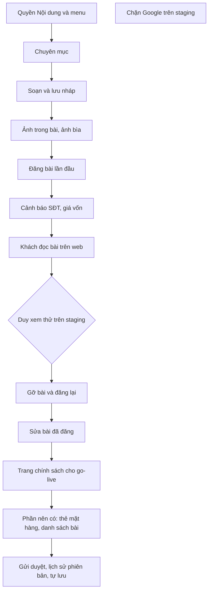

# CMS viết bài — User stories
> PO · 2026-09-28 · Nguồn: 01-analysis.md (ĐÃ DUYỆT 28/09, câu trả lời ở §13) · Trạng thái: **ĐÃ DUYỆT (Duy 28/09 — chốt scope qua câu hỏi)**

> Mã story dùng tiền tố **CMS** để khỏi trùng với hồ sơ khác. Hồ sơ `2026-09-28-khung-go-live` (GL-01…) làm **sau** hồ sơ này
> và dùng CMS-15 làm nền.



## Mục tiêu & thước đo
Chủ và Quản lý tự soạn, đăng, sửa, gỡ bài và trang trên web công khai mà không nhờ dev sửa code. Bài dẫn khách sang Shop.
Trang chính sách bắt buộc trước go-live được soạn bằng chính CMS này.
- **Đo thành công:** (1) Chủ đăng được bài đầu tiên trên staging từ điện thoại, không cần dev; (2) bốn trang bắt buộc
  go-live (chính sách bảo mật, điều kiện giao dịch chung, đổi trả hoàn tiền, thông tin người bán) đăng được bằng loại
  Trang; (3) test quét JSON công khai của bài không có khoá giá vốn và dữ liệu cá nhân nào; (4) không payload XSS nào
  trong bộ mẫu chạy được trên trang công khai.

## Phạm vi
**Trong:** loại Bài viết và Trang; chuyên mục; soạn trên ERP console bằng bộ định dạng giới hạn; ảnh trong bài giữ tỉ lệ;
thẻ mặt hàng dẫn sang Shop kèm UTM; vòng đời Nháp → Chờ duyệt → Đã đăng ⇄ Đã gỡ; phiên bản khi đăng và khôi phục;
danh sách tự kiểm và máy cảnh báo chuỗi giống SĐT/giá vốn; trang bài công khai **tải nội dung lúc chạy** (PA B);
tiêu đề và mô tả của trang; staging noindex; ba quyền ND-01/02/03 gán cho Group `chu` + `quan_ly`.

**Ngoài:** xem "Để sau".

## Định nghĩa chung dùng trong các story

- **Tác nhân:** Chủ (Group `chu`), Quản lý (`quan_ly`), NV kho (`nv_kho`), NV giao (`nv_giao`), Khách (không đăng nhập).
  Vai trò tự tạo **không làm đợt này**.
- **Quyền** (app mới, PO đề xuất tên `content`; Tech Lead chốt tên ở `02b`, giữ đúng ý nghĩa):

  | Mã | Django permission đề xuất | Mở gì |
  |---|---|---|
  | ND-01 Soạn | `content.view_entry`, `add_entry`, `change_entry`, `delete_entry` | Xem mọi bài kể cả nháp, tạo, sửa bản đang soạn, xoá **nháp chưa từng đăng**, gửi duyệt, tải ảnh |
  | ND-02 Đăng | `content.publish_entry` (Tầng 2, `Meta.permissions`) | Đăng, đăng lại, gỡ, trả về nháp, đặt vai trò trang go-live |
  | ND-03 Chuyên mục | `content.add_category`, `change_category` (xem chuyên mục đi theo ND-01) | Tạo, đổi tên, thứ tự, ngừng dùng |

  Data migration gán cả ba cho `chu` và `quan_ly`; **không** gán cho `nv_kho`, `nv_giao`. Test "chỉ có ND-01 mà không có
  ND-02" dùng một user thử được cấp quyền trực tiếp (không qua Group), vì hai Group có sẵn đều có đủ.
- **Trạng thái bài:** `draft` (Nháp), `pending_review` (Chờ duyệt), `published` (Đã đăng), `unpublished` (Đã gỡ).
  **Loại:** `post` (Bài viết), `page` (Trang).
- **Lỗi:** theo quy ước hiện có `{"detail": "<tiếng Việt>", "code": "<mã>"}`. Mã BR mới nhóm **BR-ND** theo 01-analysis §6.
- **Thân bài (`body`)** là JSON khối, **không phải HTML**. Contract để FE dựng mock (Tech Lead được đổi định dạng ở
  `02b`, nhưng nếu đổi phải sửa contract ở đây trước khi FE làm):
  ```json
  {"type": "doc", "blocks": [
    {"type": "heading", "level": 2, "text": "Rã đông đúng cách"},
    {"type": "paragraph", "children": [
      {"text": "Để cá "}, {"text": "trong ngăn mát", "marks": ["bold"]},
      {"text": " 8 tiếng. Xem thêm "}, {"text": "tại đây", "href": "https://example.com/huong-dan"}]},
    {"type": "list", "ordered": false, "items": [[{"text": "Không ngâm nước nóng"}]]},
    {"type": "quote", "children": [{"text": "Cá rã đông chậm giữ thịt chắc."}]},
    {"type": "image", "image_id": 71, "alt": "Cá thu cắt khoanh", "caption": "Ảnh minh hoạ"},
    {"type": "item_card", "item_code": "CA-THU-1KG"}
  ]}
  ```
  Khối cho phép: `heading` (level 2 hoặc 3), `paragraph`, `list`, `quote`, `image`, `item_card`. Mark cho phép: `bold`,
  `italic`. `href` chỉ nhận `https:`, `http:`, `mailto:`, `tel:` hoặc đường dẫn nội bộ bắt đầu bằng `/`.
- **Tham số trong settings/env, không hard-code:** `CONTENT_MAX_IMAGES_PER_ENTRY` (20), `CONTENT_TITLE_MAX` (200),
  `CONTENT_DESCRIPTION_MAX` (160), `CONTENT_LIST_PAGE_SIZE` (12), `CONTENT_COST_KEYWORDS` (mặc định: "giá mua", "giá vốn",
  "giá nhập", "giá cảng", "nhà cung cấp", "tiền lãi"; không dùng từ đơn "lời" vì dễ báo nhầm "lời khuyên"), `CONTENT_PHONE_ALLOWLIST` (hotline của vựa, mặc định rỗng),
  `CONTENT_PUBLIC_CACHE_SECONDS` (60).
- **Khoá lạc quan:** mọi lệnh ghi vào một bài gửi kèm `row_version`. Lệch thì trả 409 `STALE_VERSION`, không ghi đè.
- **Dữ liệu thử:** tên, SĐT trong test là dữ liệu giả; ảnh thử sinh bằng code lúc chạy test, không commit tệp ảnh
  (BR-DM-16).
- **Danh sách khoá cấm trong JSON công khai** (dùng ở nhiều AC, gọi tắt là **"bộ khoá cấm"**): `created_by`,
  `updated_by`, `username`, `email`, `first_name`, `last_name`, `published_by`, `phone`, `address`, `delivery_address`,
  `customer`, `purchase_rate`, `landed_unit_cost`, `rate`, `unit_cost`, `cost`, `profit`, `row_version`. Quét **đệ quy**
  toàn bộ JSON.

---

## CMS-01 — Quyền "Nội dung" và mục menu trên console · Must · BE+FE
**Là** Chủ vựa, **tôi muốn** chỉ Chủ và Quản lý thấy và dùng được mục "Nội dung", **để** nhân viên kho và giao hàng không
đăng gì lên web của vựa.

Bối cảnh: §4, §13 Q3 và Q10. Story nền: dựng app, quyền, route và mục menu rỗng (danh sách bài trống). Mọi story sau
dùng lại bộ test quyền ở đây. Theo Q10, API ghi của CMS sẽ tự thành lệnh AI; phần AI thuộc hồ sơ `ai-digital-worker`,
ở đây chỉ bảo đảm API không có đường tắt.

| Mã | Given | When | Then | BR |
|---|---|---|---|---|
| CMS-01-AC1 | DB sau migrate | Đọc quyền của từng Group | `chu` và `quan_ly` có đủ ND-01, ND-02, ND-03; `nv_kho` và `nv_giao` không có quyền nào của app `content` | BR-PQ, §13 Q3 |
| CMS-01-AC2 (quyền) | Token NV kho, rồi token NV giao | Gọi **từng** endpoint `/api/content/**` với mọi method (danh sách endpoint lấy từ router, test tham số hoá) | Tất cả trả 403; số dòng mọi bảng `content` không đổi | BR-PQ-12, 13 |
| CMS-01-AC3 (quyền) | Không đăng nhập | Gọi mọi endpoint `/api/content/**` | 401; không dữ liệu nào trả về | BR-PQ-12 |
| CMS-01-AC4 (không đường tắt) | Codebase sau story | Test liệt kê mọi route ghi của CMS (POST/PUT/PATCH/DELETE) | Route nào cũng khai permission class kiểm ND-01/02/03 trên chính endpoint; **không** có route ghi CMS dưới `internal/`, không có header, cờ hay token dịch vụ nào bỏ qua kiểm quyền; không route ghi nào dùng `AllowAny` | §13 Q10 |
| CMS-01-AC5 (AI = người dùng) | User thử chỉ có ND-01 | Gọi API đăng bài bằng token của user đó (đúng đường mà lệnh AI của user đó sẽ đi) | 403 giống hệt khi user tự bấm; không có đường thứ hai cho AI | §13 Q10 |
| CMS-01-AC6 (FE) | Đăng nhập console bằng NV kho | Mở menu; rồi gõ thẳng đường dẫn màn Nội dung | Menu không có "Nội dung"; gõ thẳng thì thấy màn "Không có quyền", không gọi API content nào | BR-PQ |
| CMS-01-AC7 (FE) | Đăng nhập bằng Quản lý | Mở "Nội dung" | Thấy danh sách bài (trống) với bộ lọc trạng thái Nháp / Chờ duyệt / Đã đăng / Đã gỡ và loại Bài viết / Trang | |

---

## CMS-02 — Quản lý chuyên mục · Must · BE+FE
**Là** Quản lý, **tôi muốn** tạo và sắp xếp chuyên mục (vd "Công thức", "Tin mùa vụ"), **để** bài viết được xếp nhóm cho
khách dễ tìm.

Bối cảnh: UC-ND-06, §13 Q5 (một bài một chuyên mục, chưa có thẻ). Không có xoá, chỉ **ngừng dùng**.

Contract:
```
GET   /api/content/categories/            → 200 [{"id":3,"name":"Công thức","slug":"cong-thuc","description":"","order":1,"is_active":true,"published_count":4}]
POST  /api/content/categories/            {"name":"Công thức","description":"","order":1} → 201 (slug tự sinh)
PATCH /api/content/categories/3/          {"name":"Món ngon","order":2} | {"is_active":false} → 200
Lỗi:  400 {"code":"BR-ND-04"} trùng tên/slug · 400 {"code":"BR-ND-02","entries":[{"id":42,"title":"…"}],"total":7} ngừng dùng khi còn bài Đã đăng
```

| Mã | Given | When | Then | BR |
|---|---|---|---|---|
| CMS-02-AC1 | Quản lý đăng nhập | Tạo chuyên mục "Công thức nấu" | 201, slug `cong-thuc-nau`, hiện trong danh sách theo `order` tăng dần | BR-ND-04 |
| CMS-02-AC2 (lỗi) | Đã có "Công thức nấu" | Tạo "cong thuc NẤU" | 400 `BR-ND-04` (so sánh sau khi bỏ dấu, chữ thường), không tạo dòng mới | BR-ND-04 |
| CMS-02-AC3 | Chuyên mục có 2 bài Đã đăng | Đổi tên thành "Món ngon" | 200; `slug` **không đổi**; bài công khai hiện tên mới | BR-ND-04 |
| CMS-02-AC4 (lỗi) | Chuyên mục còn 7 bài Đã đăng | Đặt `is_active=false` | 400 `BR-ND-02`, trả tối đa 5 bài kèm `total: 7`; chuyên mục vẫn hoạt động | BR-ND-02 |
| CMS-02-AC5 | Chuyên mục chỉ còn bài Nháp hoặc Đã gỡ | Ngừng dùng | 200; không còn trong danh sách chọn khi soạn; bài cũ vẫn giữ tham chiếu; không có API DELETE (gọi DELETE → 405) | BR-ND-02 |
| CMS-02-AC6 (quyền) | User thử chỉ có ND-01 | GET danh sách; rồi POST tạo | GET 200 (để chọn khi soạn); POST 403, không tạo dòng | BR-PQ |

---

## CMS-03 — Soạn và lưu nháp bài hoặc trang · Must · BE+FE
**Là** Quản lý, **tôi muốn** viết bài có tiêu đề, đường dẫn, đoạn trích và thân bài định dạng cơ bản rồi lưu nháp,
**để** chuẩn bị bài mà khách chưa thấy.

Bối cảnh: UC-ND-01 (luồng chính, E1, E2, E5, E6, E7), UC-ND-04 1b (xoá nháp), BR-ND-01, 04, 06. Trình soạn là phụ thuộc
mới của `erp-console` (Tech Lead chọn). Phải dùng được trên điện thoại. Ảnh (CMS-05), thẻ mặt hàng (CMS-06), tự lưu
(CMS-04) là story riêng; ở story này bấm "Lưu nháp" thủ công.

Contract:
```
GET    /api/content/entries/?status=draft&kind=post&category=3&page=1  → 200 {"count":1,"results":[{"id":42,"kind":"post","status":"draft","title":"…","slug":"…","category":3,"has_unpublished_changes":false,"updated_at":"…","source":"human"}]}
POST   /api/content/entries/   {"kind":"post","title":"Cách rã đông cá thu","slug":"","category":3,"excerpt":"","seo_title":"","seo_description":"","body":{"type":"doc","blocks":[]}}
       → 201 {"id":42,"kind":"post","status":"draft","title":"Cách rã đông cá thu","slug":"cach-ra-dong-ca-thu","slug_locked":false,
              "category":3,"excerpt":"","seo_title":"","seo_description":"","cover_image":null,"body":{…},
              "has_unpublished_changes":false,"published_version":null,"first_published_at":null,"last_published_at":null,
              "source":"human","row_version":1,"updated_at":"2026-10-01T08:00:00+07:00"}
GET    /api/content/entries/42/  → 200 (như trên)
PATCH  /api/content/entries/42/  {"row_version":1,"title":"…","body":{…}} → 200 (row_version tăng 1)
DELETE /api/content/entries/42/  → 204 (chỉ nháp chưa từng đăng)
Lỗi:   400 BR-ND-04 {"suggestion":"cach-ra-dong-ca-thu-2"} · 409 STALE_VERSION · 400 BR-ND-02 (xoá bài đã từng đăng)
```
`source` là `human` hoặc `ai`; hồ sơ AI dùng để gắn nhãn, ở đây luôn là `human`.

| Mã | Given | When | Then | BR |
|---|---|---|---|---|
| CMS-03-AC1 | Quản lý | Tạo bài "Cách rã đông cá thu" để trống slug | 201, `status=draft`, slug `cach-ra-dong-ca-thu`, `row_version=1`; API công khai với slug này trả 404 | BR-ND-01, 04 |
| CMS-03-AC2 | Quản lý | Nhập slug "Cá Thu  Đông!!" | Lưu thành `ca-thu-dong` (chữ thường, không dấu, gạch nối, không gạch nối đôi hay ở đầu/cuối) | BR-ND-04 |
| CMS-03-AC3 (lỗi) | Đã có bài slug `cach-ra-dong-ca-thu` ở trạng thái **Đã gỡ** | Tạo bài mới cùng slug | 400 `BR-ND-04`, `suggestion = "cach-ra-dong-ca-thu-2"`; không tạo bài | BR-ND-04 |
| CMS-03-AC4 (lỗi) | — | Lưu nháp với tiêu đề trống | 200/201, bài vẫn là Nháp (điều kiện tiêu đề chỉ chặn ở bước đăng, CMS-07) | UC-ND-01 E1 |
| CMS-03-AC5 (XSS lớp 1) | Bộ ≥ 12 payload mẫu: khối `type` lạ (`html`, `script`, `iframe`, `embed`), mark lạ, `href` = `javascript:…`, `data:…`, `vbscript:…`, chữ chứa `<script>alert(1)</script>`, `` trong text, thuộc tính thừa trên khối | PATCH từng payload | 200; body lưu **chỉ còn** khối và mark cho phép; `href` không hợp lệ bị bỏ (giữ chữ); chữ có ký tự `<` giữ nguyên dạng chữ; không field thừa nào được lưu | BR-ND-06 |
| CMS-03-AC6 (FE, dán) | Clipboard chứa HTML từ Word/web có `<script>`, `<iframe>`, `style`, bảng | Dán vào trình soạn | Chỉ còn chữ và định dạng cho phép; không có iframe hay script trong DOM trình soạn | BR-ND-06 |
| CMS-03-AC7 (lỗi, sửa trùng) | Chủ và Quản lý cùng mở bài ở `row_version=3`; Chủ lưu (→ 4) | Quản lý lưu với `row_version=3` | 409 `STALE_VERSION`; nội dung của Chủ còn nguyên; FE hiện "Bài đã được người khác sửa. Tải lại để xem bản mới" và không xoá chữ đang gõ | UC-ND-01 E5 |
| CMS-03-AC8 | Nháp **chưa từng đăng** | Bấm "Xoá", xác nhận | 204; bài mất khỏi DB; **không** có dòng AuditLog mới | BR-ND-02, §13 Q7 |
| CMS-03-AC9 (lỗi) | Bài đã từng đăng (đang Đã đăng hoặc Đã gỡ) | Gọi DELETE | 400 `BR-ND-02`; bài còn nguyên; FE không hiện nút "Xoá" với bài này | BR-ND-02 |
| CMS-03-AC10 | Nháp lưu 5 lần liên tiếp | Đếm AuditLog | Không tăng (lưu nháp không ghi AuditLog) | BR-ND-15 |
| CMS-03-AC11 (lỗi) | — | Lưu tiêu đề dài 201 ký tự | 400, thông báo giới hạn `CONTENT_TITLE_MAX` | |
| CMS-03-AC12 (quyền) | NV giao; và user thử chỉ có `view_entry` | POST, PATCH, DELETE | 403, không đổi dữ liệu | BR-PQ-12 |
| CMS-03-AC13 (FE, điện thoại) | Viewport 375×667 | Mở màn soạn, gõ, định dạng, lưu | Không cuộn ngang; mọi nút thanh công cụ có vùng chạm ≥ 44×44 px; nút "Lưu nháp" luôn thấy được khi bàn phím mở | PRODUCT.md |

---

## CMS-04 — Tự lưu và không mất bài khi rớt mạng · Should · FE
**Là** Chủ vựa đang soạn bài bằng 4G ở cảng, **tôi muốn** bài tự lưu và không mất khi mạng chập chờn, **để** không phải
viết lại.

Bối cảnh: UC-ND-01 bước 7, E4. Dùng lại API PATCH của CMS-03, BE không đổi. Bản tạm trên máy chỉ chứa nội dung bài
(không phải dữ liệu khách); xoá bản tạm ngay khi server lưu thành công.

| Mã | Given | When | Then | BR |
|---|---|---|---|---|
| CMS-04-AC1 | Đang sửa bài có mạng | Ngừng gõ 10 giây (`AUTOSAVE_IDLE_MS`, hằng số cấu hình FE) | Gọi PATCH đúng 1 lần; trạng thái "Đã lưu lúc hh:mm" | UC-ND-01 |
| CMS-04-AC2 (lỗi mạng) | Playwright đặt trình duyệt offline | Gõ thêm rồi tải lại trang | Trạng thái "Chưa lưu, đang giữ trên máy"; sau khi tải lại, nội dung vừa gõ được khôi phục kèm thông báo | UC-ND-01 E4 |
| CMS-04-AC3 | Tiếp AC2 | Bật mạng lại | Tự PATCH trong ≤ 10 giây; trạng thái "Đã lưu"; bản tạm trên máy bị xoá | |
| CMS-04-AC4 (lỗi) | Tự lưu nhận 409 `STALE_VERSION` | — | Không ghi đè; hiện nút "Tải bản mới" và giữ bản tạm để người soạn chép lại | UC-ND-01 E5 |
| CMS-04-AC5 | Có thay đổi chưa lưu | Bấm rời màn hoặc đóng tab | Hỏi xác nhận trước khi rời | |
| CMS-04-AC6 (quyền/dữ liệu) | Sau khi lưu thành công | Kiểm `localStorage`, `sessionStorage`, IndexedDB và URL | Không còn bản tạm của bài; URL chỉ có id bài | bất biến 9 |

---

## CMS-05 — Ảnh trong bài và ảnh bìa · Must · BE+FE
**Là** Quản lý, **tôi muốn** chèn ảnh chụp từ điện thoại vào bài và chọn ảnh bìa, **để** bài có hình thật của hàng.

Bối cảnh: UC-ND-01 bước 4, E3; BR-ND-07; dùng lại kiểm tra và kho lưu của `catalog/images` (BR-DM-10, 11, 14, 16) nhưng
**giữ tỉ lệ, không cắt vuông**. Kho lưu, bucket và cỡ ảnh Tech Lead chốt.

Contract:
```
POST /api/content/entries/42/images/   multipart: file, alt?  → 201 {"id":71,"alt":"Cách rã đông cá thu","width":1600,"height":1200,
                                        "urls":{"sm":"https://…/content/71-480.webp","md":"…-960.webp","lg":"…-1600.webp"}}
PATCH /api/content/entries/42/  {"row_version":5,"cover_image":71} → 200
PATCH /api/content/images/71/   {"alt":"…"} → 200
Lỗi:  400 BR-DM-10 (định dạng, dung lượng, SVG, tệp giả) · 400 BR-ND-07 (quá số ảnh)
```

| Mã | Given | When | Then | BR |
|---|---|---|---|---|
| CMS-05-AC1 | Ảnh JPEG 4000×3000 có EXIF GPS (sinh bằng Pillow) | Tải lên bài 42 | 201; các cỡ WebP giữ tỉ lệ 4:3 (sai số ≤ 1 px); đọc lại tệp đã xử lý không còn EXIF/GPS | BR-ND-07, BR-DM-10 |
| CMS-05-AC2 (lỗi) | Tệp SVG; tệp `.jpg` thực chất là văn bản; ảnh 10 MB + 1 byte | Tải lên | 400 `BR-DM-10` từng trường hợp; không object nào được ghi; bài không đổi | BR-DM-10 |
| CMS-05-AC3 (lỗi) | Bài đã có 20 ảnh | Tải ảnh thứ 21 | 400 `BR-ND-07` | BR-ND-07 |
| CMS-05-AC4 | Không nhập alt | Tải lên | `alt` = tiêu đề bài; alt sửa được, ≤ 200 ký tự | BR-DM-11 |
| CMS-05-AC5 | Ảnh X có trong phiên bản đã đăng số 1 | Gỡ X khỏi bài rồi đăng phiên bản 2 | URL của X vẫn trả 200; BE không gọi xoá object nào | BR-DM-14, BR-ND-07 |
| CMS-05-AC6 (lỗi mạng, FE) | Đang tải ảnh thì mất mạng | — | Bài không có khối ảnh hỏng; hiện "Tải ảnh lỗi, thử lại" | UC-ND-01 E4 |
| CMS-05-AC7 (quyền) | NV kho | POST ảnh | 403; không object nào được ghi | BR-PQ-12 |
| CMS-05-AC8 (FE) | Điện thoại | Bấm "Chèn ảnh" | Mở được camera hoặc thư viện ảnh; có thanh tiến trình | |

---

## CMS-06 — Thẻ mặt hàng dẫn sang Shop · Should · BE+FE
**Là** Chủ vựa, **tôi muốn** chèn thẻ một mặt hàng đang bán vào bài, **để** khách đọc xong bấm sang mua ngay đúng món đó.

Bối cảnh: UC-ND-01 bước 5, UC-ND-05 bước 3–4 và E1, UC-ND-03 E2; BR-ND-09, 10. Thẻ chỉ lưu `item_code`; giá và tồn lấy
**lúc khách xem** từ API Shop công khai có sẵn (`GET /api/shop/catalog/` và `/api/shop/catalog/<code>/`). Should vì bài
vẫn có liên kết thường tới Shop khi chưa có thẻ.

| Mã | Given | When | Then | BR |
|---|---|---|---|---|
| CMS-06-AC1 | Đang soạn bài | Gõ "thu" ở ô "Chèn mặt hàng" | Hiện mặt hàng đang bán khớp tên hoặc mã, lấy từ API Shop công khai; chọn thì thêm khối `{"type":"item_card","item_code":"…"}` | BR-ND-10 |
| CMS-06-AC2 (lỗi) | — | Lưu body có `item_card` với mã không tồn tại | 400 `BR-ND-10`; body không đổi | BR-ND-10 |
| CMS-06-AC3 | Bài đã đăng có thẻ `CA-THU-1KG` giá 250.000 đ | Chủ đổi giá Shop thành 260.000 đ, **không** đăng lại bài; khách mở bài | Thẻ hiện 260.000 đ | BR-ND-10 |
| CMS-06-AC4 | Bài slug `cach-ra-dong-ca-thu` | Khách bấm "Xem giá & đặt" | Sang đúng `/shop/item?code=CA-THU-1KG&utm_source=caveve_web&utm_medium=bai_viet&utm_campaign=cach-ra-dong-ca-thu`, không thêm tham số nào khác | BR-ND-09 |
| CMS-06-AC5 (lỗi) | Mặt hàng trong thẻ đã ẩn, hết hàng, hoặc API catalog trả 404/500 | Khách mở bài | Thẻ hiện "Tạm hết hàng", nút dẫn `/shop` kèm cùng UTM; phần còn lại của bài hiển thị đủ | UC-ND-05 E1 |
| CMS-06-AC6 | Bài đã đăng có thẻ mặt hàng đang ẩn | Quản lý đăng lại bài | Bước kiểm trước khi đăng (CMS-08) có cảnh báo `item_unavailable` kèm mã hàng; không chặn | UC-ND-03 E2 |
| CMS-06-AC7 (giá vốn) | Trang bài công khai có thẻ | Ghi lại mọi request mạng của trang (Playwright) và quét JSON | Chỉ gọi `/api/public/content/**` và `/api/shop/catalog/**`; không request nào tới API ERP; không JSON nào có khoá trong bộ khoá cấm | bất biến 1, BR-ND-10 |

---

## CMS-07 — Đăng bài lần đầu · Must · BE+FE
**Là** Quản lý, **tôi muốn** bấm Đăng sau khi hệ thống kiểm đủ điều kiện và tôi xác nhận danh sách tự kiểm, **để** bài
lên web đúng và có bằng chứng ai đăng lúc nào.

Bối cảnh: UC-ND-02 (luồng chính, E1, E3, E4), BR-ND-03, 04, 05, 13, 15. Bài lên web **ngay** vì trang đọc lúc chạy (§13
Q1). Máy quét cảnh báo là CMS-08; story này đã có tham số `acknowledge_warnings` để hai story ghép khớp.

Contract:
```
POST /api/content/entries/42/publish/  {"row_version":7,"checklist_confirmed":true,"acknowledge_warnings":false}
  → 200 {"status":"published","version":1,"published_at":"…","public_path":"/bai-viet?slug=cach-ra-dong-ca-thu"}
  → 400 {"code":"BR-ND-03","missing":["title","body","category","cover_image","cover_image_alt","description"]}
  → 400 {"code":"BR-ND-13"}              (chưa xác nhận danh sách tự kiểm)
  → 409 {"code":"CONTENT_WARNINGS","warnings":[…]}   (CMS-08)
  → 409 {"code":"STALE_VERSION"} · 409 {"code":"BR-ND-02","detail":"Bài đã được đăng"} (đăng trùng)
```
Điều kiện đăng: Bài viết cần tiêu đề, slug, thân bài có ít nhất 1 khối, chuyên mục đang hoạt động, ảnh bìa có alt, mô
tả (`seo_description`, trống thì lấy `excerpt` cắt `CONTENT_DESCRIPTION_MAX` ký tự). Trang: như trên nhưng **không** cần
chuyên mục và ảnh bìa.

| Mã | Given | When | Then | BR |
|---|---|---|---|---|
| CMS-07-AC1 | Nháp đủ điều kiện, Quản lý đã tick 5 mục tự kiểm | Đăng | 200; `status=published`; có đúng 1 phiên bản số 1 chụp tiêu đề, slug, body, SEO, ảnh bìa, người đăng, thời điểm; `slug_locked=true`; API công khai trả bài | BR-ND-05 |
| CMS-07-AC2 | Tiếp AC1 | Đọc AuditLog | Đúng 1 dòng `content_publish`, `changes` chỉ gồm `entry_id`, `version`, `kind`; **không** chứa tiêu đề hay chữ nào của thân bài | BR-ND-15, BR-PQ-04 |
| CMS-07-AC3 (lỗi) | Nháp thiếu chuyên mục và alt ảnh bìa | Đăng | 400 `BR-ND-03`, `missing` liệt kê đúng 2 mục; bài vẫn Nháp; không phiên bản, không AuditLog; FE hiện từng mục thiếu | BR-ND-03 |
| CMS-07-AC4 (lỗi) | `checklist_confirmed=false` | Đăng | 400 `BR-ND-13`; FE: nút "Đăng" bị khoá tới khi tick đủ 5 mục (a)–(e) của BR-ND-13 | BR-ND-13 |
| CMS-07-AC5 | Nháp có `excerpt` 300 ký tự, `seo_description` trống | Đăng | Mô tả công khai = excerpt cắt còn ≤ 160 ký tự, không cắt giữa chữ | BR-ND-11 |
| CMS-07-AC6 (đồng thời) | Chủ và Quản lý cùng bấm Đăng một nháp | Hai request song song | Đúng 1 request 200; request kia 409; DB có 1 phiên bản và 1 dòng AuditLog | UC-ND-02 E3 |
| CMS-07-AC7 (lỗi) | Bài đã đăng | PATCH đổi `slug` | 400 `BR-ND-04`; slug không đổi | BR-ND-04, §13 Q6 |
| CMS-07-AC8 (quyền) | User thử chỉ có ND-01; NV kho | Gọi publish | 403; bài không đổi; FE của user chỉ có ND-01 không hiện nút "Đăng" (thấy "Gửi duyệt", CMS-09) | BR-PQ-12 |
| CMS-07-AC9 (dữ liệu công khai) | Bài vừa đăng | GET API công khai | JSON không có khoá nào trong bộ khoá cấm; `author = "Cá Về"` | BR-ND-14, bất biến 1, 9 |

---

## CMS-08 — Cảnh báo chuỗi giống SĐT và từ khoá giá vốn trước khi đăng · Must · BE+FE
**Là** Chủ vựa, **tôi muốn** hệ thống nhắc khi bài có số điện thoại hoặc chữ về giá mua, **để** không lỡ tay đăng thông tin
khách hay giá vốn lên web.

Bối cảnh: UC-ND-02 bước 3, BR-ND-13, §13 Q9 (cảnh báo, không chặn cứng), rủi ro R1, R2. Quét tiêu đề, đoạn trích, SEO,
alt ảnh, chú thích ảnh và thân bài. Áp cho đăng lần đầu, đăng lại và gửi duyệt.

Contract (bổ sung cho CMS-07):
```
409 {"code":"CONTENT_WARNINGS","warnings":[
  {"type":"phone_like","field":"body","snippet":"…gọi chị Lan 09xx xxx 678 để…"},
  {"type":"cost_keyword","field":"body","snippet":"…giá mua tại cảng…"},
  {"type":"item_unavailable","item_code":"CA-THU-1KG"}]}
```

| Mã | Given | When | Then | BR |
|---|---|---|---|---|
| CMS-08-AC1 | Thân bài chứa lần lượt `0912 345 678`, `0912.345.678`, `+84 912345678`, `84912345678` | Đăng với `acknowledge_warnings=false` | 409 `CONTENT_WARNINGS`, mỗi trường hợp có `phone_like`; `snippet` **đã che**, chỉ lộ 3 số cuối; bài chưa đăng | BR-ND-13 (b) |
| CMS-08-AC2 | Thân bài chứa "giá mua tại cảng 80k" | Đăng | 409, có `cost_keyword`; từ khoá lấy từ `CONTENT_COST_KEYWORDS`, không phân biệt hoa thường và dấu | BR-ND-13 (a) |
| CMS-08-AC3 (không báo nhầm) | Chuỗi `250.000đ`, `1.200 kg`, `28/09/2026`, `SO-2026-00012`, `10.000.000 đ` | Đăng | Không có cảnh báo `phone_like` | §13 Q9 |
| CMS-08-AC4 | Số trong `CONTENT_PHONE_ALLOWLIST` (hotline vựa) | Đăng | Không cảnh báo số đó | §13 Q9 |
| CMS-08-AC5 | Đã nhận 409 | Người đăng xem danh sách, bấm "Tôi đã kiểm, vẫn đăng" (`acknowledge_warnings=true`) | 200; AuditLog `content_publish` có `warnings_acknowledged: ["phone_like"]` (chỉ **loại** cảnh báo, không có đoạn chữ) | BR-ND-15 |
| CMS-08-AC6 | Chuỗi giống SĐT nằm ở alt ảnh | Đăng | Có cảnh báo với `field = "image_alt"` | BR-ND-13 |
| CMS-08-AC7 (log) | Bắt log trong lúc quét và đăng | Chạy AC1 | Không dòng log nào chứa số điện thoại đầy đủ | bất biến 9 |
| CMS-08-AC8 (quyền) | NV giao | Gọi publish với `acknowledge_warnings=true` | 403 (quyền kiểm trước khi quét) | BR-PQ-12 |

---

## CMS-09 — Gửi duyệt bài · Should · BE+FE
**Là** người chỉ có quyền soạn, **tôi muốn** gửi bài cho Chủ hoặc Quản lý duyệt, **để** bài được đăng mà tôi không cần
quyền đăng.

Bối cảnh: UC-ND-02 1a, §13 Q4. Hiện hai Group có sẵn đều có quyền đăng, nên luồng này phục vụ user được cấp riêng ND-01 và
nháp do AI soạn sau này (hồ sơ AI). "Trả về nháp" là hệ quả tất yếu của Chờ duyệt, PO thêm action AuditLog
`content_submit`, `content_return` (mới, ghi vào hồ sơ).

Contract:
```
POST /api/content/entries/42/submit/  {"row_version":7}                    → 200 {"status":"pending_review"}
POST /api/content/entries/42/return/  {"row_version":8,"reason":"missing_info"} → 200 {"status":"draft"}
     reason ∈ {"missing_info","wrong_content","legal_risk","other"}
```

| Mã | Given | When | Then | BR |
|---|---|---|---|---|
| CMS-09-AC1 | User thử chỉ có ND-01, nháp đủ điều kiện BR-ND-03 | Bấm "Gửi duyệt" | 200, `status=pending_review`; AuditLog `content_submit` | BR-ND-02 |
| CMS-09-AC2 (lỗi) | Nháp thiếu điều kiện | Gửi duyệt | 400 `BR-ND-03` với danh sách thiếu như CMS-07 | BR-ND-03 |
| CMS-09-AC3 | Có 2 bài Chờ duyệt | Quản lý mở Nội dung | Bộ lọc "Chờ duyệt" hiện số 2; mở bài đăng được như CMS-07 | |
| CMS-09-AC4 | Bài Chờ duyệt | Quản lý bấm "Trả về nháp", chọn lý do | 200, `status=draft`; người soạn thấy lý do trên bài; AuditLog `content_return` chỉ có mã lý do | BR-ND-15 |
| CMS-09-AC5 (quyền) | User thử chỉ có ND-01 | Gọi `return` hoặc `publish` với bài Chờ duyệt | 403 | BR-PQ-12 |
| CMS-09-AC6 (lỗi) | Bài Đã đăng | Gọi `submit` | 400 `BR-ND-02` | BR-ND-02 |

---

## CMS-10 — Sửa bài đã đăng và đăng bản cập nhật · Must · BE+FE
**Là** Quản lý, **tôi muốn** sửa bài đang hiện mà khách vẫn thấy bản cũ tới khi tôi bấm cập nhật, **để** không lộ bản
đang sửa dở.

Bối cảnh: UC-ND-03 (luồng chính, 2a), BR-ND-05. Endpoint đăng dùng chung với CMS-07.

Contract bổ sung: `POST /api/content/entries/42/discard-changes/ {"row_version":9}` → 200 (bản đang soạn quay về phiên
bản đã đăng mới nhất).

| Mã | Given | When | Then | BR |
|---|---|---|---|---|
| CMS-10-AC1 | Bài Đã đăng phiên bản 1 | Sửa tiêu đề và lưu | ERP `has_unpublished_changes=true`; API công khai **vẫn** trả tiêu đề của phiên bản 1 | BR-ND-05 |
| CMS-10-AC2 | Tiếp AC1 | Bấm "Cập nhật bài" | Phiên bản 2; API công khai trả tiêu đề mới; `updated_at` đổi, `published_at` giữ ngày đăng đầu; AuditLog `content_republish` với `version: 2` | BR-ND-05, 15 |
| CMS-10-AC3 | Bài có thay đổi chưa đăng | Bấm "Bỏ thay đổi" | Bản đang soạn bằng phiên bản đã đăng mới nhất; `has_unpublished_changes=false` | UC-ND-03 2a |
| CMS-10-AC4 (lỗi) | Không có thay đổi nào so với phiên bản mới nhất | Cập nhật | 400 `BR-ND-05` "Không có thay đổi để đăng"; không tạo phiên bản | BR-ND-05 |
| CMS-10-AC5 (append-only) | Có phiên bản 1 | Sửa hoặc xoá phiên bản qua ORM `save()` / `delete()` | Raise lỗi; không có API sửa hay xoá phiên bản | BR-ND-05, bất biến 4 |
| CMS-10-AC6 (quyền) | User thử chỉ có ND-01 | Sửa bài đã đăng; rồi gọi publish | Sửa 200; publish 403; web vẫn hiện bản cũ | BR-PQ-12 |

---

## CMS-11 — Lịch sử phiên bản và khôi phục · Should · BE+FE
**Là** Chủ vựa, **tôi muốn** xem các lần đăng trước và khôi phục một bản cũ, **để** sửa nhanh khi bản mới bị sai.

Bối cảnh: UC-ND-03 2b, BR-ND-05. Khôi phục = nạp nội dung cũ vào bản đang soạn rồi đăng thành phiên bản **mới**.

Contract:
```
GET  /api/content/entries/42/versions/            → 200 [{"version":3,"published_at":"…","published_by_name":"Quản lý A","title":"…"}]   (ERP, có quyền ND-01)
GET  /api/content/entries/42/versions/1/          → 200 {…nội dung đầy đủ phiên bản 1…}
POST /api/content/entries/42/versions/1/restore/  {"row_version":11} → 200 (bản đang soạn = nội dung phiên bản 1)
```

| Mã | Given | When | Then | BR |
|---|---|---|---|---|
| CMS-11-AC1 | Bài có phiên bản 1, 2, 3 | Mở "Lịch sử" | Thấy 3 dòng mới nhất trước, có thời điểm và người đăng; danh sách không trả thân bài | BR-ND-05 |
| CMS-11-AC2 | Đang ở phiên bản 3 | Khôi phục phiên bản 1 rồi "Cập nhật bài" | Phiên bản 4 có nội dung bằng phiên bản 1; phiên bản 1–3 không đổi; AuditLog `content_restore_version` với `restored_from: 1`, `version: 4` | BR-ND-05, 15 |
| CMS-11-AC3 (lỗi) | Bản đang soạn có thay đổi chưa đăng | Bấm khôi phục | FE hỏi "Bản đang soạn sẽ bị thay"; huỷ thì không đổi gì | |
| CMS-11-AC4 (quyền) | NV kho | GET versions | 403 | BR-PQ-12 |
| CMS-11-AC5 (dữ liệu) | — | GET `versions` | `published_by_name` chỉ có ở API ERP; API công khai không có khoá nào trong bộ khoá cấm | BR-ND-14 |

---

## CMS-12 — Gỡ bài và đăng lại · Must · BE+FE
**Là** Chủ vựa, **tôi muốn** gỡ ngay một bài sai giá hoặc bị khiếu nại, **để** khách không còn thấy, mà hệ thống vẫn giữ
bằng chứng.

Bối cảnh: UC-ND-04, BR-ND-02, 15. Trang đọc lúc chạy nên gỡ có hiệu lực ngay, không cần đường gỡ khẩn riêng (§13 Q1).
Lý do gỡ chọn từ danh sách để AuditLog không chứa chữ tự do (tránh lọt dữ liệu cá nhân).

Contract:
```
POST /api/content/entries/42/unpublish/  {"row_version":12,"reason":"wrong_price"} → 200 {"status":"unpublished"}
     reason ∈ {"wrong_price","complaint","out_of_season","wrong_content","other"}
POST /api/content/entries/42/publish/   (đăng lại, như CMS-07)
GET  /api/public/content/entries/<slug>/ với bài Đã gỡ → 410 {"code":"GONE"}
```

| Mã | Given | When | Then | BR |
|---|---|---|---|---|
| CMS-12-AC1 | Bài Đã đăng | Gỡ với lý do `wrong_price` | 200, `status=unpublished`; API công khai trả 410; bài biến mất khỏi danh sách công khai; AuditLog `content_unpublish` với `reason` | BR-ND-02, 15 |
| CMS-12-AC2 (lỗi) | — | Gỡ không có `reason` hoặc `reason` ngoài danh sách | 400; bài vẫn Đã đăng | BR-ND-15 |
| CMS-12-AC3 | Tiếp AC1 | Kiểm header API công khai | `Cache-Control` có `max-age` ≤ `CONTENT_PUBLIC_CACHE_SECONDS` (60), để bài gỡ biến mất khỏi mọi trình duyệt trong ≤ 60 giây | BR-ND-15 |
| CMS-12-AC4 (FE) | Khách mở link bài đã gỡ | — | Trang "Bài này không còn trên web" có link về Shop; không hiện nội dung cũ | UC-ND-04 |
| CMS-12-AC5 | Bài Đã gỡ | Đăng lại | Phiên bản n+1, cùng slug cũ; API công khai trả 200; AuditLog `content_republish` | UC-ND-04 1a |
| CMS-12-AC6 | Bài Đã gỡ | Kiểm DB | Bài và mọi phiên bản còn nguyên; DELETE trả 400 `BR-ND-02` | BR-ND-02 |
| CMS-12-AC7 (quyền) | User thử chỉ có ND-01; NV giao | Gỡ | 403; bài vẫn Đã đăng | BR-PQ-12 |

---

## CMS-13 — Khách đọc bài trên web công khai · Must · BE+FE
**Là** Khách, **tôi muốn** mở link bài được chia sẻ và đọc trên điện thoại, **để** biết thêm về món cá rồi sang Shop mua.

Bối cảnh: UC-ND-05, BR-ND-06 (lớp 2), 08, 11 (rút gọn), 14. PA B: một trang tĩnh `/bai-viet?slug=…` trong `frontend/` tải
bài qua API lúc chạy (cùng mẫu `/shop/item?code=`). Khi API tắt thì trang không hiện được bài, **chấp nhận** (§13 Q1).

Contract:
```
GET /api/public/content/entries/cach-ra-dong-ca-thu/  (AllowAny, chỉ GET)
→ 200 {"kind":"post","slug":"cach-ra-dong-ca-thu","title":"Cách rã đông cá thu","description":"…","excerpt":"…",
       "category":{"slug":"cong-thuc","name":"Công thức"},
       "cover_image":{"alt":"…","width":1600,"height":1200,"urls":{"sm":"…","md":"…","lg":"…"}},
       "body":{…}, "published_at":"…","updated_at":"…","version":3,"effective_from":"…","author":"Cá Về"}
→ 404 {"code":"NOT_FOUND"} (không có, hoặc chỉ là nháp/chờ duyệt) · 410 {"code":"GONE"} (Đã gỡ)
```

| Mã | Given | When | Then | BR |
|---|---|---|---|---|
| CMS-13-AC1 | Bài Đã đăng phiên bản 3 | Khách mở `/bai-viet?slug=cach-ra-dong-ca-thu` | Hiện tiêu đề, "Cá Về", ngày đăng, "Cập nhật ngày …" (khi đã đăng lại), ảnh bìa có alt, thân bài; `document.title` = `seo_title` (hoặc tiêu đề) + " \| Cá Về"; có `<meta name="description">` bằng `description` | BR-ND-11, 14 |
| CMS-13-AC2 (XSS lớp 2) | Ghi thẳng vào DB (bỏ qua lớp 1) một phiên bản có khối lạ, `href="javascript:alert(1)"`, chữ `` | Khách mở bài | Không có hộp thoại nào bật (Playwright nghe sự kiện `dialog`); khối lạ không hiện; chữ hiện nguyên văn; link `javascript:` không bấm được | BR-ND-06 |
| CMS-13-AC3 (XSS, mã) | Mã nguồn `frontend/` phần hiển thị bài | Tìm `dangerouslySetInnerHTML` | Không dùng trong phần hiển thị bài | BR-ND-06 |
| CMS-13-AC4 (lỗi) | Slug không tồn tại; slug của bài Nháp hoặc Chờ duyệt | Mở trang | Cả hai hiện "Không tìm thấy bài" với link về Landing và Shop; API trả 404 (không lộ bài nháp có tồn tại) | UC-ND-05 E3 |
| CMS-13-AC5 (dữ liệu) | Bài Đã đăng | Quét đệ quy JSON của API công khai | Không có khoá nào trong bộ khoá cấm; chỉ các khoá liệt kê trong contract | BR-ND-14, bất biến 1, 9 |
| CMS-13-AC6 | Bài có link ngoài và link nội bộ `/shop` | Kiểm DOM | Link ngoài có `target="_blank"` và `rel="nofollow noopener noreferrer"`; link nội bộ mở cùng tab | BR-ND-08 |
| CMS-13-AC7 (lỗi) | API trả 500 hoặc không kết nối được | Mở trang | Hiện "Chưa tải được bài" và nút "Thử lại"; không trắng trang; console không in dữ liệu nào ngoài mã lỗi | UC-ND-05 E2 |
| CMS-13-AC8 (bên thứ ba) | Mở một bài | Ghi request mạng | Chỉ tới tên miền web, API và bucket ảnh; không analytics, pixel hay font ngoài | BR-ND-14 |
| CMS-13-AC9 (quyền) | Không đăng nhập | POST/PUT/PATCH/DELETE vào `/api/public/content/**` | 405; dữ liệu không đổi | BR-PQ-12 |
| CMS-13-AC10 (điện thoại) | Viewport 375×667 | Mở bài 20 ảnh | Không cuộn ngang; ảnh trong thân bài tải lười (`loading="lazy"`), ảnh bìa thì không | |

---

## CMS-14 — Danh sách bài và chuyên mục trên web · Should · BE+FE
**Là** Khách, **tôi muốn** xem các bài mới và lọc theo chuyên mục, **để** đọc thêm bài khác.

Bối cảnh: UC-ND-05 1a. Trang Landing hiện là tĩnh; khối "Bài mới" tải lúc chạy, lỗi thì ẩn, không ảnh hưởng phần còn lại.

Contract:
```
GET /api/public/content/entries/?kind=post&category=cong-thuc&page=1
→ 200 {"count":25,"next":"…","previous":null,"results":[{"slug":"…","title":"…","excerpt":"…","category":{"slug":"…","name":"…"},
       "cover_image":{"alt":"…","urls":{"sm":"…"}},"published_at":"…"}]}      (không có body)
GET /api/public/content/categories/ → 200 [{"slug":"cong-thuc","name":"Công thức","description":""}]   (chỉ chuyên mục đang hoạt động có ≥ 1 bài Đã đăng)
```

| Mã | Given | When | Then | BR |
|---|---|---|---|---|
| CMS-14-AC1 | 25 bài Đã đăng, 3 bài Nháp, 2 Trang | Mở `/bai-viet` | Trang 1 có 12 bài, mới nhất trước, có nút sang trang 2; không có Nháp và Trang | BR-ND-01 |
| CMS-14-AC2 | — | Chọn chuyên mục "Công thức" | Chỉ bài thuộc chuyên mục đó; URL có `?chuyen-muc=cong-thuc`; chuyên mục không có bài thì hiện "Chưa có bài" | |
| CMS-14-AC3 | Có ≥ 3 bài Đã đăng | Mở Landing | Khối "Bài mới" có 3 bài mới nhất và link "Xem tất cả" | |
| CMS-14-AC4 (lỗi) | API tắt | Mở Landing | Khối "Bài mới" ẩn; phần còn lại của Landing hiện đủ | UC-ND-05 E2 |
| CMS-14-AC5 (dữ liệu) | — | Quét JSON danh sách | Không có `body`, không khoá nào trong bộ khoá cấm | BR-ND-14 |
| CMS-14-AC6 (lỗi) | — | `page=999` | 404 hoặc danh sách rỗng; không 500 | |

---

## CMS-15 — Trang nội dung và phiên bản có hiệu lực · Must · BE+FE
**Là** Chủ vựa, **tôi muốn** soạn các trang chính sách bằng CMS, đánh dấu trang bắt buộc go-live và tra được bản nào có
hiệu lực ngày nào, **để** trả lời khách khiếu nại "lúc tôi đặt, chính sách ghi khác" và để checkout trỏ đúng phiên bản
chính sách khách đã đồng ý.

Bối cảnh: UC-ND-07, BR-ND-01, 16. Nền cho hồ sơ `2026-09-28-khung-go-live` (GL-02, GL-03). Trang hiện ở
`/trang?slug=…` (đường dẫn đẹp như `/chinh-sach-bao-mat` để sau cùng SEO). Nội dung pháp lý do `legal-vn` soạn, Duy duyệt;
story này chỉ làm khung.

Contract:
```
PATCH /api/content/entries/50/  {"row_version":2,"page_role":"privacy","show_in_footer":true,"footer_order":1}
      page_role ∈ {null,"privacy","terms","refund","seller_info"} ; required_for_golive = (page_role != null), chỉ đọc
GET   /api/public/content/pages/by-role/privacy/   → 200 {"slug":"chinh-sach-bao-mat","title":"…","version":3,"version_id":918,"effective_from":"…"}  | 404
GET   /api/public/content/footer-links/            → 200 [{"title":"Chính sách bảo mật","slug":"chinh-sach-bao-mat"}]
GET   /api/content/golive-status/                  → 200 {"missing_roles":["refund","seller_info"]}   (ERP, ND-01)
```

| Mã | Given | When | Then | BR |
|---|---|---|---|---|
| CMS-15-AC1 | Quản lý tạo `kind=page` "Chính sách bảo mật", không chuyên mục, không ảnh bìa | Đăng | 200; hiện ở `/trang?slug=chinh-sach-bao-mat` với dòng "Có hiệu lực từ dd/mm/yyyy"; không xuất hiện trong danh sách bài (CMS-14) | BR-ND-01, 16 |
| CMS-15-AC2 | Trang có `page_role=privacy` | Đặt `page_role=privacy` cho trang thứ hai | 400 `BR-ND-16` (mỗi vai trò chỉ một trang) | BR-ND-16 |
| CMS-15-AC3 (lỗi) | Trang `privacy` Đã đăng | Gỡ | 400 `BR-ND-16` "Trang bắt buộc go-live chỉ sửa và đăng lại"; FE không hiện nút Gỡ | BR-ND-16 |
| CMS-15-AC4 | Trang privacy đăng phiên bản 1 lúc 01/10 09:00, phiên bản 2 lúc 15/10 09:00 | Gọi service `effective_version("privacy", at)` với `at` = 10/10 và 16/10 | Trả phiên bản 1 và phiên bản 2; `at` trước 01/10 trả None | BR-ND-16 |
| CMS-15-AC5 | Trang privacy đang ở phiên bản 2 | GET `pages/by-role/privacy/` | `version: 2`, `version_id` là id phiên bản đã đăng; khoá chỉ gồm các khoá trong contract | BR-ND-16 |
| CMS-15-AC6 | 3 trang Đã đăng có `show_in_footer`, 1 trang không | GET `footer-links` | 3 link theo `footer_order`; không có trang Nháp hay Đã gỡ | UC-ND-07 bước 3 |
| CMS-15-AC7 | Chưa có trang `refund`, `seller_info` Đã đăng | Quản lý mở Nội dung | Banner "Thiếu trang bắt buộc go-live: Đổi trả & hoàn tiền, Thông tin người bán"; `golive-status` trả đúng 2 vai trò | BR-ND-16 |
| CMS-15-AC8 (quyền) | User thử chỉ có ND-01 | PATCH `page_role` hoặc `show_in_footer` | 403; field không đổi (đặt vai trò trang là việc của người có ND-02) | BR-PQ-12 |
| CMS-15-AC9 (quyền) | NV kho | GET `golive-status` | 403 | BR-PQ-12 |

---

## CMS-16 — Staging không bị Google lập chỉ mục · Should · FE
**Là** Duy, **tôi muốn** web staging luôn chặn máy tìm kiếm, **để** bài thử không bị Google coi là nội dung trùng với web
thật.

Bối cảnh: UC-ND-08 E1, BR-ND-12 (phần còn giữ sau §13 Q1). Độc lập, làm lúc nào cũng được, nên làm sớm vì staging hiện
chưa có `robots`.

| Mã | Given | When | Then | BR |
|---|---|---|---|---|
| CMS-16-AC1 | Build `frontend` với `NEXT_PUBLIC_SITE_ENV=staging` | Đọc `out/robots.txt` và HTML tĩnh của mọi trang | `robots.txt` là `User-agent: *` + `Disallow: /`; mọi HTML có `<meta name="robots" content="noindex, nofollow">` ngay trong HTML ban đầu | BR-ND-12 |
| CMS-16-AC2 | Build với `NEXT_PUBLIC_SITE_ENV=production` | Như trên | `robots.txt` cho phép (`Allow: /`); không có meta noindex | BR-ND-12 |
| CMS-16-AC3 (lỗi) | Build **không** truyền `NEXT_PUBLIC_SITE_ENV` | `npm run build` | Build dừng với thông báo nêu rõ biến bị thiếu (tránh production vô tình noindex hoặc staging vô tình được index) | BR-ND-12 |
| CMS-16-AC4 | — | Đọc `doc/ops/moi-truong.md` | Lệnh build staging và production có thêm `NEXT_PUBLIC_SITE_ENV` | |

---

## Thứ tự làm đề xuất
1. **CMS-01** (nền quyền) và **CMS-16** (độc lập, rẻ) làm trước.
2. **CMS-02 → CMS-03 → CMS-05**: soạn được nháp có ảnh.
3. **CMS-07 → CMS-08 → CMS-13**: đăng và khách đọc được. Đây là lát đầu tiên Duy xem được trên staging.
4. **CMS-12 → CMS-10**: gỡ và sửa bài đã đăng (gỡ trước vì là việc khẩn khi bài sai).
5. **CMS-15**: mở đường cho hồ sơ khung go-live.
6. **CMS-06 → CMS-14 → CMS-09 → CMS-11 → CMS-04**: phần Should.

BE và FE làm song song theo contract trong từng story. FE dựng mock theo đúng JSON mẫu.

## Rủi ro / phụ thuộc
- **Production API đang tắt:** trang bài, trang chính sách, footer không hiện được trên production tới khi bật API (PA B,
  Duy chấp nhận). Go-live đằng nào cũng cần API bật.
- **Trình soạn** là phụ thuộc mới của `erp-console`: Tech Lead chọn ở `02b`, chú ý chạy tốt trên điện thoại và xuất đúng
  JSON khối ở trên.
- **Hồ sơ AI (Q10 = a):** API ghi CMS tự thành lệnh AI. Nhãn "AI soạn" và luồng nháp AI thuộc hồ sơ `ai-digital-worker`;
  field `source` đã có sẵn ở contract. `legal-vn` rà nghĩa vụ ghi nhãn nội dung AI trước khi đăng bài AI soạn trên production.
- **legal-vn** (01-analysis §11) chặn **đăng bài thật trên production**, không chặn làm code. Danh sách tự kiểm (a)–(e) ở
  CMS-07 dùng bản BA, cập nhật khi `legal-vn` rà xong.
- Schema mới (bài, phiên bản, chuyên mục, ảnh bài, liên kết bài ↔ mặt hàng): lý do ở 01-analysis §7.1.
- AuditLog thêm action: `content_publish`, `content_republish`, `content_restore_version`, `content_unpublish`, và PO thêm
  `content_submit`, `content_return` (CMS-09).

## Để sau
- Trang tĩnh riêng từng bài, ảnh chia sẻ riêng khi dán link Facebook/Zalo, canonical, sitemap, cờ noindex từng bài,
  đường dẫn đẹp cho trang (`/chinh-sach-bao-mat`): **SEO nâng cao** (§13 Q1, Q11).
- Vai trò tự tạo và màn tick CRUD cho "Nội dung": hồ sơ `vai-tro-tu-dinh-nghia`.
- Nhãn và luồng nháp AI: hồ sơ `ai-digital-worker`.
- Thẻ (tag), hẹn giờ đăng, analytics/đo UTM, bình luận, đa ngôn ngữ, video, soạn lại Landing bằng CMS (01-analysis §9).
- Nhân bản bài (UC-ND-01 1a): nhỏ, làm khi có người cần.
