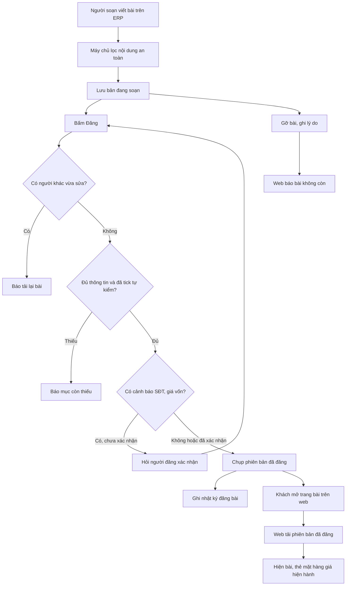

# CMS viết bài — Thiết kế kỹ thuật
> Claude (Tech Lead) · 2026-09-28 · Trạng thái: **ĐÃ DUYỆT (Duy 28/09 — theo chốt scope)**
> Nguồn: `01-analysis.md` (§13: Q1 = PA **B**, trang bài tải nội dung lúc chạy; SEO nâng cao để sau; Q10 = a),
> `02-stories.md` (CMS-01…16, ĐÃ DUYỆT). Code tham chiếu nhánh `wip/autosave` commit `cc47542`.
> Người hiện thực: Gemini CLI / Antigravity theo `AGENTS.md`; giao việc ở `02c-giao-viec.md`.



## 0. Tóm tắt quyết định

| # | Quyết định | Căn cứ |
|---|---|---|
| 1 | App Django mới **`content`** (`backend/apps/content/`), chia module `categories/`, `entries/`, `images/`, `body/`, `public/`. Service layer như các app hiện có; view không chứa nghiệp vụ. | django-drf-patterns, bất biến 8 |
| 2 | Thân bài là **JSON khối** đúng contract `02-stories.md` (không HTML ở bất kỳ tầng nào). Chống XSS **2 lớp**: (1) server **chuẩn hoá theo danh sách trắng** khi lưu (`apps/content/body/sanitize.py`, Python thuần, không cần thư viện lọc HTML vì không có HTML); (2) web công khai **dựng React từ danh sách trắng khối**, text là React children (tự escape), `href` kiểm lại, **cấm `dangerouslySetInnerHTML`**. Thêm lớp 1b: API công khai chạy lại bộ chuẩn hoá khi trả (phòng dữ liệu ghi thẳng DB). | BR-ND-06, R3 |
| 3 | Trình soạn trên ERP console: **Tiptap 2 (MIT, trên ProseMirror)** — schema chỉ có node/mark cho phép nên HTML dán vào (script, iframe, style, bảng) bị bỏ ngay trong trình soạn; bộ chuyển `tiptap JSON ⇄ body JSON` ở `erp-console/features/content/editor/convert.ts`. Tải lười (`next/dynamic`, `ssr:false`). | CMS-03-AC6, AC13 |
| 4 | **Phiên bản đã đăng** (`EntryVersion`) là bảng append-only chụp toàn bộ nội dung; web công khai **chỉ đọc từ phiên bản**, không bao giờ đọc bản đang soạn → CMS-10 "khách vẫn thấy bản cũ" đúng tự nhiên. | BR-ND-05 |
| 5 | Web công khai (Landing, `frontend/`, static export) dùng **route tĩnh + query string**: `/bai-viet/` (danh sách), `/bai-viet/?slug=<slug>` (bài), `/trang/?slug=<slug>` (trang). Không route động, **không cần rewrite Firebase** (§5). | Q1 = B, mẫu `/shop/item/?code=` |
| 6 | Ảnh bài dùng lại **kiểm định dạng + gỡ EXIF + mã hoá WebP + kho `local`/`gcs` + cùng bucket** của ảnh mặt hàng; thêm hàm **giữ tỉ lệ** (không cắt vuông) vào `catalog/images/processing.py`; object nằm dưới tiền tố `content/`. Không tạo bucket mới, không đổi IAM. | BR-ND-07, hồ sơ `2026-09-26-anh-mat-hang` |
| 7 | Quyền: ND-01 = `content.view_entry/add_entry/change_entry/delete_entry` + `content.view_category`; ND-02 = `content.publish_entry` (Tầng 2); ND-03 = `content.add_category/change_category`. Gán `chu` + `quan_ly` bằng **data migration trong chính app `content`** (không đụng chuỗi migration `accounts` mà hồ sơ AI cũng thêm). | §13 Q3, BR-PQ |
| 8 | Mọi API ghi CMS khai quyền **trên chính endpoint** qua `ContentPermissions` (kế thừa `BusinessModelPermissions`, cưỡng chế `required_perms` của `@action`). Tên thuộc tính `required_perms` trùng thiết kế AI (§2.5 hồ sơ AI) để lớp tự đăng ký lệnh đọc được ngay. Không route ghi dưới `internal/`, không `AllowAny` cho ghi, không cờ/token bỏ qua. | CMS-01-AC4/AC5, §13 Q10 |
| 9 | SEO nâng cao **để sau**: không sitemap, không canonical, không `og:image` riêng từng bài, không trang tĩnh từng bài. Tiêu đề + mô tả đặt **lúc chạy** bằng JS. | §13 Q1, Q11 |
| 10 | **CMS-16 (noindex staging) KHÔNG giao ở hồ sơ này**: đã phủ bởi **S05** hồ sơ `2026-09-28-sua-loi-bao-mat` (header `X-Robots-Tag: noindex, nofollow` trong `firebase.staging.json`, làm trước). AC1–AC4 của CMS-16 (biến `NEXT_PUBLIC_SITE_ENV`, `robots.txt Disallow`) được **thay** bằng AC của S05 — lý do kỹ thuật ở `sua-loi-bao-mat/02b` §5 (Disallow làm Google không đọc được noindex; header theo file deploy không thể lọt production). | Chốt scope 28/09 |
| 11 | Vai trò tự tạo **không làm đợt này**; quyền chỉ gán cho Group có sẵn. Khi hồ sơ `vai-tro-tu-dinh-nghia` làm, khai mảng "Nội dung" vào danh mục quyền tính năng của hồ sơ đó. | §13 Q3 |

---

## 1. Kiến trúc

```
 ERP console (cangca-erp, static export)                     Landing/Shop (cangca-loc, static export)
 ┌──────────────────────────────────────────┐                ┌───────────────────────────────────────────┐
 │ app/(console)/content/          danh sách │                │ app/bai-viet/page.tsx   ?slug= → bài       │
 │ app/(console)/content/edit/?id= trình soạn│                │                         không slug → d.sách│
 │ app/(console)/content/categories/         │                │ app/trang/page.tsx      ?slug= → trang     │
 │ features/content/                          │                │ app/page.tsx  + khối "Bài mới" (client)    │
 │   editor/ (Tiptap, lazy) convert.ts        │                │ features/content/                          │
 │   api.ts mock.ts types.ts components/      │                │   ArticleBody.tsx (danh sách trắng khối)   │
 └───────────────┬──────────────────────────┘                │   safeHref.ts  ItemCard.tsx  api.ts mock.ts │
                 │ Token DRF                                  └───────────────┬───────────────────────────┘
                 ▼                                                            │ không token, chỉ GET
 Django /api/content/** (ERP)                         Django /api/public/content/** (AllowAny, GET, throttle)
 ┌──────────────────────────────────────────────────────────────────────────────────────────────────────┐
 │ apps/content/                                                                                        │
 │   categories/ api.py services.py serializers.py                                                      │
 │   entries/    api.py services.py serializers.py (ERP)   ── ContentPermissions (T1 + required_perms)  │
 │   images/     api.py services.py  ──► apps/catalog/images/processing.process_image_keep_ratio        │
 │                                    ──► apps/catalog/images/storage.get_storage()  (content/<id>/...) │
 │   body/       sanitize.py (lớp 1)  scan.py (cảnh báo SĐT/giá vốn)  slug.py                           │
 │   public/     api.py serializers.py (dựng dict tường minh từ EntryVersion; lớp 1b)                   │
 │   models/     categories.py entries.py images.py                                                     │
 │ record_audit(...) ── AuditLog (không chép thân bài)                                                  │
 └──────────────────────────────────────────────────────────────────────────────────────────────────────┘
 Thẻ mặt hàng trên web công khai: giá/tồn lấy lúc khách xem từ /api/shop/catalog/ (có sẵn, công khai).
```

Luồng chính:
1. Soạn: console `POST/PATCH /api/content/entries/` → `entries.services.save_draft()` → `body.sanitize.normalize_body()` → lưu `Entry` (bản đang soạn), tăng `row_version`, cập nhật `draft_hash`. Không AuditLog.
2. Đăng: `POST .../publish/` → `entries.services.publish_entry()` (atomic + `select_for_update`): kiểm `row_version` → trạng thái → BR-ND-03 → BR-ND-13 → quét cảnh báo → tạo `EntryVersion(n+1)` → trỏ `Entry.published_version` → AuditLog.
3. Khách đọc: `/bai-viet/?slug=` → `GET /api/public/content/entries/<slug>/` → đọc `Entry.published_version` khi `status=published` → dict tường minh, body qua `public_body()` (chuẩn hoá lại + thay `image_id` bằng URL ảnh).
4. Gỡ: `POST .../unpublish/` → `status=unpublished` → API công khai trả 410 ngay (cache ≤ 60 s).

### 1.1 Nơi đặt code

| Thành phần | File |
|---|---|
| Model | `backend/apps/content/models/{__init__,categories,entries,images}.py` |
| Migration | `backend/apps/content/migrations/0001_initial.py` (sinh), `0002_grant_content_perms.py` (data, viết tay theo mẫu `accounts/0006`) |
| Quyền dùng chung trong app | `backend/apps/content/permissions.py` (`ContentPermissions`, hằng số tên quyền) |
| Chuyên mục | `backend/apps/content/categories/{api,services,serializers}.py`, `tests/` |
| Bài/trang | `backend/apps/content/entries/{api,services,serializers}.py`, `tests/` |
| Ảnh bài | `backend/apps/content/images/{api,services,serializers}.py`, `tests/` |
| Thân bài | `backend/apps/content/body/{sanitize,scan,slug}.py`, `tests/` |
| API công khai | `backend/apps/content/public/{api,serializers}.py`, `tests/` |
| Admin cứu hộ (chỉ đọc) | `backend/apps/content/admin.py` |
| README | `backend/apps/content/README.md` (P-11 Nội dung, BR-ND, danh sách module) + 1 dòng ở `backend/README.md` |
| Route | `backend/config/api_urls.py` (router `content/...` + path `public/content/...`) |
| Settings | `backend/config/settings.py` (`INSTALLED_APPS += "apps.content"`, khối `CONTENT_*`) |
| Hàm ảnh giữ tỉ lệ | `backend/apps/catalog/images/processing.py` (**chỉ thêm** `process_image_keep_ratio`, không sửa hàm cũ) |
| Lỗi có payload | `backend/apps/common/exceptions.py` (`BusinessError(..., extra=None)`), `backend/apps/common/api.py` (`exception_handler` gộp `extra`) |
| ERP console | `erp-console/features/content/…`, `erp-console/app/(console)/content/…`, `erp-console/shared/lib/nav.ts` (mục menu + `PERM`) |
| Web công khai | `frontend/features/content/…`, `frontend/app/bai-viet/`, `frontend/app/trang/`, `frontend/app/page.tsx` (khối Bài mới), `frontend/lib/api.ts` (export `apiFetch`) |

---

## 2. Model & migration (chỉ thêm)

App mới `content`; không đổi model nào của app khác. Không có field giá, không có field dữ liệu cá nhân khách.

### 2.1 `content.Category`
| Field | Kiểu | Ghi chú |
|---|---|---|
| `name` | Char(80) | |
| `name_key` | Char(80), **unique** | `fold_text(name)` gộp khoảng trắng — chặn "cong thuc NẤU" trùng "Công thức nấu" (CMS-02-AC2) |
| `slug` | Char(80), **unique** | Sinh một lần lúc tạo, **không đổi khi đổi tên** (AC3) |
| `description` | Char(300), blank | |
| `order` | PositiveInteger, default 0 | |
| `is_active` | Bool, default True | Ngừng dùng thay cho xoá |
| `created_at`, `updated_at` | DateTime | |
`Meta.default_permissions = ("view", "add", "change")` (không `delete` → DELETE trả 405, AC5). `ordering = ["order", "id"]`.

### 2.2 `content.Entry` (bài hoặc trang; giữ **bản đang soạn**)
| Field | Kiểu | Ghi chú |
|---|---|---|
| `kind` | Char(8) choices `post`/`page` | Không đổi được sau lần đăng đầu |
| `status` | Char(16) choices `draft`/`pending_review`/`published`/`unpublished`, index | |
| `title` | Char(255), blank | Giới hạn thật = `CONTENT_TITLE_MAX` (200) kiểm ở service |
| `slug` | Char(120), **unique** | Unique trên toàn bộ nội dung kể cả đã gỡ (BR-ND-04) |
| `category` | FK Category, `PROTECT`, null | |
| `excerpt` | Text(blank) | ≤ 500 ký tự (service) |
| `seo_title` | Char(200), blank | |
| `seo_description` | Char(300), blank | |
| `cover_image` | FK `ContentImage`, `SET_NULL`, null, `related_name="+"` | |
| `body` | JSON, default `{"type":"doc","blocks":[]}` | Chỉ lưu sau `normalize_body()` |
| `draft_hash` | Char(64) | sha256 JSON chuẩn của bản đang soạn (§4.4) |
| `published_version` | FK `EntryVersion`, `PROTECT`, null, `related_name="+"` | Phiên bản web đang/đã hiện |
| `first_published_at`, `last_published_at` | DateTime null | `slug_locked = first_published_at is not None` (tính, không lưu) |
| `restored_from` | PositiveInteger null | Đặt khi khôi phục, xoá khi đăng/bỏ thay đổi |
| `return_reason` | Char(20), blank | Lý do "Trả về nháp" gần nhất (CMS-09-AC4) |
| `page_role` | Char(16) null, choices `privacy`/`terms`/`refund`/`seller_info` | `UniqueConstraint(fields=["page_role"], condition=Q(page_role__isnull=False))` |
| `show_in_footer` | Bool default False | |
| `footer_order` | PositiveSmallInteger default 0 | |
| `source` | Char(8) choices `human`/`ai`, default `human` | Chỉ đọc qua API; hồ sơ AI đặt `ai` |
| `row_version` | PositiveInteger default 1 | Khoá lạc quan |
| `created_by` | FK User `PROTECT` | |
| `updated_by` | FK User `PROTECT`, null | |
| `created_at`, `updated_at` | DateTime | |
- `Meta.permissions = [("publish_entry", "Đăng, gỡ, trả về nháp bài; đặt trang go-live và footer")]` (default_permissions giữ đủ 4).
- Index: `(kind, status, first_published_at)` cho danh sách công khai.
- **`__str__` trả `f"Nội dung #{self.pk}"`, KHÔNG trả tiêu đề** — `record_audit` chép `str(obj)` vào `AuditLog.object_repr`; CMS-07-AC2 cấm tiêu đề trong AuditLog.

### 2.3 `content.EntryVersion` (append-only)
| Field | Kiểu | Ghi chú |
|---|---|---|
| `entry` | FK Entry `PROTECT`, `related_name="versions"` | |
| `version` | PositiveInteger | `UniqueConstraint(entry, version)` |
| `kind`, `title`, `slug`, `excerpt`, `seo_title`, `seo_description`, `body` | như Entry | Chụp nguyên bản đang soạn |
| `description` | Char(300) | Mô tả đã tính khi đăng (seo_description hoặc excerpt cắt, §4.3) |
| `category` | FK Category `PROTECT`, null | Tên hiện theo chuyên mục hiện tại (CMS-02-AC3) |
| `cover_image` | FK ContentImage `PROTECT`, null | |
| `content_hash` | Char(64) | So với `Entry.draft_hash` |
| `restored_from` | PositiveInteger null | |
| `published_at` | DateTime | = **ngày hiệu lực** của phiên bản (BR-ND-16) |
| `published_by` | FK User `PROTECT` | Chỉ lộ ở API ERP |
- `save()` raise `BusinessError(code="BR-ND-05")` khi `not self._state.adding`; `delete()` raise. Manager/QuerySet `update()`/`delete()` raise (CMS-10-AC5).
- `__str__` = `f"Phiên bản {version} của nội dung #{entry_id}"`.

### 2.4 `content.ContentImage`
| Field | Kiểu | Ghi chú |
|---|---|---|
| `entry` | FK Entry `CASCADE`, `related_name="images"` | Chỉ xoá được khi xoá nháp chưa từng đăng (không phiên bản nào tham chiếu) |
| `image_id` | Char(32) unique, `generate_image_id()` của catalog | Tên thư mục object, không đoán được |
| `alt` | Char(200), blank | Mặc định tiêu đề bài (CMS-05-AC4) |
| `width`, `height` | PositiveInteger | Của cỡ lớn nhất đã xuất |
| `uploaded_by` | FK User `PROTECT` | Không lộ ra API công khai |
| `created_at` | DateTime | |
`default_permissions = ()` (quyền theo `change_entry` của bài). Không có thao tác xoá object ở kho (BR-DM-14).

### 2.5 Không làm
- Bảng liên kết bài ↔ mặt hàng (01-analysis §7.1): **không tạo** đợt này — cảnh báo và thẻ đọc thẳng từ `body`. Thêm khi làm đo "bài nào kéo đơn" (Q12).
- Không đổi schema `AuditLog`.

### 2.6 Migration
| File | Nội dung |
|---|---|
| `content/0001_initial.py` | Sinh bằng `makemigrations content`, đọc lại file. Vòng FK Entry ↔ EntryVersion ↔ ContentImage: Django tách tự động thành nhiều `AddField`; kiểm `migrate` từ DB rỗng chạy được. |
| `content/0002_grant_content_perms.py` | Data migration theo mẫu `accounts/0006`: `create_permissions(content)` rồi gán 8 quyền (`view/add/change/delete_entry`, `publish_entry`, `view/add/change_category`) cho `chu`, `quan_ly`. `dependencies = [("content","0001_initial"), ("accounts","0002_seed_permission_groups")]`. Có hàm `revoke`. |
Kiểm: `makemigrations --check --dry-run` sạch; `migrate content zero` rồi `migrate` lại chạy được trên SQLite test.

---

## 3. Phân quyền theo Group

### 3.1 Bảng quyền
| Endpoint | `chu` | `quan_ly` | `nv_kho` | `nv_giao` | Khách | Quyền kiểm |
|---|---|---|---|---|---|---|
| `GET /api/content/categories/` | 200 | 200 | 403 | 403 | 401 | `content.view_category` |
| `POST`, `PATCH /api/content/categories/…` | 200/201 | 200/201 | 403 | 403 | 401 | `add_category` / `change_category` |
| `GET /api/content/entries/…`, `versions`, `counts`, `golive-status` | 200 | 200 | 403 | 403 | 401 | `view_entry` |
| `POST /api/content/entries/` | 201 | 201 | 403 | 403 | 401 | `add_entry` |
| `PATCH /api/content/entries/<id>/` | 200 | 200 | 403 | 403 | 401 | `change_entry`; **thêm** `publish_entry` nếu body có `page_role`/`show_in_footer`/`footer_order` (CMS-15-AC8) |
| `DELETE /api/content/entries/<id>/` | 204/400 | 204/400 | 403 | 403 | 401 | `delete_entry` + chưa từng đăng |
| `POST …/submit/`, `…/discard-changes/`, `…/versions/<n>/restore/`, `…/images/`, `PATCH /api/content/images/<id>/` | ✓ | ✓ | 403 | 403 | 401 | `change_entry` |
| `POST …/publish/`, `…/unpublish/`, `…/return/` | ✓ | ✓ | 403 | 403 | 401 | `publish_entry` |
| `GET /api/public/content/**` | 200 | 200 | 200 | 200 | 200 | `AllowAny`, chỉ GET/HEAD/OPTIONS |
User thử "chỉ ND-01" = `make_user("soan", perms=[view_entry, add_entry, change_entry, delete_entry, view_category])` (không Group).

Method mà endpoint không hỗ trợ (vd `DELETE categories`, `PUT` mọi nơi) trả **405** cho người đã đăng nhập, **kể cả thiếu quyền** — quy ước hiện có của `BusinessModelPermissions` (S3-AC4). Test CMS-01-AC2 tham số hoá theo **method endpoint hỗ trợ** (→ 403, dữ liệu không đổi) và method không hỗ trợ (→ 405, dữ liệu không đổi). Đây là cách hiểu của Tech Lead cho chữ "mọi method" trong AC2, không đổi ý nghĩa bảo mật.

### 3.2 `ContentPermissions`
```python
# apps/content/permissions.py
class ContentPermissions(BusinessModelPermissions):
    """T1 theo model cho CRUD; T2 cho @action qua `required_perms` khai ngay trên @action.
    Custom action KHÔNG có required_perms → từ chối (fail-closed), không rơi về 'đã đăng nhập là được'."""
    def has_permission(self, request, view):
        if not super().has_permission(request, view):      # 401/405 như cũ; CRUD: view/add/change/delete_*
            return False
        if getattr(view, "action", None) in getattr(view, "custom_perm_actions", ()):
            perms = tuple(getattr(view, "required_perms", ()) or ())
            return bool(perms) and request.user.has_perms(perms)
        return True
```
- ViewSet khai `required_perms: tuple = ()` ở lớp để `@action(required_perms=(...))` hợp lệ với DRF (DRF chỉ nhận kwarg `@action` trùng thuộc tính có sẵn trên lớp).
- Khi hồ sơ AI Lô 2 mở rộng `BusinessModelPermissions` cưỡng chế `required_perms` chung, `ContentPermissions` còn lại chỉ là lớp mỏng — không xung đột, có thể bỏ sau.
- Kiểm quyền chạy **trước** mọi đọc body/quét (CMS-08-AC8).
- `PATCH` có field trang go-live: kiểm `publish_entry` trong `partial_update` **trước** `save_draft`; thiếu → 403 cả request, không lưu phần nào.

### 3.3 Không đường tắt (CMS-01-AC4, AC5)
Test `apps/content/tests/test_no_shortcut.py` duyệt `get_resolver()` lấy mọi pattern có tiền tố `api/content/` hoặc `api/public/content/`:
- Route `api/content/**`: `permission_classes` chứa `ContentPermissions` (hoặc lớp con); mọi `@action` ghi có `required_perms` khác rỗng; không `AllowAny`.
- Route `api/public/content/**`: `http_method_names ⊆ {get, head, options}`.
- Không pattern nào chứa `content` dưới `api/internal/`.
- Không view content nào đọc header/cờ/`INTERNAL_SERVICE_TOKEN` (grep trong test: `apps/content/**/*.py` không chứa `INTERNAL_SERVICE_TOKEN`, `HTTP_X_`).

---

## 4. Nghiệp vụ (service)

### 4.1 Slug (`body/slug.py`)
`slugify_vi(text, max_len=100)`: `fold_text` (bỏ dấu, `đ→d`, chữ thường) → ký tự ngoài `[a-z0-9]` thành `-` → gộp `-` → bỏ `-` đầu/cuối → cắt ≤ 100 tại ranh giới `-`. "Cá Thu  Đông!!" → `ca-thu-dong`.
- Tạo bài: `slug` gửi lên (chuẩn hoá) hoặc từ `title`; cả hai rỗng → `bai-<6 hex>`.
- Trùng (kể cả bài đã gỡ) → 400 `BR-ND-04` `extra={"suggestion": "<base>-<n nhỏ nhất ≥ 2 còn trống>"}`. `IntegrityError` do tranh chấp cũng quy về lỗi này.
- Slug gửi lên chuẩn hoá thành rỗng → 400 `BR-ND-04`.
- `first_published_at` khác null và `slug` gửi lên khác slug hiện tại → 400 `BR-ND-04` (CMS-07-AC7).

### 4.2 Lưu nháp `save_draft(*, entry=None, data, actor)`
- `transaction.atomic`; sửa: `select_for_update`, so `row_version` → lệch thì `StaleVersion` (BusinessError `http_status=409`, `code="STALE_VERSION"`).
- Field cho phép: `kind` (chỉ khi chưa từng đăng), `title`, `slug`, `category`, `excerpt`, `seo_title`, `seo_description`, `cover_image` (phải thuộc cùng bài → không thì 400 `BR-ND-07`), `body`, và (cần `publish_entry`, kiểm ở view) `page_role`, `show_in_footer`, `footer_order`. Field khác (`status`, `source`, `row_version` ngoài vai trò khoá, `published_version`, `created_by`…) → 400 `BR-PQ-14` qua `reject_protected_fields` có sẵn.
- Giới hạn: `title` ≤ `CONTENT_TITLE_MAX` → 400 (CMS-03-AC11); `excerpt` ≤ 500; `seo_title` ≤ 200; `seo_description` ≤ 300.
- `body` → `normalize_body(body, entry=entry)` (§6) trước khi gán.
- `page_role` trùng trang khác → 400 `BR-ND-16` (kiểm trước, constraint DB làm lưới). Bỏ/đổi `page_role` của trang **đang Đã đăng** → 400 `BR-ND-16` (giữ lịch sử phiên bản có hiệu lực liền mạch — 🟡 TD-3).
- Tăng `row_version`, tính lại `draft_hash`, `updated_by = actor`. **Không** AuditLog (CMS-03-AC10).
- Xoá: `delete_draft(*, entry, actor)` — `first_published_at` khác null → 400 `BR-ND-02`; ngược lại xoá thật (ảnh con cascade; object ở kho giữ lại). Không AuditLog (§13 Q7).

### 4.3 Điều kiện đăng (BR-ND-03) — `missing_fields(entry) -> list[str]`
Theo thứ tự: `title`, `slug`, `body` (≥ 1 khối), `category` (chỉ `post`; phải `is_active`), `cover_image` (chỉ `post`), `cover_image_alt` (chỉ `post`), `description` (`seo_description` hoặc `excerpt` không rỗng).
Mô tả công khai: `seo_description` nếu có, ngược lại `excerpt` cắt ≤ `CONTENT_DESCRIPTION_MAX` (160) **tại khoảng trắng cuối cùng**, bỏ dấu câu treo, không thêm "…" nếu không cắt (CMS-07-AC5).

### 4.4 Hash nội dung
`content_hash = sha256(json.dumps({kind,title,slug,excerpt,seo_title,seo_description,category_id,cover_image_id,body}, sort_keys=True, ensure_ascii=False, separators=(",",":")))`. `has_unpublished_changes = published_version is not None and draft_hash != published_version.content_hash`.

### 4.5 Đăng / đăng lại `publish_entry(*, entry, actor, row_version, checklist_confirmed, acknowledge_warnings)`
`@transaction.atomic`, `select_for_update` bài. Thứ tự kiểm (cố định, test theo thứ tự):
1. `row_version` lệch → 409 `STALE_VERSION` (hai người bấm cùng lúc: người sau luôn nhận 409 vì `row_version` đã tăng — CMS-07-AC6).
2. `status == published` và `draft_hash == published_version.content_hash` → 400 `BR-ND-05` "Không có thay đổi để đăng" (CMS-10-AC4).
3. `missing_fields` khác rỗng → 400 `BR-ND-03` `extra={"missing":[…]}`.
4. `checklist_confirmed is not True` → 400 `BR-ND-13`.
5. `warnings = scan(entry)`; có và `acknowledge_warnings is not True` → 409 `CONTENT_WARNINGS` `extra={"warnings":[…]}`.
6. Tạo `EntryVersion(version = max+1, …chụp…, description, content_hash = draft_hash, restored_from = entry.restored_from, published_at = now, published_by = actor)`.
7. `entry.status = published`, `published_version = v`, `first_published_at` (nếu null) `= now`, `last_published_at = now`, `restored_from = None`, `return_reason = ""`, `row_version += 1`.
8. AuditLog (đúng 1 dòng): lần đầu → `content_publish`; có `restored_from` → `content_restore_version`; còn lại → `content_republish`. `changes = {"entry_id", "version", "kind"}` (+ `"restored_from"` khi khôi phục, + `"warnings_acknowledged": [loại…]` khi có cảnh báo đã xác nhận). **Không** tiêu đề, slug, chữ, đoạn trích (CMS-07-AC2, CMS-08-AC5).
Trả `{"status","version","published_at","public_path","public_url"}` với `public_path = "/bai-viet/?slug=<slug>"` (post) hoặc `"/trang/?slug=<slug>"` (page), `public_url = settings.SHOP_BASE_URL + public_path` (biến có sẵn).

### 4.6 Các hành động khác
| Service | Từ trạng thái | Sang | Kiểm | AuditLog |
|---|---|---|---|---|
| `submit_entry(row_version, acknowledge_warnings=False)` | `draft` | `pending_review` | 1, 3, 5 như publish (không cần checklist). Từ `published`/`unpublished` → 400 `BR-ND-02` (CMS-09-AC6) | `content_submit` `{entry_id}` |
| `return_entry(row_version, reason)` | `pending_review` | `draft` | `reason ∈ {missing_info, wrong_content, legal_risk, other}` → sai 400 `BR-ND-15`; lưu `return_reason` | `content_return` `{entry_id, reason}` |
| `unpublish_entry(row_version, reason)` | `published` | `unpublished` | `reason ∈ {wrong_price, complaint, out_of_season, wrong_content, other}` → thiếu/sai 400 `BR-ND-15`; `page_role` khác null → 400 `BR-ND-16` | `content_unpublish` `{entry_id, version, reason}` |
| `discard_changes(row_version)` | có `published_version` | giữ | Nạp lại mọi field nội dung từ `published_version`; `restored_from=None` | không |
| `restore_version(version_no, row_version)` | có phiên bản `version_no` | giữ | Nạp field nội dung từ phiên bản đó vào bản đang soạn; `restored_from = version_no` | không (ghi lúc đăng) |
| `effective_version(role, at)` | — | — | Trang đang giữ `page_role=role` → phiên bản có `published_at ≤ at` lớn nhất; không có → `None` (CMS-15-AC4) | — |
| `current_policy_version(role)` | — | — | Trang có `page_role=role`, `status=published` → `published_version`; không → `None`. **Dùng bởi hồ sơ go-live (GL-03)** | — |
| `golive_missing_roles()` | — | — | Vai trò trong 4 vai trò chưa có trang `published` | — |
Mọi hành động đổi trạng thái: `select_for_update`, tăng `row_version`.

### 4.7 Chuyên mục (`categories/services.py`)
- Tạo: `name_key` trùng → 400 `BR-ND-04`; slug sinh từ tên, trùng thì thêm `-2`… (slug chuyên mục không trả gợi ý, tự thêm hậu tố).
- Đổi tên: `name_key` trùng chuyên mục khác → 400 `BR-ND-04`; slug giữ.
- `is_active=false`: đếm bài `status=published` thuộc chuyên mục (theo `Entry.category` **và** `published_version.category`) > 0 → 400 `BR-ND-02` `extra={"entries":[{"id","title"} ≤ 5], "total": n}` (CMS-02-AC4).
- Danh sách ERP trả kèm `published_count` (annotate).

---

## 5. Web công khai tải bài lúc chạy trên static export

### 5.1 Phương án chọn: route tĩnh + query string
| Trang | File | URL |
|---|---|---|
| Danh sách bài | `frontend/app/bai-viet/page.tsx` (nhánh không có `slug`) | `/bai-viet/`, `/bai-viet/?chuyen-muc=cong-thuc&trang=2` |
| Bài | cùng file (nhánh có `slug`) | `/bai-viet/?slug=cach-ra-dong-ca-thu` |
| Trang nội dung | `frontend/app/trang/page.tsx` | `/trang/?slug=chinh-sach-bao-mat` |
- `next build` với `output:"export"` sinh `out/bai-viet/index.html`, `out/trang/index.html`. Firebase Hosting (`cleanUrls:true`, `trailingSlash:true`) phục vụ file đó cho `/bai-viet/`; truy cập `/bai-viet?slug=x` được Hosting chuyển 301 sang `/bai-viet/?slug=x` **giữ query** — đúng cơ chế đang chạy cho `/shop/item/?code=` trên staging/production. **Không cần thêm `rewrites`**, không sửa `firebase.json`/`firebase.staging.json`.
- Trang là `"use client"`, bọc `<Suspense>` (bắt buộc với `useSearchParams` khi export), đọc `slug` rồi gọi API trong `useEffect` (mẫu `app/shop/item/page.tsx`: `let active = true` + cleanup).
- Link nội bộ tới bài dùng `<Link href={{ pathname: "/bai-viet/", query: { slug } }}>`.

### 5.2 Vì sao không dùng catch-all `[...slug]` / `[slug]`
- Với `output:"export"`, Next 14 bắt route động phải có `generateStaticParams` và **chỉ sinh HTML cho slug biết lúc build**; slug đăng sau lần build không có file → 404 (chính là PA A mà Duy không chọn).
- Muốn chạy được phải dựng trang giữ chỗ (vd `/bai-viet/_/`) + `rewrites` `"/bai-viet/**" → "/bai-viet/_/index.html"` + đọc `window.location.pathname`. Điều hướng phía client của Next sẽ đi tìm payload RSC `/bai-viet/<slug>/index.txt` không tồn tại rồi rơi về tải cứng — dễ lỗi, khó test, lợi SEO gần như bằng 0 vì nội dung vẫn tải bằng JS.
- Đường dẫn đẹp (`/bai-viet/<slug>`, `/chinh-sach-bao-mat`) làm chung với **SEO nâng cao** sau này (khi đó chọn giữa dựng tĩnh lúc đăng hoặc backend dựng HTML).

### 5.3 Tiêu đề & mô tả lúc chạy (BR-ND-11 rút gọn)
`app/bai-viet/layout.tsx` và `app/trang/layout.tsx` có `metadata` tĩnh (`title: "Bài viết"`, mô tả chung). Khi tải xong bài: `document.title = \`${seo_title || title} | Cá Về\``; tìm `meta[name="description"]` (root layout đã phát) và đặt `content = description`. Rời trang/đổi slug thì đặt lại. Không `og:*` riêng, không canonical (để sau).

### 5.4 Khi API lỗi / tắt
- 404 → "Không tìm thấy bài" + link Landing, Shop (CMS-13-AC4). 410 → "Bài này không còn trên web" + link Shop (CMS-12-AC4). Lỗi khác/không kết nối → "Chưa tải được bài" + nút "Thử lại" (CMS-13-AC7). Console chỉ in mã lỗi (không in body).
- Khối "Bài mới" trên Landing lỗi → ẩn cả khối (CMS-14-AC4).
- Production API đang tắt → trang bài không hiện (Duy chấp nhận, §13 Q1).

---

## 6. Chống XSS hai lớp (BR-ND-06)

### 6.1 Lớp 1 — server chuẩn hoá khi lưu: `apps/content/body/sanitize.py`
Không có HTML trong hệ thống nên **không cần thư viện lọc HTML** (bleach đã ngừng phát triển; `nh3` chỉ cần khi nhận HTML — không áp dụng). Bộ chuẩn hoá là hàm Python thuần, danh sách trắng, **idempotent** (`normalize(normalize(x)) == normalize(x)`):

| Mục | Quy tắc |
|---|---|
| Gốc | Phải là dict `{"type":"doc","blocks":[…]}`; sai kiểu → 400 `BR-ND-06` "Thân bài không hợp lệ" |
| Khối | Chỉ `heading`, `paragraph`, `list`, `quote`, `image`, `item_card`. Loại khác (`html`, `script`, `iframe`, `embed`, …) → **bỏ khối** (không lỗi, CMS-03-AC5) |
| Khoá thừa trên khối/inline | Bỏ (chỉ giữ khoá của bảng dưới) |
| `heading` | `{"type","level","text"}`; `level ∉ {2,3}` → 2; `text` là chuỗi |
| `paragraph`, `quote` | `{"type","children":[inline…]}` |
| `list` | `{"type","ordered": bool,"items":[[inline…]…]}`; ≤ 100 mục |
| inline | `{"text": str, "marks"?: ["bold"|"italic"], "href"?: str}`; mark lạ bỏ; trùng bỏ; inline rỗng bỏ |
| `href` | `strip()`; ≤ 2000 ký tự; không chứa ký tự điều khiển/khoảng trắng; hợp lệ khi (a) `urlsplit().scheme ∈ {https, http, mailto, tel}` (so chữ thường, sau khi bỏ ký tự điều khiển và khoảng trắng — chặn `java\tscript:`, ` JAVASCRIPT:`) hoặc (b) bắt đầu bằng `/` nhưng **không** `//` hay `/\` (chặn URL tương đối giao thức). Không hợp lệ → **bỏ `href`, giữ chữ** |
| `text`, `caption`, `alt` | Ép `str`; bỏ ký tự điều khiển C0 trừ `\n`; **giữ nguyên** `<`, `>` như chữ (CMS-03-AC5); `alt` ≤ 200, `caption` ≤ 300 |
| `image` | `{"type","image_id": int,"alt","caption"}`; `image_id` phải là `ContentImage` **của cùng bài** → không thì 400 `BR-ND-07` (chặn tham chiếu ảnh bài khác) |
| `item_card` | `{"type","item_code"}`; `item_code` khớp `^[A-Za-z0-9_.-]{1,40}$`; `Item` không tồn tại → 400 `BR-ND-10` (CMS-06-AC2; kiểm từ Lô 6 — trước đó chỉ kiểm dạng) |
| Giới hạn | ≤ `CONTENT_MAX_BLOCKS` (300) khối; tổng ký tự chữ ≤ `CONTENT_BODY_MAX_CHARS` (60 000); ảnh khác nhau trong body + ảnh bìa ≤ `CONTENT_MAX_IMAGES_PER_ENTRY` (20) → vượt 400 `BR-ND-07` |

**Lớp 1b (server, lúc trả):** `public_body(version)` chạy lại `normalize_body(..., strict=False)` (chế độ không tra DB, chỉ bỏ cái lạ) rồi thay khối `image` bằng `{"type":"image","alt","caption","width","height","urls":{"sm","md","lg"}}` (bỏ `image_id`). Dữ liệu ghi thẳng DB/Admin không lọt qua API.

### 6.2 Lớp 2 — web công khai dựng an toàn: `frontend/features/content/components/ArticleBody.tsx`
- `switch (block.type)` trên danh sách trắng → phần tử React; `default: return null` (khối lạ không hiện).
- Chữ luôn là React children (`{node.text}`) → React escape; `bold` → `<strong>`, `italic` → `<em>`.
- `href` qua `safeHref()` (`frontend/features/content/safeHref.ts`): cùng luật §6.1; dùng `new URL(href, "https://x.invalid")` kiểm `protocol ∈ {"https:","http:","mailto:","tel:"}`; nội bộ bắt đầu `/` không `//`, `/\`. Không hợp lệ → hiện chữ, **không** thẻ `<a>`.
- Link ngoài (`http(s):` khác origin web): `target="_blank" rel="nofollow noopener noreferrer"`; nội bộ cùng tab (CMS-13-AC6).
- Ảnh: ``; ảnh bìa không `lazy` (CMS-13-AC10). `src` chỉ lấy từ `urls` do API dựng.
- **Cấm `dangerouslySetInnerHTML`** trong `frontend/features/content/**`, `frontend/app/bai-viet/**`, `frontend/app/trang/**` và `erp-console/features/content/**` (CMS-13-AC3). Kiểm bằng lệnh `grep` trong 02c.
- ERP console: bộ chuyển `bodyToTiptap()` chỉ dựng node/mark cho phép, link qua cùng `safeHref`; Tiptap `Link.configure({ protocols: [...], validate: safeHref, autolink: false, openOnClick: false })`.

### 6.3 Bộ payload XSS mẫu (dùng cho CMS-03-AC5 và CMS-13-AC2)
File `backend/apps/content/body/tests/xss_payloads.py` (và bản sao cho mock FE `frontend/features/content/mock.ts`, slug `xss-mau`, chỉ trong mock):
1. `{"type":"html","html":"<script>alert(1)</script>"}`
2. `{"type":"script","src":"https://evil.example/x.js"}`
3. `{"type":"iframe","src":"https://evil.example"}`
4. `{"type":"embed","code":"<object data=x>"}`
5. `{"type":"paragraph","children":[{"text":"x","href":"javascript:alert(1)"}]}`
6. `… "href":" JaVaScRiPt:alert(1)"` (hoa thường + khoảng trắng đầu)
7. `… "href":"java\tscript:alert(1)"` (tab chèn giữa)
8. `… "href":"data:text/html;base64,PHNjcmlwdD5hbGVydCgxKTwvc2NyaXB0Pg=="`
9. `… "href":"vbscript:msgbox(1)"`
10. `… "href":"//evil.example/phish"` và `"/\\evil.example"`
11. `{"type":"paragraph","children":[{"text":""}]}` (phải hiện nguyên chữ)
12. `{"type":"paragraph","children":[{"text":"a","marks":["bold","script","onclick"]}]}` (mark lạ)
13. `{"type":"heading","level":1,"text":"<svg onload=alert(1)>","onclick":"alert(1)","style":"x"}` (thuộc tính thừa + level sai)
14. `{"type":"image","image_id":<ảnh của bài khác>,"alt":"\" onerror=\"alert(1)"}` → 400 `BR-ND-07`
15. `{"type":"item_card","item_code":"\"><script>alert(1)</script>"}` → bỏ dạng / 400

Kỳ vọng lớp 1: 200 (trừ 14, 15 → 400), body lưu chỉ còn khối/mark/khoá cho phép, `href` xấu bị bỏ, chữ có `<` giữ nguyên. Kỳ vọng lớp 2 (Playwright, mock): không sự kiện `dialog`, không phần tử `script`/`iframe`/`object`/`embed` trong `article`, không `<a>` nào có `href` bắt đầu `javascript:`/`data:`/`vbscript:`, chữ `` hiện nguyên văn.

---

## 7. Ảnh bài (BR-ND-07, dùng lại hạ tầng ảnh mặt hàng)

- **Thêm** vào `apps/catalog/images/processing.py`:
  ```python
  def process_image_keep_ratio(raw: bytes, *, widths: dict) -> ProcessedRatioImage:
      """Như process_item_image nhưng KHÔNG cắt vuông: giữ tỉ lệ, thu nhỏ theo chiều rộng,
      không phóng to. Trả sizes {name: webp bytes} + (width, height) của cỡ lớn nhất."""
  ```
  Dùng lại `_open_verified` (kiểm nội dung thật, cấm SVG/GIF/HEIC), `_strip_exif_and_orient` (gỡ EXIF/GPS, xoay đúng), `_encode_webp`. Không sửa `process_item_image`. Tỉ lệ sai số ≤ 1 px (CMS-05-AC1).
- `apps/content/images/services.upload_content_image(*, entry, file, alt, actor)`: kiểm dung lượng theo `ITEM_IMAGE_MAX_BYTES` (10 MB, lỗi `BR-DM-10`) → kiểm số ảnh (§6.1: số ảnh đang dùng trong bản đang soạn + bìa ≥ `CONTENT_MAX_IMAGES_PER_ENTRY` → 400 `BR-ND-07`; và tổng bản ghi ảnh của bài ≥ `CONTENT_MAX_IMAGE_UPLOADS_PER_ENTRY` (100) → 400 `BR-ND-07`, chặn lạm dụng kho) → xử lý → `get_storage().save(f"content/{entry.pk}/{image_id}/{size}.webp", data, "image/webp")` cho từng cỡ → tạo `ContentImage`. Lỗi trước khi ghi DB → không bản ghi; lỗi kho → 503 `BR-DM-16` (lớp lỗi sẵn có).
- Cỡ: `CONTENT_IMAGE_WIDTHS = {"sm": 480, "md": 960, "lg": 1600}` (env ghi đè). URL: `storage.url(path)` → cùng `ITEM_IMAGE_PUBLIC_BASE_URL`/bucket theo môi trường. `Cache-Control: immutable` như ảnh mặt hàng.
- `alt` rỗng → tiêu đề bài (cắt 200); rỗng nữa → "Ảnh minh hoạ bài viết".
- Không bao giờ gọi xoá object (kho không có hàm xoá — BR-DM-14); ảnh gỡ khỏi bài vẫn còn URL (CMS-05-AC5).
- Upload là `multipart/form-data` → lớp tự đăng ký lệnh AI **tự loại** (hồ sơ AI §3 "parser không phải JSON").
- Không AuditLog cho tải ảnh (ảnh chỉ lên web khi bài được đăng — lúc đó đã có `content_publish`).

---

## 8. Contract API BE ↔ FE

Lỗi luôn `{"detail": "<tiếng Việt>", "code": "<mã>", …extra}`. Tiền/giá không có trong CMS. Thời gian ISO 8601 giờ VN (`timezone.localtime(...).isoformat()`).

### 8.1 Bổ sung hạ tầng lỗi (chỉ thêm)
```python
class BusinessError(Exception):
    def __init__(self, message="", code=None, extra=None): ...; self.extra = dict(extra or {})
# exception_handler: Response({**exc.extra, "detail": str(exc), "code": exc.code}, status=exc.http_status)
```
(`detail`/`code` luôn thắng khoá trùng trong `extra`.)

### 8.2 ERP — chuyên mục
```
GET   /api/content/categories/          → 200 [{"id":3,"name":"Công thức","slug":"cong-thuc","description":"","order":1,"is_active":true,"published_count":4}]
POST  /api/content/categories/          {"name":"Công thức nấu","description":"","order":1} → 201 {…như trên…}
PATCH /api/content/categories/3/        {"name":"Món ngon","order":2} | {"is_active":false} → 200
DELETE/PUT                              → 405
400 {"detail":"…","code":"BR-ND-04"}
400 {"detail":"Chuyên mục còn 7 bài đang đăng…","code":"BR-ND-02","entries":[{"id":42,"title":"…"}],"total":7}
```
Không phân trang (danh sách ngắn).

### 8.3 ERP — bài/trang
```
GET /api/content/entries/?status=draft&kind=post&category=3&page=1      (20/trang, StandardPagination)
→ 200 {"count":1,"next":null,"previous":null,"results":[
   {"id":42,"kind":"post","status":"draft","title":"Cách rã đông cá thu","slug":"cach-ra-dong-ca-thu",
    "category":3,"has_unpublished_changes":false,"updated_at":"2026-10-01T08:00:00+07:00","source":"human",
    "page_role":null}]}

GET /api/content/entries/counts/  → 200 {"draft":3,"pending_review":2,"published":10,"unpublished":1}

POST /api/content/entries/  {"kind":"post","title":"Cách rã đông cá thu","slug":"","category":3,"excerpt":"",
                              "seo_title":"","seo_description":"","body":{"type":"doc","blocks":[]}}
→ 201 (chi tiết, như dưới)

GET /api/content/entries/42/
→ 200 {"id":42,"kind":"post","status":"draft","title":"Cách rã đông cá thu","slug":"cach-ra-dong-ca-thu",
       "slug_locked":false,"category":3,"excerpt":"","seo_title":"","seo_description":"",
       "cover_image":null,"body":{"type":"doc","blocks":[]},
       "images":[{"id":71,"alt":"Cá thu cắt khoanh","width":1600,"height":1200,
                  "urls":{"sm":"https://…/content/42/img_ab12cd34/sm.webp","md":"…/md.webp","lg":"…/lg.webp"}}],
       "has_unpublished_changes":false,"published_version":null,"first_published_at":null,"last_published_at":null,
       "restored_from":null,"return_reason":"","page_role":null,"required_for_golive":false,
       "show_in_footer":false,"footer_order":0,"public_url":null,
       "source":"human","row_version":1,"updated_at":"2026-10-01T08:00:00+07:00"}

PATCH  /api/content/entries/42/  {"row_version":1,"title":"…","body":{…}}  → 200 (chi tiết, row_version+1)
DELETE /api/content/entries/42/  → 204 | 400 BR-ND-02
PUT                               → 405
Lỗi: 400 BR-ND-04 {"suggestion":"cach-ra-dong-ca-thu-2"} · 400 BR-ND-06/07/10 · 400 BR-PQ-14 · 409 STALE_VERSION
```
- `images`, `restored_from`, `return_reason`, `public_url`, `page_role`, `required_for_golive`, `show_in_footer`, `footer_order` là **bổ sung** so với contract `02-stories.md` CMS-03 (chỉ thêm khoá, không đổi khoá cũ) — FE dựng mock theo bản này.
- `public_url` = `SHOP_BASE_URL + public_path` khi đã từng đăng; null khi chưa.
- Serializer ERP khai field tường minh; không trả `created_by`/`updated_by` (không cần cho màn nào).

### 8.4 ERP — ảnh
```
POST  /api/content/entries/42/images/   multipart: file, alt?
→ 201 {"id":71,"alt":"Cách rã đông cá thu","width":1600,"height":1200,"urls":{"sm":"…","md":"…","lg":"…"}}
PATCH /api/content/images/71/  {"alt":"Cá thu cắt khoanh"} → 200 (như trên)
Lỗi: 400 BR-DM-10 (định dạng/dung lượng/SVG/tệp giả) · 400 BR-ND-07 (quá số ảnh) · 503 BR-DM-16 (kho lỗi)
```

### 8.5 ERP — vòng đời
```
POST /api/content/entries/42/publish/   {"row_version":7,"checklist_confirmed":true,"acknowledge_warnings":false}
  → 200 {"status":"published","version":1,"published_at":"…","public_path":"/bai-viet/?slug=cach-ra-dong-ca-thu","public_url":"https://…/bai-viet/?slug=cach-ra-dong-ca-thu"}
  → 400 {"code":"BR-ND-03","missing":["category","cover_image_alt"]} · 400 BR-ND-13 · 400 BR-ND-05
  → 409 {"code":"CONTENT_WARNINGS","warnings":[
         {"type":"phone_like","field":"body","snippet":"…gọi chị Lan 09xx xxx 678 để…"},
         {"type":"cost_keyword","field":"body","snippet":"…giá mua tại cảng…"},
         {"type":"item_unavailable","item_code":"CA-THU-1KG"}]}
  → 409 STALE_VERSION
POST /api/content/entries/42/submit/           {"row_version":7,"acknowledge_warnings":false} → 200 {"status":"pending_review","row_version":8}
POST /api/content/entries/42/return/           {"row_version":8,"reason":"missing_info"}      → 200 {"status":"draft","row_version":9}
POST /api/content/entries/42/unpublish/        {"row_version":12,"reason":"wrong_price"}      → 200 {"status":"unpublished","row_version":13}
POST /api/content/entries/42/discard-changes/  {"row_version":9}                              → 200 (chi tiết)
GET  /api/content/entries/42/versions/         → 200 [{"version":3,"published_at":"…","published_by_name":"Quản lý A","title":"…","restored_from":null}]
GET  /api/content/entries/42/versions/1/       → 200 {"version":1,"published_at":"…","published_by_name":"…","kind":"post","title":"…","slug":"…",
                                                      "excerpt":"…","seo_title":"…","seo_description":"…","description":"…","category":3,
                                                      "cover_image":71,"body":{…},"restored_from":null}
POST /api/content/entries/42/versions/1/restore/ {"row_version":11}                           → 200 (chi tiết)
GET  /api/content/golive-status/               → 200 {"missing_roles":["refund","seller_info"]}
```
- Các action trả `row_version` mới để FE không phải GET lại.
- `published_by_name` = `staff_profile.display_name` hoặc username — chỉ ở ERP (CMS-11-AC5).
- Danh sách phiên bản không trả `body` (CMS-11-AC1).
- `versions` là `@action(detail=True, url_path=r"versions(?:/(?P<version_no>\d+))?")` hoặc hai action riêng — be-dev chọn, URL giữ như trên.

### 8.6 Công khai (`AllowAny`, chỉ GET, `Cache-Control: public, max-age=CONTENT_PUBLIC_CACHE_SECONDS`, throttle IP)
```
GET /api/public/content/entries/?kind=post&category=cong-thuc&page=1      (CONTENT_LIST_PAGE_SIZE = 12)
→ 200 {"count":25,"next":"…","previous":null,"results":[
   {"slug":"cach-ra-dong-ca-thu","title":"Cách rã đông cá thu","excerpt":"…",
    "category":{"slug":"cong-thuc","name":"Công thức"},
    "cover_image":{"alt":"…","width":1600,"height":1200,"urls":{"sm":"…","md":"…","lg":"…"}},
    "published_at":"…"}]}                                          (không có body)
   page vượt → 404 {"detail":"…"} (DRF), không 500

GET /api/public/content/entries/cach-ra-dong-ca-thu/
→ 200 {"kind":"post","slug":"cach-ra-dong-ca-thu","title":"Cách rã đông cá thu","seo_title":"",
       "description":"…","excerpt":"…","category":{"slug":"cong-thuc","name":"Công thức"},
       "cover_image":{"alt":"…","width":1600,"height":1200,"urls":{…}},
       "body":{"type":"doc","blocks":[…, {"type":"image","alt":"…","caption":"…","width":1600,"height":1200,"urls":{…}},
                                       {"type":"item_card","item_code":"CA-THU-1KG"}]},
       "published_at":"…","updated_at":"…","version":3,"effective_from":"…","author":"Cá Về"}
→ 404 {"detail":"Không tìm thấy bài.","code":"NOT_FOUND"}   (không có / nháp / chờ duyệt — cùng một câu, không lộ tồn tại)
→ 410 {"detail":"Bài này không còn trên web.","code":"GONE"}

GET /api/public/content/categories/  → 200 [{"slug":"cong-thuc","name":"Công thức","description":""}]  (đang hoạt động, ≥ 1 bài đã đăng)
GET /api/public/content/pages/by-role/privacy/ → 200 {"slug":"chinh-sach-bao-mat","title":"Chính sách bảo mật","version":3,"version_id":918,"effective_from":"…"} | 404
GET /api/public/content/footer-links/ → 200 [{"title":"Chính sách bảo mật","slug":"chinh-sach-bao-mat"}]
POST/PUT/PATCH/DELETE bất kỳ → 405
```
- `seo_title` thêm vào chi tiết công khai (khoá **bổ sung**) để FE đặt `document.title` (CMS-13-AC1).
- `published_at` = `Entry.first_published_at`; `updated_at` = `effective_from` = `published_version.published_at`; FE hiện "Cập nhật ngày …" khi `version > 1`.
- `author` là hằng `"Cá Về"` (BR-ND-14).
- Dict dựng tường minh trong `public/serializers.py`; **không** dùng serializer ERP, không `ModelSerializer`.
- Throttle: scope mới `public_content` (IP, mặc định `120/min`, env `THROTTLE_PUBLIC_CONTENT`) dùng `SettingsRateThrottle` của hồ sơ sửa lỗi bảo mật (S03). Khi `TESTING` tắt như các scope khác.

### 8.7 FE — kiểu và mock
- ERP: `erp-console/features/content/types.ts` khớp §8.2–8.5; `mock.ts` có đủ nhánh 400/403/409 (`STALE_VERSION`, `CONTENT_WARNINGS`) để làm trước BE. Thêm `PERM.viewEntry/addEntry/changeEntry/deleteEntry/publishEntry/viewCategory/addCategory/changeCategory` vào `shared/lib/nav.ts`; `ViewKey` thêm `"content"`, mục "Nội dung" section "Quản trị", `visible = has(me, PERM.viewEntry)`.
- Web: `frontend/features/content/{api,mock,types}.ts`; `frontend/lib/api.ts` **export** `apiFetch` (hiện là hàm nội bộ) để module mới gọi, không `fetch` rải rác; mock gồm bài thường, bài 20 ảnh, bài `xss-mau`, bài đã gỡ (410).

---

## 9. Quét cảnh báo trước khi đăng (`apps/content/body/scan.py`, CMS-08)

- Nguồn chữ quét: `title`, `excerpt`, `seo_title`, `seo_description` (field tương ứng), text trong body (`"body"`), `alt` khối ảnh + `alt` ảnh bìa (`"image_alt"`), `caption` (`"image_caption"`).
- SĐT: `PHONE_RE = re.compile(r"(?<!\d)(?:\+?84|0)(?:[\s.\-]?\d){9,10}(?!\d)")`. Chuẩn hoá số (bỏ ký tự khác số; đầu `84` → `0`) rồi bỏ nếu thuộc `CONTENT_PHONE_ALLOWLIST` (CSV, chuẩn hoá giống vậy). Ca bắt: `0912 345 678`, `0912.345.678`, `+84 912345678`, `84912345678`. Ca không bắt: `250.000đ`, `1.200 kg`, `28/09/2026`, `SO-2026-00012`, `10.000.000 đ` (CMS-08-AC3 — test đúng bộ này).
- Che: số khớp thay bằng `f"{d[:2]}xx xxx {d[-3:]}"`; `snippet` = cửa sổ ±30 ký tự quanh vị trí, **mọi** số giống SĐT trong cửa sổ đều che, ≤ 90 ký tự.
- Giá vốn: `CONTENT_COST_KEYWORDS` (CSV, mặc định `giá mua,giá vốn,giá nhập,giá cảng,nhà cung cấp,tiền lãi`) so trên chữ đã `fold` **từng ký tự** (giữ chỉ số vị trí để cắt snippet từ chữ gốc), có biên từ `(?<![a-z0-9])…(?![a-z0-9])`.
- `item_unavailable`: mỗi `item_code` trong khối `item_card` mà `Item` không `is_active` hoặc không có giá hiệu lực (`effective_price(item) is None`).
- Mỗi (loại, field) tối đa 5 cảnh báo; không trả vị trí số tuyệt đối.
- **Không log** chữ, snippet hay số (CMS-08-AC7). Module `content` không dùng `logger` với dữ liệu bài.

---

## 10. AuditLog (BR-ND-15)

| Action | Khi | `changes` (chỉ các khoá này) |
|---|---|---|
| `content_publish` | Đăng lần đầu | `entry_id`, `version`, `kind` (+ `warnings_acknowledged`) |
| `content_republish` | Đăng lại (sửa, hoặc sau khi gỡ) | như trên |
| `content_restore_version` | Đăng sau khi khôi phục | như trên + `restored_from` |
| `content_unpublish` | Gỡ | `entry_id`, `version`, `reason` (mã) |
| `content_submit` | Gửi duyệt | `entry_id` (+ `warnings_acknowledged`) |
| `content_return` | Trả về nháp | `entry_id`, `reason` (mã) |
`obj=entry` → `object_repr = "Nội dung #42"`; `note` luôn rỗng. Không AuditLog cho lưu nháp, tải ảnh, xoá nháp, bỏ thay đổi, khôi phục vào bản soạn, chuyên mục. Test đọc **toàn bộ** cột (`changes`, `note`, `object_repr`) của dòng vừa ghi, không chứa tiêu đề/chữ bài.

---

## 11. Tham số settings/env mới
| Biến | Mặc định | Dùng ở |
|---|---|---|
| `CONTENT_TITLE_MAX` | 200 | §4.2 |
| `CONTENT_DESCRIPTION_MAX` | 160 | §4.3 |
| `CONTENT_LIST_PAGE_SIZE` | 12 | §8.6 |
| `CONTENT_PUBLIC_CACHE_SECONDS` | 60 | §8.6, CMS-12-AC3 |
| `CONTENT_MAX_IMAGES_PER_ENTRY` | 20 | §6.1, §7 |
| `CONTENT_MAX_IMAGE_UPLOADS_PER_ENTRY` | 100 | §7 |
| `CONTENT_MAX_BLOCKS` | 300 | §6.1 |
| `CONTENT_BODY_MAX_CHARS` | 60000 | §6.1 |
| `CONTENT_IMAGE_WIDTHS` | `sm=480,md=960,lg=1600` (env `CONTENT_IMAGE_WIDTH_SM/MD/LG`) | §7 |
| `CONTENT_COST_KEYWORDS` | xem §9 | §9 |
| `CONTENT_PHONE_ALLOWLIST` | rỗng | §9 |
| `THROTTLE_PUBLIC_CONTENT` | `120/min` | §8.6 |
FE console: `AUTOSAVE_IDLE_MS = 10000` hằng số trong `features/content/constants.ts`. Ghi các biến vào `backend/.env.example` (giá trị mặc định, không bí mật).

---

## 12. ERP console (FE)

| Màn | Route | Story |
|---|---|---|
| Danh sách Nội dung (lọc trạng thái có số đếm, lọc loại, chuyên mục; banner thiếu trang go-live) | `app/(console)/content/page.tsx` | CMS-01, 09, 15 |
| Trình soạn | `app/(console)/content/edit/page.tsx?id=42` (`?new=post|page` khi tạo) | CMS-03…12, 15 |
| Chuyên mục | `app/(console)/content/categories/page.tsx` | CMS-02 |
- Mọi trang bọc `ViewGuard` (thiếu `view_entry` → "Không có quyền", **không gọi API**, CMS-01-AC6).
- Nút theo quyền + trạng thái: có `publish_entry` → "Đăng"/"Cập nhật bài"/"Gỡ khỏi web"/"Trả về nháp"; chỉ ND-01 → "Gửi duyệt". "Xoá" chỉ khi `first_published_at == null`. "Gỡ" ẩn khi `page_role != null`. Backend vẫn là lớp chặn.
- Hộp "Danh sách tự kiểm" 5 ô (a)–(e) BR-ND-13, nút Đăng khoá tới khi tick đủ; 409 `CONTENT_WARNINGS` → hiện danh sách, nút "Tôi đã kiểm, vẫn đăng" gửi `acknowledge_warnings: true`.
- Tiptap: StarterKit tắt `codeBlock`, `code`, `strike`, `horizontalRule`, `hardBreak`, `heading` giới hạn `[2,3]`; `Link` như §6.2; node tuỳ biến `caveImage` (attr `imageId`, `alt`, `caption`) và `itemCard` (attr `itemCode`), cả hai `atom: true`. Thanh công cụ nút ≥ 44×44 px, dính đáy khi bàn phím mở (`visualViewport`), không cuộn ngang ở 375 px.
- Chèn ảnh: `<input type="file" accept="image/jpeg,image/png,image/webp">` (mở camera/thư viện). `fetch` không báo tiến trình tải lên, nên thêm hàm `apiUpload(path, formData, onProgress)` vào `shared/lib/http.ts` dùng `XMLHttpRequest.upload.onprogress`, cùng xử lý token/401/403/mock/`ApiError` như `apiFetch` (chỉ thêm, không sửa `apiFetch`). Chỉ chèn khối ảnh **sau** khi nhận 201 (CMS-05-AC6).
- Tự lưu (CMS-04): dùng `shared/lib/drafts.ts` có sẵn (khoá `content:<id>`, gắn chủ nháp) để giữ bản tạm khi PATCH lỗi mạng; xoá ngay khi PATCH 200; 409 giữ bản tạm + nút "Tải bản mới". `beforeunload` khi còn thay đổi chưa lưu. URL chỉ có `id`.
- Tìm mặt hàng cho thẻ (CMS-06): gọi `GET /api/shop/catalog/` (công khai, không giá vốn) một lần, lọc tại máy theo tên/mã bỏ dấu.

## 13. Web công khai (FE `frontend/`)

| Phần | File |
|---|---|
| Trang bài + danh sách | `app/bai-viet/page.tsx`, `app/bai-viet/layout.tsx` |
| Trang nội dung | `app/trang/page.tsx`, `app/trang/layout.tsx` |
| Khối "Bài mới" trên Landing | `features/content/components/LatestPosts.tsx`, chèn vào `app/page.tsx` |
| Hiển thị thân bài | `features/content/components/ArticleBody.tsx`, `ItemCard.tsx`, `safeHref.ts` |
| API/mock/kiểu | `features/content/{api,mock,types}.ts` |
- Thẻ mặt hàng: nếu bài có ≥ 1 `item_card` → gọi **một lần** `getCatalog()` (`/api/shop/catalog/`), tra theo `item_code`. Không thấy / `sellable_qty == 0` / lỗi API → "Tạm hết hàng", nút về `/shop/?utm_…`. Có → ảnh, tên, giá hiện hành (`formatVnd`), nút "Xem giá & đặt" → `/shop/item/?code=<mã>&utm_source=caveve_web&utm_medium=bai_viet&utm_campaign=<slug bài>` (dấu `/` sau `item` do `trailingSlash`; test so khớp cả hai dạng). Không thêm tham số nào khác (CMS-06-AC4).
- Không analytics, pixel, font ngoài (CMS-13-AC8). Không lưu gì vào storage.
- Mobile-first, không cuộn ngang ở 375 px, ảnh thân bài `loading="lazy"`.

---

## 14. Rủi ro bắt buộc — cơ chế chặn và test

| # | Rủi ro | Cơ chế chặn | Test bắt lỗi |
|---|---|---|---|
| R1 | **Rò giá vốn** qua API công khai (thẻ mặt hàng lấy nhầm serializer ERP; khoá `unit_cost`…) | CMS không có field giá; thẻ chỉ lưu `item_code`, giá lấy từ `/api/shop/catalog/` (công khai, đã có test không giá vốn); dict công khai liệt kê tường minh | `public/tests/test_forbidden_keys.py`: quét **đệ quy** JSON mọi endpoint công khai (list, detail, categories, by-role, footer-links) với "bộ khoá cấm" `02-stories.md` → không khoá nào; `set(keys) ==` đúng contract. Playwright CMS-06-AC7: chỉ request tới `/api/public/content/**`, `/api/shop/catalog/**`, bucket ảnh |
| R1b | Rò giá vốn **trong chữ bài** (Chủ gõ "giá mua 80k") | Danh sách tự kiểm bắt buộc + cảnh báo `cost_keyword` | `body/tests/test_scan.py` (CMS-08-AC2) |
| R2 | **Rò dữ liệu cá nhân**: tên/email nhân viên soạn ra web; SĐT khách trong bài; SĐT trong log | Công khai không có `created_by/updated_by/published_by`, `author="Cá Về"`; cảnh báo `phone_like` với snippet đã che; không log chữ bài; AuditLog không chép chữ | `test_forbidden_keys` (có `username`, `email`, `first_name`, `published_by`, `phone`…); `test_scan` che số (chỉ 3 số cuối); gắn handler bắt mọi log (logger gốc, mức DEBUG) trong lúc chạy CMS-08-AC1 → không chuỗi 9–10 số liên tiếp; `test_audit_no_text` đọc `changes`, `note`, `object_repr` |
| R3 | **XSS** trên tên miền có checkout | §6 hai lớp + 1b; không SVG (BR-DM-10) | `body/tests/test_sanitize.py` (15 payload §6.3, idempotent, giữ `<` dạng chữ); `public/tests/test_public_body_resanitize.py` (ghi thẳng DB khối lạ + `javascript:` → API công khai không trả); Playwright mock `/bai-viet/?slug=xss-mau` (không `dialog`, không `script/iframe/object/embed`, không `<a href="javascript:…">`); lệnh `grep -rn dangerouslySetInnerHTML` trả rỗng |
| R4 | **Vượt quyền**: NV kho/giao gọi API content; user chỉ ND-01 đăng/gỡ/đặt trang go-live; route ghi không khai quyền | `ContentPermissions` fail-closed; kiểm `publish_entry` khi PATCH field trang; test duyệt resolver | `tests/test_permissions_matrix.py` (mỗi endpoint × `chu`, `quan_ly`, `nv_kho`, `nv_giao`, user chỉ ND-01, khách; so số dòng mọi bảng `content` trước/sau); `test_no_shortcut.py` (§3.3); CMS-01-AC1 đọc quyền Group sau migrate |
| R5 | **IDOR ảnh**: chèn `image_id` của bài khác; đặt ảnh bìa của bài khác | `normalize_body` + `save_draft` kiểm ảnh cùng bài | payload 14 §6.3; test PATCH `cover_image` ảnh bài khác → 400 `BR-ND-07` |
| R6 | **Mất bằng chứng / sửa lịch sử**: xoá bài đã đăng, sửa phiên bản | Xoá chỉ nháp chưa từng đăng; `EntryVersion` chặn `save/delete/update`; FK `PROTECT`; không API sửa phiên bản | CMS-03-AC9, CMS-10-AC5, CMS-12-AC6; test `EntryVersion.objects.filter(...).update(title="x")` raise |
| R7 | **Ghi đè im lặng** khi hai người cùng sửa / đăng trùng | `row_version` + `select_for_update` | CMS-03-AC7; CMS-07-AC6 dùng `TransactionTestCase` + 2 luồng (hoặc gọi tuần tự cùng `row_version` → lần 2 409) |
| R8 | Bài gỡ vẫn hiện do cache | `Cache-Control max-age=60`; không cache ở FE (`cache:"no-store"` sẵn có) | CMS-12-AC3 kiểm header |
| R9 | Lạm dụng API công khai / kho ảnh | Throttle `public_content`; giới hạn số ảnh/bài, số khối, số ký tự | Test throttle `@override_settings(CAVEVE_THROTTLE_RATES={"public_content":"3/min"})`; test vượt `CONTENT_MAX_BLOCKS` → 400 |
| R10 | Lộ bài nháp qua công khai (đoán slug) | Công khai chỉ đọc `published_version` khi `status=published`; 404 cùng body cho "không có" và "nháp/chờ duyệt" | CMS-13-AC4: so `resp_nhap.json() == resp_khong_co.json()` |
| R11 | Hồ sơ AI: lệnh ghi CMS đi đường khác | AI gọi lại đúng view (hồ sơ AI §4.3), `content.publish_entry` là quyền Tầng 2 chưa có trong bảng → **trần C ép**; upload multipart bị loại | CMS-01-AC5 (token user chỉ ND-01 gọi publish → 403); test của hồ sơ AI §11.2 sẽ có ca CMS |
| — | Tồn kho, FEFO, tiền, chứng từ | CMS không đụng | Suite cũ xanh |

Test bắt buộc chung mỗi lô BE: happy path Group đúng; 403 `nv_kho`/`nv_giao` + user thiếu quyền (dữ liệu không đổi); 401 khách; lỗi nghiệp vụ 400 đúng `code`; JSON công khai không bộ khoá cấm.

---

## 15. Phụ thuộc giữa các hồ sơ

| Hồ sơ | Quan hệ |
|---|---|
| `2026-09-28-sua-loi-bao-mat` | **Phải merge vào `main` trước.** CMS dùng `apps/common/throttling.py` (S03) và sửa cùng `apps/common/api.py::exception_handler` (thêm `extra`) — làm sau để không xung đột. S05 phủ CMS-16. |
| `2026-09-28-khung-go-live` | Làm **sau** CMS Lô 5 (CMS-15). Dùng `current_policy_version("privacy")`, `EntryVersion` (FK từ `SalesOrder`), `footer-links`, `/trang/?slug=`, `BusinessError.extra`. |
| `2026-09-28-ai-digital-worker` | CMS khai `required_perms` trên `@action` đúng tên thiết kế AI §2.5. Đề xuất cho hồ sơ AI (không chặn CMS): (1) thêm tiền tố `/api/public/` vào nhóm "cấm hẳn" §3 (dữ liệu công khai, không cần lệnh); (2) khi lệnh AI tạo/sửa bài, đặt `Entry.source="ai"` qua contextvar `ai_audit_scope` (field đã có, chỉ đọc qua API); (3) ca CMS trong test §11.2. Nếu AI Lô 2 đã sửa `BusinessModelPermissions` trước khi CMS làm → `ContentPermissions` giữ nguyên, không xung đột. |
| `2026-09-28-vai-tro-tu-dinh-nghia` | Không phụ thuộc đợt này. Sau này khai mảng "Nội dung" (ND-01 T, ND-02 N, ND-03 T). |
| `legal-vn` | Chặn **đăng bài thật trên production**, không chặn code. Danh sách tự kiểm (a)–(e) dùng bản BA, đổi chữ trong `features/content/messages.ts` khi legal-vn rà xong. |
| Hạ tầng | Không bucket mới, không IAM mới, không đổi Firebase. Staging/production chỉ thêm biến `CONTENT_*` nếu muốn khác mặc định. |

---

## 16. Câu hỏi kỹ thuật

### 🔴 Cần Duy quyết
Không có.

### 🟡 Mặc định Tech Lead chọn (Duy lật được)
| # | Câu hỏi | Mặc định |
|---|---|---|
| TD-1 | Trình soạn | Tiptap 2 (MIT, ~90–120 KB gzip, tải lười chỉ ở màn soạn). Thay thế: tự viết trình soạn khối (không phụ thuộc, nhưng tốn công và dán từ Word kém). |
| TD-2 | Đường dẫn công khai | `/bai-viet/?slug=`, `/trang/?slug=` (§5). Đường dẫn đẹp làm cùng SEO nâng cao. |
| TD-3 | Bỏ/đổi `page_role` của trang go-live **đang đăng** | Chặn 400 `BR-ND-16`, để lịch sử "phiên bản nào có hiệu lực ngày nào" của một vai trò luôn nằm trên một trang duy nhất. Muốn thay nội dung chính sách thì sửa chính trang đó rồi đăng lại. Trang chưa đăng thì đặt/bỏ vai trò tự do. |
| TD-4 | Số ảnh tối đa | 20 ảnh **đang dùng** trong bài (thân + bìa) + trần 100 lần tải/bài chống lạm dụng. |
| TD-5 | Bảng liên kết bài ↔ mặt hàng | Không tạo đợt này (§2.5). |
| TD-6 | Tải ảnh, lưu nháp, xoá nháp, chuyên mục | Không AuditLog (chỉ hành động làm đổi web công khai mới ghi). |

---

## 17. Review
_(Tech Lead điền sau khi từng lô QA APPROVED: REVIEW PASS / REVIEW FAIL kèm file:dòng.)_
