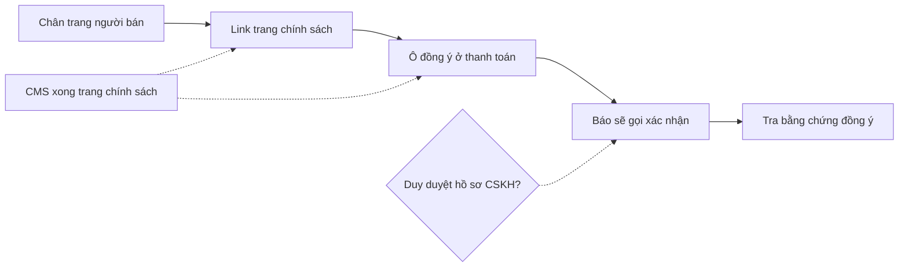

# Khung go-live pháp lý trên web — User stories
> PO · 2026-09-28 · Nguồn: 01-analysis.md (cùng thư mục) · Trạng thái: **ĐÃ DUYỆT (Duy 28/09 — chốt scope qua câu hỏi)**



> Làm **sau** hồ sơ `2026-09-28-cms-viet-bai`. GL-02, GL-03, GL-05 cần CMS-15 (trang có vai trò và phiên bản có hiệu lực).

## Mục tiêu & thước đo
Web có đủ **khung** để đáp ứng checklist go-live mục 2, 3, 6: thông tin người bán, link chính sách, đồng ý xử lý dữ liệu
khi đặt hàng. Nội dung chữ do `legal-vn` soạn và đăng bằng CMS, không sửa code.
- **Đo thành công:** (1) trên staging, mọi trang công khai có footer người bán + 4 link chính sách; (2) 100% đơn tạo sau
  khi release có `privacy_consent_at` và `privacy_policy_version`; (3) đổi thông tin người bán chỉ cần đổi cấu hình và khởi
  động lại dịch vụ, không build lại FE.

## Phạm vi
**Trong:** GL-01…GL-05. **Ngoài:** thủ tục pháp lý (checklist D1–D11 ở 01-analysis §6), màn sửa thông tin người bán trên
console, quyền xem/sửa/xoá dữ liệu của khách, banner cookie.

## Định nghĩa chung
- Lỗi theo quy ước `{"detail": "<tiếng Việt>", "code": "<mã>"}`.
- Dữ liệu thử là dữ liệu giả (vd người bán "Vựa Thử Nghiệm", SĐT `0900000000`). Không commit giá trị thật.
- "Trang công khai" = Landing, Shop (danh mục, chi tiết, giỏ, checkout, tra đơn), trang bài, trang nội dung.
- "Bộ khoá cấm" giống hồ sơ CMS (định nghĩa chung ở `2026-09-28-cms-viet-bai/02-stories.md`).

---

## GL-01 — Footer thông tin người bán lấy từ cấu hình · Must · BE+FE
**Là** Khách, **tôi muốn** thấy rõ ai bán hàng, địa chỉ, mã số thuế, số điện thoại và email ở cuối mọi trang, **để** tin
tưởng và biết liên hệ khiếu nại ở đâu.

Bối cảnh: go-live mục 2 và 9, BR-ND-18. Giá trị lấy từ env của backend, trả qua API công khai; FE không chứa chuỗi người
bán nào. Đổi cấu hình có hiệu lực mà không cần build lại FE.

Contract:
```
GET /api/public/site-info/   (AllowAny, chỉ GET, Cache-Control max-age ≤ 300)
→ 200 {"seller":{"name":"Vựa Thử Nghiệm","business_type":"Hộ kinh doanh","registration_no":"0000000000",
                 "tax_code":"0000000000","address":"1 Đường Thử, Phường Thử, Tỉnh Thử","phone":"0900000000","email":"lienhe@example.com"},
       "seller_complete":true,
       "confirm_call_notice":false,"confirm_call_hours":"7:00–20:00"}
```

| Mã | Given | When | Then | BR |
|---|---|---|---|---|
| GL-01-AC1 | Env `SELLER_*` đặt đủ giá trị giả | GET `site-info` | 200, `seller` đúng 7 field theo env, `seller_complete=true` | BR-ND-18 |
| GL-01-AC2 | Tiếp AC1 | Mở từng trang công khai (danh sách ở định nghĩa chung) | Footer hiện đủ 7 thông tin; SĐT là link `tel:`, email là link `mailto:` | go-live mục 2, 9 |
| GL-01-AC3 | Đổi `SELLER_PHONE` rồi khởi động lại backend, **không** build lại FE | Tải lại trang | Footer hiện số mới | BR-ND-18 |
| GL-01-AC4 (lỗi cấu hình) | Thiếu `SELLER_TAX_CODE` | GET `site-info`; chạy `manage.py check` | Field đó `null`, `seller_complete=false`; footer hiện "Đang cập nhật" ở dòng đó; `check` in cảnh báo nêu **tên biến** thiếu (không in giá trị nào) | BR-ND-18 |
| GL-01-AC5 (lỗi API) | API tắt hoặc lỗi | Mở Shop | Trang vẫn dùng được; khối người bán ẩn, không trắng trang, console không in dữ liệu | |
| GL-01-AC6 (không viết cứng) | Mã nguồn `frontend/` và `backend/` | Test FE render footer với dữ liệu mock "Vựa Thử Nghiệm"; tìm trong repo các giá trị env production | Footer chỉ hiện giá trị từ API; repo chỉ có placeholder trong `.env.example`, không có giá trị thật | BR-ND-18, bất biến 9 |
| GL-01-AC7 (dữ liệu công khai) | — | Quét JSON `site-info` | Chỉ có các khoá trong contract; không lộ setting nào khác (secret, URL DB, cấu hình SePay) | bất biến 9 |
| GL-01-AC8 (quyền) | Không đăng nhập | POST/PUT/PATCH/DELETE `site-info` | 405 | BR-PQ-12 |

---

## GL-02 — Footer có link tới các trang chính sách · Must · FE
**Là** Khách, **tôi muốn** bấm từ footer sang chính sách bảo mật, điều kiện giao dịch, đổi trả hoàn tiền, **để** đọc trước
khi trả tiền.

Bối cảnh: go-live mục 2, 3; BR-ND-19. Dùng `GET /api/public/content/footer-links/` và trang `/trang?slug=…` của CMS-15.
Danh sách link do người có quyền đăng chọn trong CMS, FE không viết cứng tên trang.

| Mã | Given | When | Then | BR |
|---|---|---|---|---|
| GL-02-AC1 | 4 trang Đã đăng có `show_in_footer`, `footer_order` 1–4 | Mở từng trang công khai | Footer có đúng 4 link theo thứ tự, trỏ `/trang?slug=<slug>` | BR-ND-19 |
| GL-02-AC2 | Một trang thường (không vai trò go-live) bị gỡ | Tải lại trang | Link đó biến mất; 3 link còn lại giữ nguyên | BR-ND-19 |
| GL-02-AC3 | Quản lý bỏ `show_in_footer` một trang | Tải lại trang | Link biến mất mà không build lại FE | BR-ND-19 |
| GL-02-AC4 (lỗi) | API `footer-links` lỗi | Mở Shop | Không hiện khối link, không trắng trang; khối người bán (GL-01) không bị ảnh hưởng | |
| GL-02-AC5 (điện thoại) | Viewport 375×667 | Mở footer | Không cuộn ngang; mỗi link có vùng chạm ≥ 44 px chiều cao | |
| GL-02-AC6 (quyền) | Trang Nháp có `show_in_footer=true` | GET `footer-links` | Không có trang Nháp (chỉ Đã đăng) | BR-ND-16 |

---

## GL-03 — Ô đồng ý xử lý dữ liệu cá nhân ở checkout · Must · BE+FE
**Là** Khách, **tôi muốn** được hỏi đồng ý rõ ràng trước khi gửi tên, SĐT, địa chỉ, **để** biết dữ liệu của tôi được dùng
vào việc gì; **là** Chủ vựa, **tôi muốn** có bằng chứng khách đã đồng ý bản chính sách nào, **để** đáp ứng Luật BVDLCN 2025.

Bối cảnh: go-live mục 6, BR-BH-17, BR-ND-16, bất biến 9. Field mới trên `SalesOrder` có lý do ở 01-analysis §5.
Câu hỏi G1: mặc định Shop không nhận đơn khi chưa có chính sách bảo mật đã đăng.

Contract:
```
GET  /api/public/content/pages/by-role/privacy/  → 200 {"slug":"chinh-sach-bao-mat","title":"…","version":3,"version_id":918,"effective_from":"…"} | 404
POST /api/shop/orders/   {…các field hiện có…, "privacy_consent":{"accepted":true,"policy_version_id":918}}
  → 201 như hiện nay (response không thêm field)
  → 400 {"code":"BR-BH-17","detail":"Vui lòng đồng ý chính sách xử lý dữ liệu cá nhân"}      (thiếu hoặc accepted=false)
  → 409 {"code":"POLICY_CHANGED","current":{"version":4,"version_id":930,"slug":"chinh-sach-bao-mat"}}
  → 503 {"code":"BR-BH-17","detail":"Shop tạm chưa nhận đơn"}                                 (chưa có chính sách, cờ bật)
```

| Mã | Given | When | Then | BR |
|---|---|---|---|---|
| GL-03-AC1 | Chính sách bảo mật Đã đăng phiên bản `version_id=918` | Khách tick và đặt hàng | 201; đơn có `privacy_consent_at` = giờ **server** (lệch giờ máy khách không ảnh hưởng) và `privacy_policy_version` = 918 | BR-BH-17 |
| GL-03-AC2 (FE) | Mở checkout | — | Ô đồng ý **chưa tick** sẵn; nhãn nêu mục đích (giao hàng, liên hệ xác nhận đơn) và có link tới chính sách mở tab mới; nút "Đặt hàng" khoá tới khi tick | BR-BH-17 |
| GL-03-AC3 (lỗi) | — | Gọi API không có `privacy_consent`, hoặc `accepted=false` | 400 `BR-BH-17`; không tạo đơn, không giữ chỗ lô nào (số `SalesOrder` và phân bổ lô không đổi) | BR-BH-17, BR-BH-06 |
| GL-03-AC4 (lỗi, chính sách vừa đổi) | Khách mở checkout lúc phiên bản 918; Quản lý đăng lại chính sách thành 930 | Khách đặt hàng với 918 | 409 `POLICY_CHANGED`; không tạo đơn; FE bỏ tick, cập nhật link sang bản mới, báo "Chính sách vừa cập nhật, vui lòng xem và đồng ý lại"; dữ liệu đã nhập trong form **còn nguyên** | BR-BH-17 |
| GL-03-AC5 (lỗi) | Chưa có chính sách bảo mật Đã đăng, `PRIVACY_CONSENT_REQUIRED=true` | Mở checkout; gọi API tạo đơn | FE hiện "Shop tạm chưa nhận đơn" thay cho form; API 503 `BR-BH-17` | BR-BH-17, G1 |
| GL-03-AC6 | `PRIVACY_CONSENT_REQUIRED=false` (chỉ test/dev) | Tạo đơn không có consent | 201; hai field consent để trống (giữ cho test cũ chạy) | |
| GL-03-AC7 (thu tối thiểu) | Tiếp AC1 | Đọc bản ghi đơn và mọi bảng mới | Bằng chứng đồng ý chỉ gồm thời điểm + phiên bản; không lưu IP, user agent hay bản chép field cá nhân nào | bất biến 9 |
| GL-03-AC8 (log, lưu trên máy) | Bắt log backend và console FE khi đặt hàng; kiểm `localStorage`, `sessionStorage`, URL | Chạy AC1 | Log không có tên, SĐT, địa chỉ đầy đủ; FE không lưu trạng thái đồng ý hay dữ liệu cá nhân mới vào storage hoặc URL (chỉ giữ `order_code` và 4 số cuối như hiện nay) | bất biến 9 |
| GL-03-AC9 (API công khai) | Có đơn đã đồng ý | Tra đơn `GET /api/shop/orders/<code>/?phone_last4=…` | Response giữ nguyên bộ khoá như trước story (không thêm khoá consent) | bất biến 9 |
| GL-03-AC10 (append) | Đơn đã có consent | Cập nhật đơn qua mọi API hiện có | `privacy_consent_at` và `privacy_policy_version` không đổi được; phiên bản chính sách bị tham chiếu không xoá được (`PROTECT`) | BR-BH-17, BR-ND-05 |

---

## GL-04 — Thông báo "vựa sẽ gọi xác nhận" sau khi đặt · Should · FE (+BE cờ cấu hình)
**Là** Khách vừa đặt và trả tiền, **tôi muốn** biết vựa sẽ gọi cho tôi để xác nhận, **để** không lỡ cuộc gọi và không
tưởng là cuộc gọi lừa đảo.

Bối cảnh: hồ sơ `2026-09-28-cskh-xac-nhan-in-tem` (Q-C8/C9, **CHỜ DUYỆT**). Cờ `confirm_call_notice` và
`confirm_call_hours` ở `site-info` (GL-01), mặc định **tắt** tới khi CSKH vận hành (G2). Should vì phụ thuộc hồ sơ CSKH.

| Mã | Given | When | Then | BR |
|---|---|---|---|---|
| GL-04-AC1 | `confirm_call_notice=true`, khách vừa tạo đơn với SĐT giả `0912345678` | Màn thanh toán hiện ra | Có câu "Cá Về sẽ gọi số đuôi 5678 trong khung 7:00–20:00 để xác nhận trước khi giao"; giờ lấy từ `confirm_call_hours` | bất biến 9 |
| GL-04-AC2 | Tiếp AC1, thanh toán cổng xong, về `/shop/orders?code=…&result=success` | Trang tải | Có cùng câu, dùng 4 số cuối đang giữ trong `sessionStorage` | |
| GL-04-AC3 (dữ liệu) | Tiếp AC1–AC2 | Quét DOM và URL | DOM không chứa SĐT đầy đủ; URL không có tham số SĐT | bất biến 9 |
| GL-04-AC4 | `confirm_call_notice=false` | Như AC1, AC2 | Không có câu thông báo | G2 |
| GL-04-AC5 (lỗi) | `site-info` lỗi | Như AC1 | Không hiện câu; luồng thanh toán không bị chặn | |

---

## GL-05 — Chủ và Quản lý tra bằng chứng đồng ý của một đơn · Could · BE+FE
**Là** Chủ vựa, **tôi muốn** thấy khách của đơn đã đồng ý phiên bản chính sách nào lúc nào, **để** xử lý khiếu nại hoặc
yêu cầu của cơ quan quản lý.

Bối cảnh: BR-BH-17, BR-ND-16 (tra phiên bản có hiệu lực). Could vì bằng chứng đã nằm trong DB từ GL-03; màn này chỉ giúp
tra nhanh.

| Mã | Given | When | Then | BR |
|---|---|---|---|---|
| GL-05-AC1 | Đơn có consent phiên bản 3 | Chủ hoặc Quản lý mở chi tiết đơn trên console | Dòng "Đồng ý chính sách bảo mật: phiên bản 3, lúc hh:mm dd/mm/yyyy" có link xem nội dung đúng phiên bản 3 (kể cả khi đã có phiên bản mới hơn) | BR-BH-17, BR-ND-16 |
| GL-05-AC2 | Đơn tạo trước story | Mở chi tiết | Hiện "Không có dữ liệu đồng ý (đơn trước ngày áp dụng)" | |
| GL-05-AC3 (quyền) | Token NV kho, NV giao | GET chi tiết đơn | Response **không có** khoá consent (serializer liệt kê field tường minh theo Group) | BR-PQ, bất biến 9 |

---

## Thứ tự làm đề xuất
**GL-01** (không phụ thuộc CMS, làm được ngay) → **GL-02** (sau CMS-15) → **GL-03** (sau CMS-15; Must, chặn go-live) →
**GL-04** (khi hồ sơ CSKH được duyệt) → **GL-05**.
BE và FE làm song song theo contract; FE dựng mock `site-info`, `footer-links`, `pages/by-role/privacy`.

## Rủi ro / phụ thuộc
- **CMS-15** phải xong trước GL-02, GL-03, GL-05.
- **Production API đang tắt:** footer, link chính sách và checkout đều cần API. Theo G1, trước khi bật API production phải
  đăng chính sách bảo mật, nếu không Shop từ chối đơn (đúng ý đồ).
- **Nội dung pháp lý** (D4) do `legal-vn` soạn, Duy duyệt; code không chờ việc này, nhưng go-live thì chờ.
- **Schema:** 2 field mới trên `SalesOrder` (lý do ở 01-analysis §5) cần migration; không đổi luồng giữ chỗ, FEFO hay
  thanh toán.
- **Việc của Duy D1–D11** (01-analysis §6) chặn go-live nhưng không chặn code.

## Để sau
- Màn cho Chủ tự sửa thông tin người bán trên console.
- Quyền của khách xem, sửa, xoá dữ liệu (ẩn danh hoá), banner cookie khi có analytics.
- Đường dẫn đẹp cho trang chính sách, HSTS cho API (D11).
