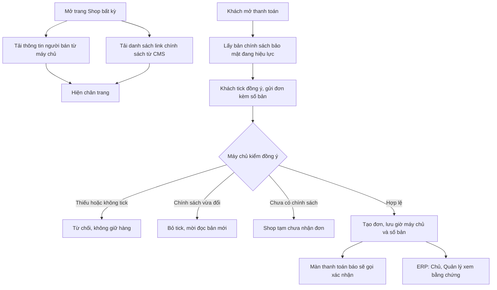

# Khung go-live pháp lý trên web — Thiết kế kỹ thuật
> Claude (Tech Lead) · 2026-09-28 · Trạng thái: **ĐÃ DUYỆT (Duy 28/09 — theo chốt scope)**
> Nguồn: `01-analysis.md`, `02-stories.md` (GL-01…05, ĐÃ DUYỆT), `doc/ops/go-live-phap-ly.md` mục 2, 3, 6, 9.
> Phụ thuộc: hồ sơ `2026-09-28-cms-viet-bai` (`02b` §4.6, §8.6 — trang có `page_role`, `EntryVersion`, `footer-links`,
> `/trang/?slug=`, `BusinessError.extra`). Code tham chiếu nhánh `wip/autosave` commit `cc47542`.
> Người hiện thực: Gemini CLI / Antigravity theo `AGENTS.md`; giao việc ở `02c-giao-viec.md`.
> **Ghi chú rà 11/10 (lịch sử):** `SiteLegalFooter` gắn ở `app/layout.tsx` mô tả dưới đây đã xoá ở Shop lô 1. Footer pháp lý nay là `ShopFooter` (khối F1/F2) theo `doc/features/2026-10-06-shop-giao-dien-moi/02b-tech-design.md`. URL `/trang/?slug=` nay là `/pages/?slug=` (quyết định 11/10).



## 0. Tóm tắt quyết định

| # | Quyết định | Căn cứ |
|---|---|---|
| 1 | Thông tin người bán **chỉ ở env backend** (`SELLER_*`), trả qua `GET /api/public/site-info/` (dict tường minh). FE không có chuỗi người bán nào; đổi env + khởi động lại Cloud Run là footer đổi, không build lại FE. | BR-ND-18, G3 |
| 2 | Footer pháp lý là **một component client** `SiteLegalFooter` đặt **một lần** trong `frontend/app/layout.tsx` → có ở mọi trang công khai (Landing, Shop, bài, trang, 404). Hai nguồn `site-info` và `footer-links` tải song song, **lỗi riêng từng nguồn** (`Promise.allSettled`). | GL-01, GL-02, BR-ND-19 |
| 3 | Đồng ý xử lý dữ liệu: `SalesOrder` thêm `privacy_consent_at` + `privacy_policy_version` (FK `content.EntryVersion`, `PROTECT`). Kiểm ở **service `create_order`** trước mọi giữ chỗ; giờ server; không lưu IP/UA. | BR-BH-17, bất biến 9 |
| 4 | Cờ `PRIVACY_CONSENT_REQUIRED` **bật mặc định** (staging, production); chỉ tắt khi `TESTING` hoặc `DEBUG`. Bật mà chưa có chính sách bảo mật đã đăng → API tạo đơn trả **503 `BR-BH-17`**, Shop hiện "Shop tạm chưa nhận đơn". | G1 (🟡) |
| 5 | Thông báo "vựa sẽ gọi xác nhận": cờ `SHOP_CONFIRM_CALL_NOTICE` **tắt mặc định**, trả qua `site-info`; FE chỉ dùng 4 số cuối SĐT. | G2 (🟡) |
| 6 | Bằng chứng đồng ý trên ERP: quyền Tầng 2 mới `sales.view_privacy_consent` (gán `chu`, `quan_ly`); serializer chi tiết đơn **bỏ hẳn khoá** `privacy_consent` khi thiếu quyền. | GL-05, BR-PQ |
| 7 | Không đổi luồng giữ chỗ, FEFO, thanh toán, tra đơn; response tạo đơn và tra đơn **không thêm khoá**. | GL-03-AC3/AC9 |

---

## 1. Kiến trúc

```
 frontend/ (static export)
  app/layout.tsx ── <SiteLegalFooter/>  ─┬─ GET /api/public/site-info/            (người bán, cờ)
                                        └─ GET /api/public/content/footer-links/   (CMS-15)
  features/checkout/CheckoutScreen ─┬─ GET /api/public/content/pages/by-role/privacy/  (CMS-15)
                                    └─ POST /api/shop/orders/ {…, privacy_consent:{accepted, policy_version_id}}
  PaymentPanel / OrderLookup ── <ConfirmCallNotice last4=…/> (site-info.confirm_call_notice)

 backend/
  apps/content/site/      api.py (SiteInfoView)  services.py (site_info())  checks.py (system check W001)
  apps/sales/orders/      consent.py (resolve_privacy_consent) ── content.entries.services.current_policy_version("privacy")
                          services.create_order(..., privacy_consent=None)   shop_api.py (truyền payload)
                          serializers.SalesOrderDetailSerializer (+privacy_consent theo quyền)
  apps/sales/models/orders.py  SalesOrder + 2 field + perm view_privacy_consent
```

### 1.1 Nơi đặt code
| Thành phần | File |
|---|---|
| Site info | `backend/apps/content/site/{__init__,api,services,checks}.py`, `tests/`; đăng ký check trong `apps/content/apps.py::ready()` |
| Settings | `backend/config/settings.py` (khối `SELLER_*`, `PRIVACY_CONSENT_REQUIRED`, `SHOP_CONFIRM_CALL_*`), `backend/.env.example` (placeholder) |
| Route | `backend/config/api_urls.py` (`public/site-info/`) |
| Consent | `backend/apps/sales/orders/consent.py` (mới), `services.py` (`create_order` thêm kw), `shop_api.py` (`ShopOrderCreateView`) |
| Model + migration | `backend/apps/sales/models/orders.py`; `sales/migrations/0007_salesorder_privacy_consent.py`, `0008_salesorder_view_privacy_consent.py`, `0009_grant_view_privacy_consent.py` |
| Admin | `backend/apps/sales/admin.py` (2 field chỉ đọc) |
| ERP serializer | `backend/apps/sales/orders/serializers.py` (`SalesOrderDetailSerializer`) |
| FE footer | `frontend/features/site/{api,mock,types}.ts`, `components/SiteLegalFooter.tsx`, `components/ConfirmCallNotice.tsx`; `frontend/app/layout.tsx` |
| FE checkout | `frontend/features/checkout/components/CheckoutScreen.tsx`, `PaymentPanel.tsx`, `frontend/app/shop/orders/OrderLookup.tsx`, `frontend/lib/{api,types,mock}.ts` |
| FE ERP | `erp-console/features/orders/**` (dòng bằng chứng đồng ý), `erp-console/shared/lib/nav.ts` (`PERM.viewPrivacyConsent`) |

---

## 2. Model & migration (chỉ thêm)

### 2.1 `sales.SalesOrder` — 2 field (lý do: 01-analysis §5)
```python
privacy_consent_at = models.DateTimeField("Đồng ý xử lý dữ liệu lúc", null=True, blank=True, editable=False)
privacy_policy_version = models.ForeignKey(
    "content.EntryVersion", on_delete=models.PROTECT, null=True, blank=True, editable=False,
    related_name="+", verbose_name="Phiên bản chính sách bảo mật đã đồng ý")
```
- Đơn cũ để trống (không backfill). Không lưu IP, user agent, bản chép tên/SĐT (GL-03-AC7).
- `Meta.permissions` thêm `("view_privacy_consent", "Xem bằng chứng đồng ý xử lý dữ liệu của đơn")` (Lô 3).
- `SalesOrderAdmin`: thêm 2 field vào `readonly_fields` (và `locked_fields` nếu mixin dùng danh sách đó) — Admin cũng không sửa được (GL-03-AC10).

### 2.2 Migration
| File | Nội dung | Lô |
|---|---|---|
| `sales/0007_salesorder_privacy_consent.py` | `AddField` ×2; `dependencies` gồm `("content", "<migration cuối của content>")` | 2 |
| `sales/0008_salesorder_view_privacy_consent.py` | `AlterModelOptions` (permissions) — sinh bằng `makemigrations` | 3 |
| `sales/0009_grant_view_privacy_consent.py` | Data migration theo mẫu `accounts/0006`: gán `sales.view_privacy_consent` cho `chu`, `quan_ly`; có `revoke` | 3 |
Nếu số `0007…` đã bị hồ sơ khác (vd CSKH) dùng khi bắt đầu lô → đánh số tiếp theo, **không sửa migration đã có**, ghi vào `03-dev-notes.md`.

---

## 3. Contract API BE ↔ FE

### 3.1 `GET /api/public/site-info/` (GL-01, GL-04)
`AllowAny`, `http_method_names = ["get","head","options"]` (POST/PUT/PATCH/DELETE → 405), `Cache-Control: public, max-age=300`, throttle `public_content` (scope của CMS).
```json
{"seller": {"name": "Vựa Thử Nghiệm", "business_type": "Hộ kinh doanh", "registration_no": "0000000000",
            "tax_code": "0000000000", "address": "1 Đường Thử, Phường Thử, Tỉnh Thử",
            "phone": "0900000000", "email": "lienhe@example.com"},
 "seller_complete": true,
 "privacy_consent_required": true,
 "confirm_call_notice": false,
 "confirm_call_hours": "7:00–20:00"}
```
- **Bổ sung** so với contract `02-stories.md` GL-01: khoá `privacy_consent_required` (FE cần để phân biệt "Shop tạm chưa nhận đơn" với môi trường dev tắt cờ). Test GL-01-AC7 so **đúng tập khoá này**.
- Env rỗng → field `null`; `seller_complete = all(7 field khác null)`.
- `services.site_info()` đọc `settings` **mỗi request** (không cache ở module) → `override_settings` trong test có hiệu lực; Cloud Run khởi động lại là đổi.
- Dict dựng tường minh: không `settings.__dict__`, không vòng lặp theo tiền tố tên biến (tránh lộ biến khác — GL-01-AC7).

### 3.2 Dùng lại từ CMS (không đổi)
```
GET /api/public/content/footer-links/          → [{"title":"Chính sách bảo mật","slug":"chinh-sach-bao-mat"}, …]
GET /api/public/content/pages/by-role/privacy/ → {"slug","title","version","version_id","effective_from"} | 404
```

### 3.3 `POST /api/shop/orders/` (GL-03)
```
Request:  {…các field hiện có…, "privacy_consent": {"accepted": true, "policy_version_id": 918}}
201       như hiện nay: {"order_code","total_amount","booked_expires_at"}   (không thêm khoá)
400       {"detail":"Vui lòng đồng ý chính sách xử lý dữ liệu cá nhân.","code":"BR-BH-17"}
409       {"detail":"Chính sách vừa cập nhật, vui lòng xem và đồng ý lại.","code":"POLICY_CHANGED",
           "current":{"version":4,"version_id":930,"slug":"chinh-sach-bao-mat"}}
503       {"detail":"Shop tạm chưa nhận đơn.","code":"BR-BH-17"}
```

### 3.4 ERP chi tiết đơn (GL-05)
`GET /api/sales/orders/<id>/` thêm khoá **chỉ khi** user có `sales.view_privacy_consent`:
```json
"privacy_consent": {"accepted_at": "2026-10-02T09:15:00+07:00", "policy_entry_id": 50,
                    "policy_version": 3, "policy_version_id": 918}
```
hoặc `"privacy_consent": null` (đơn trước ngày áp dụng). Thiếu quyền → **không có khoá** (GL-05-AC3). Danh sách đơn không đổi.

---

## 4. Nghiệp vụ

### 4.1 `apps/sales/orders/consent.py`
```python
class PolicyChanged(BusinessError):   http_status = 409   # code="POLICY_CHANGED", extra={"current": {...}}
class ShopClosed(BusinessError):      http_status = 503   # code="BR-BH-17"

def resolve_privacy_consent(payload):
    """Trả EntryVersion (để lưu vào đơn) hoặc None. Raise trước khi có bất kỳ ghi DB nào (BR-BH-17)."""
    from apps.content.entries.services import current_policy_version
    current = current_policy_version("privacy")
    required = settings.PRIVACY_CONSENT_REQUIRED
    if current is None:
        if required: raise ShopClosed("Shop tạm chưa nhận đơn.", code="BR-BH-17")
        return None                                       # dev/test: không có chính sách → bỏ qua
    if payload is None and not required:
        return None                                       # GL-03-AC6
    if not isinstance(payload, dict) or payload.get("accepted") is not True:
        raise BusinessError("Vui lòng đồng ý chính sách xử lý dữ liệu cá nhân.", code="BR-BH-17")
    if payload.get("policy_version_id") != current.pk:    # so int tuyệt đối; "918" (chuỗi) cũng là lệch
        raise PolicyChanged("Chính sách vừa cập nhật, vui lòng xem và đồng ý lại.", code="POLICY_CHANGED",
                            extra={"current": {"version": current.version, "version_id": current.pk,
                                               "slug": current.entry.slug}})
    return current
```
- `create_order(*, …, privacy_consent=None)` (keyword mới, mặc định None → mọi call-site/test cũ không đổi): gọi `resolve_privacy_consent` **sau** hai kiểm tra đầu hiện có, **trước** `transaction.atomic()`; `SalesOrder.objects.create(..., privacy_consent_at=timezone.now() if version else None, privacy_policy_version=version)`.
- `ShopOrderCreateView.post`: truyền `privacy_consent=d.get("privacy_consent")`; **bỏ** `try/except BusinessError` tự dựng 400 để `apps.common.api.exception_handler` trả đúng `http_status` + `extra` (lỗi cũ vẫn ra `{"detail","code"}` 400 như trước — test cũ giữ xanh).
- Không log payload, không log SĐT (giữ nguyên hành vi hiện có).
- Không có API nào ghi 2 field này ngoài `create_order` (ViewSet đơn là ReadOnly; Admin chỉ đọc).

### 4.2 `apps/content/site/services.site_info()`
Đọc `SELLER_NAME`, `SELLER_BUSINESS_TYPE`, `SELLER_REG_NO`, `SELLER_TAX_CODE`, `SELLER_ADDRESS`, `SELLER_PHONE`, `SELLER_EMAIL` (chuỗi đã `strip()`, rỗng → `None`), `PRIVACY_CONSENT_REQUIRED`, `SHOP_CONFIRM_CALL_NOTICE`, `SHOP_CONFIRM_CALL_HOURS`.

### 4.3 System check (GL-01-AC4)
`apps/content/site/checks.py::check_seller_info(app_configs, **kwargs)` trả `Warning(f"Thiếu cấu hình người bán: {', '.join(tên_biến_thiếu)}", id="content.W001")` — **chỉ tên biến, không giá trị**. Đăng ký bằng hàm bọc bỏ qua khi `settings.TESTING` (tránh nhiễu suite); test gọi thẳng `check_seller_info` với `override_settings`.

### 4.4 Settings (thêm vào `backend/config/settings.py`)
| Biến | Mặc định | Ghi chú |
|---|---|---|
| `SELLER_NAME`, `SELLER_BUSINESS_TYPE`, `SELLER_REG_NO`, `SELLER_TAX_CODE`, `SELLER_ADDRESS`, `SELLER_PHONE`, `SELLER_EMAIL` | `""` | Giá trị thật chỉ đặt trên Cloud Run production (D7). Staging: thông tin giả. `.env.example`: placeholder "Vựa Thử Nghiệm"… |
| `PRIVACY_CONSENT_REQUIRED` | `_bool("PRIVACY_CONSENT_REQUIRED", "0" if (TESTING or DEBUG) else "1")` | G1 |
| `SHOP_CONFIRM_CALL_NOTICE` | `_bool(..., "0")` | G2 |
| `SHOP_CONFIRM_CALL_HOURS` | `"7:00–20:00"` | |
Ghi tên biến (không giá trị thật) vào `doc/ops/moi-truong.md` mục biến môi trường + nhắc: **trước khi bật API production phải đăng trang chính sách bảo mật**, nếu không Shop trả 503.

---

## 5. FE

### 5.1 `SiteLegalFooter` (GL-01, GL-02)
- `"use client"`; `useEffect` → `Promise.allSettled([getSiteInfo(), getFooterLinks()])`, `let active = true` + cleanup.
- Khối người bán: 7 dòng; `null` → "Đang cập nhật"; SĐT `<a href={"tel:" + phone.replace(/[^\d+]/g, "")}>`, email `<a href={"mailto:" + email}>` (chỉ khi email khớp `^[^\s@<>"]+@[^\s@<>"]+$`, không thì chữ thường). Lỗi → ẩn khối (GL-01-AC5). Không `console.log` dữ liệu.
- Khối link: `<Link href={{pathname: "/trang/", query: {slug}}}>` theo thứ tự API; lỗi → ẩn khối (GL-02-AC4). Link cao ≥ 44 px, không cuộn ngang ở 375 px.
- Chèn **một lần** trong `frontend/app/layout.tsx` sau `{children}`. Không sửa `ShopFooter.tsx` hay footer của `app/page.tsx` (chúng vẫn hiện dòng thương hiệu phía trên).
- Chữ hiển thị đều là React children (escape); không `dangerouslySetInnerHTML`.

### 5.2 Checkout (GL-03)
- Khi mở: song song `getSiteInfo()` và `getPrivacyPolicy()` (`by-role/privacy`).
  - Có chính sách → ô đồng ý **chưa tick**; nhãn: "Tôi đồng ý để Cá Về dùng họ tên, số điện thoại và địa chỉ của tôi để giao hàng và liên hệ xác nhận đơn, theo <a target="_blank" rel="noopener">Chính sách bảo mật</a>." (link `/trang/?slug=…`). Nút "Đặt hàng" khoá tới khi tick.
  - 404 và `privacy_consent_required !== false` → thay form bằng "Shop tạm chưa nhận đơn" (GL-03-AC5). `site-info` lỗi → coi như bắt buộc (an toàn); backend vẫn là lớp chặn thật.
  - 404 và `privacy_consent_required === false` (dev) → form không có ô đồng ý, không gửi `privacy_consent`.
- Gửi `privacy_consent: {accepted: true, policy_version_id}`.
- `409 POLICY_CHANGED` → bỏ tick, cập nhật slug/version từ `current`, báo "Chính sách vừa cập nhật, vui lòng xem và đồng ý lại", **giữ nguyên** dữ liệu form. `503 BR-BH-17` → màn "Shop tạm chưa nhận đơn".
- `frontend/lib/api.ts`: `apiFetch` khi `!res.ok` gắn thêm `code` và `data` (body JSON) vào `ApiError` (**chỉ thêm** thuộc tính, nhánh 404 và thông điệp giữ nguyên); `lib/types.ts`: `ApiError` thêm `code?: string; data?: unknown`, `CreateOrderPayload.privacy_consent?`. `lib/mock.ts`: mock có chính sách `version_id: 918`, và cách giả lập 409/503 cho QA.
- Không lưu trạng thái đồng ý vào storage/URL (GL-03-AC8).

### 5.3 `ConfirmCallNotice` (GL-04)
- Props: `last4` (string 4 số). Hiện khi `site-info.confirm_call_notice === true`: "Cá Về sẽ gọi số đuôi {last4} trong khung {confirm_call_hours} để xác nhận trước khi giao." Lỗi/tắt → không hiện, không chặn luồng.
- Đặt ở `PaymentPanel` (last4 = `phone.slice(-4)` từ state checkout — không truyền SĐT đầy đủ vào component) và `OrderLookup` khi `result=success` (last4 từ `recallOrderContact`). DOM không có SĐT đầy đủ, URL không có SĐT.

### 5.4 ERP (GL-05)
- `erp-console/features/orders/types.ts`: `privacy_consent?: {…} | null` (khoá có thể vắng).
- Chi tiết đơn: có khoá và khác null → "Đồng ý chính sách bảo mật: phiên bản {policy_version}, lúc HH:mm dd/MM/yyyy" + link tới màn xem phiên bản của CMS (`/content/edit/?id={policy_entry_id}&version={policy_version}` — màn lịch sử phiên bản CMS-11). `null` → "Không có dữ liệu đồng ý (đơn trước ngày áp dụng)". Vắng khoá → không hiện dòng.

---

## 6. Rủi ro bắt buộc — cơ chế chặn và test

| # | Rủi ro | Cơ chế chặn | Test bắt lỗi |
|---|---|---|---|
| R1 | **Tạo đơn không có đồng ý** (gọi thẳng API, bỏ qua FE) | Kiểm ở `create_order` (server), trước giữ chỗ | GL-03-AC3: không payload / `accepted:false` / `accepted:"true"` (chuỗi) → 400; đếm `SalesOrder`, `SalesOrderLineBatch`, `Batch.qty_reserved` trước = sau |
| R2 | Đồng ý bản chính sách cũ | So `policy_version_id` với phiên bản hiện hành, tuyệt đối | GL-03-AC4 (đăng lại chính sách giữa chừng → 409, không đơn); `"918"` chuỗi → 409 |
| R3 | **Thu thừa dữ liệu cá nhân** (IP, UA, bản chép) | Chỉ 2 field; không bảng mới | GL-03-AC7: so tập field `SalesOrder` trước/sau migration chỉ thêm 2 field trên; không field nào khác đổi giá trị |
| R4 | **Rò dữ liệu cá nhân** qua tra đơn / log / FE storage | Response tra đơn giữ nguyên; không log payload; FE chỉ 4 số cuối | GL-03-AC9 (`set(resp.json()) ==` tập khoá cũ); GL-03-AC8 (handler bắt log backend không có tên/SĐT/địa chỉ giả; Playwright kiểm `localStorage`/`sessionStorage`/URL); GL-04-AC3 (DOM không SĐT đầy đủ) |
| R5 | **Lộ setting/secret qua `site-info`** | Dict tường minh 5 khoá gốc | GL-01-AC7: `set(resp.json()) == {"seller","seller_complete","privacy_consent_required","confirm_call_notice","confirm_call_hours"}`, `set(seller) ==` 7 khoá; đặt `SEPAY_SECRET_KEY`, `DATABASE_URL` giả trong test và assert chuỗi đó không có trong `resp.content` |
| R6 | Giá trị người bán thật lọt repo công khai | Chỉ env; `.env.example` placeholder | GL-01-AC6: test FE render với mock "Vựa Thử Nghiệm"; lệnh kiểm `git grep -n "SELLER_" -- . ':!*.md' ':!*.example'` chỉ ra `settings.py`/`services.py`/`checks.py`/test; QA đối chiếu không có số MST thật |
| R7 | **Vượt quyền** xem bằng chứng đồng ý | Quyền `sales.view_privacy_consent` (chu, quan_ly); bỏ khoá khi thiếu | GL-05-AC3: `nv_kho`, `nv_giao` (phiếu được gán) → không khoá `privacy_consent` ở mọi độ sâu; `chu`, `quan_ly` có |
| R8 | Sửa/xoá bằng chứng | Field `editable=False`, Admin chỉ đọc, ViewSet đơn ReadOnly, FK `PROTECT`, `EntryVersion` append-only | GL-03-AC10: PATCH đơn → 405; `EntryVersion.delete()` raise; Admin change form POST giá trị khác → field không đổi |
| R9 | **Shop đóng nhầm** trên production (chưa đăng chính sách) hoặc **mở nhầm** (cờ tắt) | Mặc định bật ngoài dev/test; FE coi lỗi `site-info` là bắt buộc; ghi nhắc vận hành | GL-03-AC5/AC6; test settings: không `TESTING`/`DEBUG` → `True` |
| R10 | Suite cũ đỏ vì cờ | `TESTING` → cờ tắt | Toàn bộ suite cũ xanh không sửa test |
| R11 | Giá vốn | Không đụng field/serializer giá vốn | Suite cũ (`test_api` batches, orders `unit_cost`) xanh |

---

## 7. Phụ thuộc giữa các hồ sơ

| Hồ sơ | Quan hệ |
|---|---|
| `2026-09-28-sua-loi-bao-mat` | Đã merge vào `main` trước (throttle, `exception_handler`). |
| `2026-09-28-cms-viet-bai` | **Bắt buộc trước:** CMS Lô 5 (CMS-15) cho GL Lô 1–2; CMS Lô 7 (CMS-11 màn phiên bản) cho GL Lô 3. Mặc định bắt đầu hồ sơ này khi CMS **XONG** (PO: "làm sau hồ sơ CMS"). Dùng `current_policy_version`, `EntryVersion`, `footer-links`, `/trang/?slug=`, `BusinessError.extra`, scope throttle `public_content`. |
| `2026-09-28-cskh-xac-nhan-in-tem` (CHỜ DUYỆT) | GL-04 làm code được ngay, cờ tắt; chỉ bật `SHOP_CONFIRM_CALL_NOTICE` khi CSKH vận hành. Nếu CSKH thêm migration `sales` trước → đánh số tiếp (§2.2). |
| `2026-09-28-ai-digital-worker` | Đề xuất thêm `/api/public/` vào nhóm "cấm hẳn". `sales.view_privacy_consent` là quyền Tầng 2 mới, chỉ dùng cho **đọc** nên không ảnh hưởng trần lệnh ghi. Khoá `privacy_consent` không phải PII (không tên/SĐT/địa chỉ). |
| Việc của Duy D1–D11 | Chặn go-live, không chặn code. D4 (legal-vn soạn 4 trang) + đăng bằng CMS là điều kiện để bật API production khi cờ G1 bật. |

---

## 8. Câu hỏi kỹ thuật

### 🔴 Cần Duy quyết
Không có.

### 🟡 Mặc định theo PO đề xuất (Duy lật được)
| # | Câu hỏi | Mặc định áp dụng |
|---|---|---|
| G1 | Chưa có chính sách bảo mật đã đăng thì Shop có nhận đơn? | `PRIVACY_CONSENT_REQUIRED` **bật** (staging + production): chưa đăng chính sách → Shop **không nhận đơn** (503). Chỉ tắt trong test/dev. |
| G2 | Hiện "vựa sẽ gọi xác nhận" từ khi nào? | Cờ `SHOP_CONFIRM_CALL_NOTICE` **tắt** tới khi CSKH chạy thật. |
| G3 | Thông tin người bán lấy từ đâu? | **Cấu hình môi trường** backend (`SELLER_*`), không màn sửa trên console đợt này. |
| G4 | Từ khoá cảnh báo giá vốn, danh sách lý do gỡ bài | Như PO đề xuất ở hồ sơ CMS: `CONTENT_COST_KEYWORDS` = "giá mua, giá vốn, giá nhập, giá cảng, nhà cung cấp, tiền lãi"; lý do gỡ `wrong_price, complaint, out_of_season, wrong_content, other`. |
| TD-G1 | `site-info` thêm khoá `privacy_consent_required` (ngoài contract story) | Thêm (§3.1). |
| TD-G2 | Quyền xem bằng chứng đồng ý | Quyền Tầng 2 mới `sales.view_privacy_consent` (chu, quan_ly), thay vì dựa vào tên Group. |

---

## 9. Review
_(Tech Lead điền sau khi từng lô QA APPROVED: REVIEW PASS / REVIEW FAIL kèm file:dòng.)_
