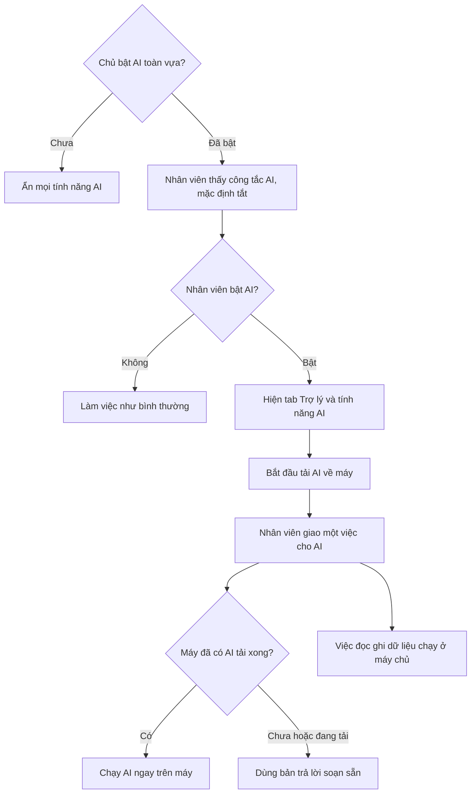

# Yêu cầu P9 — AI local thật: bật AI hai tầng + tải model khi bật + router kiểm model
> Ghi nguyên lời Duy, 2026-09-30 (trong lúc làm P8 Lô 6, SR-20 / F6-2). Trạng thái: **TẠM HOÃN** (rà 11/10: AI đã tắt cứng từ 05/10; trước đó: CHỜ BA, đề xuất P9).

## Lời Duy (nguyên văn)
- "anh nhớ thiết kế là tự deligate chứ đâu cần phải chọn nút này nút kia ta"
- "ý là có 1 tầng nữa tự biết lúc nào dùng AI local lúc nào call server"
- "khi nhân viên bật công tắt AI lên thì mới bắt đầu tải AI local xuống, phải check có AI local chưa trước rồi mới router"
- "chủ sẽ bật AI lên, lúc đó tất cả tính năng liên quan AI mới hiển thị ra, sau đó nhân viên sẽ thấy rồi coi có bật ko,
  nếu nhân viên bật rồi mới hiển thị ra tab trợ lý này kia các tính năng liên quan"

## Luồng mong muốn (điều phối tóm tắt, chờ BA làm rõ)
1. Chủ chưa bật AI toàn cục → **mọi** UI liên quan AI ẩn (tab Trợ lý, "AI của tôi", nút AI trên khối Tiếp theo).
2. Chủ bật → nhân viên thấy công tắc AI của mình; **mặc định tắt** (opt-in).
3. Nhân viên bật = đồng ý → hiện tab Trợ lý + tính năng AI; **bắt đầu tải model local** (không còn bước "đồng ý tải" riêng).
4. Router (BR-AI-02): trước mỗi việc AI, kiểm máy đã có model local chưa → có: việc kênh `local` chạy trên máy;
   chưa/đang tải: bản tất định. Việc nghiệp vụ (đọc/ghi, "Để AI làm") luôn chạy ở server, không cần model.

## Hiện trạng code (30/09)
- `step.ai` đã null khi Chủ tắt toàn cục / nhân viên tắt (`effective_level`: `global_mode`, `killed`) → P8 Lô 6 F6-2 dùng làm tín hiệu nút "Để AI làm".
- Nhân viên mặc định **bật** (không killed); đồng ý tải model là bước riêng trong tab Trợ lý (`features/ai/consent.ts`).
- Liên quan: RA-04 (nhân viên tự bật lại AI Chủ đã tắt khẩn) trong `2026-09-30-ra-soat-agy/bao-cao-tong.md`.

## Cần BA/techlead/legal-vn
- Thông báo trước khi tải 1–3 GB (dung lượng, mạng di động) — `legal-vn` soát câu chữ đồng ý (Luật AI, NĐ 142).
- Chỉ báo tiến độ tải, huỷ tải, máy không đủ RAM.
- Tắt AI → xoá model đã tải hay giữ?

## Quyết định Duy 30/09 (tách plan)
- **Không chờ máy tham chiếu (Q4 cũ).** Lấy **Windows 8 GB RAM** làm máy tham chiếu trước; khi lên UAT Duy tự tải model về chạy thử.
- **Tách plan:** P8 làm cho xong (Lô 6–7). "AI local thật" là plan riêng **P9**, **lập kế hoạch cùng Duy** (BA → PO → Tech Lead) sau P8.
- Phạm vi P9 dự kiến: S17 (spike 50 câu, chốt model — Gemma 3n đã chọn, dự phòng Frog/SEA-LION) và phần còn lại của S08
  (cài `@wllama/wllama`, host GGUF, wasm, worker module) trong `2026-09-27-ai-native-erp/02-stories.md`; luồng bật AI hai tầng +
  router kiểm model ở trên; RA-04 (Chủ tắt thì chỉ Chủ bật lại). Hiện trạng runtime: `erp-console/features/ai/runtime/` là khung, chạy LLMock.
- **Cấu hình tham chiếu (Duy 30/09):** tối thiểu **8 GB RAM**, Chrome/Edge, Windows **hoặc Mac** (máy thử: MacBook M1 8 GB của Duy).
  Gợi ý kỹ thuật (Tech Lead chốt): Gemma 3n **E2B** Q4 (~1,5–2 GB, chia mảnh < 2 GB cho wllama), n_ctx 2048; cần COOP/COEP trên
  Firebase Hosting để chạy đa luồng; Safari kiểm riêng. Dưới 8 GB / iPhone / 4G → bản không AI (tất định).
- **Luật Duy 01/10:** "cái gì AI không làm được thì bảo là không làm được và nhờ người dùng làm thôi" — AI không tự chuyển việc sang người khác; báo không làm được + lý do, người dùng tự làm (liên quan RA-05, DW-26/27).
