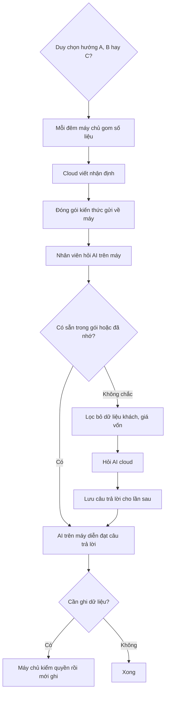

# AI trên máy và AI cloud: làm sao cho đủ thông minh
> Điều phối · 2026-10-01 · Ghi chú để Duy nghiên cứu trước khi lập kế hoạch P9. Chưa phải quyết định.

## 1. Vấn đề
Máy tham chiếu 8 GB chỉ chạy được model nhỏ (Gemma 3n E2B, khoảng 2 tỉ tham số, ~1,5–2 GB, ngữ cảnh ~2.000 token). Model này:
- **Không đủ sức suy luận nghiệp vụ**: FEFO, giá vốn, lãi lỗ lô, vì sao đơn bị chặn.
- Tiếng Việt chuyên ngành yếu, dễ bịa.

## 2. Thiết kế hiện tại đã né phần lớn
**AI không cần hiểu doanh nghiệp — code hiểu.**
- Luật nghiệp vụ, quyền, giá vốn, tồn kho đều ở server, chạy tất định.
- Khối "Tiếp theo" và câu "vì sao" là soạn sẵn.
- Model trên máy chỉ làm 3 việc nhỏ:
  - chọn lệnh trong top-5 do bộ tìm từ khoá lọc sẵn (spike: recall 98%);
  - điền tham số theo schema;
  - diễn đạt lại dòng thời gian.
- "Để AI làm", AI chốt lô… đều chạy ở server, không cần model.

Model nhỏ **không đủ** cho: câu hỏi mở ("tuần này lô nào lỗ, vì sao?"), phân tích, gợi ý giá, dự báo, hiểu câu nói lộn xộn ở cảng.

## 3. Ba hướng tổng thể
| Hướng | Thông minh | Chi phí | Dữ liệu |
|---|---|---|---|
| **A. Chỉ chạy trên máy** | Thấp (chọn lệnh, tóm tắt) | 0 đ | Không rời máy |
| **B. Lai: việc khó gọi cloud** (Claude/Gemini qua adapter, S11) | Cao | Theo lượt gọi | Phải lọc dữ liệu khách + giá vốn; dữ liệu ra nước ngoài → `legal-vn` soát (Luật AI 134/2025, Luật BVDLCN 91/2025) |
| **C. Chỉ cloud, bỏ model trên máy** | Cao | Theo lượt gọi | Như B; máy yếu/iPhone dùng được, không tải 1,5–2 GB |

## 4. "Đồng bộ" cloud về máy được không?
Không chép được "trí thông minh": model cloud lớn gấp hàng trăm lần, trọng số là bí mật. Nhưng có 3 cách làm model nhỏ **trông thông minh hơn nhiều**:

### Cách 1 — Server + cloud nghĩ trước, máy chỉ đọc (nên làm đầu tiên)
- Mỗi đêm: job gom số liệu bằng SQL tất định → cloud viết nhận định → đóng **gói kiến thức** vài chục KB gửi về máy.
  - Ví dụ: "Lô CA-0928 lỗ 1,2 triệu vì 8 kg hết hạn", "3 đơn chờ thanh toán quá 2 giờ".
  - Kèm thuật ngữ của vựa và câu "vì sao" của từng luật.
- Model nhỏ chỉ tìm trong gói rồi diễn đạt, không cần tự suy luận.
- ✅ Rẻ (cloud chạy 1 lần/ngày), nhanh, chạy được khi mất mạng, không gửi dữ liệu khách lên cloud (gói chỉ có mã lô/mã đơn/số liệu đã lọc).
- ❌ Chỉ trả lời tốt những gì đã tính trước.

### Cách 2 — Dạy riêng model nhỏ bằng model lớn (fine-tune, làm sau)
- Cloud sinh vài nghìn ví dụ hỏi–đáp đúng nghiệp vụ Cá Về → huấn luyện thêm một phần nhỏ (LoRA, ~20–50 MB) cho Gemma.
- ✅ Nói đúng thuật ngữ vựa, chọn lệnh chuẩn hơn, hiểu "nhập 2 tạ cá thu lô sáng nay".
- ❌ Không tăng suy luận thật (vẫn là model 2 tỉ). Tốn công: thuê GPU vài giờ + dữ liệu tốt. Chỉ đáng làm khi đã có vài tháng dữ liệu dùng thật.

### Cách 3 — Câu khó hỏi cloud, câu hay hỏi thì nhớ
- Máy thử trả lời trước. Không chắc → gửi câu hỏi **đã lọc dữ liệu cá nhân** lên cloud.
- Lưu câu trả lời; lần sau ai hỏi giống thì máy trả lời luôn.

## 5. Đề xuất cho P9
**Cách 1 trước + Cách 3 cho câu hỏi mở. Cách 2 để sau vài tháng dữ liệu thật.**
- Model trên máy = người đọc báo cáo và diễn đạt.
- Cloud = chuyên gia viết báo cáo mỗi đêm + người trả lời câu khó.
- Luật nghiệp vụ và quyền vẫn do code ở server quyết.

Ràng buộc nếu dùng cloud:
1. Không gửi tên/SĐT/địa chỉ khách hay giá vốn lên cloud — siết bộ lọc thành danh sách cho phép.
2. Cloud chỉ **đề xuất**; mọi việc ghi vẫn qua server kiểm quyền.
3. Trần chi phí theo ngày.
4. `legal-vn` soát việc đưa dữ liệu ra nước ngoài trước khi bật.

## 6. Câu hỏi cho Duy
- Chọn A / B / C?
- Có làm "gói kiến thức mỗi đêm" (Cách 1) trong P9 không?
- Trần chi phí cloud mỗi ngày bao nhiêu?
