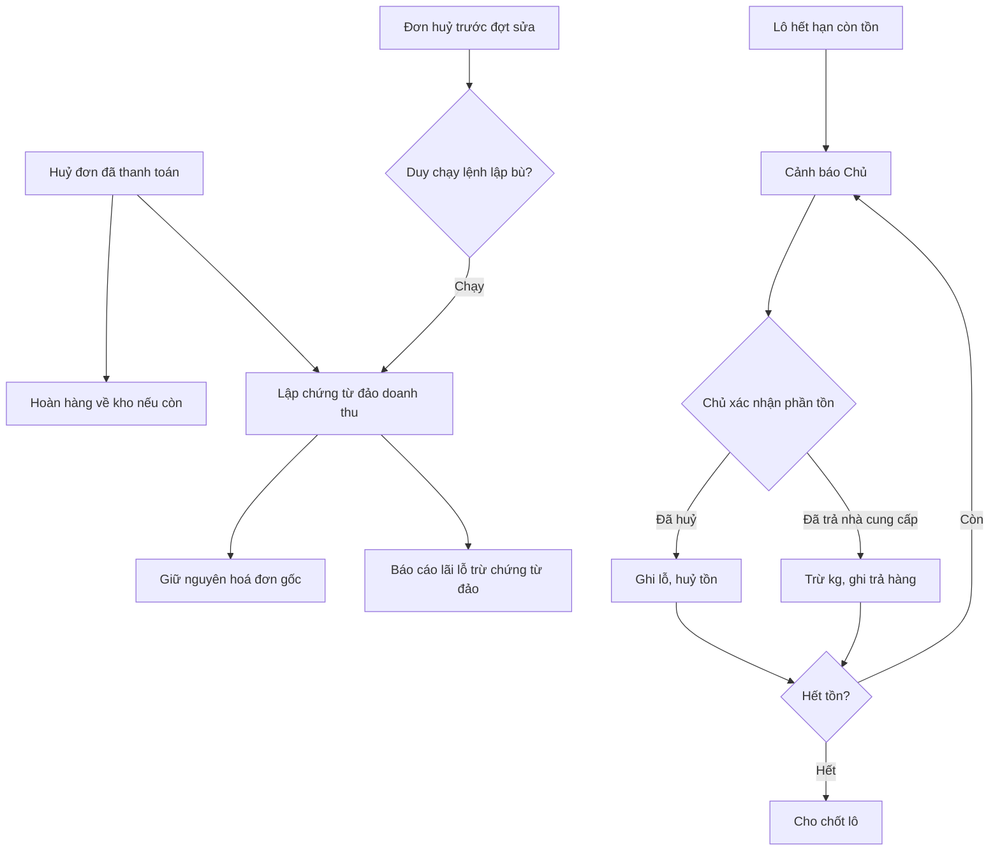

# Thiết kế kỹ thuật — P8 Sửa lỗi review P1–P7
> Claude (Tech Lead) · 2026-09-30 · Trạng thái: **ĐÃ DUYỆT (Duy 30/09)**
> Story: `02-stories.md` (SR-01…SR-24) · Giao việc: `02c-giao-viec.md` · Nhánh `main`.
> Nguồn lỗi: `doc/features/2026-09-30-review-p1-p7/*.md`. Số dòng trích theo `main` @ `5372c83`; dev đọc lại trước khi sửa.



## 0. Tóm tắt
- 7 lô, tuần tự. Lô 1–5 chặn deploy staging. Hai migration duy nhất: `sales` (Lô 4, chứng từ đảo doanh thu) và `inventory` (Lô 5, trả NCC +
  choice sổ kho). Không thêm quyền Tầng 2 mới, không data migration gán Group.
- Mọi lỗi có test tái hiện chạy **đỏ trước khi sửa**. R1–R6 (scratchpad review) thành test chính thức ở đường dẫn §7.
- Không lật `doc/decisions.md`. Đổi BR có sẵn: BR-HT-06, BR-BC-03, BR-BC-04, BR-LO-04, E-10 (Duy duyệt 30/09). BR mới: BR-HT-10, BR-LO-07,
  BR-MH-08. Văn bản chính xác ở §4.6 và §5.6.

---

## 1. Lô 1 — chặn deploy

### 1.1 SR-01 (BM-01) — `COST_KEYS`
- `backend/apps/common/cost_keys.py`: thêm vào `COST_KEYS`: `loss_amount`, `loss`, `inventory_value`, `margin`, `gross_profit`, `expired_cost`,
  `supplier_refund_amount`, `supplier_return_cost`. (Giá **bán** không bao giờ dùng các tên này — giữ quy ước docstring.)
- Không đổi `cancel_expired_batch` (vẫn ghi `loss_amount` — Chủ cần thấy). Lọc là ở `redact_cost` khi trả ra.
- Test mới `backend/apps/accounts/audit/tests/test_p8_cost_keys_scan.py`: dựng lô số giả → chạy các service ghi audit liên quan tiền
  (`cancel_expired_batch`, `close_batch`, `recompute_landed_cost`; Lô 5 thêm `return_batch_to_supplier`) → `quan_ly` GET → duyệt đệ quy
  `changes`, assert không khoá nào ∈ `COST_KEYS` và JSON không chứa số giá vốn mẫu. `chu` thấy `loss_amount`.

### 1.2 SR-02 — `npm ci` của `erp-console`
- Nguyên nhân: `vitest@5.0.2` khai peerOptional `@types/node: ^22 || >=24`; repo ghim `@types/node ^20.14.0`. Runtime là Node 22 (`node -v` = 22.x).
- Sửa: `erp-console/package.json` → `"@types/node": "^22.0.0"`; chạy `npm install` **không** cờ legacy để sinh lại `package-lock.json`; rồi
  `rm -rf node_modules && npm ci` phải sạch. Kiểm `frontend/` bằng `npm ci` (không sửa gì nếu đã sạch; nếu cũng lỗi peer thì áp cùng cách, ghi
  vào dev notes).
- Không nâng `next`, `react`, `typescript`, `vitest`, `vite`. Nếu `tsc` báo lỗi type mới do `@types/node` 22 → sửa type tối thiểu, ghi file:dòng.

### 1.3 SR-03 (F01) — AI chốt lô & job
- `backend/apps/ai/execution/safety.py:100-116`: `payment_transaction__order_id__in` → `payment_transaction__sales_order_id__in`;
  `PaymentTransaction.objects.filter(order_id__in=…)` → `sales_order_id__in`. Đọc lại toàn file tìm lookup `order` sai tương tự.
- `backend/apps/ai/management/commands/run_due_ai_actions.py`: bọc **thân mỗi việc** bằng
  ```python
  for act in due_actions:
      try:
          _process_one(act)          # tách phần thân hiện có (atomic + skip_locked) ra hàm riêng
      except Exception as exc:       # noqa: BLE001 — cô lập poison pill
          _mark_failed(act.pk, exc)  # atomic riêng: SCHEDULED -> FAILED, downgrade_reason={"code":"AI_JOB_ERROR","text":"Lỗi hệ thống khi thực hiện, cần Chủ xem."}
          logger.warning("AI job failed action=%s cmd=%s err=%s", act.pk, act.command, type(exc).__name__)
  ```
  `_mark_failed` chỉ đổi khi việc vẫn `SCHEDULED` (đọc lại có khoá) → chạy lại không đụng việc đã `FAILED`. Bước "đẩy việc quá hạn 2 giờ" đặt
  sau vòng lặp và cũng bọc try riêng. Ghi AuditLog `fail_<command>` `actor=None, actor_kind="ai"` không có `changes`.
- Không log `str(exc)` (có thể chứa dữ liệu từ DB).

## 2. Lô 2 — PII & phạm vi

### 2.1 SR-04 (BM-02) — lọc PII của AI
- `backend/apps/ai/policy/rules.py` `SCRUB_PII_KEYS` thêm: `customer`, `recipient_phone`, `recipient_phone_masked`, `phone_last4`,
  `phone_masked`, `customer_address`. `scrub_data` với khoá thuộc tập này **bỏ cả nhánh** (dict/list/chuỗi) — kiểm hàm hiện tại đã làm vậy
  chưa; nếu chỉ bỏ giá trị chuỗi thì sửa để bỏ cả nhánh.
- Không chuyển sang allowlist ở P8 (rủi ro hồi quy lớn) — ghi "để sau". Bù bằng test quét có sentinel (SR-04-AC3).
- Test quét: sửa test quét registry hiện có (`backend/apps/ai/registry/tests/test_registry_invariants.py` hoặc file quét PII tương ứng — dev
  tìm test đang gọi mọi lệnh list) để: gọi cả lệnh `*.retrieve` với `target_id` của fixture; sentinel PII: tên "Khách Giả Bí Mật", SĐT
  `0900000123`, địa chỉ "Số 1 Đường Giả", tên người chuyển trong `raw_payload` "NGUYEN VAN GIA"; assert `retrieve_ok_count > 0`.

### 2.2 SR-05 (BM-06) — suy luận `detail`
- `backend/apps/ai/registry/discovery.py:212`: `is_detail = True` khi `action_name in ("retrieve", "partial_update", "update", "destroy")`;
  ngược lại giữ `getattr(action_func, "detail", False)`; APIView (không ViewSet) theo pattern `<pk>|<id>|<str:|<int:`.
- `backend/apps/ai/execution/pipeline.py:155-181` (bước 6): nếu view không có `get_object` (APIView như `BatchPnlView`) → kiểm phạm vi bằng
  cách dispatch GET chi tiết của chính view đó; 404/403 → trả `NOT_FOUND`/`PERMISSION_DENIED`; không bao giờ `AttributeError`. Cách đơn giản
  hơn được chấp nhận: spec APIView có `detail=True` nhưng không có `get_object` → bỏ bước 6 và để view tự kiểm (BatchPnlView đã kiểm quyền
  Chủ); kèm test SR-05-AC4.
- **Thứ tự commit**: SR-04 trước hoặc cùng commit với SR-05 (SR-05 mở `retrieve` → nếu SR-04 chưa có sẽ lộ `customer.name`).

### 2.3 SR-06 (BM-03) — phạm vi đơn dùng chung
- Tách từ `SalesOrderViewSet.get_queryset` (`backend/apps/sales/orders/api.py:93-…`) thành
  `apps/sales/orders/scope.py::scope_orders_for(user, qs) -> QuerySet` (dựa trên `has_full_delivery_scope`, phạm vi `assigned` của `nv_giao`,
  phạm vi `cskh_note_q`). `get_queryset` gọi hàm này (không đổi hành vi — test cũ xanh nguyên).
- `backend/apps/sales/orders/next_steps.py:179-182` (guidance order) và `backend/apps/ai/actions/services.py:299-302` (escalate) thay khối lọc
  riêng bằng `scope_orders_for`. Ngoài phạm vi → `Http404` (body chung "Không tìm thấy đơn hàng").

### 2.4 SR-07 (BM-04) — nháp Nhập lô (FE)
- `erp-console/features/purchasing/components/NhapLoForm.tsx`: tách `draftStorage.ts` (cùng thư mục) gồm `saveDraft(userId, draft)`,
  `loadDraft(userId)`, `clearAllDrafts()`. `saveDraft` bỏ `lines[].rate` trước khi ghi; dùng `sessionStorage`; khoá `cave_draft_nhap_lo:<userId>`.
- Đăng xuất (`erp-console/features/auth/…` hàm logout hiện có): gọi `clearAllDrafts()` — xoá cả khoá cũ `cave_draft_nhap_lo` ở `localStorage`.
- Idempotency key không lưu trong nháp; sinh mới mỗi lần mở form/sau gửi thành công.
- Test vitest `draftStorage.test.ts` + Playwright SR-07-AC3.

## 3. Lô 3 — tiền & kho

### 3.1 SR-08 (F02)
- `backend/apps/inventory/batches/services.py` `check_cancel_expired_batch`: thêm (sau kiểm EXPIRED) `qty_reserved > 0` → `Missing("BR-LO-07",
  f"Còn {qty} kg đang giữ chỗ của {n} đơn — chờ đơn thanh toán hoặc hết hạn giữ chỗ rồi huỷ.")`, `n` = số đơn BOOKED tham chiếu lô (tái
  dùng truy vấn đơn mở của `check_close_batch` — tách hàm `_open_orders_count(batch, statuses)`).
- `cancel_expired_batch` đã gọi `check_…` sau `select_for_update` → giữ.
- Không tự nhả giữ chỗ/huỷ đơn khách (đã chọn "chặn"). Giữ chỗ tự hết theo TTL `SALES_ORDER_TTL_MINUTES`.

### 3.2 SR-09 (F03)
- `backend/apps/delivery/cskh/services.py` `record_call` (sau khi khoá phiếu → task, đọc lại):
  - `task.state == REFUND_CALL` và `result ∉ {UNREACHABLE, NOTIFIED}` → `BusinessError("Đơn đã bị huỷ — tải lại màn hình.", code="STALE_STATE", status_code=409)`.
  - `note.status == CANCELLED` và task không phải `REFUND_CALL` → cùng lỗi 409.
- FE `erp-console/features/cskh/…`: nhận 409 `STALE_STATE` → hiện `detail` + nút "Tải lại" (nếu màn đã xử lý lỗi chung bằng `detail` thì chỉ
  cần thêm nút tải lại). Không đổi contract khác.

### 3.3 SR-10 (F05)
```python
@transaction.atomic
def publish_batch(*, batch, actor):
    b = Batch.objects.select_for_update().get(pk=batch.pk)
    if b.status != Batch.Status.DRAFT:
        raise BusinessError("Chỉ publish được lô đang ở trạng thái Nháp.", code="BR-MH-05")
    ...
    return b
```
Kiểm `cancel_receipt` đã khoá lô bằng `select_for_update` (theo review: có) → hai phía cùng khoá dòng lô, đúng một bên thắng.

### 3.4 SR-11 (F06)
- `backend/apps/sales/payments/auto_confirm.py` `_escalate_to_chu`: `get_or_create` theo khoá hiện có; nếu `not created` và
  `action.status ∈ {REJECTED, DONE, CANCELLED, EXPIRED, UNDONE, FAILED}` → return (không đổi). Ghi audit chỉ khi `created` hoặc
  `downgrade_reason["code"]` đổi. Chỉ quét `match_status=UNMATCHED`.

## 4. Lô 4 — Chứng từ đảo doanh thu (F04)

### 4.1 Kiến trúc
```
cancel_paid_order (atomic, đã khoá đơn)                 ← API huỷ tay + cskh auto_cancel_overdue + cskh decide (mọi đường huỷ đơn đã TT)
   ├─ hoàn kho CANCEL_RESTORE (như cũ, khi hàng còn ở kho)
   ├─ credit_notes.services.issue_cancel_credit_note(invoice, …)   ← MỚI, cùng transaction
   └─ đơn → CANCELLED, phiếu giao → CANCELLED, audit (như cũ)
reports.services.batch_pnl / period_pnl, dashboard_api.revenue_today   ← trừ chứng từ đảo
```
Module mới `backend/apps/sales/credit_notes/` (`services.py`, `README.md`, `tests/`). Không có API/serializer mới (không cần màn riêng);
hiển thị qua timeline đơn và Admin chỉ đọc.

### 4.2 Model (migration `sales/00xx_salescreditnote.py`)
`backend/apps/sales/models/credit_notes.py` (re-export ở `models/__init__.py`):
```python
class SalesCreditNote(models.Model):
    """Chứng từ đảo doanh thu (BR-HT-10). Append-only, Hệ thống lập. Không sửa/xoá hoá đơn gốc."""
    class Kind(models.TextChoices):
        CANCEL_ORDER = "CANCEL_ORDER", "Huỷ đơn đã thanh toán"
    code = models.CharField("Mã chứng từ", max_length=40, unique=True)          # "DC-<mã hoá đơn>"
    source_key = models.CharField("Khoá nguồn (chống trùng)", max_length=64, unique=True)  # "cancel:<order.pk>"
    kind = models.CharField(max_length=16, choices=Kind.choices, default=Kind.CANCEL_ORDER)
    sales_invoice = models.ForeignKey(SalesInvoice, on_delete=models.PROTECT, related_name="credit_notes")
    issued_at = models.DateTimeField("Thời điểm ghi nhận (kỳ đảo)")
    amount = models.DecimalField("Số tiền đảo", max_digits=14, decimal_places=2)   # = invoice.amount khi huỷ cả đơn
    stock_restored = models.BooleanField("Đã hoàn kho lúc huỷ")
    reason_code = models.CharField(max_length=32, blank=True)
    backfilled = models.BooleanField("Lập bù (SR-14)", default=False)
    created_by = models.ForeignKey(settings.AUTH_USER_MODEL, on_delete=models.PROTECT, null=True, blank=True, related_name="+")
    created_at = models.DateTimeField(auto_now_add=True)
    class Meta:
        default_permissions = ("view",)           # BR-PQ-11: không add/change/delete
        ordering = ["-issued_at", "-id"]
        indexes = [models.Index(fields=["issued_at"])]

class SalesCreditNoteLine(models.Model):
    credit_note = models.ForeignKey(SalesCreditNote, on_delete=models.CASCADE, related_name="lines")
    invoice_line_batch = models.ForeignKey(SalesInvoiceLineBatch, on_delete=models.PROTECT, related_name="+")
    batch = models.ForeignKey("inventory.Batch", on_delete=models.PROTECT, related_name="credit_note_lines")
    qty = models.DecimalField("Số kg đảo", max_digits=12, decimal_places=3)
    rate = models.DecimalField("Đơn giá bán (đ/kg)", max_digits=14, decimal_places=2)   # từ SalesInvoiceLine.rate
    amount = models.DecimalField("Thành tiền đảo", max_digits=14, decimal_places=2)     # qty × rate
    unit_cost = models.DecimalField("Giá vốn ảnh chụp (đ/kg)", max_digits=14, decimal_places=4)  # NHẠY CẢM, = silb.unit_cost
    class Meta:
        default_permissions = ("view",)
```
Lý do thêm schema (bất biến 8): Duy cấm đổi/xoá hoá đơn gốc; cần chứng từ riêng giữ lịch sử và cho phép tính theo kỳ/lô. Không thêm field
cá nhân. `unit_cost` nhạy cảm — không serializer nào trả; Admin chỉ đọc, ẩn `unit_cost` với user thiếu `view_costprice` (theo mẫu
`common/admin.py`).

### 4.3 Service
```python
# apps/sales/credit_notes/services.py
def issue_cancel_credit_note(*, invoice, actor, reason_code, stock_restored, at=None, backfilled=False):
    """BR-HT-10. Gọi TRONG transaction của cancel_paid_order. Idempotent theo source_key."""
    key = f"cancel:{invoice.sales_order_id}"
    existing = SalesCreditNote.objects.filter(source_key=key).first()
    if existing: return existing
    if invoice.status != SalesInvoice.Status.ISSUED:
        raise BusinessError("Hoá đơn không còn hiệu lực — không lập chứng từ đảo.", code="BR-HT-10")
    cn = SalesCreditNote.objects.create(code=f"DC-{invoice.code}", source_key=key, sales_invoice=invoice,
                                        issued_at=at or timezone.now(), amount=invoice.amount, ...)
    for line in invoice.lines.all():
        for silb in line.batch_allocations.all():
            SalesCreditNoteLine.objects.create(credit_note=cn, invoice_line_batch=silb, batch_id=silb.batch_id,
                qty=silb.qty, rate=line.rate, amount=silb.qty * line.rate, unit_cost=silb.unit_cost)
    record_audit("issue_credit_note", actor=actor, obj=invoice.sales_order,
                 changes={"credit_note": cn.code, "amount": cn.amount})    # amount = giá bán, không khoá giá vốn
    return cn
```
- `cancel_paid_order` (`backend/apps/sales/orders/services.py:332-402`): gọi ngay sau khối hoàn kho, trong cùng `with transaction.atomic()`.
  Sửa docstring: "Doanh thu đảo bằng chứng từ đảo (BR-HT-10) tại thời điểm huỷ; phiếu hoàn chỉ là dòng tiền".
- Đơn chưa có `SalesCreditNote` với `code` trùng (hoá đơn đã từng có chứng từ vì lý do khác) — hiện chỉ có một kind nên `code` unique đủ.
- Timeline: `backend/apps/sales/orders/timeline.py` thêm sự kiện từ `invoice.credit_notes` (`SYSTEM` hoặc người huỷ):
  "Lập chứng từ đảo doanh thu DC-… ({vnd_display(amount)})".

### 4.4 Báo cáo
- `batch_pnl`:
  ```
  gross_rev, gross_qty  = Σ alloc (hoá đơn ≠ CANCELLED)  qty×rate, qty        # như cũ
  rev_rev,   rev_qty    = Σ SalesCreditNoteLine(batch=lô, credit_note.sales_invoice.status=ISSUED) amount, qty
  revenue  = gross_rev − rev_rev ;  qty_sold = gross_qty − rev_qty
  ```
  Thêm khoá trả về `reversed_qty`, `reversed_revenue` (giá bán, không nhạy cảm; endpoint vẫn chỉ Chủ). Kg hoàn về kho rồi bán lại tạo `alloc`
  mới → chỉ cộng một lần vì phần cũ đã bị trừ.
- `period_pnl(year, month)`:
  ```
  revenue       = Σ invoice(ISSUED, issued_at ∈ kỳ).amount − Σ credit_note(issued_at ∈ kỳ, invoice ISSUED).amount
  cogs          = Σ alloc cost (hoá đơn trong kỳ)            − Σ cn_line.qty × cn_line.unit_cost (cn issued_at ∈ kỳ)
  refunds       = Σ Refund(REFUNDED, confirmed_at ∈ kỳ, sales_invoice ≠ null, sales_invoice KHÔNG có credit_notes).amount
  profit        = revenue − cogs − refunds
  ```
  Khoá mới trả về: `credit_notes` (tổng tiền đảo trong kỳ), `cogs_reversed`. Ghi chú 🟡: đảo giá vốn cho **mọi** dòng chứng từ (kể cả
  `stock_restored=false`) vì hàng về lại vựa (P-08 nhập lại → bán lại có giá vốn mới; huỷ bỏ → lỗ nằm ở `batch_pnl`). `period_pnl` chưa tính
  lỗ hỏng/hết hạn — "để sau".
- `dashboard_api.py` `revenue_today` = Σ hoá đơn ISSUED hôm nay − Σ `SalesCreditNote.amount` `issued_at__date=today`.

### 4.5 SR-14 backfill
`backend/apps/sales/management/commands/backfill_credit_notes.py`: tìm `SalesOrder(status=CANCELLED, invoice__status=ISSUED,
invoice__credit_notes__isnull=True)`. Mặc định dry-run in: số đơn, mã đơn, mã hoá đơn, số tiền bán, mã lô `CLOSED` bị ảnh hưởng. `--apply`:
mỗi đơn một `atomic`, `issue_cancel_credit_note(..., at=<created_at của AuditLog cancel_paid_order mới nhất của đơn> or order.created_at,
backfilled=True, actor=None, stock_restored=<changes.stock_restored của audit, mặc định True>)`. Không in PII, không in giá vốn.

### 4.6 Văn bản BR (dev chép vào `doc/business-process-spec.md` ở Lô 4)
- **BR-HT-06** *(sửa 2026-09-30, Duy duyệt 30/09)*: Huỷ đơn đã thanh toán → Hệ thống lập **chứng từ đảo doanh thu** (BR-HT-10) ngay lúc
  huỷ; doanh thu và giá vốn của đơn được đảo vào **kỳ phát sinh huỷ**, không sửa kỳ cũ. Phiếu hoàn chỉ ghi tiền rời tài khoản: phiếu hoàn của
  hoá đơn đã có chứng từ đảo **không** trừ doanh thu lần nữa; phiếu hoàn của hoá đơn chưa có chứng từ đảo (hoàn một phần, hoàn sau giao) vẫn
  trừ vào kỳ xác nhận hoàn. *(Lý do: hoá đơn gốc giữ nguyên để giữ lịch sử; trước đây đơn huỷ vẫn tính doanh thu lô.)*
- **BR-HT-10** *(mới, Duy duyệt 30/09)*: Chứng từ đảo doanh thu là chứng từ riêng, append-only, do Hệ thống lập trong cùng giao dịch với huỷ
  đơn (kể cả job tự huỷ CSKH), gắn hoá đơn gốc; hoá đơn gốc giữ nguyên `ISSUED`. Mỗi dòng = lô + kg + đơn giá bán lấy từ phân bổ lô của hoá
  đơn (BR-BH-06). Mỗi hoá đơn tối đa một chứng từ huỷ.
- **BR-BC-03** thêm câu: "Chứng từ đảo doanh thu ghi vào kỳ lập chứng từ (BR-HT-06)."
- **BR-BC-04** thay câu "Doanh thu (và số kg đã bán) chỉ lấy từ hoá đơn chưa huỷ" bằng: "Doanh thu (và số kg đã bán) = phân bổ lô của hoá đơn
  chưa huỷ **trừ** dòng chứng từ đảo doanh thu của lô *(sửa 2026-09-30, Duy duyệt 30/09)*; kg hoàn về kho rồi bán lại chỉ tính một lần."
  (Phần tiền NCC hoàn thêm ở Lô 5, §5.6.)
- Bảng "Lãi lỗ theo lô" (dòng ~461) cập nhật tương ứng.

## 5. Lô 5 — Lô quá hạn + dashboard (F09)

### 5.1 Quy trình (BR-LO-07)
```
Lô SELLING/NEAR_EXPIRY ──(job hạn)──► EXPIRED (còn tồn) ──► cảnh báo: Cần chú ý (Chủ) + Tiếp theo trên lô
      Chủ xác nhận phần tồn (có thể nhiều lần, kết hợp):
        • "Đã huỷ"  → POST …/cancel-expired/  (DW-06: WRITE_OFF toàn bộ tồn, ghi lỗ, → CANCELLED)
        • "Đã trả NCC" → POST …/return-to-supplier/ (SUPPLIER_RETURN −kg, tiền NCC hoàn tuỳ chọn, lô vẫn EXPIRED)
      Chặn khi còn giữ chỗ (SR-08). Tồn = 0 → bước "Chốt lô" mở (BR-LO-04).
```

### 5.2 Model & migration (`inventory/00xx_batchsupplierreturn.py`)
- `StockLedgerEntry.MovementType` thêm `SUPPLIER_RETURN = "SUPPLIER_RETURN", "Trả nhà cung cấp"` (AlterField choices, `max_length` 16 đủ: 15 ký tự).
- `backend/apps/inventory/models/batches.py` (hoặc file mới `supplier_returns.py`, re-export):
```python
class BatchSupplierReturn(models.Model):
    """Trả lại NCC phần tồn lô quá hạn (BR-MH-08). Append-only, qua service. 🟡 PA: NCC hoàn tiền ngoài hệ thống, chỉ ghi sổ."""
    batch = models.ForeignKey(Batch, on_delete=models.PROTECT, related_name="supplier_returns")
    qty = models.DecimalField(max_digits=12, decimal_places=3, validators=[MinValueValidator(Decimal("0.001"))])
    supplier_refund_amount = models.DecimalField(max_digits=14, decimal_places=2, default=Decimal("0"),
                                                 validators=[MinValueValidator(Decimal("0"))])   # NHẠY CẢM
    note = models.CharField(max_length=500, blank=True)
    request_id = models.UUIDField(null=True, blank=True, unique=True)
    created_by = models.ForeignKey(settings.AUTH_USER_MODEL, on_delete=models.PROTECT, related_name="+")
    created_at = models.DateTimeField(auto_now_add=True)
    class Meta:
        default_permissions = ("view",)
```
Quyền: **dùng lại** `inventory.cancel_expired_batch` (Chủ) cho cả hai xác nhận — cùng bản chất "xử lý phần tồn lô quá hạn, đổi con số lời lỗ"
(ranh giới BR-PQ: việc làm đổi lời lỗ thuộc Chủ). Không thêm quyền, không migration Group.

### 5.3 Service (`backend/apps/inventory/batches/services.py`)
```python
def check_process_expired_stock(batch) -> list[Missing]:     # dùng chung cho cancel_expired + return_to_supplier
    # EXPIRED? (BR-LO-07) · is_closed? (BR-LO-05) · qty_reserved>0? (BR-LO-07, SR-08) · qty_available>0? (BR-LO-07 "Lô không còn tồn")
@transaction.atomic
def return_batch_to_supplier(*, batch, qty, supplier_refund_amount, note, request_id, actor):
    # 1. request_id trùng → trả bản ghi cũ (không trừ lần 2)
    # 2. select_for_update lô → check_process_expired_stock → 0 < qty ≤ qty_available (BR-MH-08) → refund ≥ 0 Decimal
    # 3. BatchSupplierReturn.create → stock.record_movement(SUPPLIER_RETURN, -qty, reference=f"supplier_return SR-{id}")
    # 4. record_audit("return_batch_to_supplier", changes={"qty": qty, "supplier_refund_amount": amount})  # amount ∈ COST_KEYS
```
- `check_cancel_expired_batch` = `check_process_expired_stock` nhưng **cho phép** tồn 0 (huỷ lô tồn 0 vẫn hợp lệ để kết thúc) — giữ hành vi DW-06.
- `cancel_expired_batch(..., confirm_qty=None)`: nếu `confirm_qty` có và `!= qty_available` → 400 BR-LO-07 "Tồn đã đổi (x kg) — tải lại."
- `check_close_batch` (`:170-173`): bỏ ngoại lệ — `if batch.qty_available > ZERO: missing BR-LO-04`. Hàm `check_ai_close_batch_conditions` dùng
  lại `check_close_batch` nên tự đúng.
- `next_steps.py` (lô): EXPIRED còn tồn → `cancel_expired` + `return_to_supplier` (`command="inventory.batch.return_to_supplier"`, who Chủ,
  `missing` từ `check_process_expired_stock` + quyền) + `close` (`allowed=false`); EXPIRED tồn 0 → `close`. Bỏ điều kiện
  `batch.status != EXPIRED` ở bước 4.

### 5.4 API
```
POST /api/inventory/batches/<pk|batch_id>/return-to-supplier/        Chủ (inventory.cancel_expired_batch), Tầng 1 BusinessModelPermissions
Request  {"qty": "3.000", "supplier_refund_amount": "150000", "note": "", "request_id": "6f1c…"}
200      {"batch_id": "LO-…", "status": "EXPIRED", "qty_available": "2.000", "returned_qty": "3.000", "return_id": 12}
400      {"code": "BR-MH-08", "detail": "Số kg trả phải lớn hơn 0 và không vượt tồn 5,000 kg."}
400      {"code": "BR-LO-07", "detail": "Chỉ xác nhận trả NCC cho lô Quá hạn còn tồn."}
400      {"code": "BR-LO-07", "detail": "Còn 2,000 kg đang giữ chỗ của 1 đơn — …"}
400      {"code": "BR-LO-05", "detail": "Lô đã chốt."}

POST /api/inventory/batches/<pk>/cancel-expired/     (có sẵn) body tuỳ chọn {"confirm_qty": "3.000"}; response không đổi (BatchSerializer)

GET  /api/dashboard/attention/                        thêm khoá "expired_batches_open": 2 cho user có inventory.cancel_expired_batch;
                                                      điều kiện 403 = không có quyền nào trong 4 quyền (3 cũ + quyền này)
```
- Action khai `required_perms=("inventory.cancel_expired_batch",)`, `custom_perm_actions` thêm `"return_to_supplier"`,
  `ai=AiMeta(keywords=("tra_ncc", "trả nhà cung cấp"), max_level="C")`. Input serializer tường minh (`qty`, `supplier_refund_amount`, `note`,
  `request_id`). Response **không** trả tiền.
- `note`: chặn dãy số dài bằng `has_long_digit_run` (như CSKH) — tránh nhập SĐT.

### 5.5 `batch_pnl` (Lô 5, cùng hàm Lô 4 đã sửa)
- `supplier_return_qty = Σ supplier_returns.qty`; `supplier_refund_amount = Σ supplier_returns.supplier_refund_amount`;
  `total_cost = purchase_cost + allocated_cost − supplier_refund_amount`.
- **F11**: `expired_qty` chỉ đếm `WRITE_OFF` có `reference` bắt đầu `"cancel_expired_batch "` (reference đang ghi ở `cancel_expired_batch`);
  `WRITE_OFF` của huỷ phiếu nhập (`"cancel_purchase_receipt …"`) không đếm. Không migration.
- 🟡 Không tính lại `landed_unit_cost` khi NCC hoàn tiền (tránh làm lệch giá vốn ảnh chụp của các hoá đơn đã bán); tiền NCC hoàn chỉ giảm
  `total_cost` của lô. `period_pnl` chưa phản ánh tiền NCC hoàn ("để sau").

### 5.6 Văn bản BR (dev chép vào spec ở Lô 5)
- **BR-LO-04** *(sửa 2026-09-30, Duy duyệt 30/09)*: Chốt lô yêu cầu **tồn = 0**, Purchase Invoice đã có, không còn đơn đang mở tham chiếu lô.
  Lô Quá hạn còn tồn phải xử lý hết phần tồn (BR-LO-07) trước khi chốt — bỏ ngoại lệ tạm thời "chốt thẳng lô Quá hạn" của S04.
- **BR-LO-07** *(mới, Duy duyệt 30/09)*: Lô Quá hạn còn tồn → hệ thống **cảnh báo** (Cần chú ý, Tiếp theo). Chủ xác nhận phần tồn là **Đã huỷ**
  (BR-LO-03, ghi lỗ) hoặc **Đã trả NCC** (BR-MH-08), được chia nhiều lần. Không xác nhận khi lô còn giữ chỗ. Số kg xác nhận phải khớp tồn đang
  hiển thị.
- **BR-MH-08** *(mới, PA, Duy duyệt 30/09)*: Trả NCC phần tồn lô Quá hạn: ghi số kg (xuất kho `SUPPLIER_RETURN`) và số tiền NCC hoàn nếu có;
  tiền NCC hoàn giảm tổng chi phí lô (BR-BC-04). Giả định: mua tại cảng trả tiền ngay (decisions 10/09), việc NCC hoàn tiền là thoả thuận
  ngoài hệ thống, hệ thống chỉ ghi sổ.
- **BR-BC-04** thêm: "Tổng chi phí lô = giá mua + chi phí phân bổ − tiền NCC hoàn (BR-MH-08). Kg trả NCC hiện riêng."
- **E-10**: "Lô quá hạn còn tồn | Loại khỏi bán ngay, cảnh báo, Chủ xác nhận Đã huỷ (ghi lỗ) hoặc Đã trả NCC | BR-LO-02/03/07, BR-MH-08".

### 5.7 SR-17 dashboard
- `backend/apps/reports/dashboard_api.py:79-87`: bỏ `customer`, `phone_last4`, bỏ `select_related("customer")`. Không phân nhánh theo nhóm.
- FE `erp-console/features/overview/`: bỏ cột "Khách" ở `OverviewScreen.tsx:101`, `api.ts:24` bỏ `o.customer` khỏi `matches`, `types.ts` bỏ
  field, `mock.ts` bỏ tên. Test vitest `overview.test.ts` cập nhật.

### 5.8 FE Lô 5 (`erp-console/features/inventory/`, `features/overview/`)
- `BatchDetailSheet.tsx`: vẽ nút theo `next_steps` (đã có cơ chế). Thêm form "Đã trả NCC" (kg `inputMode="decimal"`, tiền NCC hoàn tuỳ chọn,
  ghi chú), `request_id = crypto.randomUUID()` sinh khi mở form; "Đã huỷ" gửi `confirm_qty` = tồn đang hiển thị, dialog xác nhận nêu số kg.
- Khối Cần chú ý (overview): thẻ `expired_batches_open` → link `/inventory/?status=EXPIRED`.
- `api.ts` + `mock.ts` + `types.ts` theo contract §5.4. Không hiển thị tiền NCC hoàn sau khi lưu (không có trong response).

## 6. Lô 6 — CMS/FE

### 6.1 SR-18 (F1)
- `backend/apps/content/entries/services.py:157` và `backend/apps/content/body/sanitize.py:170`: khi `entry is None` (tạo), mọi `cover_image`
  hoặc khối `image` → `BusinessError(..., code="BR-ND-07")` "Tải ảnh sau khi lưu nháp lần đầu.". Khi có `entry`: ảnh phải `entry_id=entry.pk`.
- `backend/apps/content/public/serializers.py:43` (`public_body`) và ảnh bìa công khai: lọc thêm `entry_id=version.entry_id`; không khớp → bỏ
  khối/`null`.
- FE ERP: nếu màn soạn cho chèn ảnh khi chưa lưu → khoá nút chèn ảnh tới khi có `id` (kiểm hiện trạng; thường đã như vậy vì upload cần id).

### 6.2 SR-19 (F3)
- `erp-console/app/(console)/content/edit/page.tsx:73-74`: đọc `version` từ query; có `version` → mở panel lịch sử ở phiên bản đó (CMS-11,
  `GET /api/content/entries/<id>/versions/<n>/`) ở chế độ **chỉ đọc**, tiêu đề "Phiên bản N (khách đã đồng ý)". Không đổi BE.
- Mock `features/content/mock.ts` có bài chính sách 2 phiên bản để Playwright chạy không cần BE.

### 6.3 SR-20 (F4, F13)
- `erp-console/features/guidance/components/GuidancePanel.tsx`: bỏ import tĩnh `features/ai/runtime/engine`, `ai/commands/call`,
  `ai/actions/api`, `ai/api`. Tách `GuidanceAiActions.tsx` (nút "Để AI làm/Nhờ") nạp bằng `next/dynamic(() => import(...), { ssr: false })`,
  chỉ render khi context AI (cùng nguồn với `AiAssistantGate`) báo `ai_enabled && consented`. `GuidancePanel` không gọi `ai/status`; đọc trạng
  thái từ context gate (gate đã gọi khi cần).
- `features/ai/messages.ts`: tách chuỗi runtime (`wllamaMissing`…) sang `features/ai/runtime/messages.ts`.
- Script kiểm `erp-console/scripts/check-ai-chunks.mjs`: đọc `.next/app-build-manifest.json`, với 4 route liệt kê chunk, grep `new Worker|wllama|/call/`
  → exit 1 nếu có. Chạy trong điều kiện xong Lô 6.

### 6.4 SR-21 — QA
Spec Playwright đặt ở `frontend/e2e/` và `erp-console/e2e/` (dự án đang dùng script Python Playwright — giữ kiểu đó). Chạy với
`NEXT_PUBLIC_USE_MOCK=1` khi cần mock 409/404/503; ảnh chụp dùng dữ liệu mock.

## 7. Test tái hiện chính thức (R1–R6 → repo)
| Ca | File test chính thức | Kế thừa |
|---|---|---|
| R1a, R1b | `backend/apps/ai/execution/tests/test_p8_close_batch_sold.py` | `CloseBatchAiTests` (test_dw25) |
| R2 | `backend/apps/delivery/tests/test_p8_record_call_stale.py` | `CskhL3BaseTestCase` |
| R3 | `backend/apps/inventory/batches/tests/test_p8_publish_lock.py` | `CskhL3BaseTestCase` hoặc fixture batches |
| R4 | `backend/apps/sales/payments/tests/test_p8_auto_confirm_idempotent.py` | `CskhL3BaseTestCase` |
| R5 | `backend/apps/inventory/batches/tests/test_p8_cancel_expired_reserved.py` | `CskhL3BaseTestCase` |
| R6 | `backend/apps/sales/credit_notes/tests/test_p8_credit_note.py` + `backend/apps/reports/tests/test_p8_pnl_credit_note.py` | `CskhL3BaseTestCase` |
Mã nguồn R1–R6 do điều phối viên đính kèm khi giao lô (file ở scratchpad review, không nằm trong repo). Bỏ `print`, thay `assert`.

## 8. Rủi ro bắt buộc
| Rủi ro | Cơ chế chặn | Test bắt |
|---|---|---|
| Rò giá vốn qua audit (loss, tiền NCC hoàn) | `COST_KEYS` mở rộng; response trả NCC không có tiền | SR-01-AC3 quét; SR-16-AC6 |
| Rò giá vốn qua chứng từ đảo (`unit_cost`) | Không serializer/API; timeline chỉ giá bán; Admin ẩn theo quyền | SR-12-AC8 (quét JSON timeline 5 Group) |
| Rò PII qua AI (`customer`, retrieve mở lại) | SCRUB mở rộng + SR-04/SR-05 cùng commit + dashboard bỏ tên tại nguồn | SR-04-AC3 (retrieve_ok_count > 0), SR-17-AC1/AC2 |
| Rò PII qua guidance ngoài phạm vi | `scope_orders_for` dùng chung | SR-06 ma trận 5 Group |
| Giá mua lưu ở trình duyệt | bỏ `rate` khỏi nháp, sessionStorage theo user, xoá khi đăng xuất | SR-07-AC1/AC3 |
| Vượt quyền trả NCC | `required_perms` + `require_perm` + custom_perm_actions; AI trần C | SR-16 ma trận, SR-16-AC7 |
| Sửa/xoá chứng từ | Hoá đơn gốc không đổi; chứng từ đảo `default_permissions=("view",)`, không service sửa; sổ kho append-only | SR-12-AC1/AC7 |
| Mất tiền khách (thanh toán sau huỷ lô) | chặn huỷ khi giữ chỗ | SR-08-AC1/AC2 |
| Lãi lỗ đếm hai lần | trừ dòng chứng từ theo lô; loại phiếu hoàn của hoá đơn đã có chứng từ | SR-13-AC2/AC4 |
| Backfill đổi số lô đã chốt | dry-run mặc định, liệt kê lô CLOSED, Duy quyết `--apply` | SR-14-AC1/AC3 |
| Job không idempotent | `source_key` unique; FAILED không xử lý lại; DW-26 không mở lại | SR-12-AC4, SR-03-AC4, SR-11 |
| Deadlock (F08) | thứ tự khoá phiếu → task | SR-22 (đọc code + test tuần tự) |

**Đính chính V-DW1** (hồ sơ `2026-09-28-ai-digital-worker/02c`): staging cần `AI_PRODUCTION_READY=1` mới mở vùng đỏ/mức B/DW-26; production giữ
`AI_PRODUCTION_READY=0`, `AI_WRITE_LEVELS_ALLOWED=C`. Câu cũ "mở ở staging khi `AI_PRODUCTION_READY=false`" là sai; nguồn đúng là
`doc/ops/moi-truong.md` sau SR-24.

## 9. Thứ tự & lô
| Lô | Story | Ghi chú |
|---|---|---|
| 1 | SR-01, SR-02, SR-03 | Chặn deploy. Không migration. |
| 2 | SR-04 + SR-05 (cùng commit), SR-06, SR-07 | BE ∥ FE (SR-07 độc lập). |
| 3 | SR-08, SR-09, SR-10, SR-11 | BE (+ nút tải lại CSKH). |
| 4 | SR-12, SR-13, SR-14 | Migration `sales`. BE. |
| 5 | SR-15, SR-16, SR-17 | Migration `inventory`. BE ∥ FE (FE mock theo §5.4). |
| 6 | SR-18, SR-19, SR-20, SR-21 | BE ∥ FE; QA bù bằng chứng. |
| 7 | SR-22, SR-23, SR-24 | Low. |

## 10. Câu hỏi kỹ thuật
- 🔴 Không còn câu hỏi chặn (Duy đã quyết F04, F09, dashboard 30/09).
- 🟡 Giả định Duy lật được: (1) F02 chặn thay vì tự huỷ đơn giữ chỗ; (2) trả NCC có ô tiền, không tính lại `landed_unit_cost`; (3) dùng lại quyền
  `cancel_expired_batch` cho "Đã trả NCC"; (4) dashboard bỏ tên với mọi nhóm; (5) `period_pnl` đảo giá vốn mọi dòng chứng từ; (6) backfill
  `--apply` do Duy chạy sau khi xem dry-run.

## 11. Review code (điền khi review từng lô)
| Lô | Kết luận | Lỗi (file:dòng) |
|---|---|---|
| 1 | — | — |
