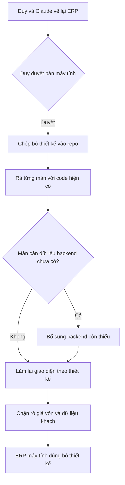

# Phân tích: làm lại giao diện ERP (máy tính) theo bộ thiết kế
> Claude (điều phối) · 2026-10-01 · Trạng thái: **ĐÃ DUYỆT** (Duy duyệt qua chat 01/10/2026: "ok làm cách 1… em làm hết đi", "chỉ duyệt erp cho máy tính")

## 1. Bối cảnh
Ngày 30/09–01/10/2026 Duy và Claude thiết kế lại toàn bộ giao diện ERP trên canvas Design
(https://claude.ai/code/artifact/ab9d37bb-9aba-449b-a71f-bccf97ca1f26). Bản ERP **máy tính** đã được duyệt và chép vào
repo ở `doc/design/erp/`. Tính năng này đưa `erp-console/` (và phần backend còn thiếu) về đúng bộ thiết kế đó.

## 2. Phạm vi
| Trong phạm vi | Ngoài phạm vi (chưa duyệt) |
|---|---|
| Mọi màn ERP máy tính trong `doc/design/erp/`: danh sách, chi tiết, form thêm/sửa, popup thao tác, trạng thái trống/tải/lỗi/thông báo | Shop (frontend khách mua), kể cả giỏ hàng dạng ngăn kéo |
| Menu trái mới theo nghiệp vụ, thanh trạng thái ở trang chi tiết, Trợ lý AI nằm trong từng màn | ERP trên điện thoại (bản nháp cũ `ERP-M*`) |
| Backend bổ sung **chỉ khi** màn thiết kế cần API mà backend chưa có (xem §5) | Đổi quy tắc nghiệp vụ, đổi enum database |

## 3. Quyết định Duy đã chốt (không lật lại)
1. **Trạng thái mỗi đối tượng = 1 bộ nhãn chuẩn**, chip không có chú thích bên trong; lý do/ghi chú để cột hoặc trường riêng.
2. **Mỗi ô/trường chỉ 1 giá trị**, không ghi chú xám chồng dưới thông tin khác (trừ "Tiếp theo" trong thanh trạng thái).
3. **Thời gian luôn đủ ngày giờ** `dd/mm/yyyy hh:mm`. Không "hôm nay/hôm qua".
4. **Không mã luật (BR-…), không thuật ngữ**: TTL, FEFO, hạch toán, thực thi, vùng đỏ, Mức A/B/C, NCC, NV, SĐT. Viết đầy đủ, thân thiện.
5. **Giá vốn chỉ một icon khoá nhỏ**, không câu giải thích. Không "cần người duyệt".
6. **Không nút làm mới.** Đăng xuất nằm trong menu avatar (Tài khoản của tôi / AI của tôi / Đăng xuất). Sidebar thu gọn được.
7. **AI không phải menu riêng**: danh sách có thanh "AI · Có n đề xuất…" + chip "AI đề xuất" trên dòng; trang chi tiết có khối "Trợ lý AI" (trước→sau, Từ chối/Đồng ý, ô chat). Trang chi tiết khách hàng **không** có AI.
8. **Chi tiết mở thành trang riêng**, không panel trượt phải. Trang chi tiết có thanh trạng thái (Tiếp theo / Đã làm) giống Chi tiết đơn.
9. **Thao tác theo trạng thái**: nút chính ở header; thao tác hiếm/bị chặn nằm trong menu "…", kèm lý do ngắn.
10. **Form ngắn là hộp thoại nổi trên đúng màn mở ra nó**; form dài là trang riêng có thanh nút cố định dưới.
11. **Menu theo nghiệp vụ**: Tổng quan · Bán hàng · Hàng hoá & kho · Kế toán · Website · Quản trị (chi tiết `doc/design/erp/README.md`).
12. **Mã chứng từ và trạng thái theo code/database** ("lấy code thôi, có gì sài đó"): mã đơn `SO<yymmdd>-<6 HEX>`, enum theo `TextChoices`. Bảng đối chiếu: `doc/design/erp/enum-map.md`.
13. **Xem khách hàng là một quyền** trong màn Phân quyền, mặc định Chủ + Quản lý.
14. **Số điện thoại trong ERP hiển thị đủ** (Duy yêu cầu 01/10). Bản thiết kế còn che "…0273" vì lý do kỹ thuật lúc vẽ; khi code thì hiển thị đủ cho người có quyền xem.

## 4. Nguồn sự thật
- Thiết kế: `doc/design/erp/*.dc.html` (HTML tĩnh, style inline: mở thẳng bằng trình duyệt để xem; icon/font cần mạng).
- Danh mục màn + đối chiếu route: `doc/design/erp/README.md`.
- Enum: `doc/design/erp/enum-map.md`. Luật nghiệp vụ: `doc/business-process-spec.md`, `doc/decisions.md`, skill `caveve-domain`.
- Khi thiết kế và code nghiệp vụ lệch nhau: **code/DB thắng về dữ liệu & trạng thái**, **thiết kế thắng về bố cục & wording**.

## 5. Backend còn thiếu cho thiết kế (đã rà 01/10)
| # | Việc | Màn cần | Mức |
|---|---|---|---|
| B1 | Gửi được dòng số đếm kiểm kê (serializer đang để dòng chỉ đọc) | Nhập số kiểm kê | Chặn màn Kiểm kê |
| B2 | Quyền `view_customer` ("Xem khách hàng"), API danh sách/chi tiết khách có số đơn, tổng mua, đơn huỷ | Khách hàng | Mới |
| B3 | Số liệu tổng hợp nhà cung cấp (số phiếu nhập, tổng tiền mua, lần nhập gần nhất) | Nhà cung cấp | Mới |
| B4 | Ma trận phân quyền đọc/ghi được qua API (nhóm × quyền), nếu chưa có | Phân quyền | Kiểm lại |
| B5 | Lý do giao thất bại: thêm trường lý do (Không gặp khách / Khách từ chối nhận / Sai địa chỉ / Hàng hư khi giao / Khác) + ghi chú | Báo giao thất bại | Mới. Duy duyệt làm trong đợt này (01/10) |
| B6 | Gán / đổi người giao cho phiếu giao (Quản lý, Chủ), kèm số phiếu đang giao của từng người | Giao cho người giao | Mới. Duy duyệt làm trong đợt này (01/10) |

Các màn còn lại đã có API (rà ngày 01/10, xem `02b-tech-design.md`).

## 6. Rủi ro phải chặn
- Rò giá vốn ở màn mới (Hoá đơn bán, Sổ nhập xuất, Nhà cung cấp, Hoá đơn mua & chi phí): serializer tách theo quyền, test bằng token nhân viên.
- Rò dữ liệu cá nhân: màn Khách hàng chỉ cho người có `view_customer`; không đưa dữ liệu khách vào AI, log, URL.
- Không xoá chứng từ; huỷ bằng trạng thái.
