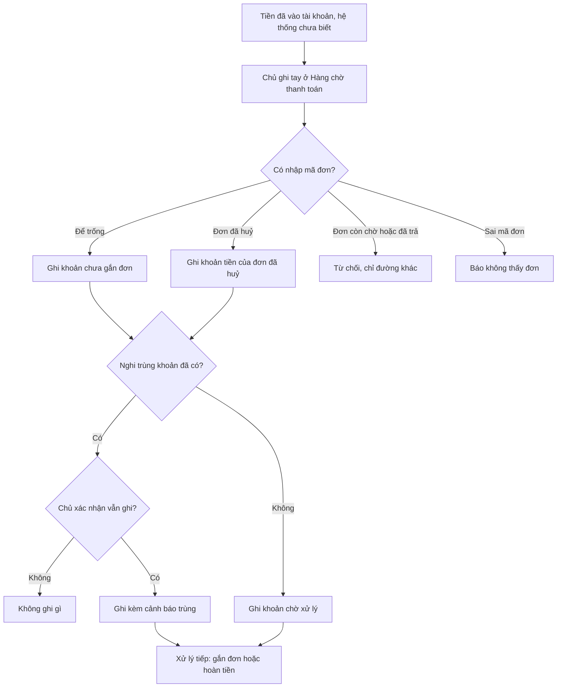

# 02d — Ghi tiền về muộn ở Hàng chờ thanh toán (TLA-M3 / #15)



Luồng: **NHANH**, có thiết kế trước vì việc này đụng tới tiền. Tech Lead viết ngày 03/10/2026.
Nguồn: TLA-M3 trong `03b-review-techlead.md` (ca E-05 khi đơn đã Tự huỷ), Duy đồng ý làm ngày 03/10/2026.
Business rule đề xuất: **BR-TT-18**. Điều phối viên cần ghi rule này vào `doc/business-process-spec.md` §P-05 khi lô được nghiệm thu.

> **BR-TT-18 (đề xuất).** Webhook hoặc IPN không về (E-05) nên khoản tiền đã vào tài khoản mà hệ thống chưa biết. Khi đó Chủ
> **ghi tay khoản tiền đó ở Hàng chờ thanh toán**. Khoản này thành một giao dịch `source=MANUAL`, đang **Chờ xử lý**, thuộc một
> trong hai loại:
> - `ORPHAN`: gắn với đơn Đã huỷ hoặc Tự huỷ;
> - `UNMATCHED`: không gắn đơn nào.
>
> Thao tác này **không đổi đơn, kho hay hoá đơn**. Bước tiếp theo đi qua luồng hàng chờ có sẵn (S12 gắn đơn, S13 phiếu hoàn).
> Mã giao dịch ngân hàng là khoá chống trùng (BR-TT-03).

## 0. Hiện trạng code (đã đọc)

| Chỗ | Hiện trạng | Ảnh hưởng |
|---|---|---|
| `backend/apps/sales/models/payments.py` | Đã có `Source.MANUAL` (max_length 8, đủ chỗ), có `MatchStatus.ORPHAN` và `UNMATCHED`, `bank_txn_id unique`, `duplicate_warning`, `resolution_*` | **Không cần migration** |
| `payments/services.py:153` `confirm_payment_manual` | Chỉ nhận đơn BOOKED. Đơn AUTO_CANCELLED trả 400 `ORDER_AUTO_CANCELLED` | Giữ nguyên. Đây là đường xác nhận *trên đơn* |
| `payments/services.py:245` `_record_payment` | Khoá đơn → kiểm trùng mã GD → đơn CANCELLED/AUTO_CANCELLED thì thành `ORPHAN`. Nhận `allowed_statuses`, `audit_action` | Dùng lại cho nhánh có đơn |
| `payments/internal_api.py:102-121` | Nhánh không có đơn tạo `UNMATCHED` bằng `get_or_create` viết ngay trong view | Tách ra service để hai đường cùng dùng |
| `payments/services.py:300-310` | BR-TT-15 chỉ gắn `duplicate_warning` khi webhook ra `OVERPAID` mà trùng số tiền với một khoản `MANUAL MATCHED` | Mở rộng thêm ca `ORPHAN` và `UNMATCHED` |
| `payments/next_steps.py:150` | Cảnh báo GW-03 đọc `DUPLICATE_MANUAL_WARNING in resolution_note`, trong khi service ghi vào `duplicate_warning`. **Cảnh báo không bao giờ hiện** (lỗi có sẵn) | Sửa trong lô này |
| `erp-console/features/orders` | Không màn nào hiển thị `duplicate_warning`, kể cả hàng chờ, chi tiết giao dịch và hộp hoàn tiền | Phải hiện, vì đây là lớp chống hoàn trùng |
| `payments/auto_confirm.py:47` | Job tự khớp quét mọi dòng `UNMATCHED` OPEN | Phải bỏ qua `source=MANUAL`, nếu không job sẽ đẩy lên Chủ vô ích |
| `payments/api.py` `PaymentTransactionViewSet` | Là `AiDeclarable`, 1 `@action` (`resolve`). `check_permissions` đòi `sales.confirm_payment_manual` | Thêm action thì số đếm ở `test_discipline` (29 → 30) và snapshot lệnh AI đổi theo |
| `orders/timeline.py:110-131` | Người làm của dòng "Nhận … · Xác nhận tay" lấy từ audit `confirm_payment_manual` **trên đơn** | Dòng ghi muộn không có audit trên đơn nên sẽ hiện "Hệ thống". Phải tra thêm audit trên giao dịch |

## 1. Quyết định thiết kế cho các ca biên

| Đơn nhập vào | Kết quả | Lý do |
|---|---|---|
| Để trống mã đơn | Tạo `UNMATCHED`, `sales_order=null`, OPEN | Giống hệt webhook không có mã đơn. Sau đó Chủ "Gắn vào đơn" (S12) hoặc hoàn (S13) |
| Đơn `AUTO_CANCELLED` / `CANCELLED` | Tạo `ORPHAN`, `sales_order=đơn`, OPEN. **Đơn không đổi** | Đúng ca TLA-M3. Giữ liên kết với đơn để đối soát và để webhook về sau rơi đúng chỗ |
| Đơn `BOOKED` | **400** `LATE_PAYMENT_ORDER_BOOKED` | Đơn còn sống thì dùng "Xác nhận đã nhận tiền" trên đơn (S11): xuất hoá đơn, trừ kho. Không mở đường vòng |
| Đơn `PAID` / `PROCESSING` / `COMPLETED` | **400** `LATE_PAYMENT_ORDER_PAID`. Thông điệp hướng dẫn để trống mã đơn để ghi khoản không gắn đơn rồi hoàn | Bản đầu không cho ghi tay `OVERPAID`, để không chồng lên BR-TT-15. Xem câu hỏi Q1 |
| Mã đơn không tồn tại | **400** `LATE_PAYMENT_ORDER_NOT_FOUND`. **Không** tự đổi thành `UNMATCHED` | Gõ sai mã đơn thì phải báo, không lặng lẽ ghi |
| Ô ghi chú tự do | **Không có** | Thu tối thiểu (bất biến 9, quyết định #3). Mã GD, số tiền, giờ nhận và mã đơn đã đủ để đối soát. BE bỏ qua khoá `note` nếu có ai gửi |

## 2. AC (Given / When / Then)

Người làm: Chủ (`owner`), hoặc người được cấp năng lực "Xác nhận đã nhận tiền" (`sales.confirm_payment_manual`). Gọi chung là *người có quyền*.

**LP-AC1 · Đường thuận cho đơn Tự huỷ.**
- Given: đơn `SO-A` ở trạng thái `AUTO_CANCELLED`, chưa có giao dịch nào mang mã `FT26100300001`.
- When: người có quyền ở màn Hàng chờ bấm "Ghi tiền về muộn" và nhập mã GD ` ft 2610 0300001 `, số tiền `350.000`, giờ nhận theo sao kê, mã đơn `so-a`.
- Then:
  - API trả 201;
  - có đúng 1 `PaymentTransaction` với `bank_txn_id="FT26100300001"` (đã chuẩn hoá), `source=MANUAL`, `match_status=ORPHAN`, `resolution_status=OPEN`, `sales_order=SO-A`, `environment=""`;
  - đơn `SO-A` giữ nguyên trạng thái. Không phát sinh `SalesInvoice`, `StockLedgerEntry` hay giữ chỗ lô, và không có dòng `AuditLog` nào gắn vào đơn;
  - có 1 `AuditLog` `record_late_payment` gắn vào giao dịch, actor là người bấm;
  - FE chuyển sang chi tiết giao dịch. Ở đó `available_actions` có `refund`.

**LP-AC2 · Đơn Đã huỷ.** Như LP-AC1, nhưng đơn ở trạng thái `CANCELLED`. Kết quả là `ORPHAN` gắn đơn và đơn không đổi.

**LP-AC3 · Không gắn đơn.** Để trống mã đơn → tạo `UNMATCHED` với `sales_order=null`, OPEN. `available_actions` có `attach_to_order` và `refund`.
Job `process_exact_payment_matches` chạy sau đó **không** đụng tới dòng này: không đổi dòng và không tạo `AiAction` báo Chủ.

**LP-AC4 · Bấm lại / gửi lại.** Gửi lại đúng mã GD (sau chuẩn hoá), đúng số tiền, đúng đơn (hoặc cùng không có đơn), và dòng cũ là `MANUAL` loại `ORPHAN`/`UNMATCHED`
→ API trả 200, `duplicate: true` cùng bản ghi cũ. Tổng số dòng vẫn là 1 và không có audit thứ hai.

**LP-AC5 · Trùng mã GD với một khoản khác.**
- Given: mã GD đã có trong hệ thống, do webhook/IPN ghi, hoặc ghi tay cho đơn khác, hoặc cùng mã nhưng khác số tiền.
- Then:
  - API trả 400 `BR-TT-03` "Mã giao dịch này đã có trong hệ thống (giao dịch #id), không ghi lại.", kèm `existing_payment_id`;
  - không tạo dòng mới. Hai lần gửi đồng thời cùng mã GD cũng không gây 500: lỗi `IntegrityError` ở ràng buộc unique được đổi thành 400 `BR-TT-03`.

**LP-AC6 · Số tiền không hợp lệ.** `amount` là `0`, `-1`, `"abc"`, `""`, `0.004`, hoặc lớn hơn 999.999.999.999,99
→ 400 với mã `BR-TT-18` và thông điệp của `validate_amount`. Thân lỗi có khoá `amount` để FE hiện lỗi tại ô. Không ghi gì.

**LP-AC7 · Mã GD không hợp lệ.** Thiếu mã, dài quá 100 ký tự sau chuẩn hoá, hoặc chứa ký tự ngoài `A-Z 0-9 . _ - /`
→ 400 `BR-TT-18`, khoá `bank_txn_id`. Lý do chặn ký tự: mã GD hiện trên dòng thời gian, nên không được thành chỗ gõ tên hay SĐT.

**LP-AC8 · Giờ nhận không hợp lệ.** Thiếu, sai ISO 8601, hoặc muộn hơn hiện tại quá 5 phút → 400 `BR-TT-18`, khoá `received_at`.

**LP-AC9 · Đơn không tồn tại.** Mã đơn không khớp đơn nào (so không phân biệt hoa thường) → 400 `LATE_PAYMENT_ORDER_NOT_FOUND`, khoá `order_code`. Không ghi gì.

**LP-AC10 · Đơn đang ở trạng thái khác.**
- Đơn `BOOKED` → 400 `LATE_PAYMENT_ORDER_BOOKED`: "Đơn còn đang giữ chỗ. Xác nhận tiền ngay trên đơn (nút Xác nhận đã nhận tiền)."
- Đơn `PAID`, `PROCESSING` hoặc `COMPLETED` → 400 `LATE_PAYMENT_ORDER_PAID`: "Đơn đã thanh toán. Nếu khách chuyển thêm, để trống mã đơn để ghi khoản không gắn đơn rồi hoàn."
- Trong cả hai trường hợp, đơn và kho không đổi.

**LP-AC11 · Nghi trùng khi ghi.**
- Given: có ít nhất một khoản giống, tức là:
  - với đơn X, một giao dịch bất kỳ của đơn X có cùng số tiền (mọi nguồn, mọi trạng thái, trừ dòng tách thừa `-THUA`);
  - khi không có đơn, một dòng `UNMATCHED` không gắn đơn có cùng số tiền và `received_at` cách nhau không quá `LATE_PAYMENT_DUPLICATE_WINDOW_HOURS` (mặc định 72 giờ).
- When: ghi mà không gửi `acknowledge_possible_duplicate`.
- Then: 409 `LATE_PAYMENT_POSSIBLE_DUPLICATE`, kèm `similar_payment_id`, `similar_bank_txn_id`, `similar_received_at`. Không ghi gì.
- Gửi lại với `acknowledge_possible_duplicate: true` → 201, và dòng mới có `duplicate_warning` = `DUPLICATE_LATE_MANUAL_WARNING`.

**LP-AC12 · Webhook về muộn sau khi đã ghi tay.**
- Webhook/IPN về **cùng mã GD**: trả lại dòng cũ (BR-TT-03), không thêm dòng. Adapter nhận `matched: false`, `match_status` của dòng cũ.
- Webhook về với **mã GD khác** nhưng cùng số tiền, và:
  - cùng đơn (thành `ORPHAN`); hoặc
  - đều không có đơn (thành `UNMATCHED`) và trong cửa sổ thời gian

  thì dòng mới có `duplicate_warning`, và job tự khớp chuyển dòng đó lên Chủ (nhánh BR-TT-15 có sẵn).

**LP-AC13 · Chặn hoàn trùng.** Tạo phiếu hoàn cho một giao dịch có `duplicate_warning` khác rỗng mà không gửi `acknowledge_duplicate_warning: true`
→ 409 `PAYMENT_DUPLICATE_WARNING` với thông điệp là chính nhãn cảnh báo. Gửi kèm cờ → tạo phiếu như thường.
Áp dụng cho mọi dòng có nhãn, kể cả dòng `OVERPAID` cũ theo BR-TT-15. Xem câu hỏi Q2.

**LP-AC14 · Hiện cảnh báo.**
- `duplicate_warning` hiện ở hàng chờ (biểu tượng cảnh báo cạnh chip loại khoản, có nhãn cho trình đọc màn hình) và ở chi tiết giao dịch (khung vàng).
- Hộp tạo phiếu hoàn có thêm ô tick "Tôi đã đối chiếu sao kê".
- Guidance `GW-03` đọc từ `duplicate_warning`.

**LP-AC15 · Quyền.**
- Chưa đăng nhập → 401.
- `manager`, `warehouse_staff`, `delivery_staff`, `customer_service` → 403, không ghi gì.
- Nút "Ghi tiền về muộn" chỉ hiện khi `me.permissions` có `sales.confirm_payment_manual`. BE vẫn là lớp chặn chính.

**LP-AC16 · Dòng thời gian không có chữ tự do (#3, bất biến 9).**
- Dòng thời gian của giao dịch có sự kiện `payment_recorded_late` với nhãn "Ghi tay tiền về muộn {tiền}đ (mã GD …)" và người làm là người bấm.
- Dòng thời gian của đơn (khi là `ORPHAN`) hiện "Nhận … · Xác nhận tay · Đến sau khi đơn đã huỷ…" với người làm là người bấm, không phải "Hệ thống".
- Gửi kèm `note: "GHI-CHU-TU-DO-XYZ gọi 0900000321"` (dữ liệu giả) thì chuỗi đó không có trong `PaymentTransaction` (mọi field kể cả `raw_payload`), trong `AuditLog.note`/`changes`, hay trong bất kỳ nhãn nào của hai dòng thời gian.

## 3. Contract API

### 3.1 `POST /api/sales/payments/record-late/` (authenticated, quyền `sales.confirm_payment_manual`)

Viết thành `@action(detail=False, methods=["post"], url_path="record-late")` trên `PaymentTransactionViewSet`, với:
- `required_perms=("sales.confirm_payment_manual",)`;
- `input_serializer=RecordLatePaymentInput`;
- `ai=AiMeta(keywords=("ghi tiền về muộn",), max_level="C")`.

Theo quy tắc red zone, AI chỉ được đề xuất lệnh này, không tự chạy.

Request:
```json
{
  "bank_txn_id": "FT26100300001",
  "amount": "350000",
  "received_at": "2026-10-03T10:29:00+07:00",
  "order_code": "SO-261003-AB12",
  "acknowledge_possible_duplicate": false
}
```
- `order_code` có thể bỏ, gửi `""` hoặc `null`. Khi đó dòng mới là `UNMATCHED`.
- `amount` là chuỗi hoặc số, đi qua `validate_amount`.
- FE đổi ô `datetime-local` (giờ VN) sang ISO bằng `vnInputToIso`.
- Mọi khoá khác (gồm `note`, `source`, `match_status`, `sales_order`) đều bị bỏ qua. Không có field nào cho phép người gọi tự đặt nguồn hay loại khoản.

**201** (dòng mới) / **200** (`duplicate: true`, LP-AC4):
```json
{
  "duplicate": false,
  "payment": {
    "id": 412, "bank_txn_id": "FT26100300001", "amount": "350000", "received_at": "2026-10-03T03:29:00Z",
    "match_status": "ORPHAN", "match_status_label": "Đến sau khi đơn đã huỷ — chờ Chủ",
    "source": "MANUAL", "source_label": "Xác nhận tay", "environment": "", "duplicate_warning": "",
    "order": {"id": 88, "code": "SO-261003-AB12", "status": "AUTO_CANCELLED", "total_amount": "350000", "paid_total": "0"},
    "resolution_status": "OPEN", "resolution": "", "resolution_label": "", "resolved_by": null, "resolved_at": null,
    "resolution_note": "", "refundable_amount": "350000", "available_actions": ["refund"]
  }
}
```
`payment` dùng nguyên `PaymentTransactionSerializer`, không tạo serializer mới. Serializer này đã liệt kê field tường minh, không có `raw_payload` và không có field giá vốn.

Lỗi. Thân lỗi luôn là `{"detail", "code", ...extra}`, và khoá trong `extra` trùng tên ô để `fieldErrorsOf` gắn lỗi vào đúng ô.

| HTTP | `code` | Khi nào | `extra` |
|---|---|---|---|
| 400 | `BR-TT-18` | Mã GD, số tiền hoặc giờ nhận sai (LP-AC6/7/8) | `{"bank_txn_id"|"amount"|"received_at": "<câu lỗi>"}` |
| 400 | `BR-TT-03` | Trùng mã GD với khoản khác (LP-AC5) | `{"bank_txn_id": "<câu>", "existing_payment_id": 37}` |
| 400 | `LATE_PAYMENT_ORDER_NOT_FOUND` | LP-AC9 | `{"order_code": "<câu>"}` |
| 400 | `LATE_PAYMENT_ORDER_BOOKED` | LP-AC10 | `{"order_code": "<câu>", "order_id": 88}` (FE dẫn sang đơn) |
| 400 | `LATE_PAYMENT_ORDER_PAID` | LP-AC10 | `{"order_code": "<câu>"}` |
| 409 | `LATE_PAYMENT_POSSIBLE_DUPLICATE` | LP-AC11 | `{"similar_payment_id", "similar_bank_txn_id", "similar_received_at"}` |
| 401 / 403 | — | LP-AC15 | — |

Mã 409 này **không** thuộc `CONFLICT_CODES` và thân lỗi không có `updated_at`, nên `useSubmit` coi nó là lỗi thường. Hộp thoại bắt `err.code` để hiện ô tick xác nhận.

### 3.2 Đổi contract `POST /api/sales/refunds/create/` (nhánh `payment_transaction`)
Thêm khoá tuỳ chọn `acknowledge_duplicate_warning: boolean`. Khi giao dịch có `duplicate_warning` mà thiếu cờ này → 409 `PAYMENT_DUPLICATE_WARNING` (LP-AC13). Nhánh `sales_invoice` không đổi.

### 3.3 Không đổi
`GET /api/sales/payments/` và `GET /api/sales/payments/{id}/` giữ nguyên. Field `duplicate_warning` đã có sẵn, chỉ là FE chưa hiển thị.

## 4. Model, migration, cấu hình

- **Không có model mới, không có field mới, không có migration.** `Source.MANUAL`, `ORPHAN`, `UNMATCHED`, `duplicate_warning` đã có.
  Bằng chứng phải có trong dev-notes: `manage.py makemigrations --check --dry-run` sạch.
- `raw_payload` của dòng ghi muộn để `{}`. Không chép body request vào đây.
- Thêm setting `LATE_PAYMENT_DUPLICATE_WINDOW_HOURS = int(os.getenv("LATE_PAYMENT_DUPLICATE_WINDOW_HOURS", "72"))` trong `config/settings.py` (bất biến 7: không hard-code).
- Hằng mới trong `payments/services.py`:
  - `LATE_ENTRY_CODE = "BR-TT-18"`;
  - `LATE_ENTRY_ORDER_STATUSES = (CANCELLED, AUTO_CANCELLED)`;
  - `DUPLICATE_LATE_MANUAL_WARNING = "Nghi trùng khoản ghi tay tiền về muộn, đối chiếu sao kê trước khi hoàn"` (≤ 255 ký tự);
  - `BANK_TXN_ID_PATTERN = r"^[A-Z0-9._/-]+$"`.
- `AuditLog.action` mới: `record_late_payment`, với `obj=payment` và `changes={"bank_txn_id", "amount", "match_status", "source": "MANUAL", "order": <mã đơn|None>, "received_at", "acknowledged_duplicate": bool}`. **Không** có `note`.

## 5. Kiến trúc và nơi đặt logic

Service mới `record_late_payment(*, bank_txn_id, amount, received_at, actor, order_code=None, acknowledge_possible_duplicate=False)` đặt trong `payments/services.py`. Hàm trả `(payment, duplicate)`. Các bước:
1. Kiểm input: `normalize_bank_txn_id` → độ dài → `BANK_TXN_ID_PATTERN`; `validate_amount`; `received_at` không muộn hơn `now + 5 phút`. Sai thì raise `BusinessError(code=LATE_ENTRY_CODE, extra={field: msg})`.
2. Có `order_code`: `SalesOrder.objects.filter(code__iexact=order_code.strip()).first()`. Không có thì `NOT_FOUND`. Trạng thái `BOOKED` thì `ORDER_BOOKED`. Trạng thái không thuộc `LATE_ENTRY_ORDER_STATUSES` thì `ORDER_PAID`.
   Kiểm trước khoá vẫn an toàn, vì CANCELLED và AUTO_CANCELLED là trạng thái cuối. Dù vậy `_record_payment` vẫn kiểm lại dưới khoá qua `allowed_statuses`.
3. Kiểm trùng mã GD (ngoài khoá, chỉ đọc): đã có thì áp quy tắc LP-AC4/LP-AC5.
4. Kiểm nghi trùng (LP-AC11) bằng helper `find_similar_payment(*, order, amount, received_at)`. Thấy khoản giống mà chưa có cờ ack thì raise `ConflictError("…", code="LATE_PAYMENT_POSSIBLE_DUPLICATE", extra=…)`.
5. Ghi:
   - **Có đơn**: gọi `_record_payment(order=…, source=MANUAL, allowed_statuses=LATE_ENTRY_ORDER_STATUSES, audit_action=None, raw_payload={})`. Hàm này khoá đơn, kiểm trùng mã GD lần nữa dưới khoá và ra `ORPHAN`. Nếu `created=False` thì quay lại bước 3.
   - **Không đơn**: gọi service mới `record_unmatched_payment(*, bank_txn_id, amount, received_at, source, raw_payload)`, được tách từ `internal_api.py:105-120`. Webhook và đường ghi tay dùng chung hàm này. Hàm giữ `get_or_create`, trả `(payment, created)`, và tự gắn `duplicate_warning` theo bước 6.
   - Bọc `IntegrityError` trên `bank_txn_id` thành 400 `BR-TT-03`.
6. Nếu đã ack thì gắn `duplicate_warning`, sau đó `record_audit("record_late_payment", …)`. Toàn bộ bước 5–6 nằm trong một `transaction.atomic()`.

Phía webhook: thay khối BR-TT-15 tại `services.py:300-310` bằng helper `flag_possible_duplicate(payment, order)`. Helper giữ nhánh `OVERPAID` cũ và thêm hai nhánh:
- `ORPHAN` không phải `MANUAL` mà đơn đã có dòng `MANUAL ORPHAN` cùng số tiền → gắn `DUPLICATE_LATE_MANUAL_WARNING`;
- `UNMATCHED` không phải `MANUAL` mà có dòng `MANUAL UNMATCHED` không gắn đơn, cùng số tiền và trong cửa sổ thời gian → gắn cùng nhãn.

View `record_late` chỉ parse input bằng `RecordLatePaymentInput` (các `CharField` lỏng, để service trả lỗi thống nhất, theo mẫu `ReturnToSupplierInput`), gọi service, rồi trả `{"duplicate", "payment"}` với status 201 hoặc 200. View không chứa nghiệp vụ.

**Đính chính 08/10 (TL15-H1).** "Khoản giống" không phụ thuộc bên kia có gắn đơn hay không: cùng số tiền và (với ca không có đơn chung) `received_at` trong `LATE_PAYMENT_DUPLICATE_WINDOW_HOURS`, cả hai chiều. `find_similar_payment`: có đơn X thì lấy giao dịch của X hoặc UNMATCHED không đơn trong cửa sổ; không đơn thì lấy UNMATCHED không đơn hoặc ORPHAN của đơn bất kỳ trong cửa sổ. `flag_possible_duplicate`: ORPHAN so với MANUAL ORPHAN cùng đơn hoặc MANUAL UNMATCHED không đơn; UNMATCHED so với MANUAL UNMATCHED hoặc MANUAL ORPHAN của đơn bất kỳ. Audit `create_refund` ghi `acknowledged_duplicate_warning: true` khi Chủ vượt nhãn (TL15-M1).

## 6. Rủi ro và cơ chế chặn

| # | Rủi ro | Cơ chế chặn | Test bắt lỗi |
|---|---|---|---|
| R1 | **Ghi trùng tiền khi webhook về sau cùng mã GD** | `bank_txn_id unique` cùng `normalize_bank_txn_id` chung cho mọi đường. `_record_payment` kiểm trùng dưới khoá đơn. `IntegrityError` → 400. Adapter ưu tiên mã FT (`adapter/app/sepay.py:64,134`), tức đúng mã Chủ thấy trên sao kê | `test_webhook_after_late_entry_same_txn_no_new_row`, `test_ipn_after_late_entry_same_txn_no_new_row`, `test_concurrent_integrity_error_returns_400` |
| R2 | **Webhook trễ mang mã GD khác** (IPN không có FT nên lùi về id SePay, hoặc Chủ gõ nhầm mã), làm cùng một khoản thành hai dòng và có thể **hoàn hai lần** | (a) `duplicate_warning` gắn hai chiều: ghi tay sau webhook thì 409 bắt ack, webhook sau ghi tay thì gắn nhãn. (b) Tạo phiếu hoàn trên dòng có nhãn phải ack (LP-AC13). (c) FE hiện nhãn ở hàng chờ, chi tiết giao dịch và hộp hoàn. (d) Job tự khớp đẩy dòng có nhãn lên Chủ (đã có). **Đối soát khi webhook trễ:** Chủ mở hai dòng, so mã FT và giờ trên sao kê. Nếu là một khoản thì hoàn **một** dòng, dòng kia để mở kèm nhãn, và ghi lại trường hợp này để làm đối soát sau. Không có thao tác xoá (bất biến 3). Xem câu hỏi Q3 | `test_late_entry_conflict_409_then_ack`, `test_webhook_different_txn_flags_orphan`, `test_webhook_unmatched_flag_inside_and_outside_window`, `test_refund_blocked_without_ack`, `test_guidance_gw03_reads_duplicate_warning` |
| R3 | Dùng ghi muộn làm **đường vòng để "hồi sinh" đơn Tự huỷ** hoặc xuất hoá đơn ngoài S11 | Không gọi `issue_invoice`, không đổi đơn. Đơn BOOKED bị chặn. `resolve_payment` vẫn đi qua `_check_order_bookable` (đơn huỷ chỉ còn hoàn). Gắn một dòng `UNMATCHED` vào đơn BOOKED cho kết quả y như S11, cùng quyền, nên không mở thêm quyền | `test_order_untouched` (status, số hoá đơn, số `StockLedgerEntry`, giữ chỗ lô, audit trên đơn), `test_booked_order_rejected`, `test_orphan_cannot_confirm_order` |
| R4 | **Vượt quyền** | Đã có `check_permissions` → `require_perm(confirm_payment_manual)` ở viewset. `required_perms` ở action. Không có tham số nào để người gọi tự đặt `source` hay `match_status` | `test_permissions_401_403_by_group` (4 Group thiếu quyền, số dòng không đổi), discipline AC1/AC2 |
| R5 | **Dữ liệu cá nhân** trong ghi chú, mã GD, log hoặc timeline (bất biến 9, #3) | Không có ô ghi chú, BE bỏ qua khoá `note`. Mã GD chỉ nhận `[A-Z0-9._/-]`. Không `logger` body. `AuditLog` chỉ có mã và số. Nhãn timeline là chuẩn (mã GD, tiền, người làm). Serializer không có `raw_payload`. Order lookup chỉ trả trạng thái, không trả tên hay SĐT | `test_free_text_note_not_stored_anywhere` (theo mẫu `orders/tests/test_timeline_no_free_text.py`, dữ liệu giả), `test_txn_id_rejects_spaces_letters_with_diacritics`, `test_response_has_no_raw_payload` |
| R6 | **Giá vốn** | Không đụng `issue_invoice` hay `*LineBatch`. Serializer không có field giá vốn | `test_response_has_no_cost_fields` (assert không có `unit_cost`, `landed_unit_cost`, `cogs`) |
| R7 | Đụng **chứng từ hoặc xoá** | Chỉ tạo mới. Không có endpoint sửa hay xoá dòng ghi muộn. Sai thì xử lý bằng trạng thái hàng chờ | Review diff: không có `delete()` hay `update()` trên PaymentTransaction ngoài các service đã có |
| R8 | Job tự khớp xử lý nhầm dòng ghi tay `UNMATCHED` | `auto_confirm.py` thêm `.exclude(source=MANUAL)` | `test_auto_confirm_skips_manual_unmatched` |
| R9 | Báo cáo hay số "khách đã trả" bị cộng | `_countable_payments` chỉ tính `MATCHED`/`UNDERPAID`. `ORPHAN`/`UNMATCHED` không vào doanh thu (BR-TT-06) | `test_paid_total_unchanged_after_orphan` |
| R10 | Dữ liệu cá nhân lọt ra ngoài | Có `extra.existing_payment_id`/`similar_*` nhưng chỉ người có quyền hàng chờ thấy, và chỉ chứa id, mã GD, giờ | Đã gộp trong test quyền |

## 7. Phân công

### Lô TLA-M3 · BE ∥ FE (FE mock theo §3)

**BE (`be-dev`) được sửa:**
- `backend/apps/sales/payments/services.py`: `record_late_payment`, `record_unmatched_payment`, `find_similar_payment`, `flag_possible_duplicate`, các hằng ở §4;
- `backend/apps/sales/payments/internal_api.py`: nhánh không đơn gọi `record_unmatched_payment`. Hành vi webhook giữ nguyên ngoài phần cảnh báo;
- `backend/apps/sales/payments/api.py`: action `record_late`;
- `backend/apps/sales/payments/serializers.py`: `RecordLatePaymentInput`;
- `backend/apps/sales/payments/timeline.py`: sự kiện `payment_recorded_late` lấy từ audit `record_late_payment`, người làm là user;
- `backend/apps/sales/payments/next_steps.py`: GW-03 đọc `payment.duplicate_warning` (áp cho mọi `match_status`);
- `backend/apps/sales/payments/auto_confirm.py`: bỏ qua `source=MANUAL`;
- `backend/apps/sales/orders/timeline.py`: người làm của dòng `MANUAL` tra thêm audit `record_late_payment` của giao dịch (`model_name=PaymentTransaction`, `object_id` thuộc các payment `MANUAL` của đơn). Không sinh thêm sự kiện;
- `backend/apps/sales/refunds/services.py` + `refunds/api.py`: cờ `acknowledge_duplicate_warning` (LP-AC13);
- `backend/config/settings.py`: `LATE_PAYMENT_DUPLICATE_WINDOW_HOURS`;
- `backend/apps/ai/registry/tests/snapshots/commands_index_snapshot.json` (thêm `sales.paymenttransaction.record_late`) và `test_discipline.py` (đếm 29 → 30, sửa comment);
- `backend/apps/sales/payments/README.md`.

**BE không được đụng:** `models/`, `migrations/`, `adapter/`, `confirm_payment_manual` và nhánh `ORDER_AUTO_CANCELLED`, `resolve_payment`, `issue_invoice`.

**Test bắt buộc (BE):**
- File mới `backend/apps/sales/payments/tests/test_late_payment_entry.py`, phủ LP-AC1 → LP-AC16 và các tên test ở §6 (dữ liệu giả, SĐT dạng `09000003xx`);
- Thêm vào `test_internal_api.py`: ca webhook/IPN về sau ghi tay (cùng mã và khác mã);
- Thêm vào test refunds: LP-AC13, gồm cả dòng `OVERPAID` cũ có nhãn BR-TT-15.

Lệnh kiểm chứng:
```bash
cd backend && .venv/bin/python manage.py test apps.sales apps.ai
cd backend && .venv/bin/python manage.py makemigrations --check --dry-run
cd adapter && .venv/bin/python -m pytest -q          # phải xanh y nguyên (không sửa adapter)
python3 scripts/check_naming.py
```

**FE (`fe-dev`) được sửa, trong `erp-console/features/orders/`:**
- `components/RecordLatePaymentModal.tsx` (mới), dùng `ActionModal` + `Field` + `useSubmit` theo mẫu `ConfirmPaymentModal`:
  - ô Mã giao dịch (bắt buộc, `maxLength=100`, báo lỗi tại ô khi có ký tự ngoài `A-Z 0-9 . _ - /` sau khi bỏ khoảng trắng và viết hoa);
  - Số tiền (`type="money"`, dùng `parseAmount`/`AMOUNT_MSG`);
  - Giờ nhận theo sao kê (`datetime-local`, mặc định giờ VN hiện tại, không cho chọn giờ tương lai);
  - Mã đơn (tuỳ chọn, gợi ý "Để trống nếu chưa biết khách chuyển cho đơn nào");
  - **không có ô ghi chú**;
  - nhận 409 `LATE_PAYMENT_POSSIBLE_DUPLICATE` thì hiện `FormAlert kind="warn"` nêu mã GD và giờ của khoản giống, kèm ô tick "Tôi đã đối chiếu sao kê, đây là khoản khác". Tick xong thì gửi lại với `acknowledge_possible_duplicate: true`;
  - nhận `LATE_PAYMENT_ORDER_BOOKED` thì hiện lỗi tại ô, kèm link "Mở đơn" `/orders/detail/?id=<order_id>`;
  - thành công thì toast và chuyển sang `/orders/payments/detail/?id=<payment.id>`;
- `components/PaymentQueueScreen.tsx`: nút `actions` "Ghi tiền về muộn" (chỉ hiện khi có `sales.confirm_payment_manual`); biểu tượng cảnh báo khi `duplicate_warning` khác rỗng;
- `components/PaymentDetailScreen.tsx`: khung vàng `duplicate_warning`; truyền cờ cảnh báo vào hộp hoàn;
- `components/RefundModal.tsx`: khi giao dịch có nhãn thì bắt tick "Tôi đã đối chiếu sao kê" và gửi `acknowledge_duplicate_warning: true`;
- `api.ts` (`recordLatePayment`), `types.ts` (`RecordLatePaymentInput`/`Result`, `duplicate_warning?: string` trong `PaymentQueueItem`), `mock.ts` (nhánh `POST /api/sales/payments/record-late/` chạy đủ quy tắc §1/§3, gồm 403 cho người thiếu quyền, trùng, 409), `messages.ts`, `README.md`;
- File test mới `latePayment.ts` + `latePayment.test.ts` (vitest): kiểm mã GD, giờ tương lai, dựng body.

**FE không được đụng:** `ConfirmPaymentModal.tsx` và luồng xác nhận trên đơn, `shared/` (trừ khi thiếu thì báo Tech Lead trước).

**FE không lưu** giá trị form vào URL hay `localStorage`. Không `console.log` body.

Lệnh kiểm chứng FE:
```bash
cd erp-console && npm ci && ./node_modules/.bin/tsc --noEmit && npx vitest run && npm run build
python3 scripts/check_naming.py
```

**QA (`qa-tester`):** chạy E2E thật trên backend local, không PASS bằng đọc code. Bốn ca:
1. Đơn Tự huỷ: ghi muộn → chi tiết → tạo phiếu hoàn → xác nhận hoàn → dòng RESOLVED/REFUNDED, đơn vẫn Tự huỷ.
2. Không gắn đơn: ghi muộn → gắn vào một đơn BOOKED → đơn PROCESSING.
3. Bắn webhook nội bộ cùng mã GD → không thêm dòng. Bắn webhook khác mã, cùng tiền → có nhãn, hộp hoàn bắt tick.
4. Đăng nhập `manager` → không thấy nút, gọi API thì nhận 403.

## 8. Câu hỏi cho Duy

- **Q1.** Khách đã trả đủ rồi chuyển thêm lần nữa, và webhook lần sau không về. Bản này **không** cho ghi khoản đó gắn vào đơn đã thanh toán; Chủ ghi thành khoản không gắn đơn rồi hoàn. Cách này đủ dùng chưa, hay anh muốn ghi gắn đơn (thành "Chuyển thừa")?
  *Mặc định nếu anh không trả lời: chỉ ghi không gắn đơn.*
- **Q2.** Với giao dịch có nhãn "nghi trùng", hệ thống **bắt tick "đã đối chiếu sao kê" mới cho tạo phiếu hoàn**. Luật này áp cả cho nhãn BR-TT-15 cũ. Anh đồng ý chứ?
  *Mặc định: có, vì đây là việc làm tiền rời túi.*
- **Q3.** Khi đối soát thấy hai dòng là cùng một khoản tiền, hiện chưa có thao tác "đóng vì trùng". Dòng thừa sẽ nằm mãi ở "Chờ xử lý" kèm nhãn. Anh có muốn thêm cách xử lý thứ tư "Trùng, không hoàn" không? Việc này cần thêm giá trị `Resolution.DUPLICATE`, tức một migration chỉ thêm choice, nên phải làm story riêng.
  *Mặc định: để story sau, lô này không làm.*

## 9. Review
_(Tech Lead điền sau khi lô qua QA.)_
