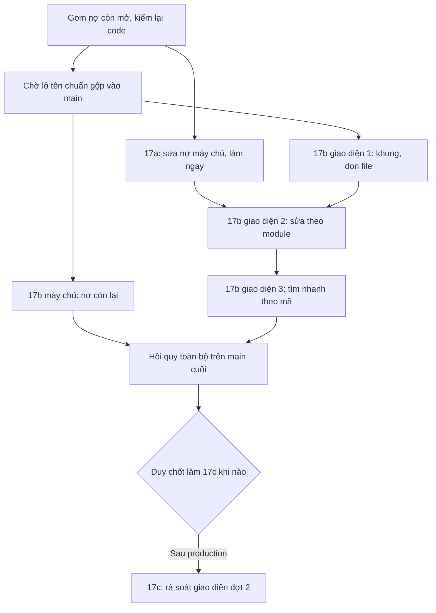

# 02e — Lô 17: dọn nợ + hồi quy toàn bộ (ERP theo design)

> Tech Lead · 07/10/2026 · Đọc trên `main` @ `29108a4`. Không viết code.
> Nguồn: `02c-giao-viec.md` (Nợ từ review…, các dòng "→ Lô 17", Nợ mới 06/10), `00-can-duy-quyet.md`, `03b-review-techlead.md`,
> `04-qa-report.md`, `04b-ra-soat-giao-dien.md`, `02d-tien-ve-muon.md` §9, và 03b/04 của `cskh-xac-nhan-in-tem`, `don-hoan-tat`,
> `don-chu-ai`, `shop-lien-he`. Mọi khoản đều đã được kiểm lại bằng cách đọc code hiện tại (cột "Kiểm").
> Lô tên chuẩn đang chạy: `feat/ten-chuan-be` (fdf79e5) và `feat/ten-chuan-fe` (ffe4283). Danh sách file hai nhánh này sửa được
> lấy bằng `git diff --name-only main...HEAD` và dùng làm danh sách "không được đụng" của 17a.



## 0. Tóm tắt

| Lô con | Kiểu | Khi nào | Số việc | Ghi chú |
|---|---|---|---|---|
| **17a** | BE | **Làm ngay** (song song tên chuẩn) | 9 | Không đụng file nào của hai nhánh tên chuẩn. Không migration |
| **17b-BE** | BE | Sau khi tên chuẩn BE gộp | 4 | Các việc BE còn lại, vì file trùng với tên chuẩn |
| **17b-FE1** | FE | Sau khi tên chuẩn FE gộp | 7 | Khung, `shared/ui`, dọn file chết, mock |
| **17b-FE2** | FE | Sau 17a và 17b-FE1 | 10 | Sửa theo module, dùng contract mới của 17a |
| **17b-FE3** | FE | Sau 17b-FE2 | 2 | ED-07 ⌘K theo mã, dọn e2e |
| **17c** | FE | **Đề xuất sau production** (Duy chốt) | 6 màn | Đợt 2 rà soát giao diện, khoảng 6–7 ngày công FE |
| Hồi quy | QA | Trên main cuối cùng | — | Mục 6 |

## 1. Bảng nợ còn mở

Mức: C/H/M/L = Critical/High/Medium/Low. "Kiểm" là kết quả đọc code @29108a4.

### 1.1 Nợ đưa vào Lô 17

| Mã | Mô tả | File | BE/FE | Mức | Kiểm | Lô con |
|---|---|---|---|---|---|---|
| N-404 | 404 trả chữ tiếng Anh "No `<Model>` matches the given query." và lộ tên model ở mọi endpoint chi tiết (QA #8 B1) | `backend/apps/common/api.py:155` `exception_handler` | BE | M | Mở: handler chuyển thẳng `Http404` cho DRF | 17a |
| TL15-dash | `dashboard/summary/` thiếu `id` ở `recent_orders[]`, `batches[]`, `alerts[]` (ED-08-AC3), và thiếu lý do của đơn ở `recent_orders[]` | `backend/apps/reports/dashboard_api.py:80-121` | BE | M | Mở | 17a |
| TL15-audit | `GET /api/audit-logs/` chưa có `date_from`, `date_to`, `q` (ED-41-AC2); FE đang lọc trên các dòng đã tải | `backend/apps/accounts/audit/api.py:49-64` | BE | M | Mở | 17a |
| TL12-num | `/api/reports/*` trả tiền và kg dạng number (Decimal thành float) | `backend/apps/reports/api.py:28,52,72` | BE | L | Mở. FE `reports` đã chuẩn hoá; `inventory/types.ts:101` đang khai **chuỗi** cho `/reports/batch/` nên hiện lệch kiểu | 17a |
| TL12-sup | Hoá đơn mua nhận phiếu nhập của nhà cung cấp khác | `backend/apps/purchasing/invoices/serializers.py` | BE | M | Mở (FE chặn, BE chưa) | 17a |
| TL12-paid | `paid_at` không bắt buộc khi đã trả và nhận giờ tương lai | như trên | BE | M | Mở | 17a |
| QA12-N3 | Hoá đơn mua nhận `amount = 0` | như trên (model chỉ có `MinValueValidator(0)`) | BE | L | Mở | 17a |
| TLA-KK | Dòng thời gian kiểm kê hiện "Có thay đổi" cho `update_reconciliation_lines`, `update_stockreconciliation` | `backend/apps/inventory/stocktake/next_steps.py:6` | BE | L | Mở | 17a |
| L8-PATCH | PATCH phiếu kiểm kê (ngày, ghi chú) không kiểm `expected_updated_at`, ai lưu sau thì thắng | `backend/apps/inventory/stocktake/api.py:87-102`, `services.py:176` | BE | L | Mở | 17a (BE) + 17b-FE2 (FE gửi + cảnh báo rời trang) |
| W37-L1 | `lock_order_of_note` khai `-> SalesOrder` nhưng có thể trả `None`; test có import trong thân hàm, biến thừa (L4, L5) | `backend/apps/sales/orders/completion.py:30`, `backend/apps/delivery/tests/test_order_completion.py:105` | BE | L | Mở | 17a |
| ED-07-BE | ⌘K cần tra phiếu giao theo mã đúng (có phạm vi). Danh sách phiếu giao chưa có lọc `code` | `backend/apps/delivery/api.py:89` | BE | L | Mở. Đơn đã có `?q=`, lô đã mở được bằng mã | 17a |
| TL8F-L3 | `available_actions` trả `delete` mà không xét `add_returntostock` (BE `soft_delete` có xét), nên FE hiện nút rồi nhận 403 | `backend/apps/inventory/returns/serializers.py:115-129` | BE | L | Mở. **File thuộc tên chuẩn (B16)** | 17b-BE |
| TLA-L3 | Bỏ `GET customer-directory/?q=` (FE đã dùng POST `search/`) | `backend/apps/sales/customers/directory_api.py:134-157`, `tests/test_directory_api.py:136-143` | BE | L | Mở. **File test thuộc tên chuẩn** | 17b-BE |
| L5-code | Chi tiết hàng chờ gọi xác nhận thiếu `note_code` (mã phiếu giao), FE hiện "—" trên BE thật | `backend/apps/delivery/confirmation/serializers.py` | BE | L | Mở. **File thuộc tên chuẩn (B12)** | 17b-BE |
| TL15-L2 | Ghi tiền về muộn nhận `received_at` chỉ có ngày (thành 00:00) và không có cận dưới (gõ nhầm năm 2006 vẫn ghi) | `backend/apps/sales/payments/services.py:368-376` | BE | L | Mở. **File thuộc tên chuẩn** | 17b-BE |
| CLN-1 | File chết: `shared/ui/{Placeholder,EmptyRow,ThemeToggle}.tsx`; `Sheet.tsx` + `SideSheet.tsx` chỉ còn `PolicyVersionSheet` dùng (02b §2.4: phải là `Modal`); `ImageUploadSheet` là Modal nhưng tên vẫn Sheet (TL13-FE-L4); `DESIGN.md:254-256` tả bố cục 3 cột | `erp-console/shared/ui/*`, `features/content/components/PolicyVersionSheet.tsx`, `features/catalog/components/ImageUploadSheet.tsx`, `erp-console/DESIGN.md` | FE | L | Mở. `RightRail`, `StatusChip`, `status.ts`, `ActivityFeed`, `ModalDialog`, `BatchDetailSheet`, `DeliveryDetailModal`, `*Sheet` của orders: **đã xoá** | 17b-FE1 |
| CLN-2 | Hộp xác nhận tự dựng trong module, chưa dùng `shared/ui/overlay/ConfirmModal` | grep `role="dialog"`/`Modal` có nút Xác nhận trong `features/**` | FE | L | Mở | 17b-FE1 |
| TL16-L1 | `.tab` rộng 39px ở 360px (dưới 44px) | `erp-console/shared/ui/globals.css:548` | FE | L | Mở (`padding:0`, không `min-width`) | 17b-FE1 |
| L5-R1 | Nút `aria-disabled` vẫn đổi nền khi rê (`:hover:not(:disabled)` không loại `aria-disabled`) | `globals.css:40-41,459,461` | FE | L | Mở | 17b-FE1 |
| L11-lt | `.lt-link` là `inline-block`, vùng bấm dưới 44px | `globals.css:629` | FE | L | Mở | 17b-FE1 |
| L5-R2 | `SkeletonBody` của `DataTable` không ẩn cột như bảng thật ở 360px | `shared/ui/list/DataTable.tsx:95` | FE | L | Mở | 17b-FE1 |
| TL15-L-c | `Section` cứng `h3`, Tổng quan nhảy bậc h1→h3→h2 (WCAG 1.3.1) | `shared/ui/detail/Section.tsx:24`, `features/overview/components/OverviewScreen.tsx` | FE | L | Mở | 17b-FE1 |
| TL15-L4 | `forgetSignedIn()` chỉ chạy ở nút Đăng xuất của Tài khoản, 4 đường đăng xuất khác bỏ sót | `features/auth/components/AccountScreen.tsx:69`, `AuthProvider.tsx` | FE | L | Mở | 17b-FE1 |
| MOCK-1 | Mock còn mã `DH-…` (37 chỗ); mock hàng hoàn tính "tháng trước" lệch khi sang đầu tháng (`ed_batch9_returns` đỏ 5 ca); mock báo cáo trả number | `features/{returns,overview,deliveries}/mock.ts`, `shared/lib/dashboardSummary.mock.ts`, `features/reports/mock.ts` | FE | L | Mở | 17b-FE1 |
| L12-a | `ReceiptDetailScreen.tsx:116` còn "Nhập chi phí mua" (tab đã là "Chi phí phụ"); `e2e/qa_ed_batch10_real.py:369,514,744` kiểm tab cũ | như cột trái | FE | L | Mở | 17b-FE2 |
| L13-num | Ô tiền ưu đãi đi qua `Number` không giới hạn chữ số; `toFixed(3)` âm thầm cắt định mức combo, kg tối thiểu | `features/catalog/catalogModel.ts:191,253` | FE | L | Mở | 17b-FE2 |
| QA12-N4/N5 | Hoá đơn bán ở 360px: mã cao 18px, cột Đơn cắt mã, dòng Đã huỷ chưa gạch; ô tìm hoá đơn đi qua URL GET (gõ nhầm SĐT sẽ vào access log) | `features/accounting/**` | FE | L | Mở | 17b-FE2 |
| TL14-L | Hộp "Cho nghỉ" đếm trang đầu (20) phiếu Đang giao; danh sách là ảnh chụp lúc mở hồ sơ | `features/staff/staffModel.ts`, `components/ActiveModal.tsx`, `StaffDetailScreen.tsx:307` | FE | L | Mở | 17b-FE2 |
| CS5-L2 | Trang in phiếu soạn và tem đứng "Đang nạp…" mãi khi `AuthProvider` ở `error` | `features/deliveries/components/PickSheetScreen.tsx:95`, `app/print/label/page.tsx` | FE | L | Mở | 17b-FE2 |
| L35-link | Huỷ đơn từ Gọi xác nhận đi vòng qua `/orders/?order=&open=refund` (redirect cũ) | `features/confirmation/components/ConfirmationDetailScreen.tsx:416` | FE | L | Mở | 17b-FE2 |
| L4-hint | `ReprintLabelModal`, `AssignCourierModal` còn dòng gợi ý xám (UI-RULES §6.2) | `features/deliveries/components/*` | FE | L | Mở | 17b-FE2 |
| TL15F-L2 | `dupRefundNeedAck` không dùng; dòng trống thừa ở `RefundModal.tsx:~77` | `features/orders/messages.ts`, `RefundModal.tsx` | FE | L | Mở | 17b-FE2 |
| USE-17a | FE dùng contract mới của 17a: Tổng quan mở dòng bằng `id` + cột Lý do; Nhật ký lọc ngày/`q` ở BE (bỏ `localNote`); hoá đơn mua hiện mã lỗi mới; kiểm kê gửi `expected_updated_at` | `features/{overview,audit,purchasing,stocktake}/**` | FE | M | — | 17b-FE2 |
| ED-07 | ⌘K nhảy theo mã chứng từ khớp đúng (Q6 dùng mặc định: chỉ mã) | `shared/ui/shell/CommandSearch.tsx` | FE | L (Could) | Chưa làm | 17b-FE3 |
| E2E-1 | `e2e/s8_views.py` lỗi thời; `qa_ed_batch1_shell` 3 ca cũ; `confirmation_scripts_tag_lookup.py:60` chỉ nghe `console.error`; `ed_batch3_fixes` 2 ca `aiOrderProposal` đỏ khi AI tắt | `erp-console/e2e/*` | FE | L | Mở | 17b-FE3 |

### 1.2 Đã xong (kiểm trên code, đóng)

`AuditLog.note` chép chữ tự do (TL-D3-L4/TL15-L5, review 3411a13 APPROVED) · TL-D8-L3 câu xoá phiếu hàng hoàn (`returns/messages.ts:72`) ·
TLA-L2/TLA-FE-L4 (Lô 14) · QA N2 Lô 14 bộ chọn `.screen` ở `s41_s47_real.py` · TL15-FE-M2 đổi mật khẩu bằng hộp thoại · TL15-L2 "FEFO" ở Tổng quan ·
TL15-L-d code chết (`ChangePasswordForm.onCancel`, `auditModel.isSystem`, `AUDIT_MSG.aiOf/title`) · mock `NCC-${id}` · ô tiền gõ "150.000,50"/"150k"
(`orders/amount.ts` `parseAmount` có `problem`) · CS-16-AC4 trang in phiếu soạn theo quyền · CS Lô 5 BE L1–L4 · `CancelOrderModal` `maxLength` 200 ·
`cancel_note`/`decision_note` hiện ở FE · W37 L3 L1–L3 · don-chu-ai N1–N3 (BE) và L1–L3 (FE) · `Field` đã `autoComplete="off"` (CS5-L1).

### 1.3 Loại khỏi Lô 17

| Khoản | Lý do loại |
|---|---|
| TLA-FE-M1 cờ `blocked_by` + "Nhờ người xử lý"; TLA-FE-L6 `STEP_NOT_FOUND` (`apps/ai/actions/services.py:359`); QA N1 `/ai/actions/escalate/` trùng; QA N2 hộp Gửi duyệt "Tải lại"; `can_do` chứa "BR-LO-04"; `AiMeta.title`; L-b `features/ai/runtime/worker.ts:51`; `AiBarGate`, `AiDocBlockGate`; TL15-L1 cờ `acknowledge_possible_duplicate` trong lệnh AI; xoá `app/(console)/ai/actions/`; DW-23 nút "Nhờ" (#19) | AI đang tắt (escalate cũng ẩn khi AI tắt, `aiFeatures.off.test.ts:75`) |
| QA Lô 12 N1 (NV kho thấy khách ở chi tiết đơn); Lô 14 L2 chip "Được gán" ở ma trận; `PermissionMatrixScreen.tsx:45`; cột "Thành viên" W3h; mọi file `features/permissions/**` | Phạm vi dữ liệu Lô 4–7 và F1 (nhánh riêng, chờ D-3) |
| Nhãn lý do huỷ, trạng thái, tên chứng từ, `auditModel.ts` (W11/W34), TL W37-L3 L1 "Lập phiếu hoàn" hai nhãn | Thuộc lô áp tên chuẩn |
| TLA-L5 `COST_ALLOCATED_LOCKED`; QA N4 chi phí phụ `amount: "0"`; TLA-H1b | #14 huỷ chi phí phụ (sau production) |
| TLA-L4 không chạy lùi `inventory/0007` | Ghi chú vận hành, không phải code |
| `item_price_id` trên dòng đơn; Lô 13 BE (`q` mặt hàng, lọc `price_list`, tồn combo, sự kiện đặt giá); `q` phiếu nhập; báo cáo theo năm; W37-L2 N+1 `backfill_completed_orders`; TL15F-L1 dòng thời gian ghi tiền muộn (cần `created_at`/người ghi) | Có migration hoặc là tính năng nhỏ mới. Hoãn sau production, cần story |
| `dashboard/summary` tiền dạng number | FE `dashboardSummary.ts` khai `number`; đổi cần cả hai phía, giá trị VND nguyên không mất chính xác. Hoãn |
| W37 L3 test đua trên Postgres; câu 2, 3, 4, 6–10 trong `06-cho-duy-08-10.md` | Chờ Duy |
| PO: ED-33-AC4/ED-34-AC5 theo #12; ED-35-AC6 quyền đăng bài; ED-42-AC2 danh sách phiên bản chính sách AI; cột "Lý do" hàng chờ gọi trên điện thoại; S6-AC1 "mặc định" | Việc của PO, không phải dev |

### 1.4 Mới phát hiện khi rà (chưa có trong nợ, chưa đưa vào lô)

| Mã | Mô tả | Mức | Đề xuất |
|---|---|---|---|
| NEW-1 | `GET /api/sales/orders/?q=` tìm theo **SĐT và tên khách** (`sales/orders/api.py:165-173`) qua URL, nên từ khoá nằm trong access log. Đây là đúng lỗi mà #11 đã sửa cho danh bạ khách bằng `POST search/` | M (dữ liệu cá nhân) | Cùng nguyên tắc #11 (Duy chốt 02/10): thêm `POST /api/sales/orders/search/`, FE chuyển sang, GET `q` chỉ còn khớp mã. Điều phối viên xin Duy gật rồi xếp vào 17b-BE + 17b-FE2 |

## 2. Lô 17a — BE, làm ngay

**Điều kiện:** không đụng file nào của `feat/ten-chuan-be` và `feat/ten-chuan-fe`. Không migration. Không đổi quyền.
**Va chạm còn lại:** `apps/common/api.py`, `apps/reports/dashboard_api.py`, `apps/delivery/api.py` cũng bị nhánh `feat/pham-vi-du-lieu`
(PV Lô 4+5, đang chờ D-3) sửa ở vùng khác. 17a gộp trước, PV rebase sau. Xung đột chỉ có ở `dashboard_api.py` khối "Đơn gần đây"
(PV đổi nguồn queryset, 17a đổi thân dict): giữ cả hai.

### 2.1 Việc và contract

| # | Mã nợ | Việc | Contract / quy tắc |
|---|---|---|---|
| A1 | N-404 | Trong `exception_handler`, `Http404` có thông điệp mặc định của Django (`^No \w+ matches the given query\.$`) hoặc rỗng thì đổi thành `NotFound("Không tìm thấy.")`. `Http404` có câu tiếng Việt riêng (`"Không tìm thấy lô hàng."`…) **giữ nguyên** | 404 `{"detail": "Không tìm thấy."}`. Không lặp lại id người gọi gửi lên, không có tên model |
| A2 | TL15-dash | `recent_orders[]` thêm `id` và `reason` (`order_reason(o)` của `sales/orders/reasons.py`, chỉ đọc). `batches[]`, `alerts[]` thêm `id` (pk lô). Prefetch `payments`, `invoice__credit_notes`, `invoice__delivery_notes` cho 8 đơn | Xem 2.2. Dùng khoá `reason` (`{code,label}` hoặc `null`), **cùng shape với cột Lý do của `/orders/` (R3)**, thay cho tên tạm `cancel_reason` trong 02c |
| A3 | TL15-audit | `GET /api/audit-logs/?date_from=YYYY-MM-DD&date_to=YYYY-MM-DD&q=` | Ngày theo **giờ VN**: `created_at >= 00:00 VN của date_from` và `< 00:00 VN của ngày sau date_to`. Sai định dạng, hoặc `date_from > date_to`, trả 400 `INVALID_FILTER`. `q`: 2–40 ký tự `[0-9A-Za-z#._-]`, có dãy từ 9 chữ số trở lên thì 400 "Chỉ tìm theo mã chứng từ." (giống BR-GH-19), không lặp lại `q` trong câu lỗi. Khớp `object_repr__icontains` hoặc `proposal_ref__icontains`. Lọc trước khi phân trang. **Chỉ sửa `api.py`**, `serializers.py` thuộc tên chuẩn |
| A4 | TL12-num | `/api/reports/batch/<mã>/`, `/reports/batches/`, `/reports/period/` trả mọi `Decimal` thành **chuỗi**. Đổi ở **tầng API** (một hàm đệ quy trong `reports/api.py` hoặc file mới `reports/decimal_strings.py`); `services.batch_pnl/period_pnl` vẫn trả `Decimal` (AI và test service đang dùng) | Tiền: `quantize(0.01)` → `"1000000.00"`. Kg: khoá `qty_*`, `*_qty` → `quantize(0.001)`. Số đếm (`int`) giữ number. Không thêm hay bớt khoá, nên giá vốn vẫn chỉ sau `view_profitreport` như cũ |
| A5 | TL12-sup, TL12-paid, QA12-N3 | `PurchaseInvoiceSerializer.validate()` trên giá trị đã gộp (`attrs` đè `instance`). Lỗi là `BusinessError` 400 | `AMOUNT_NOT_POSITIVE`: `amount <= 0`. `INVOICE_SUPPLIER_MISMATCH`: `receipt` có mà `receipt.supplier_id != supplier.id`. `PAID_AT_REQUIRED`: `is_paid=true` mà `paid_at` rỗng. `PAID_AT_IN_FUTURE`: `paid_at > now`. `PAID_AT_WHEN_UNPAID`: `is_paid=false` mà có `paid_at`. **PATCH không gửi `is_paid`/`paid_at` thì không kiểm luật paid** (dòng cũ `is_paid=True, paid_at=NULL` vẫn sửa được ghi chú và tiền). Câu lỗi tiếng Việt kèm BR-MH-03/BR-MH-04. Không đổi model nên không migration. be-dev đọc payload form ở `features/purchasing` (mock): nếu FE gửi `paid_at` khi chưa trả thì báo lệch, không tự nới |
| A6 | TLA-KK | `ACTION_LABELS` thêm `update_reconciliation_lines` = "Sửa số đếm kiểm kê" (T70 mục 4), `update_stockreconciliation` = "Sửa phiếu kiểm kê" (đúng chữ `auditModel.ts:25`) | Nhãn hằng, không chép `changes` |
| A7 | L8-PATCH | PATCH `/api/inventory/stocktake/<id>/` nhận `expected_updated_at` **tuỳ chọn**: có thì so như `replace_lines` (lệch → 409 `STALE_STATE`), không có thì giữ hành vi cũ. Khoá dòng `select_for_update` trong `update_reconciliation` | Tương thích FE hiện tại. 17b-FE2 bắt đầu gửi. Bắt buộc hoá ở lô sau |
| A8 | W37-L1 | `lock_order_of_note -> SalesOrder \| None`; dọn L4, L5 trong `test_order_completion.py` | Không đổi hành vi |
| A9 | ED-07-BE | `GET /api/delivery/notes/?code=<mã>`: khớp **đúng** (`code__iexact`) trên `get_queryset()` đã có phạm vi | NV giao tra mã phiếu người khác: `count: 0`, giống mã không có (ED-07-AC3) |

### 2.2 JSON mẫu (A2)

```json
{
  "recent_orders": [
    {"id": 812, "code": "SO261007-4F2A1C", "amount": 450000.0, "status": "CANCELLED", "status_label": "Đã huỷ",
     "expires_at": null, "reason": {"code": "CUSTOMER_CHANGED_MIND", "label": "Khách đổi ý"}}
  ],
  "batches": [{"id": 57, "batch_id": "B-261005-01", "item": "Cá thu", "...": "..."}],
  "alerts":  [{"id": 57, "batch_id": "B-261005-01", "item": "Cá thu", "expiry_date": "2026-10-09", "days_left": 2, "qty": 12.5}]
}
```
`reason.label` lấy đúng nhãn từ `reasons.py`. Ví dụ trên chỉ minh hoạ shape.

### 2.3 File

| Được sửa | Việc |
|---|---|
| `backend/apps/common/api.py` (chỉ hàm `exception_handler` và hằng mới) | A1 |
| `backend/apps/reports/dashboard_api.py` | A2 |
| `backend/apps/accounts/audit/api.py`, `backend/apps/accounts/audit/README.md` | A3 |
| `backend/apps/reports/api.py`, mới `backend/apps/reports/decimal_strings.py` (tuỳ chọn) | A4 |
| Test đang đọc JSON `/api/reports/*`: `backend/apps/reports/tests/{test_api,test_batches_list,test_p8_pnl_credit_note,test_p8_lo5_pnl_dashboard,financial_snapshot}.py`, `backend/apps/sales/refunds/tests/{test_s13_refund_payment,test_s16_refund_queue}.py`, `backend/apps/sales/credit_notes/tests/test_qa_lo4_backfill_leak.py`, `backend/apps/inventory/batches/tests/test_p8_lo5_qa_edges.py` | A4: chỉ đổi cách so (`Decimal(res[k]) == expected`), **không nới assert** |
| `backend/apps/purchasing/invoices/serializers.py`, `backend/apps/purchasing/invoices/README.md` | A5 |
| `backend/apps/inventory/stocktake/next_steps.py` | A6 |
| `backend/apps/inventory/stocktake/api.py`, `backend/apps/inventory/stocktake/services.py` | A7 |
| `backend/apps/sales/orders/completion.py`, `backend/apps/delivery/tests/test_order_completion.py` | A8 |
| `backend/apps/delivery/api.py` (chỉ `filter_queryset`) | A9 |
| Test mới (liệt kê ở 2.4), `doc/features/2026-10-01-erp-theo-design/03-dev-notes.md` (thêm mục "Lô 17a") | — |

**Không được đụng:**
- Mọi file trong `git diff --name-only main...feat/ten-chuan-be` và `main...feat/ten-chuan-fe`. Đáng chú ý: `accounts/audit/serializers.py`,
  `inventory/returns/serializers.py`, `delivery/confirmation/serializers.py`, `sales/payments/services.py`, `sales/orders/services.py`,
  `sales/orders/timeline.py`, `sales/customers/tests/test_directory_api.py`, `common/guidance/reasons.py`, mọi `models/*.py`, mọi `next_steps.py`
  **trừ** `inventory/stocktake/next_steps.py`.
- `backend/apps/ai/**`, `common/ai_visibility.py`, `sales/orders/reasons.py` (chỉ import), mọi `migrations/`, `erp-console/`, `frontend/`,
  `adapter/`, `doc/decisions.md`, `02-stories.md`, `.env*`.

### 2.4 Test bắt buộc

| Việc | Test | Ca phải có |
|---|---|---|
| A1 | mới `backend/apps/common/tests/test_not_found_message.py` | Quét **mọi** route chi tiết của router trong `config/api_urls.py` (GET pk=999999999, tài khoản superuser): body không chứa `matches the given query` và không chứa `__name__` của model. Thêm vài route chi tiết ngoài router (`reports/batch/<mã>`, `guidance/<loại>/<id>`) vẫn giữ câu tiếng Việt riêng. 401 và 403 không đổi |
| A2 | mới `backend/apps/reports/tests/test_dashboard_ids_reason.py` | Có `id` đúng pk ở 3 mảng. `reason` đúng cho AUTO_CANCELLED, CANCELLED có mã, đơn thường (`null`). `reason` không chứa `cancel_note` (seed ghi chú có SĐT giả rồi assert không có). NV kho: không có `unit_cost`/`inventory_value` (giữ test giá vốn). Ngân sách truy vấn: `assertNumQueries` không tăng theo số đơn |
| A3 | mới `backend/apps/accounts/audit/tests/test_date_and_code_filters.py` | Biên giờ VN (dòng 23:59 VN ngày D vào D, 00:00 VN ngày D+1 không vào). `date_from > date_to` 400. `q` có dấu cách hay chữ có dấu thì 400. `q` 10 chữ số thì 400, câu lỗi không chứa `q`. `count` khớp số dòng sau lọc. Không quyền `view_auditlog` thì 403, chưa đăng nhập 401. AI tắt: lọc vẫn loại dòng AI |
| A4 | mới `backend/apps/reports/tests/test_reports_decimal_strings.py` + sửa test cũ | Mọi giá trị tiền, kg là `str` và parse ra đúng `Decimal` như service. Số đếm vẫn `int`. Người thiếu `view_profitreport` vẫn 403. `financial_snapshot` không đổi giá trị |
| A5 | mới `backend/apps/purchasing/invoices/tests/test_invoice_validation.py` | Từng mã lỗi (POST và PATCH). PATCH dòng cũ `is_paid=True, paid_at=NULL` chỉ đổi `amount` thì 200. `paid_at` cách hiện tại 1 phút về tương lai thì 400, quá khứ thì 200. Khác NCC thì 400 và **không** tạo dòng. NV kho/NV giao 403 |
| A6 | sửa `backend/apps/inventory/stocktake/tests/test_timeline_labels.py` | Hai nhãn mới, không còn "Có thay đổi" |
| A7 | mới `backend/apps/inventory/stocktake/tests/test_update_stale.py` | Đúng `expected_updated_at` thì 200. Lệch thì 409 `STALE_STATE`, dữ liệu không đổi. Không gửi thì 200 (tương thích) |
| A8 | `apps.delivery`, `apps.sales` xanh nguyên | — |
| A9 | mới `backend/apps/delivery/tests/test_list_code_filter.py` | Khớp đúng (không khớp một phần). NV giao tra mã của người khác thì `count` 0. Không quyền 403 |

**Kiểm (điều phối viên tự chạy lại):**
```bash
cd backend && .venv/bin/python manage.py makemigrations --check --dry-run      # No changes detected
cd backend && .venv/bin/python manage.py test                                  # toàn bộ (A1 đụng apps/common)
python3 scripts/check_naming.py                                                # không vi phạm mới
git diff main --stat -- backend | grep -c migrations                           # 0
```
Sau khi gộp 17a, gửi `feat/pham-vi-du-lieu` một ghi chú để rebase.

## 3. Lô 17b — sau khi lô tên chuẩn gộp vào main

Điều kiện chung: `feat/ten-chuan-be` và `feat/ten-chuan-fe` đã gộp, và 17a đã gộp. Không đụng `features/permissions/**` (F1), `features/ai/**`,
`apps/ai/**`. Mọi chữ hiển thị mới lấy từ `shared/lib/enums.ts` hoặc `messages.ts` theo quy ước của lô tên chuẩn. Test `noLabelCopies.test.ts`
phải xanh.

### 3.1 17b-BE (song song 17b-FE1)

| # | Mã | Việc | File | Test |
|---|---|---|---|---|
| B1 | TL8F-L3 | `get_available_actions`: `delete` cần thêm `has_perm("inventory.add_returntostock")` | `backend/apps/inventory/returns/serializers.py` | Chủ bị tắt "Ghi hàng hoàn" thì không có `delete` và POST `delete/` 403 |
| B2 | TLA-L3 | `GET customer-directory/` có tham số `q` thì 400 `SEARCH_USE_POST` ("Tìm khách dùng ô tìm trên màn Khách hàng."). Bỏ `q` khỏi `get_queryset`. Danh sách không `q` giữ nguyên | `backend/apps/sales/customers/directory_api.py`, `tests/test_directory_api.py`, `tests/test_directory_search_post.py` | Ca GET `q` cũ chuyển sang POST. GET `?q=` 400, câu lỗi không lặp `q` |
| B3 | L5-code | Chi tiết hàng chờ gọi thêm `note_code` (mã phiếu giao của đơn, `null` nếu chưa có) | `backend/apps/delivery/confirmation/serializers.py` | Có/không có phiếu. CSKH ngoài phạm vi vẫn 404 |
| B4 | TL15-L2 | `received_at` bắt buộc có phần giờ. Cũ hơn `settings.LATE_PAYMENT_MAX_AGE_DAYS` (mặc định 400, env) thì 400 | `backend/apps/sales/payments/services.py`, `config/settings.py` | Chỉ có ngày thì 400. 401 ngày trước thì 400. Hôm qua thì 200 |
| (B5) | NEW-1 | Nếu Duy gật: `POST /api/sales/orders/search/` (body `{q, …bộ lọc}`), GET `q` chỉ khớp mã | `backend/apps/sales/orders/api.py`, `config/api_urls.py` | Theo mẫu `test_directory_search_post.py` |

Kiểm: như 17a.

### 3.2 17b-FE1 — khung, dùng chung, dọn

| # | Mã | Việc | File được sửa |
|---|---|---|---|
| F1 | CLN-1 | Xoá `Placeholder.tsx`, `EmptyRow.tsx`, `ThemeToggle.tsx` (sửa comment `themeScript.ts:2`). `PolicyVersionSheet` chuyển sang `shared/ui/overlay/Modal` rồi xoá `SideSheet.tsx`, `Sheet.tsx`. Đổi `ImageUploadSheet` thành `ImageUploadModal`. Sửa `DESIGN.md:254-256`. Mỗi file chỉ xoá khi `grep` không còn chỗ dùng | `erp-console/shared/ui/*`, `features/content/components/{PolicyVersionSheet→PolicyVersionModal,EntryEditScreen}.tsx`, `features/catalog/components/{ImageUploadSheet→ImageUploadModal,ItemDetailScreen}.tsx`, `erp-console/DESIGN.md` |
| F2 | CLN-2 | Hộp xác nhận tự dựng trong module chuyển sang `ConfirmModal` | file module tìm được bằng grep (liệt kê trong dev-notes trước khi sửa) |
| F3 | TL16-L1, L5-R1, L11-lt | `.tab` có `min-width: var(--tap)` và padding ngang. Hover loại `[aria-disabled="true"]`. `.lt-link` thành `display:block`, `min-height:var(--tap)` | `erp-console/shared/ui/globals.css` |
| F4 | L5-R2 | `SkeletonBody` ẩn cột theo cùng quy tắc với bảng thật ở 360px | `shared/ui/list/DataTable.tsx` |
| F5 | TL15-L-c | `Section` có prop `headingLevel?: 2 \| 3` (mặc định 3), Tổng quan truyền 2 | `shared/ui/detail/Section.tsx`, `features/overview/components/OverviewScreen.tsx` |
| F6 | TL15-L4 | Xoá mốc đăng nhập trong `AuthProvider.logout`, bỏ lời gọi riêng ở `AccountScreen` | `features/auth/components/{AuthProvider,AccountScreen}.tsx`, `features/auth/signedInAt.ts` |
| F7 | MOCK-1 | Mock đổi `DH-…` sang `SO…`. Mock hàng hoàn cố định ngày theo đầu tháng (không phụ thuộc hôm nay). Mock báo cáo trả chuỗi theo A4. Mock 404 dùng "Không tìm thấy." | `features/{returns,overview,deliveries,reports}/mock.ts`, `shared/lib/dashboardSummary.mock.ts` |

**Không đụng:** `features/permissions/**`, `features/ai/**`, `app/(console)/ai/**`, `frontend/`, `backend/`.
**Test:** vitest cho F4 (cột skeleton ở 360), F5 (bậc tiêu đề), F6 (mọi đường đăng xuất xoá mốc). e2e có kiểm vùng bấm (`ed_batch1_shell`,
`ed_batch16_content`, `ed_batch13_catalog`) bỏ loại trừ `.lt-link` và `.tab`. `ed_batch9_returns` xanh hết (5 ca đang đỏ).

### 3.3 17b-FE2 — sửa theo module, dùng contract 17a

| # | Mã | Việc | File được sửa |
|---|---|---|---|
| G1 | USE-17a / A2 | Tổng quan: dòng đơn mở `/orders/detail/?id=`, dòng lô và cảnh báo mở `/inventory/detail/?id=`, cột Lý do lấy `reason.label` | `features/overview/**`, `shared/lib/dashboardSummary.ts` |
| G2 | USE-17a / A3 | Nhật ký: gửi `date_from`, `date_to`, `q` lên BE, bỏ `localNote` và lọc ở máy. Câu lỗi 400 hiện dưới ô | `features/audit/{api,types}.ts`, `features/audit/components/AuditLogScreen.tsx` (không đụng `auditModel.ts` ngoài việc tên chuẩn đã làm) |
| G3 | USE-17a / A5, L12-a | Hoá đơn mua hiện đúng 5 mã lỗi mới (mock khớp). "Nhập chi phí mua" thành "Nhập chi phí phụ". `e2e/qa_ed_batch10_real.py` đổi tab "Chi phí phụ" | `features/purchasing/**`, `shared/lib/beErrors.mock.ts`, `e2e/qa_ed_batch10_real.py` |
| G4 | L8-PATCH | Kiểm kê: PATCH gửi `expected_updated_at`, 409 thì hiện hộp "Phiếu đã đổi, tải lại". Cảnh báo rời trang khi còn sửa chưa lưu | `features/stocktake/**` |
| G5 | L13-num | Ô tiền ưu đãi dùng `parseAmount` (giới hạn chữ số, báo `tooBig`). Định mức combo, kg tối thiểu quá 3 chữ số thập phân thì báo lỗi, không làm tròn ngầm | `features/catalog/{catalogModel.ts,components/*}` |
| G6 | QA12-N4/N5 | Hoá đơn bán ở 360px: mã không xuống dòng, cột Đơn không cắt mã, dòng Đã huỷ gạch. Ô tìm chỉ gửi chuỗi giống mã (chặn dãy từ 9 chữ số, như ô tra tem) | `features/accounting/**` |
| G7 | TL14-L | "Cho nghỉ": dùng `count` của API (không đếm trang đầu), và tải lại danh sách khi mở hộp | `features/staff/**` |
| G8 | CS5-L2 | Trang in phiếu soạn và tem: `status === "error"` hiện màn lỗi có nút Thử lại | `features/deliveries/components/PickSheetScreen.tsx`, `app/print/label/page.tsx` |
| G9 | L35-link, L4-hint | Link huỷ đơn trỏ thẳng `/orders/detail/?id=&open=refund`. Bỏ dòng gợi ý xám ở 2 hộp giao hàng (UI-RULES §6.2) | `features/confirmation/components/ConfirmationDetailScreen.tsx`, `features/deliveries/components/{ReprintLabelModal,AssignCourierModal}.tsx` |
| G10 | TL15F-L2, B2, B3 | Bỏ `dupRefundNeedAck` và dòng trống. Mock danh bạ khách bỏ nhánh GET `q`. Hàng chờ gọi hiện `note_code` thật | `features/orders/{messages.ts,components/RefundModal.tsx}`, `features/customers/mock.ts`, `features/confirmation/**` |

**Không đụng:** như 17b-FE1, cộng `shared/ui/**` (đã xong ở FE1).
**Test:** vitest cho G2 (tham số gửi lên), G4 (409), G5 (biên chữ số), G7 (đếm theo `count`). e2e mock: `ed_batch15_overview_ai_account`,
`ed_batch8_stocktake`, `ed_batch10_purchasing`, `ed_batch12_accounting`, `ed_batch13_catalog`, `s41_s47_staff`, `confirmation_scripts_tag_lookup`.
e2e BE thật: `ed_batch12_real`, `ed_batch8_stocktake_real`, `qa_ed_batch10_real`, `s41_s47_real`. Có ca 360px cho G6.

### 3.4 17b-FE3 — ED-07 và dọn e2e

| # | Việc | File |
|---|---|---|
| H1 | ED-07 ⌘K: nhận đúng mẫu mã rồi gọi endpoint **có phạm vi**: `SO…` qua `/api/sales/orders/?q=` rồi lọc khớp đúng; `GH-…` qua `/api/delivery/notes/?code=` (A9); mã lô qua `/api/inventory/batches/<mã>/`; `PR-n`, `KK-n`, `RT-n`, `#n` mở trang chi tiết theo id (trang tự xử lý 404). Không khớp mẫu thì giữ hành vi nhảy menu cũ, **không gọi API** (chống dò tên/SĐT, 02b T5). Không có kết quả: "Không tìm thấy chứng từ khớp với <mã>" | `shared/ui/shell/CommandSearch.tsx`, mới `shared/lib/codeLookup.ts` (+ test) |
| H2 | Xoá `e2e/s8_views.py` (đã có `ed_batch15`). Sửa 3 ca cũ của `qa_ed_batch1_shell.py`. `confirmation_scripts_tag_lookup.py` nghe mọi loại console rồi lọc PII. `ed_batch3_fixes.py`: 2 ca `aiOrderProposal` bỏ qua có lý do khi build tắt AI | `erp-console/e2e/*` |

**Test:** vitest `codeLookup.test.ts` (mẫu mã, chuỗi giống SĐT không gọi API). e2e mới `e2e/ed_batch17_command_search.py` mock + BE thật:
ED-07-AC1, AC2, AC3 (`giao1` gõ mã phiếu của `giao2` thì báo không tìm thấy), và 0 request khi gõ tên khách.

**Kiểm chung 17b-FE*:** 02b §5.0 FE, cộng `grep -rn "Làm mới\|NCC\|FEFO\|TTL\|hạch toán\|BR-" erp-console/app erp-console/features erp-console/shared --include='*.tsx'`
chỉ còn trong comment, và `python3 scripts/check_naming.py`.

## 4. Lô 17c — đợt 2 rà soát giao diện (04b)

Nhóm A–E đã gộp vào main (`0b3e4d5` và trước đó). Còn các màn **lệch hẳn bố cục**:

| Màn | Board | Lệch chính (04b) | Phụ thuộc | Ước lượng FE |
|---|---|---|---|---|
| Báo cáo lãi lỗ | W3a | Dải 7 ô KPI, tháng dạng phân đoạn, thẻ có đầu, rail "Chi tiết lô" | Kiểm đủ 7 số có trong `/reports/period/` chưa. Thiếu thì cần BE thêm khoá (không giá vốn mới) | 1,5 ngày |
| Tài khoản của tôi | W4e | Dải đầu trang ngang, "Việc bạn được làm" dạng danh sách, khối Bảo mật | Dòng "AI của tôi" bỏ (AI tắt). "Phiên đăng nhập" chỉ hiện "Máy này" vì BE không có danh sách phiên. PO chốt | 1 ngày |
| Việc giao của tôi | W1e | Master-detail + 4 KPI (app đang một cột 640px) | NV giao dùng điện thoại: master-detail chỉ ở ≥1024px, 360px giữ một cột | 1–1,5 ngày |
| Nhãn | W2e | Hai nhãn so sánh | — | 0,5 ngày |
| Soạn bài, Đăng bài | W3b, W3c, W3d | Trình soạn trong thẻ, rail phải đầu 44px, "Chèn thẻ", hộp đăng | Bỏ thanh AI và khối AI | 1,5 ngày |
| Phân quyền | W3h, W3i | Thẻ danh sách nhóm, ma trận có ô tìm, công tắc, ổ khoá "Chỉ Chủ" | **Chặn bởi F1** (`features/permissions/**` ở `feat/pham-vi-fe`, chờ D-3) | 1,5 ngày, làm sau F1 |

Cộng thêm nhóm H (icon cộng ở W5g, W5g2: 0,1 ngày) và chụp ảnh app cho 25 popup "Chưa kiểm" ở 04b (QA, 0,5 ngày).
**Tổng: khoảng 6–7 ngày công FE, cộng 1–2 ngày QA so ảnh.**

**Có nên làm trước production không: đề xuất KHÔNG chặn production.** Lý do:
1. Đây chỉ là hình thức. Chức năng, phân quyền và dữ liệu đã có QA riêng.
2. Nhóm A–E (danh sách, chi tiết, form, popup, đăng nhập) đã khớp board, nên khung chung đã đồng bộ.
3. W3h/W3i phụ thuộc F1, mà F1 đang chờ D-3. Ép làm trước sẽ kéo production theo một câu hỏi chưa có lời đáp.

Nếu Duy muốn làm một phần trước production thì chọn **W3a** (Chủ xem hằng ngày) và **W4e**: khoảng 2,5 ngày, không dính F1.
Mỗi màn là một lô con FE riêng, có ảnh `shots/lo17c/<mã>` đặt cạnh board, chấm theo UI-RULES.
Không đụng: `features/ai/**`, chữ đã chuẩn hoá ở lô tên chuẩn.

## 5. Thứ tự và song song

```
Bây giờ:      17a (BE) ∥ lô tên chuẩn (Pha B, QA)
Tên chuẩn gộp: 17b-BE ∥ 17b-FE1
Sau đó:       17b-FE2 → 17b-FE3
Sau 17b:      hồi quy toàn bộ (mục 6) → deploy staging khi Duy bảo
Sau production hoặc theo lệnh Duy: 17c (W3a, W4e, W1e, W2e, W3b–d), W3h/W3i sau F1
```

## 6. Hồi quy toàn bộ trên main cuối cùng

Chạy trên **một** commit `main` (ghi hash vào `04-qa-report.md`). Điều phối viên chạy BE và build. QA chạy e2e. Không PASS bằng đọc code.
Tối đa 2 luồng build cùng lúc (đĩa từng đầy).

### 6.1 Lệnh

```bash
# BE + adapter
cd backend && .venv/bin/python manage.py makemigrations --check --dry-run
cd backend && .venv/bin/python manage.py test                              # toàn bộ, ghi tổng số test
cd adapter && .venv/bin/python -m pytest -q
python3 scripts/check_naming.py

# ERP
cd erp-console && rm -rf node_modules && npm ci
cd erp-console && npx tsc --noEmit && npx vitest run
cd erp-console && NEXT_PUBLIC_USE_MOCK=0 npm run build && node scripts/check-no-mock.mjs && node scripts/check-ai-chunks.mjs
cd erp-console && grep -rnE '#[0-9a-fA-F]{3,8}\b|rgba?\(' app features shared --include='*.ts' --include='*.tsx' --include='*.css' | grep -v 'shared/ui/tokens.css'   # rỗng
cd erp-console && NEXT_PUBLIC_USE_MOCK=1 npm run build                       # bản mock cho e2e mock

# Shop
cd frontend && rm -rf node_modules && npm ci
cd frontend && npx tsc --noEmit && npm run build && node scripts/check-no-mock.mjs
cd frontend && node scripts/test-format.mjs && node scripts/test-safe-href.mjs

# Sạch repo
git status --porcelain | grep -E '\.env|secret' ; test $? -eq 1                # không có .env, bí mật
```

### 6.2 E2E

Quy ước phân loại: tên file có `real`, `_api` hoặc `real_backend` thì chạy trên **BE thật** (runserver local, SQLite hoặc Postgres tạm,
`seed_demo` dữ liệu giả, `AI_ENABLED=0`). Còn lại chạy trên **bản mock** phục vụ tĩnh. Hai file chạy **cả hai**: `standard_names_all_routes.py`,
`ai_text_hidden_all_routes.py`.

| Nhóm | File (`erp-console/e2e/`) | Mock | BE thật |
|---|---|---|---|
| Theo lô ED | `ed_batch1_shell` … `ed_batch16_content`, `ed_batch3_fixes`, `ed_bonusA_ui`, `ed_form_keyboard_focus`, `ed_shell_fixes`, `ed_batch17_command_search` (mới) | ✓ | — |
| Theo lô ED, BE thật | `ed_batch3_real`, `ed_batch7_real`, `ed_batch8_stocktake_real`, `ed_batch9_real`, `ed_batch11_real`, `ed_batch12_real`, `ed_batch16_real`, `ed_batch17_command_search` | — | ✓ |
| QA ED | mọi `qa_ed_batch*.py` (mock), mọi `qa_ed_batch*_real*.py`, `qa_ed_batch*_api.py` (BE thật) | ✓ | ✓ |
| Tính năng sau ED | `delete_return`, `late_payment_record`, `note_br_gh_19`, `order_completion_detail`, `order_completion_erp`, `confirmation_route`, `confirmation_scripts_tag_lookup` | ✓ | — |
| Cũ (S/P8/SR/rà soát) | `s7_shell`, `s10_s11_orders`, `s12_s13_queue`, `s14_s16_cancel_refund`, `s41_s47_staff`, `s48_password`, `p8_lo5_fe_lo_qua_han`, `p8_lo6_fe_sr19_sr20`, `p8_lo7_fe_erp`, `p8_lo8_fe_erp_tz`, `l7_1_open_redirect`, `sr07_*`, `sr09_ac4_stale_state`, `ra_soat_*` | ✓ | — |
| Cũ, BE thật | `a2_catalog_real`, `s41_s47_real`, `p8_lo5_qa_real_backend`, `qa_lo7_real_expired`, `qa_lo8_real`, `sr09_ac4_real_backend` | — | ✓ |
| Toàn route | `standard_names_all_routes`, `ai_text_hidden_all_routes` | ✓ | ✓ |
| Shop (`frontend/e2e/`) | `order_lookup_completed`, `order_lookup_no_raw_codes`, `qa-lo6-sr21-shop`, `qa-lo7-shop-links`, `qa-lo7-shop-xss`, `qa-lo8-shop-format`, `ra-soat-a2-golive`, `ra_soat_cms*` | ✓ | — |
| Shop, BE thật | `qa-lo7-shop-real`, `qa-lo8-shop-django`, `qa_sepay_checkout` (sandbox, không gọi SePay thật) | — | ✓ |

Danh sách cuối cùng lấy bằng `ls erp-console/e2e/*.py frontend/e2e/*.py` trên commit chạy. File mới phát sinh sau ngày này cũng phải được xếp vào một nhóm.

### 6.3 Điều kiện coi đợt ERP theo design là xong

1. Mọi lệnh 6.1 xanh. Ghi số thật: tổng test BE, vitest, số ca e2e đạt/tổng theo từng file.
2. E2E 6.2 **không có ca đỏ**. Ngoại lệ được chấp nhận chỉ là ca bỏ qua có lý do in ra (AI tắt), và phải liệt kê trong báo cáo.
3. QA thêm ca ngoài đường thuận cho mỗi việc 17a/17b (đã ghi ở mục test của từng lô).
4. Không rò giá vốn (`kho1`, `giao1` gọi `/reports/*`, `dashboard/summary`, `audit-logs`) và không rò dữ liệu cá nhân (log `runserver`, console FE,
   URL) ở lượt BE thật.
5. `techlead` review 17a, 17b không còn Critical/High. `qa-tester` APPROVED.
6. ☑ Lô 17 ở `02c-giao-viec.md` kèm hash. 17c và các khoản "Hoãn" ở 1.3 chuyển sang danh sách sau production.

## 7. Câu hỏi cho điều phối viên (hỏi Duy khi cần)

| # | Câu | Mặc định nếu Duy chưa trả lời |
|---|---|---|
| 1 | NEW-1: chuyển tìm đơn theo SĐT/tên sang POST như #11? | Chưa làm. Ghi nợ dữ liệu cá nhân Medium, nên làm trước production |
| 2 | 17c có làm trước production không? | Không chặn production. Nếu muốn thì làm W3a + W4e |
| 3 | A3 chỉ cho tìm Nhật ký theo mã (không tìm tên)? | Có, chỉ mã |

## 8. Review

_(chưa có)_
