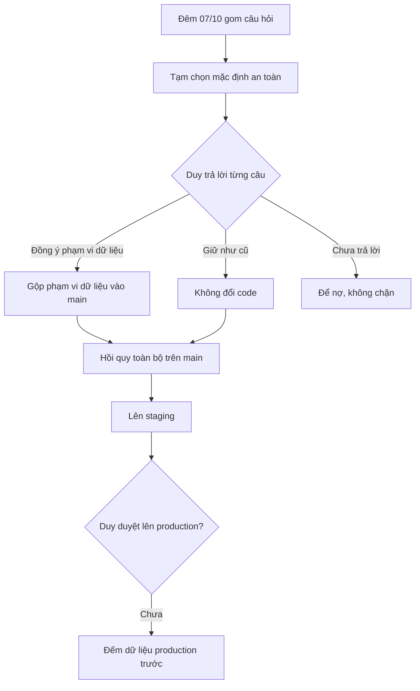

# Câu hỏi chờ Duy (sáng 08/10)

> **ĐỢT ĐÃ ĐÓNG (rà 11/10):** ảnh chụp việc dở của đợt ERP theo design. Các câu chờ đã được Duy trả lời 08/10 và 10/10 (`doc/decisions.md`). Không chạy lại theo file này; đợt đang làm là Shop (`doc/features/2026-10-06-shop-giao-dien-moi/`).

1. Superuser KHÔNG thuộc nhóm nào có được vào ERP console không? Hiện bị đưa về /no-role/. Đổi thì lật S6-AC4, S47-AC5 đã nghiệm thu. Mặc định đêm nay: giữ nguyên.
2. Dòng Nhật ký do Chủ đổi cài đặt/chính sách AI (ai_config_*, ai_policy_*) khi tắt AI: đang giữ (vết kiểm toán). Muốn ẩn hẳn không?
3. Refund.reason / failure_reason / resolution_note vẫn nhận SĐT (trên chứng từ có phân quyền). Có chặn SĐT như BR-GH-19 không?
4. staff_create ghi tên + SĐT nhân viên vào nhật ký — có che không? (mặc định: để lô accounts sau)
5. Test đua Huỷ ∥ Giao xong trên PostgreSQL thật (W37 T1): cài PostgreSQL 16 cục bộ để chạy không? Đêm 07/10 chọn tạm: skip + test tất định.
6. D-3 (Phạm vi dữ liệu): người KHÔNG thuộc nhóm nào nhưng được gán quyền trực tiếp — khi chuyển sang phạm vi theo nhóm, họ mất tên khách trên đơn và (nếu làm) mất dòng phiếu hoàn / số liệu dashboard. Cho thu hẹp như vậy không, hay cấp lại trực tiếp? Cần đếm số người này trên production trước deploy. Đêm 07/10: hoãn phạm vi D1 cho phiếu hoàn tiền + dashboard.
   (Bổ sung C2) Cụ thể: người KHÔNG thuộc nhóm sẽ mất tên, SĐT, địa chỉ khách trên đơn, hoá đơn, phiếu hoàn cho tới khi được cấp quyền V2 trực tiếp. Lệnh đếm production cần liệt kê ai đang có view_salesorder / view_salesinvoice / view_refund mà không thuộc nhóm. D-3 CHẶN Lô 5 (C1) → Lô 5, 6, 7 và F1 FE chờ Duy.

7. **V2 "xem thông tin khách trên đơn" phủ cả phiếu giao** (Tech Lead duyệt kỹ thuật 08/10). Hệ quả: nếu Chủ tắt V2 cho NV giao thì NV giao mất địa chỉ giao. Ngoại lệ: tem (`/label/`) vẫn in tên và địa chỉ người nhận theo quyền "In tem", và hàng chờ gọi vẫn hiện theo quyền "Gọi xác nhận đơn"; tắt V2 không đóng hai đường này. Có đồng ý không? Nhãn V2 sẽ đổi để nói rõ phạm vi.
8. **Phạm vi dữ liệu Lô 4–5 chờ D-3 mới được merge** (thay đổi của người không nhóm được ghi "CHỜ Duy" trong test).

9. **Người kiêm NV kho + CSKH** cũng bị thu hẹp ở "Gọi xác nhận" (không còn xem lại việc gọi đã xong) — gộp chung câu D-3.
10. **BR-TT-18 (#15 ghi tiền về muộn)** ghi vào spec gốc §P-05 (dưới BR-TT-07, sửa E-05 §13): đồng ý không?

11. **NEW-1 (dữ liệu cá nhân):** ô tìm đơn ERP gửi SĐT/tên khách qua URL (`GET /api/sales/orders/?q=`) → lọt access log. Đề xuất chuyển sang `POST search/` như #11 danh bạ — đã xếp vào Lô 17b, Duy phản đối thì báo.
12. **Đợt 2 rà soát giao diện (17c, ~6–7 ngày FE)** có làm trước production không? Đề xuất: không chặn production; nếu muốn làm trước thì W3a (báo cáo lãi lỗ) + W4e (Tài khoản) ~2,5 ngày.
13. Nhãn vai **"CSKH"** (màn Tài khoản, cài đặt AI) có đổi thành "Gọi xác nhận"/tên khác không? (câu lỗi đã đổi; tên vai giữ)

# Trạng thái (cập nhật 08/10, sau khi chạy tiếp)
**Đã lên main + staging** (staging = `api:v16`, rev `cangca-api-staging-00014-5mx`, main `a94472d`):
#3/#8 BE+FE, CSKH Lô 5, rà soát C/D/E, Lô 15, Phạm vi Lô 1–3, AuditLog không chép chữ tự do, nút Liên hệ, lô dọn chữ AI, W37 L1–L4 (đơn tự Hoàn tất; đã chuyển bù 1 đơn trên staging), #15 ghi tiền về muộn BE+FE, lô áp tên chuẩn (mục 4), Lô 17a, Lô 17b (tìm đơn bằng POST — SĐT/tên không vào URL; ⌘K theo mã). Spec gốc §7.2 + BR-BH-18..21, BR-BC-06, BR-GH-24 đã ghi.

| Việc | Nhánh | Trạng thái |
|---|---|---|
| Phạm vi Lô 4 + 5 BE | `feat/pham-vi-du-lieu` | techlead + QA đạt kỹ thuật — **chờ D-3 (câu 6, 8, 9)** mới merge |
| Phạm vi F1 FE | `feat/pham-vi-fe` | techlead đạt — merge cùng Lô 5; Lô 6–7 chưa làm |
| Hồi quy toàn bộ trên main cuối | — | QA đang chạy |
| Lô 17c đợt 2 rà soát giao diện | — | chờ câu 12 |
| Production | — | **chưa đụng**; lệnh chuyển bù production chờ Duy |

# Trạng thái 10/10
- Duy trả lời lại câu 3, 4, 10, 13 (giữ như 08/10); câu 5: test PostgreSQL chạy trên cloud (`doc/decisions.md` 10/10). Câu 12 (17c) vẫn chưa làm.
- **Phạm vi dữ liệu Lô 4–7 + F1 đã xong**, merge `fa789a2`, staging `api:v17` (rev `cangca-api-staging-00015-gj7`).
- Nợ mới (không chặn): L2 tên đăng nhập rất dài đẩy nút "Bỏ khỏi nhóm" ra ngoài khung ở 360 (`features/permissions/permissions.module.css`); backlog BR-PQ-33 đưa luật theo tên nhóm (`can_cancel_any_receipt`, `list_deliverers`/`assign_deliverer`) vào cấu hình nếu Duy muốn nhóm tự tạo; I2 chữ "trong N ngày" ở màn Tài khoản.
- Còn hỏi Duy: Q1 trong `02c-quyet-dinh-08-10.md` — tem in (`/label/`) hiện vẫn che SĐT; quyết định 08/10 ghi "bản in đầy đủ" cho phiếu giao, cần xác nhận có áp cho tem không.
- Production: chưa đụng. Trước khi lên phải đếm D-2/D-3 trên production.
- 10/10 chiều: Duy chốt Q1 — tem in chỉ 4 số cuối SĐT → TEM-01 xong, staging `api:v18`. L2 đã sửa. Worktree đã dọn (còn `main`). Còn backlog BR-PQ-33 (luật theo tên nhóm) và I2 (chữ "trong N ngày").
