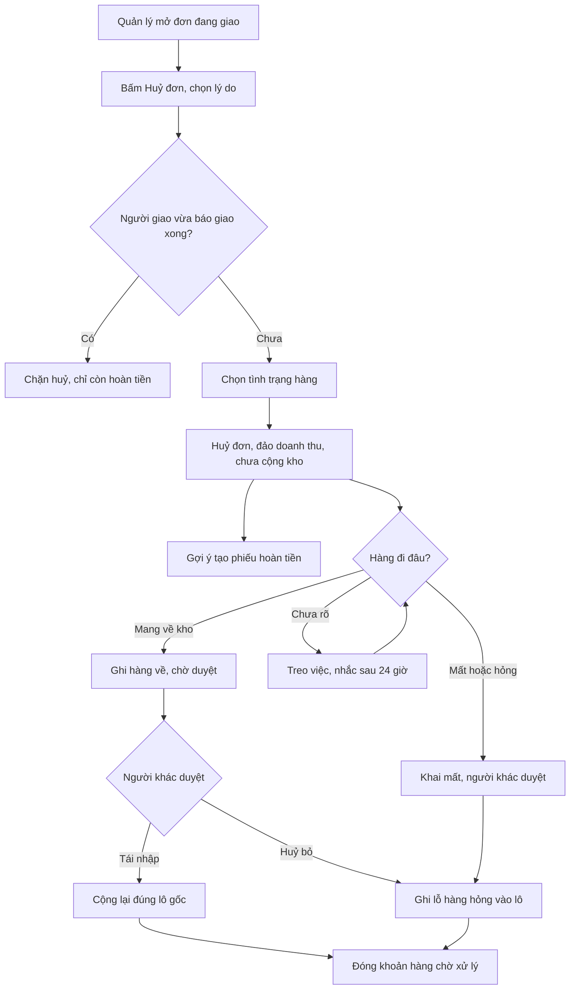

# Huỷ đơn khi phiếu giao đang "Đang giao" — Phân tích nghiệp vụ
> BA · 2026-10-01 · Trạng thái: **CHỜ DUYỆT**

## 1. Yêu cầu gốc
> "chỗ đơn đang giao tại sao ko cho phép hủy ? vì có thể là hủy bởi bên thứ 3 nhưng bên mình chưa api đc, thì cũng nên có thao tác cho ngta hủy nhỉ ?"

Nguồn: Duy, 01/10/2026, trong phiên điều phối.

## 2. Tóm tắt
**Quản lý hoặc Chủ** cần **huỷ được đơn đã thanh toán ngay cả khi phiếu giao đang ở "Đang giao"**, đồng thời **khai rõ số phận của hàng đã rời kho** (mang về / mất, hỏng / chưa rõ). Mục đích là để sổ đơn, sổ kho và sổ doanh thu khớp với thực tế khi chuyến giao bị huỷ ngoài hệ thống, ví dụ người giao gặp sự cố, khách từ chối ngay tại cửa, hay (về sau) đơn vị vận chuyển huỷ chuyến mà hệ thống chưa nối API để nhận tin.

**Tóm gọn cho Duy:** hệ thống hiện chặn huỷ ở "Đang giao" là có chủ đích. Lúc đó hàng không còn ở kho nên không được cộng lại kho. Thực ra đã có đường vòng hai bước (báo "Giao thất bại" rồi mới huỷ), nhưng đường vòng này vừa khó thấy, vừa ghi sai bản chất sự việc (cộng số lần giao thất bại). Ngoài ra, sau khi huỷ thì **không còn chỗ nào để ghi hàng đã đi đâu**. Tính năng này cần sửa cả hai điểm đó, không chỉ mở nút huỷ.

## 3. Bối cảnh trong hệ thống

### 3.1 Quy trình và rule liên quan
| Loại | Mã / nguồn | Nội dung | Liên quan |
|---|---|---|---|
| Quy trình | P-06 (spec §8) | Soạn hàng → Chờ lấy → Đang giao → Hoàn tất / Giao thất bại | Trạng thái `DELIVERING` |
| Quy trình | P-07 (spec §9) | Huỷ đơn & hoàn tiền. Bảng "Bốn tình huống huỷ" (§9.2) **chưa có** tình huống "huỷ khi đang giao" | Thêm tình huống thứ 5 |
| Quy trình | P-08 (spec §10) | Hàng giao thất bại về kho → Quản lý/Chủ duyệt Tái nhập hoặc Huỷ bỏ | Chỗ để ghi hàng quay về |
| Rule | BR-GH-01 | Người giao là nhân viên nội bộ | Mâu thuẫn với chữ "bên thứ 3" của Duy |
| Rule | BR-GH-04 | Giao thất bại là trạng thái tạm, đếm số lần thử, đủ 2 lần thì nhắc quyết định | Đường vòng hiện tại làm tăng bộ đếm này sai mục đích |
| Rule | BR-GH-05 | Hoàn tất là điểm không quay lui | Giữ nguyên |
| Rule | BR-GH-06 | `delivery_staff` chỉ sửa trạng thái phiếu của mình | Người giao không tự huỷ đơn |
| Rule | **BR-GH-07** (đặt 24/09, S14) | Chặn huỷ khi phiếu `DELIVERING` ("báo giao thất bại trước khi huỷ") | **Sửa** |
| Rule | BR-HT-05 | Hoàn kho tại thời điểm huỷ; kho và tiền là hai sổ tách nhau | Giữ |
| Rule | BR-HT-06 / BR-HT-10 | Huỷ đơn đã thanh toán → chứng từ đảo doanh thu lập ngay, vào **kỳ huỷ**; kỳ cũ không đổi số | Giữ, áp cho tình huống mới |
| Rule | BR-HT-02/03/04/07 | Hoàn một phần được; Đã hoàn bắt buộc mã GD; không vượt số đã thu; Quản lý tạo phiếu hoàn, chỉ Chủ xác nhận | Giữ |
| Rule | BR-HV-01/02/03/04 | Hàng hoàn về đúng lô gốc; bắt buộc duyệt; quá ngưỡng ngoài chuỗi lạnh thì đề xuất Huỷ bỏ; lô đã chốt không nhận hàng hoàn | Giữ, mở rộng cho phiếu đã huỷ |
| Rule | BR-HV-05 | **Mã đang bị dùng hai nghĩa**: hồ sơ 24/09 dùng cho "kg mang về ≤ kg đã xuất"; hồ sơ 28/09 (vai trò) dùng cho "người duyệt ≠ người tạo" | Cần BA/PO chuẩn hoá (xem Q9) |
| Rule | BR-BC-03/04 | Hoàn tiền vào kỳ phát sinh; hàng hỏng hiện riêng, không cộng thêm vào chi phí | Giữ |
| Quyết định | decisions.md 2026-09-09 | **"Đã chốt cuối: người giao hàng là nhân viên nội bộ (không thuê ngoài/Grab/Ahamove)"** | Ràng buộc, BA không lật |
| Quyết định | decisions.md 2026-09-26 | V1 chỉ VietQR, thanh toán 100% trước | **Không có COD** |
| URD | §4.2 | "Giao hàng qua đối tác thứ 3 (Grab/Ahamove)" nằm **ngoài phạm vi** | Ràng buộc |
| Tài liệu | `doc/ops/khao-sat-ben-van-chuyen.md` (28/09) | Khảo sát bên vận chuyển; ghi rõ "không đề xuất lật quyết định" | Hướng tương lai |
| Quyết định 24/09 | Q8(b), hồ sơ `2026-09-24-erp-console-noi-that` | Huỷ sau giao thất bại thì **không** hoàn kho; kho chỉ cộng lại qua duyệt hàng hoàn, để tránh cộng kho hai lần | Áp nguyên cho tình huống mới |

### 3.2 Hiện trạng code (BA đọc để đối chiếu, không phải thiết kế)
- `backend/apps/sales/orders/services.py::cancel_paid_order` (dòng 333–408):
  - Dòng 363–367: phiếu `DELIVERING` thì raise `BR-GH-07`. Dòng 368–371: phiếu `COMPLETED` thì raise `BR-GH-05`.
  - Dòng 373: `stock_restored` chỉ đúng khi phiếu thuộc `_STOCK_STILL_IN_WAREHOUSE` (CONFIRMING/PREPARING/READY, dòng 326–330). Phiếu `FAILED` thì **không** hoàn kho.
  - Dòng 389–393: phiếu chuyển `CANCELLED` và đóng mục chờ gọi (`close_task_on_cancel` đặt task thành `DONE`).
  - Dòng 395–407: AuditLog `cancel_paid_order` gồm `stock_restored` và `reason_code`, lý do để ở `note`. Chứng từ đảo được lập trong cùng giao dịch (`issue_cancel_credit_note(..., stock_restored=...)`).
  - Dòng 311–317: lý do huỷ gồm `CUSTOMER_CHANGED_MIND`, `DAMAGED_WHEN_PACKING`, `GIVE_UP_AFTER_FAILED`, `UNREACHABLE` và `OTHER` (có ghi chú). **Chưa có** lý do nào cho sự cố khi đang giao.
- `next_steps.py` dòng 31–48 và 108–128: nút "Huỷ đơn" bị tắt với lý do BR-GH-07 khi phiếu đang giao. Ai được huỷ: "Quản lý, Chủ" (`sales.cancel_paid_order`).
- `backend/apps/delivery/services.py`:
  - `ALLOWED_TRANSITIONS` (dòng 30–38) không có cạnh nào đi ra từ `CANCELLED`.
  - `mark_failed` (130–156) tăng `failed_attempts` và có thể bật `needs_decision`.
  - `return_to_warehouse` (159–187) **chỉ nhận phiếu `FAILED`/`DELIVERING`**. Vì vậy phiếu đã `CANCELLED` thì **không ghi nhận được hàng hoàn**.
- **Đường vòng hiện có:** Quản lý có `delivery.change_deliverynote` và phạm vi đầy đủ, nên tự bấm được "Giao thất bại" (`POST delivery/<id>/status`), sau đó huỷ đơn được. Hệ quả của đường vòng: bộ đếm `failed_attempts` tăng giả, timeline ghi "Giao thất bại lần N", và sau khi huỷ thì phiếu `CANCELLED` không ghi hàng hoàn được nữa.
- **Lỗ hổng P-08 hiện có (ngoài yêu cầu nhưng chặn tính năng này):**
  - Service `return_to_warehouse` **không được API nào gọi**.
  - `POST /api/inventory/returns/` (`ReturnToStockViewSet` kế thừa `DocumentViewSet`, có Create) đang mở cho nhóm có quyền `add_returntostock` (`warehouse_staff`, `delivery_staff`). Đường này **không kiểm** trạng thái phiếu, **không kiểm** số kg ≤ số đã xuất, và **không ghi** AuditLog `return_to_warehouse`.
  - Theo stories 24/09 (S22), đường chung này lẽ ra phải đóng (405).
  - Grep `erp-console/` **không thấy màn hình nào** cho ghi nhận hoặc duyệt hàng hoàn. Việc này trái với quy ước "làm xong ở ERP" mà Duy đặt.

  Tech Lead cần xác nhận lại các điểm trên.
- **Tranh chấp đồng thời:** `cancel_paid_order` khoá dòng phiếu giao (`select_for_update`). Ngược lại, `set_status`, `advance_status` và `mark_failed` đọc phiếu **không khoá** rồi ghi đè `status`. Nếu Quản lý huỷ đúng lúc NV giao bấm "Hoàn tất", phiếu có thể bị ghi đè từ `CANCELLED` thành `COMPLETED`, trong khi đơn đã `CANCELLED` và chứng từ đảo đã lập. Khi còn chặn huỷ ở `DELIVERING` thì rủi ro này nhỏ, nhưng **mở huỷ ở `DELIVERING` sẽ làm rủi ro này thành rủi ro chính**.
- **COD:** không có. Thanh toán chỉ có VietQR, trả trước 100% (decisions 26/09). Grep không thấy `COD`/`thu hộ` trong code. Mọi đơn đang giao đều **đã thu đủ tiền**.
- **Giao một phần:** không có trong code. Phiếu giao không có dòng hàng hay số kg đã giao, và hoàn tất là hoàn tất cả phiếu. Hiện chỉ hoàn **tiền** một phần được (BR-HT-02).

## 4. Tác nhân & quyền

| Tác nhân | Group | Làm được gì trong tính năng này | Quyền Tầng 2 cần |
|---|---|---|---|
| Chủ (Lộc) | `owner` | Huỷ đơn đang giao. Duyệt hàng hoàn hoặc hàng mất. Xác nhận hoàn tiền | `cancel_paid_order`, `approve_returntostock`, `confirm_refund` |
| Quản lý | `manager` | Huỷ đơn đang giao *(PA, Q3)*. Duyệt hàng hoàn hoặc mất, trừ phiếu do chính mình khai. Lập phiếu hoàn | `cancel_paid_order`, `approve_returntostock`, `create_refund` |
| NV giao (người giao trên phiếu = `courier`) | `delivery_staff` | **Không** huỷ đơn. Báo sự cố (Giao thất bại). Ghi nhận hàng mang về cho phiếu của mình, kể cả khi đơn đã huỷ | Không có. Tầng 1 `add_returntostock`; Tầng 3 chỉ thấy phiếu gán cho mình (BR-GH-06) |
| NV kho | `warehouse_staff` | Ghi nhận hàng về tới kho (cân, lô gốc) khi người giao đã về | Không có. Tầng 1 `add_returntostock` |
| CSKH | `customer_service` | Không huỷ. Thấy đơn đã huỷ trong phạm vi BR-GH-18 nếu đã gọi khách | Không có |
| Hệ thống | `actor=None` | Lập chứng từ đảo. Nhắc các khoản hàng "chưa rõ" quá hạn. **Sau này:** nhận tin huỷ từ đơn vị vận chuyển qua adapter (UC-6) | Không áp dụng |
| AI (trợ lý ERP) | Không áp dụng | **Không** được tự huỷ đơn đang giao. `sales.cancel_paid_order` đã nằm trong nhóm nhạy cảm của `apps/ai/policy/rules.py`, giữ nguyên | Không áp dụng |

Ranh giới quyền (bất biến 2) như sau. Huỷ đơn **không làm tiền rời túi**: tiền chỉ rời túi khi Chủ `confirm_refund`. Huỷ đơn cũng **không đổi con số lãi lỗ kỳ cũ**: chứng từ đảo ghi vào kỳ huỷ. Vì vậy theo ranh giới hiện có, Quản lý được huỷ.

Điểm khác so với huỷ thường là hàng **đã rời kho**, nên có rủi ro gian lận: người giao giữ hàng nhưng báo "bên giao huỷ". Vì lý do đó, bản này đề xuất ràng buộc tách người ở khâu duyệt số phận hàng (BR-HV-07), chứ không siết quyền huỷ.

## 5. Use case

### UC-1 Huỷ đơn khi phiếu đang giao (luồng chính)
- **Tiền điều kiện**
  - Đơn `PAID` hoặc `PROCESSING`, có hoá đơn `ISSUED`.
  - Phiếu giao mới nhất ở `DELIVERING`.
  - Người thao tác có `cancel_paid_order`.
- **Luồng chính**
  1. Quản lý mở chi tiết đơn trên ERP. Nút "Huỷ đơn" **được bật** khi phiếu đang giao. Nút có cảnh báo: "Hàng đã rời kho — sẽ không tự cộng lại kho."
  2. Hệ thống hỏi **lý do huỷ**, chọn trong nhóm lý do "sự cố khi giao" (BR-GH-25):
     - Khách từ chối nhận
     - Người giao gặp sự cố
     - Hàng mất hoặc hỏng khi giao
     - Bên giao huỷ chuyến *(chỉ hiện nếu Duy mở lại quyết định ở Q1)*
     - Khác (bắt buộc ghi chú)
  3. Hệ thống hỏi **tình trạng hàng** (BR-GH-22), bắt buộc chọn một:
     - **(a) Hàng sẽ hoặc đã mang về kho**
     - **(b) Hàng mất hoặc hỏng, không thu hồi được**
     - **(c) Chưa rõ**
  4. Hệ thống ghi nhận trong **một lần, tất cả hoặc không có gì**:
     - Đơn chuyển `CANCELLED`, phiếu giao chuyển `CANCELLED`.
     - **Không** hoàn kho (`stock_restored = false`, giống nhánh FAILED, BR-HT-05 và Q8b).
     - Lập chứng từ đảo doanh thu vào kỳ huỷ theo giờ VN (BR-HT-06/10).
     - Đóng mục chờ gọi.
     - AuditLog `cancel_paid_order` ghi trạng thái phiếu trước khi huỷ (`DELIVERING`), mã lý do và tình trạng hàng. **Không** chép SĐT hay địa chỉ.
  5. Hệ thống mở một **khoản hàng chờ xử lý** gắn với phiếu giao đã huỷ, theo tình trạng hàng đã chọn (UC-2, UC-3, UC-4).
  6. Màn hình trả về gợi ý số tiền hoàn (`refundable_amount`, mặc định toàn phần) và nút "Tạo phiếu hoàn" (BR-HT-07). Phiếu hoàn **không** tự tạo; khác với nhánh Hệ thống tự huỷ của CSKH.
  7. Timeline đơn hiện dòng "Huỷ khi đang giao — lý do … — hàng: chờ mang về / mất / chưa rõ".
  8. NV giao mở "Việc giao của tôi": phiếu không còn ở danh sách đang giao. Nếu mở phiếu thì thấy "Đơn đã huỷ — mang hàng về kho" khi tình trạng là (a) hoặc (c).
- **Luồng thay thế**
  - A1. Phiếu đang `FAILED` (đã báo giao thất bại trước): dùng cùng luồng, cũng phải khai tình trạng hàng (BR-GH-22 áp cho mọi phiếu mà hàng đã rời kho). Đây là chỗ thay luồng huỷ hiện tại sau giao thất bại.
  - A2. Quản lý dùng đường vòng cũ (báo Giao thất bại rồi huỷ): vẫn được, nhưng không còn bắt buộc *(PA)*.
- **Ngoại lệ**
  - E1. Phiếu đã `COMPLETED`: chặn `BR-GH-05` như cũ, chỉ còn cách lập phiếu hoàn.
  - E2. Đơn đã huỷ trước đó, ví dụ hai người cùng bấm: lần thứ hai nhận báo "Đơn đã huỷ — tải lại", không lập chứng từ đảo lần hai (BR-HT-10: mỗi hoá đơn tối đa một chứng từ huỷ).
  - E3. NV giao vừa bấm "Hoàn tất" trước đó một chút: huỷ bị từ chối với `BR-GH-05`, kèm thông báo "Phiếu vừa được báo giao xong lúc hh:mm (giờ VN) — tải lại" (BR-GH-24).
  - E4. Không chọn lý do, không chọn tình trạng hàng, hoặc chọn "Khác" mà không ghi chú: 400, không đổi gì.
  - E5. Người không có `cancel_paid_order`, gồm NV giao, NV kho, CSKH và AI: 403. Nút ẩn hoặc tắt kèm lý do BR-PQ-12.
  - E6. Lỗi khi lập chứng từ đảo: cả lần huỷ rollback (hành vi hiện có).
- **Hậu điều kiện**
  - Đơn và phiếu `CANCELLED`. Chứng từ đảo có `stock_restored = false`.
  - Tồn sổ không đổi tại thời điểm huỷ.
  - Có một khoản hàng chờ xử lý đang mở.
  - Số tiền gợi ý hoàn bằng số đã thu trừ các phiếu hoàn trước.

### UC-2 Hàng mang về kho sau khi đơn đã huỷ (P-08 mở rộng)
- **Tiền điều kiện:** phiếu giao `CANCELLED` mà hàng đã rời kho (huỷ từ `DELIVERING` hoặc `FAILED`). Tình trạng hàng là (a), hoặc (c) rồi chuyển sang (a).
- **Luồng chính**
  1. NV giao (phiếu của mình) hoặc NV kho ghi nhận hàng về: lô gốc, số kg, giờ về kho. Giờ rời kho lấy từ lúc phiếu chuyển `DELIVERING` *(PA)*.
  2. Hệ thống kiểm tra tổng số kg đã ghi về theo từng lô không vượt số kg đã xuất từ lô đó cho hoá đơn này (rule "kg mang về ≤ kg đã xuất", hiện là BR-HV-05 bản 24/09).
  3. Phiếu hàng hoàn ở trạng thái chờ duyệt (BR-HV-02). Hệ thống đề xuất Tái nhập hoặc Huỷ bỏ theo thời gian ngoài chuỗi lạnh (BR-HV-03).
  4. Quản lý hoặc Chủ duyệt (**người duyệt khác người ghi nhận**, BR-HV-07):
     - Tái nhập: cộng lại đúng lô gốc (`RETURN_RESTOCK`), lô tiếp tục bán theo FEFO.
     - Huỷ bỏ: ghi lỗ hàng hỏng vào lô gốc.
  5. Khi tổng kg đã xử lý bằng tổng kg đã xuất, khoản hàng chờ xử lý **đóng**.
- **Ngoại lệ**
  - Lô gốc đã chốt: không tái nhập được, chỉ được Huỷ bỏ (BR-HV-04).
  - Lô đã hết hạn hoặc ngừng bán: tái nhập cũng không bán được, hệ thống đề xuất Huỷ bỏ *(PA)*.
  - Về thiếu kg, ví dụ mang về 1,5 kg trên 2 kg đã xuất: phần thiếu xử lý theo UC-3.
  - Ghi trùng: chặn bằng rule kg ≤ đã xuất.
- **Hậu điều kiện:** tồn sổ chỉ được cộng **một lần**, qua duyệt. Không bao giờ cộng qua huỷ đơn.

### UC-3 Hàng mất hoặc hỏng, không thu hồi
- **Tiền điều kiện:** phiếu `CANCELLED`, hàng đã rời kho, tình trạng hàng là (b), hoặc phần còn thiếu sau UC-2.
- **Luồng chính**
  1. Người huỷ khai, hoặc người xử lý khoản treo khai, "mất hoặc hỏng không thu hồi" cho phần kg còn lại theo từng lô gốc, có ghi chú ngắn **không chứa dữ liệu cá nhân** (BR-GH-19 tinh thần).
  2. Quản lý hoặc Chủ **khác người khai** duyệt (BR-HV-07). Hệ thống ghi lỗ hàng hỏng vào lô gốc, giống quyết định Huỷ bỏ của P-08 (`WRITE_OFF`, không cộng kho).
  3. Báo cáo lãi lỗ lô hiện số kg và giá trị ở mục "hàng hỏng" (BR-BC-04). Tổng lãi **không** bị trừ thêm, vì doanh thu đã đảo và số kg đó đã nằm trong giá mua.
  4. Khoản treo đóng.
- **Ngoại lệ**
  - Sau khi đã khai mất, hàng lại tìm thấy và mang về: **không** tái nhập ngược. Ghi chú vào phiếu và xử lý như hàng thừa qua kiểm kê (BR-KK-04) *(PA, Q7)*.
  - Bên giao bồi thường tiền: ngoài phạm vi (mục 9).
- **Hậu điều kiện:** tồn sổ không đổi. Lô ghi nhận kg hỏng. AuditLog có người khai và người duyệt.

### UC-4 Khoản hàng "chưa rõ"
- **Tiền điều kiện:** huỷ với tình trạng (c).
- **Luồng chính**
  1. Khoản treo xuất hiện trong danh sách việc cần xử lý của Quản lý/Chủ, ở trang tổng quan hoặc phần "cần chú ý" của ERP.
  2. Quá `CANCELLED_GOODS_FOLLOWUP_HOURS` (cấu hình, mặc định PA 24 giờ, tính theo giờ VN) mà chưa chốt (a) hoặc (b): hệ thống nhắc lại. Phần nhắc phải idempotent, giống job nhả giữ chỗ.
  3. Quản lý hoặc Chủ chuyển sang (a), đi tiếp UC-2, hoặc (b), đi tiếp UC-3.
- **Ngoại lệ**
  - Lô gốc bị chốt trong lúc hàng còn treo: hàng về sau đó chỉ được Huỷ bỏ (BR-HV-04). Nên cảnh báo ngay ở bước chốt lô *(PA, Q8)*.
- **Hậu điều kiện:** không có khoản treo nào tồn tại vô thời hạn mà không ai biết. Đây là tương tự E-12 "hàng bị khoá vô hình".

### UC-5 Thao tác đồng thời giữa người giao và người huỷ
- **Bối cảnh:** NV giao đang ở nhà khách, bấm "Hoàn tất" hoặc "Giao thất bại" đúng lúc Quản lý bấm huỷ.
- **Luật (BR-GH-24):**
  - Mỗi phiếu chỉ có **một kết cục**. Thao tác nào được ghi trước thì thắng.
  - Thao tác sau phải **xét lại trạng thái mới nhất** và bị từ chối với thông báo "trạng thái đã đổi — tải lại" (`STALE_STATE` hoặc `BR-GH-05`/`BR-GH-07`). Không được ghi đè.
- **Các kết cục:**
  - NV giao thắng ("Hoàn tất"): huỷ bị chặn. Đơn đi đường phiếu hoàn nếu cần (BR-GH-05).
  - Huỷ thắng: NV giao nhận "Đơn đã huỷ — mang hàng về kho", **không** thể "Hoàn tất".
  - NV giao bấm "Giao thất bại" trước: huỷ vẫn được (A1).
- **Ngoại lệ:** mạng của NV giao chập chờn và gửi lại thao tác cũ sau khi đơn đã huỷ. Hệ thống trả "Đơn đã huỷ", không đổi gì. Thao tác lặp lại vẫn idempotent (hành vi `from_status` hiện có).

### UC-6 (hướng tương lai, KHÔNG làm trong tính năng này) Đơn vị vận chuyển báo huỷ qua API
- Chỉ áp dụng nếu Duy mở lại quyết định 09/09 (Q1). Phác thảo nghiệp vụ để tính năng hôm nay **không phải làm lại**:
  1. Đơn vị vận chuyển gửi tin "huỷ chuyến" hoặc "hoàn hàng" vào **FastAPI adapter**, tương tự BR-TT-02. Adapter gọi API nội bộ Django; bên thứ 3 không nối thẳng vào lõi.
  2. Tin gửi lại phải idempotent, khoá theo mã vận đơn và mã sự kiện của bên giao (tương tự BR-TT-03).
  3. Hệ thống (`actor=None`) **không tự huỷ đơn**. Hệ thống chỉ đưa phiếu vào hàng "cần quyết định", giống E-08/BR-TT-05, rồi Quản lý/Chủ chạy UC-1 với lý do "Bên giao huỷ chuyến" và tình trạng hàng mặc định (c) "chưa rõ" *(PA)*. Lý do: tin của bên giao có thể sai, trong khi huỷ sẽ đảo doanh thu.
  4. Cần các khái niệm mới: **Đơn vị vận chuyển**, **mã vận đơn** trên phiếu giao, và người giao là bên ngoài thay vì `User`, tức phải sửa BR-GH-01.
  5. **Bất biến 9:** gửi tên, SĐT, địa chỉ khách cho bên vận chuyển là gửi cho bên thứ ba mới. Việc này cần Duy duyệt, chính sách quyền riêng tư phải nêu rõ, và phải có thoả thuận xử lý dữ liệu (`khao-sat-ben-van-chuyen.md` mục về DPA). Nên giao `legal-vn` rà trước.
- Kết luận cho hôm nay: **không tách khái niệm "bên giao thứ 3" trong tính năng này** (Q1). Lý do huỷ và tình trạng hàng được thiết kế trung lập với người giao, để UC-6 sau này gọi lại đúng luật của UC-1.

## 6. Business rule

| Mã | Nội dung | Nhãn | Mới / Sửa / Giữ |
|---|---|---|---|
| **BR-GH-07** | Đơn đã thanh toán **được huỷ ở mọi trạng thái phiếu giao trừ Hoàn tất**, kể cả Đang giao. Nếu hàng đã rời kho (phiếu Đang giao hoặc Giao thất bại), huỷ **không hoàn kho**. Kho chỉ cộng lại qua duyệt hàng hoàn (P-08). Bản cũ "chặn huỷ khi Đang giao, báo giao thất bại trước" bị thay. | D (Duy yêu cầu 01/10) + PA (cách giữ sổ kho) | **Sửa** |
| BR-GH-22 | Huỷ đơn mà hàng đã rời kho thì **bắt buộc khai tình trạng hàng**, chọn một trong ba: Mang về kho / Mất, hỏng không thu hồi / Chưa rõ. Tình trạng này ghi vào AuditLog và hiện trên timeline. | PA | **Mới** |
| BR-GH-23 | Hàng đã rời kho của đơn bị huỷ là **khoản treo**, chỉ đóng khi tổng kg đã duyệt (tái nhập + huỷ bỏ + mất) bằng tổng kg đã xuất. Khoản treo hiện cho Quản lý/Chủ; quá `CANCELLED_GOODS_FOLLOWUP_HOURS` (giờ VN, cấu hình, mặc định 24) thì nhắc. Phần nhắc idempotent. | PA | **Mới** |
| BR-GH-24 | Một phiếu giao chỉ có một kết cục. Hoàn tất, Giao thất bại và Huỷ phải xét trạng thái **mới nhất** lúc ghi. Thao tác đến sau bị từ chối, không ghi đè. | PA (nảy ra từ hiện trạng code) | **Mới** |
| BR-GH-25 | Nhóm lý do huỷ "sự cố khi giao": Khách từ chối nhận · Người giao gặp sự cố · Hàng mất/hỏng khi giao · *(Bên giao huỷ chuyến, chỉ khi Q1 = mở)* · Khác (bắt buộc ghi chú). Tên mã tiếng Anh, ví dụ `CUSTOMER_REFUSED`, `COURIER_INCIDENT`, `LOST_IN_TRANSIT`, `CARRIER_CANCELLED`; Tech Lead chốt tên. Ghi chú không chứa SĐT, STK hay địa chỉ (BR-GH-19). | PA | **Mới** |
| BR-GH-26 | NV giao **không** huỷ đơn. NV giao chỉ báo sự cố (Giao thất bại) và ghi nhận hàng mang về cho phiếu được gán cho mình, **kể cả khi phiếu đã huỷ** theo đơn. | PA (giữ tinh thần BR-GH-06) | **Mới** |
| BR-GH-04 | Đếm số lần giao thất bại. Huỷ thẳng từ Đang giao **không** cộng vào bộ đếm này. | PA | **Giữ** (làm rõ) |
| BR-GH-05 | Hoàn tất là điểm không quay lui. Đơn đã huỷ cũng không khôi phục (xem Q6). | Đã có | Giữ |
| BR-HV-06 | Ghi nhận hàng hoàn được phép cho phiếu **Đã huỷ theo đơn** nếu hàng đã rời kho lúc huỷ. Hiện code chặn trường hợp này. | PA | **Mới** |
| BR-HV-07 | Người duyệt hàng hoàn hoặc hàng mất **khác** người ghi nhận hay khai báo. Vai `owner` được tự duyệt và có ghi AuditLog. Thống nhất với đề xuất "người tạo ≠ người duyệt" ở hồ sơ 28/09. | PA | **Mới** (thay cho một trong hai nghĩa đang trùng mã BR-HV-05, xem Q9) |
| BR-HV-08 | Hàng **mất hoặc hỏng không thu hồi** của đơn huỷ được hạch toán như quyết định Huỷ bỏ của P-08: không cộng kho, số kg và giá trị (kg × `landed_unit_cost` hiện hành) hiện ở mục "hàng hỏng" của lô (BR-BC-04), không cộng thêm vào chi phí. | PA | **Mới** |
| BR-HT-05 / 06 / 10 | Kho và tiền tách nhau. Chứng từ đảo doanh thu lập ngay khi huỷ, vào kỳ huỷ (giờ VN), kỳ cũ không đổi số. | Đã có (D 30/09) | Giữ, áp cho tình huống mới |
| BR-HT-11 | Huỷ khi đang giao thì phiếu hoàn **không** tự tạo. Hệ thống gợi ý số tiền toàn phần, người lập được sửa thành một phần, có ghi chú lý do (BR-HT-02/04). Chỉ Chủ xác nhận (BR-HT-07). | PA (chờ Q5) | **Mới** |
| BR-BC-03 | Hoàn tiền vào kỳ phát sinh hoàn. Lỗ hàng hỏng vào kỳ **duyệt**, không vào kỳ huỷ *(PA)*. | Đã có + PA | Giữ (làm rõ) |
| P-07 §9.2 | Thêm dòng thứ 5 vào bảng "Bốn tình huống huỷ": "Huỷ khi đang giao / sự cố khi giao — Sau khi rời kho — Kho: không hoàn lúc huỷ, qua P-08 hoặc ghi mất — Tiền: phiếu hoàn toàn phần hoặc một phần". | PA | **Sửa** tài liệu |
| §13 | Thêm E-17: "Huỷ đơn khi hàng đang trên đường — khai tình trạng hàng, khoản treo, P-08". | PA | **Mới** |

## 7. Tác động dữ liệu & tích hợp
Mục này chỉ nêu *cái gì* bị ảnh hưởng. *Thiết kế* là việc của Tech Lead.

| Đối tượng | Tác động |
|---|---|
| `SalesOrder` | `→ CANCELLED` từ `PAID`/`PROCESSING` như cũ. Không thêm trạng thái. |
| `DeliveryNote` | `DELIVERING → CANCELLED` là cạnh mới (hiện chỉ đi qua đường của `cancel_paid_order`). Cần **biết được hàng đã rời kho hay chưa** khi phiếu đã `CANCELLED`. Hiện có thể suy ra từ `SalesCreditNote.stock_restored = false` hoặc AuditLog. Cần **lưu tình trạng hàng (a/b/c) và trạng thái khoản treo** ở đâu đó; đây là **dữ liệu mới, lý do nêu ở BR-GH-22/23** (bất biến 8: Tech Lead quyết định field hay bảng, kèm migration). **Không** có dữ liệu cá nhân mới. |
| `ReturnToStock` | Được tạo cho phiếu `CANCELLED` (BR-HV-06). Cần biểu diễn được "mất, không thu hồi" (BR-HV-08): có thể dùng lại quyết định `WRITE_OFF`, hoặc thêm loại khác; Tech Lead quyết. `left_warehouse_at` nên lấy từ lúc phiếu vào `DELIVERING`. |
| `StockLedgerEntry` | **Không** có `CANCEL_RESTORE` khi huỷ từ Đang giao. Có `RETURN_RESTOCK` (cộng) hoặc `WRITE_OFF` (qty 0) **lúc duyệt**. Append-only như cũ. FEFO không đổi: hàng tái nhập về lô gốc nên thứ tự xuất giữ nguyên. |
| `SalesCreditNote` | Lập như mọi lần huỷ, `stock_restored = false`, vào kỳ huỷ. Mỗi hoá đơn tối đa một chứng từ. |
| `Refund` | Không tự tạo (BR-HT-11). Gợi ý `refundable_amount`. `ConfirmationTask` bị đóng (`DONE`) như huỷ tay hiện nay, nên **không có bước gọi báo hoàn tiền tự động**; xem Q10. |
| `AuditLog` | `cancel_paid_order` thêm vào `changes`: trạng thái phiếu trước huỷ, tình trạng hàng. Thêm hành động mới cho việc khai mất, chuyển tình trạng (c) sang (a)/(b), và đóng khoản treo. Tên hành động tiếng Anh. `AuditLog.action` đã ghi thì giữ nguyên tên. **Không** chép ghi chú tự do có thể chứa dữ liệu cá nhân. |
| Timeline đơn (`orders/timeline.py`) | Nhãn mới "Huỷ khi đang giao — hàng: …". Nhãn hiện tại "Huỷ đơn (hàng đang ở người giao, chưa hoàn kho)" vẫn dùng được cho nhánh FAILED. Thêm sự kiện "Khai hàng mất", "Đóng khoản hàng". |
| `next_steps` / `available_actions` | Bỏ lý do chặn BR-GH-07 ở `DELIVERING`. Thêm bước "Xử lý hàng của đơn đã huỷ" khi còn khoản treo. |
| Báo cáo lãi lỗ | Theo kỳ: doanh thu đảo ở kỳ huỷ; hoàn tiền ở kỳ xác nhận hoàn; **kỳ đã qua không đổi số**. Theo lô: kg mất hoặc hỏng hiện riêng; kg tái nhập bán lại chỉ tính một lần (BR-BC-04). Hàng còn "chưa rõ" thì lô **thiếu kg chưa giải thích**, nên lô chưa chốt cần nhãn "tạm tính" (BR-BC-05) và nên chặn hoặc cảnh báo khi chốt lô (Q8). |
| Cấu hình | `CANCELLED_GOODS_FOLLOWUP_HOURS` (tên do Tech Lead chốt), đọc từ settings/env, không hard-code. |
| ERP console | (1) Hộp thoại huỷ đơn thêm lý do và tình trạng hàng. (2) **Màn hàng hoàn hoặc hàng chờ xử lý** để ghi nhận và duyệt: hiện **chưa có**, bắt buộc phải có để tính năng dùng được (memory "làm xong ở ERP"). (3) Màn NV giao hiện "Đơn đã huỷ — mang hàng về". (4) Khu "cần chú ý" có khoản treo. |
| Shop (tra đơn) | Khách thấy "Đã huỷ" như các trường hợp huỷ khác. Không lộ lý do nội bộ hay tên người giao (bất biến 9). Câu chữ báo hoàn tiền dùng lại câu đã có. |
| API công khai / AI | Không thêm gì công khai. AI không được gọi hành động huỷ, khai mất hay duyệt hàng hoàn (nhóm nhạy cảm cao). Route mới phải vào danh sách cấm của AI (lưu ý từ P8b). |
| Bên thứ 3 | **Không có** trong tính năng này. UC-6 là hướng sau, qua adapter, cần DPA và Duy duyệt. |

## 8. Rủi ro Cá Về

| Loại | Rủi ro | Mức | Giảm thiểu |
|---|---|---|---|
| **FEFO/tồn** | **Cộng kho hai lần**: huỷ cộng một lần, duyệt hàng hoàn cộng thêm một lần | Cao | BR-GH-07 (sửa): huỷ từ Đang giao **không** hoàn kho. Chỉ cộng qua duyệt (Q8b 24/09). Thêm rule kg ≤ đã xuất. |
| **Tồn / gian lận** | Người giao giữ hàng rồi báo "bên giao huỷ" hoặc "mất" | Cao | NV giao không tự huỷ (BR-GH-26). Khai mất phải qua duyệt bởi **người khác** (BR-HV-07). AuditLog đủ ai, khi nào. Báo cáo kg mất theo lô và theo người giao để Lộc soát *(gợi ý, Q11)*. |
| **Tranh chấp trạng thái** | Huỷ và "Hoàn tất" đồng thời làm phiếu `COMPLETED` trong khi đơn `CANCELLED` và doanh thu đã đảo | Cao | BR-GH-24. Tech Lead xử lý khoá hoặc thứ tự khoá cho cả `set_status`, không chỉ `cancel_paid_order`. |
| **Hàng vô hình** | Khoản "chưa rõ" bị quên, lô bị chốt khi thiếu kg không giải thích | Trung bình | BR-GH-23 (nhắc theo giờ VN). Cảnh báo khi chốt lô (Q8). |
| **Chuỗi lạnh** | Hàng về muộn mà vẫn tái nhập rồi bán cho khách sau | Trung bình | BR-HV-03 đề xuất Huỷ bỏ khi quá ngưỡng (ngưỡng vẫn chờ Lộc, spec §15 câu 3). |
| **Tiền** | Hoàn 100% cho khách từ chối vô cớ dù hàng đã mất | Trung bình (chính sách) | BR-HT-11: gợi ý toàn phần, sửa được. Chính sách cụ thể ở Q5. `legal-vn` rà nếu giữ lại một phần tiền. |
| **Giá vốn** | Màn hàng hoàn hoặc khoản treo hiện giá trị lỗ (kg × `landed_unit_cost`) cho người không có `view_costprice` | Cao (bất biến 1) | Giá trị lỗ chỉ hiện với `view_costprice`/`view_profitreport`. Quản lý và NV chỉ thấy **kg**. |
| **Dữ liệu cá nhân** | Ghi chú lý do huỷ hoặc khai mất chứa SĐT, địa chỉ; AuditLog chép địa chỉ | Cao (bất biến 9) | BR-GH-19 kiểm ghi chú. AuditLog chỉ ghi mã. NV giao chỉ thấy phiếu của mình kể cả khi đã huỷ, không thấy thêm khách nào khác. |
| **Chứng từ** | Xoá hoặc sửa phiếu giao, chứng từ đảo, hàng hoàn | Không phát sinh | Huỷ bằng trạng thái (BR-PQ-10). Mọi bản ghi mới đều append-only hoặc đổi trạng thái. |
| **P-08 lủng sẵn** | `POST /api/inventory/returns/` chung bỏ qua kiểm tra và AuditLog | Cao (có từ trước) | Đóng đường chung như S22 đã định. Chỉ cho ghi nhận qua luật nghiệp vụ. Tech Lead xác nhận. |
| **Báo cáo kỳ** | Đảo hoặc lỗ ghi lùi vào kỳ đã qua | Thấp | Đã có BR-HT-06 và BR-BC-03. Lỗ hàng hỏng vào kỳ duyệt. |

## 9. Ngoài phạm vi
- Khái niệm **đơn vị vận chuyển**, mã vận đơn, nối API hoặc webhook với bên giao (UC-6). Chờ Q1 và một hồ sơ riêng.
- **Giao một phần**: khách nhận một phần, trả lại phần còn lại tại cửa. Hệ thống chưa có số kg đã giao trên phiếu. Trường hợp này xử lý tạm bằng "Hoàn tất" + phiếu hoàn một phần, và hàng trả lại thì chưa ghi được *(🟢, Q12)*.
- **Khôi phục đơn đã huỷ** khi hoá ra khách đã nhận hàng (Q6).
- Tiền **bồi thường** từ bên giao, khoản thu ngoài bán hàng.
- Phí giao, chi phí xe cộ, định tuyến (URD §4.2, BR-GH-02).
- Thông báo SMS/Zalo cho khách (BR-GH-21 chỉ có kênh tra đơn và cuộc gọi).
- Hoàn tiền tự động (SePay không có API hoàn).

## 10. Câu hỏi mở

| # | Mức | Câu hỏi | Mặc định PA đề xuất (khuyên dùng) |
|---|---|---|---|
| Q1 | 🔴 | Duy viết "có thể là huỷ bởi bên thứ 3 nhưng bên mình chưa API được". Nhưng `decisions.md` 09/09 **đã chốt cuối "chỉ nhân viên nội bộ giao, không thuê ngoài/Grab/Ahamove"**, và URD §4.2 để "giao qua đối tác thứ 3" ngoài phạm vi. **Duy có mở lại quyết định này không?** (BA không được tự lật.) | **Chưa mở lại trong tính năng này.** Làm "huỷ khi đang giao" trung lập với người giao: lý do "sự cố khi giao" cộng tình trạng hàng, **không** thêm khái niệm đơn vị vận chuyển, **không** hiện lý do "Bên giao huỷ chuyến". Khi Lộc chọn được bên giao (theo khảo sát 28/09), Duy ghi quyết định mới vào `decisions.md` rồi mở hồ sơ riêng "đơn vị vận chuyển" (UC-6, kèm `legal-vn` về DPA). Nếu Duy trả lời "có, đang hoặc sắp dùng bên ngoài": bật thêm lý do `CARRIER_CANCELLED` ngay bây giờ (chỉ là một mã lý do), các phần khác giữ nguyên. |
| Q2 | 🟡 | Có bắt buộc khai **tình trạng hàng** khi huỷ không, hay chỉ cần lý do? | Bắt buộc (BR-GH-22). Không khai thì sổ kho có kg đã rời kho mà không ai theo dõi. Cho chọn "Chưa rõ" để không chặn người huỷ. |
| Q3 | 🟡 | Ai được huỷ khi đang giao: Quản lý và Chủ (như huỷ thường), hay **chỉ Chủ**? | **Quản lý và Chủ** (giữ `cancel_paid_order`). Huỷ không làm tiền rời túi; tiền chỉ rời khi Chủ xác nhận hoàn. Rủi ro gian lận kiểm soát ở khâu **duyệt hàng** (người duyệt ≠ người khai). |
| Q4 | 🟡 | Hàng "chưa rõ" thì có cho huỷ đơn ngay không, hay phải chờ biết hàng ở đâu? | Cho huỷ ngay để khách sớm được hoàn tiền. Hàng thành khoản treo, nhắc sau 24 giờ (cấu hình). |
| Q5 | 🟡 | **Chính sách tiền**: khách từ chối nhận hoặc hàng mất do bên giao, có luôn hoàn 100% không? Có giữ lại phần nào khi khách từ chối vô cớ không? | Hệ thống gợi ý **toàn phần**, người lập phiếu hoàn được sửa thành một phần và phải ghi lý do (BR-HT-02/04/11). Nếu Lộc muốn giữ lại tiền thì cần nêu trong chính sách bán hàng trên Shop, nên nhờ `legal-vn` rà. |
| Q6 | 🟡 | Huỷ xong mới biết khách **đã nhận hàng** (báo nhầm) thì sao? | **Không khôi phục đơn** (giống BR-TT-05, BR-GH-05). Nếu chưa xác nhận hoàn tiền thì chuyển phiếu hoàn sang thất bại hoặc dừng. Nếu đã hoàn thì Lộc xử lý ngoài hệ thống. Khoản treo đóng bằng "mất/không thu hồi" kèm ghi chú. Mọi bước có AuditLog. |
| Q7 | 🟡 | Đã khai "mất" rồi lại tìm thấy hàng thì có cho tái nhập không? | Không tái nhập ngược. Ghi chú, rồi xử lý như hàng thừa qua kiểm kê (BR-KK-04), để giữ một chiều sổ. |
| Q8 | 🟡 | Có **chặn chốt lô** khi lô còn hàng "chưa rõ" của đơn huỷ không? | **Cảnh báo, không chặn.** Chủ quyết. Chốt rồi thì hàng về sau chỉ được Huỷ bỏ (BR-HV-04). |
| Q9 | 🟡 | Mã **BR-HV-05 đang có hai nghĩa** (24/09: kg mang về ≤ kg đã xuất; 28/09: người duyệt ≠ người tạo). | Giữ BR-HV-05 = "kg ≤ đã xuất" (có trước, đã nằm trong S22). Dùng **BR-HV-07** cho "người duyệt ≠ người tạo". PO sửa lại tham chiếu ở hồ sơ 28/09 khi ghi vào spec. |
| Q10 | 🟡 | Sau khi huỷ đơn đang giao, có cần **nhắc gọi báo khách hoàn tiền** (giống `REFUND_CALL` của nhánh tự huỷ) không? Hiện huỷ tay đóng thẳng mục chờ gọi. | Giữ như huỷ tay hiện nay: đóng mục chờ gọi, khách thấy trạng thái trên trang tra đơn. Nếu Duy muốn có cuộc gọi thì làm thành tính năng chung cho mọi lần huỷ tay. |
| Q11 | 🟢 | Có cần báo cáo "kg mất khi giao" theo người giao hoặc theo tháng để soát gian lận không? | Để sau. Dữ liệu đã đủ trong AuditLog và hàng hoàn. |
| Q12 | 🟢 | Giao một phần (khách nhận một phần, trả phần còn lại) có cần hỗ trợ không? | Để sau, ngoài phạm vi (mục 9). |
| Q13 | 🟡 | Phạm vi: tính năng này có **gồm luôn màn ERP ghi nhận và duyệt hàng hoàn** (P-08, hiện chưa có) và việc đóng đường `POST /api/inventory/returns/` chung không? | **Có, gồm luôn.** Không có màn này thì "mang hàng về kho" sau huỷ không làm được trên ERP. Đây là phần lớn nhất của tính năng. |

---
**Điều kiện chuyển sang PO:** Duy trả lời Q1, và chấp nhận hoặc sửa các mặc định 🟡, nhất là Q3, Q5 và Q13.
