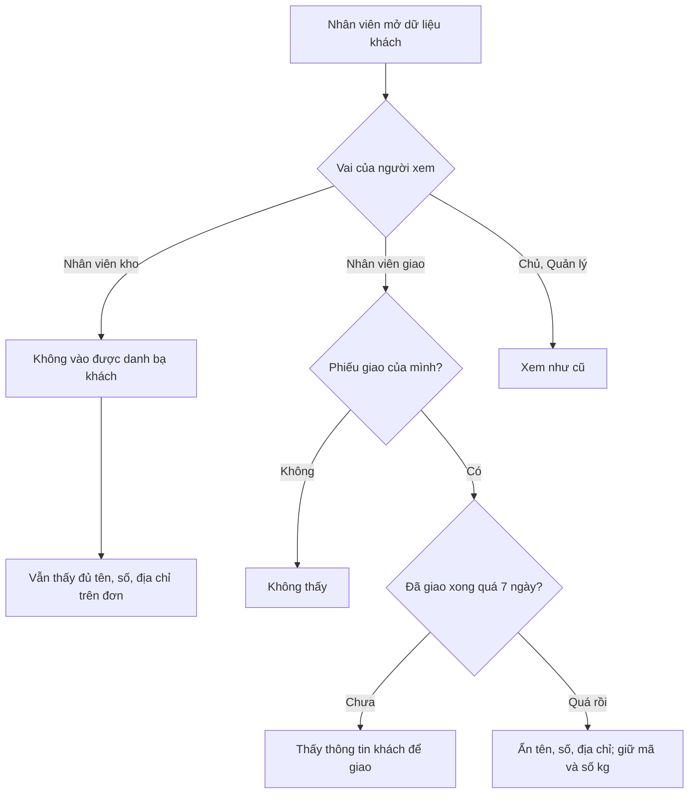

# Phạm vi dữ liệu khách theo vai (luồng NHANH)
> Điều phối · 2026-10-01 · Trạng thái: **XONG** (QA APPROVED, merge `fa789a2`, staging `aeab0f1`; Duy chốt 01/10, xem `doc/features/2026-09-30-ra-soat-agy/q1-pii-xac-minh.md`)
> Nguồn: QA P8b Lô 1 (Q1-PII) → techlead xác minh → Duy trả lời Q-1/Q-2/Q-3. Bất biến 9 (skill caveve-domain).

## Quyết định của Duy (01/10)
- Q-1: NV kho **không cần** danh bạ khách.
- Q-2: NV kho **giữ SĐT đầy đủ** ở màn Đơn hàng / phiếu giao.
- Q-3: NV giao xem dữ liệu khách của phiếu **đã giao xong** trong **7 ngày**, sau đó ẩn.

## SR-PII-01 — NV kho không xem danh bạ khách
- **AC1.** Migration quyền (data migration, chỉ đổi gán quyền, không đổi bảng) gỡ `sales.view_customer` khỏi Group `nv_kho`. Group khác không đổi.
- **AC2.** `nv_kho` gọi `GET /api/sales/customers/` và `GET /api/sales/customers/<id>/` → 403. `chu`, `quan_ly` như cũ; `nv_giao`, `cskh` như cũ.
- **AC3.** `nv_kho` vẫn thấy tên, **SĐT đầy đủ**, địa chỉ ở `GET /api/sales/orders/…` và `GET /api/delivery/notes/…` như hiện tại (Q-2), màn ERP Đơn hàng / Soạn hàng của NV kho vẫn chạy.
- **AC4.** Migration chạy lại không lỗi (idempotent); rollback trả lại quyền.

## SR-PII-02 — NV giao chỉ xem dữ liệu khách của phiếu đã giao trong 7 ngày
- **AC1.** Setting `DELIVERY_PII_RECENT_DAYS` (mặc định `7`, tên tiếng Anh, đọc env).
- **AC2.** Phiếu giao của `nv_giao` ở trạng thái kết thúc (đã giao / thất bại kết thúc / huỷ) quá 7 ngày tính từ lúc kết thúc (giờ VN): ở `delivery/notes`, `sales/orders`, `sales/customers` của `nv_giao`, các trường tên, SĐT, địa chỉ, ghi chú khách **không trả** (bỏ khoá hoặc `null` — chọn một, thống nhất, ghi rõ). Mã đơn, mã phiếu, trạng thái, số kg vẫn trả để NV giao xem lịch sử.
- **AC3.** Phiếu đang giao hoặc kết thúc ≤ 7 ngày: như cũ.
- **AC4.** `nv_giao` không còn thấy `note`, `default_address` của khách ở `GET /api/sales/customers/` (chỉ thông tin cần để giao của chính đơn) — dùng serializer riêng cho `nv_giao` nếu cần.
- **AC5.** Phạm vi cũ giữ: `nv_giao` chỉ thấy khách/đơn của phiếu gán cho mình (404 ngoài phạm vi).

## Chung
- Ma trận Group (`chu`, `quan_ly`, `nv_kho`, `nv_giao`, `cskh`, khách) cho 3 endpoint; test quét sentinel PII giả, đếm 200 > 0.
- Không đổi contract khoá JSON cho các vai khác. Định danh code mới tiếng Anh (chạy `python3 scripts/check_naming.py`).
- Migration đặt số **trước** migration P8b Lô 4 (`accounts/0012_…`); P8b Lô 4 sẽ dùng số kế tiếp.
- Giờ theo `timezone.localdate()/localtime()` (giờ VN).
