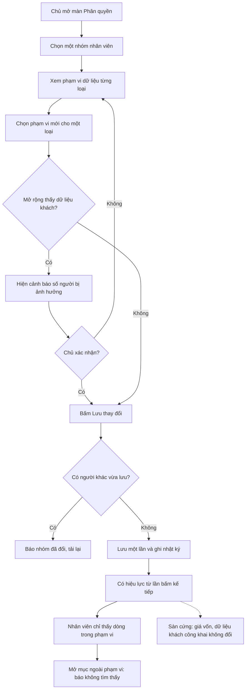

# Phạm vi dữ liệu cấu hình được (Tầng 3 trong màn Phân quyền) — Phân tích nghiệp vụ
> BA · 2026-10-02 · Trạng thái: **ĐÃ DUYỆT (Duy 02/10/2026)** — câu trả lời do điều phối viên chuyển lại, ghi ở
> mục "Câu trả lời của Duy" và §10.
>
> Gộp việc #9, #12 và #13 trong `doc/features/2026-10-01-erp-theo-design/00-can-duy-quyet.md` (bảng "Duy trả lời",
> 02/10 chiều). Hồ sơ này **mở rộng ma trận phân quyền B4 (Lô 14, BR-PQ-32)**. Nó không tạo vai mới và không thay
> 5 nhóm có sẵn. Hồ sơ `2026-09-28-vai-tro-tu-dinh-nghia` (chưa duyệt, mới có 01) đã đề xuất ý tương tự ở BR-PQ-29.
> Hồ sơ này làm phần đó trước, trên 5 nhóm hiện có, và không phụ thuộc vai tự tạo.

## Câu trả lời của Duy (02/10/2026, qua điều phối viên)

| Câu | Duy chốt | Hệ quả áp vào bản phân tích |
|---|---|---|
| Q-1 | Phạm vi tính **theo nhóm**. Người thuộc nhiều nhóm lấy phạm vi **rộng nhất**. | §4.1, BR-PQ-34 giữ như viết. |
| Q-2 | Danh mục D1–D8 và các lựa chọn ở §4.2 là **đủ**. | §4.2 là danh mục chính thức. |
| Q-3 | (a) Lúc bật tính năng, NV kho giữ phạm vi Phiếu nhập **"Tất cả"**. (b) Phạm vi áp cho **cả xem lẫn sửa**. | D6 mặc định (a) cho mọi nhóm. Huỷ phiếu giữ luật cũ (người tạo hoặc Quản lý/Chủ). PO sửa dòng `warehouse_staff` trên PurchaseReceipt ở spec §1.6 theo §6.1. |
| Q-4 | **Gộp** thành việc V2 "Xem thông tin khách trên đơn & hoá đơn", **mặc định bật cho NV kho**. | V2 bật cho Q, K, G, C. Hoá đơn của NV kho sẽ hiện tên khách: đây là thay đổi **đã được duyệt**, là ngoại lệ duy nhất của test ảnh chụp trước = sau (UC-5). |
| Q-5 … Q-10 | Giữ các mặc định PA. Duy không phản đối. | Như §10. Riêng Q-10: điều phối viên sẽ đề nghị Duy ghi dòng vào `decisions.md`; BA không sửa file đó. |

## 1. Yêu cầu gốc

Duy (PO), 02/10/2026 chiều, nguyên văn:
- #9: "cái này dính phần quyền đó, phân quyền user/ record, chỉ xem của mình, có phải là phân quyền config, chứ ko được hard"
- #12: "lại cũng là câu chuyện phân quyền, phân cho thì được coi, ko phân ko được coi thôi, đâu cần phải hard"
- #13: "phân quyền tùy người admin quyết ko hard sẵn"

Bối cảnh của từng câu:
- #9: spec §1.6 ghi NV kho bị giới hạn phiếu nhập "của mình, trong ngày", nhưng code cho ai có quyền xem phiếu nhập
  thấy mọi phiếu.
- #12: NV kho có được xem Hoá đơn bán và tên khách trên hoá đơn không.
- #13: có chặn bật "Xem khách hàng" cho NV giao và CSKH không. Duy trả lời là không chặn, admin quyết.

## 2. Tóm tắt

**Chủ** cần **chọn phạm vi dòng cho từng nhóm trên từng loại dữ liệu** ("Tất cả", "Được gán cho tôi", "Do tôi tạo"…)
và **bật/tắt quyền xem Hoá đơn bán và thông tin khách trên chứng từ** ngay trong màn Phân quyền (W3i), để **tổ chức
việc xem dữ liệu theo cách vựa đang chạy mà không phải nhờ dev sửa code**. Hệ thống vẫn giữ một **sàn cứng** mà cấu
hình không vượt được: giá vốn, API công khai, AI, log và cửa sổ dữ liệu khách của người giao (§6.2).

Nguyên tắc chuyển đổi: **ngày bật tính năng, không ai thấy nhiều hơn hay ít hơn hôm trước.** Giá trị mặc định của mọi
ô phạm vi bằng đúng hành vi code hiện nay (§4.2, cột "Mặc định = hiện trạng").

## 3. Bối cảnh trong hệ thống

- **Quy trình**: §1 Phân quyền (spec §1.2–§1.6). Đụng gián tiếp P-02 (phiếu nhập), P-05 (đơn, hoá đơn), P-06 (phiếu
  giao, gọi xác nhận), P-08 (hàng hoàn).
- **Rule hiện có**: BR-PQ-12 (phạm vi nằm ở queryset/serializer, không ở giao diện), BR-PQ-13 (test bằng token từng
  nhóm), BR-PQ-15 (không lộ giá vốn), BR-PQ-32 (ma trận việc, việc "Chỉ Chủ", T9), BR-GH-18 (phạm vi dữ liệu khách
  của CSKH), SR-PII-01/02 (danh bạ khách; cửa sổ dữ liệu khách của người giao, `DELIVERY_PII_RECENT_DAYS`).
- **Quyết định ràng buộc**:
  - decisions 2026-09-10 "Phân quyền 3 tầng": T3 = `get_queryset` + serializer "tách theo Group". Hồ sơ này **giữ**
    ba tầng. Nó chỉ đổi *nguồn* của luật T3 từ tên nhóm viết trong code sang cấu hình theo nhóm. Đây không phải lật
    quyết định, nhưng câu chữ "tách theo Group" nên được Duy ghi lại cho rõ (xem Q-10).
  - decisions 2026-09-10: ranh giới Chủ ↔ Quản lý; giá vốn và lãi lỗ chỉ Chủ (giữ nguyên, §6.2 S-1).
  - Duy 02/10 #6 (tự duyệt kiểm kê theo phân quyền, "cứ event là được") và #13 cùng một hướng: **Duy muốn cấu hình
    thay vì luật cứng, đổi lại phải ghi sự kiện đầy đủ.** Hồ sơ này theo hướng đó, trừ các sàn ở §6.2.

### 3.1 Hiện trạng code (grep 2026-10-02)

Tầng 1 và Tầng 2 đã cấu hình được qua ma trận B4. **Tầng 3 vẫn viết cứng theo tên nhóm.** Màn W3i hiện phạm vi bằng
bảng chữ cố định, chỉ đọc.

| Đối tượng | Luật đang chạy | Nguồn | Ghi chú |
|---|---|---|---|
| Nhóm "thấy hết" | `FULL_SCOPE_GROUPS = {owner, manager, warehouse_staff}` + superuser | `common/api.py::has_full_delivery_scope` | Một danh sách tên nhóm quyết định phạm vi của Đơn, Hoá đơn, Phiếu giao, Hàng hoàn, cửa sổ dữ liệu khách. Khoảng 34 chỗ gọi trong 14 file. |
| Đơn hàng | Thấy hết → tất cả. CSKH → đơn có phiếu gán cho mình **hoặc** trong phạm vi gọi. Người khác (NV giao, người có quyền gán trực tiếp) → đơn có phiếu gán cho mình | `sales/orders/scope.py::scope_orders_for` | Dùng chung cho danh sách, chi tiết, "Tiếp theo · Đã làm", lệnh "Nhờ". |
| Hoá đơn bán (dòng) | Đi theo phạm vi Đơn hàng | `sales/payments/invoice_list.py::scope_invoices_for` | |
| Tên khách trên hoá đơn bán | Chỉ người có `sales.view_customer_list` ("Xem khách hàng"), và còn trong cửa sổ | `sales/payments/serializers.py` (M1) | **NV kho thấy dòng hoá đơn nhưng tên để trống.** |
| Tên + SĐT khách trên **danh sách đơn** | Nhóm thấy hết → luôn hiện. Người khác → hiện khi còn trong cửa sổ | `sales/orders/serializers.py::pii_hidden` | **Lệch với hoá đơn:** NV kho thấy tên và SĐT ở danh sách đơn, nhưng không thấy tên ở hoá đơn của chính đơn đó. |
| Phiếu giao | Thấy hết → tất cả; còn lại → `assigned_to = user` | `delivery/api.py::get_queryset` | **CSKH chỉ thấy phiếu gán cho mình**, trong khi W3i ghi phiếu giao của CSKH là "Trong phạm vi gọi". Màn đang mô tả sai code (cần Tech Lead xác minh). |
| Dữ liệu khách trên phiếu giao (cửa sổ) | Người không thấy hết: ẩn tên/SĐT/địa chỉ khi phiếu đã kết thúc quá N ngày (`DELIVERY_PII_RECENT_DAYS`, mặc định 7) | `delivery/pii_scope.py` (SR-PII-02) | Tham số lấy từ settings/env. |
| Gọi xác nhận (chi tiết, nhận việc, ghi cuộc gọi) | Thấy hết → tất cả. CSKH → phiếu CONFIRMING có việc gọi đang mở, **hoặc** phiếu mình đã gọi trong `CONFIRMATION_PII_RECENT_DAYS` ngày. Ngoài phạm vi → 404 | `delivery/confirmation/scope.py` (BR-GH-18) | Danh sách hàng chờ không lọc dòng, nhưng SĐT ngoài phạm vi chỉ trả bản che (`phone_masked`). |
| Hàng hoàn về kho | Thấy hết → tất cả; còn lại → phiếu của phiếu giao gán cho mình. Ngoài phạm vi → 404 | `inventory/returns/scope.py` | Dùng chung cho API và dòng thời gian. |
| Danh bạ khách (màn mới) | Có `sales.view_customer_list` → **mọi** khách, không phạm vi dòng | `sales/customers/directory_api.py` | #13: Duy giữ cách này. |
| Khách (API cũ `/customers/`) | Theo **tên nhóm** `{owner, manager}` (`sees_customer_directory`), không theo quyền | `sales/customers/api.py` | **Hai cơ chế cho cùng một dữ liệu**, nợ đã ghi ở 00-can-duy-quyet (gom về một hàm). |
| Phiếu nhập | **Không lọc dòng.** Huỷ phiếu: người tạo, hoặc Quản lý/Chủ | `purchasing/receipts/api.py`, `receipts/services.py` | Spec §1.6 ghi NV kho "chỉ **sửa** phiếu do chính mình tạo, **trong ngày**". Spec nói **sửa**, việc #9 ghi **xem**. Xem Q-3. |
| Phạm vi hiện trên W3i | `GROUP_SCOPES`: bảng chữ cố định, chỉ đọc; riêng "Khách hàng" tính theo quyền | `accounts/capabilities/registry.py` | Màn thiết kế W3i có các dòng: Đơn hàng, Khách hàng, Phiếu giao, Phiếu nhập, Nhật ký hoạt động. |

Kiểm kê, lô, sổ nhập xuất, nhà cung cấp: không có phạm vi dòng (ai có quyền xem thì thấy hết). Hồ sơ này không đổi
các đối tượng đó (§9).

## 4. Tác nhân & quyền

| Tác nhân | Group | Làm được gì | Quyền cần |
|---|---|---|---|
| Chủ (Lộc) | `owner` | Xem và đổi phạm vi dữ liệu của các nhóm khác `owner`. Bật/tắt việc "Xem hoá đơn bán", "Xem thông tin khách trên đơn & hoá đơn" | Như ghi ma trận B4 hiện nay: `actor_is_owner` + `manage_staff` |
| Duy | superuser | Như Chủ; superuser luôn thấy tất cả | superuser |
| Quản lý | `manager` | Xem phạm vi của nhóm mình ở "Quyền của tôi". Không đổi được | — |
| NV kho, NV giao, CSKH | `warehouse_staff`, `delivery_staff`, `customer_service` | Làm việc trong phạm vi được cấu hình; xem phạm vi của mình | — |
| Hệ thống | — | Áp phạm vi ở **mọi** đường đọc. Khởi tạo cấu hình mặc định bằng hiện trạng. Ghi AuditLog | — |

### 4.1 Mô hình: nhóm × đối tượng → một giá trị phạm vi

- Mỗi **nhóm** (trừ `owner`) có **một giá trị phạm vi cho mỗi đối tượng** ở §4.2. Chủ chọn trong danh sách cố định
  của đối tượng đó, không gõ luật tự do.
- Phạm vi chỉ **lọc dòng** trong phần người đó đã được xem. Nó không cấp quyền xem. Muốn thấy Đơn hàng thì nhóm vẫn
  phải bật việc "Xem đơn" (Tầng 1). Tắt "Xem đơn" thì ô phạm vi Đơn hàng hiện mờ, kèm chữ "Không xem".
- Người ở **nhiều nhóm** nhận phạm vi **rộng nhất** trong các nhóm của mình, đúng tinh thần cộng dồn (spec §1.3).
  Ví dụ: người vừa là NV kho (Đơn: Tất cả) vừa là NV giao (Đơn: Được gán) thấy tất cả đơn. Đây cũng là hành vi hôm nay.
- Phạm vi áp như nhau cho xem, sửa và thao tác trên dòng đó. Ngoài phạm vi thì trả **404**, không phải 403, để không
  lộ việc dòng có tồn tại (như hiện nay).

### 4.2 Danh mục đối tượng cần phạm vi cấu hình

Ký hiệu nhóm: **Q** Quản lý · **K** NV kho · **G** NV giao · **C** CSKH. Chủ luôn "Tất cả" và bị khoá (§6.2 S-5).

| # | Đối tượng (nhãn trên màn) | Các lựa chọn phạm vi | Mặc định = hiện trạng | Áp cho cả |
|---|---|---|---|---|
| D1 | **Đơn hàng** | (a) Tất cả đơn · (b) Đơn có phiếu giao gán cho tôi · (c) Đơn có phiếu gán cho tôi **hoặc** trong phạm vi gọi xác nhận | Q, K: (a) · G: (b) · C: (c) | Danh sách, chi tiết, "Tiếp theo · Đã làm", dòng thời gian đơn, lệnh "Nhờ", tìm kiếm ⌘K, AI |
| D2 | **Hoá đơn bán** (dòng) | **Không có ô riêng**: luôn theo phạm vi D1 | (theo D1) | Danh sách, chi tiết, tổng tiền |
| D3 | **Phiếu giao** | (a) Tất cả phiếu · (b) Phiếu gán cho tôi | Q, K: (a) · G, C: (b) | Danh sách, chi tiết, "Việc giao của tôi", dòng thời gian phiếu |
| D4 | **Gọi xác nhận** (chi tiết có tên/SĐT/địa chỉ, nhận việc, ghi cuộc gọi) | (a) Mọi phiếu chờ gọi · (b) Phiếu đang chờ gọi **hoặc** tôi đã gọi trong N ngày | Q, K: (a) · C: (b) · G: không áp (không có việc "Gọi xác nhận đơn") | Chi tiết hàng chờ, nhận việc, ghi kết quả gọi |
| D5 | **Hàng hoàn về kho** | (a) Tất cả phiếu · (b) Phiếu của phiếu giao gán cho tôi | Q, K: (a) · G, C: (b) | Danh sách, chi tiết, tạo phiếu (chọn phiếu giao), dòng thời gian |
| D6 | **Phiếu nhập** | (a) Tất cả phiếu · (b) Phiếu do tôi tạo · (c) Phiếu do tôi tạo **trong ngày** (ngày lịch giờ VN theo lúc tạo) | Q, K (và mọi nhóm có việc "Nhập lô tại cảng"): (a) | Danh sách, chi tiết, sửa, gửi ghi nhận. Riêng **huỷ** giữ luật hiện có (người tạo, hoặc Quản lý/Chủ) |
| D7 | **Khách hàng** (danh bạ) | (a) Tất cả khách · (b) Khách của phiếu giao gán cho tôi (trong cửa sổ) · (c) Không xem | Theo việc "Xem khách hàng": bật → (a). Tắt → G: (b), còn lại (c) | Danh bạ, chi tiết khách, dòng thời gian khách, lọc đơn theo khách |
| D8 | **Nhật ký hoạt động** | **Không có ô riêng**: "Tất cả" khi bật việc "Xem nhật ký hoạt động", "Không xem" khi tắt | (theo việc) | Hiện trên W3i cho đủ dòng như thiết kế, chỉ đọc |

Thêm hai **việc** (bật/tắt) vào ma trận B4, mục "Bán hàng". Đây là phần #12:

| # | Việc mới | Nghĩa | Mặc định = hiện trạng |
|---|---|---|---|
| V1 | **Xem hoá đơn bán** | Vào được màn Hoá đơn bán. Dòng theo D2 | Bật cho các nhóm **đang có** quyền xem hoá đơn bán (Tech Lead đọc từ migration: theo spec §1.4 là Chủ, Quản lý, NV kho) |
| V2 | **Xem thông tin khách trên đơn & hoá đơn** (tên, SĐT ở danh sách và chi tiết đơn, tên trên hoá đơn) | Tắt → các ô này trả rỗng, chỉ còn mã đơn, trạng thái, tiền | Duy chốt Q-4 (02/10): bật cho Q, K, G, C; cửa sổ SR-PII-02 vẫn áp cho người không ở phạm vi "Tất cả" |

V2 tách khỏi "Xem khách hàng" (danh bạ) vì hai việc khác nhau. Xem tên khách trên đơn mình đang xử lý khác với lục
được cả danh bạ khách. Hôm nay hai thứ đang dính nhau ở hoá đơn nhưng không dính ở đơn (§3.1).

## 5. Use case

### UC-1 Chủ xem phạm vi dữ liệu của một nhóm
- **Tiền điều kiện**: Chủ đăng nhập, mở Phân quyền → chọn nhóm (W3i).
- **Luồng chính**:
  1. Khối "Phạm vi dữ liệu" liệt kê D1, D3–D8 với giá trị hiện tại. D2 ghi "Theo Đơn hàng". D8 ghi theo việc.
  2. Mỗi dòng có ô chọn với đúng các lựa chọn ở §4.2. Dòng nào nhóm chưa có quyền xem thì hiện mờ, kèm chữ "Không
     xem — bật việc … trước".
  3. Dòng thời gian của nhóm có thêm các sự kiện đổi phạm vi.
- **Luồng thay thế**: 1a. Nhóm `owner` → mọi dòng "Tất cả", khoá, kèm chữ "Chủ luôn thấy tất cả".
- **Ngoại lệ**: người không phải Chủ gọi API → 403 (như B4).
- **Hậu điều kiện**: không đổi dữ liệu.

### UC-2 Chủ đổi phạm vi của một đối tượng cho một nhóm
- **Tiền điều kiện**: như UC-1; nhóm khác `owner`.
- **Luồng chính**:
  1. Chủ chọn giá trị mới, ví dụ Phiếu nhập của NV kho: "Tất cả" → "Do tôi tạo trong ngày".
  2. Nếu thay đổi **mở rộng** phạm vi có dữ liệu khách (D1, D3, D4, D5, D7, hoặc bật V2), hệ thống hiện cảnh báo trước
     khi lưu: "N người trong nhóm sẽ thấy tên, SĐT, địa chỉ khách của mọi đơn", kèm tên nhân viên (không có dữ liệu
     khách). Chủ phải xác nhận.
  3. Chủ bấm "Lưu thay đổi" (cùng nút với việc). Hệ thống lưu mọi thay đổi trong một lần: hợp lệ toàn bộ hoặc không
     đổi gì, như B4.
  4. Ghi AuditLog: ai, nhóm, đối tượng, giá trị trước → sau. Không có dữ liệu khách.
  5. **Hiệu lực từ request kế tiếp** của mọi người trong nhóm. Không cần đăng nhập lại.
- **Luồng thay thế**:
  - 2a. Thu hẹp phạm vi (ví dụ G: "Phiếu gán cho tôi" vẫn giữ; K: Phiếu nhập → "Do tôi tạo"): không cảnh báo dữ liệu
    khách. Nếu thu hẹp làm người trong nhóm mất dòng họ đang xử lý (ví dụ phiếu nhập Nháp do người khác tạo), hiện
    số phiếu bị ảnh hưởng (Q-9).
  - 2b. Người trong nhóm cũng ở nhóm khác có phạm vi rộng hơn → hiện ghi chú "X vẫn thấy tất cả nhờ nhóm Y".
- **Ngoại lệ**:
  - Giá trị không thuộc danh sách của đối tượng, đối tượng lạ, hoặc đổi nhóm `owner` → 400, không lưu gì.
  - Hai người lưu cùng lúc trên cùng nhóm → người lưu sau được báo "nhóm đã đổi, tải lại" và không ghi đè (Q-8).
  - Không ghi được AuditLog → không lưu (theo mẫu BR-PQ-05).
- **Hậu điều kiện**: chứng từ không đổi. Người thực hiện cũ trên chứng từ giữ nguyên (BR-PQ-03).

### UC-3 Nhân viên làm việc trong phạm vi đã cấu hình
- **Tiền điều kiện**: nhân viên đăng nhập, nhóm đã có cấu hình.
- **Luồng chính**:
  1. Mở danh sách (Đơn, Phiếu giao, Phiếu nhập, Hàng hoàn, Hoá đơn bán…): chỉ thấy dòng trong phạm vi. Tổng số và tổng
     tiền ở cuối danh sách cũng chỉ tính dòng trong phạm vi.
  2. Mở chi tiết, dòng thời gian, khối "Tiếp theo · Đã làm", tìm ⌘K, hỏi Trợ lý AI: cùng một phạm vi.
  3. Ô thông tin khách hiện hay rỗng theo V2, D7 và cửa sổ SR-PII-02.
- **Luồng thay thế**: 1a. Phiếu nhập phạm vi "trong ngày": sang 00:00 giờ VN thì phiếu hôm qua biến khỏi danh sách.
  Nếu phiếu còn Nháp thì nhân viên phải nhờ Quản lý (spec §1.6 "qua ngày phải nhờ Quản lý").
- **Ngoại lệ**:
  - Gõ thẳng URL hoặc id ngoài phạm vi → 404.
  - Đang mở trang thì Chủ thu hẹp phạm vi → lần bấm kế tiếp nhận 404 hoặc danh sách ngắn lại. Màn báo "Bạn không còn
    quyền xem mục này". Không lỗi trắng trang.
  - Phiếu nhập "trong ngày": nhân viên đang sửa lúc 23:59, lưu lúc 00:01 → bị chặn. Phiếu không mất (Q-3).
- **Hậu điều kiện**: không đổi dữ liệu.

### UC-4 Chủ bật/tắt "Xem hoá đơn bán" (V1) và "Xem thông tin khách trên đơn & hoá đơn" (V2)
- Như cách bật/tắt việc ở B4: AuditLog `change_group_capabilities`, hiệu lực ngay.
- Bật V2 cho nhóm đang có phạm vi đơn hẹp → chỉ thấy khách của đơn trong phạm vi, vẫn theo cửa sổ.
- **Ngoại lệ**: V1 bật mà "Xem đơn" tắt → vẫn cho, vì hoá đơn có màn riêng. Dòng hoá đơn lúc đó theo D1. D1 mờ nhưng
  vẫn giữ giá trị (Q-7).

### UC-5 Hệ thống khởi tạo cấu hình một lần (chuyển đổi)
- **Luồng chính**:
  1. Ghi giá trị mặc định cho 4 nhóm Q, K, G, C theo cột "Mặc định = hiện trạng" ở §4.2.
  2. Thay mọi chỗ kiểm tên nhóm (`FULL_SCOPE_GROUPS`, `sees_customer_directory`, `is_customer_service` trong phạm vi,
     `GROUP_SCOPES`) bằng đọc cấu hình.
  3. Chạy test "ảnh chụp trước = sau": với mỗi tài khoản mẫu của 5 nhóm và một tài khoản kiêm nhiệm (K + G), danh sách
     id nhìn thấy ở mọi endpoint của §4.2 phải giống hệt trước khi chuyển.
- **Ngoại lệ**: ảnh chụp lệch → dừng, không phát hành. Riêng V2 ở hoá đơn cho NV kho (hiện tên khách) là thay đổi
  Duy đã duyệt 02/10 (Q-4), test ghi rõ ngoại lệ này.
- **Hậu điều kiện**: W3i hiện đúng hành vi thật. Hết lỗi màn ghi phiếu giao của CSKH là "Trong phạm vi gọi" (§3.1).

### UC-6 Người không thuộc nhóm nào / nhóm không có cấu hình
- User được gán quyền trực tiếp (không Group), hoặc thiếu cấu hình cho một đối tượng → **phạm vi hẹp nhất** của đối
  tượng đó (đóng khi nghi ngờ). Đây là hành vi hôm nay ("User khác… như NV giao", `orders/scope.py`).

## 6. Business rule

### 6.1 Bảng rule

Mã BR-PQ-20…30 đã được hồ sơ `vai-tro-tu-dinh-nghia` (chưa duyệt) dùng để đề xuất. BR-PQ-31 và BR-PQ-32 đã dùng ở
hồ sơ `erp-theo-design`. Hồ sơ này bắt đầu từ **BR-PQ-33** để không trùng mã.

| Mã | Nội dung | Nhãn | Mới / Sửa / Giữ |
|---|---|---|---|
| BR-PQ-33 | Phạm vi dòng (Tầng 3) của các đối tượng ở §4.2 là **cấu hình theo nhóm × đối tượng**, chọn trong danh sách cố định của đối tượng. Code không kiểm tên nhóm để quyết phạm vi. | **(D) Duy 02/10** #9, #12, #13 | **Mới** |
| BR-PQ-34 | Phạm vi chỉ lọc dòng trong phần đã có quyền xem (Tầng 1). Không phạm vi nào cấp quyền xem. Người nhiều nhóm nhận phạm vi **rộng nhất**. Người không nhóm, hoặc thiếu cấu hình, nhận phạm vi **hẹp nhất**. | PA (cộng dồn spec §1.3; đóng khi nghi ngờ) | **Mới** |
| BR-PQ-35 | Một đối tượng có **một** hàm phạm vi, dùng chung cho mọi đường đọc: danh sách, chi tiết, tổng, dòng thời gian, "Tiếp theo", tìm kiếm, AI, xuất file. Ngoài phạm vi → 404. | Mở rộng BR-PQ-12 | **Mới** |
| BR-PQ-36 | Đổi phạm vi hoặc bật/tắt V1, V2: chỉ Chủ, nhóm `owner` khoá "Tất cả", hiệu lực từ request kế tiếp, ghi AuditLog (nhóm, đối tượng, trước → sau, không dữ liệu khách). Không ghi được log thì không lưu. Mở rộng phạm vi có dữ liệu khách phải xác nhận cảnh báo. | PA theo B4 + BR-PQ-05 + bất biến 9 | **Mới** |
| BR-PQ-37 | Hoá đơn bán: việc "Xem hoá đơn bán" bật/tắt được. Dòng hoá đơn luôn theo phạm vi Đơn hàng. | (D) Duy 02/10 #12 | **Mới** |
| BR-PQ-38 | Thông tin khách (tên, SĐT) trên đơn và hoá đơn hiện theo việc "Xem thông tin khách trên đơn & hoá đơn". Việc này tách khỏi "Xem khách hàng" (danh bạ). | (D) Duy 02/10 #12 + PA tách | **Mới** |
| BR-PQ-32 | Ma trận việc theo nhóm, việc "Chỉ Chủ" (T9). Thêm 2 việc V1, V2 (không "Chỉ Chủ"). | D (Lô 14) | **Sửa** (thêm việc) |
| spec §1.6 dòng `warehouse_staff` trên PurchaseReceipt | Thay "chỉ sửa phiếu do mình tạo, trong ngày" (luật cứng) bằng "theo phạm vi Phiếu nhập của nhóm (D6). Mặc định Tất cả" | (D) Duy 02/10 #9 | **Sửa** — Duy chốt Q-3 (02/10): mặc định "Tất cả", áp cho xem và sửa. PO ghi vào spec |
| SR-PII-02 | Cửa sổ dữ liệu khách của người không ở phạm vi "Tất cả" (`DELIVERY_PII_RECENT_DAYS`) **không** nằm trong ma trận. Chỉ đổi qua tham số hệ thống. | PA (sàn S-4) | Giữ |
| BR-GH-18 | Phạm vi dữ liệu khách của CSKH thành lựa chọn D4(b) / D1(c), không còn gắn với tên nhóm `customer_service`. | (D) Duy 02/10 | **Sửa** (nguồn luật) |
| #13 (Duy 02/10) | Bật "Xem khách hàng" cho nhóm nào là do Chủ quyết, không chặn cứng. Có cảnh báo (BR-PQ-36). | (D) | Giữ |

### 6.2 Sàn cứng: cấu hình không vượt được

| # | Sàn | Vì sao khoá | Duy cho cấu hình? |
|---|---|---|---|
| S-1 | **Giá vốn, lãi lỗ chỉ theo việc "Chỉ Chủ"** (`view_cost`, `view_profit`, T9). Phạm vi dòng không bao giờ mở cột giá vốn. Dòng "Tất cả phiếu nhập" vẫn ẩn giá mua với người không có "Xem giá vốn". | Bất biến 1, decisions 10/09 | **Khoá** (đã chốt, không lật) |
| S-2 | **API công khai (Shop, tra đơn) không bao giờ trả tên, SĐT, địa chỉ đầy đủ.** Ma trận chỉ áp cho ERP. | Bất biến 9 | **Khoá** |
| S-3 | **AI và log**: phạm vi rộng hơn không làm AI được gửi thêm dữ liệu khách ra ngoài, không đưa dữ liệu khách vào log hay AuditLog. AI đọc trong phạm vi của người dùng và vẫn theo luật hiện có (không ghi chú chữ tự do, không dữ liệu khách trong ngữ cảnh). | Bất biến 9 | **Khoá** |
| S-4 | **Cửa sổ dữ liệu khách của người giao** (SR-PII-02, 7 ngày) và cửa sổ CSKH (`CONFIRMATION_PII_RECENT_DAYS`): áp cho mọi nhóm không ở "Tất cả". Số ngày là tham số hệ thống, không có ô trên ma trận. | Bất biến 7 (tham số đọc từ settings), bất biến 9 | **Đề xuất khoá** (Q-5) |
| S-5 | Nhóm `owner` luôn "Tất cả", không sửa được (GROUP_LOCKED). Superuser luôn tất cả. | B4 | **Khoá** |
| S-6 | Không phạm vi nào cho xoá chứng từ, tạo tay đơn/hoá đơn, sửa AuditLog. | BR-PQ-10/11, bất biến 3, 4 | **Khoá** |
| S-7 | Ngoài phạm vi → 404 (không lộ dòng có tồn tại). Danh sách hàng chờ gọi vẫn chỉ trả SĐT đã che cho dòng ngoài phạm vi. | BR-PQ-12, BR-GH-18 | **Khoá** |
| S-8 | Danh sách lựa chọn của mỗi đối tượng do dự án định nghĩa. Chủ chọn, không gõ luật. | Tránh cấu hình sai không kiểm được | **Khoá** |
| — | Mở rộng phạm vi dữ liệu khách cho NV giao / CSKH (ví dụ D1 "Tất cả đơn", D7 "Tất cả khách") | Duy #13: admin quyết | **Cho cấu hình**, kèm cảnh báo + AuditLog (BR-PQ-36) |
| — | Phạm vi Phiếu nhập, Phiếu giao, Hàng hoàn, Gọi xác nhận, Đơn; bật/tắt Xem hoá đơn bán, Xem thông tin khách | Duy #9, #12 | **Cho cấu hình** |

## 7. Tác động dữ liệu & tích hợp

Chỉ nêu cái gì đổi. Cách làm là việc của Tech Lead (02b).

- **Lưu cấu hình phạm vi**: cần một nơi lưu "nhóm × đối tượng → giá trị". `auth.Group` không có chỗ để lưu, nên gần
  như chắc phải có **bảng mới** (bất biến 8). Lý do: Duy 02/10 #9/#12/#13. Tech Lead chọn hình dạng và ghi lý do
  trong 02b. Giá trị mặc định ghi bằng **data migration** theo §4.2. Không lưu trong env, vì Chủ phải đổi được lúc
  chạy.
- **Danh sách đối tượng và lựa chọn**: đi theo code, cạnh `capabilities/registry.py`, thay `GROUP_SCOPES` cố định.
  Test kiểm: mỗi đối tượng có ít nhất một giá trị "hẹp nhất", mặc định khớp hiện trạng.
- **Quyền mới**: V2 cần một permission Tầng 2 mới (ví dụ xem thông tin khách trên chứng từ). V1 dùng permission xem
  hoá đơn bán đang có. Cả hai thêm vào registry B4 và phải rời nhau với các việc khác (test B4 hiện có).
- **AuditLog**: không đổi schema. Thêm một action đổi phạm vi; `changes` chỉ chứa mã đối tượng và mã giá trị. Dòng
  thời gian nhóm (W3i) hiện "Lộc đổi phạm vi Phiếu nhập: Tất cả → Do tôi tạo trong ngày".
- **Hiệu lực ngay**: không cache cấu hình qua nhiều request, hoặc nếu có cache thì phải xoá khi lưu. "Quyền của tôi"
  (`/api/auth/me/`) có thể thêm key phạm vi (quy ước S47: chỉ thêm key).
- **Thay chỗ đọc tên nhóm**: `has_full_delivery_scope`, `FULL_SCOPE_GROUPS`, `sees_customer_directory`,
  `CUSTOMER_DIRECTORY_GROUPS`, `is_customer_service` (phần phạm vi), `GROUP_SCOPES`. Khoảng 34 chỗ gọi trong 14 file
  (§3.1). Các provider dòng thời gian và "Tiếp theo" đã dùng chung hàm phạm vi nên đi theo.
- **API**: W3i đọc phạm vi có thể sửa được (thay chuỗi chỉ đọc), ghi phạm vi cùng lần lưu với việc. Contract do Tech Lead.
- **Màn hình**: W3i khối "Phạm vi dữ liệu" đổi từ chữ sang ô chọn; W3h (tổng quan) có thể thêm cột tóm tắt phạm vi
  (PA, 🟢). Màn danh sách cần câu báo khi mất quyền giữa chừng (UC-3).
- **Bên thứ ba**: không có.

## 8. Rủi ro Cá Về

| # | Rủi ro | Mức | Cách chặn |
|---|---|---|---|
| R1 | **Rò dữ liệu khách khi Chủ mở rộng phạm vi.** Ví dụ chọn D1 "Tất cả đơn" cho NV giao: mọi NV giao thấy tên, SĐT, địa chỉ của mọi khách, kể cả người đã nghỉ mà chưa khoá tài khoản. | **Critical** (bất biến 9) | Cảnh báo kèm số người bị ảnh hưởng, Chủ phải xác nhận. AuditLog. Mặc định không đổi. Cửa sổ SR-PII-02 vẫn áp cho người không ở "Tất cả" (S-4). Danh bạ khách vẫn đòi "Xem khách hàng" riêng. Gợi ý trên màn: nghỉ việc thì khoá tài khoản (BR-PQ-01). |
| R2 | **Lệch giữa các đường đọc**: danh sách lọc đúng nhưng chi tiết, tổng tiền, dòng thời gian, ⌘K, AI hay xuất file vẫn theo luật cũ, nên lộ qua cửa phụ. | Cao | BR-PQ-35: một hàm phạm vi cho mỗi đối tượng. Test quét theo endpoint: với mỗi giá trị phạm vi, gọi mọi endpoint của đối tượng bằng token và so tập id. |
| R3 | **Chuyển đổi làm đổi hành vi**: có người hôm sau mất dòng đang làm, hoặc thấy thêm dòng. | Cao | UC-5: test ảnh chụp trước = sau, có tài khoản kiêm nhiệm. Dừng nếu lệch. |
| R4 | Kiêm nhiệm lấy "rộng nhất" làm phạm vi hẹp vô tác dụng: người K+G thấy mọi đơn qua K. Chủ tưởng đã thu hẹp NV giao. | Trung bình | Ghi chú 2b ở UC-2 ("X vẫn thấy tất cả nhờ nhóm Y"). |
| R5 | Phiếu nhập "trong ngày" làm kẹt việc: NV kho nhập lúc 23:50, qua 00:00 không gửi ghi nhận được. Lô Nháp nằm chờ, hàng đông lạnh không mở bán được. | Trung bình (hàng/chuỗi lạnh) | Mặc định "Tất cả". Màn báo rõ "nhờ Quản lý". Q-3 hỏi phạm vi áp cho xem hay chỉ sửa. |
| R6 | Leo quyền: người có `manage_staff` mà không phải Chủ đổi phạm vi. | Cao | Chỉ Chủ (như B4, `actor_is_owner`); test 403. |
| R7 | Giá vốn: phạm vi "Tất cả phiếu nhập" lộ giá mua. | Critical | S-1: cột giá vốn vẫn theo `view_costprice`, không theo phạm vi. Test hiện có ở `inventory/batches/tests/test_api.py` mở rộng cho phiếu nhập. |
| R8 | Chứng từ/AuditLog: đổi phạm vi không để lại dấu vết thì không truy được ai đã mở dữ liệu khách. | Cao | BR-PQ-36: không ghi được log thì không lưu. |
| R9 | Hiệu năng: đọc cấu hình mỗi request. Một số hàm phạm vi đã dùng `Exists` lồng (CSKH). | Thấp | Tech Lead đo; cấu hình nhỏ (5 nhóm × 6 đối tượng). |
| R10 | FEFO, tồn kho, tiền: không đụng. | — | — |

## 9. Ngoài phạm vi

- Vai tự định nghĩa và nhóm mới (hồ sơ `2026-09-28-vai-tro-tu-dinh-nghia`). Hồ sơ này chỉ làm trên 5 nhóm có sẵn.
- Phạm vi theo **từng người** (ngoài nhóm), theo kho, theo ca, theo khoảng ngày tuỳ ý (Q-1, 🟢).
- Phạm vi cho kiểm kê, lô, sổ nhập xuất, nhà cung cấp, bài viết: chỉ "Tất cả", thêm sau nếu Duy cần.
- Ẩn/hiện **từng cột** tuỳ ý trên mọi màn (ngoài cột giá vốn đã có và V2).
- Sửa số ngày cửa sổ dữ liệu khách từ màn hình (S-4).
- Gom API khách cũ `/customers/` về hàm quyền chung: nợ đã ghi, nhưng sẽ làm **cùng lúc** ở bước thay chỗ đọc tên
  nhóm (§7) vì đụng đúng hàm đó.

## 10. Câu hỏi mở

Cột "Trả lời" ghi câu chốt của Duy ngày 02/10/2026 (qua điều phối viên). Không còn câu 🔴 mở.

| # | Mức | Câu hỏi | Mặc định PA đề xuất | Trả lời |
|---|---|---|---|---|
| Q-1 | 🔴 | Phạm vi cấu hình **theo nhóm** (giống ma trận việc ở Lô 14) hay **theo từng người**? | **Theo nhóm.** Người nhiều nhóm lấy phạm vi rộng nhất. Muốn một người khác nhóm thì tạo/đổi nhóm. Theo từng người để sau. | **Đã chốt**: theo nhóm, nhiều nhóm lấy rộng nhất. |
| Q-2 | 🔴 | Danh mục đối tượng và lựa chọn ở §4.2 (D1–D8) đã đủ chưa? Có cần thêm lựa chọn nào không, ví dụ Đơn hàng "Do tôi xử lý"? | Dùng đúng §4.2. Mỗi đối tượng chỉ có lựa chọn mà code hôm nay đã chạy được, cộng D6(b)(c). Thêm lựa chọn sau theo yêu cầu. | **Đã chốt**: D1–D8 và lựa chọn ở §4.2 là đủ. |
| Q-3 | 🔴 | Phiếu nhập (#9): (a) ngày bật tính năng NV kho **giữ "Tất cả"** (không đổi hành vi) hay áp ngay "Do tôi tạo trong ngày" như spec? (b) Phạm vi chặn cả **xem**, hay chỉ chặn **sửa/gửi ghi nhận** (spec gốc chỉ nói "sửa")? | (a) **Giữ "Tất cả"**; anh tự đổi trong màn khi muốn. (b) Phạm vi áp cho **xem và sửa** như mọi đối tượng (một luật cho dễ hiểu). Huỷ phiếu giữ luật cũ (người tạo hoặc Quản lý/Chủ). | **Đã chốt**: (a) giữ "Tất cả"; (b) áp cho cả xem lẫn sửa. |
| Q-4 | 🔴 | "Tên khách trên hoá đơn" (#12): hôm nay NV kho thấy tên + SĐT ở **danh sách đơn** nhưng tên **trống ở hoá đơn**. Gộp thành một việc V2 "Xem thông tin khách trên đơn & hoá đơn" không? Nếu gộp thì mặc định cho NV kho là gì? | **Gộp (V2), mặc định bật cho NV kho** (giữ hành vi ở đơn). Hoá đơn của NV kho sẽ hiện tên khách, đây là thay đổi nhỏ vì cùng người đó đã thấy tên ở đơn. Muốn NV kho không thấy khách thì anh tắt V2, khi đó cả đơn lẫn hoá đơn đều trống. | **Đã chốt**: gộp thành V2, mặc định bật cho NV kho. |
| Q-5 | 🟡 | Cửa sổ dữ liệu khách 7 ngày (người giao, CSKH) có cho chỉnh trên màn không? | **Không.** Giữ là tham số hệ thống (S-4). Đây là sàn bảo vệ dữ liệu khách. | Giữ mặc định. |
| Q-6 | 🟡 | Mở rộng phạm vi dữ liệu khách cho NV giao/CSKH: chặn hay chỉ cảnh báo? | **Chỉ cảnh báo + xác nhận + AuditLog**, theo #13 ("admin quyết"). | Giữ mặc định. |
| Q-7 | 🟡 | Bật "Xem hoá đơn bán" (V1) khi "Xem đơn" đang tắt? | Cho. Dòng hoá đơn vẫn theo phạm vi D1 (giá trị được giữ dù D1 hiện mờ). | Giữ mặc định. |
| Q-8 | 🟡 | Hai người lưu cùng nhóm cùng lúc? | Người lưu sau bị báo "nhóm đã đổi, tải lại", không ghi đè. | Giữ mặc định. |
| Q-9 | 🟡 | Thu hẹp phạm vi khi người trong nhóm đang giữ dòng dở dang (phiếu nhập Nháp của người khác, phiếu hoàn chờ duyệt)? | Không chặn. Hiện số dòng bị ảnh hưởng trước khi lưu. Quản lý/Chủ vẫn thấy để xử lý. | Giữ mặc định. |
| Q-10 | 🟡 | decisions 10/09 ghi phạm vi cột "tách theo Group". Hồ sơ này đổi nguồn luật Tầng 3 sang cấu hình, ba tầng giữ nguyên. Anh có muốn ghi một dòng quyết định mới vào `decisions.md` không? | Có. Anh (hoặc điều phối viên theo lời anh) ghi "Tầng 3 cấu hình theo nhóm × đối tượng (02/10)". BA không sửa file đó. | Giữ mặc định. **Điều phối viên sẽ đề nghị Duy** ghi dòng này vào `decisions.md`. Chưa ai sửa file đó. |
| Q-11 | 🟢 | W3h (tổng quan Phân quyền) có hiện cột tóm tắt phạm vi không? | Để PO/FE quyết theo chỗ trống của thiết kế. | Để sau. |
| Q-12 | 🟢 | Phạm vi cho kiểm kê, lô, sổ nhập xuất, nhà cung cấp. | Để sau; hiện chỉ "Tất cả". | Để sau. |

**Việc cho Tech Lead xác minh trước 02b** (không cần Duy):
- Nhóm nào đang có permission xem hoá đơn bán (đọc migration), để V1 khởi tạo đúng.
- Phiếu giao của CSKH: code chỉ cho thấy phiếu gán cho mình, nhưng W3i ghi "Trong phạm vi gọi". Chốt mặc định D3 của C
  theo code (b), rồi sửa chữ trên màn.
- Gọi xác nhận: NV kho và Quản lý hiện không có việc "Gọi xác nhận đơn". Mặc định D4(a) chỉ có nghĩa khi họ được bật
  việc đó.
