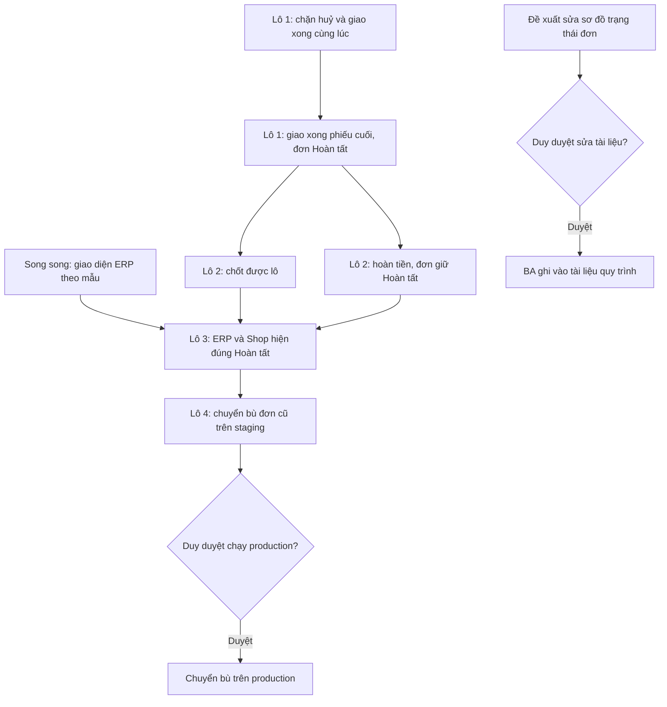
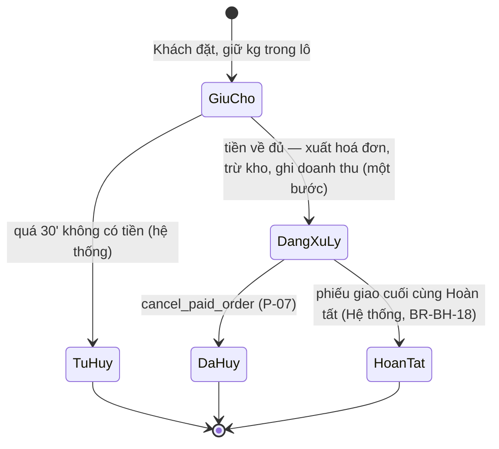

# Đơn hoàn tất (W37) — User stories
> PO · 07/10/2026 · Nguồn: `01-analysis.md` (ĐÃ DUYỆT 07/10, gồm mục "Duy trả lời") · Trạng thái: **ĐÃ DUYỆT (07/10)**



## Mục tiêu & thước đo
NV giao bấm giao xong thì đơn tự sang **Hoàn tất**. Khi đó khách tra đơn thấy đúng kết cục, ERP "Chưa xong" và Tổng quan chỉ
đếm việc còn phải làm, và **lô đã bán qua Shop chốt được** (H1, đang chặn nghiệp vụ).

Đo thành công:
- Sau khi chuyển bù trên staging: số đơn `PROCESSING` có phiếu giao `COMPLETED` = **0**.
- Lãi lỗ theo kỳ và theo lô của **mọi kỳ** trước và sau khi chuyển bù trùng khớp đến từng đồng (BR-BC-06).
- Một lô đã bán qua Shop, đủ điều kiện khác của BR-LO-04, chốt được trên ERP.
- Test đua Huỷ ∥ Giao xong chạy 20 lần không lần nào ra cặp "đơn `CANCELLED` + phiếu `COMPLETED`".

## Phạm vi
**Trong:** BR-BH-18 (kèm khoá chống đua, phần "không ghi đè" của BR-GH-24), BR-BH-19, BR-BH-20, BR-BH-21, BR-BC-06; lệnh chuyển
bù đơn cũ; chốt lô; ERP danh sách, bộ lọc, chi tiết đơn, Tổng quan; Shop tra đơn; đề xuất sửa spec §7.2.

**Ngoài** (theo `01-analysis.md` §9): giao một phần, đổi trả hàng sau khi nhận, tạo phiếu giao thứ hai, COD/cọc, SMS/Zalo báo
khách, báo cáo "đơn hoàn tất theo ngày" (Q10), nút "Hoàn tất đơn" bằng tay (Q8), field mới `SalesOrder.completed_at` (Q6), đổi
nhãn hàng loạt theo mục 4 bảng tên (thuộc lô dọn chữ).

## Quy ước chung cho mọi story
- Tác nhân: **Hệ thống** (`actor=None`), **NV giao** (`delivery_staff`), **Quản lý** (`manager`), **Chủ vựa** (`owner`),
  **NV kho** (`warehouse_staff`), **Khách** (không đăng nhập).
- Dữ liệu trong test và ví dụ là dữ liệu giả (mã `DH-QA-xxxx`, `PG-QA-xxxx`, SĐT `0900000xxx`). Không dùng dữ liệu thật.
- AuditLog của đơn **không chép** tên, SĐT, địa chỉ khách hay ghi chú tự do (bất biến 9). Chỉ ghi mã đơn, mã phiếu, `from`/`to`.
- Giờ hiển thị theo Asia/Ho_Chi_Minh, DB lưu UTC.
- Tên định danh trong code là tiếng Anh (lệnh, hằng, khoá JSON). Tên dưới đây chỉ là gợi ý, Tech Lead chốt ở `02b`.

---

## S1 — Giao xong phiếu cuối thì đơn tự Hoàn tất · Must · BE
**Là** Chủ vựa, **tôi muốn** đơn tự sang Hoàn tất khi NV giao bấm giao xong phiếu cuối cùng, **để** đơn đã giao không còn nằm
trong việc cần làm và không ai phải bấm thêm nút nào.

Bối cảnh: UC-1, UC-2, UC-4. Duy chốt Q1 = A ("nhân viên giao xong là đơn hoàn tất"), Q7 (Hệ thống ghi), Q8 (không có nút tay).
Điểm chuyển duy nhất của phiếu sang `COMPLETED` là `delivery/services.py:advance_status`. Đơn đổi **trong cùng giao dịch**.

| Mã | Given | When | Then | BR |
|---|---|---|---|---|
| S1-AC1 | Đơn `PROCESSING`, hoá đơn `ISSUED`, một phiếu giao `DELIVERING` gán cho NV giao A | A gọi `POST /api/delivery/notes/{id}/status/` `{to_status: COMPLETED, from_status: DELIVERING}` | 200; phiếu `COMPLETED`, `completed_at` có giá trị; đơn `COMPLETED` | BR-BH-18 |
| S1-AC2 | Như S1-AC1 | A bấm giao xong | Có **đúng một** dòng AuditLog cho đơn: `actor` = Hệ thống, `changes` gồm `from: PROCESSING`, `to: COMPLETED`, mã phiếu giao gây ra. Dòng AuditLog của phiếu vẫn ghi người bấm là A như hiện nay. `detail`/`changes` của dòng đơn không chứa SĐT, địa chỉ hay tên khách | BR-PQ-04/05, BR-BH-18 |
| S1-AC3 | Như S1-AC1 | A bấm giao xong | Hoá đơn, `StockLedgerEntry`, `*LineBatch`, chứng từ đảo, phiếu hoàn tiền **không** có dòng mới hay đổi trường nào. Doanh thu hôm nay ở Tổng quan và lãi lỗ kỳ hiện tại trước/sau bằng nhau | BR-BH-19, BR-BC-06 |
| S1-AC4 (lặp) | Phiếu đã `COMPLETED`, đơn đã `COMPLETED` | A gửi lại đúng yêu cầu S1-AC1 (mạng rớt, gửi lại) | 200, `already: true`; số dòng AuditLog của phiếu và của đơn **không tăng** | BR-BH-18 (E2) |
| S1-AC5 (thất bại) | Đơn `PROCESSING`, phiếu `DELIVERING` | A báo giao thất bại (`to_status: FAILED` kèm lý do) | Phiếu `FAILED`; đơn **giữ `PROCESSING`**; không có AuditLog đổi trạng thái đơn | BR-BH-18 (UC-2), BR-GH-04 |
| S1-AC6 (giao lại) | Phiếu `FAILED` rồi được chuyển lại `DELIVERING` | A bấm giao xong | Đơn `COMPLETED` như S1-AC1 | BR-BH-18 (UC-2a) |
| S1-AC7 (nhiều phiếu) | Hoá đơn có hai phiếu: P1 `DELIVERING`, P2 `FAILED` (dữ liệu dựng trong test, V1 chưa sinh) | P1 sang `COMPLETED` | Đơn **giữ `PROCESSING`** | BR-BH-18 (UC-4) |
| S1-AC8 (nhiều phiếu) | Hoá đơn có P1 `COMPLETED`, P2 `CANCELLED`, P3 `DELIVERING` | P3 sang `COMPLETED` | Đơn `COMPLETED` (phiếu huỷ không tính, có ít nhất một phiếu `COMPLETED`) | BR-BH-18 (UC-4) |
| S1-AC9 (rollback) | Như S1-AC1; test giả lập lỗi khi lưu đơn | A bấm giao xong | API trả lỗi; phiếu **vẫn `DELIVERING`**, `completed_at` rỗng; đơn `PROCESSING`; không có AuditLog mới | BR-BH-18 (E3) |
| S1-AC10 (đơn không ở `PROCESSING`) | Đơn ở `PAID` (chỉ có ở `seed_demo`) hoặc `COMPLETED` sẵn | Phiếu của đơn sang `COMPLETED` | Đơn **không** đổi trạng thái, không ghi AuditLog đơn. Chỉ `PROCESSING` mới sang `COMPLETED` | BR-BH-18, BR-BH-21 |
| S1-AC11 (quyền) | NV giao B **không** được gán phiếu | B gọi API giao xong phiếu đó | 404 như hiện nay; phiếu và đơn không đổi | BR-GH-06, BR-PQ-12 |
| S1-AC12 (quyền) | Chủ vựa, Quản lý, NV giao đăng nhập | Gọi `PATCH /api/sales/orders/{id}/` với `{status: COMPLETED}` hoặc bất kỳ đường nào ghi thẳng `status` của đơn | 403 hoặc 405; đơn không đổi. Không có endpoint "hoàn tất đơn" | BR-PQ-11, BR-BH-18 |
| S1-AC13 (quyền) | NV kho không có `change_deliverynote` | Gọi API giao xong | 403; phiếu và đơn không đổi | BR-PQ (Tầng 1) |

**Contract API** (giữ nguyên route hiện có, chỉ thêm một khoá trả về):
```
POST /api/delivery/notes/{id}/status/
Request:  {"to_status": "COMPLETED", "from_status": "DELIVERING"}
200:      {...các khoá phiếu giao hiện có..., "status": "COMPLETED", "already": false, "order_status": "COMPLETED"}
200 lặp:  {..., "status": "COMPLETED", "already": true, "order_status": "COMPLETED"}
400:      {"detail": "Phiếu đang ở Giao thất bại, tải lại để xem.", "code": "STALE_STATE"}   (như hiện nay)
```
`order_status` là khoá mới (trạng thái đơn sau thao tác) để màn NV giao hiện "Đơn đã hoàn tất" mà không phải gọi thêm API.
Không thêm khoá nào chứa dữ liệu khách.

Ghi chú dev: thứ tự khoá phải trùng `cancel_paid_order` (`sales/orders/services.py:370-378`: khoá `SalesOrder` trước rồi
`DeliveryNote`) để không deadlock. Xem S2. Danh sách `OPEN_ORDER_STATUSES` và `pending_count` **giữ nguyên** (BR-LO-04).

---

## S2 — Huỷ đơn và giao xong bấm cùng lúc không ra hai kết cục · Must · BE
**Là** Chủ vựa, **tôi muốn** khi Quản lý huỷ đơn đúng lúc NV giao bấm giao xong thì chỉ một thao tác thắng, **để** không bao
giờ có đơn đã huỷ (đã lập chứng từ đảo doanh thu) mà phiếu lại ghi đã giao, hoặc đơn Hoàn tất sau khi đã huỷ.

Bối cảnh: rủi ro "Tranh chấp trạng thái" §8 của `01-analysis.md`; UC-1 E1. Đây là **phần "không ghi đè" của BR-GH-24** từ hồ sơ
`doc/features/2026-10-01-huy-don-dang-giao/` (01-analysis CHỜ DUYỆT, chưa có 02-stories). Hồ sơ đó **dùng lại** khoá và
thông báo ở story này, không làm khoá thứ hai. Hiện `cancel_paid_order` có khoá, còn `advance_status` và `mark_failed` đọc phiếu
**không khoá** rồi ghi đè.

| Mã | Given | When | Then | BR |
|---|---|---|---|---|
| S2-AC1 (đua) | Đơn `PROCESSING`, phiếu `FAILED`. Hai luồng (`TransactionTestCase`, có barrier): luồng 1 Quản lý huỷ đơn; luồng 2 NV giao chuyển phiếu `FAILED → DELIVERING → COMPLETED`. Chạy cả hai thứ tự (luồng 1 giữ khoá trước / luồng 2 giữ khoá trước), mỗi thứ tự lặp 20 lần | Hai luồng chạy cùng lúc | Mỗi lần chỉ ra **một** trong hai kết cục: (a) đơn `CANCELLED` + phiếu `CANCELLED`, hoặc (b) đơn `COMPLETED` + phiếu `COMPLETED`. Không lần nào ra cặp lệch, kể cả đơn `CANCELLED` + phiếu `DELIVERING` | BR-BH-18, BR-GH-24 |
| S2-AC2 (huỷ thắng) | Đơn đã `CANCELLED`, phiếu `CANCELLED` | NV giao gửi giao xong `{to_status: COMPLETED, from_status: DELIVERING}` | 400 `code: "BR-GH-24"`, `detail: "Đơn đã huỷ — mang hàng về kho."`; phiếu vẫn `CANCELLED`, đơn vẫn `CANCELLED`, không AuditLog mới | BR-BH-18 (E1), BR-GH-24 |
| S2-AC3 (giao xong thắng) | Phiếu và đơn đã `COMPLETED` | Quản lý huỷ đơn | 400 `code: "BR-GH-05"`; không chứng từ đảo, không hoàn kho, đơn và phiếu giữ `COMPLETED` | BR-GH-05, BR-GH-24 |
| S2-AC4 (thất bại vs huỷ) | Đơn đã `CANCELLED`, phiếu `CANCELLED` | NV giao gửi báo giao thất bại | 400 `code: "BR-GH-24"`, cùng thông báo S2-AC2; phiếu **không** bị ghi đè thành `FAILED` | BR-GH-24 |
| S2-AC5 (không deadlock) | Như S2-AC1 | Chạy 20 lần | Không lần nào gặp lỗi deadlock hay treo quá 5 giây; thao tác thua nhận lỗi nghiệp vụ, không nhận 500 | BR-GH-24 |
| S2-AC6 (quyền) | NV giao A | Gọi API huỷ đơn | 403 (NV giao không huỷ đơn); đơn và phiếu không đổi | BR-PQ, BR-GH-26 (hồ sơ 01/10) |

**Contract lỗi** (dùng chung với hồ sơ huỷ-đơn-đang-giao):
```
400 {"detail": "Đơn đã huỷ — mang hàng về kho.", "code": "BR-GH-24", "current_status": "CANCELLED"}
400 {"detail": "Phiếu giao đã Hoàn tất — không quay lui được (BR-GH-05).", "code": "BR-GH-05"}
```
FE màn NV giao: gặp `BR-GH-24` thì hiện đúng câu trong `detail` và tải lại phiếu. Tech Lead quyết 400 hay 409; nếu đổi sang 409
thì sửa contract này trước khi FE làm.

Ghi chú dev: khoá `SalesOrder` rồi `DeliveryNote` bằng `select_for_update`, đọc lại trạng thái **sau khi khoá**, rồi mới xét
luật. Áp cho mọi nhánh của `advance_status` (gồm `FAILED → DELIVERING` và `→ COMPLETED`) và cho `mark_failed`.

---

## S3 — Chuyển bù đơn cũ đã giao xong · Must · BE
**Là** Chủ vựa, **tôi muốn** các đơn cũ đã giao xong nhưng còn kẹt "Đang xử lý" được Hệ thống chuyển sang Hoàn tất một lần,
**để** lô cũ chốt được và danh sách việc cần làm sạch, mà không đổi số báo cáo nào.

Bối cảnh: UC-5, Q3 (Duy: theo đề xuất, **xác nhận lại khi duyệt story này**). Chạy bằng lệnh quản trị, không có API.

| Mã | Given | When | Then | BR |
|---|---|---|---|---|
| S3-AC1 | DB có: đơn X `PROCESSING` + phiếu `COMPLETED`; đơn Y `PROCESSING` + phiếu `FAILED`; đơn Z `CANCELLED` + phiếu `CANCELLED`; đơn W `PAID` + phiếu `COMPLETED` (dữ liệu `seed_demo`) | Chạy `python manage.py backfill_completed_orders` | Chỉ X sang `COMPLETED`. Y, Z, W giữ nguyên | BR-BH-18, BR-BH-21 |
| S3-AC2 | Như S3-AC1 | Chạy lệnh | X có đúng một dòng AuditLog: `actor` = Hệ thống, `changes` gồm `from: PROCESSING`, `to: COMPLETED`, mã phiếu giao, và dấu `"backfill": "W37"`. Không chứa dữ liệu cá nhân | BR-PQ-04/05 |
| S3-AC3 (chạy lại) | Đã chạy lệnh một lần | Chạy lần hai | Không đơn nào đổi; số dòng AuditLog không tăng; lệnh in "Đã chuyển 0 đơn" | UC-5 |
| S3-AC4 (chạy thử) | Như S3-AC1 | Chạy với `--dry-run` | In số đơn sẽ chuyển và danh sách mã đơn (không in SĐT, tên, địa chỉ); DB không đổi; không AuditLog | UC-5, bất biến 9 |
| S3-AC5 (số báo cáo) | DB có hoá đơn, chứng từ đảo, phiếu hoàn tiền ở ít nhất hai kỳ (tháng trước và tháng này, giờ VN) | Lấy lãi lỗ theo kỳ và theo lô của mọi kỳ, chạy lệnh, lấy lại | Hai bộ số trùng khớp từng đồng; không có dòng mới ở `SalesInvoice`, `SalesCreditNote`, `Refund`, `StockLedgerEntry` | BR-BC-06, BR-BC-01..03 |
| S3-AC6 (nhiều phiếu) | Đơn có P1 `COMPLETED`, P2 `DELIVERING` | Chạy lệnh | Đơn giữ `PROCESSING` (dùng chung hàm điều kiện với S1) | BR-BH-18 (UC-4) |
| S3-AC7 (lỗi giữa chừng) | 3 đơn đủ điều kiện, test giả lập lỗi ở đơn thứ hai | Chạy lệnh | Mỗi đơn một giao dịch riêng: đơn 1 đã chuyển, đơn 2 không, lệnh báo mã đơn lỗi và exit khác 0; chạy lại thì chuyển nốt đơn 2 và 3 | UC-5 |
| S3-AC8 (quyền) | Mọi vai đăng nhập ERP, kể cả Chủ vựa | Tìm cách gọi chuyển bù qua HTTP | Không có route nào; lệnh chỉ chạy được bằng `manage.py` trên máy chủ | BR-PQ-11 |

**Quy trình chạy (bắt buộc ghi vào `03-dev-notes.md`):**
1. Staging: `--dry-run` → ghi số đơn → chạy thật → chạy lại lần hai để xác nhận "0 đơn" → QA so số lãi lỗ trước/sau.
2. Production: **chỉ chạy khi Duy duyệt**, cùng lúc với deploy, theo đúng ba bước như staging.
3. Ghi kết quả (số đơn, giờ VN, ai chạy) vào `04-qa-report.md`. Không chép mã đơn production vào doc (repo công khai).

---

## S4 — Chốt được lô chỉ còn đơn đã Hoàn tất · Must · BE
**Là** Chủ vựa, **tôi muốn** chốt được lô mà mọi đơn tham chiếu đã Hoàn tất hoặc đã huỷ, **để** lãi lỗ lô hết "tạm tính" và
được đông cứng.

Bối cảnh: H1. `OPEN_ORDER_STATUSES` giữ nguyên (`BOOKED`, `PAID`, `PROCESSING`); story này chủ yếu là test khoá hành vi sau S1
và S3. Các điều kiện chốt khác (tồn 0, có hoá đơn mua, đã kiểm kê) không đổi.

| Mã | Given | When | Then | BR |
|---|---|---|---|---|
| S4-AC1 | Lô L đủ mọi điều kiện chốt khác; mọi đơn tham chiếu L đều `COMPLETED` hoặc `CANCELLED`/`AUTO_CANCELLED` | Chủ vựa chốt lô L | Thành công; lô `CLOSED` | BR-LO-04, BR-LO-05 |
| S4-AC2 (lỗi) | Như S4-AC1 nhưng còn một đơn `PROCESSING` có phiếu `FAILED` | Chủ vựa chốt lô | Bị chặn với thông báo hiện có "Còn N đơn đang mở tham chiếu lô" (N = 1) | BR-LO-04 |
| S4-AC3 (sau chuyển bù) | Lô L cũ chỉ bị chặn bởi đơn `PROCESSING` có phiếu `COMPLETED` | Chạy S3 rồi chốt lô | Chốt được | BR-LO-04, UC-5 |
| S4-AC4 (quyền) | Quản lý không có `close_batch` | Gọi API chốt lô L | 403; lô không đổi | BR-PQ (Tầng 2) |
| S4-AC5 (giá vốn) | Quản lý không có `view_costprice` | Xem lô L sau khi chốt | Phản hồi không có `purchase_rate`, `landed_unit_cost`, lãi lỗ (test mẫu `inventory/batches/tests/test_api.py`) | Bất biến 1 |

---

## S5 — Hoàn tiền cho đơn đã Hoàn tất, đơn giữ Hoàn tất · Must · BE
**Là** Quản lý, **tôi muốn** lập phiếu hoàn tiền cho đơn đã Hoàn tất khi khách khiếu nại, **để** xử lý tiền cho khách mà không
làm đơn quay lui hay đổi số kỳ cũ.

Bối cảnh: UC-3, Q4 (giữ Hoàn tất kể cả hoàn toàn phần).

| Mã | Given | When | Then | BR |
|---|---|---|---|---|
| S5-AC1 | Đơn `COMPLETED`, đã thu 500.000 đ, chưa hoàn | Quản lý lập phiếu hoàn tiền 200.000 đ | Phiếu hoàn tiền `PENDING`; đơn **giữ `COMPLETED`** | BR-BH-20, BR-HT-01/02 |
| S5-AC2 | Như S5-AC1, phiếu đã lập | Chủ vựa xác nhận hoàn với mã giao dịch | Phiếu `REFUNDED`; đơn giữ `COMPLETED`; số hoàn trừ vào kỳ của `confirmed_at` (giờ VN), kỳ trước không đổi số | BR-BH-20, BR-BC-03, BR-BC-06 |
| S5-AC3 (toàn phần) | Đơn `COMPLETED`, đã thu 500.000 đ | Lập và xác nhận hoàn 500.000 đ | Đơn **vẫn `COMPLETED`**, không có trạng thái "Đã hoàn tiền" | BR-BH-20 (Q4) |
| S5-AC4 (lỗi) | Đơn `COMPLETED`, đã hoàn 400.000/500.000 đ | Lập thêm phiếu 200.000 đ | 400 BR-HT-04 (vượt số còn hoàn được); không tạo phiếu | BR-HT-04 |
| S5-AC5 (lỗi) | Đơn `COMPLETED` | Chủ vựa gọi huỷ đơn | 400 BR-GH-05; không chứng từ đảo | BR-GH-05, BR-BH-20 |
| S5-AC6 (quyền) | NV giao, NV kho (không có `create_refund`) | Gọi API lập phiếu hoàn cho đơn `COMPLETED` | 403; không tạo phiếu | BR-PQ (Tầng 2) |
| S5-AC7 (quyền) | Quản lý (không có `confirm_refund`) | Gọi API xác nhận hoàn | 403 | BR-PQ (Tầng 2) |
| S5-AC8 (gợi ý bước) | Đơn `COMPLETED`, còn hoàn được > 0, người xem có `create_refund` | `GET /api/sales/orders/{id}/` | `available_actions` có `create_refund`, **không** có `cancel`. Còn hoàn được = 0 thì không có `create_refund` | BR-BH-20 |

---

## S6 — ERP danh sách đơn, bộ lọc "Chưa xong" và Tổng quan đếm đúng · Must · FE (+ BE kiểm số)
**Là** Quản lý, **tôi muốn** bộ lọc "Chưa xong" và số "đơn chưa xong" ở Tổng quan chỉ gồm đơn còn phải làm, **để** mở ERP là
thấy ngay việc cần xử lý.

Bối cảnh: H2, H3, BR-BH-21 (Q2 = A: ẩn "Đã thanh toán" khỏi bộ lọc). Nhãn chip lấy từ `shared/lib/enums.ts`, không chép lại.

| Mã | Given | When | Then | BR |
|---|---|---|---|---|
| S6-AC1 | Có 1 đơn `BOOKED`, 2 `PROCESSING` (1 phiếu `DELIVERING`, 1 phiếu `FAILED`), 3 `COMPLETED`, 1 `CANCELLED` | Mở ERP Đơn hàng, bộ lọc mặc định "Chưa xong" | Hiện đúng 3 đơn (`BOOKED` + 2 `PROCESSING`); không có đơn `COMPLETED` | BR-BH-18 |
| S6-AC2 | Như S6-AC1 | Mở ô chọn trạng thái | Các lựa chọn: Mọi trạng thái · Chưa xong · Giữ chỗ · Đang xử lý · Hoàn tất · Đã huỷ. **Không** có "Đã thanh toán" | BR-BH-21 |
| S6-AC3 | Như S6-AC1 | Chọn "Hoàn tất" | Hiện đúng 3 đơn, chip mỗi dòng "Hoàn tất" | BR-BH-18 |
| S6-AC4 (dữ liệu cũ) | Có một đơn `PAID` do `seed_demo` | Lọc "Chưa xong" hoặc "Mọi trạng thái" | Đơn vẫn hiện, chip "Đã thanh toán" (giữ nhãn trong `enums.ts` để đọc dữ liệu cũ) | BR-BH-21 |
| S6-AC5 (Tổng quan) | Như S6-AC1 | `GET /api/dashboard/summary/` và mở Tổng quan | `pending_count` = 3; danh sách đơn gần đây hiện chip "Hoàn tất" cho đơn `COMPLETED` | BR-BH-18 |
| S6-AC6 (Tổng quan đổi theo thao tác) | `pending_count` = 3 | NV giao giao xong phiếu `DELIVERING` (S1) rồi tải lại Tổng quan | `pending_count` = 2; doanh thu hôm nay không đổi | BR-BH-18, BR-BC-06 |
| S6-AC7 (quyền) | NV giao đăng nhập | Mở `/orders/` | Như hiện nay (không có quyền xem danh sách đơn thì không thấy menu, gọi API nhận 403) | BR-PQ |
| S6-AC8 (mock) | `NEXT_PUBLIC_USE_MOCK=1` | Mock "giao xong" một phiếu | Mock tự đổi đơn sang `COMPLETED` theo luật S1 (không gán cứng); bộ lọc và Tổng quan mock khớp S6-AC1..AC6 | BR-BH-18 |

Contract: không đổi route. `?status=BOOKED,PAID,PROCESSING` của "Chưa xong" giữ nguyên giá trị (vẫn gồm `PAID` để đọc dữ liệu
cũ), chỉ ẩn lựa chọn "Đã thanh toán" riêng.

---

## S7 — ERP chi tiết đơn: chip, thanh bước và dòng thời gian nói cùng một điều · Must · BE+FE
**Là** Chủ vựa, **tôi muốn** chi tiết đơn hiện chip, thanh bước và dòng thời gian khớp nhau, có nút "Lập phiếu hoàn tiền" khi
đơn đã Hoàn tất, **để** không phải đoán đơn đang ở đâu.

Bối cảnh: H5, Q2 = A (bỏ bước "Đã thanh toán" khỏi thanh bước), Q4 (dòng "Đã hoàn x đ"), Q9 (PO chốt: gộp mốc, xem dưới).

**Thanh bước mới** (5 bước, không còn "Đã thanh toán"):
`Giữ chỗ → Chờ gọi xác nhận → Soạn hàng → Đang giao → Hoàn tất`.
- Bước "Hoàn tất" sáng **chỉ khi `order.status = COMPLETED`**. Không suy từ phiếu giao nữa.
- `PROCESSING`: bước lấy từ phiếu mới nhất (`CONFIRMING` → Chờ gọi xác nhận; `PREPARING`/`READY` → Soạn hàng;
  `DELIVERING`/`FAILED`/`COMPLETED` → Đang giao). `PROCESSING` chưa có phiếu → Chờ gọi xác nhận.
- `PAID` (dữ liệu cũ) → Chờ gọi xác nhận.
- Chữ trên bước theo nhãn hiện hành của `enums.ts`; khi mục 4 bảng tên được duyệt thì lô dọn chữ đổi, story này không chép chữ.

**Dòng thời gian (Q9, PO chốt):** khi đơn Hoàn tất cùng giao dịch với phiếu, hiện **một** mốc
"Đã giao — đơn hoàn tất (PG-…)" ở giờ `completed_at`. Đơn chuyển bù (S3) hiện mốc giao như cũ cộng một mốc riêng
"Hệ thống chuyển đơn sang Hoàn tất (chuyển bù)" ở giờ chạy lệnh.

| Mã | Given | When | Then | BR |
|---|---|---|---|---|
| S7-AC1 | Đơn `COMPLETED` | Mở chi tiết đơn | Chip "Hoàn tất"; thanh bước sáng tới "Hoàn tất"; không có bước "Đã thanh toán" | BR-BH-18, BR-BH-21 |
| S7-AC2 | Đơn `PROCESSING`, phiếu `FAILED` | Mở chi tiết | Chip "Đang xử lý"; thanh bước ở "Đang giao"; **không** sáng "Hoàn tất" | BR-BH-18 |
| S7-AC3 (khớp nhau) | Bảng mọi tổ hợp `order.status` × `delivery.status` (test vitest cho `orderStepKey`) | Tính chip và bước | Bước = "Hoàn tất" **khi và chỉ khi** chip = "Hoàn tất" | BR-BH-18 |
| S7-AC4 | Đơn `COMPLETED`, còn hoàn được > 0, Quản lý có `create_refund` | Mở chi tiết | Nút chính "Lập phiếu hoàn tiền"; mục "…" không có "Huỷ đơn" | BR-BH-20 |
| S7-AC5 | Đơn `COMPLETED` đã có phiếu hoàn tiền `REFUNDED` 200.000 đ và `PENDING` 100.000 đ | Mở chi tiết | Dưới chip có dòng "Đã hoàn 200.000 đ · Chờ hoàn 100.000 đ"; chip vẫn "Hoàn tất" | BR-BH-20 (Q4) |
| S7-AC6 (dòng thời gian) | Đơn vừa Hoàn tất qua S1 | Mở chi tiết | Có đúng một mốc "Đã giao — đơn hoàn tất (PG-…)" theo giờ VN | BR-BH-18 (Q9) |
| S7-AC7 (dòng thời gian, chuyển bù) | Đơn Hoàn tất qua S3 | Mở chi tiết | Mốc giao cũ giữ nguyên, thêm mốc "Hệ thống chuyển đơn sang Hoàn tất (chuyển bù)" | UC-5 |
| S7-AC8 (quyền) | NV kho không có `create_refund` | Mở chi tiết đơn `COMPLETED` | Không có nút "Lập phiếu hoàn tiền" (BE không trả `create_refund` trong `available_actions`) | BR-PQ (Tầng 2) |
| S7-AC9 (dữ liệu cá nhân) | Đơn `COMPLETED` | Đọc phản hồi `GET /api/sales/orders/{id}/timeline` (hoặc khoá timeline trong chi tiết) | Mốc mới không chứa SĐT, địa chỉ, tên người giao ngoài mã phiếu | Bất biến 9 |
| S7-AC10 (giá vốn) | Quản lý không có `view_costprice` | Mở chi tiết đơn `COMPLETED` | Không có giá vốn hay lãi lỗ trong phản hồi và trên màn (như hiện nay) | Bất biến 1 |

**Contract** (BE thêm vào chi tiết đơn; FE mock theo):
```json
GET /api/sales/orders/{id}/
{
  "status": "COMPLETED",
  "delivery_status": "COMPLETED",
  "available_actions": ["create_refund"],
  "refund_summary": {"refunded_amount": "200000", "pending_amount": "100000"}
}
```
`refund_summary` là khoá mới, chuỗi Decimal VNĐ; không có phiếu nào thì cả hai `"0"`. Tech Lead có thể dùng khoá sẵn có nếu đã
trả cùng số liệu.

---

## S8 — Khách tra đơn thấy "Hoàn tất" khi đã nhận hàng · Must · BE+FE
**Là** Khách, **tôi muốn** tra đơn thấy "Hoàn tất" khi đã nhận hàng, **để** biết đơn đã xong, không gọi hỏi vựa.

Bối cảnh: H4, Q5 (Duy theo mặc định: đơn là "Hoàn tất" ở cả ERP và Shop; phiếu giao ở Shop là "Đã giao"). Nhãn Shop của phiếu
lấy từ cột "Shop" mục 4 `doc/thuat-ngu-va-trang-thai.md` (T24–T30, ĐÃ DUYỆT 07/10). Shop hiện `status_label` do BE trả, nên phần
chữ nằm ở BE.

Bảng nhãn Shop áp trong story này:

| `order.status` | `delivery.status` | `status_label` (đơn) | `delivery.status_label` |
|---|---|---|---|
| PROCESSING | CONFIRMING | Đã thanh toán – chờ vựa gọi xác nhận (giữ như hiện nay) | Chờ vựa gọi xác nhận |
| PROCESSING | PREPARING | Đang xử lý | Đang soạn hàng |
| PROCESSING | READY | Đang xử lý | Đã soạn xong, chờ giao |
| PROCESSING | DELIVERING | Đang xử lý | Đang giao |
| PROCESSING | FAILED | Đang xử lý | Giao chưa thành công, vựa sẽ liên hệ lại |
| **COMPLETED** | COMPLETED | **Hoàn tất** | **Đã giao** |
| CANCELLED | CANCELLED | Đã huỷ (như hiện nay) | Đã huỷ theo đơn (như hiện nay) |

| Mã | Given | When | Then | BR |
|---|---|---|---|---|
| S8-AC1 | Đơn `COMPLETED`, phiếu `COMPLETED` | Khách tra `GET /api/shop/orders/{code}/?phone_last4=xxxx` đúng 4 số | 200 `status: "COMPLETED"`, `status_label: "Hoàn tất"`, `delivery: {status: "COMPLETED", status_label: "Đã giao"}` | BR-BH-18 (Q5) |
| S8-AC2 | Mỗi dòng của bảng nhãn trên | Tra đơn | `status_label` và `delivery.status_label` đúng bảng; không trả mã thô ở `status_label` | Mục 4 T24–T30 |
| S8-AC3 (dữ liệu cá nhân) | Đơn `COMPLETED` | Tra đơn | Phản hồi **không** có tên khách, SĐT, địa chỉ, tên hay SĐT người giao, `completed_at` của người giao; tập khoá phản hồi bằng đúng tập khoá hiện nay | Bất biến 9 |
| S8-AC4 (lỗi) | Đơn `COMPLETED` | Tra với 4 số cuối sai | 404 như hiện nay, không lộ trạng thái | Bất biến 9 |
| S8-AC5 (giới hạn tần suất) | Một IP đã tra quá ngưỡng hiện hành | Tra tiếp | 429 như hiện nay | Bất biến 9 |
| S8-AC6 (FE) | Shop chạy mock, đơn mock `COMPLETED` | Mở trang tra đơn | Badge "Hoàn tất", dòng phiếu "Đã giao"; mock dùng đúng bảng nhãn trên | BR-BH-18 |
| S8-AC7 (quyền) | Khách không đăng nhập | Gọi bất kỳ API ERP nào để đổi trạng thái đơn | 401/403 | BR-PQ-11 |

Contract: không đổi route hay khoá, chỉ đổi giá trị nhãn như bảng trên.

Ghi chú: nếu Duy sửa cột Shop ở mục 4 (Q-4 hay dòng T24–T30) trước khi lô này chạy thì làm theo bản đã duyệt. Nếu Duy chọn Q-4 (b)
"giữ Hoàn tất" cho phiếu thì **Shop vẫn hiện "Đã giao" cho phiếu** vì Duy đã chốt theo Q5 của W37; ERP do lô dọn chữ quyết.

---

## S9 — Đề xuất sửa spec §7.2 và ghi BR mới · Must · Tài liệu (chờ Duy duyệt)
**Là** Duy, **tôi muốn** spec khớp với cách hệ thống chạy, **để** BA/QA sau này không làm lại theo sơ đồ cũ.

**Không ai sửa `doc/business-process-spec.md` khi Duy chưa duyệt.** Điều phối viên đưa đề xuất dưới đây cho Duy, Duy duyệt rồi
BA ghi vào spec.

Đề xuất thay sơ đồ §7.2:

Kèm ghi chú dưới sơ đồ: "Trạng thái `PAID` (Đã thanh toán) giữ trong DB nhưng không dùng ở V1 (BR-BH-21). Bước con của Đang xử lý
(chờ gọi xác nhận, soạn, giao) đọc từ phiếu giao."

Thêm vào spec: BR-BH-18, BR-BH-19, BR-BH-20, BR-BH-21 (P-05), BR-BC-06 (P-10), nguyên văn bảng §6 của `01-analysis.md`; BR-GH-24
theo hồ sơ 01/10. Thêm vào `doc/decisions.md` dòng 07/10: Q1 = A, Q2 = A, Q3 chuyển bù.

| Mã | Given | When | Then |
|---|---|---|---|
| S9-AC1 | Duy chưa duyệt S9 | Bất kỳ agent nào chuẩn bị commit | `doc/business-process-spec.md` không có thay đổi |
| S9-AC2 | Duy duyệt | BA sửa spec | Sơ đồ §7.2 không còn `DaThanhToan`; có đủ 5 mã BR trên; mỗi mã có nhãn (D)/(PA) như §6 của `01-analysis.md` |

---

## Thứ tự làm đề xuất

| Lô | Story | Ai | Lý do |
|---|---|---|---|
| L1 | **S2 + S1** | BE | Cùng một hàm và cùng thứ tự khoá; làm khoá trước rồi mới gắn chuyển đơn, tránh viết hai lần. Gỡ chặn nghiệp vụ |
| L1 ∥ | S6, S7, S8 (phần FE và mock) | FE | Làm song song theo contract ở S1, S7, S8; không đợi BE |
| L2 | S5, S4 | BE | Phần lớn là test khoá hành vi sau L1; S5 thêm `refund_summary` và `available_actions` |
| L3 | S7, S8 (phần BE) + ghép FE với API thật | BE+FE | Cần L1, L2 |
| L4 | **S3** chuyển bù | BE | Dùng chung hàm điều kiện của S1. Chạy staging sau khi L1–L3 lên staging; production chỉ khi Duy duyệt |
| bất kỳ | S9 | Điều phối viên → Duy → BA | Không chặn code; phải xong trước khi đóng tính năng |

Hồ sơ huỷ-đơn-đang-giao (01/10): khi viết story, dùng lại khoá và mã lỗi `BR-GH-24` của S2, không làm lại.

## Rủi ro / phụ thuộc
- **Hồ sơ huỷ-đơn-đang-giao** mở huỷ ở `DELIVERING`. S2-AC1 dựng ca đua từ phiếu `FAILED` vì hôm nay huỷ bị chặn ở `DELIVERING`;
  khi hồ sơ đó lên, thêm ca đua trực tiếp từ `DELIVERING`. Hai bên phải dùng chung một hàm khoá.
- **Mục 4 bảng tên** (CHỜ DUYỆT): S8 dùng cột Shop T24–T30. Duy sửa thì S8 đổi theo, không đổi luật.
- **PV (phạm vi dữ liệu)**: `rows_losing_access` đếm `BOOKED|PAID|PROCESSING` tự đúng sau S1 + S3. Báo Tech Lead của PV, không
  ràng buộc thứ tự.
- **Chốt lô cũ bỗng chốt được** sau S3: lãi lỗ đông cứng theo số hiện tại. Không có rủi ro dời số (BR-BC-06), nhưng nên báo Lộc
  trước khi chốt hàng loạt.
- AI đang tắt, không có lệnh nào đọc trạng thái đơn. Khi bật lại, "đơn chưa xong" phải dùng cùng định nghĩa.

## Để sau
- Bộ lọc/báo cáo "đơn hoàn tất theo ngày" (Q10).
- Thông báo cho khách khi đơn Hoàn tất (SMS/Zalo).
- Ca đua Huỷ ∥ Giao xong trực tiếp từ `DELIVERING` (thuộc hồ sơ huỷ-đơn-đang-giao).

## Câu hỏi cho Duy
1. **Q3 xác nhận lại:** đồng ý chuyển bù một lần (S3), chạy staging trước, production chỉ khi Duy duyệt?
2. **S9:** duyệt sơ đồ §7.2 mới và cho BA ghi 5 BR vào spec?
3. **Q9 (PO chốt, Duy có thể sửa):** gộp "Đã giao" và "Đơn hoàn tất" thành một mốc dòng thời gian (S7).
4. Dòng "Đã hoàn x đ · Chờ hoàn y đ" dưới chip ở chi tiết đơn (S7-AC5) có đúng ý không?
