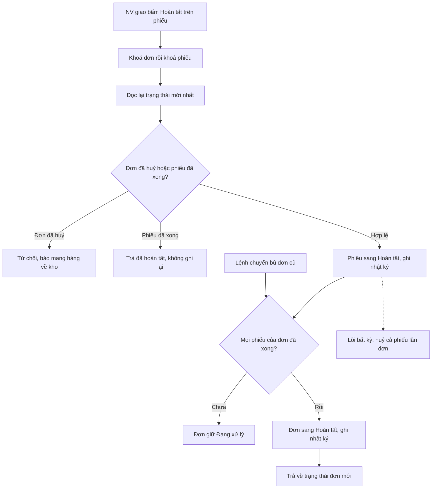

# Đơn hoàn tất (W37) — Thiết kế kỹ thuật (02b)
> Tech Lead · 07/10/2026 · Nguồn: `02-stories.md` (S1–S9, ĐÃ DUYỆT 07/10), `01-analysis.md`, `doc/decisions.md` mục 2026-10-07.
> Đọc code trên `main` (7fa314d, nay 49b9a4e, chỉ thêm doc). Mục 9 (Review) để trống, dùng sau.



## 0. Kết luận nhanh

- **Không thêm model, field, migration hay quyền.** `SalesOrder.Status.COMPLETED` đã có trong `choices`. AuditLog có thêm
  một `action` mới là `complete_order`.
- **Một hàm luật dùng chung** ở module mới `backend/apps/sales/orders/completion.py`. S1 (giao xong) và S3 (chuyển bù) cùng gọi
  hàm này, không viết hai lần.
- **Thứ tự khoá ở mọi đường đổi phiếu giao là `SalesOrder` rồi `DeliveryNote`**, giống `cancel_paid_order`
  (`sales/orders/services.py:370,378`), `confirmation.decide` (`:544-546`) và `auto_cancel_overdue` (`:756-758`). Đọc lại trạng
  thái **sau khi khoá**. Phải sửa cả `advance_status` (hiện đọc phiếu không khoá, ghi AuditLog ngoài `atomic`) và `mark_failed`
  (hiện chỉ khoá phiếu, không khoá đơn).
- **BR-GH-24 dùng HTTP 400** (`BusinessError`), giữ đúng contract S2. Lý do ở §2.3.
- **S4 không phải sửa điều kiện ở `inventory/batches/services.py:164,208`.** Danh sách `OPEN_ORDER_STATUSES` đã đúng
  BR-LO-04. H1 xảy ra vì dữ liệu (đơn kẹt `PROCESSING`), S1 và S3 gỡ được. S4 chỉ còn là test khoá hành vi (§1.5).
- **Shop (S8) gần như không cần sửa BE.** Lô dọn chữ AI đang đặt bảng `SHOP_DELIVERY_STATUS_LABELS` (COMPLETED → "Đã giao"),
  và sau S1 thì `get_status_display()` của đơn là "Hoàn tất". W37 chỉ thêm test khoá bảng.
- **4 lô.** Lô L1 (BE S2+S1 ∥ FE ERP mock) không đụng file nào của phạm vi dữ liệu Lô 3 hay lô dọn chữ AI, nên **làm được ngay**.
  L2, L3 phải chờ hai lô kia gộp (§6).
- 🔴 **Một câu hỏi:** test đua S2-AC1/AC5 cần PostgreSQL. Máy dev chỉ có SQLite, trên đó `select_for_update` không có tác dụng
  (§7).

---

## 1. Kiến trúc

### 1.1 Luồng S1 (giao xong phiếu cuối thì đơn Hoàn tất)

```
NV giao ── POST /api/delivery/notes/{id}/status/ {to_status: COMPLETED, from_status: DELIVERING}
   │  delivery/api.py:set_status  (Tầng 1 change_deliverynote, Tầng 3 get_object → 404 nếu không phải phiếu của mình)
   ▼
delivery/services.py:advance_status   ── transaction.atomic() bao TOÀN BỘ (gồm record_audit) ──────────────┐
   1. order = completion.lock_order_of_note(note)      # SELECT … FOR UPDATE trên sales_salesorder (theo pk)   │
   2. _lock_note(note)                                  # SELECT … FOR UPDATE trên delivery_deliverynote         │
   3. xét luật trên trạng thái VỪA ĐỌC LẠI (thứ tự ở §1.2)                                                       │
   4. note.status = COMPLETED, completed_at = now; save; record_audit("delivery_advance_status", actor=NV giao)  │
   5. completion.complete_order_if_delivered(order=order, trigger_note=note)                                    │
        → đơn PROCESSING + mọi phiếu chưa huỷ đã COMPLETED + có ≥1 COMPLETED                                     │
        → order.status = COMPLETED; save(update_fields=["status"]);                                              │
          record_audit("complete_order", actor=None, obj=order, changes=…)                                       │
   ◄────────────────────────────────────────────────────────────────────────────────────────────────────────────┘
api: body = serializer(note) + already + order_status (= completion.current_order_status(note), đọc mới từ DB)
```

- Logic đổi trạng thái đơn nằm ở **service của module đơn** (`sales/orders/completion.py`). Module giao hàng gọi qua service,
  không tự gán `order.status`, đúng quy tắc "module gọi module khác qua services". Không có vòng import:
  `completion.py` chỉ import `apps.delivery.models`, còn `delivery/services.py` import `completion`.
- `actor=None` cho dòng AuditLog của đơn (Q7). Người bấm đã có ở dòng `delivery_advance_status` của phiếu.
- Lỗi ở bất kỳ bước nào làm rollback cả phiếu lẫn đơn (S1-AC9). Hiện `record_audit` ở `delivery/services.py:142` nằm **ngoài**
  `atomic`, nên phải đưa vào trong.

### 1.2 `advance_status` và `mark_failed` sau khi sửa (S1, S2)

Thứ tự xét trong khoá. Các mã lỗi cũ giữ nguyên, chỉ thêm bước 3.

| # | Điều kiện (trên trạng thái đã khoá) | Kết quả | Ghi chú |
|---|---|---|---|
| 0 | `to_status` không thuộc `Status.values` | 400 như hiện nay | xét trước khi khoá cũng được |
| 1 | khoá đơn → khoá phiếu | — | `lock_order_of_note` rồi `_lock_note` |
| 2 | phiếu `CONFIRMING` | 400 `BR-GH-11` (giữ) | |
| 3 | `to_status ∈ {DELIVERING, COMPLETED}` (hoặc `mark_failed`) **và** (phiếu `CANCELLED` **hoặc** đơn `CANCELLED`/`AUTO_CANCELLED`) | **400 `BR-GH-24`** "Đơn đã huỷ — mang hàng về kho.", `current_status` = trạng thái phiếu | Mới. Xét theo cả đơn để chặn trường hợp nhiều phiếu (phiếu cũ chưa bị huỷ theo đơn) |
| 4 | phiếu `CANCELLED` (các đích còn lại, tức `READY`) | 400 `BR-GH-07` "Đơn đã huỷ, không soạn." (giữ) | test `test_confirmation_role_scope.py:386` vẫn xanh |
| 5 | có `from_status`: phiếu đã ở `to_status` ⇒ `(note, already=True)`, **không** ghi gì, **không** đụng đơn; phiếu khác `from_status` ⇒ 400 `STALE_STATE` (giữ) | | S1-AC4 |
| 6 | phiếu `COMPLETED` ⇒ 400 `BR-GH-05`; cạnh không có trong `ALLOWED_TRANSITIONS` ⇒ 400 `BR-GH-05` (giữ) | | |
| 7 | ghi phiếu, AuditLog phiếu, rồi nếu `to_status == COMPLETED` thì gọi `complete_order_if_delivered` | | S1-AC1/2 |

`mark_failed`: khoá đơn → khoá phiếu → bước 3 (BR-GH-24) → phần còn lại như cũ ("Chỉ đánh dấu giao thất bại khi phiếu đang ở
trạng thái Đang giao."). Không đụng đơn (S1-AC5: đơn giữ `PROCESSING`).

Nhánh lặp ở bước 5 (phiếu đã `COMPLETED`, gửi lại) **không** tự sửa đơn cũ còn kẹt `PROCESSING`. Đơn cũ do S3 xử lý. Cách này
giữ đường lặp không có tác dụng phụ (S1-AC4).

### 1.3 Thứ tự khoá — kiểm toàn hệ thống

| Đường | Khoá | Trạng thái sau W37 |
|---|---|---|
| `cancel_paid_order` | đơn → phiếu mới nhất | giữ. **Thêm:** sau khi khoá, đơn `COMPLETED` ⇒ 400 `BR-GH-05` (S2-AC3, S5-AC5). Hiện rơi vào "Chỉ huỷ được đơn đã thanh toán / đang xử lý (P-07)." mã `BUSINESS_ERROR` |
| `confirmation.decide`, `auto_cancel_overdue` | đơn → phiếu → việc gọi | giữ |
| `_record_payment` → `start_confirmation` | đơn → phiếu | giữ |
| `advance_status`, `mark_failed` | (không khoá / chỉ phiếu) → **đơn → phiếu** | sửa |
| `record_call`, `unconfirm`, `change_recipient`, `escalate_expired_windows` | phiếu → việc gọi | giữ, không khoá đơn, không tạo vòng |
| `assign_deliverer` | chỉ phiếu | giữ |

Không còn đường nào khoá phiếu **rồi mới** khoá đơn, nên không có vòng chờ.

`lock_order_of_note` lấy `sales_order_id` qua `SalesInvoice.objects.filter(pk=note.sales_invoice_id).values_list(...)` (không khoá,
quan hệ hoá đơn → đơn không đổi), rồi `SalesOrder.objects.select_for_update().get(pk=…)`. **Không** dùng
`select_for_update()` kèm `select_related`/join: Postgres sẽ khoá luôn dòng của bảng join, có thể khoá phiếu trước đơn.

### 1.4 Module mới `backend/apps/sales/orders/completion.py` (gợi ý tên, be-dev được đổi nếu báo lại)

```python
COMPLETE_ORDER_ACTION = "complete_order"        # AuditLog.action mới
BACKFILL_MARKER = "W37"

def is_delivery_finished(note_statuses) -> bool:
    """BR-BH-18: bỏ phiếu CANCELLED; còn ≥1 phiếu và mọi phiếu còn lại đều COMPLETED. Hàm thuần, không query."""

def lock_order_of_note(note) -> SalesOrder:
    """Khoá dòng đơn của phiếu (gọi TRƯỚC khi khoá phiếu). Phải ở trong transaction.atomic."""

def complete_order_if_delivered(*, order, trigger_note, backfill=False) -> bool:
    """Gọi khi `order` ĐÃ KHOÁ. Chỉ PROCESSING mới chuyển (S1-AC10, BR-BH-21). Đọc trạng thái mọi phiếu của hoá đơn
    (một query values_list), áp is_delivery_finished, đổi đơn + ghi AuditLog. Trả True nếu đã chuyển."""

def current_order_status(note) -> str | None:
    """Trạng thái đơn đọc mới từ DB (cho khoá `order_status` của API). Không dùng note.sales_invoice.sales_order đã cache."""

def backfill_candidates():
    """S3: đơn PROCESSING có ≥1 phiếu COMPLETED, distinct, order_by pk. Lọc thô; luật đầy đủ xét lại trong khoá."""
```

AuditLog của đơn (khoá cố định, **không** có dữ liệu cá nhân, `note=""`):
```json
{"action": "complete_order", "actor": null, "actor_kind": "system", "model_name": "sales.SalesOrder",
 "changes": {"status": {"from": "PROCESSING", "to": "COMPLETED"}, "delivery_note": "GH-HD-QA-0001-ABCDE", "delivery_note_id": 31}}
```
Chuyển bù thêm `"backfill": "W37"` (S3-AC2). `delivery_note` là mã phiếu cuối cùng sang `COMPLETED` (S3: phiếu `COMPLETED` có
`completed_at` mới nhất).

### 1.5 Chốt lô (S4): không sửa điều kiện

`check_close_batch` (`inventory/batches/services.py:208`) đếm đơn có `SalesOrderLineBatch` trỏ lô với trạng thái trong
`OPEN_ORDER_STATUSES = ("BOOKED","PAID","PROCESSING")` (`:164`). Danh sách này đúng nguyên văn BR-LO-04, và story S4 cũng ghi
"giữ nguyên". Hiện lô không chốt được vì đơn đã giao xong vẫn ở `PROCESSING`. Sau S1 (đơn mới) và S3 (đơn cũ), đơn đã giao
không còn bị đếm.

⇒ **Không sửa `services.py:164,208`.** Phiếu giao việc của điều phối viên có ghi "sửa điều kiện", nhưng sau khi đọc code thì
Tech Lead chốt là không cần. Đổi danh sách sẽ lệch BR-LO-04 và làm `PAID` (dữ liệu `seed_demo`) hết chặn chốt lô. S4 chỉ gồm
test: S4-AC1..AC5, trong đó AC2 khoá ca "đơn `PROCESSING` + phiếu `FAILED` vẫn chặn" và AC3 khoá ca "chạy S3 rồi chốt được".

Tương tự, `reports/dashboard_api.py:24` (`PENDING`) và giá trị bộ lọc "Chưa xong" `BOOKED,PAID,PROCESSING` **không đổi**.

### 1.6 Dòng thời gian (S7, Q9)

Sửa `sales/orders/timeline.py`:
- Gom các dòng AuditLog `complete_order` của đơn: dòng không có `backfill` cho ra tập `merged_note_ids` (lấy từ `delivery_note_id`).
- `_audit_event`, nhánh `delivery_advance_status` → `COMPLETED` (`:224-229`): nếu phiếu thuộc `merged_note_ids` thì nhãn là
  `"Đã giao — đơn hoàn tất ({code})"`, `kind = "delivered"` (giữ kind, FE không phải đổi icon), người làm là người bấm.
  Phiếu không thuộc tập này giữ nhãn cũ `"Giao hàng thành công ({code})"`.
- Nhánh `ORDER_MODEL` thêm `complete_order`. Không có `backfill` thì trả `None`, vì đã gộp vào dòng giao. Có `backfill` thì trả
  `TimelineEvent(kind="order_completed", label="Hệ thống chuyển đơn sang Hoàn tất (chuyển bù)", actor="Hệ thống")` ở giờ
  `created_at` của AuditLog.
- Nhãn chỉ ghép mã phiếu. Không SĐT, không tên người giao trong `label`, không đưa `changes` thô ra (S7-AC9). Dòng gộp vẫn có
  `actor_display` là tên hiển thị nhân viên, như mọi dòng hiện nay.

Lô dọn chữ AI cũng sửa `timeline.py`: họ thêm bộ lọc dòng AI trong `_audits` và `_audit_event`. Hai bên khác vùng, nhưng W37 L3
vẫn phải rebase sau khi lô đó gộp (§5).

### 1.7 Lệnh chuyển bù (S3)

File mới `backend/apps/sales/management/commands/backfill_completed_orders.py`. **Không có route HTTP, không có lệnh AI.**

```
python manage.py backfill_completed_orders            # chạy thật
python manage.py backfill_completed_orders --dry-run  # chỉ in, không ghi DB, không AuditLog
```
Theo đúng story: mặc định chạy thật, có `--dry-run`. Lệnh cũ `backfill_credit_notes` làm ngược lại (mặc định in, phải thêm
`--apply`). Hai lệnh khác cách gọi, nên ghi rõ trong `03-dev-notes.md` để người chạy không nhầm.

Thuật toán:
1. `ids = list(backfill_candidates().values_list("pk", flat=True))`.
2. Mỗi `pk` chạy trong **một `transaction.atomic()` riêng**: khoá đơn bằng `select_for_update().get(pk=…)`, rồi đọc lại.
   Đơn không còn `PROCESSING` thì bỏ qua. Lấy trạng thái mọi phiếu và gọi `complete_order_if_delivered(order=…,
   trigger_note=<phiếu COMPLETED có completed_at mới nhất>, backfill=True)`.
   Trường hợp đơn W (`PAID` + phiếu `COMPLETED`), đơn Y (`FAILED`) và đơn Z (`CANCELLED`) đều bị loại, ở bước 1 hoặc bước 2.
3. Lỗi ở một đơn: dừng ngay, in mã đơn lỗi, `raise CommandError` (exit ≠ 0). Đơn trước đó đã commit. Chạy lại thì xử lý tiếp
   phần còn lại (S3-AC7).
4. In ra: `--dry-run` in "Sẽ chuyển N đơn:" kèm danh sách **mã đơn**. Chạy thật in "Đã chuyển N đơn" (chạy lần hai phải ra
   "Đã chuyển 0 đơn", S3-AC3). **Không in** tên, SĐT, địa chỉ hay số tiền. Mã đơn production **không** chép vào doc (repo công khai).
5. Idempotent: lần hai không còn đơn `PROCESSING` thoả luật ⇒ không ghi gì, không AuditLog.

Không đụng hoá đơn, kho, chứng từ đảo hay phiếu hoàn (BR-BC-06). Lệnh chỉ `save(update_fields=["status"])` trên đơn.

---

## 2. Contract API

Không thêm route. Không đổi quyền. Mọi endpoint dưới đây đã có, và giữ nguyên Tầng 1–3 hiện hành.

### 2.1 S1, S2: `POST /api/delivery/notes/{id}/status/` (authenticated)
Quyền: Tầng 1 `delivery.change_deliverynote`; đích `READY` cần `delivery.pack_deliverynote` (giữ). Tầng 3: NV giao chỉ thao tác phiếu
gán cho mình, phiếu khác trả 404 (giữ, S1-AC11).

```
Request:  {"to_status": "COMPLETED", "from_status": "DELIVERING"}

200: { …mọi khoá hiện có của DeliveryNoteSerializer…, "status": "COMPLETED", "already": false, "order_status": "COMPLETED" }
200 lặp: { …, "status": "COMPLETED", "already": true, "order_status": "COMPLETED" }
200 thất bại: { …, "status": "FAILED", "already": false, "needs_decision": false, "order_status": "PROCESSING" }

400 {"detail": "Phiếu đang ở Giao thất bại, tải lại để xem.", "code": "STALE_STATE", "current_status": "FAILED"}   (giữ)
400 {"detail": "Đơn đã huỷ — mang hàng về kho.", "code": "BR-GH-24", "current_status": "CANCELLED"}               (mới)
400 {"detail": "Phiếu giao đã Hoàn tất — không quay lui được (BR-GH-05).", "code": "BR-GH-05"}                     (giữ)
```
- `order_status` là khoá **mới**, có ở **mọi** nhánh của `set_status` (gồm `READY`, `DELIVERING`, `FAILED`). Giá trị đọc mới từ
  DB sau thao tác. Phiếu không có hoá đơn hay đơn (không xảy ra trong V1) thì trả `null`.
- Không thêm khoá nào chứa dữ liệu khách. `order_status` chỉ là mã trạng thái.

### 2.2 S2: `POST /api/sales/orders/{id}/cancel/` (authenticated, `sales.cancel_paid_order`)
Không đổi request/response. Thêm một nhánh lỗi sau khi khoá:
```
400 {"detail": "Đơn đã giao hoàn tất — chỉ còn cách lập phiếu hoàn.", "code": "BR-GH-05"}
```
Dùng **đúng câu đã có** ở nhánh phiếu `COMPLETED` (`services.py:389-392`). Câu "Phiếu giao đã Hoàn tất — không quay lui được
(BR-GH-05)." trong contract của S2 là câu của `advance_status`, và FE chỉ xét `code`. NV giao gọi huỷ thì nhận 403 (giữ, S2-AC6).

### 2.3 Chốt 400 hay 409 cho BR-GH-24: **400**
- Bên thua cuộc đua ở chiều ngược lại (huỷ sau khi đã giao xong) nhận `BR-GH-05` **400**. Đây là lỗi có sẵn và hồ sơ
  huỷ-đơn-đang-giao (E3) cũng dùng nó. Để hai chiều cùng mã HTTP, BR-GH-24 cũng dùng 400.
- `STALE_STATE` của chính endpoint này đang là 400 (`delivery/services.py:110-114`). Chỉ `assign_deliverer` dùng 409.
- FE nhận diện lỗi bằng `code`, không bằng HTTP status (`shared/ui/form/useSubmit.ts:34-39`). Vì vậy BR-GH-24 **không** được thêm
  vào `CONFLICT_CODES`. Nếu thêm, FE sẽ thay câu "Đơn đã huỷ — mang hàng về kho." bằng câu chung "Phiếu vừa đổi trạng thái".
- Lệch phụ đã có từ trước: mock `features/deliveries/mock.ts:779,805` trả `STALE_STATE` 409, còn BE trả 400. Lệch này vô hại
  vì FE xét theo `code`. W37 không sửa, chỉ ghi nợ.

### 2.4 S6: danh sách đơn và Tổng quan (không đổi BE)
- `GET /api/sales/orders/?status=BOOKED,PAID,PROCESSING`: giữ nguyên giá trị "Chưa xong". FE bỏ **lựa chọn** "Đã thanh toán"
  (`erp-console/features/orders/labels.ts:7`), giữ chip `PAID` trong `enums.ts` để đọc dữ liệu cũ (S6-AC4).
- `GET /api/dashboard/summary/`: `kpis.pending_orders` vẫn đếm `BOOKED+PAID+PROCESSING`, không đổi code. BE chỉ thêm test S6-AC5/AC6.

### 2.5 S5, S7: `GET /api/sales/orders/{id}/` (authenticated, `view_salesorder` + phạm vi dòng hiện hành)
Chỉ **thêm** khoá `refund_summary`. Mọi khoá khác giữ nguyên.
```json
{
  "id": 41, "code": "DH-QA-0001", "status": "COMPLETED", "status_label": "Hoàn tất",
  "delivery": {"id": 31, "code": "GH-HD-QA-0001-ABCDE", "status": "COMPLETED", "status_label": "…", "assigned_to": {…}, "failed_attempts": 0},
  "refunds": [{"id": 5, "amount": "200000", "status": "REFUNDED", …}, {"id": 6, "amount": "100000", "status": "PENDING", …}],
  "refund_summary": {"refunded_amount": "200000", "pending_amount": "100000"},
  "available_actions": ["create_refund"],
  "timeline": [ …, {"at": "…", "kind": "delivered", "label": "Đã giao — đơn hoàn tất (GH-HD-QA-0001-ABCDE)", "actor_display": "…"} ]
}
```
- Contract trong story có khoá cấp đầu `delivery_status`. Chi tiết đơn **không** có khoá này mà dùng `delivery.status` sẵn có, nên
  FE đọc `delivery.status`. Story có ví dụ tối giản, Tech Lead chốt theo khoá thật.
- `refund_summary.refunded_amount` là tổng phiếu `REFUNDED`. `pending_amount` là tổng phiếu `PENDING`. Phiếu `FAILED` không tính.
  Giá trị là chuỗi Decimal theo `money_str`. Đơn không có hoá đơn hoặc không có phiếu hoàn thì cả hai là `"0"`. Tính từ
  `invoice.refunds` đã prefetch (`orders/api.py:106`), **không thêm query**.
- `available_actions` không cần sửa code. `next_steps.py:114` chỉ cho bước `cancel` khi đơn `PAID`/`PROCESSING`. `next_steps.py:129`
  cho `create_refund` khi `refundable_amount > 0` và có quyền. Như vậy S5-AC8 và S7-AC8 đúng ngay sau S1, chỉ cần test.
- `timeline` có kind mới `order_completed` (chỉ ở đơn chuyển bù).

### 2.6 S8: `GET /api/shop/orders/{code}/?phone_last4=xxxx` (AllowAny, throttle IP + mã đơn, giữ)
Không đổi route, khoá hay xác minh. Tập khoá phản hồi **bằng đúng** tập khoá hiện nay (S8-AC3).

| `status` | `status_label` | `delivery.status` | `delivery.status_label` |
|---|---|---|---|
| PROCESSING | Đã thanh toán – chờ vựa gọi xác nhận | CONFIRMING | Chờ vựa gọi xác nhận |
| PROCESSING | Đang xử lý | PREPARING / READY / DELIVERING / FAILED | Đang soạn hàng / Đã soạn xong, chờ giao / Đang giao / Giao chưa thành công, vựa sẽ liên hệ lại |
| **COMPLETED** | **Hoàn tất** | COMPLETED | **Đã giao** |
| CANCELLED | Đã huỷ | CANCELLED | **Đã huỷ** (xem ghi chú) |

Ghi chú: S8 ghi phiếu huỷ ở Shop là "Đã huỷ theo đơn (như hiện nay)". Mục 4 của `doc/thuat-ngu-va-trang-thai.md`, dòng T30, cột
Shop, ghi **"Đã huỷ"**, và Duy đã duyệt toàn bộ mục 4 ngày 07/10 (decisions 2026-10-07). Story có câu "nếu Duy sửa cột Shop ở
mục 4 … thì làm theo bản đã duyệt", nên **chốt theo T30: "Đã huỷ"**. Lô dọn chữ AI (02b §2.4) đặt đúng như vậy.

Chia việc: bảng nhãn do lô dọn chữ AI viết (`SHOP_DELIVERY_STATUS_LABELS`, `SHOP_ORDER_STATUS_LABELS` trong `shop_api.py` hoặc
`shop_labels.py`). W37 **không** sửa `shop_api.py`, trừ khi lúc làm L3 bảng đó vẫn thiếu dòng COMPLETED. W37 thêm test khoá cả
bảng trên, cộng S8-AC3/AC4/AC5.

---

## 3. Model và migration

| Mục | Thay đổi |
|---|---|
| Model | **Không có.** `SalesOrder.Status.COMPLETED` đã có. Không thêm `SalesOrder.completed_at` (Q6, ngoài phạm vi). Mốc "hoàn tất lúc" lấy từ `DeliveryNote.completed_at` và AuditLog |
| Migration | **Không có.** `makemigrations --check --dry-run` phải sạch ở mọi lô |
| Quyền | **Không có** quyền mới, không data migration gán Group |
| AuditLog | `action` mới là `complete_order`, không cần migration. FE thêm nhãn "Đơn hoàn tất" vào `erp-console/features/audit/auditModel.ts` |
| Dữ liệu | Lệnh S3 đổi `status` của đơn cũ. Staging chạy trước. Production **chỉ chạy khi Duy duyệt**, cùng lần deploy, theo ba bước của S3 |

Phạm vi dữ liệu Lô 3 đang thêm `sales/migrations/0015`, `0016` và `Meta.permissions` của `SalesOrder`. W37 không đụng
`models/` hay `migrations/`, nên không xung đột số migration.

---

## 4. Rủi ro và cơ chế chặn

| # | Rủi ro | Cơ chế chặn | Test bắt lỗi |
|---|---|---|---|
| R1 | **Báo cáo đổi số** khi đơn sang Hoàn tất hoặc khi chuyển bù (BR-BC-06, "không sửa kỳ cũ") | Báo cáo không đọc `SalesOrder.status` (đã kiểm `reports/services.py`, `period_counts.py`, `batch_list.py`, `dashboard_api.py:59`). S1 và S3 chỉ `save(update_fields=["status"])` trên đơn | Helper `apps/reports/tests/financial_snapshot.py`, chi tiết ở dưới. Dùng trong S1-AC3, S3-AC5, S6-AC6 |
| R2 | **Đua Huỷ ∥ Giao xong** cho ra đơn `CANCELLED` + phiếu `COMPLETED`, hoặc đơn `COMPLETED` sau `CANCELLED` | Khoá đơn rồi phiếu, đọc lại sau khoá (§1.2, §1.3). BR-GH-24 xét cả trạng thái đơn | (a) Test tất định chạy trên SQLite, **đỏ trên main hôm nay**, liệt kê ở dưới. (b) Test luồng thật trên Postgres, S2-AC1/AC5, xem §7 |
| R3 | Lệch phiếu và đơn khi lỗi giữa chừng | Mọi bước nằm trong một `atomic`, kể cả `record_audit` | S1-AC9: patch `completion.record_audit` (hoặc `SalesOrder.save`) cho raise. Kiểm DB: phiếu vẫn `DELIVERING`, `completed_at` rỗng, đơn `PROCESSING`, số AuditLog không đổi |
| R4 | **Rò dữ liệu cá nhân**: AuditLog, output lệnh, Shop, timeline | Khoá `changes` cố định. Lệnh chỉ in mã đơn. Shop không thêm khoá. Nhãn timeline chỉ ghép mã phiếu | `assertEqual(set(changes), {"status","delivery_note","delivery_note_id"})` (chuyển bù thì có thêm `"backfill"`). Dữ liệu giả với SĐT `0900000xxx`, tên, địa chỉ: assert các chuỗi đó **không** xuất hiện trong `json.dumps(changes)`, `AuditLog.note`, stdout của lệnh (cả `--dry-run`), `label` của timeline. Shop: `assertEqual(set(body), KEYS_BEFORE)` và `set(body["delivery"]) == {"status","status_label"}` |
| R5 | **Rò giá vốn** | `refund_summary` chỉ là tiền khách (không giá vốn). Không đụng `AllocationSerializer`/`CostFieldSerializerMixin` | S4-AC5 (lô, Quản lý không `view_costprice`), S7-AC10: gọi chi tiết đơn `COMPLETED` bằng `manager` và `warehouse_staff`, assert không có `unit_cost`, `landed_unit_cost`, `purchase_rate`, `profit`/`pnl` ở mọi tầng JSON (duyệt đệ quy) |
| R6 | **Vượt phân quyền**: đường bấm tay "hoàn tất đơn", gọi chuyển bù qua HTTP | `SalesOrderViewSet` là `ReadOnlyModelViewSet`. Lệnh S3 không có route. Không thêm action | S1-AC12: `PATCH`/`PUT` `/api/sales/orders/{id}/` bằng owner/manager/delivery_staff ⇒ 405 (hoặc 403), đơn không đổi. S3-AC8: duyệt `get_resolver().reverse_dict`/`url_patterns`, assert không pattern nào chứa `backfill` hay `complete`. S1-AC11 (404), S1-AC13 (403), S2-AC6 (403), S5-AC6/AC7 |
| R7 | **Đụng chứng từ** | Không tạo hay sửa `SalesInvoice`, `SalesCreditNote`, `Refund`, `StockLedgerEntry`, `*LineBatch`. Không xoá dòng nào | Đếm số dòng và `max(id)` của 5 bảng này trước và sau S1 và S3 (nằm trong `financial_snapshot`) |
| R8 | Chuyển bù không idempotent, hoặc lỗi giữa chừng để lại trạng thái lẫn | Mỗi đơn một giao dịch. Đọc lại trong khoá. Dừng ở lỗi đầu tiên | S3-AC3 (chạy lần hai: 0 đơn, AuditLog không tăng), S3-AC7 (patch cho đơn thứ hai raise: exit ≠ 0, đơn 1 đã chuyển, chạy lại thì chuyển đơn 2 và 3) |
| R9 | Lô cũ bỗng chốt được, lãi lỗ lô đông cứng theo số hiện tại | Chốt lô vẫn do Chủ bấm tay, vẫn đòi tồn 0, hoá đơn mua và kiểm kê. Lệnh S3 không chốt lô | S4-AC3. Điều phối viên báo Lộc trước khi chốt hàng loạt (theo phần rủi ro của story) |
| R10 | Deadlock | Một thứ tự khoá duy nhất (§1.3). Không `select_for_update` kèm join | Test spy thứ tự khoá trên SQLite: patch `completion.lock_order_of_note` và `_lock_note`, ghi thứ tự gọi, assert đơn trước phiếu cho `advance_status` và `mark_failed`. Thêm S2-AC5 trên Postgres |
| R11 | Phạm vi dữ liệu Lô 4 đổi phạm vi NV giao và lọc mất phiếu `CANCELLED` ⇒ S2-AC2 thành 404 thay vì 400 BR-GH-24 | Ghi ràng buộc vào lô 4 (§5) | S2-AC2 chạy bằng NV giao được gán. Test này nằm ở W37, sẽ đỏ nếu Lô 4 làm sai |

**Test tất định cho R2 (bắt buộc, chạy trên SQLite, fail trên main hôm nay):**
1. *Huỷ thắng, giao lại đến sau:* nạp `note` (FAILED) vào bộ nhớ. Gọi `cancel_paid_order` (DB: đơn và phiếu thành `CANCELLED`).
   Rồi gọi `advance_status(note=<object cũ FAILED>, to_status=DELIVERING, from_status=FAILED)`. Kỳ vọng: 400 `BR-GH-24`, phiếu
   trong DB vẫn `CANCELLED`, không AuditLog mới. Hôm nay code ghi đè `CANCELLED → DELIVERING`.
2. Như 1 nhưng đích là `COMPLETED` (đặt phiếu `DELIVERING` trong bộ nhớ). Hôm nay code ghi đè thành `COMPLETED`.
3. Như 1 với `mark_failed`. Kỳ vọng `BR-GH-24`, phiếu không thành `FAILED` (S2-AC4).
4. *Giao xong thắng, huỷ đến sau:* nạp `order` (PROCESSING) vào bộ nhớ. Giao xong qua API (DB: đơn `COMPLETED`). Rồi gọi
   `cancel_paid_order(order=<object cũ>)`. Kỳ vọng: 400 `BR-GH-05`, không chứng từ đảo, không `CANCEL_RESTORE`.
5. Đơn `CANCELLED` nhưng phiếu cũ `FAILED` chưa bị huỷ (hai phiếu, dựng tay). Gửi `DELIVERING` cho phiếu đó. Kỳ vọng `BR-GH-24`.

**`financial_snapshot()`** (helper test, đặt ở `backend/apps/reports/tests/financial_snapshot.py`):
- `period_pnl(year, month)` cho **mọi tháng**, theo giờ VN, từ tháng sớm nhất có `SalesInvoice.issued_at`,
  `SalesCreditNote.issued_at` hay `Refund.confirmed_at` đến tháng hiện tại. Cộng thêm `GET /api/reports/period/` cho từng tháng
  đó, gọi bằng owner.
- `batch_pnl(batch)` cho mọi lô, cộng `GET /api/reports/batches/`.
- Doanh thu hôm nay và `pending_orders` của `GET /api/dashboard/summary/`. `pending_orders` được phép đổi, nên so riêng.
- `(count, max(id))` của `SalesInvoice`, `SalesCreditNote`, `Refund`, `StockLedgerEntry`, `SalesInvoiceLineBatch`.
- Dữ liệu dựng ở ít nhất **hai kỳ** (tháng trước và tháng này) bằng cách `update(issued_at=…)` hoặc `update(confirmed_at=…)`. Repo
  không có freezegun. Có ít nhất một chứng từ đảo và một phiếu hoàn `REFUNDED`.
- So bằng `assertEqual` trên dict, chính xác tới từng đồng (chuỗi Decimal).

---

## 5. Va chạm với các lô đang chạy và thứ tự gộp

### 5.1 Bản đồ file

| Nhánh / hồ sơ | File cùng vùng với W37 | W37 đụng ở lô nào | Mức |
|---|---|---|---|
| **Phạm vi dữ liệu Lô 3** (`feat/pham-vi-du-lieu`, đang code, chưa commit) | `sales/orders/{scope,api,serializers}.py`, `sales/models/orders.py`, `sales/migrations/0015,0016`, `reports/dashboard_api.py`, `delivery/pii_scope.py` | Chỉ `serializers.py` (L2 thêm `refund_summary`). W37 **không** sửa `api.py`, `scope.py`, `dashboard_api.py`, `models/`, `migrations/`, `pii_scope.py` | Thấp. Xung đột chữ duy nhất có thể là dòng `SalesOrderDetailSerializer.Meta.fields` (Lô 3 thêm `customer_hidden_reason`) |
| **Phạm vi dữ liệu Lô 4** (chờ) | `delivery/scope.py` (mới), `delivery/{api,next_steps}.py` | L1 sửa `delivery/api.py:set_status` (thêm `order_status`) và `delivery/services.py` | TB. **W37 L1 gộp trước khi Lô 4 bắt đầu.** Lô 4 phải: (a) giữ khoá `order_status` của `set_status`; (b) NV giao vẫn thấy phiếu **`CANCELLED`** được gán cho mình, để nhận 400 BR-GH-24 chứ không phải 404 (test S2-AC2 của W37 bắt lỗi này) |
| **Phạm vi dữ liệu Lô 7** (chờ) | màn chi tiết đơn ERP, `shared/lib/personalData.ts` | L3 FE sửa `OrderDetailScreen.tsx` | Thấp, W37 xong trước |
| PV `rows_losing_access` (02b PV §2.4) | đếm đơn `BOOKED/PAID/PROCESSING` | không | Không xung đột. Số tự đúng sau S1+S3. Chỉ cần báo Tech Lead PV |
| **Lô dọn chữ AI BE** (`feat/don-chu-ai-be`, đang code) | `sales/orders/timeline.py`, `sales/orders/shop_api.py` (bảng nhãn Shop) | L3: `timeline.py` (nhãn gộp, dòng chuyển bù). `shop_api.py` không sửa (chỉ test) | TB. **L3 BE chờ lô này gộp rồi rebase** |
| **Lô dọn chữ AI FE** (`feat/don-chu-ai-fe`, đang code) | `frontend/app/shop/orders/OrderLookup.tsx`, `frontend/lib/{mock,types}.ts`. Theo 02b §2.5 thì có `features/orders/components/CancelOrderModal.tsx` và dòng "Ghi chú huỷ" ở chi tiết đơn (`OrderDetailScreen.tsx`) | L3 FE: `OrderDetailScreen.tsx`, `frontend/lib/mock.ts` | TB. **L1 FE không đụng `OrderDetailScreen.tsx`, `CancelOrderModal.tsx` hay `frontend/**`**. Các file này để L3, sau khi lô dọn chữ gộp. `features/orders/mock.ts` có thể cả hai cùng sửa: ai gộp sau thì rebase (khác vùng) |
| **Huỷ đơn đang giao** (CHỜ DUYỆT, mới có 01-analysis) | `cancel_paid_order`, `advance_status`, BR-GH-24 | L1 làm khoá và BR-GH-24 | Hồ sơ đó **dùng lại** `lock_order_of_note`, thông báo và mã `BR-GH-24` của W37. Không làm khoá thứ hai. Khi viết story cho hồ sơ đó, thêm ca đua trực tiếp từ `DELIVERING` |
| Lô áp tên chuẩn (mục 4, chờ sau lô dọn chữ AI) | nhãn ERP (`enums.ts`), nhãn phiếu "Đã giao" ở ERP | W37 không chép chữ, vì S7 ghi rõ "theo nhãn hiện hành của `enums.ts`" | Thấp. Lô tên chuẩn làm sau W37 L3 |

### 5.2 Thứ tự gộp đề xuất

```
(đang chạy)  Lô dọn chữ AI BE ∥ FE ──────────┐
(đang chạy)  Phạm vi dữ liệu Lô 3 BE ────────┤
                                             │
W37 L1 BE (S2+S1) ∥ L1 FE (ERP, mock) ─── làm NGAY, không chờ ai; gộp khi QA đạt
                                             │
             ┌───────────────────────────────┘
             ▼
W37 L2 BE (S4, S5, refund_summary) ── sau PV Lô 3 gộp (rebase serializers.py)
W37 L4 BE (S3, lệnh chuyển bù) ────── code song song với L2 (file mới, chỉ cần L1)
W37 L3 BE (S7 timeline, S8 test) ∥ L3 FE (chi tiết đơn, Nhật ký, Shop) ── sau lô dọn chữ AI gộp + L2
             ▼
Phạm vi dữ liệu Lô 4 ── sau W37 L1 (giữ order_status, NV giao vẫn thấy phiếu CANCELLED của mình)
Huỷ đơn đang giao (nếu Duy duyệt) ── trên nền W37 L1
Lô áp tên chuẩn ── sau W37 L3
```
Commit dùng pathspec, không `git add -A` (memory "Commit dùng pathspec", sự cố 6f1a235).

---

## 6. Lô giao việc

Chung mọi lô BE: **không đụng** `erp-console/**`, `frontend/**`, `adapter/**`, `apps/*/models/**`, mọi `migrations/`,
`apps/ai/**`, `config/settings.py`, `sales/orders/{api,scope}.py`, `reports/dashboard_api.py`, `delivery/{scope,pii_scope}.py`,
`inventory/batches/services.py`, `doc/decisions.md`, `doc/business-process-spec.md` (S9-AC1).
Chung mọi lô FE: **không đụng** `backend/**`, `erp-console/shared/ui/**`, `erp-console/features/{permissions,ai,auth,overview,guidance,confirmation}/**`,
`erp-console/shared/lib/enums.ts` (lô tên chuẩn).
Lệnh kiểm chứng mỗi lô:
- BE: `manage.py test`, `manage.py makemigrations --check --dry-run`.
- FE: `npm ci`, `./node_modules/.bin/tsc --noEmit`, `npm run build`, vitest của module đã sửa.
- Gốc repo: `python3 scripts/check_naming.py`. File test mới đặt tên hàm test **tiếng Anh**, vì file mới có định danh tiếng
  Việt làm script exit 1.

### L1 — S2 + S1 (BE) ∥ FE ERP theo mock (S1/S2 phía NV giao, S6, mô hình S7)

**BE**, được sửa:
- `backend/apps/delivery/services.py`: `advance_status` và `mark_failed` theo §1.2. Toàn bộ thân hàm vào một `atomic`, gồm
  `record_audit`. Hằng thông báo BR-GH-24 đặt một chỗ để hồ sơ huỷ-đơn-đang-giao dùng lại.
- `backend/apps/delivery/api.py`: chỉ hàm `set_status`, thêm `data["order_status"] = completion.current_order_status(note)`.
- `backend/apps/sales/orders/services.py`: chỉ `cancel_paid_order`, thêm nhánh `COMPLETED → BR-GH-05` ngay sau khi khoá đơn.
- **Mới:** `backend/apps/sales/orders/completion.py` (§1.4).
- **Mới:** test
  - `backend/apps/sales/orders/tests/test_completion_rule.py`: bảng `is_delivery_finished` theo UC-4 (S1-AC7, AC8, mọi phiếu
    `CANCELLED`, rỗng).
  - `backend/apps/delivery/tests/test_order_completion.py`: S1-AC1..AC13, 5 ca tất định R2, spy thứ tự khoá R10, S2-AC2/3/4/6.
  - `backend/apps/delivery/tests/test_completion_race_postgres.py`: S2-AC1/AC5, `TransactionTestCase` + `threading.Barrier`,
    `@skipUnless(connection.vendor == "postgresql")`, xem §7.
  - `backend/apps/reports/tests/financial_snapshot.py`: helper, dùng ở S1-AC3.
- README: `backend/apps/delivery/README.md`, `backend/apps/sales/orders/README.md` (một dòng về `completion.py`).

**FE** (`erp-console/`, mock theo §2.1, §2.4, §2.5), được sửa:
- `features/deliveries/api.ts`, `types.ts`: `DeliveryStatusResponse` thêm `order_status?: string | null`.
- `features/deliveries/deliveryUi.ts` (+ `deliveryUi.test.ts`): hàm nhận lỗi `BR-GH-24` theo `code`.
- `features/deliveries/components/{ConfirmCompleteModal,ReportFailureModal,MyDeliveriesScreen,DeliveryDetailScreen}.tsx`:
  - Gặp `BR-GH-24` thì hiện đúng `detail` và nút "Tải lại". Bấm thì đóng hộp và tải lại phiếu.
  - Giao xong mà `order_status === "COMPLETED"` thì toast "Đã giao xong. Đơn đã hoàn tất."
- `features/deliveries/mock.ts`:
  - Đơn của phiếu đã huỷ thì giao xong hoặc báo thất bại trả 400 `BR-GH-24`.
  - Giao xong trả `order_status` tính bằng luật dùng chung. Có thể gọi hàm mock của `features/orders/mock.ts` để đổi đơn trong
    kho mock. Mock gọi chéo đã có tiền lệ (`features/overview/mock.ts` import `features/inventory/mock`).
- **Mới:** `erp-console/shared/lib/orderCompletion.ts` (+ `.test.ts`): `isDeliveryFinished(noteStatuses)`, cùng luật với BE §1.4.
- `features/orders/labels.ts`: bỏ dòng `{ value: "PAID", … }`, giữ "Chưa xong" = `BOOKED,PAID,PROCESSING` (S6-AC2).
- `features/orders/orderDetailModel.ts` (+ `orderDetailModel.test.ts`):
  - `ORDER_STEPS` 5 bước: `BOOKED` Giữ chỗ → `CONFIRMING` Chờ gọi xác nhận → `PREPARING` Soạn hàng → `DELIVERING` Đang giao →
    `COMPLETED` Hoàn tất.
  - `orderStepKey`: `COMPLETED` **chỉ** khi `status === "COMPLETED"`. `PROCESSING`/`CANCELLED` theo phiếu: `CONFIRMING` →
    CONFIRMING; `PREPARING`/`READY` → PREPARING; `DELIVERING`/`FAILED`/`COMPLETED` → DELIVERING. Không có phiếu → CONFIRMING.
    `PAID` → CONFIRMING.
  - Test bảng mọi tổ hợp `order.status × delivery.status`: bước = COMPLETED ⇔ chip = Hoàn tất (S7-AC3).
  - Chữ bước lấy theo nhãn hiện hành, không chép bảng tên mới.
- `features/orders/types.ts`: `OrderDetail.refund_summary: { refunded_amount: string; pending_amount: string }`, thêm
  `"order_completed"` vào `TimelineKind`.
- `features/orders/mock.ts`:
  - Đơn `COMPLETED` sinh theo luật dùng chung, không gán cứng (S6-AC8).
  - Có `refund_summary`.
  - Mốc gộp "Đã giao — đơn hoàn tất (…)" thay cho "Giao hàng thành công" khi đơn `COMPLETED` (`mock.ts:556`).
  - Bộ đơn mock khớp S6-AC1 (1 `BOOKED`, 2 `PROCESSING` gồm 1 `DELIVERING` + 1 `FAILED`, 3 `COMPLETED`, 1 `CANCELLED`) trong
    một kịch bản lọc kiểm được.

Không được đụng (L1 FE): `features/orders/components/OrderDetailScreen.tsx`, `CancelOrderModal.tsx` (lô dọn chữ AI),
`features/audit/**`, `frontend/**`.

### L2 — S4 + S5 (BE). Bắt đầu sau khi PV Lô 3 đã gộp vào main

Được sửa:
- `backend/apps/sales/orders/serializers.py`: thêm `refund_summary` vào `SalesOrderDetailSerializer` (field + `Meta.fields`).
  Tính từ `invoice.refunds.all()` đã prefetch.
- **Mới:** test
  - `backend/apps/inventory/batches/tests/test_close_after_completion.py`: S4-AC1..AC5. AC3 gọi lệnh S3 nếu L4 đã gộp, nếu chưa
    thì đặt đơn `COMPLETED` qua `complete_order_if_delivered(backfill=True)`.
  - `backend/apps/sales/refunds/tests/test_refund_completed_order.py`: S5-AC1..AC7. AC2 dùng `financial_snapshot` cho kỳ trước.
  - `backend/apps/sales/orders/tests/test_order_detail_completed.py`:
    - `refund_summary`: 0/0; REFUNDED + PENDING + FAILED; không có hoá đơn.
    - S5-AC8, S7-AC8, S7-AC10.
    - `assertNumQueries` của chi tiết đơn không tăng so với trước khi thêm khoá.

Không sửa `inventory/batches/services.py` (§1.5), không sửa `next_steps.py` (§2.5).

### L3 — S7 + S8 phía BE ∥ FE nối API thật. Bắt đầu sau khi lô dọn chữ AI (BE và FE) và L2 đã gộp

**BE**, được sửa:
- `backend/apps/sales/orders/timeline.py` (§1.6).
- `backend/apps/sales/orders/shop_api.py`: chỉ khi bảng nhãn của lô dọn chữ AI thiếu dòng COMPLETED ("Đã giao"). Nếu không thiếu
  thì không sửa.
- **Mới:** test
  - `backend/apps/sales/orders/tests/test_timeline_completed.py`: S7-AC6, AC7, AC9.
  - `backend/apps/sales/orders/tests/test_shop_lookup_completed.py`: S8-AC1..AC5, AC7, bảng §2.6 đủ 7 dòng, tập khoá không đổi.

**FE**, được sửa:
- `erp-console/features/orders/components/OrderDetailScreen.tsx`: thanh bước theo `orderPath` mới. Dòng
  "Đã hoàn {x} · Chờ hoàn {y}" dưới chip khi `refunded_amount > 0` hoặc `pending_amount > 0`. Số tiền format bằng
  `shared/lib/format.ts`, phần nào bằng 0 thì bỏ (S7-AC5).
- `erp-console/features/audit/auditModel.ts`: thêm `complete_order: "Đơn hoàn tất"`.
- `frontend/lib/mock.ts`, `frontend/lib/types.ts`: thêm đơn mock `COMPLETED` dùng đúng bảng §2.6 (S8-AC6). Sửa
  `frontend/app/shop/orders/OrderLookup.tsx` chỉ khi badge cần.
- E2E: ERP chi tiết đơn `COMPLETED` (S7-AC1, AC4, AC5) và Shop tra đơn (S8-AC1, AC6) trên BE thật.

### L4 — S3 chuyển bù (BE). Code song song L2, chạy staging sau khi L1–L3 đã lên staging

Được sửa:
- **Mới:** `backend/apps/sales/management/commands/backfill_completed_orders.py` (§1.7).
- **Mới:** `backend/apps/sales/orders/tests/test_backfill_completed_orders.py`: S3-AC1..AC8, cộng R4 (stdout không có dữ liệu
  cá nhân) và R1 (`financial_snapshot` hai kỳ).
- `doc/features/2026-10-06-don-hoan-tat/03-dev-notes.md`: quy trình ba bước staging và production (S3), ghi rõ mặc định là chạy
  thật, `--dry-run` để thử.

Production: **chỉ khi Duy duyệt**. Thứ tự là `--dry-run` → chạy thật → chạy lại để thấy "0 đơn" → QA so số. Không chép mã đơn
production vào doc.

### S9 (tài liệu)
Không thuộc dev. Duy đã cho BA ghi BR-BH-18..21, BR-BC-06 và sơ đồ §7.2 (decisions 2026-10-07). Phải xong trước khi đóng tính năng.

---

## 7. Câu hỏi kỹ thuật

| # | Mức | Câu hỏi | Mặc định Tech Lead đề xuất |
|---|---|---|---|
| T1 | 🔴 | **Test đua S2-AC1 và S2-AC5 cần PostgreSQL.** `manage.py test` trên máy dev chạy SQLite (`config/settings.py:107-115`, không có `DATABASE_URL`). Trên SQLite, `select_for_update` bị bỏ qua và luồng song song chỉ ra lỗi "database is locked". Máy không có `psql` hay `docker`. Repo cũng ghi nợ y hệt ở `accounts/staff/tests/test_q1_concurrency.py:7-9`. Chọn: (a) cài PostgreSQL 16 cục bộ (Homebrew) **chỉ để chạy test**, QA chạy file `test_completion_race_postgres.py` bằng `DATABASE_URL` trỏ DB cục bộ; (b) chấp nhận S2-AC1/AC5 được chứng minh bằng 5 test tất định, spy thứ tự khoá và review, còn test Postgres để `skip` và ghi nợ | **(a)** nếu Duy cho cài phần mềm lên máy. **Không** chạy test này trên DB staging hay production, vì Django tạo DB `test_*` trên server |
| T2 | 🟡 | Shop, phiếu `CANCELLED`: S8 ghi "Đã huỷ theo đơn", mục 4 T30 (đã duyệt) ghi "Đã huỷ" | Theo T30 (§2.6). Báo PO sửa dòng bảng S8 cho khớp, không cần hỏi Duy |
| T3 | 🟢 | Lệnh S3 mặc định chạy thật (theo story), ngược với `backfill_credit_notes` (mặc định in) | Theo story, ghi rõ ở 03-dev-notes |
| T4 | 🟢 | Dòng "Đã hoàn x · Chờ hoàn y" hiện cho mọi trạng thái đơn có phiếu hoàn (gồm đơn đã huỷ), không chỉ `COMPLETED` | Hiện cho mọi trạng thái. Khoá BE có ở mọi đơn, UI review có thể thu hẹp lại |

## 8. Đề xuất cho `doc/decisions.md`
Không có. Mọi quyết định ở trên nằm trong phạm vi story đã duyệt.

## 9. Review
(chờ)

## Điều phối viên chốt (07/10 đêm, Duy vắng)
- **T1 → (b):** không cài PostgreSQL lên máy Duy khi chưa hỏi. Đua Huỷ ∥ Giao xong chứng minh bằng 5 test tất định + test thứ tự khoá + review; test Postgres viết sẵn, `skipUnless` engine postgresql, ghi nợ, hỏi Duy sáng 08/10.
- **T2:** S8 phiếu huỷ ở Shop = "Đã huỷ" (theo T30 mục 4 đã duyệt 07/10).
- **T3, T4:** theo đề xuất Tech Lead.
