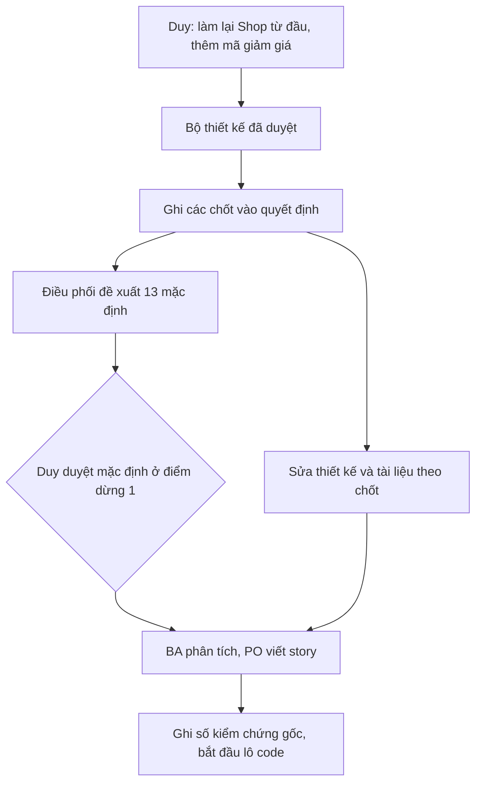

# Đầu vào: Shop làm lại từ đầu theo thiết kế 06/10 (lô 0)
> Điều phối · 2026-10-10 · Nhánh `shop/lo-0-quyet-dinh` (tách từ `design/shop-ui` đã gộp `main` a0c94d4).

## Yêu cầu nguyên văn của Duy
"coi như làm lại shop từ đầu đó" · "ok làm lại từ đầu đi, chuẩn chỉ vào" · "erp làm quản lý voucher, tạo voucher".

## Nguồn thiết kế (đã duyệt)
`doc/design/shop/`: README (11 chốt), UI-RULES, SO-CHUAN, COMPONENTS (48 component), HUONG-DAN-CODE, PLAN (lô 0–7, 3b),
DOI-CHIEU-CODE (BE-1…BE-11, L-xx), AUDIT-DO-DU (§8 câu mở), RENDER-AUDIT (hai file này nay ở `doc/archive/design-shop/`). Màn: `screens/*.dc.html`. Canvas: https://claude.ai/artifact/SPSQLR5rMEtuBFreYbK96J

## Đã chốt (ghi `doc/decisions.md` mục 2026-10-10 tối)
Xem decisions. Tóm tắt: làm lại từ đầu; `/` = trang chủ Shop, landing → `/gioi-thieu/` dựng mới; tối thiểu 1 kg, combo nguyên; tồn 3 mức;
không HĐĐT; không luồng hoàn tiền trên Shop; địa chỉ một ô + Google Maps; trả xong vào trang đơn; không hiện người nhận; mã `SO…`;
**không phí ship, trả một lần qua QR, bỏ dòng "Phí giao"**; **có mã giảm giá + màn ERP quản lý/tạo mã**; **không có chip "Tìm nhiều"**,
một ô tìm; đuôi lô < 1 kg không bán trên Shop; Liên hệ / Cách mua là trang CMS.

## Mặc định điều phối đề xuất, CHỜ DUY DUYỆT ở điểm dừng 1 (BA đưa vào 01-analysis, đánh dấu rõ)
| # | Mặc định |
|---|---|
| D1 | Mã giảm giá **không cộng dồn** với ưu đãi tự động (PricingRule); hệ thống lấy cái lợi hơn cho khách. |
| D2 | Chủ hoặc Quản lý tạo/tắt mã trong ERP, AuditLog. |
| D3 | Chỉ **mã công khai** dùng chung; giới hạn theo **tổng lượt**, không giới hạn theo khách/SĐT (tránh dữ liệu cá nhân). Mỗi đơn tối đa 1 mã. |
| D4 | Bước tăng **0,5 kg** sau mức tối thiểu 1 kg. |
| D5 | **Bỏ nút "Huỷ đơn"** ở màn thanh toán; đơn chưa trả tự huỷ sau 30 phút (không BE-6, không BR-BH-19). |
| D6 | Tra đơn bằng **mã đơn + SĐT đầy đủ (POST)** + `lookup_token` lưu ở trình duyệt khách; gỡ GET `phone_last4`. |
| D7 | Bỏ ô "Lô mới về" (thiết kế đã đổi thành "Tất cả"). |
| D8 | Chỉ giao diện sáng; icon SVG nét gom `Icon.tsx`. |
| D9 | BottomNav hiện ở Trang chủ, Danh mục, Góc bếp và Tra cứu đơn. |
| D10 | Menu nhóm máy tính một cấp. |
| D11 | Copy 404 + metadata SEO `/`, `/gioi-thieu/`: `mkt-brand` viết, Duy duyệt cùng story. |
| D12 | Chưa có logo thì chữ "Cá Về"; logo Bộ Công Thương chỉ gắn khi có link xác nhận thông báo website, trước đó chừa chỗ. |
| D13 | Gợi ý khi gõ tìm (A9) giữ. |

## Hệ quả cần sửa thiết kế/tài liệu do chốt 10/10
- Bỏ dòng "Phí giao · Báo khi xác nhận đơn" ở C1, C1c, C2, C4, D1 và UI-RULES §2.3.
- Bỏ chip "Tìm nhiều" ở header H1 (HeaderFooter-*, Home, DesktopHome), COMPONENTS (SearchBox/ShopHeader), BE-7 `search_chips`.
- Màn ERP quản lý mã giảm giá (BE-11 + erp-console) vào lô 3b.

## Kiểm chứng gốc (10/10, nhánh đã gộp main, trước gộp: design/shop-ui+agent)
FE: npm ci OK; tsc 0 lỗi; build OK 10 trang; check-no-mock XANH khi `NEXT_PUBLIC_USE_MOCK=0` (ĐỎ 22 chỗ nếu build trần vì `.env.local` bật mock);
test-format 26/26; test-safe-href 40/40. BE: `test apps.catalog apps.sales` 791 OK; makemigrations No changes; check_naming có sẵn 2 cảnh báo
`thong-tin-nguoi-ban`; grep hex trong component: 120 dòng có sẵn.
