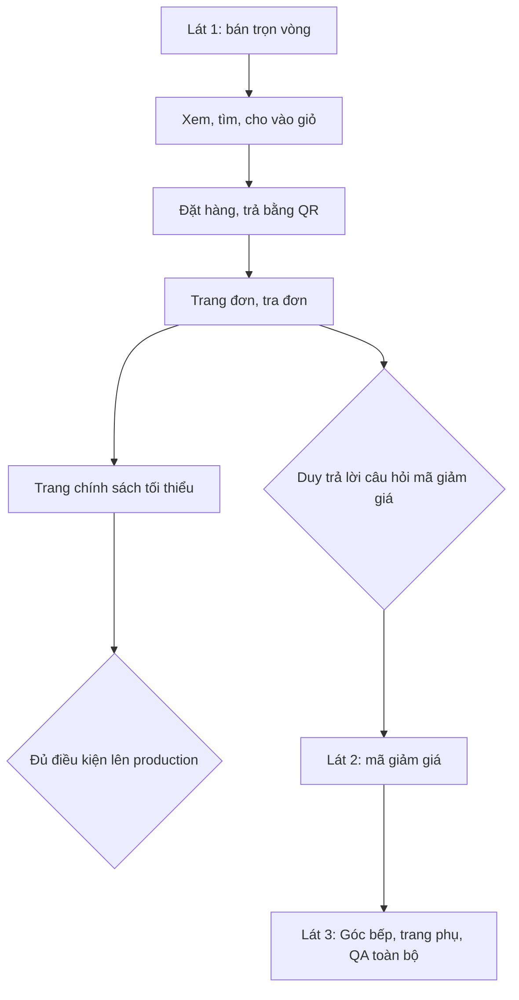

# Shop làm lại từ đầu (thiết kế 06/10): product brief
> PM · 2026-10-10 · Trạng thái: **CHỜ DUYỆT** · Nhánh `shop/lo-0-quyet-dinh`
> Đầu vào: `00-dau-vao.md`, `doc/decisions.md` mục 2026-10-10 (tối), `doc/design/shop/` (README, PLAN, DOI-CHIEU-CODE, AUDIT-DO-DU, UI-RULES),
> code `frontend/`, `backend/apps/catalog/items/shop_api.py`, `backend/apps/sales/orders/shop_api.py`, `backend/apps/sales/{models,payments}/`.

**Khuyến nghị: LÀM**, chia 3 lát. Lát 1 là vòng mua trọn (xem, giỏ, đặt, trả QR, trang đơn) và là điều kiện để Shop lên production.
Mã giảm giá (3b) làm ngay sau lát 1. Lý do: Shop chưa chạy production nên chưa có khách để mất, còn đây là lần duy nhất được đổi contract API mà không cần giữ đường cũ.

---

## 1. Vấn đề và chỉ số thành công

### 1.1 Vấn đề
Shop chưa chạy production, nên **chưa có bằng chứng từ khách thật** (chat, phàn nàn, số liệu). Các dòng có nhãn (PA) là giả định.

| Ai | Đang chịu gì | Nguồn |
|---|---|---|
| Khách Shop | Giỏ hàng và đặt hàng nằm chung một trang (`CheckoutScreen.tsx`). Bấm F5 lúc thanh toán là mất màn thanh toán. Tra đơn phải nhớ 4 số cuối SĐT. Không có tìm kiếm, không có thông tin sản phẩm (quy cách, bảo quản, nguồn hàng) | Code, DOI-CHIEU §1.2 |
| Khách Shop | Bố cục không giống các trang bán lẻ khách đã quen, nên khó tin để chuyển khoản trước 100% | (PA). Duy chốt "kiểu Long Châu" |
| Lộc | Shop API trả `sellable_qty`, đối thủ đọc được tồn kho theo giờ | `catalog/items/shop_api.py:26`, L-04 |
| Lộc | Khách đặt được 0,1 kg (BE chỉ chặn qty ≤ 0), cân và đóng gói lẻ tốn công | `orders/services.py`, L-05 |
| Lộc | Không có công cụ khuyến mãi để kéo đơn đầu tiên. PricingRule chỉ tự động, không phát mã được | Duy chốt 07/10 và 10/10 |
| NV kho / NV giao | Chưa thấy ảnh hưởng trực tiếp. Shop đổi giao diện nhưng phiếu giao, giữ chỗ và FEFO giữ nguyên | — |

### 1.2 Chỉ số thành công
Mọi số đều lấy từ DB production. Không gắn analytics, pixel hay đo theo cá nhân khách (bất biến 9). **Chưa có số gốc** vì production chưa chạy Shop. Số gốc là 4 tuần đầu sau go-live, mục tiêu để `[placeholder]`.

| Loại | Chỉ số | Cách đo (dữ liệu đã có) |
|---|---|---|
| **Chính** | **Tỷ lệ đơn đã trả tiền** = số đơn có hoá đơn ÷ số đơn đã tạo, theo tuần. Mục tiêu `[placeholder]` | `SalesOrder.created_at`, `status` ∈ {PROCESSING, COMPLETED, CANCELLED có hoá đơn} so với tổng. Mọi đơn đều do Shop tạo (BR-PQ-11) |
| Canh chừng 1 | **Tỷ lệ giữ chỗ hết hạn** = số đơn `AUTO_CANCELLED` ÷ số đơn đã tạo. Tỷ lệ này tăng là khách bỏ ngang ở bước trả tiền, đồng thời hàng bị khoá 30 phút vô ích | `SalesOrder.status = AUTO_CANCELLED`. Phụ: `checkout_attempts > 1` (khách phải trả lại) |
| Canh chừng 2 (từ 3b) | **Tiền giảm giá ÷ doanh thu gộp** và số lượt dùng mỗi mã, so với trần Lộc đặt `[placeholder]` | `SalesOrderLine.discount_amount` (đã có), cộng bảng lượt dùng mã (BE-11, mới) |
| Theo dõi | Đơn huỷ sau khi đã trả vì hết hàng (E-06/E-07). Tiền về sau khi đơn đã huỷ (E-03) | `CreditNote.reason_code`, `PaymentTransaction.match_status = ORPHAN` |

Không đo được tỷ lệ xem hàng → bỏ giỏ, vì giỏ chỉ nằm ở trình duyệt. Đề xuất chấp nhận khoảng mù này, không thêm tracking.

---

## 2. Phạm vi và chia lát

### 2.1 Lát theo giá trị
| Lát | Giá trị | Lô PLAN | Ghi chú |
|---|---|---|---|
| **Lát 1: bán được trọn vòng** | Khách xem, tìm, cho vào giỏ, đặt, trả QR rồi xem đơn. Lộc không lộ tồn, không phải bán lẻ dưới 1 kg | 1, 2 (+BE-2), 3, 4, cùng phần pháp lý tối thiểu của 5 (chính sách, liên hệ, cách mua trên CMS) | **Điều kiện lên production** |
| **Lát 2: khuyến mãi** | Lộc tạo mã, khách nhập mã ở giỏ | 3b (BE-11, FE B5–B8/C6, **màn ERP mã giảm giá**) | Cần trả lời 🔴 Q1–Q3 trước khi làm |
| **Lát 3: hoàn thiện** | Góc bếp và trang phụ theo giao diện mới, QA E2E toàn bộ | phần còn lại của 5, rồi 7 | Ít rủi ro nghiệp vụ |

**Không làm (V1):** phí ship · hoá đơn điện tử trên Shop · luồng hoàn tiền trên Shop · khách tự huỷ đơn (D5, không có BE-6) · chip "Tìm nhiều" (bỏ BE-7 `search_chips` và phần chip ở lô 6) · ô "Lô mới về" · nhiều ảnh mỗi món (ẩn bộ đếm) · menu nhóm hai cấp · dark mode · mã riêng từng khách hoặc giới hạn lượt theo SĐT · lưu toạ độ bản đồ · BE-8 (giữ mã `SO…`) · màn D5 "chuyển thiếu" (webhook ngân hàng đã tắt, cổng cố định số tiền, L-15). Đề xuất dời D5 sang sau và để trạng thái chung "Cá Về sẽ gọi".

### 2.2 Đề xuất đổi lô vì "làm lại từ đầu" (cần Duy gật)
1. **Mỗi lô thay route của mình và xoá code cũ ngay trong lô đó**, không để hai bản cùng chạy. Lô 1 xoá Landing ở `/`, `ShopHeader`/`ShopFooter` cũ và `SiteLegalFooter` (gộp vào F1). Lô 2 xoá `CatalogGrid`, `AddToCartControl` và phần giỏ trong `CheckoutScreen`. Lô 3+4 xoá `CheckoutScreen`, `PaymentPanel`, `OrderPaymentPanel`, `OrderLookup` cũ. Mỗi lô sửa hoặc xoá phần e2e cũ của mình (có 21 chỗ trỏ route cũ), không dồn sang lô 7.
2. **Gỡ đường API cũ trong chính lô thay nó, không đợi lô 7.** `sellable_qty` gỡ ở lô 2 (BE-1), GET `phone_last4` gỡ ở lô 3. Decisions 10/10 đã cho phép đổi contract, không giữ đường cũ.
3. **Lô 3 và lô 4 merge vào `main` cùng một lần.** Dev vẫn làm hai lô, nhưng nếu merge lô 3 mà không có trang đơn mới thì `main` có đặt hàng mà không tra được đơn, vì GET cũ đã gỡ. Làm vậy `main` luôn ở trạng thái mua được.
4. **Kéo BE-2 (field mặt hàng) và màn ERP nhập field lên lô 2b** (sau BE của lô 2, chạy song song với FE lô 2), không để ở lô 6. Lý do: màn A3 hiện Quy cách, Bảo quản, Nguồn hàng, Mô tả. Không có màn ERP thì Lộc không nhập được, A3 trống khi go-live (AUDIT câu 13). Slug nhóm tự sinh bằng data migration ở BE-1, màn ERP sửa slug đi cùng 2b. Phần còn lại của lô 6 là chip, đã bỏ. **Như vậy lô 6 được xoá.**
5. **3b chạy sau 3+4** vì cần `create_order` và trang đơn mới. Màn ERP mã giảm giá đặt trong `erp-console/features/catalog/`, cạnh `PricingRuleList`/`PricingRuleForm` đã có. PLAN đang ghi `features/items/*`, nhưng thư mục này không tồn tại.

Thứ tự đề xuất: **0 → (1 ∥ BE lô 2) → FE lô 2 ∥ 2b (BE-2 + ERP mặt hàng) → 3+4 (một lần merge) → 3b (BE ∥ FE Shop ∥ ERP) → 5 → 7.**

### 2.3 Màn ERP cần thêm
| Màn | Lô | Nội dung |
|---|---|---|
| Mặt hàng: thêm field | 2b | `short_note`, `spec`, `storage`, `origin` (mới), `description` (đã có trong model nhưng API chưa trả), sửa trong `ItemForm.tsx` |
| Nhóm hàng: slug | 2b | `ItemGroupList`/`ItemGroupModal` hiện slug, cho sửa và kiểm trùng |
| **Mã giảm giá** | 3b | Danh sách (mã, kiểu, giá trị, trần, đơn tối thiểu, hiệu lực, đã dùng/tổng lượt, đang bật) · tạo · tắt (không xoá, bất biến 3) · xem các đơn đã dùng mã (chỉ mã đơn và số tiền giảm, không hiện tên hay SĐT khách) · AuditLog |

---

## 3. Đối chiếu BR / quyết định

### 3.1 Chỗ trái hoặc chưa có BR
| Điểm | BR / quyết định | Tình trạng | Việc ở lô 0 |
|---|---|---|---|
| Combo tính theo combo, số nguyên | BR-DM-01 "mọi mặt hàng bán theo Kg" | **TRÁI** (decisions đã chốt sửa, spec chưa sửa) | Sửa BR-DM-01 |
| Tồn 3 mức, không hiện kg | BR-BH-01 chữ "hiển thị" | **TRÁI câu chữ** | Sửa BR-BH-01, ngưỡng "Sắp hết" đọc từ settings |
| Tối thiểu 1 kg, bước 0,5 | Chưa có BR | **Thiếu**. ⚠ PLAN và DOI-CHIEU đề xuất mã **BR-BH-18**, nhưng **BR-BH-18…21 đã có chủ** (hoàn tất đơn, 07/10, spec dòng 330–333) | Dùng mã **BR-BH-22**: SIMPLE ≥ 1 kg và là bội của 0,5; BUNDLE là số nguyên ≥ 1; kiểm ở BE |
| Đuôi lô < 1 kg không bán trên Shop | Chưa có BR | Thiếu | **BR-BH-23**: `stock_level = out` khi tồn bán được < mức tối thiểu |
| Khách tự huỷ đơn | PLAN ghi "BR-BH-19 nếu giữ" | Đã bỏ (D5). **Không dùng lại mã BR-BH-19** vì mã này đã có chủ | Gạch dòng này trong PLAN |
| Mã giảm giá | BR-DM-08 + ranh giới §3.1 spec "không mã giảm giá" · URD dòng 69 "ngoài phạm vi: … không mã giảm giá" · decisions 2026-09-10 dòng 98 | **TRÁI 3 chỗ**. Decisions 10/10 đã lật, nhưng spec §3.1, BR-DM-08 và URD §ngoài phạm vi chưa sửa | Sửa ba chỗ. Rule mới **BR-DM-17…20** (BR-DM-09…16 đã dùng cho ảnh): định nghĩa mã; không cộng dồn, lấy cái lợi hơn (D1); đóng băng lúc tạo đơn như BR-BH-08; cách tính lượt (🔴 Q1) |
| Không phí ship, trả một lần qua QR | BR-BH-10 | **Khớp**. Nhưng UI-RULES §2.3 và 6 màn (C1, C1c, C2, C4, D1 cùng landing) còn câu "Báo khi xác nhận đơn" | Sửa UI-RULES §2.3 thành "không có dòng phí giao, không hứa miễn phí giao" |
| Bỏ chip "Tìm nhiều" | — | Khớp sau khi sửa | Xoá `search_chips` khỏi BE-7, xoá chip khỏi lô 6, COMPONENTS (SearchBox/ShopHeader), HeaderFooter-*, Home, DesktopHome |
| Shop không hiện hoàn tiền | Nội dung CS-10 `customer_notices.py` (trả `refund{…}`) | **TRÁI nội dung đã nghiệm thu** | Story sửa `cancel_notice`. Câu chữ do `legal-vn` duyệt |
| Tra đơn bằng SĐT đầy đủ qua POST (D6) | Bất biến 9 | Khớp, chặt hơn hiện tại | BE-5, gỡ GET |
| Quản lý tạo mã (D2) | Ranh giới BR-PQ: *Chủ giữ việc đổi con số lời lỗ*. `set_price` (ItemPrice + PricingRule) là quyền nhạy cảm, Quản lý chỉ có quyền xem `pricingrule` | **TRÁI** (xem §5) | Đề xuất sửa D2 |

### 3.2 Dữ liệu backend: đã có và còn thiếu
| Cần cho | Đã có (file · field) | Chưa có, phát sinh |
|---|---|---|
| Tồn 3 mức | `catalog/items/services.py` `sellable_qty` (tính được) | `stock_level` trong API, settings ngưỡng (BE-1), không cần migration |
| Đơn vị, min, bước | — | `unit` (đang hard-code `"Kg"`), `min_qty`, `qty_step` (BE-1), kiểm ở `create_order` (BE-3) |
| Lọc nhóm | `ItemGroup.name`, `parent` | `ItemGroup.slug` + migration (BE-1) |
| Thông tin sản phẩm | `Item.description` | `short_note`, `spec`, `storage`, `origin` + migration (BE-2) |
| Lỗi hết hàng không lộ kg hay mã lô | — | BE-3/BE-10. Câu lỗi hiện còn lộ `batch_id` (`inventory/batches/services.py:128`) |
| Response tạo đơn | `order_code`, `total_amount`, `booked_expires_at` | `lines`, `lookup_token`, `client_request_id` + migration (BE-4) |
| Tra đơn | `lines`, `status_label`, `delivery.status`, `booked_expires_at`, `cancel_notice` | POST + token, `placed_at`/`paid_at`/`delivered_at`, `reason_label` (BE-5) |
| Ưu đãi tự động | `PricingRule`, `SalesOrderLine.pricing_rule`/`discount_amount`, phân bổ giảm theo dòng (`orders/services.py:84-251`) | — |
| Mã giảm giá | Chưa có gì (grep `voucher` trả 0 kết quả) | Model `Voucher`, liên kết đơn ↔ mã ↔ số tiền giảm, API kiểm mã, API ERP, quyền Tầng 2 mới + migration (BE-11) |
| Site info | `seller.*`, `confirmation_policy.hotline` | `zalo`, `return_report_hours` (BE-7, đã bỏ `search_chips`) |
| Chống spam | `ShopOrderCreateThrottle`, `ShopCheckoutThrottle`, `ShopLookup*Throttle` (`apps/common/throttling.py`) | Throttle cho API kiểm mã |

---

## 4. Rủi ro nghiệp vụ và cách giảm
| Rủi ro | Mức | Cách giảm |
|---|---|---|
| **Giá vốn.** Mã giảm giá đẩy giá bán xuống dưới giá vốn lô. API kiểm mã hoặc màn ERP vô tình lộ biên lợi nhuận | High | Mã kiểu % bắt buộc có trần tiền. Màn ERP mã không hiện giá vốn. Shop API giữ dạng dict liệt kê field tường minh. Giảm giá phân bổ vào `SalesOrderLine.discount_amount` như PricingRule để lãi lỗ theo lô vẫn đúng. Quyền tạo mã thuộc Chủ (Q3) |
| **Tiền.** Mã làm tổng đơn bằng 0đ hoặc âm, cổng QR không lập được. Giá hoặc mã đổi giữa lúc xem giỏ và lúc đặt | High | BE chặn tổng sau giảm < mức sàn (Q2). Mã và tiền giảm đóng băng lúc tạo đơn. Mã hết hạn lúc đặt thì hiện popup C6 hỏi lại khách, không tự đổi giá. Số tiền QR luôn lấy `total_amount` từ BE |
| **Lạm dụng mã.** Dò mã. Một người đặt nhiều đơn BOOKED để đốt hết lượt hoặc giữ hàng | Medium | Throttle API kiểm mã. Đếm lượt theo cách ở Q1, đơn hết hạn thì nhả lượt. Đã có throttle tạo đơn. Mã công khai chấp nhận rủi ro một người dùng nhiều lần (D3), Lộc kiểm soát bằng tổng lượt và hạn dùng |
| **Giữ chỗ.** Bấm "Thử lại" (C4) tạo đơn trùng, giữ hàng gấp đôi. Bỏ nút Huỷ (D5) nên hàng bị khoá 30 phút | Medium | `client_request_id` (BE-4). Theo dõi chỉ số canh chừng 1. Job `cancel_expired_orders` vẫn idempotent |
| **Dữ liệu cá nhân.** Trang đơn công khai. Google Maps nhận địa chỉ và IP. Token tra đơn | High | Lookup không trả tên, SĐT, địa chỉ (có test bắt buộc). SĐT không nằm trong URL, không lưu ở trình duyệt. Maps chỉ nạp khi bấm, khoá API giới hạn referrer và hạn mức. Chính sách quyền riêng tư nêu Google **trước go-live**. Màn ERP xem lượt dùng mã chỉ hiện mã đơn |
| **Tồn chết.** Đuôi lô < 1 kg không bán được trên Shop | Low | Đã chốt Lộc bán ngoài hoặc điều chỉnh tồn. Theo dõi kg điều chỉnh hoặc hao hụt sau go-live |
| **Pháp lý** → cần `legal-vn` | — | Chính sách quyền riêng tư (Google Maps). Câu "Cá Về sẽ gọi cho bạn" thay chi tiết hoàn tiền (nghĩa vụ báo cách xử lý tiền). **Mã giảm giá là hoạt động khuyến mại**: kiểm trần mức giảm và nghĩa vụ thông báo hay đăng ký khuyến mại. Xác nhận nghĩa vụ HĐĐT |
| **Copy** → cần `mkt-brand` | — | 404, metadata `/` và `/gioi-thieu/` (D11), câu lỗi mã giảm giá, câu thay "phí giao" |

---

## 5. Câu hỏi 🔴 cho Duy (chưa có trong 00-dau-vao)
| # | Câu hỏi | Khuyến nghị |
|---|---|---|
| Q1 | **Lượt dùng mã tính lúc nào?** Nếu tính lúc tạo đơn thì đơn hết hạn 30 phút vẫn ăn lượt, có thể bị đốt hết lượt. Nếu tính lúc trả tiền thì có thể vượt tổng lượt khi nhiều người đặt cùng lúc | **Giữ lượt khi tạo đơn, nhả lượt khi đơn `AUTO_CANCELLED`.** Đơn đã trả rồi bị huỷ thì không trả lượt. Không bao giờ vượt tổng lượt |
| Q2 | **Trần giảm và sàn tiền đơn.** Mã có được giảm tới 100% không? Đơn sau giảm còn 0đ thì sao? | Mã kiểu % bắt buộc có trần tiền. Mức giảm ≤ `[placeholder]`% giá trị đơn, chờ `legal-vn` xác nhận trần khuyến mại. Tổng sau giảm ≥ `[placeholder]` đ (> 0) |
| Q3 | **Sửa mặc định D2.** Mã giảm giá làm đổi con số lời lỗ, đúng phần "Chủ giữ" của ranh giới phân quyền. Hiện Quản lý không sửa được giá và PricingRule | Quyền Tầng 2 mới `manage_voucher`, **mặc định chỉ Chủ**. Chủ uỷ cho Quản lý ở màn Phân quyền như quyền "Sửa giá bán". AuditLog giữ nguyên |
| Q4 | **Production có chờ mã giảm giá không?** | **Không chờ.** Lát 1 cùng trang pháp lý đủ thì lên production. 3b lên ngay sau, mã chỉ phát khi 3b đã QA đạt |

Đề xuất PM ở §2.2 (xoá code cũ theo lô, gộp merge 3+4, kéo BE-2 và ERP mặt hàng lên 2b, bỏ lô 6) cần Duy gật cùng lúc với 01-analysis.
Các câu UX hoặc kỹ thuật còn mở trong AUDIT §8 (17, 22, 29–32, 34–35) để `techlead`/ux chốt ở 02b, không cần hỏi Duy. Riêng câu 32 (D3 chờ ngân hàng bao lâu) BA đề xuất mặc định.
