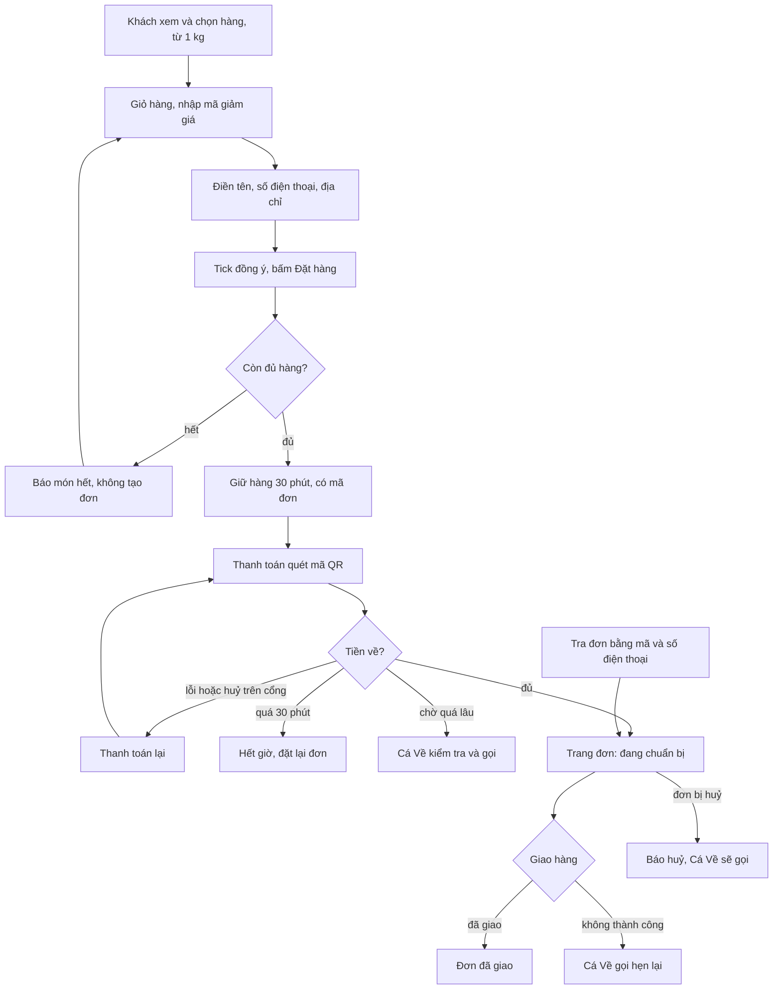

# Shop làm lại từ đầu theo thiết kế 06/10: phân tích nghiệp vụ
> BA · 2026-10-10 · Trạng thái: **ĐÃ DUYỆT** 10/10 (Duy: "cho làm shop" → nhóm A §11.1 + V-01…V-12 theo khuyến nghị; nhóm B S-08, S-12, S-14, S-16, S-18, S-19, S-23 còn chờ, không chặn lô 0–1). Không cấu trúc lại thư mục code.
> Nhánh `shop/lo-0-quyet-dinh`. Đầu vào: `00-dau-vao.md` (D1–D13), `00-product-brief.md` (PM), `05-phap-ly.md` (legal-vn), `06-marketing.md` (mkt-brand),
> `doc/decisions.md` mục 2026-10-10 (tối), `doc/design/shop/` (README, UI-RULES, DOI-CHIEU-CODE, AUDIT-DO-DU §1 §8, PLAN), `doc/business-process-spec.md`, `doc/URD.md`.
> Code đã đối chiếu: `catalog/models/items.py`, `catalog/models/pricing.py`, `catalog/items/shop_api.py`, `sales/models/orders.py`, `sales/orders/services.py`,
> `sales/orders/customer_notices.py`, `content/site/services.py` + `api.py`, `content/models/entries.py`, `accounts/capabilities/registry.py`.
> Phân tích không phụ thuộc đường dẫn code (đề xuất đổi thư mục ở `doc/kien-truc/de-xuat-cau-truc-lai.md` chưa duyệt).

Ký hiệu nguồn: **(D)** Duy đã chốt (decisions 10/10 tối hoặc trước) · **(L)** Lộc nói · **(MĐ)** mặc định chờ Duy duyệt ở điểm dừng 1 · **(PA)** giả định thiết kế.
Mức câu hỏi: 🔴 chặn lô · 🟡 BA đã đặt mặc định, Duy chỉ cần phản đối nếu khác · 🟢 để sau.

---

## 1. Yêu cầu gốc
"coi như làm lại shop từ đầu đó" · "ok làm lại từ đầu đi, chuẩn chỉ vào" · "erp làm quản lý voucher, tạo voucher". Duy, 10/10/2026 (`00-dau-vao.md`).
Thiết kế nguồn đã duyệt: `doc/design/shop/` (86 màn, 11 chốt ở README). Quyết định ràng buộc: decisions 2026-10-10 (tối).

## 2. Tóm tắt
- **Khách** cần xem, tìm, chọn hàng theo kg (từ 1 kg) hoặc theo combo, đặt hàng với một ô địa chỉ, trả một lần qua mã QR rồi theo dõi đơn trên một trang duy nhất,
  để mua hải sản cấp đông online mà tin được giá cuối cùng và không lộ thông tin cá nhân.
- **Lộc (Chủ)** cần Shop không lộ tồn kho theo kg, không bán lẻ dưới 1 kg, và có công cụ phát **mã giảm giá** trong ERP có kiểm soát (trần, lượt, hạn),
  để kéo đơn đầu tiên mà không làm sai lãi lỗ theo lô.

## 3. Bối cảnh trong hệ thống

| Hạng mục | Nội dung |
|---|---|
| Quy trình | **P-05** (bán hàng Shop, thanh toán) là chính. Chạm **P-01** (danh mục, combo, ưu đãi), **P-07** (huỷ đơn, hiển thị cho khách), CMS nội dung (BR-ND) |
| Rule hiện có bị chạm | BR-DM-01, BR-DM-06, BR-DM-08, §3.1 ranh giới combo · BR-BH-01, 02, 03, 07, 08, 09, 10, 11, 15 (tổng nguyên đồng), 17 (đồng ý dữ liệu) · BR-TT-04, 05, 07, 12 (trả về trang đơn), 18 · BR-HT-02, 04, 06 · BR-ND-18, 19 · BR-PQ-04, 10, 11, 12 |
| Quyết định ràng buộc | decisions 2026-10-10 (tối) toàn mục · 2026-10-07 (BR-BH-18…21 đơn Hoàn tất; tên trang `terms` = "Điều kiện giao dịch chung") · 2026-09-26 (FEFO, SePay chỉ VietQR, webhook ngân hàng tắt, hạn dùng mặc định 365 ngày) · 2026-09-10 (combo/PricingRule, Refund thủ công, phân quyền Chủ ↔ Quản lý) |
| Quyết định bị lật (đã lật bởi Duy) | 2026-09-10 "không mã giảm giá" (dòng 98) · bối cảnh "Landing tách Shop" (dòng 150) |

### 3.1 Hiện trạng code (để phân tích khớp thực tế, không chỉ khớp tài liệu)
| Điểm | Hiện trạng | Hệ quả cho phân tích |
|---|---|---|
| Tồn trên Shop | API công khai trả `sellable_qty` (số kg), `unit` luôn `"Kg"` kể cả combo | Lộ tồn theo giờ; combo hiện "/ kg" sai |
| Số lượng đặt | BE chỉ chặn `qty ≤ 0`; dòng đơn nhận 0,001 | Đặt được 0,1 kg, 1,5 combo |
| Nhóm hàng | `ItemGroup` chỉ có `name`, `parent`; không có slug | Không lọc được bằng `?group=` ổn định |
| Thông tin mặt hàng | Chỉ có `description` (API không trả) | A3 trống nếu không thêm field + màn ERP |
| Ưu đãi | `PricingRule` 1 tầng, hiệu lực **theo ngày** (không giờ), % tối đa 100, không trần tiền; giảm có thể bằng toàn bộ giá trị (min(giảm, gốc)) | Mã giảm giá cần mốc **ngày giờ**, trần; PricingRule hiện có thể đưa tổng về 0 (xem 🟡 V-10) |
| Quyền giá | Capability `set_price` (ItemPrice + PricingRule) đánh dấu nhạy cảm; Quản lý chỉ xem `pricingrule` | D2 "Chủ hoặc Quản lý tạo mã" trái ranh giới hiện tại |
| Tra đơn | `GET …/?phone_last4=` (spec §7.1, URD dòng 41, 87 ghi "4 số cuối") | D6 đổi sang SĐT đầy đủ qua POST + token |
| Thông báo huỷ | `cancel_notice` trả `refund{amount,status_label,deadline,refunded_at}` và câu "sẽ được hoàn trong vòng N ngày" (CS-10) | Trái chốt "Shop không hiện luồng hoàn tiền" |
| Trang CMS | `page_role` chỉ có `privacy`, `terms`, `refund`, `seller_info` | Trang Giao hàng, Thanh toán, Khiếu nại chưa được khoá như trang bắt buộc |
| site-info | `seller` 7 field, `confirmation_policy.hotline`, giờ gọi xác nhận; **không** có Zalo, giờ làm việc, nơi/ngày cấp GCN, link thông báo website | Footer, Liên hệ, A7 thiếu dữ liệu |
| Vùng giao | **Không có** kiểm vùng giao. BR-BH-12/13 (Lộc nói "chỉ giao miền Nam, kho Phan Thiết", 26/09) vẫn ở hồ sơ `2026-09-26-hop-duy-loc` **CHỜ DUYỆT**, chưa vào spec | Mâu thuẫn tiềm ẩn với "địa chỉ một ô"; xem câu 🔴 S-08 |

---

## 4. Tác nhân và quyền

| Tác nhân | Group | Làm được gì trong phạm vi này | Quyền Tầng 2 cần |
|---|---|---|---|
| Khách | (không phải User) | Xem, tìm, giỏ, nhập mã giảm giá, đặt, trả QR, tra đơn bằng mã + SĐT hoặc token | — |
| Hệ thống | `actor=None` | Tính mức tồn, kiểm số lượng, chọn ưu đãi lợi hơn, giữ/nhả lượt mã, tạo đơn, tự huỷ TTL, xác nhận IPN | — |
| Chủ (Lộc) | `owner` | Tạo, sửa (chỉ theo hướng có lợi cho khách), tắt mã giảm giá; xem lượt dùng; nhập field mặt hàng, slug nhóm; xử lý tiền đơn huỷ (P-07 giữ nguyên) | `manage_voucher` (**mới**), `set_price` (có), `confirm_refund` (có) |
| Quản lý | `manager` | Nhập field mặt hàng, slug nhóm (MĐ, cùng quyền sửa mặt hàng hiện có); **không** tạo mã trừ khi Chủ uỷ `manage_voucher` (MĐ, sửa D2) | — mặc định |
| NV kho, NV giao, NV gọi xác nhận | `warehouse_staff`, `delivery_staff`, `customer_service` | Không đổi. Phiếu giao, giữ chỗ, FEFO giữ nguyên | — |
| Người soạn nội dung (MKT) | **chưa có nhóm** | Soạn nội dung CMS. Cách đăng nhập: câu 🔴 S-20 | — |
| Google (Maps Platform) | bên thứ ba, ngoài nước | Nhận chữ khách gõ, vị trí ghim, IP khi khách bấm "Bản đồ" (D, 10/10) | — |
| Cổng thanh toán (SePay) | bên thứ ba qua adapter | Không đổi | — |

---

## 5. Phạm vi

### 5.1 Trong phạm vi
- Shop công khai dựng mới toàn bộ theo `doc/design/shop/`: khung chung (header H1–H4, BottomNav, footer F1/F2), nhóm màn A–F, hai khổ 390 px và 1280 px, `/` là trang chủ Shop, `/gioi-thieu/` là landing dựng mới (D).
- Thay contract API Shop (không giữ đường cũ, D 10/10): mức tồn 3 mức, đơn vị, mức tối thiểu và bước, slug nhóm, field thông tin mặt hàng, lỗi hết hàng có cấu trúc, tạo đơn chống trùng, tra đơn POST + token, mốc giờ, nhãn lý do huỷ.
- Mã giảm giá: Shop (ô mã ở giỏ, dòng giảm ở đặt hàng, thanh toán, trang đơn) và **màn ERP quản lý mã** (D).
- Màn ERP nhập field mặt hàng mới và slug nhóm (MĐ kéo lên lô 2b).
- Nội dung chữ của thiết kế nạp vào CMS (D 10/10); câu chữ pháp lý tối thiểu ở giao diện (ô đồng ý, dòng Google, "Đã gồm giao hàng", câu đơn huỷ).

### 5.2 Ngoài phạm vi (V1)
Phí ship (BR-BH-10 giữ) · hoá đơn điện tử trên Shop · tiến độ hoàn tiền trên Shop (ERP Refund giữ nguyên) · khách tự huỷ đơn (D5, không BE-6) · chip "Tìm nhiều" (bỏ `search_chips` BE-7) ·
ô "Lô mới về" (D7) · nhiều ảnh mỗi món · menu nhóm hai cấp (D10) · dark mode (D8) · mã riêng từng khách, giới hạn lượt theo SĐT (D3) · lưu toạ độ bản đồ (D) ·
nút "Vị trí của tôi" (đề xuất, S-07) · tiền tố mã đơn `CV` (giữ `SO…`) · màn D5 "chuyển thiếu" riêng (MĐ dời, V-08) · analytics, pixel, chat (UI-RULES §3.4) ·
phát mã sau khi mua (sẽ thành "phiếu mua hàng", phải soát pháp lý lại) · kiểm vùng giao tự động trước giữ chỗ (BR-BH-12, xem S-08) · lập HĐĐT từng đơn (lô ERP riêng nếu kế toán xác nhận bắt buộc, S-15).

---

## 6. Use case theo nhóm màn

Quy ước chung cho mọi UC phía khách: trạng thái đơn lấy từ server **luôn thắng** tham số `result` trên URL (UI-RULES §2c). Không màn nào hiện số kg tồn, mã lô, ngày nhập lô, giá vốn,
tên/SĐT/địa chỉ người nhận. Giỏ chỉ giữ mã hàng, số lượng, giá lúc thêm (bất biến 9).

### UC-A Khách xem và chọn hàng (A1 Trang chủ · A2 Danh mục · A3 Chi tiết · A4 Toast · A5 Tìm không thấy · A6 Mất mạng · A7 Tạm hết · A8 Đang tải · A9 Gợi ý tìm · A10 Chi tiết combo)
- **Tiền điều kiện:** mặt hàng `is_active`, có giá niêm yết hiệu lực (BR-DM-02).
- **Luồng chính:** 1. Khách vào `/` (A1) hoặc danh mục (A2). 2. Hệ thống trả danh sách món với giá, đơn vị (`kg` hoặc `combo`), mức tồn 3 mức, ghi chú ngắn, ảnh, nhóm (BR-BH-23).
  3. Khách lọc theo nhóm, sắp xếp, hoặc gõ tìm (A9 gợi ý tối đa 5 món, D13). 4. Khách bấm "Thêm 1 kg" (SIMPLE) hoặc "Thêm 1 combo" (BUNDLE), nút đổi thành bộ tăng giảm theo bước (BR-BH-22). Toast A4.
  5. Khách mở chi tiết (A3/A10): Quy cách, Bảo quản, Nguồn hàng, Mô tả (BR-DM-25); combo có bảng thành phần.
- **Luồng phụ:** món "Sắp hết" có nhãn hổ phách · món hết (A7) xếp cuối, ảnh mờ, nút "Liên hệ chúng tôi" (`tel:`; ở chi tiết thêm "Nhắn Zalo") · tìm 0 kết quả (A5) · nhóm rỗng dùng lại A5.
- **Ngoại lệ:** mất mạng (A6, nút "Thử lại") · mã hàng không tồn tại hoặc đã ngưng bán từ link chia sẻ hay bài Góc bếp (AUDIT §1.1, chặn lô 2: hiện trạng thái "không tìm thấy món" + gợi ý) ·
  **E-13** thành phần combo hết → combo "Hết hàng" (BR-DM-06) · tồn khả dụng dưới mức tối thiểu (đuôi lô < 1 kg) → "Hết hàng" (BR-BH-23, D).
- **Hậu điều kiện:** giỏ (trình duyệt) có món với số lượng hợp lệ. Không có giữ chỗ (giữ chỗ chỉ bắt đầu khi đặt, UI-RULES §2.4).

### UC-B Khách quản lý giỏ và nhập mã giảm giá (B1 Giỏ · B2 Xác nhận bỏ món · B3 Giỏ đổi giá/món hết · B4 Giỏ trống · B5 Nhập mã · B6 Đã áp mã · B7 Mã lỗi)
- **Tiền điều kiện:** giỏ có ít nhất một món (không thì B4).
- **Luồng chính:** 1. Khách mở `/shop/cart/`. 2. Hệ thống tải lại giá và mức tồn hiện hành, so với giá trong giỏ. 3. Khách tăng/giảm theo bước. 4. Khách nhập một mã (B5).
  5. Hệ thống kiểm mã trên giỏ hiện tại: hợp lệ → B6 (chip mã, dòng "Giảm giá −x", tổng mới, câu điều kiện của mã theo `05-phap-ly.md` §7, BR-DM-24). 6. Dưới Tổng có câu "Đã gồm giao hàng…" (BR-BH-30).
  7. Khách bấm "Đặt hàng" sang UC-C.
- **Luồng phụ:** giảm dưới 1 kg (hoặc dưới 1 combo) → B2 hỏi bỏ món, không tự xoá · bỏ mã · có ưu đãi tự động lợi hơn hoặc bằng → không áp mã, báo lý do (BR-DM-18, D1 MĐ).
- **Ngoại lệ:** **B3** giá đổi hoặc món hết trong giỏ → banner, giá cũ gạch, món hết không tính vào tổng (cách xử lý "tự loại hay chặn" là câu UX, AUDIT câu 17, techlead/ux chốt ở 02b) ·
  mã sai, hết hạn, chưa đủ đơn tối thiểu, hết lượt, lỗi mạng (B7, mỗi lý do một câu, BR-DM-24) · gọi kiểm mã quá nhanh → 429 (C8) · tải lại giá lỗi (AUDIT câu 17).
- **Hậu điều kiện:** giỏ hợp lệ; mã (nếu có) mới chỉ là **ý định**, chưa giữ lượt (lượt giữ khi tạo đơn, BR-DM-20).

### UC-C Khách đặt hàng (C1 Thông tin nhận hàng · C1b Bản đồ · C1c Địa chỉ tự điền · C2 Nhập sai · C3 Hết hàng lúc đặt · C4 Lỗi kết nối · C5 Bản đồ lỗi · C6 Mã hết hiệu lực lúc đặt · C7 Shop tạm ngưng · C8 Quá nhanh 429 · C9 Chính sách vừa đổi 409)
- **Tiền điều kiện:** giỏ hợp lệ; có chính sách quyền riêng tư đã đăng (BR-BH-17), không thì C7.
- **Luồng chính:** 1. Khách nhập Họ tên, SĐT, Địa chỉ (một ô). 2. (tuỳ chọn) bấm "Bản đồ": thấy ngay dòng thông báo Google (BR-BH-29), tìm hoặc ghim, địa chỉ chữ tự điền (C1c), khách sửa tay được.
  3. Khách tick ô đồng ý (không tick sẵn, BR-BH-17 + `05-phap-ly.md` §1.2a). 4. Bấm "Đặt hàng". 5. Hệ thống, trong **một giao dịch**: kiểm số lượng (BR-BH-22), lấy giá hiện hành (BR-DM-02),
  chọn ưu đãi lợi hơn giữa PricingRule và mã (BR-DM-18), kiểm và **giữ lượt mã** (BR-DM-20), giữ chỗ theo FEFO (BR-BH-02, 05, 07, 11), đóng băng giá, công thức combo, mã và số tiền giảm (BR-BH-08, BR-DM-19),
  làm tròn tổng nguyên đồng (BR-BH-15), cấp mã đơn `SO…` và `lookup_token` (BR-BH-25). 6. Chuyển sang trang đơn ở trạng thái giữ chỗ (D1). Giỏ xoá sau khi tạo đơn thành công (UI-RULES §2c).
- **Luồng phụ:** khách không dùng bản đồ (gõ tay) · bấm "Thử lại" sau mất phản hồi → cùng `client_request_id` trả lại đơn cũ, không giữ chỗ lần hai (BR-BH-27).
- **Ngoại lệ:** **C2** nhập thiếu/sai (khối "Còn N chỗ cần sửa"; luật SĐT 🟡 V-06) · **C3 / E-06** tranh lô cuối hoặc không đủ hàng → lỗi có cấu trúc từng dòng `out`/`short`, **không nêu số kg, không nêu mã lô** (BR-BH-24),
  không tạo đơn, không giữ lượt mã · **C4** mất mạng · **C5** bản đồ lỗi/không nạp được → khách gõ tay · **C6** mã hết hạn/hết lượt/tắt giữa lúc xem giỏ và lúc đặt → không tạo đơn, hỏi khách đặt tiếp không dùng mã;
  **không bao giờ** tự đặt với giá khác giá khách đã thấy (UI-RULES §2b.4) · **C8** 429 · **C9** 409 `POLICY_CHANGED` bỏ tick, giữ dữ liệu form (BR-BH-17) · gọi thẳng API với 0,3 kg hoặc 1,5 combo → `INVALID_QTY` (BR-BH-22) ·
  vào thẳng `/shop/checkout/` khi giỏ rỗng → về giỏ (AUDIT §1.1) · địa chỉ ngoài khu vực giao → V1 không chặn tự động, xử lý ở bước gọi xác nhận (S-08).
- **Hậu điều kiện:** một đơn `BOOKED`, `booked_expires_at` = tạo + 30 phút (BR-BH-03); lượt mã (nếu có) ở trạng thái "đang giữ"; không có toạ độ nào được lưu; lưu thời điểm + phiên bản chính sách đã đồng ý.

### UC-D Khách thanh toán (D1 Thanh toán · D2 Huỷ/lỗi trên cổng · D3 Chờ xác nhận tiền · D4 Hết giờ giữ hàng · D5 Chuyển thiếu · D6 Rời trang?)
- **Tiền điều kiện:** đơn `BOOKED` còn hạn; khách có mã đơn + token (hoặc mã + SĐT).
- **Luồng chính:** 1. D1 hiện đồng hồ đếm ngược, tóm tắt món, dòng "Giảm giá (mã X) −y" nếu có, Tổng (lấy `total_amount` từ BE), câu "Đã gồm giao hàng…", phương thức "Chuyển khoản ngân hàng (quét mã QR)", không tên cổng (D).
  2. Khách bấm "Thanh toán" → cổng → quét QR → quay về `/shop/orders/?code=…&result=success` (BR-TT-12). 3. IPN về → hoá đơn, trừ kho, đơn `PROCESSING` (BR-BH-21), lượt mã "đã dùng" (BR-DM-20). 4. Trang đơn chuyển E1.
- **Luồng phụ:** F5 giữa chừng → giữ đúng màn theo trạng thái (route có `code`, token ở trình duyệt) · bấm logo/quay lại khi đang giữ chỗ → D6 · thanh toán lại sau D2 (tăng `checkout_attempts`, BR-TT-17).
- **Ngoại lệ:** **D2** khách huỷ hoặc lỗi trên cổng → "Thanh toán lại", **không có nút Huỷ đơn** (D5 MĐ, BR-BH-28) · **D3 / E-05** về `result=success` nhưng IPN chưa tới → tự kiểm định kỳ; quá ngưỡng thì đổi câu
  "Cá Về sẽ kiểm tra giao dịch và gọi cho bạn" + hotline (BR-TT-19 MĐ) · **D4 / E-01** hết 30 phút → job tự huỷ (idempotent, BR-BH-04), nhả giữ chỗ **và nhả lượt mã** (BR-DM-20); trang hiện "Hết giờ giữ hàng"
  + "Đặt lại đơn này" dựng lại giỏ từ dòng đơn (không mang mã) · **D5 / E-02** tiền về thiếu → V1 gần như không xảy ra (cổng cố định số tiền, webhook ngân hàng tắt); MĐ hiện chung D3 dạng "Cá Về sẽ gọi" (V-08) ·
  **E-03** tiền về sau khi đơn đã tự huỷ → không khôi phục đơn (BR-TT-05), trang đơn hiện E2 biến thể (cần BE biết có tiền về muộn, chuyển techlead) · **E-04** IPN trùng → không lộ ra khách.
- **Hậu điều kiện:** đơn `PROCESSING` + hoá đơn, hoặc `AUTO_CANCELLED` + lượt mã đã nhả.

### UC-E Khách theo dõi đơn sau thanh toán (E1 Đơn sau thanh toán · E2 Đơn bị huỷ · E3 Đã giao · E4 Giao không thành công · E5 Huỷ một phần · E6 Bảng trạng thái → màn)
- **Tiền điều kiện:** khách mở trang đơn bằng token hoặc mã + SĐT (UC-F).
- **Luồng chính:** 1. Hệ thống trả: mã đơn, nhãn trạng thái, dòng thời gian (đặt, trả tiền, chuẩn bị, giao, đã giao) có mốc giờ GMT+7, dòng món (đơn vị kg/combo), giảm giá, tổng, nhãn bước giao (BR-BH-26).
  2. Banner "Thanh toán thành công" chỉ khi vừa trả xong. 3. Khối giờ gọi xác nhận (GL-04) giữ như hiện tại. 4. **Không** hiện người nhận.
- **Luồng phụ:** "Sao chép mã đơn" và câu nhắc lưu mã (AUDIT §1.3) · "Mua lại" ở E3 dựng lại giỏ.
- **Ngoại lệ:** **E2 / E-07 / E-03** đơn huỷ sau khi đã trả → lý do từ **bảng nhãn công khai cố định** (không ghi chú tự do), câu "Cá Về sẽ gọi…" theo bản A hoặc B + số tiền **phần bị huỷ** + hotline + link chính sách,
  không hiện tiến độ hoàn tiền (BR-HT-12) · huỷ do không liên lạc được để xác nhận (`UNREACHABLE_AUTO`) → E2 với nhãn tương ứng · **E4 / E-08** giao thất bại → nhãn "Giao không thành công", Cá Về sẽ gọi hẹn lại ·
  **E-09** hàng về kho rồi đơn huỷ → E2 · **E5** huỷ một phần (BR-HT-02) → phần còn giao + phần bị huỷ, số tiền đúng phần bị huỷ (nguồn dữ liệu: AUDIT câu 35, techlead) · 429 tra đơn · lỗi mạng.
- **Hậu điều kiện:** không ghi gì; chỉ đọc.

### UC-F Khách tra cứu đơn và xem trang phụ (F1 Tra cứu · F2 Không tìm thấy · F3 Chính sách · F4 Liên hệ · F5 Cách mua · F6/F7 Góc bếp · F8 404)
- **Luồng chính tra cứu:** 1. Khách nhập mã đơn + SĐT đầy đủ. 2. Hệ thống chuẩn hoá SĐT, so khớp, gửi qua **thân request** (không qua URL), có giới hạn tần suất (BR-BH-25). 3. Đúng → trang đơn (UC-E) và cấp token mới.
- **Luồng phụ:** mở `/shop/orders/?code=` trên máy khác, không có token → F1 điền sẵn mã, chỉ hỏi SĐT · BottomNav có ở trang tra cứu (D9).
- **Ngoại lệ:** **F2** sai mã hoặc sai SĐT → một câu chung "Không tìm thấy đơn khớp mã và số điện thoại.", không nói ô nào sai (UI-RULES §3.2) · quá số lần → 429 · token hết hạn → về F1.
- **Trang phụ:** F3 chính sách, F4 liên hệ (thẻ Hotline/Zalo/Email/Địa chỉ lấy từ site-info + thân bài CMS), F5 cách mua là trang CMS `/trang/?slug=…` (D); Góc bếp đọc CMS; F8 404 chữ giao diện trong code (D11 MĐ).
  Chính sách: khi chưa có link thông báo website thì **ẩn hẳn** khối biểu tượng (D12, `05-phap-ly.md` §4).
- **Hậu điều kiện:** không ghi dữ liệu cá nhân vào log (chỉ mã đơn, SĐT đã che).

### UC-G Chủ quản lý mã giảm giá trong ERP (màn ERP mới, lô 3b)
- **Tiền điều kiện:** người dùng có `manage_voucher` (MĐ: chỉ Chủ; Chủ uỷ được ở màn Phân quyền).
- **Luồng chính:** 1. Mở danh sách mã: mã, tên chương trình, kiểu, mức, trần, đơn tối thiểu, bắt đầu–kết thúc, đã dùng/tổng lượt, trạng thái. 2. Tạo mã: nhập đủ trường bắt buộc (BR-DM-17), hệ thống chặn mức vượt trần (BR-DM-21).
  3. Lưu → AuditLog. 4. Xem các đơn đã dùng mã: chỉ **mã đơn, số tiền giảm, thời điểm, trạng thái lượt** (BR-DM-23).
- **Luồng phụ:** sửa theo hướng có lợi cho khách (gia hạn, tăng lượt, hạ đơn tối thiểu, tăng mức trong trần) · tắt mã (bắt buộc chọn lý do, BR-DM-22) · bật lại mã đã tắt khi còn hạn (MĐ, AuditLog).
- **Ngoại lệ:** trùng mã (kể cả khác hoa thường) · sửa bất lợi khi mã đang chạy (nâng đơn tối thiểu, giảm mức, rút hạn, giảm tổng lượt dưới số đã dùng) → từ chối, gợi ý tắt mã cũ tạo mã mới ·
  % không có trần tiền → từ chối · thời điểm kết thúc trước bắt đầu · người không có quyền gọi API → 403 · mã chứa chuỗi giống SĐT → từ chối (MĐ, tránh nhập nhầm dữ liệu cá nhân).
- **Hậu điều kiện:** mã có hiệu lực theo thời gian thực GMT+7; **không xoá** mã (bất biến 3); mọi thay đổi có AuditLog ghi giá trị trước → sau (BR-PQ-04).

### UC-H Chủ/Quản lý nhập thông tin mặt hàng và slug nhóm trong ERP (lô 2b, MĐ)
- **Luồng chính:** 1. Mở mặt hàng → nhập Ghi chú ngắn, Quy cách, Bảo quản, Nguồn hàng, Mô tả. 2. Lưu → Shop A3 hiện ngay. 3. Nhóm hàng: slug tự sinh từ tên (data migration cho nhóm hiện có), sửa được, kiểm trùng.
- **Ngoại lệ:** slug trùng hoặc rỗng → từ chối · nội dung có giá, tên nhà cung cấp, tên tàu, ngày nhập lô, SĐT → cảnh báo hoặc chặn (BR-DM-25) · đổi slug làm link cũ `?group=` hỏng (🟢, chấp nhận ở V1).
- **Hậu điều kiện:** AuditLog như sửa mặt hàng hiện có.

### 6.1 Bảng trạng thái đơn → màn (đặc tả E6, BA chốt nghĩa nghiệp vụ; techlead chốt enum ở 02b)

| Trạng thái đơn (BE) | Điều kiện phụ | Màn | Câu chính / ghi chú |
|---|---|---|---|
| `BOOKED`, còn hạn | không có `result`, hoặc `result=success` mà chưa có IPN dưới ngưỡng | D1 / D3 | D3 tự kiểm; đồng hồ giữ hàng |
| `BOOKED`, còn hạn | `result=cancel` hoặc `error` | D2 | "Thanh toán lại", không nút Huỷ (BR-BH-28) |
| `BOOKED`, còn hạn | `result=success`, quá ngưỡng chờ (BR-TT-19) | D3 biến thể | "Cá Về sẽ kiểm tra giao dịch và gọi cho bạn" + hotline |
| `BOOKED`, có giao dịch thiếu tiền | (E-02) | D3 biến thể (MĐ thay D5) | như trên |
| `BOOKED`, đồng hồ về 0 khi đang xem | job chưa chạy | D4 popup | Chờ trạng thái mới từ server |
| `AUTO_CANCELLED` | không có tiền về | D4 dạng trang | "Hết giờ giữ hàng" + "Đặt lại đơn này" |
| `AUTO_CANCELLED` | có tiền về muộn (E-03, BR-TT-05/18) | E2 biến thể | lý do "Hết giờ giữ hàng, tiền về sau" + "Cá Về sẽ gọi…" |
| `PAID` | không dùng ở V1 (BR-BH-21) | như `PROCESSING` | — |
| `PROCESSING` | phiếu giao: chờ gọi xác nhận / soạn / chờ lấy | E1 | bước "Chuẩn bị"; nhãn "đã trả tiền, chờ xác nhận" theo bảng thuật ngữ (AUDIT câu 30) |
| `PROCESSING` | phiếu đang giao | E1 | bước "Đang giao" |
| `PROCESSING` | phiếu `FAILED` (E-08) | E4 | "Giao không thành công", Cá Về sẽ gọi hẹn lại |
| `PROCESSING` | có phần bị huỷ (BR-HT-02) | E5 | số tiền đúng phần bị huỷ |
| `COMPLETED` | — | E3 | mốc giao, "báo vấn đề trong [số] giờ" (lấy từ cấu hình) |
| `CANCELLED` | lý do bất kỳ (E-07, E-09, khách đổi ý, Chủ huỷ) | E2 | nhãn lý do cố định + câu A/B (S-12) |
| `CANCELLED` | `UNREACHABLE_AUTO` | E2 | nhãn "Không liên lạc được để xác nhận đơn" |
| (không khớp mã + SĐT) | — | F2 | câu chung |
| (thiếu/hết hạn token) | — | F1 điền sẵn mã | — |

---

## 7. Business rule

### 7.1 Rule cần SỬA (nguyên văn đề xuất)

| Mã | Nội dung hiện tại (rút gọn) | Nội dung đề xuất (nguyên văn) | Nhãn |
|---|---|---|---|
| **BR-DM-01** | Mọi mặt hàng bán theo `Kg`. Không quy đổi đa đơn vị. | **Mặt hàng thường (SIMPLE) bán theo kg; combo (BUNDLE) bán theo combo, số lượng là số nguyên. Không quy đổi giữa hai đơn vị. Kho vẫn trừ theo kg ở mức thành phần (BR-DM-06, BR-BH-07).** | (D) 10/10 |
| **BR-DM-08** | Nhiều PricingRule cùng khớp → áp duy nhất một rule lợi nhất. Không cộng dồn. | **Nhiều PricingRule cùng khớp → áp duy nhất một rule có lợi nhất cho khách. Không cộng dồn giữa các PricingRule. Quan hệ giữa PricingRule và mã giảm giá theo BR-DM-18.** | (D) giữ phần PricingRule; phần mã: (D) 10/10 |
| **§3.1 ranh giới** | "… không lồng nhau, không cộng dồn …, **không mã giảm giá**, không ngân sách khuyến mãi." | "… không lồng nhau, không cộng dồn, không ngân sách khuyến mãi. **Có mã giảm giá dạng một tầng** (mã công khai, mỗi đơn tối đa một mã, không cộng dồn với PricingRule), quy tắc ở BR-DM-17…24. Không có mã riêng từng khách, không mã phát sau khi mua." | (D) 10/10 + (MĐ D3) |
| **BR-BH-01** | Tồn khả dụng **hiển thị** trên Shop = tồn sổ − đang giữ chỗ. Không bán vượt. | **Tồn khả dụng = tồn sổ − đang giữ chỗ; hệ thống dùng số này để chặn bán vượt. Shop không hiển thị số này mà chỉ hiển thị mức tồn theo BR-BH-23. API công khai không trả số kg tồn.** | (D) 10/10 |
| **§7.1 spec** | "Tra đơn bằng **mã đơn + 4 số cuối SĐT**." | "Tra đơn theo BR-BH-25 (mã đơn + SĐT đầy đủ, hoặc mã đơn + mã tra đơn tạm thời)." | (MĐ D6) |
| **BR-ND-18** | Thông tin người bán (tên, loại hình, GCN/MST, địa chỉ, SĐT, email) từ cấu hình, qua API công khai. | **Bổ sung vào cùng nguồn cấu hình và cùng API công khai: số Zalo, giờ làm việc, nơi cấp và ngày cấp GCN ĐKKD, số giờ khách được báo vấn đề sau khi nhận hàng, link và ảnh biểu tượng xác nhận đã thông báo website TMĐT. Trường nào trống thì Shop ẩn khối tương ứng, không hiện chữ "Đang chờ".** | (MĐ) + `05-phap-ly.md` §4 |
| **CS-10 `cancel_notice`** (nội dung đã nghiệm thu) | Trả `refund{amount,status_label,deadline,refunded_at}`, câu "Số tiền … sẽ được hoàn trong vòng N ngày". | Thay bằng BR-HT-12 (mục 7.2). Không trả tiến độ phiếu hoàn ra API công khai. | (D) 10/10 + chờ S-12 |
| **URD** | dòng 41 và 87 "mã đơn + 4 số cuối SĐT" · dòng 60 và §6.8 (161–163) "Landing và Shop tách biệt" · dòng 69 "không mã giảm giá" · dòng 82 và 127 "Tồn hiển thị trên Shop = …" · dòng 81 "giá niêm yết theo kg" | 41, 87: "mã đơn + số điện thoại đặt hàng" · 60, 161–163: "`/` là trang chủ Shop; trang giới thiệu thương hiệu ở `/gioi-thieu/`" · 69: bỏ "không mã giảm giá", thêm dòng phạm vi "Mã giảm giá công khai, mỗi đơn một mã" · 82, 127: "Shop hiện Còn hàng / Sắp hết / Hết, không hiện số kg" · 81: "theo kg, combo theo combo" | (D) |

Giữ nguyên, không sửa: BR-BH-10 (không trường phí giao), BR-BH-17 (đồng ý dữ liệu; câu chữ ô đồng ý đổi theo `05-phap-ly.md` §1.2a), BR-BH-02/05/11 (giữ chỗ, FEFO), BR-TT-05, BR-HT-01…10, Refund trong ERP.

Tài liệu thiết kế cần điều phối sửa sau khi Duy duyệt (không phải BR): UI-RULES §2.3 (bỏ "Phí giao: Báo khi xác nhận đơn", thay BR-BH-30) · §2.6 (luật "không chữ hoàn tiền" chỉ áp trang đơn và thanh toán; trang chính sách phải nói rõ cách trả tiền) ·
§4.3 (bỏ chip "Tìm nhiều") · §4.5 (BottomNav thêm trang tra cứu, D9) · PLAN (gạch "BR-BH-18/19", thay BR-BH-22…) · COMPONENTS (SearchBox/ShopHeader) · `doc/ops/go-live-phap-ly.md` mục 6, 6b, 7 (NĐ 356/2025, Google Maps, NĐ 254/2026).

### 7.2 Rule MỚI (mã đã kiểm chưa dùng: BR-DM-17+, BR-BH-22+, BR-HT-12+ (BR-HT-11 đã giữ cho hồ sơ huỷ đơn đang giao), BR-TT-19+, BR-ND-20+)

**Danh mục, ưu đãi, mã giảm giá (P-01)**

| Mã | Nội dung đề xuất (nguyên văn) | Nhãn |
|---|---|---|
| **BR-DM-17** | **Mã giảm giá** là mã công khai dùng chung, có: mã (duy nhất, không phân biệt hoa thường), tên chương trình, kiểu giảm (số tiền hoặc phần trăm), mức giảm, trần số tiền giảm (bắt buộc khi giảm theo phần trăm), giá trị đơn tối thiểu, thời điểm bắt đầu và kết thúc (ngày giờ, giờ Việt Nam), tổng số lượt, mô tả điều kiện hiển thị cho khách, trạng thái bật/tắt. V1 mã áp trên tổng giá trị hàng của đơn, không áp riêng từng mặt hàng. Mã không bao giờ bị xoá, chỉ tắt. | (D) có mã + (MĐ D3) công khai, áp trên đơn |
| **BR-DM-18** | Mỗi đơn dùng **tối đa một mã**. Mã **không cộng dồn** với PricingRule: hệ thống tính cả hai và áp **một** cái có số tiền giảm lớn hơn cho khách. Hoà thì áp PricingRule và không tính lượt mã. Khi mã không được áp vì ưu đãi tự động bằng hoặc lợi hơn, Shop báo rõ lý do. | (D) 1 mã + (MĐ D1) |
| **BR-DM-19** | Mã và số tiền giảm **đóng băng lúc tạo đơn**, như giá (BR-BH-08). Số tiền giảm phân bổ vào từng dòng đơn theo tỉ lệ giá trị dòng (như PricingRule theo đơn) để lãi lỗ theo lô đúng. Mã hết hiệu lực, hết lượt hoặc bị tắt giữa lúc xem giỏ và lúc đặt thì **không tạo đơn**; Shop hỏi khách có đặt tiếp không dùng mã. Hệ thống không tự đổi số tiền khách đã thấy. | (PA) theo BR-BH-08 + UI-RULES §2b.4 |
| **BR-DM-20** | **Lượt dùng mã**: giữ một lượt khi tạo đơn (cùng giao dịch với giữ chỗ); lượt thành "đã dùng" khi đơn được thanh toán; **nhả lượt** khi đơn tự huỷ vì hết giờ giữ chỗ (job idempotent, BR-BH-04). Đơn đã thanh toán rồi bị huỷ (toàn phần hay một phần) **không trả lượt**. Số lượt đang giữ + đã dùng **không bao giờ vượt** tổng lượt, kể cả khi nhiều khách đặt cùng lúc. | (MĐ) PM Q1 + legal "trả lượt khi huỷ" (S-10) |
| **BR-DM-21** | **Trần và sàn**: số tiền giảm của mã ≤ **50%** tổng giá trị hàng của đơn (tham số cấu hình) và ≤ trần tiền của mã. Tổng đơn sau giảm luôn > 0 đồng và là số nguyên đồng (BR-BH-15). ERP chặn tạo mã có mức phần trăm > 50%. | (MĐ) PM Q2 + `05-phap-ly.md` §7 (S-11) |
| **BR-DM-22** | Mã **đang chạy** chỉ được sửa theo hướng có lợi cho khách (gia hạn, tăng lượt, hạ đơn tối thiểu, tăng mức trong trần). Không được nâng đơn tối thiểu, giảm mức, rút ngắn hạn hay giảm tổng lượt. Muốn đổi bất lợi thì tắt mã và tạo mã mới. Tắt mã trước hạn phải chọn lý do (hết ngân sách, sự cố, khác). Mọi tạo, sửa, tắt, bật ghi AuditLog có giá trị trước → sau. | (PA) theo `05-phap-ly.md` §7 (Luật Thương mại Đ.100) |
| **BR-DM-23** | **Quyền**: tạo, sửa, tắt mã cần quyền Tầng 2 mới `manage_voucher`, **mặc định chỉ Chủ**; Chủ uỷ cho Quản lý ở màn Phân quyền (như "Sửa giá bán"). Màn xem lượt dùng chỉ hiện mã đơn, số tiền giảm, thời điểm, trạng thái lượt; **không** hiện tên, SĐT, địa chỉ khách; **không** hiện giá vốn hay lãi lỗ. | (MĐ) sửa D2 theo ranh giới BR-PQ (decisions 10/09) |
| **BR-DM-24** | **Công khai điều kiện trước khi đặt**: khi mã hợp lệ, giỏ hiện mức giảm, đơn tối thiểu, hạn dùng, câu "Số lượt có hạn", câu "Không áp dụng cùng ưu đãi khác; Cá Về tự chọn mức có lợi hơn cho bạn". Khi mã không dùng được, Shop nêu **đúng một lý do**: mã không đúng, hết hạn, chưa đủ đơn tối thiểu (kèm số còn thiếu), hết lượt, ưu đãi khác lợi hơn. Shop không hiện số lượt còn lại. API kiểm mã công khai có giới hạn tần suất và chỉ trả kết quả kiểm, không trả danh sách mã hay dữ liệu đơn khác. | (D) ô mã + (PA) theo NĐ 248 Đ.6, Luật TM Đ.97 |
| **BR-DM-25** | Trường thông tin mặt hàng hiện công khai trên Shop (ghi chú ngắn, quy cách, bảo quản, nguồn hàng, mô tả) **không** chứa giá, tên nhà cung cấp, tên tàu, ngày nhập lô, mã lô, số điện thoại. "Nguồn hàng" ghi vùng biển hoặc cảng. Câu khẳng định về sơ chế, cấp đông, đóng gói chỉ ghi khi Lộc xác nhận đúng sự thật. | (PA) bất biến 1, 9 + `06-marketing.md` C6 |

**Bán hàng Shop (P-05)**

| Mã | Nội dung đề xuất (nguyên văn) | Nhãn |
|---|---|---|
| **BR-BH-22** | **Số lượng đặt**: mặt hàng thường đặt **từ 1 kg** và là bội của **0,5 kg**; combo đặt **số nguyên từ 1**. Mức tối thiểu và bước là tham số cấu hình. Hệ thống kiểm ở máy chủ lúc tạo đơn; sai thì từ chối cả đơn, không giữ chỗ. | (D) từ 1 kg, combo nguyên + (MĐ D4) bước 0,5 |
| **BR-BH-23** | **Mức tồn trên Shop** chỉ có ba giá trị: Còn hàng, Sắp hết, Hết hàng. "Hết hàng" khi tồn khả dụng (BR-BH-01, BR-DM-06) **nhỏ hơn mức tối thiểu** của BR-BH-22; vì vậy đuôi lô dưới 1 kg không bán trên Shop, Lộc bán ngoài hoặc điều chỉnh tồn ở ERP. "Sắp hết" khi dưới ngưỡng cấu hình riêng cho kg và cho combo. Món hết vẫn hiện, xếp cuối, nút "Liên hệ chúng tôi". | (D) 10/10 + (MĐ) ngưỡng (V-01) |
| **BR-BH-24** | Lỗi không đủ hàng trả về Shop (lúc đặt) là lỗi **theo từng dòng**, chỉ gồm mã hàng và mức "hết" hoặc "không đủ". **Không** chứa số kg còn, số kg thiếu, mã lô. | (D) Q3 thiết kế 06/10 + bất biến 1 |
| **BR-BH-25** | **Tra đơn công khai** cần một trong hai: (a) mã đơn + SĐT đặt hàng đầy đủ, gửi trong thân request, so khớp sau khi chuẩn hoá; (b) mã đơn + **mã tra đơn tạm thời** do hệ thống cấp lúc tạo đơn hoặc lúc tra đúng. Mã tra đơn chỉ chứa mã đơn và hạn dùng, không chứa dữ liệu cá nhân, không đặt trên URL. SĐT không bao giờ nằm trên URL hay lưu ở trình duyệt. Sai thì báo một câu chung, không nói phần nào sai. Có giới hạn tần suất theo IP và theo mã đơn. Đường tra bằng 4 số cuối bị gỡ. | (MĐ D6) + bất biến 9 |
| **BR-BH-26** | **Trang đơn công khai** chỉ gồm: mã đơn, nhãn trạng thái, mốc giờ (đặt, trả tiền, giao xong), bước giao, dòng món (tên, đơn vị, số lượng, thành tiền), mã và số tiền giảm, tổng, giờ gọi xác nhận, nhãn lý do huỷ lấy từ **bảng nhãn cố định**. **Không** có tên, SĐT, địa chỉ người nhận, mã lô, ngày nhập, giá vốn, ghi chú tự do của nhân viên. | (D) 10/10 + (PA) bảng nhãn |
| **BR-BH-27** | **Chống tạo đơn trùng**: mỗi lần khách mở bước đặt hàng có một mã yêu cầu; gửi lại cùng mã yêu cầu thì hệ thống trả lại đơn đã tạo, không tạo đơn mới, không giữ chỗ lần hai, không giữ thêm lượt mã. | (PA) L-11 |
| **BR-BH-28** | Ở V1, khách **không tự huỷ** đơn trên Shop. Đơn giữ chỗ chỉ kết thúc bằng thanh toán hoặc tự huỷ khi hết thời gian giữ chỗ (BR-BH-03). Đơn đã thanh toán chỉ huỷ qua P-07 trong ERP. | (MĐ D5); không dùng lại mã BR-BH-19 |
| **BR-BH-29** | **Địa chỉ giao** là một ô chữ (BR-BH-09). Khách có thể mở Google Maps để tìm hoặc ghim; chỉ chuỗi địa chỉ cuối cùng được gửi về Cá Về. **Không lưu toạ độ.** Script bản đồ chỉ nạp khi khách bấm "Bản đồ". Popup bản đồ hiện thông báo gửi dữ liệu tới Google **ngay khi mở**, trước khi bản đồ tải xong. V1 không có nút lấy vị trí hiện tại của thiết bị. | (D) 10/10 + legal §1 + (MĐ) bỏ "Vị trí của tôi" (S-07) |
| **BR-BH-30** | **Công bố giá cuối cùng**: dưới dòng Tổng ở giỏ, đặt hàng và thanh toán có câu "Đã gồm giao hàng. Bạn trả một lần, không trả thêm khi nhận hàng." Shop không có dòng "Phí giao", không hứa "miễn phí giao". Khi sau này có phí giao, phí cộng vào tổng tiền QR và phải có quyết định riêng (BR-BH-10 giữ). | (D) không phí ship + legal §2 (câu chờ S-08) |

**Thanh toán, huỷ đơn (P-05, P-07)**

| Mã | Nội dung đề xuất (nguyên văn) | Nhãn |
|---|---|---|
| **BR-TT-19** | Sau khi khách quay về từ cổng với kết quả thành công mà chưa có xác nhận tiền, Shop tự kiểm lại định kỳ. Quá **5 phút** (tham số cấu hình) thì đổi sang câu "Cá Về sẽ kiểm tra giao dịch và gọi cho bạn" kèm hotline; đơn vẫn giữ chỗ tới hết thời hạn, không đổi trạng thái. | (MĐ) AUDIT câu 32 |
| **BR-HT-12** | **Thông báo đơn huỷ trên Shop** (đơn đã trả tiền, huỷ toàn phần hoặc một phần, hoặc tiền về sau khi đơn tự huỷ): chỉ gồm nhãn lý do cố định, **số tiền của phần bị huỷ**, câu "Cá Về sẽ gọi vào số điện thoại đặt hàng trong [thời hạn] để [trả lại / xử lý] số tiền …" (bản A hoặc B, S-12), hotline, link mục "Xử lý tiền đã chuyển khi đơn huỷ" của Chính sách đổi trả và hoàn tiền. **Không** hiện trạng thái, hạn, ngày chuyển của phiếu hoàn. Chữ "hoàn tiền" chỉ có trong tên trang chính sách. ERP giữ nguyên Refund. | (D) 10/10 + legal §3 |

**Nội dung CMS (BR-ND)**

| Mã | Nội dung đề xuất (nguyên văn) | Nhãn |
|---|---|---|
| **BR-ND-20** | Ba trang **Chính sách giao hàng**, **Chính sách thanh toán**, **Cơ chế giải quyết khiếu nại** là trang bắt buộc trước khi bán thật, có vai trò riêng như các trang `privacy`, `terms`, `refund`, `seller_info`: không gỡ được khi đang là bản hiệu lực, có lịch sử phiên bản, hiện ở footer. | (MĐ) mkt F2 + legal §2, §5 |
| **BR-ND-21** | Chữ nội dung của Shop (trang chính sách, liên hệ, cách mua, giới thiệu, bài Góc bếp, các khối nội dung Lộc cần sửa) **lưu ở CMS**, Shop đọc qua API công khai. Chữ giao diện (nhãn nút, câu lỗi, tiêu đề màn, câu pháp lý cố định ở form) ở code. Trang chính sách chỉ đăng sau khi `legal-vn` duyệt. Câu khẳng định về hàng hoá hay dịch vụ chưa có nguồn (decisions, BR, hoặc Lộc xác nhận) không được đăng. | (D) 10/10 + (PA) |

---

## 8. Tác động dữ liệu và tích hợp

Không thiết kế chi tiết; techlead chốt ở 02b. Mọi thay đổi schema có lý do dưới đây (bất biến 8).

### 8.1 Field và model
| Nơi | Thay đổi | Lý do | Migration | Lô |
|---|---|---|---|---|
| Danh mục công khai | **Mức tồn** (`in`/`low`/`out`) **tính ra**, không lưu; bỏ số kg tồn khỏi API công khai | BR-BH-01, 23 | Không | 2 |
| Danh mục công khai | **Đơn vị** (`kg`/`combo`), **mức tối thiểu**, **bước** trả theo từng món | BR-DM-01, BR-BH-22 | Không (tham số cấu hình) | 2 |
| Cấu hình | Mức tối thiểu kg, bước kg, ngưỡng "Sắp hết" cho kg và combo, ngưỡng chờ D3, trần % mã, thời hạn mã tra đơn | Bất biến 7 | Không | 2, 3, 3b, 4 |
| `ItemGroup` | **slug** (duy nhất), tự sinh cho nhóm hiện có | lọc `?group=` | Có (+ data migration) | 2 (BE), 2b (ERP sửa) |
| `Item` | **ghi chú ngắn, quy cách, bảo quản, nguồn hàng** (mới, để trống được); `description` (đã có) trả ra API | A3 (L-23); BR-DM-25 | Có | 2b |
| `SalesOrderLine` | Ghi rõ đơn vị dòng (số lượng của combo là số combo). Field `qty` hiện ghi "Số lượng (kg)": techlead chọn cách thể hiện | BR-DM-01 | Tuỳ 02b | 2 |
| `SalesOrder` | **mã yêu cầu chống trùng** (duy nhất, để trống được) | BR-BH-27 | Có | 3 |
| Mã tra đơn | Ký bằng khoá máy chủ, chỉ chứa mã đơn + hạn; không nhất thiết lưu DB | BR-BH-25 | Tuỳ 02b | 3 |
| **Mã giảm giá** (model mới) | Các trường ở BR-DM-17, trạng thái bật/tắt, lý do tắt | BR-DM-17…22 | Có | 3b |
| **Ghi nhận dùng mã** (mới) | Đơn ↔ mã ↔ số tiền giảm ↔ trạng thái lượt (đang giữ / đã dùng / đã nhả) ↔ thời điểm. **Không** lưu SĐT hay tên khách | BR-DM-19, 20, 23 | Có | 3b |
| Dòng đơn | Phân biệt nguồn giảm giá (PricingRule hay mã) trên `discount_amount` | BR-DM-19, báo cáo | Tuỳ 02b | 3b |
| Quyền | `manage_voucher` (Tầng 2) + capability "Quản lý mã giảm giá" đánh dấu nhạy cảm, mặc định chỉ `owner` | BR-DM-23 | Có (seed quyền) | 3b |
| CMS `page_role` | Thêm `shipping`, `payment`, `complaints` | BR-ND-20 | Có | 5 |
| site-info | Thêm Zalo, giờ làm việc, nơi cấp + ngày cấp GCN, số giờ báo vấn đề, link + ảnh biểu tượng thông báo website; bỏ ý `search_chips` | BR-ND-18 sửa | Không (cấu hình) | 1 (ẩn khi trống), 5 |
| Tra đơn công khai | Trả thêm mốc giờ (đặt, trả, giao xong), nhãn lý do huỷ, số tiền phần bị huỷ, dấu hiệu "có tiền về muộn" | BR-BH-26, BR-HT-12 | Không | 3–4 |
| Thông báo huỷ (CS-10) | Bỏ khối tiến độ hoàn ra API công khai, đổi câu | BR-HT-12 | Không | 4 |

### 8.2 Dữ liệu cá nhân (bất biến 9)
- **Không thêm field cá nhân mới nào.** Form vẫn 3 ô (tên, SĐT, địa chỉ một ô) + ô đồng ý. Không lưu toạ độ, không lưu vị trí thiết bị (bỏ "Vị trí của tôi", S-07).
- **Trang đơn và tra đơn không trả người nhận** (BR-BH-26); test bắt buộc: JSON tra đơn không chứa tên, SĐT, địa chỉ gốc.
- SĐT tra đơn đi trong thân request, không URL, không lưu trình duyệt; log chỉ ghi mã đơn và SĐT đã che (BR-BH-25).
- Mã tra đơn, giỏ (mã hàng + số lượng), "tìm gần đây" lưu ở trình duyệt: không chứa dữ liệu cá nhân; chính sách quyền riêng tư nêu (`05-phap-ly.md` §1.2c).
- **Ô đồng ý không tick sẵn** (NĐ 356/2025 cấm đồng ý mặc định; prototype `consent: true` là sai). Giữ lưu phiên bản chính sách theo đơn (BR-BH-17).
- **Dòng thông báo Google ở popup bản đồ** hiện ngay khi mở (BR-BH-29). Google Maps là bên thứ ba ở nước ngoài, đã được Duy duyệt; chính sách quyền riêng tư phải nêu **trước go-live**; gộp vào hồ sơ chuyển dữ liệu ra nước ngoài (go-live 6b).
- Màn ERP mã giảm giá: không hiện tên/SĐT khách (BR-DM-23). Ghi nhận dùng mã không lưu SĐT. Giới hạn lượt theo tổng, không theo SĐT (D3).
- Font Inter tự host (không gọi Google Fonts lúc chạy).

### 8.3 Giá vốn (bất biến 1)
- API Shop giữ dạng liệt kê field tường minh; không trả số kg tồn, mã lô.
- Câu lỗi giữ chỗ hiện lộ mã lô nội bộ ra chuỗi lỗi: phải bỏ ở API công khai (BR-BH-24).
- Mã giảm giá có thể đẩy giá bán dưới giá vốn lô: giảm rủi ro bằng trần 50% (BR-DM-21), quyền chỉ Chủ (BR-DM-23), phân bổ giảm vào dòng đơn để lãi lỗ theo lô phản ánh đúng (BR-DM-19). Màn mã không hiện giá vốn, biên lãi.
- Báo cáo lãi lỗ: tiền giảm do mã phải đi vào doanh thu thuần của dòng như PricingRule; báo cáo theo lô không cần đổi công thức nếu phân bổ đúng (techlead xác nhận ở 02b).

### 8.4 Phân quyền
- `manage_voucher` mới, mặc định chỉ Chủ; Quản lý chỉ có khi Chủ uỷ (sửa D2, BR-DM-23). Lý do: mã đổi con số lời lỗ, đúng phần "Chủ giữ" của ranh giới decisions 10/09; Quản lý hiện không sửa được giá và PricingRule.
- Field mặt hàng mới và slug nhóm: dùng quyền sửa mặt hàng hiện có (MĐ). Không mở `change_item` mới cho Quản lý nếu hiện chưa có (giữ như quyền ảnh `change_item_image`): techlead kiểm ở 02b.
- Kiểm theo BR-PQ-13: test mỗi Group gọi API mã giảm giá, xác nhận 403 với người không có quyền.

### 8.5 Chứng từ, AuditLog, tồn
- Mã giảm giá không xoá (bất biến 3). Tạo/sửa/tắt/bật ghi AuditLog có trước → sau (BR-PQ-04). Giữ/nhả lượt do Hệ thống: ghi trên bản ghi dùng mã; AuditLog không chép dữ liệu cá nhân.
- Giữ chỗ, FEFO, TTL không đổi. Job tự huỷ phải nhả lượt mã trong cùng giao dịch và vẫn idempotent (BR-BH-04, BR-DM-20).
- Đuôi lô < 1 kg thành tồn không bán online: theo dõi qua điều chỉnh tồn/kiểm kê (rủi ro Low, đã chốt).

---

## 9. Nội dung: nạp CMS và phần CMS chưa chứa được

### 9.1 Nạp vào CMS (theo `06-marketing.md` mục C)
| Nhóm | Nội dung | Trạng thái đăng |
|---|---|---|
| Chuyên mục Góc bếp | Rã đông, Món hấp, Món chiên (C1) | Nạp trước bài |
| Trang thường | Cách mua hàng `cach-mua-hang` (C2.1), Liên hệ `lien-he` (C2.2, bản A: thẻ liên hệ từ site-info + giờ làm việc) | Đăng được ngay sau khi Duy duyệt D4, D1 trong câu chữ |
| Trang chính sách (khung + câu legal) | `doi-tra` (refund), `giao-hang`, `thanh-toan`, `quyen-rieng-tu` (privacy), `dieu-khoan` (terms, tên "Điều kiện giao dịch chung"), `khieu-nai`, `thong-tin-nguoi-ban` (seller_info) — câu từ `05-phap-ly.md` §1.2c, §2, §3.2, §5, §6, §7 thay chỗ "[Do legal-vn soạn]" | **Chỉ đăng sau `legal-vn` duyệt bản cuối và các ô [ ] đã điền** (BR-ND-21) |
| Bài Góc bếp | 6 bài C4 (bài cá nục chỉ khi có bán cá nục, S-23) | Nạp ở trạng thái Nháp, chờ ảnh bìa (BR-ND-03) |
| Giới thiệu `/gioi-thieu/` | Theo cách (a): trang `gioi-thieu` dạng bài đọc với chữ C2.3; SEO C8 | Chờ S-18 (sơ chế/cấp đông/đóng gói, "cân đúng") |
| Tóm tắt trang | Tóm tắt `giao-hang`, `doi-tra` dùng làm dòng "Giao hàng:", "Đổi trả:" ở trang sản phẩm | Theo trang |

Thứ tự nạp: lệnh nạp idempotent theo slug và vai trò, lưu nháp (mkt F7). Hotline đưa vào danh sách số được phép trong thân bài nếu dùng bản B Liên hệ.

### 9.2 CMS chưa chứa được (chuyển techlead, 02b)
1. Banner trang chủ (slide 1–3), dải "Cam kết", dải chữ đầu trang (K2), các phần nhiều khối của `/gioi-thieu/` (hero, thẻ bước, khối giá có thẻ hàng): cần model hoặc khối "phần trang", hoặc tạm cách (a). Chữ đã soạn ở `06-marketing.md` C5, C2.3.
2. Vai trò trang mới `shipping`, `payment`, `complaints` (BR-ND-20).
3. Footer chia 3 nhóm: chỉ nhóm "Chính sách" lấy từ footer-links; hai nhóm còn lại ở code.
4. Một nguồn cho hotline, Zalo, email, địa chỉ, giờ làm việc, nơi/ngày cấp GCN, link thông báo website (BR-ND-18 sửa).
5. Hỏi đáp thu gọn và thẻ bước có số (trang Cách mua): CMS không có khối tương ứng; FE trình bày theo slug hoặc thêm khối.
6. Metadata SEO của `/` và trang 404: để trong code (D11).
7. Field mặt hàng (không phải CMS): ghi chú ngắn, quy cách, bảo quản, nguồn hàng; cách rã đông đưa vào "Bảo quản" hoặc link bài Góc bếp, không thêm field thứ năm (🟡 V-04).

---

## 10. Rủi ro Cá Về

| Rủi ro | Mức | Giảm bằng |
|---|---|---|
| Rò giá vốn / tồn qua API công khai (số kg, mã lô trong câu lỗi) | High | BR-BH-01, 23, 24; test chống rò |
| Rò dữ liệu cá nhân: trang đơn công khai, SĐT trên URL, log, Google | Critical nếu xảy ra | BR-BH-25, 26, 29; test JSON; chính sách nêu Google trước go-live |
| Mã giảm giá đưa giá dưới giá vốn hoặc tổng 0đ | High | BR-DM-21, 23; phân bổ giảm vào dòng (BR-DM-19) |
| Đốt lượt mã bằng đơn giữ chỗ bỏ ngang; vượt tổng lượt khi đặt đồng thời | Medium | BR-DM-20 (giữ khi tạo, nhả khi tự huỷ, nguyên tử) + throttle tạo đơn |
| Khuyến mại gian dối (sửa bất lợi khi đang chạy, tắt sớm vô cớ) | Medium | BR-DM-22, BR-DM-24 |
| Đơn trùng khi "Thử lại", giữ chỗ gấp đôi | Medium | BR-BH-27 |
| Bỏ nút Huỷ: hàng bị khoá 30 phút | Low–Medium | Chỉ số canh chừng 1 (PM); TTL giữ nguyên |
| Đơn ngoài vùng giao (Lộc chỉ giao miền Nam) được trả tiền rồi phải huỷ | Medium | S-08: công bố khu vực, gọi xác nhận, huỷ + trả lại toàn bộ |
| Câu thông báo huỷ mơ hồ về tiền (pháp lý) | Medium | BR-HT-12 + trang chính sách mục 4 |
| Lật nội dung đã nghiệm thu (CS-10, 4 số cuối) làm vỡ test/e2e cũ | Low | Mỗi lô tự sửa e2e của mình (đề xuất PM) |

---

## 11. Câu hỏi cho Duy

### 11.1 Bảng 🔴 gộp (đã bỏ trùng, xếp theo lô bị chặn)

Nguồn gộp: D1–D13 (`00-dau-vao.md`), PM Q1–Q4 + đề xuất đổi lô (`00-product-brief.md` §2.2, §5), legal-vn (`05-phap-ly.md` điểm 1–8), mkt-brand (`06-marketing.md` mục E).
"Người trả lời" mặc định là Duy; ghi rõ khi cần Lộc, kế toán hoặc luật sư.

| Mã | Câu hỏi | Khuyến nghị | Chặn lô | Người trả lời |
|---|---|---|---|---|
| S-01 | **Duyệt mặc định D1:** mã giảm giá không cộng dồn với ưu đãi tự động, hệ thống lấy cái lợi hơn (hoà thì giữ ưu đãi tự động, không tính lượt). | Duyệt (BR-DM-18) | 0 (ghi BR) → 3b | Duy |
| S-02 | **Duyệt mặc định D3:** chỉ mã công khai dùng chung, giới hạn tổng lượt (không theo SĐT), mỗi đơn tối đa 1 mã, mã áp trên tổng đơn. Shop ghi "Số lượt có hạn", không hiện số lượt còn. | Duyệt (BR-DM-17, 24) | 0 → 3b | Duy |
| S-03 | **Sửa D2 → quyền `manage_voucher` mặc định chỉ Chủ** (PM Q3). D2 cũ "Chủ hoặc Quản lý" trái ranh giới "Chủ giữ việc đổi con số lời lỗ". | Duyệt sửa: chỉ Chủ, Chủ uỷ được ở màn Phân quyền; AuditLog giữ | 0 → 3b | Duy |
| S-04 | **Duyệt mặc định D4:** bước tăng 0,5 kg sau mức tối thiểu 1 kg. | Duyệt (BR-BH-22) | 0 → 2 | Duy |
| S-05 | **Duyệt mặc định D5:** bỏ nút "Huỷ đơn" ở màn thanh toán; đơn chưa trả tự huỷ sau 30 phút (không BE-6, không dùng lại BR-BH-19). | Duyệt (BR-BH-28) | 0 → 3, 4 | Duy |
| S-06 | **Duyệt mặc định D6:** tra đơn bằng mã + SĐT đầy đủ (POST) hoặc mã tra đơn tạm thời ở trình duyệt; gỡ đường GET 4 số cuối. | Duyệt (BR-BH-25) | 0 → 3 | Duy |
| S-07 | **Bỏ nút "Vị trí của tôi" ở V1** (legal 1e). Vị trí thiết bị là dữ liệu nhạy cảm theo NĐ 356; giữ nút thì phải xin đồng ý riêng và mất quyền miễn của hộ KD/DN nhỏ. | Bỏ; khách vẫn tìm bằng chữ và kéo ghim | 0 → 3 | Duy |
| S-08 | **Câu "Đã gồm giao hàng…" + khu vực giao + cách xử lý ngoài vùng.** Lộc đã nói (L, 26/09) chỉ giao miền Nam, kho Phan Thiết, khoảng 12 tỉnh dưới 300 km; BR-BH-12/13 (chặn ngoài vùng trước giữ chỗ) **chưa duyệt, chưa làm**. Với địa chỉ một ô, hệ thống không chặn tự động được. | Dùng câu legal đề xuất. Công bố danh sách tỉnh (tên theo địa giới sau sáp nhập 2025, Lộc xác nhận) ở trang Giao hàng và một dòng ở form đặt hàng. V1 không chặn tự động; ngoài vùng thì gọi xác nhận, không giao được thì huỷ và trả lại toàn bộ. BR-BH-12 để sau | 2 (câu ở giỏ), 3 (form), go-live (khu vực) | Duy + **Lộc** (danh sách tỉnh) |
| S-09 | **Đề xuất đổi lô của PM (duyệt cả gói):** (a) mỗi lô xoá code cũ của mình, không để hai bản chạy; (b) gỡ `sellable_qty` ở lô 2, gỡ GET `phone_last4` ở lô 3; (c) lô 3 và 4 merge vào `main` cùng một lần; (d) kéo BE-2 (field mặt hàng) + màn ERP mặt hàng/slug nhóm lên lô 2b; (e) xoá lô 6 (chỉ còn chip, đã bỏ). Thứ tự: 0 → (1 ∥ BE 2) → FE 2 ∥ 2b → 3+4 → 3b → 5 → 7. | Duyệt cả 5 điểm | 1, 2, 2b, 3 | Duy |
| S-10 | **Lượt mã tính lúc nào và có trả lượt khi huỷ không** (PM Q1 + legal §7). | Giữ lượt khi tạo đơn; nhả khi đơn tự huỷ vì hết giờ; đơn đã trả rồi bị huỷ **không** trả lượt (ghi rõ ở trang Thanh toán mục "Mã giảm giá"); không bao giờ vượt tổng lượt (BR-DM-20) | 3b | Duy |
| S-11 | **Trần giảm và sàn tiền đơn** (PM Q2 + legal trần 50%). | Trần **50%** tổng giá trị hàng (tham số, giữ tới khi luật sư xác minh bản gốc NĐ 239/2026); mã % bắt buộc có trần tiền; tổng sau giảm > 0 và nguyên đồng (BR-DM-21) | 3b | Duy (+ luật sư xác minh sau) |
| S-12 | **Câu đơn huỷ sau khi đã trả: bản A ("để trả lại [số tiền]") hay B ("về số tiền")** + thời hạn gọi lại và thời hạn chuyển tiền (legal §3). Các số là cam kết pháp lý; chỉ Chủ xác nhận chuyển tiền (BR-HT-07). | Bản **A**; gọi trong **1 ngày làm việc**, chuyển trong **3 ngày làm việc** sau khi thống nhất tài khoản | 4 (E2), 5 (trang chính sách) | Duy + **Lộc** (khả năng làm được) |
| S-13 | **Production có chờ mã giảm giá không** (PM Q4). | Không chờ: lát 1 + trang pháp lý đủ thì lên; 3b lên ngay sau, chỉ phát mã khi 3b QA đạt | go-live | Duy |
| S-14 | **Chủ thể pháp lý (DN hay hộ KD, MST) và tên miền riêng** (legal §4). Điều kiện để thông báo website và gắn biểu tượng. | Chốt trước khi bán thật; trước đó ẩn hẳn khối biểu tượng (D12) | go-live (không chặn lô 1) | Duy (+ kế toán) |
| S-15 | **Nghĩa vụ hoá đơn theo NĐ 254/2026, NĐ 68/2026** + sửa câu quyết định "Shop không có HĐĐT" thành "Shop không thu thông tin và không hiển thị HĐĐT; việc lập hoá đơn theo luật do kế toán làm ngoài Shop" (legal §6). | Duyệt sửa câu quyết định ngay ở lô 0; nghĩa vụ từng đơn do kế toán xác nhận trước go-live (nếu bắt buộc thì mở lô ERP riêng) | 0 (câu), go-live (nghĩa vụ) | Duy + **kế toán** |
| S-16 | **Thời hạn phản hồi khiếu nại** theo từng loại việc (legal §5, bảng 6 dòng). | Dùng số đề xuất: 4 giờ làm việc phản hồi lần đầu cho hàng lỗi/giao trễ/chưa xác nhận tiền, 1 ngày làm việc cho việc khác; giải quyết 1–5 ngày làm việc theo bảng | 5, go-live | Duy + **Lộc** |
| S-17 | **Ghi tên SePay ở trang Chính sách quyền riêng tư** (chỉ ở đây; màn thanh toán vẫn không ghi tên cổng). | Ghi tên (NĐ 248 Đ.5 yêu cầu nêu bên được tiếp cận) | 5, go-live | Duy |
| S-18 | **Câu khẳng định về hàng chưa có nguồn** (mkt E1, E3, E4, E5): Cá Về có tự sơ chế/làm sạch, cấp đông ngay tại cảng, đóng túi hút chân không, đóng thùng giữ lạnh khi giao không? Có muốn hứa "Cân đúng số kg bạn đặt" (đang là giả định thiết kế 10/09)? "Biết rõ nguồn" giữ không? | Chưa xác nhận thì dùng bản đã bỏ claim của mkt; "Cân đúng" **không** hứa với khách tới khi vận hành thật; "biết rõ nguồn" giữ nếu duyệt field Nguồn hàng (S-09d) | 1 (banner, cam kết trang chủ), 5 (`/gioi-thieu/`) — không chặn nếu duyệt bản an toàn | **Lộc** (sự thật) + Duy (hứa hay không) |
| S-19 | **Số giờ rã đông dùng chung và hạn dùng công bố cho khách** (mkt E6). Thiết kế ghi 8–12 giờ ở landing, 6–8 tiếng ở trang sản phẩm. Hạn dùng: quyết định mới hơn (26/09) là 365 ngày mặc định, thay 3 tháng (09/09). | Lộc chốt một số giờ. Không công bố một con số hạn chung; ghi "Hạn dùng ghi theo từng lô" (Lộc xác nhận tem/bao bì có in hạn) | 2b (dữ liệu mặt hàng), 5 (bài, giới thiệu) | **Lộc** |
| S-20 | **MKT đăng nhập ERP bằng nhóm nào** (mkt E10, cms-cho-mkt §11). Không thuộc nhóm thì không vào ERP; cho vào Quản lý thì thừa nhiều quyền. | V1 không tạo nhóm mới: nội dung nạp bằng lệnh nạp (nháp), Chủ/Quản lý duyệt và đăng. Nếu MKT cần tự sửa thường xuyên thì tạo nhóm "Biên tập nội dung" chỉ có "Viết bài" (không đăng) ở đợt sau | 5 | Duy |
| S-21 | **Gộp duyệt các mặc định giao diện D7–D13:** D7 bỏ ô "Lô mới về" · D8 chỉ giao diện sáng, icon SVG nét · D9 BottomNav ở Trang chủ, Danh mục, Góc bếp, Tra cứu đơn · D10 menu nhóm máy tính một cấp · D11 copy 404 + SEO `/`, `/gioi-thieu/` do mkt viết, duyệt cùng story · D12 chưa có logo thì chữ "Cá Về", biểu tượng thông báo chỉ gắn khi có link · D13 giữ gợi ý khi gõ tìm. | Duyệt cả nhóm | 1 | Duy |
| S-22 | **Tên trang `terms`** (mkt E8): thiết kế footer ghi "Điều khoản sử dụng", quyết định 07/10 đã chốt "Điều kiện giao dịch chung". | Theo quyết định 07/10 (chỉ cần Duy không phản đối); sửa thiết kế | 1 (footer), 5 | Duy |
| S-23 | **Có bán cá nục không** (mkt E9). | Không có thì không đăng bài C4.5 | 5 (nội dung, không chặn code) | **Lộc** |

### 11.2 🟡 BA đã đặt mặc định (Duy chỉ cần phản đối nếu khác)
| # | Câu | Mặc định |
|---|---|---|
| V-01 | Ngưỡng "Sắp hết" | Dưới 3 kg với mặt hàng thường, dưới 3 combo với combo; tham số cấu hình |
| V-02 | Mã tra đơn sống bao lâu, lưu ở đâu | Hết hạn sau 30 ngày (tham số); lưu ở bộ nhớ phiên trình duyệt; "đơn gần đây" ở bộ nhớ lâu dài (AUDIT câu 27) để techlead quyết ở 02b, chỉ được chứa mã đơn + mã tra đơn |
| V-03 | Đơn tối thiểu của mã so với số nào | Tổng giá trị hàng **trước** mọi giảm giá |
| V-04 | Cách rã đông có field riêng không | Không; viết trong "Bảo quản" hoặc link bài Góc bếp |
| V-05 | Field mặt hàng mới và slug nhóm: ai sửa | Ai đang có quyền sửa mặt hàng; không mở thêm quyền cho Quản lý |
| V-06 | Luật SĐT chung FE = BE | Chấp nhận khách gõ `+84`/`84`/khoảng trắng, chuẩn hoá về 10 số bắt đầu bằng 0 (theo BR-BH-14 đề xuất 26/09), lưu dạng chuẩn để tra đơn khớp |
| V-07 | Ngưỡng chờ D3 (E-05) | 5 phút (BR-TT-19) |
| V-08 | Màn D5 "chuyển thiếu" | Dời; V1 dùng D3 biến thể "Cá Về sẽ gọi" |
| V-09 | "Shop tạm ngưng nhận đơn" | Giữ hành vi hiện tại: chỉ khi chưa có chính sách quyền riêng tư đã đăng (GL-03-AC5); Lộc bật tay để sau |
| V-10 | PricingRule hiện cho giảm tới 100%, không trần tiền (cũng là khuyến mại) | Ngoài phạm vi lô này; ghi để `legal-vn` + techlead xem có áp trần 50% cho PricingRule tạo/sửa mới không |
| V-11 | Giỏ hiện ưu đãi tự động trước khi đặt | Có, để khách so được với mã (cần BE báo giá giỏ hoặc API kiểm mã trả cả mức ưu đãi tự động; techlead chọn ở 02b, lô 3b) |
| V-12 | Bật lại mã đã tắt | Được, nếu còn hạn và còn lượt; ghi AuditLog |

### 11.3 🟢 Để sau / chuyển techlead, ux (không hỏi Duy)
AUDIT §8 câu 17 (giỏ tải lỗi, tự loại hay chặn món hết), 22, 26, 29–31, 34–35 (enum, bảng ưu tiên, nhãn lý do, huỷ một phần), 42 (SEO `?code=`) · API key Google Maps (Duy + techlead, điểm dừng lô 3) ·
sửa `doc/ops/go-live-phap-ly.md` (legal-vn) · sửa file agent `legal-vn` về NĐ 356 (Duy) · câu ERP "cá tươi" trong `erp-console/features/content/messages.ts` (mkt F8).

---

## 12. Điều kiện chuyển sang PO
Duy trả lời S-01 … S-09 và S-21 (chặn lô 0–2). S-10, S-11 phải có trước khi viết story lô 3b; S-12 trước lô 4; S-08 phần câu trước lô 2. S-13 … S-20, S-22, S-23 không chặn viết story lô 1–3 nhưng chặn lô 5 hoặc go-live.
Sau khi Duy duyệt, điều phối ghi `decisions.md` và sửa spec/URD theo mục 7.1, thêm BR mục 7.2; trạng thái file này đổi thành ĐÃ DUYỆT.

**Đã áp (BA, 2026-10-11):** `doc/business-process-spec.md` (§3.1, §3.2, §7.1, §7.3, §7.4, §7.5 mới cho BR-ND, §9.3, nhật ký), `doc/URD.md` (§3, §4.1, §4.2, §5.1, §6.3, §6.8),
`doc/design/shop/` (UI-RULES, PLAN, COMPONENTS, HUONG-DAN-CODE, README), `doc/ops/go-live-phap-ly.md` (mục 6, 6b, 7). Chỗ còn S-08 / S-12 / S-18 (Duy trả lời 11/10, câu tạm theo `doc/ops/hoi-loc.md`) để nguyên tới khi Duy trả lời nhóm B.
Hai bổ sung nhỏ ngoài nguyên văn §7.2, lấy từ mặc định đã duyệt: BR-DM-17 thêm câu đơn tối thiểu so với tổng trước giảm (V-03), BR-DM-22 thêm bật lại mã (V-12), BR-BH-23 ghi mặc định 3 kg / 3 combo (V-01).
BR-ND-21 ghi rõ "chỉ đăng sau `legal-vn` duyệt" áp cho production, vì decisions 10/10 cho staging nạp và đăng luôn.

---

## 13. Màn cần ux-designer sửa (`doc/design/shop/screens/*.dc.html`)

BA không sửa canvas. Khi màn khác các điểm dưới đây, dev theo `UI-RULES.md` / `COMPONENTS.md` đã sửa, không theo màn. Danh sách lập bằng tìm chữ trong `screens/` ngày 2026-10-11.

| # | Điểm phải sửa | Màn | Căn cứ |
|---|---|---|---|
| 1 | Bỏ dòng "Phí giao: Báo khi xác nhận đơn"; thêm câu "Đã gồm giao hàng. Bạn trả một lần, không trả thêm khi nhận hàng." dưới Tổng (chữ phụ 13 px). Dòng khu vực giao ở form đặt hàng: chừa chỗ Phan Thiết (D 11/10); ranh giới và đơn ngoài vùng tạm theo `doc/ops/hoi-loc.md` L1–L2 | `Cart`, `B3-CartChanged`, `B6-VoucherApplied`, `Checkout`, `C1c-AddressFilled`, `C2-Invalid`, `C4-NetworkError`, `Payment`, `DesktopCart`, `DesktopCartChanged`, `DesktopVoucher`, `DesktopCheckout`, `DesktopPayment`, `DesktopSuccess`, `DesktopHome`, `CMP-5-Cart-Order` | BR-BH-30, UI-RULES §2.3 |
| 2 | Bỏ câu "báo phí giao" (banner thành công, trang Cách mua, trang chính sách mẫu, landing) | `DesktopSuccess`, `P3-HowToBuy`, `DesktopPolicy`, `Landing`, `LandingMobile`, `CMP-5-Cart-Order` | BR-BH-30 |
| 3 | Ô đồng ý **không tick sẵn** (`consent: true` → `false`); câu ô đồng ý theo `05-phap-ly.md` §1.2(a) | `Checkout`, `DesktopCheckout`, `C2-Invalid`, `DesktopInvalid`, `CMP-3-Inputs` | BR-BH-17, NĐ 356/2025 |
| 4 | Bỏ nút "Vị trí của tôi"; thêm dòng thông báo Google dưới ô "Tìm địa chỉ", hiện ngay khi mở | `C1b-MapPicker`, `DesktopMapPicker`, `CMP-3-Inputs` | BR-BH-29, UI-RULES §2.2 |
| 5 | C5 chỉ còn ca "bản đồ nạp lỗi" (bỏ ca từ chối quyền vị trí), đổi tiêu đề và tên màn | `C5-LocationDenied` | BR-BH-29 |
| 6 | Bỏ dải chip "Tìm nhiều" (header H1, landing điện thoại) và biến thể chip `on-brand` | `HeaderFooter-Mobile`, `Home`, `LandingMobile`, `CMP-2-Buttons`, `CMP-6-Navigation` | decisions 10/10 |
| 7 | Bỏ ô / chữ "Lô mới về", "Lô mới vừa nhập kho" | `Home`, `DesktopHome` (kiểm lại banner) | D7 |
| 8 | Bỏ nút "Huỷ đơn" ở màn thanh toán chưa thành công | `D2-PayCancelled`, `DesktopPayCancelled`, `CMP-5-Cart-Order` | BR-BH-28 |
| 9 | Footer: "Điều khoản sử dụng" → **"Điều kiện giao dịch chung"**; nhóm Chính sách có "Cơ chế giải quyết khiếu nại"; biểu tượng Bộ Công Thương chỉ khi có link (chưa có thì ẩn hẳn khối) | Mọi màn có footer F1: `Home`, `HeaderFooter-Mobile`, `HeaderFooter-Desktop`, `CMP-6-Navigation`, `G1-KitchenList`, `G2-KitchenArticle`, `P1-Policy`, `Landing`, `LandingMobile`, `DesktopHome`, `DesktopCategory`, `DesktopProduct`, `DesktopComboDetail`, `DesktopToast`, `DesktopNotFound`, `DesktopOutOfStock`, `DesktopOffline`, `DesktopLoading`, `DesktopSuccess`, `DesktopLookup`, `DesktopOrderStates`, `DesktopPolicy`, `DesktopContact`, `DesktopKitchenList`, `DesktopKitchenArticle`, `DesktopNotFound404` | decisions 07/10, 10/10; D12; BR-ND-20 |
| 10 | BottomNav ở trang tra cứu đơn (đã vẽ): giữ; UI-RULES đã khớp | `F1-Lookup`, `F2-LookupNotFound` | D9 (không cần sửa, ghi để đối chiếu) |
| 11 | Câu đơn huỷ sau khi đã trả: nhãn lý do cố định, số tiền phần bị huỷ, câu "Cá Về sẽ gọi … trong [thời hạn] để …" (bản A/B), hotline, link mục chính sách; không tiến độ hoàn | `E2-Cancelled`, `E5-PartialCancel`, `DesktopOrderStates` | BR-HT-12, bản A, tạm gọi trong 1 ngày làm việc, trả tiền trong 3 ngày làm việc (D 11/10: câu tạm, hỏi Lộc L6–L7 ở `doc/ops/hoi-loc.md`) |
| 12 | Giỏ khi mã hợp lệ: câu điều kiện của mã (mức giảm, đơn tối thiểu, hạn, "Số lượt có hạn", "Không áp dụng cùng ưu đãi khác; Cá Về tự chọn mức có lợi hơn cho bạn"); không hiện số lượt còn | `B6-VoucherApplied`, `DesktopVoucher` | BR-DM-24 |
| 13 | D5 "chuyển thiếu" dời khỏi V1 (dùng D3 biến thể "Cá Về sẽ kiểm tra giao dịch và gọi cho bạn"); giữ màn làm tham khảo, ghi chú "không code V1" | `D5-Underpaid`, `DesktopUnderpaid`, `D3-PayPending`, `DesktopPayPending` | V-08, BR-TT-19 |
| 14 | Câu khẳng định chưa có nguồn (sơ chế, cấp đông tại cảng, hút chân không, "Cân đúng", "Không ưng thì đổi") — **chưa sửa**, chờ Lộc | `Landing`, `LandingMobile`, `Home`, `DesktopHome` | tạm chưa ghi các câu này (D 11/10: hỏi Lộc L8–L9 ở `doc/ops/hoi-loc.md`), `05-phap-ly.md` P4, P5 |
