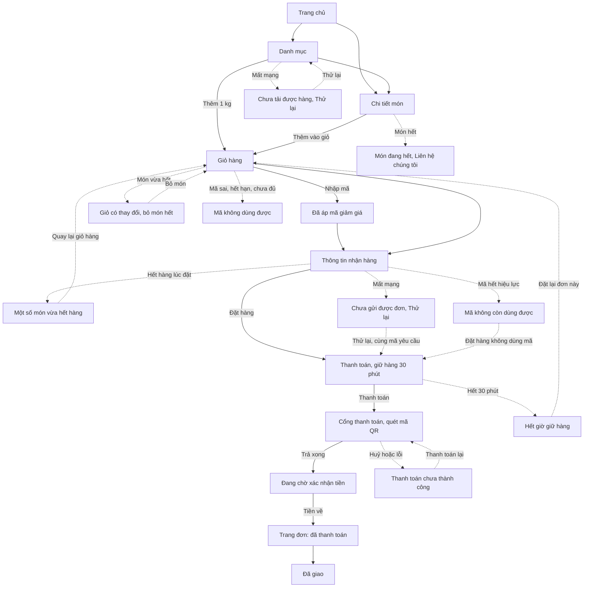

# Shop làm lại từ đầu: luồng màn và trạng thái (02a)

> `ux-designer` · 2026-10-11 · Nhánh `shop/lo-0-quyet-dinh` · **Trạng thái: CHỜ DUYỆT**
> Đầu vào: `02-stories.md` (ĐÃ DUYỆT 11/10), `01-analysis.md` §6, §6.1, §13, `05-phap-ly.md` §1.2, §2, §3.1, `06-marketing.md` C2.3, C5, C7,
> `doc/decisions.md` mục 2026-10-10 (tối) và 2026-10-11, `doc/ops/hoi-loc.md` (câu tạm L1–L12), `doc/design/shop/` (README, UI-RULES, SO-CHUAN, COMPONENTS).
> Duy giao điều phối chạy qua đêm, không để câu hỏi treo: chỗ phải quyết đã chọn theo UI-RULES/COMPONENTS và ghi **UX chốt**. Lệch 02b thì 02b thắng.
> Nguồn hình: `doc/design/shop/screens/*.dc.html` (đã sửa theo mục 2). Canvas https://claude.ai/artifact/SPSQLR5rMEtuBFreYbK96J **không** cập nhật; file trong repo là nguồn.

---

## 1. Quy ước

- **Dạng hiển thị** (UI-RULES §5): **Trang** · **Dialog** (giữa màn) · **Sheet** (bottom sheet, điện thoại) · **Full sheet** (FullscreenSheet) · **Toast** · **Inline** (banner hoặc dòng trong trang) · **Popover** (không modal).
  Máy tính: mọi Dialog, Sheet, Full sheet đều là **hộp thoại giữa màn** rộng 440–480 px (bản đồ: `min(960px, 100vw-48px)`), có nút X 44 px.
- **Cột trạng thái**: Tải · Có dữ liệu · Rỗng · Lỗi mạng · Lỗi nghiệp vụ · 403 · Đang gửi · Thành công. Ô không áp dụng ghi `—`.
  Shop là trang công khai, **không có 403** (COMPONENTS #45); ca "bị chặn" của Shop là 429 (quá nhanh), 409 (chính sách đổi), "Shop tạm ngưng" (C7), ghi ở cột Lỗi nghiệp vụ.
  Màn ERP (lô 2b, 3b) có 403 thật.
- Màn ghi theo tên file `screens/<tên>.dc.html`, dạng "điện thoại · máy tính".
- Câu chữ trong ngoặc kép là **câu cuối cùng** (mục 6). `[copy]` là chỗ `mkt-brand` viết. `[…]` là số liệu chờ (hotline, tên doanh nghiệp).

---

## 2. Màn đã sửa ở việc 1 (theo `01-analysis.md` §13)

Sửa tối thiểu, giữ cấu trúc và style inline, chỉ dùng màu có trong `SO-CHUAN.md` (`#4E4E58`, `#686874`, `#C0312B`, `#1F66D1`, `#FFFFFF`). Chỗ ẩn theo điều kiện ghi bằng chú thích HTML ngay tại chỗ.

| # §13 | Việc | File đã sửa |
|---|---|---|
| 1 | Bỏ dòng "Phí giao"; thêm dưới Tổng câu "Đã gồm giao hàng. Bạn trả một lần, không trả thêm khi nhận hàng." (13 px `ink-2`); dòng khu vực "Cá Về giao trong khu vực Phan Thiết." dưới ô địa chỉ | `Cart`, `B3-CartChanged`, `B6-VoucherApplied`, `Checkout`, `C1c-AddressFilled`, `C2-Invalid`, `C4-NetworkError`, `Payment`, `D2-PayCancelled`, `Success`, `DesktopCart`, `DesktopCartChanged`, `DesktopVoucher`, `DesktopCheckout`, `DesktopInvalid`, `DesktopPayment`, `DesktopPayCancelled`, `DesktopSuccess`, `DesktopHome` (cam kết 2), `CMP-5-Cart-Order` (CartSummary, MiniCart, OrderLines, bảng thông số) |
| 2 | Bỏ câu "báo phí giao" | `DesktopSuccess` (banner), `P3-HowToBuy` (bước 5 + hỏi đáp), `DesktopPolicy` (bước 5, mục "3. Chi phí giao hàng"), `Landing`, `LandingMobile`, `Product`, `DesktopProduct` (dòng "Giao hàng:"), `CMP-5-Cart-Order` (SuccessBanner, OrderStatusBadge) |
| 3 | Ô đồng ý **không tick sẵn** (`consent: true` → `false` trong script canvas), câu theo `05-phap-ly.md` §1.2(a), link mở tab mới có chữ ẩn "(mở tab mới)"; nút "Đặt hàng" không còn bị tắt (Q-UX-4), chưa tick thì sang trạng thái C2 | `Checkout`, `DesktopCheckout`, `C1c-AddressFilled`, `C2-Invalid` + `DesktopInvalid` (thêm mục "Đồng ý xử lý dữ liệu" và dòng lỗi), `CMP-3-Inputs` |
| 4 | Bỏ nút "Vị trí của tôi" / "Dùng vị trí hiện tại"; thêm dòng thông báo Google dưới ô "Tìm địa chỉ" (`aria-describedby`); bỏ `role="application"` ở vùng bản đồ | `C1b-MapPicker`, `DesktopMapPicker`, `CMP-3-Inputs` (thêm dòng thông số) |
| 5 | C5 chỉ còn ca "bản đồ nạp lỗi": tiêu đề "Chưa mở được bản đồ", một nút "Nhập tay", nền là form Checkout (không chồng hai modal), `<title>` đổi thành "C5 · Chưa mở được bản đồ" (tên file giữ để không vỡ link canvas) | `C5-LocationDenied` |
| 6 | Bỏ dải chip "Tìm nhiều" và biến thể chip trên nền brand | `Home`, `HeaderFooter-Mobile` (cả bảng đặc tả), `LandingMobile`, `CMP-2-Buttons`, `CMP-6-Navigation` |
| 7 | "Lô mới về": đã kiểm, không còn chữ này trong `screens/` | — |
| 8 | Bỏ nút "Huỷ đơn" | `D2-PayCancelled`, `DesktopPayCancelled` (CMP-5 không có nút này) |
| 9 | Footer: "Điều khoản sử dụng" → **"Điều kiện giao dịch chung"**; nhóm Chính sách có "Cơ chế giải quyết khiếu nại" (đã có ở cả 26 file); ô logo "Đã thông báo…" thay bằng chú thích "chỉ render khi site-info có link, chưa có thì ẩn hẳn" | `Home`, `HeaderFooter-Mobile`, `HeaderFooter-Desktop`, `CMP-6-Navigation`, `G1-KitchenList`, `G2-KitchenArticle`, `P1-Policy`, `Landing`, `LandingMobile`, `DesktopHome`, `DesktopCategory`, `DesktopProduct`, `DesktopComboDetail`, `DesktopToast`, `DesktopNotFound`, `DesktopOutOfStock`, `DesktopOffline`, `DesktopLoading`, `DesktopSuccess`, `DesktopLookup`, `DesktopOrderStates`, `DesktopPolicy` (cả menu PolicyNav), `DesktopContact`, `DesktopKitchenList`, `DesktopKitchenArticle`, `DesktopNotFound404` |
| 10 | BottomNav ở tra cứu đơn: giữ; bảng đặc tả N1 ghi thêm "Tra cứu đơn (D9)" | `HeaderFooter-Mobile` |
| 11 | Đơn huỷ sau khi đã trả: nhãn lý do cố định "Hàng không đạt khi soạn", câu bản A "Cá Về sẽ gọi vào số điện thoại đặt hàng trong 1 ngày làm việc để trả lại [số tiền] bạn đã thanh toán. Cần gấp, bạn gọi [hotline].", link "Xem cách Cá Về trả lại tiền" → mục `#xu-ly-tien`; E5 dùng **số tiền phần bị huỷ** | `E2-Cancelled`, `E5-PartialCancel`, `DesktopOrderStates` |
| 12 | Giỏ khi mã hợp lệ: dòng điều kiện của mã (mức, trần, đơn tối thiểu, hạn, "Số lượt có hạn", câu không cộng dồn); không số lượt còn | `B6-VoucherApplied`, `DesktopVoucher` |
| 13 | D5 ghi "KHÔNG CODE Ở V1"; E6 đổi dòng "Chuyển thiếu tiền" → D3 biến thể, dòng `AUTO_CANCELLED` thêm ca tiền về muộn → E2 biến thể | `D5-Underpaid`, `DesktopUnderpaid`, `E6-StatusRules` |
| 14 | Câu khẳng định chưa có nguồn → **bản an toàn** `06-marketing.md` C2.3/C5 + câu tạm `hoi-loc.md` L8–L11: bỏ "làm sạch, cấp đông tại cảng", "xem tận mắt từng mẻ", "đóng thùng giữ lạnh", "hút chân không", "Cân đúng" (cả cam kết 3 máy tính), "biết rõ nguồn" → "Mua theo lô tại cảng"; "VietQR" → "quét mã QR"; "[khu vực]" → Phan Thiết | `Home`, `DesktopHome`, `Landing`, `LandingMobile`, `DesktopProduct` (mô tả mẫu, tạm tính), `Success`, `DesktopSuccess`, `E5-PartialCancel` (dòng thời gian "Cá Về soạn hàng"), `Payment`, `DesktopPayment`, `CMP-5-Cart-Order`, `CMP-7-Overlay-Feedback` (bỏ câu "lệch dưới 5% sẽ hoàn phần chênh") |
| thêm | Giỏ có món hết: CTA không tắt, bấm thì "Bỏ món đã hết để đặt hàng." (UX chốt mục 7.1); thanh toán ghi "Chuyển khoản ngân hàng (quét mã QR)"; combo "· 1 combo"; C4 nền dùng một ô địa chỉ (L-28) | `B3-CartChanged`, `DesktopCartChanged`, `CMP-5-Cart-Order`, `Payment`, `DesktopPayment`, `C4-NetworkError` |

Còn lại **không sửa** (theo COMPONENTS "Chỗ đã chuẩn hoá", dev theo cột "Dùng"): bo dialog 16→14, cỡ chữ máy tính 15→16 ở ô nhập, viền banner `#F3CFCC`/`#F3DDB8`, nền `#F5FAF6`, `© 2026` màu `#A9C4EE`, link tóm tắt lỗi cao 32. Dải pháp lý `[Tên doanh nghiệp] · MST…` để nguyên chỗ giữ: code ẩn từng dòng khi site-info trống (BR-ND-18, S-14).

---

## 3. Luật popup chung (áp cho mọi bảng dưới, G5)

| Thuộc tính | Dialog | Sheet (điện thoại) | Full sheet (bản đồ) | Toast | Popover (gợi ý tìm, MiniCart) |
|---|---|---|---|---|---|
| Phần tử | `<dialog>` + `showModal()` | `<dialog>` + `showModal()` | `<dialog>` + `showModal()` | vùng `role="status" aria-live="polite"` cố định trong `ToastProvider` | không modal |
| ARIA | `aria-modal="true"`, `aria-labelledby` tiêu đề, `aria-describedby` mô tả | như Dialog; thanh kéo `aria-hidden` | như Dialog | không lấy focus | combobox + listbox (`aria-expanded`, `aria-controls`, `aria-activedescendant`) |
| Focus khi mở | nút **ít rủi ro nhất** (bảng 5) | tiêu đề (`tabindex="-1"`) | ô "Tìm địa chỉ" | không đổi | giữ ở ô tìm |
| Giữ focus | có (Tab/Shift+Tab vòng trong) | có | có | — | không bẫy |
| Esc | đóng (trừ khi `busy`) | đóng | đóng, ô địa chỉ giữ nguyên | — | đóng, focus về ô tìm |
| Chạm lớp phủ | đóng nếu `dismissible` (B2, C5, D6, C8, C9); **không** với D4, C4 đang gửi | đóng | **không** đóng | — | đóng |
| Trả focus | về nút đã mở (C5: vào ô địa chỉ) | về nút đã mở | về nút "Bản đồ" | — | — |
| Máy tính | X 44 px góc phải, `aria-label` riêng | thành Dialog `md` 480 + X | hộp thoại lớn, X phải | góc phải dưới header, rộng 360 | dropdown dưới ô |
| Chuyển động | fade + scale .96→1 200 ms; reduced motion: chỉ fade | translateY 260 ms; reduced: fade | như Sheet | 200 ms vào, 3 s tự ẩn, dừng khi hover/focus | 180 ms |

Không chồng hai modal cùng cấp. Không dùng toast cho lỗi cần sửa. Lỗi gửi form dùng `role="alert"`; banner tĩnh không có vai trò.

---

## 4. Luồng × trạng thái theo story

### Lô 1 · Khung chung

| Story · Màn | Dạng | Tải | Có dữ liệu | Rỗng | Lỗi mạng | Lỗi nghiệp vụ | 403 | Đang gửi | Thành công |
|---|---|---|---|---|---|---|---|---|---|
| SHOP-1-01 nền, badge (`Home` · `DesktopHome`) | Trang | — | Badge = số món ("2" với 1,5 kg + 2 kg) | Giỏ 0 món: không render badge | — | Giỏ hỏng trong `localStorage`: coi như rỗng, không lỗi console | — | — | — |
| SHOP-1-02 `/ui-preview/` (`CMP-*`) | Trang | — | Đủ biến thể × trạng thái | — | — | Build không cờ: trang 404 | — | — | — |
| SHOP-1-03 Header H1–H4 (`HeaderFooter-*`) | Inline | Header hiện ngay, menu nhóm chờ catalog | H1 có "Cá Về", gọi, tra đơn, giỏ, ô tìm; **không** chip | Ô tìm rỗng: Enter không điều hướng | site-info lỗi: ẩn nút gọi; catalog lỗi: ẩn menu nhóm | — | — | — | Enter → `/shop/?q=` |
| SHOP-1-04 BottomNav | Inline | — | 4 mục, mục đang ở `aria-current` | — | — | — | — | — | — |
| SHOP-1-05 Footer F1/F2 | Inline | — | Nhóm Chính sách từ `footer-links`; "Điều kiện giao dịch chung" | Trường người bán trống: ẩn dòng; chưa có link thông báo: ẩn khối logo | `footer-links` lỗi: ẩn nhóm Chính sách, các nhóm khác vẫn hiện | — | — | — | — |
| SHOP-1-06 Trang chủ (`Home` · `DesktopHome`, `A0-Loading` · `DesktopLoading`, `A6-Offline` · `DesktopOffline`) | Trang | Khung xương, `aria-busy="true"` vùng hàng, chữ ẩn "Đang tải hàng" | Banner, lưới nhóm, "Đang có hàng", "Combo nấu nhanh", Góc bếp, cam kết | Không bài viết: ẩn Góc bếp; CMS chưa có banner (từ 5-03): ẩn banner | Vùng hàng: ErrorState "Chưa tải được hàng" + "Thử lại", header vẫn hiện | Món `out` không ở hàng "Đang có hàng" | — | "Thử lại": nút có spinner, giữ chữ | Hàng hiện, focus về `h1` |
| SHOP-1-08 `/gioi-thieu/` (`Landing` · `LandingMobile`) | Trang | Khung xương bài đọc | Nội dung CMS, thẻ giá từ catalog | — | "Chưa tải được trang" + "Thử lại" | CMS 404: "Không tìm thấy bài này" + "Về trang chủ" | — | — | — |
| SHOP-1-09 404 (`X1-NotFound404` · `DesktopNotFound404`) | Trang | — | EmptyState 404, 2 nút | — | — | — | — | — | — |

### Lô 2 · Danh mục, chi tiết, giỏ

| Story · Màn | Dạng | Tải | Có dữ liệu | Rỗng | Lỗi mạng | Lỗi nghiệp vụ | 403 | Đang gửi | Thành công |
|---|---|---|---|---|---|---|---|---|---|
| SHOP-2-03 Danh mục (`Main` · `DesktopCategory`) | Trang | Khung xương chip + 4 / 8 thẻ, header và bộ lọc thật | Lọc, sắp xếp, món `out` cuối; CartBar trên BottomNav khi giỏ có món | `A5-NotFound` · `DesktopNotFound`: EmptyState tìm không thấy + chip nhóm + "Liên hệ chúng tôi để hỏi hàng" | `A6-Offline` · `DesktopOffline` | Món `low`: nhãn "Sắp hết"; `out`: ảnh mờ, "Liên hệ chúng tôi" | — | — | Thêm món: Toast (điện thoại) / Toast + MiniCart (máy tính), nút đổi thành stepper, focus vào stepper |
| SHOP-2-03 Thêm vào giỏ (`A4-Toast` · `DesktopToast`) | Toast · Popover (máy tính) | — | "Đã thêm 1 kg Mực ống làm sạch vào giỏ" + "Xem giỏ" | — | — | — | — | — | Badge +1, `aria-live` |
| SHOP-2-03 Bỏ món ở mức tối thiểu (`B2-RemoveConfirm` · `DesktopRemoveConfirm`) | Dialog `confirm` | — | Hỏi bỏ món | — | — | — | — | — | "Bỏ khỏi giỏ": dòng mất, badge −1, `aria-live` "Đã bỏ … khỏi giỏ" |
| SHOP-2-04 Gợi ý tìm (`A8-SearchSuggest` · `DesktopSearchSuggest`) | Popover | Catalog chưa tải: không mở panel, Enter vẫn tìm | ≤ 5 dòng, giá `/ kg` | Không khớp: chỉ dòng "Xem tất cả kết quả cho “…”" (+ Tìm gần đây) | — | Chuỗi giống SĐT: không lưu vào Tìm gần đây | — | — | — |
| SHOP-2-05 Chi tiết (`Product` · `DesktopProduct`, `A9-ComboDetail` · `DesktopComboDetail`) | Trang | Khung xương ảnh + tên + giá | Giá 24/600, chọn nhanh 1/1,5/2/3 kg, stepper, Tạm tính; khối trống thì ẩn | — | ErrorState "Chưa tải được hàng" + "Thử lại" | 404: "Không tìm thấy món này" + "Xem hàng đang có"; `out`: `A7-OutOfStock` · `DesktopOutOfStock` | — | — | Toast / MiniCart như 2-03 |
| SHOP-2-06 Giỏ (`Cart` · `DesktopCart`) | Trang | `CartLineSkeleton` khi so giá | Dòng món, Tạm tính, Tổng, câu "Đã gồm giao hàng…" | `B4-CartEmpty`: "Giỏ hàng đang trống" + "Xem hàng đang có" | Banner warn "Chưa cập nhật được giá. Thử lại" (inline), CTA vẫn bấm được | `B3-CartChanged` · `DesktopCartChanged`: giá đổi / món hết (mục 7.1); số lượng cũ lẻ: Banner "Số lượng đã chỉnh theo mức bán" | — | — | CTA → Checkout |

### Lô 2b · ERP mặt hàng, slug nhóm (không có file thiết kế Shop, theo `ItemForm` / `ItemGroupModal` hiện có, `doc/design/erp/UI-RULES.md`)

| Story · Màn | Dạng | Tải | Có dữ liệu | Rỗng | Lỗi mạng | Lỗi nghiệp vụ | 403 | Đang gửi | Thành công |
|---|---|---|---|---|---|---|---|---|---|
| SHOP-2b-01 5 trường thông tin món (ERP `ItemForm`) | Trang (form) | Theo form hiện có | 5 ô, `short_note` có bộ đếm "Còn N ký tự" | Ô trống hợp lệ | Lỗi chung form hiện có | 400: lỗi dưới đúng ô ("Không ghi số điện thoại trong thông tin món.", giá, mã lô, quá 60 ký tự); chữ đã nhập giữ nguyên | NV kho, NV giao, NV gọi xác nhận: không thấy nút sửa; vào thẳng: màn "không có quyền" hiện có | Nút Lưu có spinner, form khoá | Toast "Đã lưu" như hiện có |
| SHOP-2b-02 slug nhóm (ERP `ItemGroupModal`) | Dialog | — | Ô slug | — | Như trên | Trùng / rỗng / có dấu: lỗi dưới ô, giữ chữ | 403 như trên | Như trên | Như trên |

### Lô 3 + 4 · Đặt hàng, thanh toán, trang đơn

| Story · Màn | Dạng | Tải | Có dữ liệu | Rỗng | Lỗi mạng | Lỗi nghiệp vụ | 403 | Đang gửi | Thành công |
|---|---|---|---|---|---|---|---|---|---|
| SHOP-3-03 Form (`Checkout` · `DesktopCheckout`) | Trang | Khung xương tóm tắt đơn | 3 ô + ô đồng ý **chưa tick** + tóm tắt + câu "Đã gồm giao hàng…" | Giỏ trống: chuyển `/shop/cart/` | xem C4 | `C2-Invalid` · `DesktopInvalid` (inline, khối "Còn N chỗ cần sửa"); `X2-ShopPaused` · `DesktopShopPaused` (trang, không form); `X4-PolicyChanged` (Dialog, 409) | — | Nút "Đặt hàng" spinner "Đang đặt…", ô `readOnly`, bấm lần hai không gửi | Chuyển trang đơn D1 |
| SHOP-3-04 Bản đồ (`C1b-MapPicker` · `DesktopMapPicker`, `C1c-AddressFilled`, `C5-LocationDenied`) | Full sheet · Inline · Dialog | Sheet mở ngay, vùng bản đồ khung xương + spinner "Đang tải bản đồ"; **dòng thông báo Google hiện ngay** | Gợi ý địa chỉ, ghim "Giao tới đây", "Xác nhận vị trí này" | Không gợi ý: listbox ẩn, khách kéo bản đồ hoặc đóng gõ tay | Script lỗi / chặn mạng: C5 | Không có key: C5 (mục 7.2) | — | — | `C1c`: ô viền good, Banner `role="status"` "Đã điền địa chỉ từ bản đồ.", focus vào cuối chuỗi |
| SHOP-3-05 Gửi đơn (`C3-SoldOut` · `DesktopModalSoldOut`, `C4-NetworkError` · `DesktopNetworkError`, `X3-TooManyRequests`) | Sheet / Dialog | — | — | — | C4 Dialog "Chưa gửi được đơn", "Thử lại" gửi **cùng** `client_request_id` | C3 `OUT_OF_STOCK` (Sheet điện thoại, Dialog `md` máy tính); C8 429 (Dialog); C6 xem 3b-06 | — | C4 "Thử lại" có spinner, Dialog không đóng được khi `busy` | 201: giỏ xoá, `sessionStorage` lưu token, sang `/shop/orders/?code=` |
| SHOP-4-01 Tra cứu (`F1-Lookup` · `DesktopLookup`, `F2-LookupNotFound`) | Trang | `OrderSkeleton` khi tự tra bằng token | F1: mã điền sẵn, hỏi SĐT; BottomNav, tab "Đơn hàng" `aria-current` | Không mã trên URL: 2 ô trống | Inline "Chưa tải được đơn. Thử lại." + nút | F2 Banner chung, **không** `aria-invalid`; 401 token: xoá token, về F1 điền mã; 429: "Bạn thử lại sau ít phút." | — | Nút "Tra cứu" spinner | Màn theo bảng mục 5 |
| SHOP-4-02 Thanh toán (`Payment` · `DesktopPayment`, `D2-PayCancelled` · `DesktopPayCancelled`, `D6-LeavePayment` · `DesktopLeavePayment`) | Trang · Dialog (D6) | `OrderSkeleton` | Đồng hồ (dưới 5 phút đổi warn), phương thức "Chuyển khoản ngân hàng (quét mã QR)", tóm tắt, câu "Đã gồm giao hàng…" | — | Gọi checkout lỗi mạng: Banner crit inline "Chưa mở được trang thanh toán. Thử lại." `[copy]` | D2 Banner crit + "Thanh toán lại", **không** "Huỷ đơn"; D6 khi bấm logo / quay lại | — | Nút "Thanh toán" spinner | Chuyển sang cổng |
| SHOP-4-03 Chờ tiền, hết giờ (`D3-PayPending` · `DesktopPayPending`, `D4-Expired` · `DesktopModalExpired`) | Trang · Dialog | Spinner 36 + "Đang chờ xác nhận thanh toán", tự tra mỗi 5 s | — | — | Tra định kỳ lỗi: giữ màn, thử lại lần sau, không báo đỏ | Quá 5 phút: câu "Cá Về sẽ kiểm tra giao dịch và gọi cho bạn" + hotline; đồng hồ về 0: D4 Dialog, trang tiếp tục tra tới `AUTO_CANCELLED` → D4 dạng trang | — | "Đặt lại đơn này": spinner tới khi giỏ dựng xong | Tiền về: E1 + SuccessBanner |
| SHOP-4-04 Đơn (`Success` · `DesktopSuccess`, `E3-Delivered`, `E4-DeliveryFailed`, `DesktopOrderStates`) | Trang | `OrderSkeleton` | Dòng thời gian giờ GMT+7 `14:05 · 11/10`, món, tổng, câu "Đã gồm giao hàng…", giờ gọi xác nhận | — | "Chưa tải được đơn. Thử lại." | E4 Banner warn | — | — | "Sao chép mã đơn" → Toast "Đã sao chép"; "Mua lại" → giỏ |
| SHOP-4-05 Đơn huỷ (`E2-Cancelled`, `E5-PartialCancel`, `DesktopOrderStates`) | Trang | như trên | Nhãn lý do cố định + câu bản A + số tiền phần bị huỷ + hotline + link | — | như trên | `UNREACHABLE_AUTO`: nhãn "Không liên lạc được để xác nhận đơn"; `late_payment`: nhãn "Hết giờ giữ hàng, tiền về sau" | — | — | — |

### Lô 3b · Mã giảm giá

| Story · Màn | Dạng | Tải | Có dữ liệu | Rỗng | Lỗi mạng | Lỗi nghiệp vụ | 403 | Đang gửi | Thành công |
|---|---|---|---|---|---|---|---|---|---|
| SHOP-3b-02 ERP danh sách mã (mẫu `PricingRuleList`) | Trang + Dialog (tắt mã) | Theo bảng ERP hiện có | Bảng cột theo AC1, giờ GMT+7 | "Chưa có mã giảm giá nào." + nút "Tạo mã" `[copy]` | Lỗi chung ERP | `UNFAVORABLE_CHANGE`: câu mục 6; Dialog tắt mã bắt chọn lý do | Không thấy menu; vào thẳng: màn không có quyền | Nút spinner | Dòng mới / trạng thái đổi |
| SHOP-3b-05 Ô mã (`Cart`, `B5-VoucherSheet`, `B6-VoucherApplied`, `B7-VoucherError`, `DesktopCart`, `DesktopVoucher`) | Sheet (điện thoại) · Inline (máy tính) | Spinner trong nút "Áp dụng", ô khoá, `aria-busy` | Chip mã + "Bỏ mã", "Giảm giá −…", điều kiện mã, Toast "Đã áp mã CAVE10" | Ô trống: nút "Áp dụng" tắt (không phải nút gửi form chính) | "Chưa kiểm được mã. Thử lại." | 5 `reason_code` (mục 6), `BETTER_PROMO` màu `ink-2` không đỏ; 429 "Bạn thao tác hơi nhanh. Đợi 1 phút rồi thử lại." | — | — | Sheet đóng, focus về dòng "Mã giảm giá" |
| SHOP-3b-06 Mã hết lúc đặt (`B8-VoucherInvalidAtOrder`), dòng giảm ở D1/E1 | Dialog | — | "Mã giảm giá (CAVE10) −…" ở D1, E1 | — | — | C6 Dialog, **không tự đặt** | — | "Đặt hàng không dùng mã": spinner, `client_request_id` mới | Sang D1 giá chưa giảm |

### Lô 5 · Trang phụ (mkt-brand)

| Story · Màn | Dạng | Tải | Có dữ liệu | Rỗng | Lỗi mạng | Lỗi nghiệp vụ | 403 | Đang gửi | Thành công |
|---|---|---|---|---|---|---|---|---|---|
| SHOP-5-04 Chính sách (`P1-Policy` · `DesktopPolicy`) | Trang | Khung xương bài | Breadcrumb, mục lục, "Các chính sách" `aria-current` | — | "Chưa tải được trang" + "Thử lại" | 404 "Không tìm thấy bài này"; 410 "Bài này không còn trên web" | — | — | — |
| SHOP-5-04 Liên hệ (`P2-Contact` · `DesktopContact`), Cách mua (`P3-HowToBuy`) | Trang | như trên | Thẻ thiếu dữ liệu thì ẩn; số 1 kg / 0,5 kg / 30 phút từ settings | — | như trên | như trên | — | — | — |
| SHOP-5-05 Góc bếp (`G1-KitchenList` · `DesktopKitchenList`, `G2-KitchenArticle` · `DesktopKitchenArticle`) | Trang | Khung xương thẻ bài | Chip chuyên mục `aria-current`, thẻ món `row` | Chuyên mục chưa có bài: "Chưa có bài ở mục này." + "Xem tất cả bài" `[copy]` | như trên | Bài 404 / 410 như trên; món ngưng bán trong bài: ẩn thẻ | — | — | Thêm món: như 2-03 |

**Đếm:** 32 dòng (nhóm màn) × 8 cột = **256 ô trạng thái**; các dòng phủ 86 màn thiết kế (bảng component không tính).

---

## 5. Trạng thái đơn → màn (đối chiếu `E6-StatusRules`, đã sửa)

Trạng thái server **luôn thắng** `result` trên URL. Mọi màn dưới đây là cùng route `/shop/orders/?code=`.

| Trạng thái (BE) | Điều kiện | `result` | Màn | Dạng | Câu chính |
|---|---|---|---|---|---|
| `BOOKED` còn hạn | — | không có | D1 `Payment` | Trang | đồng hồ + "Thanh toán" |
| `BOOKED` còn hạn | chưa có IPN, < 5 phút | `success` | D3 `D3-PayPending` | Trang | "Đang chờ xác nhận thanh toán" |
| `BOOKED` còn hạn | chưa có IPN, ≥ 5 phút; hoặc tiền về thiếu (E-02) | `success` / bất kỳ | D3 biến thể | Trang | "Cá Về sẽ kiểm tra giao dịch và gọi cho bạn" + hotline |
| `BOOKED` còn hạn | — | `cancel`, `error` | D2 `D2-PayCancelled` | Trang | "Thanh toán chưa thành công" + "Thanh toán lại" |
| `BOOKED` | đồng hồ về 0 khi đang xem, job chưa chạy | bất kỳ | D4 `D4-Expired` | **Dialog** (không đóng bằng lớp phủ) | "Hết thời gian giữ hàng" |
| `AUTO_CANCELLED` | không có tiền về | bất kỳ | D4 dạng trang | Trang | "Hết thời gian giữ hàng" + "Đặt lại đơn này" |
| `AUTO_CANCELLED` | `late_payment: true` (E-03) | bất kỳ | E2 biến thể | Trang | nhãn "Hết giờ giữ hàng, tiền về sau" + câu bản A |
| `PAID` / `PROCESSING` | vừa trả | `success` | E1 `Success` | Trang + SuccessBanner | "Thanh toán thành công" |
| `PAID` / `PROCESSING` | mở lại link cũ | `cancel`, `error` | E1 | Trang + Banner info | "Đơn đã thanh toán" |
| `PROCESSING` | chờ gọi xác nhận / soạn / chờ lấy | không có | E1 bước "Đang chuẩn bị" | Trang | — |
| `PROCESSING` | phiếu đang giao | — | E1 bước "Đang giao" | Trang | — |
| `PROCESSING` | phiếu `FAILED` (E-08) | — | E4 `E4-DeliveryFailed` | Trang + Banner warn | "Giao không thành công. Cá Về sẽ gọi để hẹn lại." |
| `PROCESSING` | có phần bị huỷ (BR-HT-02) | — | E5 `E5-PartialCancel` | Trang + Banner warn | câu bản A với số tiền phần bị huỷ |
| `COMPLETED` | — | — | E3 `E3-Delivered` | Trang | mốc giao; câu báo vấn đề ẩn khi chưa có `return_report_hours` |
| `CANCELLED` | lý do bất kỳ | — | E2 `E2-Cancelled` | Trang | nhãn cố định + câu bản A |
| `CANCELLED` | `UNREACHABLE_AUTO` | — | E2 | Trang | "Không liên lạc được để xác nhận đơn" |
| (sai mã / SĐT / token) | — | — | F2 | Trang + Banner crit | câu chung |
| (thiếu hoặc hết hạn token) | — | — | F1 điền sẵn mã | Trang | — |

---

## 6. Câu chữ cuối cùng (UI-RULES §6: tiêu đề + một câu + nút; lỗi nói cách sửa)

### 6.1 Popup

| Popup | Điện thoại · máy tính | Tiêu đề | Câu | Nút (thứ tự) | Focus khi mở | Đóng |
|---|---|---|---|---|---|---|
| B2 bỏ món | Dialog `confirm` · Dialog + X "Đóng, giữ lại {tên}" | "Bỏ {tên} khỏi giỏ?" | "Mỗi món mua tối thiểu 1 kg. Bớt nữa sẽ bỏ món này khỏi giỏ." (combo: "Mỗi món mua tối thiểu 1 combo…") | "Giữ lại" · "Bỏ khỏi giỏ" (đỏ, phải) | "Giữ lại" | Esc, lớp phủ = Giữ lại |
| B5 nhập mã | Sheet · (máy tính không có, nhập tại chỗ) | "Mã giảm giá" | "Mỗi đơn dùng 1 mã." | "Áp dụng" | ô nhập | Esc, lớp phủ |
| C3 hết hàng lúc đặt | Sheet `notice` · Dialog `md` + X "Đóng thông báo hết hàng" | "Một số món vừa hết hàng" | "Có khách vừa đặt trước bạn." Dòng món: "Bạn đặt 2 kg · không đủ hàng" + "Đổi thành 1 kg"; "Đã hết · sẽ bỏ khỏi đơn" + "Liên hệ chúng tôi" | "Cập nhật giỏ và đặt lại" · "Quay lại giỏ hàng" | tiêu đề | Esc, lớp phủ = Quay lại giỏ (không xoá gì) |
| C4 mất mạng khi đặt | Dialog `alert` neutral · + X | "Chưa gửi được đơn" | "Đơn chưa được tạo. Kiểm tra mạng rồi thử lại." | "Thử lại" · "Để sau" | "Thử lại" | Esc / "Để sau": về form, giữ 3 ô; khi đang gửi lại: không đóng |
| C5 bản đồ lỗi | Dialog `alert` warn · + X | "Chưa mở được bản đồ" | "Bạn gõ địa chỉ vào ô, vẫn đặt hàng bình thường." | "Nhập tay" | "Nhập tay" | mọi cách đóng: focus vào ô địa chỉ |
| C6 mã hết lúc đặt | Dialog · + X | "Mã {MÃ} không còn dùng được" | "Đơn sẽ tính theo giá chưa giảm." | "Đặt hàng không dùng mã" · "Quay lại giỏ" | "Quay lại giỏ" (ít rủi ro) | Esc = Quay lại giỏ |
| C8 429 | Dialog · + X | "Bạn thao tác hơi nhanh" | "Đợi 1 phút rồi thử lại." | "Đã hiểu" | "Đã hiểu" | Esc, lớp phủ; form giữ nguyên |
| C9 409 chính sách | Dialog · + X | "Chính sách quyền riêng tư vừa cập nhật" | "Đọc bản mới rồi đồng ý để đặt hàng. Thông tin bạn điền vẫn giữ nguyên." | "Xem chính sách" (tab mới) · "Đã hiểu" | "Đã hiểu" | đóng: ô đồng ý bỏ tick, focus vào ô đồng ý |
| D4 hết giờ | Dialog `alert` crit · + X | "Hết thời gian giữ hàng" | "Đơn {SO…} đã tự huỷ sau {hold_minutes} phút chưa thanh toán. Hàng đã trả lại kho, bạn chưa bị trừ tiền." Ghi chú: "Đã chuyển khoản rồi? Liên hệ [hotline], Cá Về sẽ kiểm tra và gọi lại cho bạn." | "Đặt lại đơn này" · "Về trang chủ" | "Đặt lại đơn này" | Esc, X; **không** lớp phủ |
| D6 rời trang | Dialog `alert` info · + X | "Rời trang thanh toán?" | "Đơn {SO…} vẫn được giữ tới hết {giờ GMT+7}. Bạn có thể quay lại thanh toán từ Tra cứu đơn." | "Ở lại thanh toán" · "Rời trang" | "Ở lại thanh toán" | Esc, lớp phủ = Ở lại |
| Bản đồ C1b | Full sheet · hộp thoại lớn | "Chọn vị trí giao hàng" | dòng dưới ô tìm: "Bản đồ do Google cung cấp. Chữ bạn gõ và vị trí bạn ghim sẽ được gửi tới Google. Không muốn dùng, bạn đóng lại và gõ địa chỉ trực tiếp." | "Xác nhận vị trí này" (máy tính thêm "Nhập tay") · X "Đóng, quay lại nhập tay" | ô "Tìm địa chỉ" | Esc, X; **không** lớp phủ |
| ERP tắt mã | Dialog ERP | "Tắt mã {MÃ}?" | "Mã đã tắt không xoá, bật lại được khi còn hạn và còn lượt." | "Giữ mã" · "Tắt mã" (chọn lý do: Hết ngân sách / Sự cố / Khác) | "Giữ mã" | Esc |

### 6.2 Toast (3 s, `role="status"`)

"Đã thêm 1 kg {tên} vào giỏ" + "Xem giỏ" (máy tính bỏ "vào giỏ", không nút) · "Đã áp mã {MÃ}" · "Đã bỏ mã {MÃ}" · "Đã sao chép" (mã đơn).

### 6.3 Lỗi và banner inline

| Chỗ | Câu |
|---|---|
| Họ tên trống | "Nhập họ tên người nhận" |
| SĐT sai | "Số điện thoại cần 10 chữ số, bắt đầu bằng 0" |
| Địa chỉ trống | "Nhập địa chỉ giao hàng hoặc chọn trên bản đồ" |
| Chưa tick đồng ý | "Đánh dấu đồng ý ở trên để đặt hàng." (cả hai khổ; máy tính ô đồng ý nằm ở cột trái, câu vẫn đúng vì lỗi nằm ngay dưới ô) |
| Khối tóm tắt | "Còn {N} chỗ cần sửa"; mục: "Họ và tên", "Số điện thoại", "Địa chỉ giao hàng", "Đồng ý xử lý dữ liệu" `[copy]` |
| Giỏ còn món hết, bấm CTA | "Bỏ món đã hết để đặt hàng." |
| Giỏ đổi giá / món hết | Banner warn "Giỏ hàng có thay đổi từ lần trước"; nhãn dòng "Giá đã cập nhật" / "Món này đã hết" |
| Giỏ không cập nhật được giá | "Chưa cập nhật được giá. Thử lại" |
| Giỏ cũ số lẻ | "Số lượng đã chỉnh theo mức bán" |
| Mã | "Mã không đúng hoặc đã hết hạn." · "Đơn cần từ {tiền} để dùng mã này." · "Mã đã hết lượt dùng." · "Ưu đãi đang áp đã có lợi hơn mã này." · "Chưa kiểm được mã. Thử lại." |
| ERP sửa mã bất lợi | "Mã đang chạy chỉ sửa được theo hướng có lợi cho khách. Tắt mã này và tạo mã mới." |
| Tải hàng lỗi | "Chưa tải được hàng" / "Kiểm tra kết nối mạng rồi thử lại" / "Thử lại" |
| Món hết (A7) | "Món này đang hết. Liên hệ để hỏi khi nào có hàng." |
| D2 | "Thanh toán chưa thành công" / "Bạn đã huỷ hoặc ngân hàng báo lỗi. Đơn vẫn đang được giữ." |
| D3 quá 5 phút | "Cá Về sẽ kiểm tra giao dịch và gọi cho bạn. Cần gấp, bạn gọi [hotline]." |
| E2 / E5 (bản A, câu tạm) | "Cá Về sẽ gọi vào số điện thoại đặt hàng trong 1 ngày làm việc để trả lại {cancelled_amount} bạn đã thanh toán. Cần gấp, bạn gọi [hotline]." + link "Xem cách Cá Về trả lại tiền". Thời hạn đọc từ settings (S-12, hỏi Lộc L6). |
| E4 | "Giao không thành công. Cá Về sẽ gọi để hẹn lại." |
| F2 | "Không tìm thấy đơn khớp mã và số điện thoại. Kiểm tra lại, hoặc gọi [hotline]." |
| F 429 / mất mạng | "Bạn thử lại sau ít phút." / "Chưa tải được đơn. Thử lại." |
| C7 Shop tạm ngưng | "Cá Về tạm ngưng nhận đơn online" / "Gọi [hotline] để đặt hàng." |
| Câu giá dưới Tổng | "Đã gồm giao hàng. Bạn trả một lần, không trả thêm khi nhận hàng." |
| Khu vực giao (form) | "Cá Về giao trong khu vực Phan Thiết." (câu tạm L1; ranh giới chờ Lộc) |

Không câu nào chứa: số kg tồn, mã lô, "hoàn tiền" (trừ tên trang chính sách), "miễn phí giao", "giao trong ngày", "báo khi có hàng", tên cổng thanh toán.

---

## 7. UX chốt

### 7.1 Giỏ có món vừa hết (B3, SHOP-2-06 AC4, AUDIT câu 17)

Đối chiếu: B3 cũ cho đi tiếp "Tiếp tục với 2 món còn hàng"; CMP-5 cũ tắt nút; AC4 + decisions 11/10 chặn tới khi khách bỏ món. **Chốt**:
1. Dòng món hết: ảnh mờ, nhãn "Món này đã hết", không tính vào Tạm tính/Tổng, hai nút "Liên hệ" (`tel:`) và "Bỏ khỏi giỏ" (không hỏi lại, vì món đã hết; `aria-live` "Đã bỏ … khỏi giỏ").
2. CTA giỏ **không tắt** (Q-UX-4, `DESIGN.md` cấm tắt nút vì thiếu điều kiện). Bấm khi còn món hết: không điều hướng, hiện dòng `role="alert"` chữ `crit` ngay trên nút "Bỏ món đã hết để đặt hàng.", nút có `aria-describedby` tới dòng này, focus dời tới "Bỏ khỏi giỏ" của món hết đầu tiên.
3. Bỏ hết món hết: dòng lỗi mất, CTA đi tiếp bình thường.
4. Vào thẳng `/shop/checkout/` khi giỏ còn món hết: chuyển về `/shop/cart/` (như giỏ trống).
5. Nhãn CTA giữ thiết kế: điện thoại "Tiếp tục: nhập thông tin nhận hàng", máy tính "Tiếp tục". AC SHOP-2-06 gọi nút này là "Đặt hàng"; QA tìm theo vai trò nút chính của giỏ, không theo chữ.

### 7.2 Chưa có Google Maps key (C5, SHOP-3-04 AC5)

1. Nút "Bản đồ" **vẫn hiện** khi thiếu key (khách không phải đoán vì sao mất nút; QA kiểm được AC5). Bấm: không mở sheet, không tạo thẻ script, không request tới Google; mở thẳng Dialog C5.
2. Có key nhưng script lỗi / mạng chặn / quá 10 s chưa nạp xong `[techlead chốt số giây]`: đóng Full sheet trước rồi mới mở C5 (không chồng hai modal). Lần bấm sau trong cùng phiên thử nạp lại một lần.
3. C5 một nút "Nhập tay"; mọi cách đóng đưa focus vào ô địa chỉ (con trỏ cuối chữ đã có). Form vẫn đặt được.
4. Không có Geolocation ở bất kỳ ca nào.

### 7.3 Chốt nhỏ khác

| Chỗ | Chốt | Lý do |
|---|---|---|
| Cam kết trang chủ điện thoại | 3 ô: "Cấp đông theo lô" · "Giao tận nhà" · "Quét mã QR" (bỏ "Thanh toán VietQR"). Máy tính 2 ô (bỏ "Cân đúng"). | 06-marketing H10, S-18. AC1 SHOP-1-06 "dải cam kết 2 mục" đọc là "không có mục Cân đúng"; ô thứ ba điện thoại là ô thanh toán tương ứng khối "Chuyển khoản quét mã QR" máy tính. |
| C2 số chỗ sai | Màn mẫu vẽ 4 chỗ (thêm ô đồng ý); N tính động | AC2 SHOP-3-03 dùng 3 chỗ, số thật do FE đếm |
| C1c ô đồng ý | Chưa tick sau khi điền từ bản đồ | điền bản đồ không được đổi trạng thái đồng ý |
| E2 nút | "Đặt lại món tương tự" + "Liên hệ [hotline]" (`tel:`) | giữ thiết kế, sửa link `#` |
| Bản đồ khi đang gửi đơn | Nút "Bản đồ" `disabled`, textarea `readOnly` | COMPONENTS #8 |
| Toast khi đã có Dialog mở | Không hiện toast mới tới khi Dialog đóng | tránh đọc chồng |

---

## 8. Map story / AC ↔ màn

| Story | AC chính | Màn |
|---|---|---|
| SHOP-1-01 | AC4–AC7 | `Home`, `DesktopHome`, `CMP-1-Tokens` |
| SHOP-1-02 | AC1, AC3–AC5 | `CMP-2`…`CMP-7` |
| SHOP-1-03 | AC1, AC4, AC5, AC7 | `HeaderFooter-Mobile`, `HeaderFooter-Desktop`, `Home`, `Main`, `Product`, `Cart`, `Checkout` |
| SHOP-1-04 | AC1, AC2 | `Home`, `Main`, `A0-Loading`, `G1-KitchenList`, `F1-Lookup` |
| SHOP-1-05 | AC1–AC4, AC6 | `HeaderFooter-*`, mọi màn có F1 (mục 2 #9), `DesktopCart` (F2) |
| SHOP-1-06 | AC1–AC9 | `Home`, `DesktopHome`, `A0-Loading`, `DesktopLoading`, `A6-Offline`, `DesktopOffline` |
| SHOP-1-08 | AC1–AC5 | `Landing`, `LandingMobile` |
| SHOP-1-09 | AC1 | `X1-NotFound404`, `DesktopNotFound404` |
| SHOP-2-03 | AC1–AC11 | `Main`, `DesktopCategory`, `A4-Toast`, `DesktopToast`, `A5-NotFound`, `DesktopNotFound`, `B2-RemoveConfirm`, `DesktopRemoveConfirm` |
| SHOP-2-04 | AC1–AC3 | `A8-SearchSuggest`, `DesktopSearchSuggest` |
| SHOP-2-05 | AC1–AC6 | `Product`, `DesktopProduct`, `A7-OutOfStock`, `DesktopOutOfStock`, `A9-ComboDetail`, `DesktopComboDetail` |
| SHOP-2-06 | AC1–AC7 | `Cart`, `DesktopCart`, `B2-RemoveConfirm`, `B3-CartChanged`, `DesktopCartChanged`, `B4-CartEmpty` |
| SHOP-3-03 | AC1, AC2, AC5, AC6 | `Checkout`, `DesktopCheckout`, `C2-Invalid`, `DesktopInvalid`, `X2-ShopPaused`, `DesktopShopPaused`, `X4-PolicyChanged` |
| SHOP-3-04 | AC2, AC3, AC5, AC6 | `C1b-MapPicker`, `DesktopMapPicker`, `C1c-AddressFilled`, `C5-LocationDenied` |
| SHOP-3-05 | AC1–AC3, AC5 | `C3-SoldOut`, `DesktopModalSoldOut`, `C4-NetworkError`, `DesktopNetworkError`, `X3-TooManyRequests` |
| SHOP-4-01 | AC1–AC6 | `F1-Lookup`, `DesktopLookup`, `F2-LookupNotFound`, `E6-StatusRules` |
| SHOP-4-02 | AC1, AC2, AC4, AC5 | `Payment`, `DesktopPayment`, `D2-PayCancelled`, `DesktopPayCancelled`, `D6-LeavePayment`, `DesktopLeavePayment` |
| SHOP-4-03 | AC1–AC4 | `D3-PayPending`, `DesktopPayPending`, `D4-Expired`, `DesktopModalExpired` |
| SHOP-4-04 | AC1–AC4 | `Success`, `DesktopSuccess`, `E3-Delivered`, `E4-DeliveryFailed`, `DesktopOrderStates` |
| SHOP-4-05 | AC3–AC6 | `E2-Cancelled`, `E5-PartialCancel`, `DesktopOrderStates` |
| SHOP-3b-05 | AC1–AC4 | `Cart`, `B5-VoucherSheet`, `B6-VoucherApplied`, `B7-VoucherError`, `DesktopCart`, `DesktopVoucher` |
| SHOP-3b-06 | AC1, AC3 | `B8-VoucherInvalidAtOrder`, `Payment`, `DesktopPayment`, `Success`, `DesktopSuccess` |
| SHOP-5-04 | AC1–AC4 | `P1-Policy`, `DesktopPolicy`, `P2-Contact`, `DesktopContact`, `P3-HowToBuy` |
| SHOP-5-05 | AC1, AC2, AC4 | `G1-KitchenList`, `DesktopKitchenList`, `G2-KitchenArticle`, `DesktopKitchenArticle` |
| SHOP-2b-01/02, SHOP-3b-02 | — | không có file thiết kế; theo màn ERP hiện có + `doc/design/erp/UI-RULES.md` |

---

## 9. Việc của vai khác

**`techlead` (contract UI cần, ghi vào 02b):**
1. Cách FE biết thiếu key Maps (biến build rỗng) và số giây chờ nạp script trước khi coi là lỗi (mục 7.2).
2. `cancel_notice.reason_label` cho `late_payment` ("Hết giờ giữ hàng, tiền về sau") và `UNREACHABLE_AUTO`; `cancelled_amount` cho E5 là tiền phần bị huỷ.
3. Thời hạn trong câu E2/E5 đọc từ settings dạng chuỗi ("1 ngày làm việc") để đổi khi Lộc trả lời L6.
4. Lookup có cờ phân biệt "vừa trả" với "mở lại link cũ" không cần: FE dựa vào `result` + trạng thái (mục 5).
5. `voucher check` trả `terms` đủ để dựng dòng điều kiện (mức %, trần, đơn tối thiểu, `ends_at`).
6. Lỗi gọi `POST …/checkout/` (mở cổng) có mã riêng để hiện câu "Chưa mở được trang thanh toán. Thử lại." thay vì lỗi chung.

**`mkt-brand` (`[copy]`):** câu lỗi tải trang thanh toán; mục "Đồng ý xử lý dữ liệu" trong khối tóm tắt lỗi; rỗng chuyên mục Góc bếp; rỗng danh sách mã ERP. Câu E2/E5 bản A là câu pháp lý tạm (`legal-vn` duyệt khi Lộc trả lời L6–L7).

**Câu hỏi cho Duy:** không có câu chặn. Chờ sẵn (đã dùng câu tạm `hoi-loc.md`): L1 ranh giới Phan Thiết, L6–L7 thời hạn gọi/trả tiền, L8–L9 sơ chế và "cân đúng", L10 giờ rã đông, L15 khối pháp lý.

---

## 10. Tự soát (`web-design-guidelines`, `fixing-accessibility`, `baseline-ui`; chế độ đọc, không chạy script)

- **Tên truy cập:** nút icon có `aria-label` nêu đối tượng ("Bỏ mã CAVE10", "Đóng, quay lại nhập tay"); link mở tab mới có chữ ẩn "(mở tab mới)"; ô logo thông báo bỏ hẳn khi không có link (không còn link `#bo-cong-thuong` rỗng).
- **Bàn phím và focus:** mọi popup theo bảng mục 3; focus mặc định là nút ít rủi ro; C5 trả focus vào ô địa chỉ; giỏ bị chặn dời focus tới nút sửa được.
- **Form:** nút "Đặt hàng" và CTA giỏ không bị tắt; lỗi nằm ngay dưới ô, `aria-invalid` + `aria-describedby`; F2 không chỉ ô sai; ô nhập 16 px.
- **Thông báo:** toast có vùng live cố định; lỗi sau thao tác `role="alert"`; đồng hồ không đọc mỗi giây; dòng thông báo Google gắn `aria-describedby` vào ô tìm.
- **Tương phản:** chữ thêm mới dùng `ink-2 #4E4E58` trên `surface`/`surface-2` (≥ 7:1), `crit #C0312B` trên trắng (≥ 5:1); trạng thái luôn có chữ kèm màu.
- **Vùng chạm:** link mới thêm cao 44 (máy tính 40); không thêm nút nhỏ hơn 44.
- **Chuyển động:** không thêm chuyển động; giữ 120–260 ms, reduced motion.
- **Token:** không thêm mã hex ngoài `SO-CHUAN.md`; không sửa `DESIGN.md`.
- **Nghiệp vụ / dữ liệu:** không số kg tồn, không mã lô, không giá vốn; trang đơn không hiện người nhận; dữ liệu mẫu chỉ là "Nguyễn Văn A", "09xx xxx xxx", "12 Đường số 5", `[…]`.
- **Chưa kiểm được:** ảnh chụp 360/1280 (canvas không chạy trong lượt này); QA chụp ở G6.
