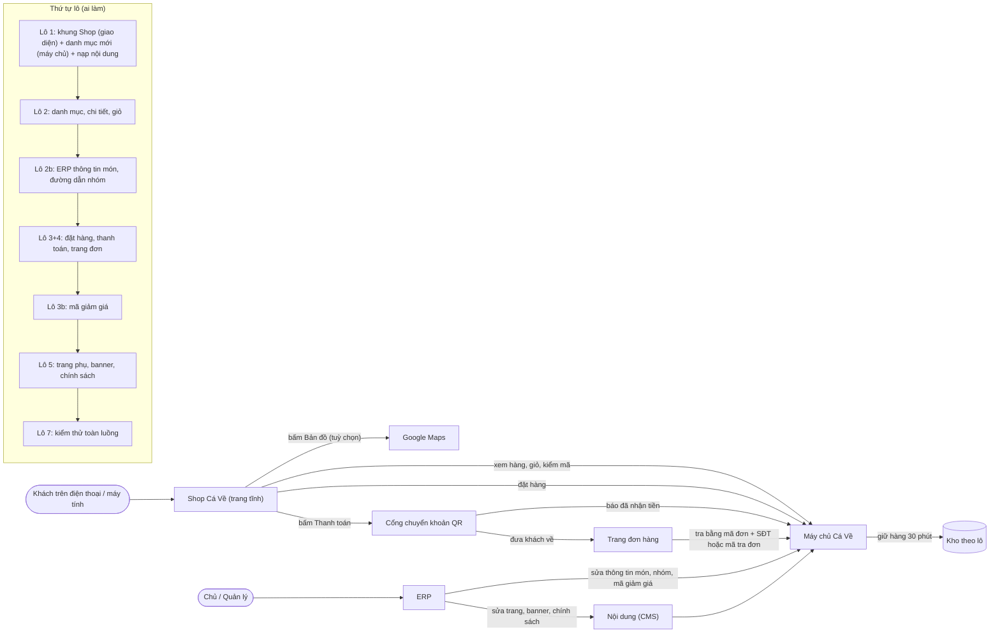
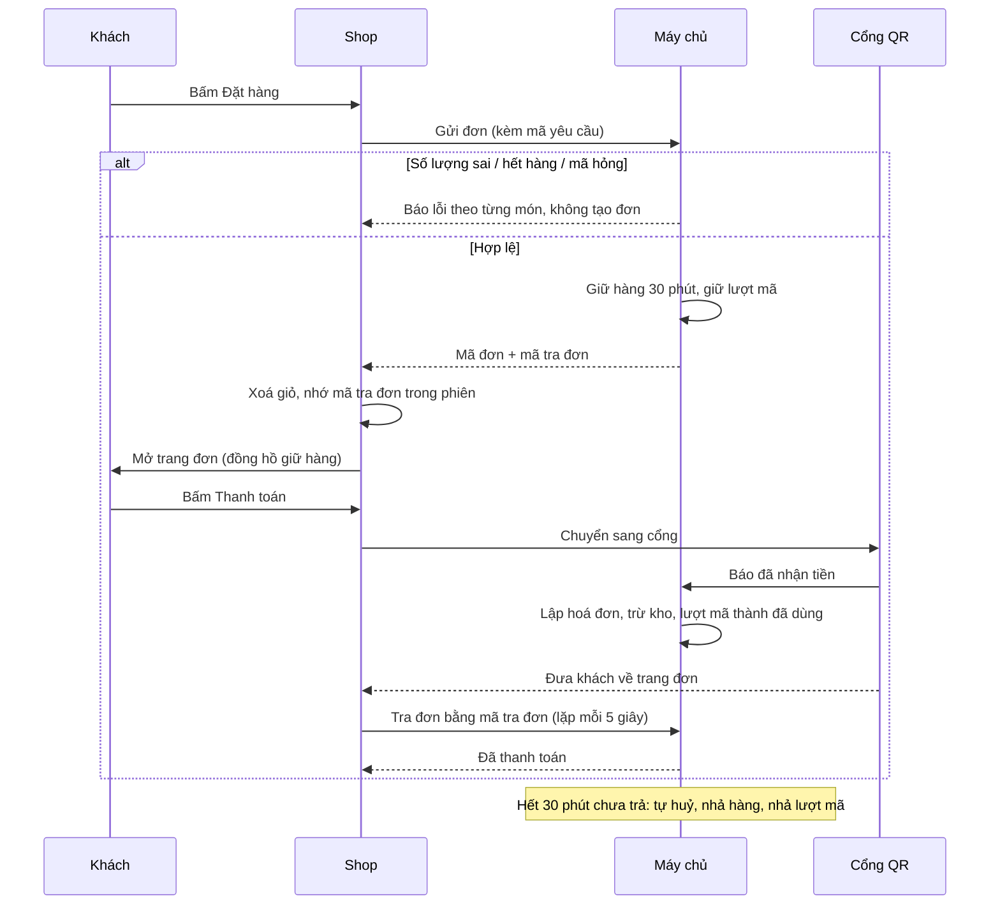
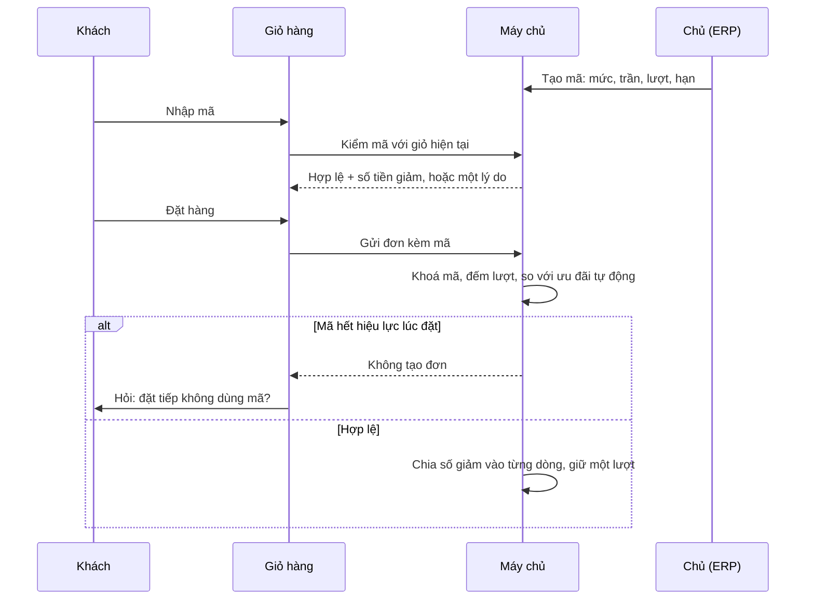

# Shop làm lại từ đầu: thiết kế kỹ thuật (02b)



> `techlead` · 2026-10-11 · Trạng thái: **SẴN SÀNG CODE** (Duy giao điều phối tự chạy hết các lô đêm 11/10, không deploy; mọi điểm mở đã "Techlead chốt", không câu hỏi treo).
> Nhánh `shop/lo-0-quyet-dinh` (commit gốc `7dfa7aa`). Đầu vào: `02-stories.md` (ĐÃ DUYỆT, 41 story), `01-analysis.md` (ĐÃ DUYỆT), `05-phap-ly.md`, `06-marketing.md`, `00-product-brief.md`,
> `doc/decisions.md` mục 2026-10-10 (tối) và 2026-10-11, `doc/business-process-spec.md`, `doc/design/shop/` (UI-RULES, SO-CHUAN, COMPONENTS, HUONG-DAN-CODE, PLAN, DOI-CHIEU-CODE), `doc/ops/cms-cho-mkt.md`, `doc/ops/moi-truong.md`.
> Cập nhật 11/10 (sau `02a-ux-flow.md`): §0 T12, §1.9, §3.4.3, §3.5, §3.8, §6.1, §9 — khớp 02a mục 7, 9. Phần lô 1 (§7) không đổi.
> Code đã đọc: `frontend/` (app, components, features, lib, scripts, e2e), `backend/apps/{catalog,sales,content,accounts/capabilities,inventory/batches,reports,common}`, `config/api_urls.py`, `config/settings.py`, `erp-console/features/{catalog,content}`, `shared/lib/nav.ts`.
> **02b thắng `02-stories.md` khi lệch** (dòng 6 của 02-stories). Chỗ lệch AC ghi ở §9 để PO sửa.
> Không cấu trúc lại thư mục (Duy chốt 10/10): giữ `frontend/`, `backend/`, `erp-console/`; chỉ thêm module trong cấu trúc hiện có.

---

## 0. Tóm tắt quyết định chính

| # | Chốt | Ở đâu |
|---|---|---|
| T1 | Lô 1 FE **dùng luôn contract danh mục mới** (`stock_level`…), commit chung với BE 2-01/2-02. Không có bước "map tạm từ số kg". fe-dev được sửa `lib/api.ts`, `lib/types.ts`, `lib/mock.ts` (phần danh mục) ngay lô 1 | §7 lô 1 |
| T2 | Danh mục công khai trả `{groups, items}`; mức tồn tính ở BE, không lưu | §3.1 |
| T3 | Lỗi tạo đơn có cấu trúc, một phong bì chung `{code, detail, …}`; món ngưng bán / mất giá lúc đặt cũng trả `OUT_OF_STOCK` dòng `out` | §3.3 |
| T4 | Tra đơn `POST` có trường `state` (bảng E6 do BE tính) — FE chỉ ánh xạ `state` + `result` sang màn | §3.4, §6.3 |
| T5 | Mã tra đơn = `django.core.signing` (chỉ mã đơn + mốc ký), hạn 30 ngày, **chỉ ở `sessionStorage`**, không "đơn gần đây" ở `localStorage` | §3.4, §1.7 |
| T6 | Tra bằng mã tra đơn dùng throttle riêng theo IP (60/phút), không tính vào throttle theo mã đơn, để D3 hỏi lại mỗi 5 giây không bị khoá | §3.11 |
| T7 | Khối `confirmation` bỏ khỏi tra đơn; FE lấy giờ gọi xác nhận từ site-info như hiện nay | §3.4 |
| T8 | Huỷ một phần (E5) = đơn `PROCESSING` có phiếu hoàn **một phần** chưa thất bại; không tách dòng (hệ thống chưa có huỷ theo dòng) | §3.4.3 |
| T9 | Banner / cam kết trang chủ = **2 trang CMS có đường dẫn cố định** (`home-banner`, `home-commitments`), đọc bằng API trang công khai sẵn có; không model mới, không màn ERP mới | §3.7 |
| T10 | Mã giảm giá: `Voucher` ở app `catalog`, `VoucherRedemption` ở app `sales` (1-1 với đơn); quyền `catalog.manage_voucher` chỉ cấp `owner`, việc "Quản lý mã giảm giá" uỷ được ở màn Phân quyền | §3.8, §3.9, §4 |
| T11 | Lãi lỗ theo lô **không đổi công thức** ở đợt này (vẫn tính theo đơn giá gộp như PricingRule hiện nay); giảm của mã đi vào `SalesOrderLine.amount` → hoá đơn → lãi lỗ theo kỳ đúng. Lệch của báo cáo theo lô ghi đề xuất cho Duy (§8) | §5, §9 |
| T12 | Giỏ có món hết: theo 02a §7.1 — nút chính **không tắt**; bấm khi còn món hết thì báo `role="alert"` "Bỏ món đã hết để đặt hàng." và dời tiêu điểm tới "Bỏ khỏi giỏ" của món hết đầu tiên; không có nút gỡ hàng loạt | §6.1 |
| T13 | Google Maps: biến `NEXT_PUBLIC_GOOGLE_MAPS_KEY`; không có key thì nút "Bản đồ" vẫn hiện, bấm mở C5; tự nạp script bằng thẻ `<script>` khi bấm, không thêm thư viện | §1.9 |
| T14 | `/ui-preview/` dùng đuôi trang `page.preview.tsx` + `pageExtensions` theo cờ `NEXT_PUBLIC_UI_PREVIEW=1`; build thường **không có route** (404) | §1.8 |
| T15 | Khung trang mỗi màn tự bọc bằng `ShopFrame` (header/footer/BottomNav theo props); `app/layout.tsx` chỉ có font + provider | §1.4 |
| T16 | `config/settings.py`, `config/api_urls.py`, mọi migration `catalog`/`sales` thuộc **be-dev**; be-dev khai **toàn bộ** biến cấu hình của đợt ngay lô 1 (kể cả biến site-info mkt-brand dùng ở lô 5) | §2.3, §7.0 |
| T17 | Ghi chú dev tách file theo người: `03-dev-notes-be.md`, `03-dev-notes-fe.md`, `03-dev-notes-mkt.md`; điều phối dán output kiểm chứng vào `03-dev-notes.md` | §7.0 |

---

## 1. Kiến trúc FE Shop (`frontend/`)

### 1.1 Cây thư mục (mới = ✚, viết lại = ↻, xoá = ✖, lô trong ngoặc)

```
frontend/
  next.config.mjs                ↻ (1) thêm pageExtensions theo cờ UI preview
  DESIGN.md (gốc repo)           ↻ (1) chỉ THÊM 14 token
  app/
    layout.tsx                   ↻ (1) Inter + globals.css + legacy.css + <CartProvider><ToastProvider>; bỏ SiteLegalFooter
    globals.css                  ↻ (1) chỉ token :root + reset + tiện ích (.num, .visually-hidden, .container)
    legacy.css                   ✚ (1) class cũ còn dùng bởi trang chưa viết lại, biến cũ trỏ về token mới (KHÔNG hex) · ✖ (5)
    page.tsx                     ↻ (1) <HomeScreen/> + metadata (metadata do mkt-brand sửa ở 1-09)
    not-found.tsx                ↻ (1, mkt-brand)
    about/page.tsx          ✚ (1, mkt-brand)
    ui-preview/page.preview.tsx  ✚ (1) chỉ build khi NEXT_PUBLIC_UI_PREVIEW=1
    shop/layout.tsx              ↻ (1) chỉ metadata + children (CartProvider đã lên root)
    shop/page.tsx                ↻ (1 bọc ShopFrame) → (2) <CatalogScreen/>
    shop/item/page.tsx           ↻ (1 bọc) → (2) <ItemDetailScreen/>
    shop/cart/page.tsx           ✚ (2) <CartScreen/>
    shop/checkout/page.tsx       ↻ (1 bọc) → (3) <CheckoutScreen/> (viết mới, cùng tên file cũ đã xoá)
    shop/orders/page.tsx         ↻ (1 bọc) → (4) <OrderScreen/>
    shop/orders/OrderLookup.tsx  ✖ (4)
    pages/page.tsx, blog/page.tsx   ↻ (1 bọc ShopFrame, fe-dev) → (5, mkt-brand) giao diện mới
  components/
    ShopFrame.tsx                ✚ (1) khung: header + main + footer + BottomNav theo props
    ShopHeader.tsx + .module.css ↻ (1)   ShopFooter.tsx + .module.css ↻ (1)
    BottomNav.tsx + .module.css  ✚ (1)   LogoSlot.tsx ✚ (1)   CartContext.tsx ↻ (1, đổi type ở 2)
    ui/        Button IconButton(+CartBadge) Chip SegmentedControl TextLink ToggleButton TextField Checkbox
               FormErrorSummary Breadcrumb Dialog(+useReturnFocus.ts) Sheet(BottomSheet) FullscreenSheet Popover
               Toast(ToastProvider,useToast) Banner EmptyState ErrorState Skeleton(+ProductCardSkeleton) Spinner Icon
    catalog/   PriceTag ImageFrame CategoryTile ProductCard StockBadge QtyStepper AddToCart SideFilter SortControl
    cart/      CartLine CartSummary CartBar MiniCart CheckoutSteps VoucherField
    search/    SearchBox SearchSuggest
    (✖ CatalogGrid, AddToCartControl, ItemImageFrame, ContactButton, CountdownTimer — xem §1.11)
  features/
    home/      components/HomeScreen.tsx (1) · content.ts (1, ✖ 5) · README.md
    catalog/   components/CatalogScreen.tsx, ItemDetailScreen.tsx (2) · catalogView.ts (lọc/sắp/tìm, 2) · groupIcon.ts (1) · README.md
    cart/      components/CartScreen.tsx (2) · reconcile.ts (so giá, làm tròn số lượng, 2) · README.md
    checkout/  (giữ module, viết lại ruột)
               components/ CheckoutScreen.tsx(3) AddressField.tsx(3) AddressMapPicker.tsx(3) SoldOutSheet.tsx(3)
                           OrderScreen.tsx(4) LookupForm.tsx(4) HoldCountdown.tsx(4) PaymentMethod.tsx(4)
                           OrderTimeline.tsx(4) OrderStatusBadge.tsx(4) OrderLines.tsx(4) SuccessBanner.tsx(4)
                           CancelNotice.tsx(4) ConfirmCallBlock.tsx(4) MockGatewayPanel.tsx (giữ)
               googleMaps.ts(3) · requestId.ts(3) · lookupToken.ts(3, thay storage.ts) · orderState.ts(4) · gateway.ts (giữ) · README.md ↻
    content/   (mkt-brand) · site/ (mkt-brand; ✖ SiteLegalFooter ở lô 1 do fe-dev)
    ui-preview/ PreviewGallery.tsx · previewFixtures.ts (1; dữ liệu giả, không tên file mock*)
  lib/
    api.ts types.ts mock.ts      ↻ chỉ fe-dev sửa (mọi lô)
    format.ts                    ↻ (1) thêm formatPriceVnd ("278.000đ"), currentYearInVietnam(), formatTimeDayVn ("14:05 · 11/10")
    quantity.ts                  ✚ (1) luật số lượng thuần (không import)
    text.ts                      ✚ (2) foldVietnamese (bỏ dấu, đ→d)
  scripts/
    test-quantity.mjs (1) · test-cart-reconcile.mjs (2) · test-order-state.mjs (4) — cùng kiểu test-format.mjs
```

Quy tắc: component trong `components/ui|catalog|cart|search` là **trình bày** (props vào, callback ra, không gọi API, không đọc storage, COMPONENTS §3).
Chỉ `*Screen.tsx` và `ShopHeader`/`ShopFooter` (cần site-info/catalog) được gọi `lib/api.ts` hoặc `features/site/api.ts`. Không barrel `index.ts`. Import bằng `@/`.

### 1.2 Token và CSS
- `app/globals.css` `:root` khai **đủ** bảng biến COMPONENTS §1 (nền, viền, chữ, nhấn, `--brand-deep*`, `--on-brand-muted`, trạng thái + `--crit-border`/`--good-border`, `--overlay*`, bo góc, bóng, khoảng cách, chiều cao, chuyển động, z-index) + `color-scheme: light` trên `:root` và **không** có khối `prefers-color-scheme: dark` (D8).
- `body { font-family: var(--font-inter), system-ui, sans-serif; background: var(--canvas); color: var(--ink) }`. Ô nhập `font-size: 16px`.
- Style component bằng CSS Modules cạnh file. Không Tailwind, không thư viện UI. Chỉ chuyển `transform|opacity|background-color|border-color|color`; không `transition: all`.
  `@media (prefers-reduced-motion: reduce)` bỏ scale/translate. Hover chỉ trong `@media (hover: hover) and (pointer: fine)`.
- **Techlead chốt (legacy.css):** trang chưa viết lại (checkout, tra đơn, bài viết, trang) vẫn dùng class cũ trong `globals.css`. Lô 1 chuyển các class đó sang `app/legacy.css`,
  biến cũ thành alias token mới (`--color-primary: var(--accent)`, `--color-accent: var(--accent)`…), **xoá mọi mã hex cũ** (`#0a6e8c`, `#e8912c`…). Mỗi lô xoá class của phần mình thay; lô 5 xoá file.
- `DESIGN.md`: chỉ **thêm** 14 token ở COMPONENTS "Token cần thêm" (frontmatter + bảng). `git diff DESIGN.md` không có dòng `-`.
- G7 theo lô: `git diff --name-only <gốc lô> -- frontend | xargs grep -nE "#[0-9A-Fa-f]{6}" | grep -v globals.css` ra 0 (file lô chạm). Toàn Shop về 0 ở lô 5 (QA kiểm ở lô 7).

### 1.3 Font
`app/layout.tsx`: `import { Inter } from "next/font/google"; const inter = Inter({ subsets: ["latin", "vietnamese"], weight: ["400","500","600"], display: "swap", variable: "--font-inter" })`,
`<html lang="vi" className={inter.variable}>`. `next/font` tải font **lúc build** và tự host trong `out/_next/static/media` → 0 request tới `fonts.googleapis.com`/`fonts.gstatic.com` lúc chạy (AC 1-01 AC2). Máy build cần mạng (đã có).

### 1.4 Khung trang và provider
- `app/layout.tsx` (server): font, `globals.css`, `legacy.css`, `<CartProvider><ToastProvider>{children}</ToastProvider></CartProvider>`. Không header/footer ở root.
- `components/ShopFrame.tsx` (client): `{ header: "home"|"sticky"|"sub"|"checkout"; title?: string; footer: "full"|"compact"; bottomNav: boolean; backHref?: string; children }`.
  Mỗi màn tự bọc. Bảng dùng (khớp UI-RULES §4.3, §4.5, D9):

| Route | header (điện thoại → máy tính) | footer | BottomNav |
|---|---|---|---|
| `/` | `home` (H1, cuộn → H2) → full | full | có |
| `/shop/` | `sticky` (H2) → full | full | có |
| `/shop/item/` | `sub` (H3) → full | full | không |
| `/shop/cart/` | `sub` (H3, không nút giỏ) → compact | compact | không |
| `/shop/checkout/`, `/shop/orders/` khi đơn `BOOKED` | `checkout` (H4) → compact | compact | không |
| `/shop/orders/` các trạng thái khác + F1/F2 | `sub` → full | full | có (tab "Đơn hàng") |
| `/blog/` danh sách | `sticky` → full | full | có |
| `/blog/?slug=`, `/pages/`, `/about/`, 404 | `sub` → full | full | không |

- H3 nút quay lại: có `history.length > 1` và `document.referrer` cùng origin thì `history.back()`, không thì `backHref` (mặc định `/shop/`).
- Header/footer đọc `getSiteInfo()` (có cache 5 phút sẵn) và `getFooterLinks()` (features/site). Lỗi thì ẩn khối liên quan, không vỡ bố cục (1-03 AC7, 1-05 AC6).
- Menu nhóm máy tính: lấy `groups` từ `getCatalog()` (một cấp, D10).

### 1.5 Icon
`components/ui/Icon.tsx`: `export type IconName = "search"|"cart"|"phone"|"receipt"|"home"|"grid"|"chevron-left"|"chevron-right"|"chevron-down"|"close"|"plus"|"minus"|"trash"|"check"|"info"|"warning"|"error"|"map-pin"|"map"|"copy"|"clock"|"chat"|"mail"|"fish"|"shrimp"|"squid"|"crab"|"combo"|"filter"|"sort"|"refresh"|"external"|"truck"|"package"|"qr"`;
`<Icon name size={20|24} />` vẽ SVG nội tuyến `viewBox="0 0 24 24"`, `stroke="currentColor"`, nét 1,75, `fill="none"`, luôn `aria-hidden="true" focusable="false"`. Không Material Symbols ở Shop (Q-UX-2). Thêm icon mới = thêm vào union + map, không SVG rời trong component khác.

### 1.6 Gọi API và mock
- Mọi call qua `lib/api.ts` (`apiFetch`) hoặc `features/site/api.ts`, `features/content/api.ts` (của mkt-brand). Không `fetch` rải rác.
- `apiFetch` giữ như hiện có; `ApiError` mang `status`, `code`, `data` (đọc `data.lines`, `data.fields`, `data.reason_code`…). Lỗi 429 → `code: "throttled"`.
- **Kiểu dây = kiểu dùng**: `lib/types.ts` khai đúng JSON §3 (tiền là chuỗi `Money`), **không** còn lớp map `Wire*`. Đổi số chỉ ở chỗ cần tính (`Number(price)` cho tạm tính giỏ).
- `lib/mock.ts`: nhánh mock nạp động (giữ cơ chế `process.env.NEXT_PUBLIC_USE_MOCK === "1"` + `await import("./mock")`), trả **đúng** JSON §3. Ca kích hoạt cố định để QA chụp:

| Ca | Cách gọi trong mock |
|---|---|
| Món `out` / `low` / `in`, combo `low` | seed catalog có đủ (một món `CUA-HOANG-DE` luôn `out`) |
| `INVALID_QTY` | gửi qty sai bước |
| `OUT_OF_STOCK` (`out` + `short`) | giỏ có `CUA-HOANG-DE` hoặc qty > 20 |
| Mất phản hồi C4 | tên người nhận chứa `#timeout` → mock ghi nhận đơn theo `client_request_id` rồi ném lỗi mạng; gửi lại trả đơn cũ |
| 429 C8 / 409 C9 / Shop tạm ngưng | tên chứa `#throttle` / `#policy` / site-info mock cờ `privacy_consent_required` + không có trang privacy |
| Mỗi `state` E6 | 10 đơn seed `SO000000-MOCKA1` … (bảng ở `lib/mock.ts`), tra bằng SĐT giả `0900000001` hoặc token mock |
| Mã giảm giá | `CAVE10` hợp lệ; `HETHAN` EXPIRED; `HETLUOT` USED_UP; `TOITHIEU` MIN_ORDER; `UUDAI` BETTER_PROMO; mã khác INVALID |

  Dữ liệu mock chỉ dùng tên/SĐT giả (`Nguyễn Văn A`, `0900000001`), không dữ liệu thật. `check-no-mock.mjs` tự quét seed.
- Build kiểm chứng **luôn** `NEXT_PUBLIC_USE_MOCK=0` (vì `.env.local` bật mock).

### 1.7 Dữ liệu ở trình duyệt (bất biến 9)

| Khoá | Nơi | Nội dung | Ghi chú |
|---|---|---|---|
| `cangcaloc_cart_v1` | localStorage | `[{item_code, name, unit, price, qty}]` | Giữ tên khoá; đọc được dạng cũ (`unit:"Kg"`, qty lẻ) rồi chuẩn hoá ở giỏ (2-06 AC6). Chuỗi hỏng → giỏ rỗng, không throw (1-01 AC7) |
| `cangcaloc_cart_voucher_v1` | localStorage | `"CAVE10"` | Chỉ mã, không số tiền (3b-05 AC6) |
| `shop_recent_searches_v1` | localStorage | tối đa 5 từ | Bỏ chuỗi có ≥ 9 chữ số (2-04 AC4) |
| `cangcaloc_checkout_request_v1` | sessionStorage | `{id, cart_fingerprint}` | `client_request_id`; xoá khi tạo đơn thành công; đổi giỏ thì sinh mới |
| `cangcaloc_order_tokens_v1` | sessionStorage | `{[order_code]: token}` tối đa 5 | 401 thì xoá mục đó |
| `cangcaloc_last_order_contact_v1` | sessionStorage | — | Khoá cũ (4 số cuối): lô 3 **xoá** khi trang đơn mở |

URL chỉ chứa `code`, `result`, `q`, `group`, `type`, `sort`, `slug`, `category`. Không bao giờ SĐT, tên, địa chỉ, token. Không `console.log` dữ liệu form.

### 1.8 `/ui-preview/` theo cờ build (Techlead chốt)
- File `app/ui-preview/page.preview.tsx`; `next.config.mjs`: `pageExtensions: process.env.NEXT_PUBLIC_UI_PREVIEW === "1" ? ["tsx","ts","preview.tsx"] : ["tsx","ts"]`.
  Không cờ → Next không thấy route → `out/ui-preview/` **không tồn tại**, Firebase trả `404.html` (1-02 AC2). Kiểm: `test ! -e out/ui-preview/index.html`.
- Trang render `features/ui-preview/PreviewGallery.tsx` với `previewFixtures.ts` (dữ liệu giả). Có `<meta name="robots" content="noindex">`.
- QA build riêng: `NEXT_PUBLIC_USE_MOCK=1 NEXT_PUBLIC_UI_PREVIEW=1 npm run build` (hoặc `npm run dev`) để kiểm G5. Bản kiểm chứng chính vẫn build **không** cờ.

### 1.9 Google Maps (Techlead chốt)
- Biến: **`NEXT_PUBLIC_GOOGLE_MAPS_KEY`** (một tên duy nhất). Truyền lúc build như `NEXT_PUBLIC_*` khác; không commit.
- Nút "Bản đồ" **luôn hiện**. Bấm → mở `FullscreenSheet` (điện thoại) / Dialog (máy tính) ngay, dòng thông báo Google (BR-BH-29) hiện **trước** khi tải script.
- **Thiếu key (Techlead chốt, 02a §9.1):** `const MAPS_KEY = (process.env.NEXT_PUBLIC_GOOGLE_MAPS_KEY ?? "").trim()` đọc **một chỗ** ở `googleMaps.ts`, export `hasMapsKey(): boolean`. Rỗng = thiếu key → bấm "Bản đồ" mở thẳng Dialog C5, không mở sheet, không tạo thẻ script, 0 request tới Google.
  Hằng `MAPS_LOAD_TIMEOUT_MS = 10000` (10 giây). Lỗi/timeout: đóng sheet **trước** rồi mới mở C5 (không chồng hai modal); xoá thẻ script hỏng; lần bấm sau trong cùng phiên thử nạp lại **một** lần, lần lỗi thứ hai thì mở thẳng C5.
- `features/checkout/googleMaps.ts`: `loadGoogleMaps(): Promise<GoogleNs>` — không key → reject ngay; có key → chèn **một** thẻ `<script src="https://maps.googleapis.com/maps/api/js?key=…&v=weekly&loading=async&language=vi&region=VN&callback=__caveveMapsReady">`, timeout 10 giây.
  Lỗi/timeout/không key → đóng sheet, mở Dialog C5, đưa tiêu điểm về ô địa chỉ (3-04 AC5). Kiểu `google` khai tối thiểu ở `features/checkout/googleMaps.d.ts` (không thêm `@types/google.maps`).
- Bên trong: `google.maps.importLibrary("maps"|"places"|"geocoding")`; ô tìm dùng `PlaceAutocompleteElement` (Places API mới, `includedRegionCodes: ["vn"]`); ghim kéo được, kéo xong `Geocoder` đảo ngược ra chuỗi địa chỉ.
  Xác nhận → ghi **chuỗi** vào ô địa chỉ (C1c), khách sửa tay được. Không lưu `lat`, `lng`, `place_id` ở đâu (state cục bộ của sheet, mất khi đóng). Không `navigator.geolocation` (S-07).
- QA tối nay chỉ kiểm được nhánh không key (C5) + AC1, AC2, AC4, AC6. Nhánh có key là **điểm dừng** (Duy + techlead cấp key có giới hạn referrer).

### 1.10 Ánh xạ 48 component → file → lô → người

| # | Component | File | Lô |
|---|---|---|---|
| 1 | Button | `components/ui/Button.tsx` | 1 |
| 2 | IconButton (+CartBadge) | `components/ui/IconButton.tsx` | 1 |
| 3 | Chip | `components/ui/Chip.tsx` | 1 (dựng, vì `/ui-preview/` cần) · 2 dùng |
| 4 | SegmentedControl | `components/ui/SegmentedControl.tsx` | 2 |
| 5 | Link | `components/ui/TextLink.tsx` | 1 |
| 6 | Toggle | `components/ui/ToggleButton.tsx` | 2 |
| 7 | TextField | `components/ui/TextField.tsx` | 3 |
| 8 | AddressField + MapPicker | `features/checkout/components/AddressField.tsx`, `AddressMapPicker.tsx` | 3 |
| 9 | Checkbox | `components/ui/Checkbox.tsx` | 3 |
| 10 | SearchBox / SearchSuggest | `components/search/SearchBox.tsx` (1) / `SearchSuggest.tsx` (2) | 1 / 2 |
| 11 | FormErrorSummary | `components/ui/FormErrorSummary.tsx` | 3 |
| 12 | ProductCard | `components/catalog/ProductCard.tsx` (`rail`,`row` lô 1; `grid` lô 2) | 1 · 2 |
| 13 | StockBadge | `components/catalog/StockBadge.tsx` | 1 (ProductCard cần) |
| 14 | PriceTag | `components/catalog/PriceTag.tsx` | 1 |
| 15 | QtyStepper | `components/catalog/QtyStepper.tsx` | 2 |
| 16 | AddToCart | `components/catalog/AddToCart.tsx` | 2 |
| 17 | ImageFrame | `components/catalog/ImageFrame.tsx` (giữ `srcSet`/`sizes`/`onError` của `ItemImageFrame`) | 1 |
| 18 | CategoryTile | `components/catalog/CategoryTile.tsx` | 1 |
| 19 | CartLine | `components/cart/CartLine.tsx` | 2 |
| 20 | CartSummary | `components/cart/CartSummary.tsx` (`cart` 2 · `checkout` 3 · `payment` 4) | 2–4 |
| 21 | CartBar | `components/cart/CartBar.tsx` | 2 |
| 22 | MiniCart | `components/cart/MiniCart.tsx` | 2 |
| 23 | CheckoutSteps | `components/cart/CheckoutSteps.tsx` | 2 |
| 24 | HoldCountdown | `features/checkout/components/HoldCountdown.tsx` | 4 |
| 25 | PaymentMethod | `features/checkout/components/PaymentMethod.tsx` | 4 |
| 26 | OrderTimeline | `features/checkout/components/OrderTimeline.tsx` | 4 |
| 27 | OrderStatusBadge | `features/checkout/components/OrderStatusBadge.tsx` | 4 |
| 28 | OrderLines | `features/checkout/components/OrderLines.tsx` | 4 |
| 29 | SuccessBanner | `features/checkout/components/SuccessBanner.tsx` | 4 |
| 30 | ShopHeader | `components/ShopHeader.tsx` + `.module.css` | 1 |
| 31 | BottomNav | `components/BottomNav.tsx` | 1 |
| 32 | ShopFooter | `components/ShopFooter.tsx` (gộp dải pháp lý) | 1 |
| 33 | Breadcrumb | `components/ui/Breadcrumb.tsx` | 2 |
| 34 | SideFilter | `components/catalog/SideFilter.tsx` | 2 |
| 35 | SortControl | `components/catalog/SortControl.tsx` | 2 |
| 36 | PolicyNav | `features/site/components/PolicyNav.tsx` | 5 (mkt-brand) |
| 37 | LogoSlot | `components/LogoSlot.tsx` | 1 |
| 38 | Dialog | `components/ui/Dialog.tsx` + `useReturnFocus.ts` (`<dialog>` + `showModal()`) | 1 |
| 39 | BottomSheet | `components/ui/Sheet.tsx` (export `BottomSheet`) | 1 |
| 40 | FullscreenSheet | `components/ui/FullscreenSheet.tsx` | 1 |
| 41 | Popover | `components/ui/Popover.tsx` | 1 |
| 42 | Toast | `components/ui/Toast.tsx` (`ToastProvider`, `useToast`) | 1 |
| 43 | Banner | `components/ui/Banner.tsx` | 1 |
| 44 | EmptyState | `components/ui/EmptyState.tsx` | 1 |
| 45 | ErrorState | `components/ui/ErrorState.tsx` | 1 |
| 46 | Skeleton | `components/ui/Skeleton.tsx` (+`ProductCardSkeleton`) | 1 |
| 47 | Spinner | `components/ui/Spinner.tsx` | 1 |
| 48 | VoucherField | `components/cart/VoucherField.tsx` | 3b |
| — | Icon | `components/ui/Icon.tsx` | 1 |
| — | ShopFrame | `components/ShopFrame.tsx` | 1 |

Mọi file trên của fe-dev, trừ #36 (mkt-brand). Props theo COMPONENTS; ProductCard **chỉ** nhận `stockLevel: StockLevel`, không có prop số kg.
Kiểu dùng chung trong `lib/types.ts`: `StockLevel = "in"|"low"|"out"`, `SaleUnit = "kg"|"combo"`, `Money = string`, `GroupIcon` (FE suy từ slug nhóm ở `features/catalog/groupIcon.ts`: `ca*`→fish, `tom*`→shrimp, `muc*`→squid, `cua*|ghe*`→crab, BUNDLE→combo, khác → fish).

### 1.11 Code cũ bị xoá theo lô (G8)

| Lô | Xoá (FE) | Xoá/gỡ (BE) | e2e cũ |
|---|---|---|---|
| 1 | landing ở `app/page.tsx`; `ShopHeader`/`ShopFooter` bản cũ (viết lại cùng tên); `features/site/components/SiteLegalFooter.tsx` + `.module.css` + chỗ gắn ở `app/layout.tsx`; `components/ItemImageFrame.tsx`; mọi hex/token cũ trong `globals.css`; `CartProvider` trong `app/shop/layout.tsx`; khoá `sellable_qty`, `unit:"Kg"`, `group` (chuỗi) khỏi `lib/types.ts`, `lib/mock.ts`, `lib/api.ts` | `sellable_qty` khỏi `catalog/items/shop_api.py`; câu lỗi lộ mã lô/số kg ở `inventory/batches/services.py` (`allocate_fefo`, `reserve`) | `ra_soat_cms14_landing.py` (mkt-brand sửa sang `/about/`; nay là `about_page.py`), phần footer cũ của `ra-soat-a2-golive.py` (fe-dev) |
| 2 | `components/CatalogGrid.tsx`, `components/AddToCartControl.tsx`, `components/ContactButton.tsx` (khi `ItemCard` lô 5 chưa xoá thì ItemCard tự dựng nút `tel:`), phần dòng giỏ trong `features/checkout/components/CheckoutScreen.tsx`, dòng phụ đề "tồn kho hiển thị là…" ở `app/shop/page.tsx` | — | e2e đọc "Còn X kg" trong `qa-lo6-sr21-shop.py`, `qa-lo7-shop-*.py`, `qa-lo8-shop-*.py` (sửa hoặc xoá đoạn đó) |
| 2b | — | — | — |
| 3+4 | `features/checkout/components/CheckoutScreen.tsx` (bản cũ, viết lại), `PaymentPanel.tsx`, `OrderPaymentPanel.tsx`, `features/checkout/storage.ts`, `app/shop/orders/OrderLookup.tsx`, `components/CountdownTimer.tsx`, `features/site/components/ConfirmationPolicyNotice.*` + `ConfirmCallNotice.tsx` (thay bằng `ConfirmCallBlock`, vì câu cũ có chữ "hoàn đủ tiền"), class giỏ/checkout trong `legacy.css`, `getOrderStatus`, `phone_last4` khắp FE | `ShopOrderLookupView` GET + route `shop/orders/<code>/`, `LOOKUP_BAD_LAST4`, khối `refund{…}` và câu "sẽ được hoàn trong vòng N ngày" trong `customer_notices.py` | `order_lookup_completed.py`, `order_lookup_no_raw_codes.py`, phần tra đơn của `qa_sepay_checkout.py` |
| 3b | mock tạm `discount` nếu có | — | — |
| 5 | `app/pages/pages.module.css`, `app/blog/blog.module.css`, `features/content/components/ItemCard.*`, `features/home/content.ts`, `app/legacy.css` | — | `ra_soat_cms13_public.py`, `ra_soat_cms06_item_card.py` sửa theo giao diện mới |
| 7 | — | — | còn sót; `grep -rnE "sellable_qty|phone_last4|OrderLookup|SiteLegalFooter|CatalogGrid|AddToCartControl|CountdownTimer" frontend backend/apps` = 0 ngoài migration/doc |

---

## 2. Kiến trúc BE

### 2.1 Module

| Việc | File (module tính năng) |
|---|---|
| Mức tồn, quy tắc số lượng | `apps/catalog/items/services.py`: `stock_level(item) -> "in"|"low"|"out"`, `sale_unit(item)`, `qty_rule(item) -> (min_qty, qty_step)`, `validate_line_qty(item, qty) -> bool`. Giữ `sellable_qty` (nội bộ, ERP và tạo đơn dùng) |
| Danh mục công khai | `apps/catalog/items/shop_api.py` (dict tường minh, không serializer back-office) |
| Kiểm chữ thông tin món (BR-DM-25) | `apps/catalog/items/public_text.py`: `public_text_error(value) -> str | None` |
| Slug nhóm | `apps/common/slugs.py` (mới): `slugify_vi(text)`, `unique_slug(model, base, exclude_pk)` |
| Tạo đơn / kiểm số lượng / chống trùng / lỗi có cấu trúc | `apps/sales/orders/services.py` (`create_order` thêm tham số) + `apps/sales/orders/shop_errors.py` (mới: `ShopValidationError`, `InvalidQtyError`, `OutOfStockError`, `VoucherInvalidError`, mã lỗi) |
| Tra đơn, mã tra đơn, `state`, nhãn | `apps/sales/orders/shop_api.py`, `apps/sales/orders/lookup_token.py` (mới), `apps/sales/orders/shop_state.py` (mới: tính `state`, `delivery.step`, mốc giờ), `shop_labels.py` (mở rộng), `customer_notices.py` (viết lại theo BR-HT-12) |
| Mã giảm giá | `apps/catalog/models/vouchers.py`, `apps/catalog/vouchers/` (`services.py` tạo/sửa/tắt/bật + `evaluate_voucher` + `allocate_whole_vnd`; `api.py` ERP; `shop_api.py` kiểm mã; `serializers.py`; `tests/`; `README.md`). Lượt dùng: `apps/sales/models/vouchers.py` + `apps/sales/orders/voucher_redemptions.py` (`hold`, `mark_used`, `release`) |
| Chỗ móc lượt | `create_order` (giữ), `payments/services.py::_record_payment` nhánh MATCHED (dùng), `orders/services.py::cancel_unpaid_expired` (nhả) |
| Throttle | `apps/common/throttling.py` (thêm lớp, sửa `ShopLookupOrderThrottle` đọc mã đơn từ body) |
| Quyền | `apps/accounts/capabilities/registry.py` thêm việc `manage_voucher` |
| CMS | `apps/content/**` (mkt-brand): lệnh `load_shop_content`, `page_role` mới, site-info mở rộng, quét SĐT cho phép hotline |

### 2.2 Thứ tự khoá (Postgres, theo skill `django-drf-patterns`)
Tạo đơn: (1) `SalesOrder` insert (giữ unique `client_request_id`) → (2) `Voucher` `select_for_update()` theo `code` (không `select_related`) → đếm lượt bằng truy vấn mới → (3) lô theo thứ tự hiện có (`reserve` khoá từng lô).
Thanh toán: khoá `SalesOrder` → cập nhật `VoucherRedemption` của đơn (không khoá `Voucher`). Job hết giờ: khoá `SalesOrder` → nhả lô → cập nhật redemption. Không đường nào khoá lô trước rồi mới khoá `Voucher` → không deadlock.

### 2.3 Biến cấu hình (be-dev khai **một lần ở lô 1**, `config/settings.py`, đọc env, có mặc định)

| Tên | Mặc định | Dùng |
|---|---|---|
| `SHOP_MIN_QTY_KG` | `Decimal("1")` | BR-BH-22, 23 |
| `SHOP_QTY_STEP_KG` | `Decimal("0.5")` | BR-BH-22 |
| `SHOP_LOW_STOCK_KG` | `Decimal("3")` | BR-BH-23 (V-01) |
| `SHOP_LOW_STOCK_COMBO` | `3` | BR-BH-23 |
| `SHOP_MAX_ORDER_LINES` | `30` | chống lạm dụng, `VALIDATION` |
| `SHOP_LOOKUP_TOKEN_DAYS` | `30` | BR-BH-25 (V-02) |
| `SHOP_PAYMENT_PENDING_MINUTES` | `5` | BR-TT-19 (trả trong tra đơn) |
| `SHOP_CANCEL_CALLBACK_WITHIN` | `"1 ngày làm việc"` | BR-HT-12 (S-12 câu tạm) |
| `SHOP_CANCEL_POLICY_URL` | `"/pages/?slug=doi-tra#xu-ly-tien"` | BR-HT-12 |
| `VOUCHER_MAX_PERCENT` | `Decimal("50")` | BR-DM-21 |
| `SELLER_ZALO`, `SELLER_WORKING_HOURS`, `SELLER_REG_ISSUED_BY`, `SELLER_REG_ISSUED_ON`, `SELLER_WEBSITE_NOTICE_URL`, `SELLER_WEBSITE_NOTICE_IMAGE` | `""` | BR-ND-18 (mkt-brand đọc ở lô 5) |
| `SHOP_RETURN_REPORT_HOURS` | `""` (rỗng → `null`) | E3 |
| `CAVEVE_THROTTLE_RATES` thêm `shop_lookup_token` `"60/min"`, `shop_voucher_check` `"20/min"` (env `THROTTLE_SHOP_LOOKUP_TOKEN`, `THROTTLE_SHOP_VOUCHER_CHECK`) | | §3.11 |

`SHOP_HOTLINE`, `SALES_ORDER_TTL_MINUTES`, `PRIVACY_CONSENT_REQUIRED` giữ nguyên. `REFUND_DEADLINE_DAYS` giữ cho ERP, Shop **không** đọc nữa.

---

## 3. Contract API (chốt)

### 3.0 Quy ước chung
- Tiền: chuỗi số nguyên đồng khi là số tròn (`money_str`: `"278000"`, `"417000"`), không float. Số lượng: chuỗi tối giản (`"1"`, `"1.5"`, `"2"`); combo luôn nguyên.
- Giờ: ISO 8601 **UTC có `Z`** (`"2026-10-11T03:00:00Z"`), helper `iso_utc(dt)`. FE hiển thị GMT+7 bằng `lib/format.ts`.
- Phong bì lỗi: `{"code": "<MÃ>", "detail": "<câu tiếng Việt cho khách>", ...thêm}` (qua `BusinessError.extra` + `exception_handler` sẵn có). FE không bao giờ in `detail` thô ở C3; các ca khác in được.
- Endpoint Shop: `AllowAny`, không session, `Cache-Control: no-store` cho tạo đơn/tra đơn/kiểm mã (`NoStoreMixin`).
- Log: view Shop **không** log `request.data`; chỉ log mã đơn và `mask_phone`.

### 3.1 `GET /api/shop/catalog/` — công khai, throttle không đổi (không có), chỉ GET (POST/PATCH → 405)
```json
200 {
  "groups": [
    {"slug": "muc", "name": "Mực", "item_count": 4},
    {"slug": "combo", "name": "Combo", "item_count": 2}
  ],
  "items": [
    {
      "item_code": "MUC-ONG", "name": "Mực ống làm sạch", "item_type": "SIMPLE",
      "unit": "kg", "price": "278000", "stock_level": "low",
      "min_qty": "1", "qty_step": "0.5",
      "group": {"slug": "muc", "name": "Mực"},
      "short_note": "",
      "image": {"alt": "…", "is_illustration": false, "urls": {"thumb": "…", "card": "…", "detail": "…"}}
    },
    {
      "item_code": "COMBO-LAU", "name": "Combo lẩu hải sản", "item_type": "BUNDLE",
      "unit": "combo", "price": "450000", "stock_level": "in",
      "min_qty": "1", "qty_step": "1",
      "group": {"slug": "combo", "name": "Combo"}, "short_note": "", "image": null
    }
  ]
}
```
- Chỉ món `is_active` **và** có giá hiệu lực. `groups` chỉ gồm nhóm có ≥ 1 món trong `items`; `item_count` đếm món trong `items`. Thứ tự `items`: tên nhóm, mã (FE tự đẩy `out` xuống cuối).
- `stock_level` (BR-BH-23, settings): SIMPLE `a = sellable_qty(item)`: `a < SHOP_MIN_QTY_KG` → `out`; `a < SHOP_LOW_STOCK_KG` → `low`; còn lại `in`. BUNDLE `c = sellable_qty(bundle)` (số combo): `c < 1` → `out`; `c < SHOP_LOW_STOCK_COMBO` → `low`; còn lại `in`.
- `short_note` trả `""` tới lô 2b. **Không** khoá nào chứa số kg tồn, giá vốn, mã lô.

### 3.2 `GET /api/shop/catalog/<item_code>/`
```json
200 { …như một phần tử items…,
  "description": "", "spec": "", "storage": "", "origin": "",
  "bundle_components": [{"item_code": "MUC-ONG", "name": "Mực ống làm sạch", "qty_per_bundle": "0.5", "unit": "kg"}] }
404 {"code": "ITEM_NOT_FOUND", "detail": "Không tìm thấy món này."}
```
- `bundle_components` chỉ có khi BUNDLE (SIMPLE: khoá vắng). 404 cho: không có mã, `is_active=False`, không có giá hiệu lực — cùng một câu.
- Lô 1–2: 4 trường chữ trả `""`; lô 2b trả giá trị thật (`description` đã có cột).

### 3.3 `POST /api/shop/orders/` — công khai, throttle `shop_order_create` (giữ 20/giờ/IP)
Request:
```json
{
  "client_request_id": "6f1c2a7e-3b4d-4c5e-9f00-1a2b3c4d5e6f",
  "customer": {"name": "Nguyễn Văn A", "phone": "+84 900 000 001"},
  "delivery_address": "1 Đường Thử, Phường Mẫu",
  "items": [{"item_code": "MUC-ONG", "qty": "1.5"}, {"item_code": "COMBO-LAU", "qty": "1"}],
  "privacy_consent": {"accepted": true, "policy_version_id": 12},
  "voucher_code": "CAVE10"
}
```
(`voucher_code` từ lô 3b, tuỳ chọn. Khoá `phone` cấp ngoài bị bỏ. Tên khoá đồng ý giữ `privacy_consent` như code hiện có.)

Response 201 (lần đầu) / **200** (gửi lại cùng `client_request_id` — trả đơn đã có, không giữ chỗ/lượt thêm):
```json
{
  "order_code": "SO261011-AB12CD", "status": "BOOKED",
  "subtotal": "867000",
  "discount": {"source": "voucher", "code": "CAVE10", "amount": "50000"},
  "total_amount": "817000",
  "booked_expires_at": "2026-10-11T03:30:00Z", "server_now": "2026-10-11T03:00:00Z", "hold_minutes": 30,
  "lines": [
    {"item_code": "MUC-ONG", "name": "Mực ống làm sạch", "unit": "kg", "qty": "1.5", "amount": "417000"},
    {"item_code": "COMBO-LAU", "name": "Combo lẩu hải sản", "unit": "combo", "qty": "1", "amount": "450000"}
  ],
  "lookup_token": "eyJvIjoiU08yNjEwMTEtQUIxMkNEIn0:1v…:…"
}
```
`lines[].amount` = **gộp** (qty × đơn giá), `subtotal` = Σ gộp, `discount.source` ∈ `"promo"|"voucher"|null` (null thì `code: null`, `amount: "0"`), `total_amount` = tổng sau giảm làm tròn nguyên đồng (BR-BH-15). Không có tên, SĐT, địa chỉ.

Lỗi (kiểm theo đúng thứ tự này; lỗi nào cũng **không** tạo đơn, không giữ chỗ, không giữ lượt):

| # | HTTP | Body | Khi |
|---|---|---|---|
| 1 | 503 | `{"code":"SHOP_CLOSED","detail":"Shop tạm chưa nhận đơn."}` | chưa có chính sách privacy đã đăng và `PRIVACY_CONSENT_REQUIRED` (đổi mã từ `BR-BH-17` sang `SHOP_CLOSED`) |
| 2 | 400 | `{"code":"VALIDATION","detail":"Thông tin đặt hàng chưa hợp lệ.","fields":{"phone":"Số điện thoại cần 10 chữ số, bắt đầu bằng 0","delivery_address":"…","name":"…","consent":"Đánh dấu đồng ý ở trên để đặt hàng.","items":"…","client_request_id":"…"}}` | `client_request_id` không phải UUID; tên rỗng/> 100 ký tự; SĐT sau `normalize_phone` không khớp `^0\d{9}$`; địa chỉ rỗng/> 500; `items` rỗng, > `SHOP_MAX_ORDER_LINES`, trùng mã, qty không phải số; `accepted` khác `true` |
| — | 200 | đơn cũ | `client_request_id` đã có đơn (kiểm **ngay sau** bước 2) |
| 3 | 400 | `{"code":"INVALID_QTY","detail":"Số lượng không hợp lệ.","lines":[{"item_code":"MUC-ONG","min_qty":"1","qty_step":"0.5"}]}` | SIMPLE: `qty < SHOP_MIN_QTY_KG` hoặc `qty % SHOP_QTY_STEP_KG != 0`; BUNDLE: không nguyên hoặc < 1. Liệt kê **mọi** dòng sai |
| 4 | 409 | `{"code":"POLICY_CHANGED","detail":"Chính sách vừa cập nhật, vui lòng xem và đồng ý lại.","current":{"version":3,"version_id":12,"slug":"quyen-rieng-tu"}}` | giữ nguyên hành vi |
| 5 | 400 | `{"code":"VOUCHER_INVALID","detail":"Mã giảm giá không còn dùng được.","reason_code":"INVALID|EXPIRED|MIN_ORDER|USED_UP|BETTER_PROMO","missing_amount":"44000"}` | lô 3b; `missing_amount` chỉ khi MIN_ORDER |
| 6 | 400 | `{"code":"OUT_OF_STOCK","detail":"Một số món vừa hết hàng.","lines":[{"item_code":"MUC-ONG","stock_level":"out"},{"item_code":"TOM-SU","stock_level":"short"}]}` | xem dưới |
| — | 429 | `{"code":"throttled","detail":"Bạn thao tác quá nhanh. Vui lòng thử lại sau N giây."}` | sẵn có |

**OUT_OF_STOCK (BR-BH-24, Techlead chốt cách tính):** trong transaction, trước khi giữ chỗ, cộng nhu cầu kg theo **thành phần** của mọi dòng (SIMPLE = chính nó; BUNDLE = định mức × số combo), so với `_simple_sellable(component)`. Dòng nào có thành phần thiếu → lỗi;
`stock_level` của dòng = `"out"` nếu `stock_level(item) == "out"` hoặc món không còn bán (ngưng/không giá/không có mã), ngược lại `"short"`. Giữ chỗ vẫn có thể thua đua (`reserve` khoá lô): `create_order` bắt lỗi thiếu tồn từ `allocate_fefo`/`reserve`, tính lại như trên cho dòng đó và ném `OutOfStockError` (rollback cả đơn).
Body **không** có số kg, chữ "kg", mã lô, ngày. `inventory/batches/services.py`: câu lỗi `allocate_fefo`/`reserve` đổi thành câu không có mã lô và số kg (phòng thủ thêm).

**Chống trùng (BR-BH-27):** `SalesOrder.client_request_id` unique. Hai request song song: request sau bị chặn ở unique index tới khi request đầu commit → `IntegrityError` → bắt **ngoài** `atomic`, đọc đơn đã có, trả 200. Request đầu rollback (hết hàng) thì request sau chạy bình thường.
SĐT lưu dạng chuẩn `0xxxxxxxxx` ở `SalesOrder.phone` và khoá `Customer` (V-06).

### 3.4 `POST /api/shop/orders/lookup/` — công khai
Request: `{"order_code": "SO261011-AB12CD", "phone": "0900000001"}` **hoặc** `{"order_code": "SO261011-AB12CD", "token": "…"}` (có cả hai thì dùng `token`; thiếu cả hai → 400 `VALIDATION`).
Route đặt **trước** mọi route `shop/orders/<str:order_code>/…` trong `api_urls.py`. GET cũ `shop/orders/<code>/` **gỡ** (trả 404 vì không còn route; `…/checkout/` giữ).

```json
200 {
  "order_code": "SO261011-AB12CD",
  "status": "PROCESSING",
  "state": "preparing",
  "status_label": "Đã thanh toán – chờ vựa gọi xác nhận",
  "placed_at": "2026-10-11T03:00:00Z", "paid_at": "2026-10-11T03:04:10Z", "delivered_at": null,
  "booked_expires_at": null, "server_now": "2026-10-11T05:00:00Z", "hold_minutes": 30,
  "payment_pending_minutes": 5,
  "delivery": {"step": "preparing", "step_label": "Chờ vựa gọi xác nhận"},
  "lines": [{"item_code": "MUC-ONG", "name": "Mực ống làm sạch", "unit": "kg", "qty": "1.5", "amount": "417000"}],
  "subtotal": "417000",
  "discount": {"source": null, "code": null, "amount": "0"},
  "total_amount": "417000",
  "cancel_notice": null,
  "late_payment": false,
  "lookup_token": "<mới>"
}
404 {"code": "ORDER_NOT_FOUND", "detail": "Không tìm thấy đơn khớp mã và số điện thoại."}
401 {"code": "TOKEN_EXPIRED", "detail": "Phiên xem đơn đã hết hạn. Nhập số điện thoại để xem lại."}
400 {"code": "VALIDATION", …} · 429 throttled
```
- Sai mã / sai SĐT / token của đơn khác / token hỏng → **cùng** 404, cùng câu. So SĐT bằng `hmac.compare_digest(normalize_phone(input), normalize_phone(order.phone))`; luôn chạy cùng một truy vấn đơn để thời gian không lộ ô sai.
- `paid_at` = `invoice.issued_at` nếu có hoá đơn; `delivered_at` = `completed_at` của phiếu giao mới nhất khi `COMPLETED`; `booked_expires_at` chỉ khi `status == BOOKED`.
- **Không** trả: tên, SĐT (mọi dạng), địa chỉ, `cancel_note`, ghi chú nhân viên, mã lô, ngày nhập, `refund`, `confirmation`.

#### 3.4.1 Mã tra đơn (`apps/sales/orders/lookup_token.py`)
`make_token(order_code) = signing.dumps({"o": order_code}, salt="shop.order.lookup", compress=False)` (TimestampSigner bên trong). `read_token(token, order_code)`:
`signing.loads(token, salt=…, max_age=SHOP_LOOKUP_TOKEN_DAYS*86400)`; `SignatureExpired` → 401 `TOKEN_EXPIRED`; `BadSignature` hoặc `o != order_code` → 404. Giải base64 chỉ thấy mã đơn + mốc thời gian. Không lưu DB.

#### 3.4.2 `state` (E6) — `apps/sales/orders/shop_state.py`

| `state` | Điều kiện BE | `status_label` |
|---|---|---|
| `awaiting_payment` | `BOOKED` và `now < booked_expires_at` | Chờ thanh toán |
| `hold_expired` | `BOOKED` và `now ≥ booked_expires_at` (job chưa chạy) | Chờ thanh toán |
| `expired` | `AUTO_CANCELLED`, không có giao dịch tiền nào | Đã huỷ vì quá giờ thanh toán |
| `cancelled` | `CANCELLED`; hoặc `AUTO_CANCELLED` có giao dịch tiền (tiền về muộn, `late_payment: true`) | Đã huỷ |
| `preparing` | `PAID`/`PROCESSING`, phiếu giao không có hoặc `CONFIRMING`/`PREPARING`/`READY` | `CONFIRMING`: "Đã thanh toán – chờ vựa gọi xác nhận"; còn lại "Đang chuẩn bị hàng" |
| `delivering` | `PROCESSING` + phiếu `DELIVERING` | Đang giao |
| `delivery_failed` | `PROCESSING` + phiếu `FAILED` | Giao không thành công |
| `completed` | `COMPLETED` | Đã giao |

`delivery.step`: `CONFIRMING|PREPARING|READY` → `preparing`; `DELIVERING` → `delivering`; `COMPLETED` → `delivered`; `FAILED` → `failed`; `CANCELLED`/không phiếu → `delivery: null`. `step_label` lấy bảng `SHOP_DELIVERY_STATUS_LABELS` sẵn có.

#### 3.4.3 `cancel_notice` (BR-HT-12) — viết lại `customer_notices.py`
```json
{"scope": "full", "reason_code": "DAMAGED_WHEN_PACKING", "reason_label": "Hàng không đạt khi soạn",
 "cancelled_amount": "278000",
 "message": "Cá Về sẽ gọi vào số điện thoại đặt hàng trong 1 ngày làm việc để trả lại 278.000đ.",
 "hotline": "1900 xxxx", "policy_url": "/pages/?slug=doi-tra#xu-ly-tien"}
```

| Khi | `scope` | `reason_code` | `cancelled_amount` |
|---|---|---|---|
| `CANCELLED` | full | `reason_code` của `SalesCreditNote` mới nhất; `UNREACHABLE_AUTO` nếu task xác nhận có `auto_cancelled_at` | `invoice.amount` |
| `AUTO_CANCELLED` có tiền về muộn | full | `PAID_AFTER_EXPIRY` | Σ `PaymentTransaction.amount` của đơn (bỏ dòng nghi trùng) |
| `PROCESSING` có `Refund` `is_partial=True`, trạng thái khác `FAILED` | partial | `PARTIAL` | Σ các phiếu đó |
| khác (kể cả `COMPLETED` có phiếu hoàn, `expired`) | `cancel_notice: null` | | |

Khớp 02a §9.2–9.3: nhãn `late_payment` = `PAID_AFTER_EXPIRY` "Hết giờ giữ hàng, tiền về sau"; `UNREACHABLE_AUTO` "Không liên lạc được để xác nhận đơn"; ở E5 `cancelled_amount` **là tiền phần bị huỷ** (Σ phiếu hoàn một phần, không phải tổng đơn); thời hạn trong câu đọc từ `SHOP_CANCEL_CALLBACK_WITHIN` (chuỗi, đổi khi Lộc trả lời L6).
Bảng nhãn công khai **cố định** (`PUBLIC_CANCEL_REASON_LABELS`): `CUSTOMER_CHANGED_MIND` "Huỷ theo yêu cầu của bạn" · `DAMAGED_WHEN_PACKING` "Hàng không đạt khi soạn" · `GIVE_UP_AFTER_FAILED` "Giao không thành công" ·
`UNREACHABLE`, `UNREACHABLE_AUTO` "Không liên lạc được để xác nhận đơn" · `PAID_AFTER_EXPIRY` "Hết giờ giữ hàng, tiền về sau" · `PARTIAL` "Một phần đơn không giao được" · `OTHER`, rỗng, mã lạ → "Cá Về đã huỷ đơn này".
`message` = `f"Cá Về sẽ gọi vào số điện thoại đặt hàng trong {SHOP_CANCEL_CALLBACK_WITHIN} để trả lại {vnd}."` (bản A, S-12 tạm), `vnd` dạng `278.000đ`. **Không** khoá `refund`, `deadline`, `refunded_at`, trạng thái phiếu hoàn, `cancel_note`, `Refund.reason`.

### 3.5 `POST /api/shop/orders/<order_code>/checkout/` — giữ thân thành công, chuẩn hoá lỗi (Techlead chốt, 02a §9.6)
200 giữ nguyên (`checkout_url`, `fields`, `environment`). Trả về cổng: `/shop/orders?code=…&result=success|cancel|error` (sẵn có). Không đụng `payments/checkout.py`; chỉ sửa view `apps/sales/payments/shop_api.py` (be-dev, lô 3+4):
```json
404 {"code": "ORDER_NOT_FOUND", "detail": "Không tìm thấy đơn."}
400 {"code": "CHECKOUT_UNAVAILABLE", "detail": "Chưa mở được trang thanh toán. Thử lại.", "reason": "<mã BusinessError gốc>"}
429 {"code": "throttled", …}
```
FE: `CHECKOUT_UNAVAILABLE`, 5xx hoặc lỗi mạng → Banner "Chưa mở được trang thanh toán. Thử lại." + gọi lại lookup (đơn có thể đã hết giờ / đã trả, server thắng). `reason` chỉ để log/QA, không hiện cho khách. Không lộ dữ liệu khách.

### 3.6 `GET /api/public/site-info/` mở rộng (mkt-brand, lô 5; FE lô 1 đọc tuỳ chọn)
Thêm vào `seller`: `zalo`, `working_hours`, `registration_issued_by`, `registration_issued_on`, `website_notice_url`, `website_notice_image` (chuỗi hoặc `null`; rỗng → `null`). Thêm khối:
```json
"policies": {"return_report_hours": 24, "min_qty_kg": "1", "qty_step_kg": "0.5", "hold_minutes": 30}
```
(`return_report_hours` `null` khi env rỗng; ba số sau cho trang Cách mua 5-04 AC3 khỏi viết cứng.) **Không** `search_chips`. `seller_complete` giữ nguyên nghĩa (7 trường cũ).
`confirmation_policy` giữ (FE mới không hiện câu `refund_deadline_days`). Lô 1: mkt-brand thêm các khoá này **dạng tuỳ chọn** vào `features/site/types.ts` + mock để fe-dev đọc được; BE trả thật ở lô 5.

### 3.7 CMS mở rộng (mkt-brand)
1. `page_role` thêm `shipping`, `payment`, `complaints` (BR-ND-20): `Entry.PAGE_ROLE_CHOICES` + `GOLIVE_PAGE_ROLES` (khoá gỡ khi đang hiệu lực, có lịch sử phiên bản, hiện ở footer) — migration `content/0004`.
2. **Khối trang chủ (Techlead chốt, không model mới):** hai trang CMS `kind="page"`, `show_in_footer=False`, đường dẫn cố định, đọc bằng `GET /api/public/content/entries/<slug>/` sẵn có (404/410 → ẩn khối, 5-03 AC2):
   - `home-banner`: mỗi slide = 1 khối `heading` cấp 2 (tiêu đề) + 1 `paragraph` (câu phụ) + tuỳ chọn 1 `paragraph` chỉ chứa **một** link nội bộ (nút: chữ link + `href` qua `safeHref`) + tuỳ chọn 1 `image` (ảnh nền). Tối đa 3 slide. `excerpt` của trang = dải chữ đầu trang (rỗng → ẩn).
   - `home-commitments`: một khối `list`; mỗi mục = phần `bold` (tiêu đề cam kết) + phần thường (mô tả). Tối đa 4 mục.
   - FE parse ở `features/home/homeBlocks.ts` (mkt-brand, lô 5); khối sai dạng thì bỏ qua khối đó, không vỡ trang. Lộc sửa ở màn Nội dung ERP như trang thường, đăng là Shop đổi, không build lại.
3. `/about/`: trang CMS `gioi-thieu` dạng bài đọc (06-marketing C2.3); "khối giá có thẻ hàng" = khối `item_card` sẵn có (render ProductCard `row`, giá thật từ catalog).
4. Trang Cách mua hiển thị FAQ: H3 + đoạn trong CMS, FE trình bày `<details>` theo slug `cach-mua-hang` (mkt-brand).
5. Chặn claim: `scan.py` thêm cảnh báo cho danh sách cụm cấm (`"miễn phí giao"`, `"hút chân không"`, `"cấp đông ngay tại cảng"`, `"Cân đúng"`, `"tươi sống"`) qua setting `CONTENT_BLOCKED_CLAIMS` (mkt-brand đọc bằng `getattr` mặc định danh sách trên; be-dev không cần khai). Hotline (`SHOP_HOTLINE`, `SELLER_PHONE`) tự nằm trong danh sách SĐT được phép (5-01 AC5).
6. Lệnh nạp `backend/apps/content/management/commands/load_shop_content.py`: `--author <username>` (bắt buộc, người tạo), `--publish` (đăng luôn; chỉ nhận khi `SEPAY_ENV != "PRODUCTION"`), `--overwrite`, `--environment production` (bắt buộc khi `SEPAY_ENV == "PRODUCTION"`, không thì từ chối, exit ≠ 0).
   Idempotent theo `slug`/`page_role`; trang có `updated_by` khác tác giả lệnh hoặc `draft_hash` khác bản lệnh đã nạp → in "bỏ qua: đã sửa" (trừ `--overwrite`). Gọi `entries.services` (save_draft, publish_entry), không ghi thẳng model. Nội dung nguồn ở `content/management/shop_content/*.json`, không SĐT/tên thật; hotline lấy từ settings lúc nạp.

### 3.8 `POST /api/shop/vouchers/check/` — công khai, throttle `shop_voucher_check` 20/phút/IP (lô 3b)
Request: `{"code": "cave 10", "items": [{"item_code": "MUC-ONG", "qty": "2"}]}` (`code` tuỳ chọn; BE bỏ khoảng trắng + in hoa).
```json
200 {
  "code": "CAVE10", "valid": true, "reason_code": null,
  "subtotal": "556000", "auto_discount_amount": "0",
  "discount_amount": "50000", "missing_amount": null,
  "applied": {"source": "voucher", "amount": "50000"},
  "total_after": "506000",
  "terms": {"kind": "PERCENT", "value": "10", "max_discount": "50000", "min_order_amount": "300000",
            "starts_at": "2026-10-15T01:00:00Z", "ends_at": "2026-10-31T16:59:00Z", "customer_terms": "…"}
}
200 {"code": "CAVE10", "valid": false, "reason_code": "MIN_ORDER", "subtotal": "256000", "auto_discount_amount": "0",
     "discount_amount": "0", "missing_amount": "44000", "applied": {"source": null, "amount": "0"}, "total_after": "256000", "terms": {…như trên…}}
200 {"code": null, "valid": null, "reason_code": null, "subtotal": "556000", "auto_discount_amount": "60000",
     "discount_amount": "0", "missing_amount": null, "applied": {"source": "promo", "amount": "60000"}, "total_after": "496000", "terms": null}
400 VALIDATION (items rỗng, mã hàng không bán, quá số dòng) · 400 INVALID_QTY · 429
```
- `code` vắng → chỉ báo giá giỏ + ưu đãi tự động (V-11, giỏ hiện được "Ưu đãi −x").
- `terms` (02a §9.5) đủ dựng dòng điều kiện B6: mức (`kind` + `value`; AMOUNT thì `max_discount: null`), trần, đơn tối thiểu (`"0"` = không có → FE ẩn cụm này), hạn (`ends_at`, FE hiện GMT+7), `customer_terms`; câu "Số lượt có hạn" và câu không cộng dồn là chữ cố định ở FE. `terms` có cả khi `valid:false` vì `MIN_ORDER`/`BETTER_PROMO` (để hiện "Đơn cần từ …"); `null` khi `INVALID`/`EXPIRED`/`USED_UP`.
- Thứ tự lý do: không có mã / chưa tới `starts_at` / đã tắt → `INVALID`; quá `ends_at` → `EXPIRED`; giữ + dùng ≥ tổng lượt → `USED_UP`; `subtotal < min_order_amount` → `MIN_ORDER` (+`missing_amount`); `auto_discount ≥ voucher_discount` → `BETTER_PROMO` (hoà cũng vậy, BR-DM-18).
- Tính giảm (`evaluate_voucher`, dùng chung với tạo đơn): AMOUNT → `value`; PERCENT → `subtotal × value / 100`, chặn `max_discount`; rồi chặn `subtotal × VOUCHER_MAX_PERCENT / 100`; **làm tròn xuống** nguyên đồng. Tổng sau giảm luôn > 0.
- Không trả: số lượt còn, danh sách mã, dữ liệu đơn khác, giá vốn, số kg tồn. FE không tự tính giảm; tổng hiển thị = `total_after`.

### 3.9 ERP mã giảm giá — cần `catalog.manage_voucher` (Tầng 2) cho **mọi** endpoint (lô 3b)
Permission class: `IsAuthenticated` + `require_perm(user, "catalog.manage_voucher")`; chưa đăng nhập 401, thiếu quyền 403. `http_method_names` không có `delete` (DELETE → 405, bất biến 3).
```
GET   /api/catalog/vouchers/?status=running|scheduled|paused|expired|used_up&page=1
→ 200 {"count","next","previous","results":[{
   "id": 7, "code": "CAVE10", "name": "Khai trương", "kind": "PERCENT", "value": "10", "max_discount": "50000",
   "min_order_amount": "300000", "starts_at": "2026-10-15T01:00:00Z", "ends_at": "2026-10-31T16:59:00Z",
   "total_uses": 100, "used_count": 30, "held_count": 2, "status": "running",
   "is_active": true, "disabled_reason": "", "disabled_note": "", "customer_terms": "…", "created_at": "…Z"}]}
POST  /api/catalog/vouchers/   {"code","name","kind","value","max_discount","min_order_amount","starts_at","ends_at","total_uses","customer_terms"} → 201 (object trên)
GET   /api/catalog/vouchers/<id>/ → 200
PATCH /api/catalog/vouchers/<id>/ → 200 | 400 {"code":"UNFAVORABLE_CHANGE","detail":"Mã đang chạy chỉ sửa được theo hướng có lợi cho khách. Tắt mã này và tạo mã mới.","fields":["min_order_amount"]}
                                      | 400 {"code":"FIELD_LOCKED","detail":"…","fields":["code"]}
POST  /api/catalog/vouchers/<id>/disable/  {"reason":"BUDGET|INCIDENT|OTHER","note":"…"} → 200 | 400 VALIDATION
POST  /api/catalog/vouchers/<id>/enable/   → 200 | 400 {"code":"EXPIRED"} | 400 {"code":"USED_UP"}
GET   /api/catalog/vouchers/<id>/redemptions/?page=1 → 200 {"count",…,"results":[{"order_code":"SO…","discount_amount":"50000","at":"…Z","state":"held|used|released"}]}
```
- Route: `router.register("catalog/vouchers", VoucherViewSet, basename="catalog-vouchers")` (be-dev, `api_urls.py`).
- `status`: `paused` khi `is_active=False`; `expired` khi `now ≥ ends_at`; `used_up` khi `held+used ≥ total_uses`; `scheduled` khi `now < starts_at`; còn lại `running` (ưu tiên đúng thứ tự này).
- Kiểm khi tạo (400 `VALIDATION` có `fields`): `code` sau chuẩn hoá khớp `^[A-Z0-9]{4,20}$`, không trùng (không phân biệt hoa thường — lưu IN HOA, unique), không chứa dãy ≥ 9 chữ số (`has_long_digit_run`);
  `kind` PERCENT: `0 < value ≤ VOUCHER_MAX_PERCENT` và `max_discount > 0` bắt buộc; AMOUNT: `value` nguyên đồng > 0, `max_discount` bỏ qua (lưu null); `min_order_amount ≥ 0`; `total_uses ≥ 1`; `starts_at < ends_at`; `customer_terms ≤ 300`, không SĐT.
- Sửa (BR-DM-22): **trước `starts_at`** sửa tự do mọi trường trừ `code`, `kind` (khoá vĩnh viễn → `FIELD_LOCKED`). **Từ `starts_at`**: chỉ `name` (tuỳ ý), `ends_at` (chỉ lùi về sau), `total_uses` (chỉ tăng), `min_order_amount` (chỉ giảm), `value` (chỉ tăng, PERCENT vẫn ≤ trần), `max_discount` (chỉ tăng); trường khác → `FIELD_LOCKED`; ngược hướng → `UNFAVORABLE_CHANGE`.
- Tắt: `reason` bắt buộc; `OTHER` bắt buộc `note` (≤ 200, không dãy ≥ 9 chữ số). Đơn đang giữ lượt vẫn giữ giá đã đóng băng (BR-DM-19). Bật: hết hạn → `EXPIRED`; hết lượt → `USED_UP`.
- AuditLog: `create_voucher`, `update_voucher` (trước → sau từng trường), `disable_voucher` (lý do; **không** chép `note`, chỉ `note_marker`), `enable_voucher`.
- `redemptions`: chỉ 4 khoá trên. Không tên, SĐT, địa chỉ, giá vốn, lãi.

### 3.10 ERP mặt hàng và nhóm (lô 2b)
- `ItemSerializer.fields` thêm `short_note`, `spec`, `storage`, `origin` (đã có `description`). Quyền giữ nguyên: sửa = `catalog.change_item` (Tầng 1, hiện **chỉ** `owner`; V-05: không mở thêm). PATCH:
  `{"short_note": "Cắt khúc dày 2–3 cm", "spec": "…", "storage": "…", "origin": "…", "description": "…"}` → 200 object mặt hàng | 400 `{"short_note": ["Tối đa 60 ký tự."]}` (lỗi theo trường như ERP hiện có).
- Kiểm (`public_text_error`) cho 5 trường: SĐT (`has_long_digit_run` ≥ 9) → "Không ghi số điện thoại trong thông tin món."; giá (`\d[\d.,\s]*\s*(đ|₫|vnđ|vnd|nghìn|ngàn|triệu)\b` hoặc `\d+\s*k\b`, không phân biệt hoa thường) → "Không ghi giá trong thông tin món. Giá lấy từ bảng giá.";
  mã lô (`[A-Z0-9][A-Z0-9-]*-\d{6}-[0-9A-F]{5}`) → "Không ghi mã lô trong thông tin món.". Độ dài: `short_note` ≤ 60, `spec`/`storage`/`origin` ≤ 500, `description` ≤ 2000.
- `ItemViewSet.perform_update`: `record_audit("update_item", changes={"fields": [tên trường đã đổi]})` (chỉ tên trường, không chép chữ).
- `ItemGroupSerializer.fields` thêm `slug` (tạo mới: bỏ trống thì tự sinh `unique_slug(slugify_vi(name))`). Kiểm `^[a-z0-9]+(?:-[a-z0-9]+)*$`, ≤ 80, không trùng → 400 `{"slug": ["Đường dẫn đã dùng cho nhóm khác."|"Chỉ dùng chữ thường không dấu, số và dấu gạch ngang."|"Không được để trống."]}`.
  `perform_update` ghi `record_audit("update_itemgroup", changes={"slug": {"from","to"}})` khi slug đổi. Quyền: `catalog.change_itemgroup` (hiện chỉ `owner`).

### 3.11 Throttle

| Scope | Mức | Khoá | Endpoint |
|---|---|---|---|
| `shop_order_create` | 20/giờ (giữ) | IP | POST orders |
| `shop_lookup_ip` | 20/phút (giữ) | IP | lookup bằng SĐT |
| `shop_lookup_order` | 10/giờ (giữ) | mã đơn IN HOA đọc từ **body** | lookup bằng SĐT |
| `shop_lookup_token` | 60/phút (mới) | IP | lookup bằng token |
| `shop_voucher_check` | 20/phút (mới) | IP | vouchers/check |
| `shop_checkout` | 30/giờ (giữ) | IP | checkout |

`ShopOrderLookupView.get_throttles()` chọn bộ throttle theo body có `token` hay không. Test tắt throttle như hiện có (`TESTING`), test throttle bật bằng `override_settings`.

---

## 4. Model và migration theo lô (be-dev trừ dòng content)

| Lô | Migration | Nội dung | Lý do (bất biến 8) |
|---|---|---|---|
| 1 | `catalog/0005_itemgroup_slug` | `ItemGroup.slug = SlugField(max_length=80, null=True, blank=True)` | lọc `?group=` |
| 1 | `catalog/0006_populate_itemgroup_slug` | RunPython: slug từ tên (bỏ dấu, `đ→d`, chữ thường, `-`), trùng thêm `-2`, `-3`…; hàm slug **chép vào migration** (không import code app); ngược = đặt `null` | AC 2-01 AC5 |
| 1 | `catalog/0007_alter_itemgroup_slug_unique` | `slug = SlugField(max_length=80, unique=True)` | |
| 2b | `catalog/0008_item_shop_info` | `Item.short_note = CharField(60, blank, default="")`, `spec`/`storage`/`origin = CharField(500, blank, default="")` | BR-DM-25, A3 |
| 3+4 | `sales/0020_salesorder_client_request_id` | `UUIDField(null=True, blank=True, unique=True, editable=False)` | BR-BH-27 |
| 3b | `catalog/0009_voucher` | model `Voucher` (dưới) + `Meta.permissions [("manage_voucher","Quản lý mã giảm giá")]`, `default_permissions = ()` | BR-DM-17…23 |
| 3b | `catalog/0010_grant_manage_voucher` | RunPython: `create_permissions` rồi gán cho Group `owner` (theo mẫu `accounts/0006`), có chiều ngược | BR-DM-23 |
| 3b | `sales/0021_voucherredemption` | model `VoucherRedemption` (dưới), phụ thuộc `catalog/0009` | BR-DM-19, 20 |
| 5 | `content/0004_alter_entry_page_role` (**mkt-brand**) | thêm choices `shipping` "Chính sách giao hàng", `payment` "Chính sách thanh toán", `complaints` "Cơ chế giải quyết khiếu nại" | BR-ND-20 |

```python
# apps/catalog/models/vouchers.py
class Voucher(models.Model):
    class Kind(models.TextChoices): AMOUNT = "AMOUNT", "Giảm số tiền"; PERCENT = "PERCENT", "Giảm phần trăm"
    class DisabledReason(models.TextChoices): BUDGET = "BUDGET", "Hết ngân sách"; INCIDENT = "INCIDENT", "Sự cố"; OTHER = "OTHER", "Khác"
    code = models.CharField("Mã", max_length=20, unique=True)              # luôn IN HOA
    name = models.CharField("Tên chương trình", max_length=120)
    kind = models.CharField("Kiểu giảm", max_length=8, choices=Kind.choices)
    value = models.DecimalField("Mức giảm", max_digits=14, decimal_places=2)
    max_discount = models.DecimalField("Trần giảm (đ)", max_digits=14, decimal_places=2, null=True, blank=True)
    min_order_amount = models.DecimalField("Đơn tối thiểu (đ)", max_digits=14, decimal_places=2, default=0)
    starts_at = models.DateTimeField("Bắt đầu"); ends_at = models.DateTimeField("Kết thúc")
    total_uses = models.PositiveIntegerField("Tổng lượt")
    customer_terms = models.CharField("Điều kiện hiển thị cho khách", max_length=300, blank=True, default="")
    is_active = models.BooleanField("Đang bật", default=True)
    disabled_reason = models.CharField(max_length=10, choices=DisabledReason.choices, blank=True, default="")
    disabled_note = models.CharField(max_length=200, blank=True, default="")
    created_by = models.ForeignKey(settings.AUTH_USER_MODEL, on_delete=models.PROTECT, related_name="+")
    created_at = models.DateTimeField(auto_now_add=True); updated_at = models.DateTimeField(auto_now=True)
    class Meta:
        default_permissions = ()
        permissions = [("manage_voucher", "Quản lý mã giảm giá")]
        constraints = [models.CheckConstraint(condition=Q(starts_at__lt=F("ends_at")), name="voucher_starts_before_ends")]
        indexes = [models.Index(fields=["is_active", "ends_at"])]
    def __str__(self): return self.code

# apps/sales/models/vouchers.py
class VoucherRedemption(models.Model):
    class State(models.TextChoices): HELD = "HELD", "Đang giữ"; USED = "USED", "Đã dùng"; RELEASED = "RELEASED", "Đã nhả"
    order = models.OneToOneField("sales.SalesOrder", on_delete=models.PROTECT, related_name="voucher_redemption")
    voucher = models.ForeignKey("catalog.Voucher", on_delete=models.PROTECT, related_name="redemptions")
    code = models.CharField(max_length=20)                     # ảnh chụp
    discount_amount = models.DecimalField(max_digits=14, decimal_places=2)
    state = models.CharField(max_length=10, choices=State.choices, default=State.HELD)
    held_at = models.DateTimeField(auto_now_add=True)
    used_at = models.DateTimeField(null=True, blank=True); released_at = models.DateTimeField(null=True, blank=True)
    class Meta:
        default_permissions = ()
        indexes = [models.Index(fields=["voucher", "state"])]
```
(Không trường SĐT/tên. Nếu test sẵn có đòi model có quyền `view`, be-dev đổi `default_permissions = ("view",)` và ghi vào dev-notes — không cấp cho Group nào.)

**Áp mã khi tạo đơn (3b-04):** sau khi tính `lines_data` + `best_pricing_rule`: nếu có `voucher_code` → khoá `Voucher` → `evaluate_voucher(...)` (cùng hàm với §3.8, đếm lượt bằng `VoucherRedemption.objects.filter(voucher=v, state__in=[HELD, USED]).count()` sau khoá) → không hợp lệ thì `VoucherInvalidError` (rollback).
Hợp lệ: `per_line_discount = allocate_whole_vnd(discount, lines_data)` (tỉ lệ gộp, mỗi dòng làm tròn xuống nguyên đồng, phần dư dồn dòng cuối, không vượt gộp dòng: 300000/556000 × 50000 → 26978 + 23022), `pricing_rule=None` trên dòng; tạo `VoucherRedemption(state=HELD, discount_amount=discount)`.
Nguồn giảm của dòng **suy ra** (Techlead chốt, không thêm cột dòng): `pricing_rule` khác null → `promo`; đơn có `voucher_redemption` → `voucher` (BR-DM-18 bảo đảm một nguồn/đơn).
`_record_payment` nhánh MATCHED: `voucher_redemptions.mark_used(order=o)` (HELD → USED, `used_at`). `cancel_unpaid_expired`: trong cùng `atomic` của đơn, `release(order=o)` (HELD → RELEASED; chạy lại không đổi gì). Huỷ đơn đã trả: không đụng lượt (BR-DM-20).

**SalesOrderLine.qty**: không đổi schema; nghĩa "số combo" với BUNDLE ghi ở docstring (không đổi `verbose_name` để khỏi sinh migration). Shop trả `unit` suy từ `item_type`.

---

## 5. Rủi ro bắt buộc: cơ chế chặn và test

| Rủi ro | Cơ chế chặn | Test bắt buộc (tên gợi ý, file) |
|---|---|---|
| **Rò số kg tồn / giá vốn qua Shop (G1, G3)** | `_item_public`, tra đơn, kiểm mã, tạo đơn là dict tường minh; `stock_level` chỉ 3 giá trị; lỗi tồn chỉ `out|short`; câu lỗi lô bỏ mã lô | `catalog/items/tests/test_shop_api.py::test_no_stock_quantity_keys` (đệ quy mọi khoá: không `sellable_qty|available_qty|stock_qty|qty_available|on_hand|purchase_rate|landed_unit_cost|unit_cost|rate|batch_id|batch_code|margin|profit`, chuỗi JSON không chứa số kg tồn của fixture); `sales/orders/tests/test_shop_create.py::test_out_of_stock_payload_has_no_kg_or_batch` (JSON không chứa `"1.5"`, `"0.5"`, `kg`, mã lô fixture) |
| **Rò dữ liệu cá nhân (G2)** | tra đơn/tạo đơn không trả người nhận; SĐT chỉ trong body; token không chứa PII; view không log `request.data`; ERP redemptions 4 khoá | `test_shop_lookup.py::test_lookup_never_returns_pii` (dữ liệu G2, kiểm cả `+84900000001`, `900000001`), `::test_token_payload_has_only_order_code` (giải base64), `test_shop_create.py::test_logs_have_no_pii` (`assertLogs` + quét chuỗi), `catalog/vouchers/tests/test_api.py::test_redemptions_fields_exact`; FE: QA quét storage/URL/console |
| **Dò đơn bằng mã** | POST + SĐT đầy đủ hoặc token ký; cùng 404 cho mọi ca sai; throttle IP + theo mã | `test_shop_lookup.py::test_wrong_phone_wrong_code_foreign_token_same_404`, `::test_expired_token_401` (giả lập giờ), `::test_phone_lookup_throttled_by_order_code`, `::test_get_route_removed_404` |
| **Vượt quyền mã giảm giá** | `require_perm("catalog.manage_voucher")` mọi action; seed chỉ `owner`; capability uỷ được | `catalog/vouchers/tests/test_api.py::test_each_group_forbidden` (manager chưa uỷ, warehouse_staff, delivery_staff, customer_service → 403, DB không đổi), `::test_owner_delegates_to_manager`, `::test_unauthenticated_401`, `::test_delete_405`; `accounts/capabilities/tests` (perms rời nhau vẫn xanh) |
| **Vượt quyền thông tin món / slug** | giữ Tầng 1 `change_item`/`change_itemgroup` | `catalog/items/tests/test_api.py::test_shop_info_patch_forbidden_for_staff_groups`, `::test_manager_cannot_patch_shop_info` |
| **Bán lẻ dưới 1 kg (G4)** | `validate_line_qty` trong `create_order` trước khi giữ chỗ; FE QtyStepper | `test_shop_create.py::test_invalid_qty_rejected` (0.5, 0.3, 1.25, 0 kg; 1.5, 0, −1 combo → 400, `SalesOrder`/`SalesOrderLineBatch`/`StockLedgerEntry` count không đổi), `::test_step_from_settings` (`override_settings(SHOP_QTY_STEP_KG=1)`) |
| **Bán vượt tồn khi đua** | `reserve` khoá lô; bắt lỗi → `OUT_OF_STOCK` | `test_shop_create_race.py` (`TransactionTestCase`, `skipUnless(postgresql)`, luồng 2 chờ khoá) |
| **Đơn trùng / giữ chỗ gấp đôi** | `client_request_id` unique + bắt `IntegrityError` | `test_shop_create.py::test_replay_returns_same_order`; Postgres: `::test_parallel_same_request_id_one_order` |
| **Vượt tổng lượt mã** | khoá `Voucher` + đếm sau khoá, cùng transaction giữ chỗ | `sales/orders/tests/test_voucher_order.py::test_last_use_five_parallel` (Postgres, 5 luồng → đúng 1 đơn), `::test_disabled_between_check_and_order`, `::test_replay_does_not_hold_twice`, `::test_expiry_job_releases_once` (chạy job 2 lần), `::test_paid_then_cancelled_keeps_used` |
| **Giảm đưa tổng về 0 / dưới giá** | trần 50% + trần tiền + làm tròn xuống | `catalog/vouchers/tests/test_services.py::test_amount_capped_at_half` (400000 trên 600000 → 300000), `::test_percent_cap`, `::test_total_always_positive` |
| **Lãi lỗ sai do mã** | giảm phân bổ vào `SalesOrderLine.amount` → `SalesInvoiceLine.amount`, `invoice.amount` = tổng sau giảm | `test_voucher_order.py::test_allocation_whole_vnd` (26978 + 23022), `reports/tests/...::test_period_pnl_uses_net_after_voucher`; `batch_pnl` **không đổi** (test hồi quy hiện có xanh) |
| **PricingRule hồi quy** | không có mã thì nhánh cũ y nguyên | test PricingRule hiện có xanh + `test_voucher_order.py::test_no_voucher_same_as_before` |
| **Sửa mã bất lợi khi đang chạy** | ma trận §3.9 | `catalog/vouchers/tests/test_api.py::test_unfavorable_changes_rejected` (từng trường), `::test_favorable_changes_audited` |
| **Xoá chứng từ / mã** | không DELETE; PROTECT | như trên `test_delete_405` |
| **Lộ tiến độ hoàn trên Shop** | `cancel_notice` không khoá `refund*`; FE không chữ "hoàn" | `test_shop_lookup.py::test_cancel_notice_has_no_refund_keys`, `::test_other_reason_note_not_leaked` (ghi chú "gọi 0900000001"), `::test_partial_refund_notice`, `::test_late_payment_notice` |
| **Lọt mock vào bản build** | nạp động + `check-no-mock.mjs` | chạy mỗi lô |
| **Gửi dữ liệu cho Google khi chưa bấm** | script nạp khi bấm | QA log mạng (3-04 AC1) |
| **Font gọi Google lúc chạy** | `next/font` | QA log mạng (1-01 AC2) |

Mỗi endpoint mới còn đủ bộ tối thiểu của skill: happy path, 403/401, lỗi nghiệp vụ 400, biên.

---

## 6. Chốt các điểm mở

### 6.1 Giỏ có món hết (B3, AUDIT câu 17) — **Techlead chốt: theo 02a §7.1** (thay bản trước có nút "Bỏ các món đã hết")
- Dòng món hết: ảnh mờ, nhãn "Món này đã hết", không tính vào Tạm tính/Tổng, hai nút "Liên hệ" (`tel:`) và "Bỏ khỏi giỏ" (không hỏi lại; `aria-live` "Đã bỏ … khỏi giỏ"). Không có nút gỡ hàng loạt (màn B3 không vẽ; mỗi dòng đã có nút riêng).
- Nút chính của giỏ **không tắt** (Q-UX-4). Bấm khi còn món hết: không điều hướng; dòng `role="alert"` chữ `crit` ngay trên nút: "Bỏ món đã hết để đặt hàng."; nút có `aria-describedby` tới dòng này; tiêu điểm dời tới "Bỏ khỏi giỏ" của món hết đầu tiên. Bỏ hết món hết → dòng lỗi mất, nút đi tiếp.
- Vào thẳng `/shop/checkout/` khi giỏ còn món hết (theo lần tải catalog gần nhất) → chuyển về `/shop/cart/`.
- Nhãn nút theo thiết kế ("Tiếp tục: nhập thông tin nhận hàng" / "Tiếp tục"); QA tìm theo vai trò nút chính, không theo chữ "Đặt hàng".
- Giá đổi: giỏ giữ `price` lúc thêm, hiện giá cũ gạch + giá mới, tính bằng giá mới; khi bấm nút chính thành công thì ghi `price` mới vào giỏ. Tải giá lỗi (AC7) → banner "Chưa cập nhật được giá. Thử lại", vẫn cho đi tiếp (máy chủ kiểm lại).

### 6.2 Google Maps — xem §1.9 (Techlead chốt). Không key → C5; form gõ tay vẫn đặt được.

### 6.3 Bảng trạng thái → màn (E6) — FE `features/checkout/orderState.ts::screenFor(state, result, now)`

| `state` | `result` URL | Màn |
|---|---|---|
| `awaiting_payment` | không có | D1 |
| `awaiting_payment` | `cancel` / `error` | D2 (Thanh toán lại; không nút Huỷ) |
| `awaiting_payment` | `success`, đã chờ < `payment_pending_minutes` | D3 (hỏi lại mỗi 5 s) |
| `awaiting_payment` | `success`, đã chờ ≥ ngưỡng | D3 biến thể "Cá Về sẽ kiểm tra giao dịch và gọi cho bạn" + hotline (hỏi lại mỗi 30 s tới hết giờ) |
| `awaiting_payment` → đồng hồ về 0 / `hold_expired` | bất kỳ | D4 popup, hỏi lại mỗi 5 s tới khi `expired` |
| `expired` | bất kỳ | D4 dạng trang + "Đặt lại đơn này" |
| `cancelled` | bất kỳ | E2 (`late_payment` → biến thể "tiền về sau") |
| `preparing` / `delivering` | `success` | E1 + SuccessBanner (đóng được) |
| `preparing` / `delivering` | khác | E1 |
| `preparing`/`delivering` + `cancel_notice.scope == "partial"` | bất kỳ | E1 + khối E5 (số tiền phần bị huỷ) |
| `delivery_failed` | bất kỳ | E4 |
| `completed` | bất kỳ | E3 |
| 404 | — | F2 (một câu chung, không `aria-invalid`) |
| 401 / không token | — | F1 điền sẵn mã |

Server luôn thắng `result` (UI-RULES §2c). Thời điểm "đã chờ" của D3 tính từ lúc trang mở với `result=success` (state cục bộ). Đồng hồ: `offset = Date.parse(server_now) − Date.now()` lúc nhận, còn lại = `booked_expires_at − (Date.now()+offset)`.

### 6.4 Nhãn trạng thái (OrderStatusBadge) — dùng `status_label` của BE (bảng §3.4.2); màu: `awaiting_payment`/`hold_expired` warn · `preparing`/`delivering` accent · `completed` good · `delivery_failed` warn · `expired`/`cancelled` trung tính (`surface-3`/`ink-2`), không đỏ.
OrderTimeline 5 bước: Đặt hàng (`placed_at`) → Thanh toán (`paid_at`) → Chuẩn bị (`step ∈ {preparing}` đang, sau đó xong) → Giao (`delivering`; `failed` dấu lỗi hổ phách) → Đã giao (`delivered_at`). Bước giữa không có giờ (BR-BH-26 chỉ 3 mốc).

### 6.5 Các chốt nhỏ khác
- `lookup_token` chỉ `sessionStorage` (không "đơn gần đây" ở localStorage) — an toàn hơn V-02 phần tuỳ chọn.
- `client_request_id`: sinh bằng `crypto.randomUUID()` khi mở `/shop/checkout/`, giữ trong `sessionStorage` kèm vân tay giỏ (mã + số lượng) để F5 giữa chừng không sinh mã mới; xoá khi 201/200.
- Tiền hiển thị Shop: `formatPriceVnd` → `278.000đ` (UI-RULES §1.1). `formatVnd` ("₫") giữ cho chỗ cũ tới khi xoá.
- Gửi số lượng: kg `qty.toFixed(1)` bỏ `.0` thừa (`"1"`, `"1.5"`); combo số nguyên.
- Mua lại / Đặt lại: dựng giỏ từ `lines` (mã + số lượng + tên + giá hiện tại từ catalog), **không** mã giảm giá, sang `/shop/cart/`.
- C6 với `BETTER_PROMO` lúc đặt: Dialog dùng câu "Ưu đãi khác đang lợi hơn mã {MÃ}." + nút "Đặt hàng không dùng mã" (gửi lại không `voucher_code`, `client_request_id` mới).
- `SHOP_CLOSED` (503) và trang privacy chưa đăng → X2.
- Nút "Liên hệ chúng tôi" ở thẻ hết hàng: `tel:` hotline từ site-info (`confirmation_policy.hotline` hoặc `seller.phone`, ưu tiên `seller.phone`); không có số → ẩn nút.

---

## 7. Phiếu giao việc

### 7.0 Quy ước chung cho mọi lô
- **Sở hữu file (không giao nhau):**

| File / vùng | Chủ | Ghi chú |
|---|---|---|
| `frontend/lib/api.ts`, `lib/types.ts`, `lib/mock.ts`, `lib/format.ts`, `lib/quantity.ts`, `lib/text.ts` | **fe-dev** | mkt-brand chỉ đọc (`getCatalog`) |
| `frontend/components/**`, `features/{home,catalog,cart,checkout,ui-preview}/**`, `app/{layout,page,globals,legacy}`, `app/shop/**`, `app/ui-preview/**`, `next.config.mjs`, `DESIGN.md`, `scripts/test-*.mjs` | **fe-dev** | `app/page.tsx` khối `metadata` do mkt-brand sửa **sau** khi fe-dev xong 1-06 |
| `frontend/features/{site,content}/**`, `app/{pages,blog,about}/**`, `app/not-found.tsx` | **mkt-brand** | ngoại lệ ghi rõ ở lô (fe-dev bọc ShopFrame lô 1; fe-dev sửa kiểu ở `ArticleBody.tsx`/`ItemCard.tsx` lô 1; fe-dev xoá `SiteLegalFooter` lô 1, `ConfirmationPolicyNotice`/`ConfirmCallNotice` lô 3+4) |
| `backend/config/settings.py`, `backend/config/api_urls.py` | **be-dev** | mkt-brand không sửa; cần biến/route mới thì báo điều phối |
| `backend/apps/{catalog,sales,inventory,common,accounts/capabilities,reports}/**` + migration `catalog`, `sales` | **be-dev** | |
| `backend/apps/content/**` + migration `content` | **mkt-brand** | |
| `erp-console/**` | **fe-dev**, trừ `erp-console/features/content/**` (mkt-brand) | `shared/lib/nav.ts` của fe-dev |
| `frontend/e2e/*.py` | người sửa phần tương ứng (bảng §1.11) | |
| Ghi chú | `03-dev-notes-be.md` / `-fe.md` / `-mkt.md` | điều phối dán output kiểm chứng vào `03-dev-notes.md` |

- **Không được đụng (mọi lô):** `doc/decisions.md`, `doc/business-process-spec.md`, `02-stories.md`, `02b-tech-design.md`, migration đã có, `adapter/`, `backend/apps/sales/payments/checkout.py`, `PricingRule` (chỉ đọc), `.env*`, `frontend/.env.local`.
- **Lệnh kiểm chứng gốc** (điều phối tự chạy lại; thấy "Ran N tests … OK" mới tính xanh; chạy BE tuần tự, không song song):
  ```bash
  # FE Shop
  cd frontend && npm ci && npx tsc --noEmit \
    && NEXT_PUBLIC_USE_MOCK=0 NEXT_PUBLIC_API_BASE=http://localhost:8000 npm run build \
    && node scripts/check-no-mock.mjs && node scripts/test-format.mjs && node scripts/test-safe-href.mjs \
    && test ! -e out/ui-preview/index.html
  #   + các test mới của lô: node scripts/test-quantity.mjs | test-cart-reconcile.mjs | test-order-state.mjs
  # G7 (file lô chạm) — phải rỗng:
  git diff --name-only <gốc-lô> -- frontend | grep -E '\.(tsx?|css)$' | xargs grep -nE "#[0-9A-Fa-f]{6}" | grep -v globals.css
  grep -rn "transition: all" frontend/app frontend/components frontend/features
  # BE
  cd backend && .venv/bin/python manage.py test apps.catalog apps.sales apps.content apps.accounts apps.inventory apps.reports \
    && .venv/bin/python manage.py makemigrations --check --dry-run
  # ERP (lô có ERP)
  cd erp-console && npm ci && ./node_modules/.bin/tsc --noEmit && npm test && NEXT_PUBLIC_USE_MOCK=0 npm run build
  # Tên
  python3 scripts/check_naming.py
  ```
- Test đua Postgres (`skipUnless(connection.vendor == "postgresql")`): viết đủ; trên máy chạy SQLite sẽ skip. Theo decisions 10/10, chạy trên DB test cloud riêng khi điều phối làm được; không thì ghi "nợ chạy Postgres" trong `03-dev-notes.md`, **không** chặn lô.
- **Điểm dừng chung (hỏi Duy, dừng lô):** cần thêm field dữ liệu cá nhân; đổi trạng thái đơn ngoài §3; đụng công thức lãi lỗ; thêm thư viện; cần API key Google Maps; contract thực tế lệch 02b mà không sửa code được (báo techlead trước).

### 7.1 Bảng lô

> Cập nhật 11/10: lô 0 ☑ (5f193ba, 3aa6731), lô 1 ☑ (95a2ea9, QA APPROVED, đã merge `main` ở a5a5da2). Lô 2 đang làm trên nhánh `shop/lo-2-catalog-cart`. URL Shop đã đổi sang tiếng Anh (`/about/`, `/pages/?slug=`, `/blog/`, decisions 11/10); đường dẫn trong bảng đã đổi theo.

| ☐ | Lô | Story | Người | Được sửa | Không được đụng | Kiểm chứng thêm | Điểm dừng |
|---|---|---|---|---|---|---|---|
| ☑ | **1-FE** | 1-01…1-06 + nhận contract danh mục mới (T1) | fe-dev | `frontend/app/{layout.tsx,page.tsx,globals.css,legacy.css}`, `app/shop/layout.tsx`, bọc ShopFrame ở `app/shop/page.tsx`, `app/shop/item/page.tsx`, `app/shop/checkout/page.tsx`, `app/shop/orders/page.tsx`, `app/blog/page.tsx`, `app/pages/page.tsx`; `app/ui-preview/page.preview.tsx`; `next.config.mjs`; `components/**` (mới §1.10 lô 1, viết lại ShopHeader/ShopFooter/CartContext, ✚ ShopFrame/BottomNav/LogoSlot); `features/home/**`, `features/catalog/groupIcon.ts`, `features/ui-preview/**`; `lib/{api,types,mock,format,quantity}.ts` (phần danh mục + định dạng); sửa kiểu tối thiểu `components/CatalogGrid.tsx`, `app/shop/item/page.tsx`, `features/content/components/{ArticleBody,ItemCard}.tsx` (thay `sellable_qty` bằng `stock_level`, đọc `.items`); xoá `features/site/components/SiteLegalFooter.*`, `components/ItemImageFrame.tsx`; `DESIGN.md` (chỉ thêm); `scripts/test-quantity.mjs`; `e2e/ra-soat-a2-golive.py` (phần footer) | `features/checkout/components/**`, `features/site/{api,types,mock}.ts`, `backend/`, `erp-console/` | `test-quantity`; `test ! -e out/ui-preview/index.html`; build thứ hai có cờ `NEXT_PUBLIC_UI_PREVIEW=1 NEXT_PUBLIC_USE_MOCK=1` thành công | S-18: không hiện "Cân đúng" |
| ☑ | **1-MKT** (song song) | 1-07, 1-08, 1-09 | mkt-brand | `backend/apps/content/management/**` (lệnh + `shop_content/*.json`), `backend/apps/content/tests/**` (test lệnh), `frontend/app/about/**`, `frontend/app/not-found.tsx`, `frontend/features/site/{types,mock}.ts` (thêm khoá tuỳ chọn §3.6), khối `metadata` của `frontend/app/page.tsx` (**sau** khi 1-06 xong), `frontend/e2e/ra_soat_cms14_landing.py` | `config/*`, migration, `lib/*`, `components/*`, `features/content/components/*` (lô 1 do fe-dev sửa kiểu) | `manage.py test apps.content`; chạy lệnh nạp 2 lần trên DB test (idempotent) | S-18, S-08, S-23 (dữ liệu, dùng câu tạm `doc/ops/hoi-loc.md`) |
| ☑ | **1-BE** (song song) | 2-01, 2-02 | be-dev | `backend/config/settings.py` (khối biến §2.3 **đủ cả đợt**), `apps/catalog/models/items.py` (slug), migration `catalog/0005–0007`, `apps/catalog/items/{services,shop_api}.py`, `apps/catalog/items/tests/**`, `apps/common/slugs.py`, `apps/sales/orders/{services,shop_api,shop_errors}.py` (chỉ kiểm số lượng + `OUT_OF_STOCK` + phong bì lỗi tạo đơn; contract response tạo đơn **giữ** tới lô 3), `apps/sales/orders/tests/**`, `apps/inventory/batches/services.py` (câu lỗi) | `apps/content/**`, `frontend/`, `erp-console/`, `payments/*` | test chống rò G1/G3, G4, Postgres race (skip nếu SQLite) | — |
|  | → commit chung **"Shop lô 1"** sau khi 3 phần cùng QA APPROVED | | | | | | |
| ☐ | **2-FE** | 2-03, 2-05, 2-06, 2-04 | fe-dev | `app/shop/{page,item/page,cart/page}.tsx`, `features/{catalog,cart}/**`, `components/{catalog,cart,search,ui}/**` (mới lô 2), `components/CartContext.tsx` (`CartEntry`), `lib/{api,types,mock,text}.ts`, phần dòng giỏ của `features/checkout/components/CheckoutScreen.tsx` (chỉ gỡ), xoá `CatalogGrid`, `AddToCartControl`, `ContactButton`; `scripts/test-cart-reconcile.mjs`; e2e lô 2 | `backend/`, `features/{site,content}/**` (trừ `ItemCard` thay nút liên hệ nội tuyến khi xoá ContactButton), `erp-console/` | `test-cart-reconcile` | — |
| ☐ | **2b-BE** (song song 2-FE) | 2b-01, 2b-02 (BE) | be-dev | `apps/catalog/models/items.py`, migration `catalog/0008`, `apps/catalog/items/{api,serializers,shop_api,public_text}.py`, tests | `frontend/`, `apps/content/**` | 403 từng Group, kiểm chữ BR-DM-25 | — |
| ☐ | **5a-MKT** (song song 2) | 5-01, 5-02 | mkt-brand | `apps/content/site/**`, `apps/content/models/entries.py`, migration `content/0004`, `apps/content/entries/services.py` (`GOLIVE_PAGE_ROLES`), `apps/content/body/scan.py`, lệnh nạp (gắn vai trò), `features/site/**`, `erp-console/features/content/**` (hiện vai trò mới) | `config/*`, `lib/*` | `manage.py test apps.content` | S-14 (khối thông báo website để trống) |
|  | → commit **"Shop lô 2"** (2-FE + 2b-BE + 5a) | | | | | | |
| ☐ | **2b-ERP** | 2b-01, 2b-02 (ERP) | fe-dev (sau 2-FE) | `erp-console/features/catalog/**` (`ItemForm`, `ItemGroupModal`, `ItemGroupList`, `api.ts`, `types.ts`, `mock.ts`, `messages.ts`, test) | `frontend/`, `backend/` | ERP tsc + test + build | — → commit **"Shop lô 2b"** |
| ☐ | **3+4-BE** | 3-01, 3-02, 4-05 (BE) | be-dev | `apps/sales/models/orders.py`, migration `sales/0020`, `apps/sales/orders/{services,shop_api,shop_errors,lookup_token,shop_state,shop_labels,customer_notices}.py`, `apps/sales/payments/shop_api.py` (lỗi `ORDER_NOT_FOUND`/`CHECKOUT_UNAVAILABLE` §3.5), `apps/common/throttling.py`, `config/api_urls.py`, tests | `payments/checkout.py`, `adapter/`, `frontend/` | lookup PII, token, throttle, cancel_notice | Mọi đổi trạng thái đơn → dừng (lô này **không** đổi trạng thái) |
| ☐ | **3+4-FE** (song song) | 3-03, 3-05, 3-04, 4-01, 4-02, 4-03, 4-04, 4-05 (FE) | fe-dev | `app/shop/{checkout,orders}/**`, `features/checkout/**` (viết lại, xoá file §1.11), `components/ui/{TextField,Checkbox,FormErrorSummary}.tsx`, `components/cart/CartSummary.tsx` (biến thể), `lib/{api,types,mock}.ts`, xoá `components/CountdownTimer.tsx`, `features/site/components/{ConfirmationPolicyNotice.*,ConfirmCallNotice.tsx}`; `scripts/test-order-state.mjs`; e2e lô 3+4 | `backend/`, `features/site/{api,types,mock}.ts`, `features/content/**` | `test-order-state`; `grep -rn phone_last4 frontend backend/apps` = 0 (ngoài migration) | **Google Maps key** (làm nhánh không key) |
| ☐ | **5b-MKT** (song song 3+4) | 5-04, 5-05 | mkt-brand | `app/{pages,blog}/**`, `features/{site,content}/**` (PolicyNav, ItemCard → ProductCard `row` + AddToCart), xoá `pages.module.css`, `blog.module.css`, `ItemCard.*`; e2e `ra_soat_cms13_public.py`, `ra_soat_cms06_item_card.py` | `lib/*`, `components/*` (chỉ dùng), `backend/` trừ `apps/content` | G7 trên file lô | S-12, S-16, S-08 (ô `[…]`) |
|  | → commit **"Shop lô 3+4"** một lần (S-09c) (+ 5b nếu đã APPROVED, không thì commit riêng sau) | | | | | | |
| ☐ | **3b-BE** | 3b-01, 3b-03, 3b-04 | be-dev | `apps/catalog/models/{vouchers,__init__}.py`, `apps/catalog/vouchers/**`, migration `catalog/0009–0010`, `apps/sales/models/{vouchers,__init__}.py`, migration `sales/0021`, `apps/sales/orders/{services,voucher_redemptions,shop_api}.py`, `apps/sales/payments/services.py` (chỉ móc `mark_used` nhánh MATCHED), `apps/accounts/capabilities/registry.py`, `apps/common/throttling.py`, `config/api_urls.py`, tests (+ `apps/reports/tests` test kỳ) | `apps/reports/services.py` (công thức), `PricingRule`, `payments/checkout.py`, `adapter/` | Postgres race 5 luồng; job chạy 2 lần | Đụng công thức lãi lỗ → dừng |
| ☐ | **3b-FE** (song song) | 3b-02 (ERP), 3b-05, 3b-06 | fe-dev | `erp-console/features/catalog/**` (VoucherList, VoucherForm, VoucherDisableDialog, VoucherRedemptions, api/types/mock/permissions/messages), `erp-console/app/(console)/vouchers/**`, `erp-console/shared/lib/nav.ts` (+test); `frontend/components/cart/VoucherField.tsx`, `features/cart/**`, `features/checkout/**`, `lib/{api,types,mock}.ts` | `backend/`, `features/{site,content}/**` | ERP tsc+test+build; giờ nhập ERP đổi sang ISO +07:00 qua helper sẵn có (`noLocalTime` test) | — → commit **"Shop lô 3b"** |
| ☐ | **5c-MKT** | 5-03, 5-06, 5-07 | mkt-brand | `features/home/homeBlocks.ts` + phần banner/cam kết trong `features/home/components/HomeScreen.tsx` (**được phép** ở lô này; fe-dev không chạm cùng lúc), xoá `features/home/content.ts`, `app/legacy.css` (khi không còn ai dùng — kiểm grep), lệnh nạp (đủ nội dung, trang `home-banner`, `home-commitments`), `erp-console/features/content/messages.ts` | `lib/*`, `backend/` ngoài `apps/content` | grep G7 toàn Shop = 0 | S-18, S-12, S-16, S-08, S-19, S-23, S-14 (nội dung) → commit **"Shop lô 5"** |
| ☐ | **7** | 7-01 | qa-tester | `frontend/e2e/**`, `doc/features/…/shots/`, `04-qa-report.md` | code sản phẩm | toàn bộ §7.0 + G1–G8 + axe | — |

### 7.2 Phiếu lô 1 rút gọn (để giao ngay)
- **fe-dev:** token + Inter + `legacy.css`; `CartProvider`/`ToastProvider` lên root (badge = số dòng); `components/ui/*` lô 1 + `Icon` + `ShopFrame` + Header H1–H4 + BottomNav + Footer F1/F2; `/ui-preview/` theo cờ; `/` = HomeScreen (catalog **mới** từ `lib/api.ts`, mock khớp §3.1, chữ banner tạm ở `features/home/content.ts` chỉ dòng "ĐÃ ĐỐI CHIẾU"); vá kiểu các file cũ đang đọc `sellable_qty`.
- **mkt-brand:** `load_shop_content` (staging `--publish`, production nháp, idempotent, chặn claim, không SĐT thật) · `/about/` đọc CMS · 404 + metadata `/`, `/about/` · khoá site-info tuỳ chọn trong `features/site/types.ts` + mock.
- **be-dev:** khối settings §2.3 · slug nhóm (3 migration) · `{groups, items}` + `stock_level`/`unit`/`min_qty`/`qty_step` · kiểm số lượng + `OUT_OF_STOCK` có cấu trúc, không lộ kg/mã lô · test G1/G3/G4.
- Kiểm chứng: §7.0 (FE, BE, naming). Điểm dừng: không có (S-18 chỉ ẩn câu).

---

## 8. Đề xuất cho Duy (không chặn, không làm ở đợt này)
1. **Lãi lỗ theo lô dùng đơn giá gộp** (`reports/services.py::batch_pnl`: `alloc.qty × invoice_line.rate`) nên bỏ qua mọi giảm giá (PricingRule có từ trước, nay thêm mã), và với combo nhân kg thành phần với giá **mỗi combo**.
   Sửa sẽ đổi số các lô đã chốt (trái "không sửa số kỳ cũ") → cần Duy quyết riêng, hồ sơ riêng. Đợt này: lãi lỗ theo kỳ đúng (hoá đơn đã trừ giảm); theo lô giữ như cũ.
2. PricingRule hiện cho giảm tới 100%, không trần tiền (V-10): đề xuất áp cùng trần 50% khi tạo/sửa rule mới — chưa làm.

---

## 9. Chỗ 02b lệch `02-stories.md` (PO sửa AC theo)

| Story/AC | Story ghi | 02b chốt |
|---|---|---|
| Lô 1 "fe-dev không đụng `lib/api.ts`, `lib/types.ts`" | không đụng | fe-dev sửa phần danh mục ở lô 1; BE 2-01/2-02 commit chung lô 1 (T1) |
| 1-03 AC8, 1-06 AC5 | đích tạm `/shop/checkout/`, `/shop/` | giữ (lô 2 đổi) |
| 2-01 contract | `group:{slug,name}` | thêm `groups[].item_count`; không `parent_slug` |
| 2-02 AC2 | `INVALID_QTY` cho `0`, `-1` combo | đúng; thêm: món ngưng bán/không giá lúc đặt → `OUT_OF_STOCK` dòng `out` |
| 2b-01 tiêu đề "Chủ/Quản lý" | Quản lý sửa được | chỉ ai có `catalog.change_item` (hiện chỉ Chủ, V-05); AC5 thêm Quản lý → 403; AC6 audit mới `update_item` (trước đây sửa mặt hàng **không** có audit) |
| 3-01 contract | `consent` | tên khoá giữ `privacy_consent`; bỏ khoá `phone` cấp ngoài; thêm `subtotal`, `discount`; `lines[].amount` là gộp |
| 3-01 lỗi | `VALIDATION` có `fields` | thêm `detail`; Shop tạm ngưng = 503 `SHOP_CLOSED` |
| 3-02 contract | có `confirmation{…}` | **bỏ** `confirmation`; thêm `state`, `payment_pending_minutes`, `server_now`; giờ UTC `Z` |
| 3-02 AC4 | throttle chung | lookup bằng token dùng `shop_lookup_token` 60/phút/IP, không tính vào 10/giờ theo mã |
| 4-03 AC1 | hỏi lại mỗi 5 s | 5 s tới ngưỡng, sau đó 30 s |
| 4-05 contract | `reason_code` ví dụ `OUT_OF_STOCK_AT_PICKING` | dùng mã sẵn có (`DAMAGED_WHEN_PACKING`…) + `PAID_AFTER_EXPIRY`, `PARTIAL`; `hotline` thay `contact` |
| 4-05 AC3 (E5) | huỷ 1 trong 2 dòng, hiện riêng phần huỷ | hệ thống chưa có huỷ theo dòng: E5 = đơn `PROCESSING` có phiếu hoàn **một phần**; hiện số tiền phần bị huỷ, không tách dòng |
| 3b-03 contract | phẳng `valid/reason_code/…` | thêm `applied`, `code` tuỳ chọn (báo giá ưu đãi tự động, V-11) |
| 3b-04 AC9 | lãi lỗ **theo lô** = thành tiền − giảm | kiểm ở **lãi lỗ theo kỳ** + `SalesInvoiceLine.amount`; theo lô giữ công thức cũ (§8.1) |
| 3b-01 contract ERP | `disabled_reason` | thêm `status`, `disabled_note`, lỗi `FIELD_LOCKED` |
| 5-01 contract | chỉ `seller.*` + `policies.return_report_hours` | thêm `policies.min_qty_kg`, `qty_step_kg`, `hold_minutes` |
| 5-03 | "model hoặc khối" | 2 trang CMS cố định `home-banner`, `home-commitments` (§3.7) |
| DoD | `03-dev-notes.md` | mỗi người một file `03-dev-notes-{be,fe,mkt}.md` |
| 1-06 AC1 "dải cam kết 2 mục" | 2 mục | **Theo màn (02a §7.3):** điện thoại 3 ô "Cấp đông theo lô" · "Giao tận nhà" · "Quét mã QR"; máy tính 2 ô; không có "Cân đúng" (S-18). AC đọc thành "không có mục Cân đúng". fe-dev lô 1 làm theo màn, không đổi phạm vi file lô 1 |
| 3-03 AC2 "Còn 3 chỗ cần sửa" | cố định 3 | **Theo màn:** N đếm động theo số ô lỗi (màn mẫu 4 chỗ gồm ô đồng ý) |
| 2-06 AC4 | "nút Đặt hàng báo … khi bấm" | nút chính của giỏ (nhãn "Tiếp tục…"), báo `role="alert"` + dời tiêu điểm (§6.1) |
| 4-02 (D1/D2) | lỗi mở cổng chung | `CHECKOUT_UNAVAILABLE` + câu "Chưa mở được trang thanh toán. Thử lại." (§3.5) |

---

## 10. Sơ đồ chi tiết

### 10.1 Đặt hàng và thanh toán


### 10.2 Mã giảm giá


---

## 11. Review
(Để trống — techlead ghi REVIEW PASS / REVIEW FAIL theo từng lô.)

## 12. Việc ghi nợ phát sinh khi làm (điều phối)
- (lô 1) `erp-console/features/audit/auditModel.ts`: thêm nhãn action `content_load` = "Nạp nội dung soạn sẵn" — fe-dev làm ở lô 2b-ERP.
- (lô 1) `scripts/check_naming.py`: miễn `frontend/app/gioi-thieu/` (URL công khai) — điều phối đã thêm.
- (review lô 1, L5) `scan.py`: đổi `_get_phone_allowlist`, `_normalize_phone_digits` thành hàm công khai — mkt-brand lô 5a (đã giao làm sớm ở lượt sửa lô 1 nếu kịp).
- (review lô 1, L6) Ảnh bìa tạm tải lên trong `atomic`, đăng lỗi thì tệp sót lại (chỉ staging) — nợ, mkt-brand.
- (review lô 1, L7) `ShopFrame` `INTRO_TEXT` "mua từ 1 kg" viết cứng → lô 5 đọc `policies.min_qty_kg` — fe-dev.
- (QA lô 1) Trang 404 theo màn X1-NotFound404: `ShopFrame header="sticky" bottomNav` — thay dòng 404 ở bảng §1.4 (`sub`, không BottomNav). Màn thắng.
- (QA lô 1) `app/bai-viet/page.tsx:59` ghép "| Cá Về" gây lặp tiêu đề — mkt-brand sửa ở lô 5b.
- (QA lô 1) Thẻ hết hàng khi chưa có hotline hợp lệ: nút "Liên hệ chúng tôi" dẫn tới trang Liên hệ (CMS) thay vì ẩn — fe-dev ở lô 2 (ProductCard/AddToCart).
