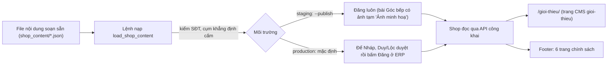

# 03 · Ghi chú dev của mkt-brand (Shop làm lại)



> `mkt-brand` · 11/10/2026 · nhánh `shop/lo-1-khung-chung` · Trạng thái: **CHỜ REVIEW** (techlead + QA). Không commit.

## Lô 1 (1-MKT): SHOP-1-07, SHOP-1-08, SHOP-1-09

### File đổi

| File | Việc |
|---|---|
| `backend/apps/content/management/__init__.py`, `commands/__init__.py` | mới (package lệnh) |
| `backend/apps/content/management/commands/load_shop_content.py` | mới: lệnh nạp (02b §3.7.6) |
| `backend/apps/content/management/content_markup.py` | mới: đổi chữ soạn sẵn (`##`, `-`, `1.`, `>`, `**…**`, `[chữ](href)`, `@item_card MÃ`, bỏ dòng `⟨ghi chú⟩`) sang khối JSON (cms-cho-mkt §9) |
| `backend/apps/content/management/shop_content/{categories,pages,posts}.json` | mới: nội dung bản đầu (3 chuyên mục, 10 trang, 5 bài) |
| `backend/apps/content/tests/test_load_shop_content.py` | mới: 17 test (AC1–AC8 của 1-07, AC1 của 1-08 qua API công khai, AC2 của 1-09 phần dữ liệu) |
| `frontend/app/gioi-thieu/{page.tsx,AboutScreen.tsx,AboutScreen.module.css}` | mới: `/gioi-thieu/` đọc trang CMS `gioi-thieu` (1-08) + metadata (1-09) |
| `frontend/app/not-found.tsx`, `not-found.module.css` | viết lại theo X1/DesktopNotFound404 + `noindex` (1-09 AC1) |
| `frontend/features/site/types.ts`, `mock.ts` | thêm khoá tuỳ chọn §3.6 (`seller.zalo`, `working_hours`, `registration_issued_by/on`, `website_notice_url/image`, `policies{…}`); mock footer-links đổi sang 6 slug mới |
| `frontend/e2e/ra_soat_cms14_landing.py` | trỏ sang `/gioi-thieu/` + ca API lỗi + ca 404 (1-08 AC4) |

Không đụng: `config/*`, migration, `lib/*`, `components/*`, `features/content/components/*`, `app/page.tsx`.

### Lệnh nạp: cách chạy

```bash
# staging: đăng luôn toàn bộ (decisions 2026-10-10)
manage.py load_shop_content --author <tài khoản Chủ> --publish
# production: chỉ Nháp; bắt buộc xác nhận môi trường
manage.py load_shop_content --author <tài khoản Chủ> --environment production
```
- `--author` phải có `content.publish_entry` (nhóm Chủ/Quản lý). Thiếu → từ chối.
- `SEPAY_ENV=PRODUCTION` mà thiếu `--environment production` → từ chối, exit 1 (AC6). `--publish` cùng production → từ chối.
- Idempotent: khớp theo slug và `page_role`. Mỗi lần lệnh tạo/sửa ghi một dòng AuditLog `content_load` (`entry_id`, `draft_hash`).
  Lần sau: trang có `updated_by` khác tác giả lệnh, hoặc `draft_hash` khác bản lệnh nạp lần trước, hoặc trang có sẵn không do lệnh tạo
  → in `bỏ qua: đã sửa` (trừ `--overwrite`). Nội dung giống hệt → `không đổi`, không tăng `row_version`, không đăng thêm phiên bản.
- Vai trò trang (`page_role`) đã có trang khác giữ → `bỏ qua: vai trò … đã có trang khác giữ` (kể cả `--overwrite`).
- Chặn trước khi lưu (AC4, AC5): số giống SĐT không thuộc `CONTENT_PHONE_ALLOWLIST` ∪ `SHOP_HOTLINE` ∪ `SELLER_PHONE`; cụm trong
  `CONTENT_BLOCKED_CLAIMS` (mặc định: miễn phí giao, hút chân không, cấp đông ngay tại cảng, Cân đúng, tươi sống; so không phân biệt hoa thường,
  **có** phân biệt dấu để "cần dùng" không bị nhận nhầm là "Cân đúng"). Trang lỗi bị bỏ, trang khác vẫn nạp, cuối lệnh exit 1. Không in lại số.
- Biến lấy từ settings lúc nạp: `{hotline}` (`SHOP_HOTLINE`; chưa phải số thật thì giữ `[hotline]`), `{hold_minutes}` (`SALES_ORDER_TTL_MINUTES`),
  `{min_qty_kg}`, `{qty_step_kg}` (`SHOP_MIN_QTY_KG`, `SHOP_QTY_STEP_KG`, in kiểu "0,5"), `{cancel_callback_within}` (`SHOP_CANCEL_CALLBACK_WITHIN`).
- Thẻ hàng `@item_card MÃ` chỉ chèn khi mã có thật, `is_active`, có giá hiệu lực (cms-cho-mkt §9). Đang dùng mã demo `CA-THU`, `MUC-ONG`, `GHE-XANH`, `TOM-SU-1`;
  production mã khác thì tự bỏ thẻ.
- Ảnh bìa tạm chỉ gắn khi `--publish`: PNG 1600×900 màu token `accent-soft`/`surface-3`, tải qua `images.services.upload_content_image`,
  `alt` = "Ảnh minh hoạ: <tiêu đề>". Production không gắn ảnh tạm (Lộc tải ảnh thật rồi đăng).
- Đăng qua `publish_entry(checklist_confirmed=True)`: lệnh là người nạp có chủ đích; cảnh báo SĐT được xác nhận vì đã lọc trước, cảnh báo loại khác (giá vốn, món không bán) → dừng trang đó.

### Nội dung đã nạp (bản đầu)
- 3 chuyên mục: Rã đông, Món hấp, Món chiên.
- 10 trang: `cach-mua-hang`, `lien-he` (bản A, thẻ liên hệ do FE vẽ từ site-info), `gioi-thieu`, `doi-tra` (refund, footer 1), `giao-hang` (footer 2),
  `thanh-toan` (footer 3), `quyen-rieng-tu` (privacy, footer 4), `dieu-khoan` "Điều kiện giao dịch chung" (terms, footer 5), `khieu-nai` (footer 6),
  `thong-tin-nguoi-ban` (seller_info, không ở footer). SHOP-5-02 sẽ gắn `shipping`/`payment`/`complaints` cho 3 trang không vai trò.
- 5 bài: `ra-dong-ca-dung-cach`, `ra-dong-tom`, `muc-ong-hap-chien-hay-xao`, `ca-thu-hap-gung-hanh`, `ca-thu-chien-sa-ot`. **Không** bài cá nục (S-23).
- Câu tạm theo `doc/ops/hoi-loc.md` / decisions 11/10: khu vực **Phan Thiết** (S-08); "Đã gồm giao hàng… không trả thêm khi nhận hàng" (05-phap-ly §2);
  gọi lại trong `SHOP_CANCEL_CALLBACK_WITHIN`, chuyển tiền trong 3 ngày làm việc (S-12, L6–L7); rã đông 8–12 giờ (S-19, L10); phản hồi khiếu nại trong
  2 giờ (S-16); không câu sơ chế/hút chân không/thùng giữ lạnh/"Cân đúng" (S-18). Người giao viết trung tính "Cá Về giao" (S-08 hãng giao chưa chốt).
- Câu pháp lý đã có ở `05-phap-ly.md` thay vào: quyền riêng tư §1.2(c) (có tên SePay, Google Maps, lưu trên trình duyệt), đổi trả mục 4 §3.2,
  giao hàng §2, khiếu nại §5, mã giảm giá §7 (+ decisions 10/10: không cộng dồn, lấy mức lợi hơn; trả lượt khi tự huỷ hết giờ, không trả khi đã thanh toán rồi huỷ).
  Ô `[…]` còn lại giữ nguyên ngoặc (AC7). Bỏ câu "đã lập hồ sơ đánh giá tác động" vì chưa làm (để ô chờ); "nhà cung cấp hạ tầng" đổi "đơn vị cung cấp hạ tầng" (máy quét giá vốn).

### /gioi-thieu/ và 404
- `/gioi-thieu/`: `ShopFrame header="sub" footer="full" bottomNav={false}` (02b §1.4). Gọi song song `fetchPublicEntry("gioi-thieu")` và `getCatalog()`.
  Hero: nhãn + H1 "Từ cảng về bếp nhà bạn" (khẩu hiệu K1, code) + đoạn mở lấy từ CMS + nút "Xem hàng đang có" → `/shop/`, "Cách chúng tôi làm" → `#cach-lam`.
  Mỗi H2 của CMS thành một mục; H3 → thẻ có nhãn; list số → thẻ bước "01/02/03"; `item_card` → `ProductCard variant="row"` (giá thật, không số kg); catalog lỗi thì ẩn thẻ.
  Mục cuối có nút "Mở bảng hàng". Trạng thái: tải (Skeleton) · 404 → EmptyState "Không tìm thấy bài này" + "Về trang chủ" · 410 → "Bài này không còn trên web" · lỗi mạng → ErrorState "Chưa tải được trang" + Thử lại (06-marketing C7).
- 404: dựng theo màn (nhãn "404", H1, câu, 2 nút pill "Về trang chủ" / "Xem hàng đang có"); `title: {absolute}` vì layout có template `%s | Cá Về`; `robots noindex`.
  Không dùng `EmptyState` vì component chỉ có một nút chính và tiêu đề đặt trước `children` (màn cần 2 nút ngang hàng).
- Metadata `/gioi-thieu/`: title "Giới thiệu Cá Về — Từ cảng về bếp nhà bạn" (41 ký tự), description 143 ký tự, trùng `seo_*` của trang CMS.

### Metadata `/` soạn sẵn (sửa `app/page.tsx` khi điều phối báo 1-06 xong)
```ts
export const metadata: Metadata = {
  title: { absolute: "Cá Về — Hải sản cấp đông theo lô, giao tận nhà" },            // 46 ký tự
  description:
    "Mua hải sản cấp đông theo kg, từ 1 kg: cá, tôm, mực, cua ghẹ và combo nấu nhanh. Thanh toán quét mã QR, giao tận nhà ở Phan Thiết.", // 130 ký tự
  openGraph: { title: "Cá Về — Hải sản cấp đông theo lô, giao tận nhà", type: "website", locale: "vi_VN" },
};
```
Nguồn: 06-marketing C8 (thay `[khu vực giao]` = Phan Thiết theo S-08). Bỏ `keywords` cũ ("cảng cá lộc", "đông lạnh tươi ngon").

### Lệch / việc còn chờ
1. **Chờ fe-dev:** `components/ShopFrame.tsx` chưa có → `tsc` báo 2 lỗi ở file của tôi (`app/gioi-thieu/AboutScreen.tsx:9`, `app/not-found.tsx:2`). Props đang dùng theo 02b §1.4.
   Kiểm lại khi fe-dev xong (đã khớp thật với `ProductCard`, `EmptyState`, `ErrorState`, `Skeleton`, `Button`, `TextLink`, `groupIconOf`).
2. **Naming:** `python3 scripts/check_naming.py` báo thư mục route `frontend/app/gioi-thieu/` (URL công khai do Duy chốt 10/10, giống `bai-viet/`, `trang/`).
   Cần techlead thêm `"frontend/app/gioi-thieu/"` vào `EXEMPT_PATH_PREFIXES` của script (tôi không sửa script). Dòng hằng slug trong `AboutScreen.tsx` đã gắn `naming: allow` kèm lý do.
3. **ERP Nhật ký:** action mới `content_load` chưa có nhãn ở `erp-console/features/audit/auditModel.ts` (của fe-dev) → đề xuất nhãn "Nạp nội dung soạn sẵn".
4. **Gợi ý cho fe-dev (không chặn):** `app/layout.tsx` mặc định title/description còn "Vựa hải sản đông lạnh … giá tốt" → nên đổi theo C8 ("hải sản cấp đông").
5. Story 1-08 AC1 ghi header `full`; làm theo 02b §1.4 (`sub` → máy tính `full`). Story 1-09 AC1 ghi "EmptyState"; làm theo màn (xem trên).
6. Tóm tắt trang `doi-tra` (hiện ở dòng "Đổi trả:" trang sản phẩm) viết trung tính, chưa nêu thời hạn: **CHỜ PHÁP LÝ**. Mọi trang chính sách: **CHỜ PHÁP LÝ** trước production (BR-ND-21).

### Kiểm chứng (chạy trong lượt này, 11/10)

```
$ cd backend && .venv/bin/python manage.py test apps.content.tests.test_load_shop_content -v 2
... 17 test đều "ok" (AC1 publish 3/10/5, AC1 footer 6 trang đúng thứ tự, AC2 nháp, AC3 sửa tay bị bỏ qua + --overwrite,
AC3 trang có sẵn không bị đụng, AC4 SĐT lạ chặn đúng trang (14 trang/bài còn lại vẫn nạp), AC4 hotline được phép,
AC5 claim bị chặn + file nguồn sạch, AC6 production, AC8 [hotline], tác giả thiếu quyền, item_card chỉ mã có giá, SEO độ dài,
chạy lại không đổi row_version/phiên bản)
Ran 17 tests in 8.454s
OK

$ cd backend && .venv/bin/python manage.py test apps.content
Ran 164 tests in 12.072s
OK

$ cd backend && .venv/bin/python manage.py makemigrations --check --dry-run
No changes detected
```

Chạy lệnh nạp 2 lần trên DB SQLite tạm (scratchpad, không phải DB dev):
```
=== Lần 1 (--publish)
tạo chuyên mục: ra-dong / mon-hap / mon-chien
tạo mới, đã đăng: cach-mua-hang, lien-he, gioi-thieu, doi-tra, giao-hang, thanh-toan, quyen-rieng-tu, dieu-khoan, khieu-nai,
                  thong-tin-nguoi-ban, ra-dong-ca-dung-cach, ra-dong-tom, muc-ong-hap-chien-hay-xao, ca-thu-hap-gung-hanh, ca-thu-chien-sa-ot
Tổng: tạo 15, cập nhật 0, không đổi 0, bỏ qua 0, đăng 15, lỗi 0.
=== Lần 2 (--publish)
chuyên mục đã có: ra-dong / mon-hap / mon-chien
không đổi: (15 trang/bài như trên)
Tổng: tạo 0, cập nhật 0, không đổi 15, bỏ qua 0, đăng 0, lỗi 0.
exit 0
```

```
$ cd frontend && npx tsc --noEmit   (fe-dev đang sửa song song; chỉ trích lỗi ở file của mkt-brand)
app/gioi-thieu/AboutScreen.tsx(9,23): error TS2307: Cannot find module '@/components/ShopFrame'
app/not-found.tsx(2,23): error TS2307: Cannot find module '@/components/ShopFrame'
(tổng 18 lỗi toàn Shop; các lỗi còn lại ở file fe-dev đang sửa: ArticleBody/ItemCard/…)

$ python3 scripts/check_naming.py
exit 1 — file của mkt-brand chỉ còn tên thư mục route frontend/app/gioi-thieu/ (xem mục Lệch 2)
```
Sửa sau review điều phối (11/10): `test_standard_names` đỏ vì chữ "Production" (câu lỗi `--publish`, đổi thành "Môi trường thật chỉ nạp Nháp…")
và chuỗi "TTL" (tên setting trong `getattr`, đổi sang đọc thẳng `settings.SALES_ORDER_TTL_MINUTES`). Chạy lại:
```
$ cd backend && .venv/bin/python manage.py test apps.content apps.common
Ran 449 tests in 22.043s
OK
```

Sau khi fe-dev xong SHOP-1-06 (11/10): đã sửa **chỉ khối metadata** của `frontend/app/page.tsx` theo bản soạn ở trên
(title 46 ký tự, description 130 ký tự, có "Phan Thiết", thêm openGraph; phần thân `<HomeScreen/>` của fe-dev giữ nguyên).
`components/ShopFrame.tsx` đã có nên 2 lỗi tsc ở `/gioi-thieu/` và 404 hết:
```
$ cd frontend && npx tsc --noEmit
(không có lỗi, 0 dòng "error TS")
```

Chưa chạy: `npm run build`, `check-no-mock` (điều phối dặn không build khi fe-dev đang build), e2e `ra_soat_cms14_landing.py` (cần build + backend).

### Sửa theo review lô 1 (`03b-review-lo1.md`): H1, L5, L6

- **H1** (ERP "Chèn thẻ mặt hàng" vỡ vì API danh mục nay trả `{groups, items}`):
  - mới `erp-console/features/content/shopCatalog.ts`: kiểu `ShopCatalogItem`/`ShopCatalogResponse` theo 02b Shop §3.1 (giá là chuỗi, `stock_level`, không `sellable_qty`)
    + `itemsFromShopCatalog(data)` đọc `.items`; sai hình dạng (kể cả mảng cũ) thì ném lỗi để hộp chọn hiện "Chưa tải được danh sách mặt hàng", không vỡ màn.
  - `api.ts::fetchShopCatalog` gọi hàm trên; nhánh mock dùng `mockFetchShopCatalog()` (bỏ mảng chép tay trong `api.ts`).
  - `mock.ts::mockFetchShopCatalog` trả `{groups, items}` đúng §3.1.
  - `content.test.ts`: test mock đúng hình dạng (không mảng, giá chuỗi, không `sellable_qty`/giá vốn) + 2 test `itemsFromShopCatalog` (đọc `.items`; mảng cũ/thiếu `items`/`null` → ném lỗi).
    Test cũ chỉ kiểm `Array.isArray`, nên lỗi lọt qua. Test mới đỏ với mock/hàm cũ.
  - `EditorDialogs.tsx` không phải sửa: vẫn nhận `ShopCatalogItem[]` từ `fetchShopCatalog`.
- **L5:** `body/scan.py` đổi `_normalize_phone_digits`, `_get_phone_allowlist` thành hàm công khai `normalize_phone_digits`, `get_phone_allowlist`
  (chỉ đổi tên, không đổi hành vi). Lệnh nạp import tên công khai.
- **L6:** trước khi tải ảnh tạm, lệnh kiểm bài đủ điều kiện đăng (thiếu trường trừ ảnh bìa, cảnh báo khác SĐT) qua `_assert_publishable`.
  Nếu đăng vẫn lỗi sau khi đã tải: DB rollback, kho `local` thì xoá thư mục `content/<id>/<image_id>`. Kho `gcs` không cho xoá (BR-DM-14) nên lệnh chỉ ghi thêm vào câu lỗi.
  Test mới `test_publish_failure_rolls_back_and_removes_placeholder_files`: đỏ khi bỏ bước xoá (đã thử), xanh khi có.

Kiểm chứng (11/10):
```
$ cd erp-console && ./node_modules/.bin/tsc --noEmit        -> exit 0
$ npm test                                                   -> Test Files 112 passed (112) · Tests 1332 passed (1332)
$ NEXT_PUBLIC_USE_MOCK=0 npm run build                       -> ✓ Compiled successfully · exit 0
$ cd backend && .venv/bin/python manage.py test apps.content apps.common
Ran 450 tests in 21.497s
OK
```
Không build `frontend/` (QA đang chạy ở đó).

### Sửa theo QA lô 1 (`04-qa-report-lo1.md`): B1, L1, L2 (phần /trang/)

- **B1 (chữ "Phí giao"):** trong `shop_content/pages.json`, câu FAQ trang `cach-mua-hang` đổi thành "Giao hàng có tốn thêm tiền không?", trả lời "Không. Giá đã gồm giao hàng trong khu vực Phan Thiết.
  Bạn trả một lần khi quét mã QR, không trả thêm khi nhận hàng." Trang `giao-hang`: mục 3 đổi thành "Giá đã gồm giao hàng", bỏ cụm "chi phí giao hàng"/"thu phí giao"
  (câu thay: "Nếu sau này Cá Về tính thêm tiền giao hàng, khoản này sẽ hiện rõ trong tổng tiền…"); SEO description cũng sửa. Đã cập nhật `06-marketing.md` C2.1 và dòng M3.
  - Lệnh nạp thêm "Phí giao" vào `DEFAULT_BLOCKED_CLAIMS` (so không phân biệt hoa thường).
  - Test mới: `test_qa_b1_loaded_content_has_no_banned_words` quét toàn bộ dữ liệu đã nạp (tiêu đề, tóm tắt, SEO, thân bài): không có "phí giao", "miễn phí giao", "cân đúng";
    "hoàn tiền" chỉ được có trong tên "Chính sách đổi trả và hoàn tiền". `test_qa_b1_page_with_delivery_fee_line_is_rejected`: trang có "Phí giao" bị từ chối. Test quét file nguồn cũng thêm "phí giao".
  - `grep -i "phí giao\|cân đúng" shop_content/*.json` ra 0 dòng; "hoàn tiền" chỉ nằm trong tên trang chính sách.
- **L1 (404 lệch màn):** `app/not-found.tsx` đổi sang `ShopFrame header="sticky" bottomNav tone="muted"` theo `X1-NotFound404` (logo, tìm, giỏ, BottomNav, nền xám nhạt).
  **Lệch 02b §1.4:** bảng này ghi 404 dùng `sub` và không có BottomNav. Làm theo màn thiết kế theo yêu cầu điều phối; techlead sửa bảng 02b.
- **L2 (/trang/ lặp "| Cá Về"):** `app/trang/page.tsx` không thêm hậu tố khi `seo_title` đã có "Cá Về". Ghi chú: `app/bai-viet/page.tsx:59` cũng ghép `| Cá Về` như vậy,
  trong khi SEO bài viết đã có "| Cá Về", nên sẽ lặp tương tự. Chưa sửa vì ngoài phạm vi được giao; đề xuất sửa ở lô 5b. Title `/shop/item/`, `/shop/checkout/` thuộc fe-dev.

Kiểm chứng (11/10):
```
$ cd backend && .venv/bin/python manage.py test apps.content
Ran 167 tests in 12.603s
OK
$ cd frontend && npx tsc --noEmit        -> exit 0 (không build, điều phối build)
```

## Lô 2 — SHOP-2-00 (đổi URL Shop sang tiếng Anh, decisions 11/10)

**Đã làm (vùng mkt-brand)**
- `git mv`: `frontend/app/gioi-thieu` → `app/about`, `app/trang` → `app/pages` (`trang.module.css` → `pages.module.css`), `app/bai-viet` → `app/blog` (`bai-viet.module.css` → `blog.module.css`).
- E2E: `ra_soat_cms06_item_card.py` → `content_item_card.py`, `ra_soat_cms13_public.py` → `content_public_pages.py`, `ra_soat_cms14_landing.py` → `about_page.py`; URL bên trong đổi sang `/blog/`, `/about/`.
- Link trong code: `frontend/app/{about,blog,pages}`, `features/content/{mock.ts, components/LatestPosts.tsx, components/ArticleBody.tsx (comment)}`.
- BE: `public_path` trong `entries/serializers.py` và `entries/services.py` → `/blog/?slug=` / `/pages/?slug=`; link nội bộ trong `shop_content/pages.json` (`/pages/?slug=…`, `/blog/?slug=…`); test `test_pages_policy`, `test_sanitize`; slug test `bai-viet-NN` → `post-NN`.
- ERP: `features/content/mock.ts`, `content.test.ts`, `editor/safeHref.test.ts` → `/blog?slug=`, `/pages?slug=`.
- **Ngoài 3 URL đã chốt:** tham số lọc `/blog?chuyen-muc=` → `/blog?category=` (trang đã đọc sẵn `category`; bỏ đọc `chuyen-muc`). Lý do: thư mục cũ được `check_naming.py` miễn, sang `app/blog/` thì `chuyen-muc` bị chặn (exit 1). Không nơi nào khác trong repo phát link `?chuyen-muc=`. 02b §(dòng 190) còn ghi `chuyen-muc` — techlead cập nhật.
- Giữ nguyên (dữ liệu): slug CMS `gioi-thieu` (`PAGE_SLUG`, `pages.json`, `test_load_shop_content`), các slug `cach-mua-hang`, `doi-tra`…

**Việc cho điều phối viên**
- `scripts/check_naming.py` `EXEMPT_PATH_PREFIXES` còn 3 dòng trỏ thư mục cũ (`frontend/app/bai-viet/`, `trang/`, `gioi-thieu/`) — vô hại, nên xoá; chưa đụng vì là script dùng chung. Bảng "Giữ nguyên" trong các skill (`/bai-viet/` `/trang/` `?chuyen-muc=`) đã lỗi thời.
- DB staging đã nạp `pages.json` cũ còn link `/trang/?slug=`: chạy lại lệnh nạp nội dung (hoặc sửa tay ở màn Nội dung) sau khi gộp.
- Đã xoá `frontend/.next/types/app/{bai-viet,gioi-thieu,trang}` (file sinh cũ làm `tsc` báo thiếu module).

**Kiểm chứng (11/10)**
```
grep -rn "gioi-thieu\|/trang/\|bai-viet" backend/apps/content erp-console/features/content frontend/app frontend/features/content frontend/features/site
  -> chỉ còn slug dữ liệu `gioi-thieu` (pages.json, test_load_shop_content, AboutScreen PAGE_SLUG + comment); 0 URL cũ
backend: manage.py test apps.content -> Ran 167 tests in 11.571s  OK
erp-console: tsc --noEmit OK; vitest run features/content -> Test Files 5 passed (5), Tests 92 passed (92)
frontend: npx tsc --noEmit OK (không build theo phân công)
python3 scripts/check_naming.py -> OK - 6444 vi phạm cũ trong 179 file, không phát sinh mới.
```

## Lô 5a (5a-MKT): SHOP-5-01, SHOP-5-02

> `mkt-brand` · 11/10/2026 · nhánh `shop/lo-2-catalog-cart` · Trạng thái: **CHỜ REVIEW** (techlead + QA). Không commit.

### File đổi

| File | Việc |
|---|---|
| `backend/apps/content/site/services.py` | 5-01: `seller` thêm `zalo`, `working_hours`, `registration_issued_by`, `registration_issued_on`, `website_notice_url`, `website_notice_image` (trống → `null`; link/ảnh chỉ nhận `http(s)`, chặn `javascript:`/`data:`); khối `policies` {`return_report_hours` (số nguyên dương, sai/rỗng → `null`), `min_qty_kg`, `qty_step_kg` (chuỗi gọn "1", "0.5"), `hold_minutes`}. `seller_complete` giữ nghĩa 7 trường cũ. Không `search_chips`. |
| `backend/apps/content/body/scan.py` | 5-01 AC5: `get_phone_allowlist()` tự gồm `SHOP_HOTLINE`, `SELLER_PHONE` (≥ 8 chữ số; "1900 xxxx" giữ chỗ bị bỏ qua) |
| `backend/apps/content/models/entries.py`, `migrations/0004_alter_entry_page_role.py` | 5-02: choices `shipping` "Chính sách giao hàng", `payment` "Chính sách thanh toán", `complaints` "Cơ chế giải quyết khiếu nại" (chỉ đổi choices, không đổi cột) |
| `backend/apps/content/entries/services.py` | `GOLIVE_PAGE_ROLES` thêm 3 vai trò → khoá gỡ khi đang đăng, không bỏ/đổi vai trò khi đang đăng, có phiên bản, hiện ở golive-status |
| `backend/apps/content/management/shop_content/pages.json` | gắn `page_role` cho `giao-hang` (shipping), `thanh-toan` (payment), `khieu-nai` (complaints) |
| `backend/apps/content/management/commands/load_shop_content.py` | dùng `get_phone_allowlist()` (đã gồm hotline). Trang đã nạp trước **và đã bị sửa tay** mà chưa có vai trò → chỉ gắn vai trò, giữ nguyên nội dung, in `bỏ qua: đã sửa; gắn vai trò <role>, nội dung giữ nguyên` (không ghi AuditLog `content_load` để lần sau vẫn nhận "đã sửa"). Trang chưa sửa → đi đường cập nhật cũ (cờ khác → `save_draft`, nội dung trùng nên không đăng thêm phiên bản). Vai trò đã có trang khác giữ → bỏ qua, không chuyển. |
| Test mới | `site/tests/test_site_info_shop.py` (10 test: AC1–AC5, null, http-only, số kg gọn, không dữ liệu khách), `tests/test_required_page_roles.py` (7 test: choices, unique, AC2 gỡ bị chặn 400 BR-ND-16, bỏ vai trò bị chặn, AC3 2 phiên bản, AC4 NV kho 403, golive-status), `test_load_shop_content.py` lớp `LoadShopContentPageRoleTests` (4 test: nạp mới, chạy lại gắn vai trò idempotent, trang đã sửa chỉ gắn vai trò, vai trò bị trang khác giữ) |
| Test sửa theo contract mới | `site/tests/test_site_info.py` (tập khoá), `tests/test_pages_policy.py` (missing_roles 7 vai trò), `test_load_shop_content.py` AC1 (7 vai trò) |
| `backend/apps/common/tests/test_standard_names.py` | **ngoài vùng mkt-brand, sửa 1 assert**: `test_bt2_page_role_values_are_frozen` khoá 4 giá trị cũ; nay thêm 3 giá trị mới ở cuối (4 giá trị cũ giữ nguyên). Nhờ techlead duyệt. |
| `erp-console/features/content/pageRoles.ts` (mới) + `pageRoles.test.ts` | nhãn 7 vai trò, `REQUIRED_PAGE_ROLES`, `PAGE_ROLE_OPTIONS`, `pageRoleLabel()`; 4 nhãn cũ lấy từ `ENUMS.entryPageRole` |
| `erp-console/features/content/{types.ts, mock.ts, components/EntrySettings.tsx, components/ContentListScreen.tsx, content.test.ts}` | `ContentPageRole` thêm 3 giá trị; ô chọn vai trò và dải "Thiếu trang bắt buộc" dùng `pageRoles.ts`; mock golive-status theo 7 vai trò |

`frontend/features/site/{types,mock}.ts`: không phải sửa — khoá tuỳ chọn §3.6 đã thêm ở lô 1, khớp đúng JSON BE trả nay.
Biến cấu hình: đủ trong `config/settings.py` (be-dev khai ở lô 1: `SELLER_ZALO`, `SELLER_WORKING_HOURS`, `SELLER_REG_ISSUED_BY/ON`, `SELLER_WEBSITE_NOTICE_URL/IMAGE`, `SHOP_RETURN_REPORT_HOURS`, `SHOP_MIN_QTY_KG`, `SHOP_QTY_STEP_KG`, `SALES_ORDER_TTL_MINUTES`). Không thiếu biến nào.

### Đề xuất / việc cho người khác
1. **fe-dev:** chuyển 3 nhãn mới vào `erp-console/shared/lib/enums.ts` (`entryPageRole`) + `enums.standardNames.test.ts`, rồi `pageRoles.ts` đọc hết từ ENUMS. Cập nhật `doc/thuat-ngu-va-trang-thai.md` (3 nhãn mới).
2. **Staging:** sau khi gộp, chạy `migrate` rồi `load_shop_content --author <Chủ> --publish` để gắn vai trò cho 3 trang đã nạp ở lô 1.
3. Link/ảnh thông báo website (`SELLER_WEBSITE_NOTICE_*`) để trống tới khi có S-14.
4. Cụm khẳng định cấm trong `scan.py` (02b §3.7.5, cảnh báo ở màn ERP) **chưa làm** ở lô này (không thuộc AC 5-01/5-02; lệnh nạp đã chặn). Đề xuất gộp vào 5c.

### Kiểm chứng (11/10, chạy trong lượt này)
```
$ cd backend && .venv/bin/python manage.py test apps.content.site apps.content.tests.test_required_page_roles apps.content.tests.test_load_shop_content
(trước khi code: Ran 47 tests — FAILED (failures=8, errors=15) — RED đúng lý do: thiếu khoá policies/zalo, vai trò mới bị từ chối)
Ran 47 tests in 11.916s
OK

$ cd backend && .venv/bin/python manage.py test apps.content apps.common
FAIL: test_every_note_or_reason_field_is_scrubbed_or_allowlisted (apps.common.tests.test_auditlog_note_no_free_text…)
  AssertionError: ['catalog.Item.short_note'] != []   <- field mới của be-dev lô 2b (catalog/0008), không thuộc lô 5a
Ran 474 tests in 23.578s
FAILED (failures=1)

$ cd backend && .venv/bin/python manage.py test apps.delivery.tests.test_confirmation_env_commands apps.delivery.tests.test_confirmation_escalation apps.accounts.data_scopes apps.sales.orders.tests.test_privacy_consent
Ran 315 tests in 32.237s
OK (skipped=1)

$ cd backend && .venv/bin/python manage.py makemigrations --check --dry-run
No changes detected

$ cd erp-console && ./node_modules/.bin/tsc --noEmit   -> exit 0
$ npx vitest run features/content                       -> Test Files 6 passed (6) · Tests 96 passed (96)
  (pageRoles.test.ts đỏ trước khi có pageRoles.ts)

$ cd frontend && npx tsc --noEmit   -> exit 2; mọi lỗi do lô 2 của fe-dev đang làm (ProductCardItem thêm minQty/qtyStep,
  CartContext.updateQty): AddToCartControl.tsx, CheckoutScreen.tsx, ui-preview/previewFixtures.ts, và app/about/AboutScreen.tsx(53)
  (dựng ProductCardItem thiếu minQty, qtyStep — file của mkt-brand nhưng ngoài danh sách lô 5a; sửa khi fe-dev chốt kiểu, hoặc fe-dev sửa cùng lượt).
  Không lỗi nào ở features/site.

$ python3 scripts/check_naming.py -> exit 1, chỉ frontend/components/search/SearchSuggest.tsx:85 (file fe-dev lô 2); file lô 5a sạch.
```
Không build frontend (fe-dev đang build).

## Sửa theo QA lô 2 (`04-qa-report-lo2.md`) + G7

- **G7 (mã màu rời):** `features/content/components/LatestPosts.tsx:40` `#f8fafc` → `var(--surface-2)`; đổi nốt hex trong `LatestPosts.module.css`,
  `ArticleBody.module.css`, `ItemCard.module.css` sang token `globals.css` (surface/surface-2/surface-3, border/border-strong, ink/ink-2/ink-3,
  accent/accent-text/accent-hover/on-accent, warn/warn-soft). Quét `features/{content,site}`, `app/{about,pages,blog}`: 0 hex.
- **L3 (title sai + 2 thẻ robots):**
  - mới `features/content/pageMeta.ts`: `setPageMeta({title, noindex})` đặt tiêu đề tab và giữ **đúng một** `<meta name="robots" content="noindex">` (gỡ thẻ thừa;
    trang có nội dung thì gỡ thẻ do module thêm); `withBrand()` ghép "| Cá Về" không lặp.
  - `app/pages/page.tsx`, `app/blog/page.tsx`: 404 → "Không tìm thấy trang | Cá Về", 410 → "Trang này không còn trên web | Cá Về", lỗi khác →
    "Chưa tải được trang | Cá Về", cả ba kèm noindex. `/blog/?slug=` hết lặp "| Cá Về" (nợ QA lô 1 ghi cho 5b).
  - `app/not-found.tsx`: bỏ `robots` trong `metadata` vì Next.js tự chèn `noindex` cho trang 404 → còn một thẻ.

Kiểm chứng (11/10): `cd frontend && npx tsc --noEmit` → exit 0 · `python3 scripts/check_naming.py` → OK. Không build (theo phân công).
