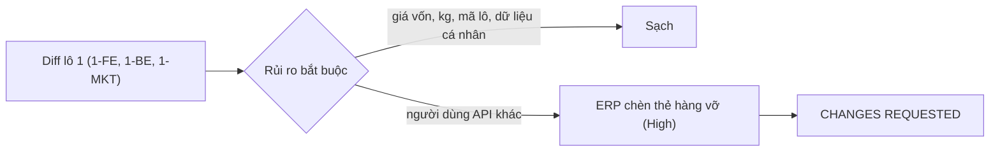

# 03b · Review code lô 1 Shop (techlead)

> techlead · 11/10/2026 · nhánh `shop/lo-1-khung-chung` (chưa commit), so với `shop/lo-0-quyet-dinh`.
> Phạm vi: `backend/`, `frontend/`, `scripts/`, `DESIGN.md` + file chưa track (bỏ `.claude/worktrees`).

## Kết luận: **APPROVED** (review lại 11/10, xem mục cuối). Lượt đầu: CHANGES REQUESTED

Lô 1 không rò giá vốn, số kg tồn, mã lô hay dữ liệu cá nhân. Migration slug đúng 3 bước, chạy lại an toàn và có chiều ngược.
Phong bì lỗi tạo đơn đúng 02b §3.3. Lệnh `load_shop_content` đạt yêu cầu. Popup qua được kiểm tra a11y.
Còn **1 lỗi High** do đổi contract danh mục: 02b không liệt kê một chỗ đang đọc API này, và đó là sót của techlead.
Có thêm **2 lỗi Medium**. Sửa xong ba lỗi này thì chỉ cần review lại phần đã sửa.

## Lỗi

### High
| # | File:dòng | Lỗi | Cách sửa | Ai |
|---|---|---|---|---|
| H1 | `erp-console/features/content/api.ts:224-243`, `erp-console/features/content/editor/EditorDialogs.tsx:96` | ERP gọi `GET /api/shop/catalog/` để chọn thẻ hàng trong trình soạn CMS ("Chèn thẻ mặt hàng") và vẫn coi kết quả là mảng. API nay trả `{groups, items}`, nên ở chế độ thật `(items ?? []).filter` ném `TypeError` và hộp chọn bị vỡ. Mock ERP vẫn trả mảng nên tsc, test và build đều không bắt được lỗi này. | Cho `fetchShopCatalog` đọc `.items`, đổi kiểu `ShopCatalogItem` (bỏ `sellable_qty`, `price` thành chuỗi) và cho mock trả `{groups: [], items: [...]}` đúng §3.1. Thêm test hoặc ca kiểm cho hình dạng mới. Lô kiểm thêm lệnh ERP: `npm ci && tsc && npm test && build`. | mkt-brand (chủ `erp-console/features/content/**`). Ngoại lệ phạm vi lô 1, điều phối ghi vào 02c |

### Medium
| # | File:dòng | Lỗi | Cách sửa | Ai |
|---|---|---|---|---|
| M1 | `backend/apps/catalog/items/services.py:73-79` (gọi từ `sales/orders/services.py:260`) | Khi `qty` rất lớn nhưng vẫn hữu hạn (`"1e30"`, hoặc `"100000000000000000000000000000"`), `qty % step` ném `decimal.InvalidOperation` (DivisionImpossible) và endpoint công khai `POST /api/shop/orders/` trả **500**. Đã tái hiện bằng `validate_line_qty(Item(item_type='SIMPLE'), '1e30')`, kết quả là `InvalidOperation`. | Trong `validate_line_qty`, bắt `InvalidOperation` và trả `False`, để lỗi ra `INVALID_QTY`. Có thể thêm trần hợp lý ở `_parse_lines`, khi đó trả `VALIDATION`. Thêm test `test_huge_quantity_is_400_not_500` cho cả kg lẫn combo, và kiểm số đơn không đổi. | be-dev |
| M2 | `frontend/e2e/ra-soat-a2-golive.py:118-241` | 02b §1.11 giao fe-dev viết lại phần footer của e2e này ngay ở lô 1 (G8). Hiện mới sửa fixture danh mục, còn các ca GL-01-AC2 (7 thông tin người bán) và GL-02 (link chính sách) vẫn bám footer cũ (3 link, chữ "Chính sách bảo mật"). Đây là bộ kiểm tự động duy nhất cho phần pháp lý của footer. | Viết lại theo footer mới: F1 có 6 link theo thứ tự `doi-tra … khieu-nai`, đủ thông tin người bán, lỗi footer-links thì ẩn khối link mà khối người bán vẫn còn. Chạy được trên build mock. | fe-dev |

### Low (sửa trong lô này nếu tiện, nếu không thì ghi nợ ở 02b §12)
| # | File:dòng | Lỗi | Cách sửa | Ai |
|---|---|---|---|---|
| L1 | `backend/apps/catalog/items/README.md:4-5` | README vẫn ghi "`sellable_qty`: tồn khả dụng Shop". | Ghi rõ `sellable_qty` chỉ dùng nội bộ. Shop dùng `stock_level`, `qty_rule`, `validate_line_qty`, contract `{groups, items}` và 404 `ITEM_NOT_FOUND`. | be-dev |
| L2 | `frontend/components/ShopFrame.tsx:45-53,114` | Kiểu `SellerExtras` và phép ép kiểu lặp lại các khoá tuỳ chọn đã khai trong `SellerInfo` (`features/site/types.ts`). | Bỏ `SellerExtras` và đọc thẳng `seller?.zalo` cùng các khoá còn lại. | fe-dev |
| L3 | `frontend/components/ShopFrame.tsx:122` | Đổi nhãn footer bằng regex trên slug/tiêu đề là đoán mò. Lệnh nạp đã đặt tiêu đề trang `dieu-khoan` là "Điều kiện giao dịch chung" nên đoạn này thừa. | Bỏ regex và dùng `l.title`. | fe-dev |
| L4 | `frontend/components/ShopFooter.tsx:262` | `noticeUrl` được đưa thẳng vào `href` mà không qua `isSafeHref`. Nguồn hiện là env do vựa cấu hình, nên rủi ro thấp. | Lọc bằng `isSafeHref` (chỉ cho `https:`). | fe-dev |
| L5 | `backend/apps/content/management/commands/load_shop_content.py:31` | Lệnh import hàm riêng `_get_phone_allowlist` và `_normalize_phone_digits` của `body/scan.py`. | Ở lô 5a, đổi hai hàm này thành hàm công khai trong `scan.py`. | mkt-brand |
| L6 | `load_shop_content.py` `_attach_placeholder_cover` | Ảnh tạm được tải lên kho tệp bên trong `atomic`. Nếu sau đó đăng lỗi thì DB rollback nhưng tệp vẫn nằm lại. Việc này chỉ xảy ra trên staging. | Ghi nợ, không chặn lô. | mkt-brand |
| L7 | `frontend/components/ShopFrame.tsx` `INTRO_TEXT` | Chữ "mua từ 1 kg" đang viết cứng (fe-dev đã tự ghi nợ). | Lô 5 đọc từ `policies.min_qty_kg`. | fe-dev (lô 5) |

## Đã kiểm, đạt
- **Giá vốn / kg / mã lô (G1, G3):** `_item_public` dựng dict tường minh, `stock_level` chỉ có 3 giá trị, 404 dùng một câu chung. `OUT_OF_STOCK.lines` chỉ có `item_code` và `out|short`. Câu lỗi `allocate_fefo`/`reserve` đã bỏ mã lô và số kg. Có test đệ quy tìm khoá cấm và test quét chuỗi JSON thô. Mock FE giữ `mock_stock` ở bên trong, không trả ra ngoài. Không còn chỗ nào trong `app/ components/ features/ lib/` (ngoài mock) đọc `sellable_qty`.
- **Dữ liệu cá nhân:** view tạo đơn không log `request.data`. Có test log và test thân lỗi không nhắc lại dữ liệu khách. Giỏ chỉ lưu mã, tên món, giá và số lượng. Không có `console` hay `sessionStorage` mới. Nội dung CMS và test lệnh nạp không có SĐT thật (đã quét). Mock dùng số `0900000000`.
- **Migration:** `0005` thêm cột null → `0006` RunPython chép hàm slug vào migration (không import code app), chỉ điền dòng trống, tránh slug đã có, chiều ngược đặt null → `0007` thêm unique. Migration cũ không bị đổi. Mọi đường tạo `ItemGroup` (ERP serializer không có `slug`, `get_or_create` trong seed và fixture) đều đi qua `save()` nên tự sinh slug.
- **Phong bì lỗi:** `ShopValidationError` đi qua `BusinessError.extra` và `exception_handler` sẵn có, cho ra `{code, detail, lines|fields}`. Khi thua đua lúc `reserve`, lỗi thành `OUT_OF_STOCK` và cả đơn rollback (`reserve` dùng savepoint nên transaction ngoài vẫn dùng được).
- **load_shop_content:** chạy lại không đổi gì (khớp theo slug và vai trò, hash ghi ở AuditLog `content_load`, `detail` không có dữ liệu cá nhân). Không ghi đè trang người khác đã sửa hoặc trang có sẵn từ trước, trừ khi có `--overwrite`. Vai trò đang do trang khác giữ thì luôn bỏ qua. Production bắt buộc `--environment production` và cấm `--publish`. Lệnh chặn SĐT ngoài allowlist và các cụm khẳng định cấm, không in lại số. Đã quét JSON: không có "miễn phí", "tươi sống", "hút chân không" hay "Cân đúng".
- **Phân quyền:** lô này không có endpoint ERP mới. Endpoint Shop chỉ cho GET (có test 405). Lệnh nạp đòi `content.publish_entry`.
- **A11y popup:** dùng `<dialog>` + `showModal()`, `aria-modal`, `aria-labelledby`. Tab xoay vòng trong hộp, Esc đóng qua `onCancel` (chặn được khi `busy`), tiêu điểm trả về nút đã mở sau khi `close()`. Popover theo mẫu disclosure, Esc trả tiêu điểm về nút neo. Toast có vùng `role="status"` luôn nằm sẵn trong DOM. BottomNav có `aria-current` và nhãn giỏ kèm số món.
- **Token / G7:** tự chạy lại G7 trên file lô chạm, kể cả file chưa track, ra 0. `legacy.css` 0 hex. `git diff DESIGN.md` 0 dòng xoá.
- **Code cũ §1.11:** đã xoá landing, `ItemImageFrame`, `SiteLegalFooter.*`, `CartProvider` ở `shop/layout`, `sellable_qty` khỏi `shop_api` và `lib/*`. Còn thiếu phần e2e footer (M2).

## Quyết định về các mục "Lệch thiết kế"
- **BE:** chấp nhận cả 5 mục. Thứ tự `INVALID_QTY` trước `SHOP_CLOSED`/`POLICY_CHANGED` chỉ tạm ở lô 1. **Lô 3+4-BE phải sắp lại đúng thứ tự §3.3**, kèm đổi mã `BR-BH-17` → `SHOP_CLOSED`. Test đua Postgres là nợ chạy cloud, không chặn lô (decisions 10/10).
- **FE:** chấp nhận cả 10 mục. Ô tìm H1 là form thật vì đích `?focus=search` chưa có. Icon thêm vào union là đúng §1.5. Link "Bỏ qua tới nội dung chính" là điểm cộng.
- **MKT:** chấp nhận cả 6 mục. 404 không dùng `EmptyState` là hợp lý. Header `/gioi-thieu/` theo 02b §1.4.
- **File ngoài phạm vi:** **chấp nhận** việc fe-dev sửa `app/trang/trang.module.css`, `app/bai-viet/bai-viet.module.css` và `app/bai-viet/page.tsx`. Bọc ShopFrame đã nằm trong phạm vi (§7.1). Phần còn lại chỉ đổi hex sang token và `<main>` sang `
` để không lồng `<main>`, không đổi hành vi, và lô 5b sẽ viết lại các file này. Các test BE cũ be-dev sửa theo contract cũng **chấp nhận**: bắt buộc phải sửa thì mới xanh, và `test_p5` vẫn kiểm làm tròn nửa đồng.
- Mock nội dung cũ `features/content/mock.ts` còn chữ "hút chân không" và "tươi sống". Đây là mock không vào bản build, để lô 5b dọn.

## Việc điều phối
1. Giao H1 cho mkt-brand, M1 + L1 cho be-dev, M2 + L2–L4 cho fe-dev. Ghi L5–L7 vào 02b §12.
2. 02b §1.11 / §7.1: techlead nhận đã sót người dùng thứ hai của `/api/shop/catalog/` (ERP CMS). Từ lô sau, mỗi khi đổi contract công khai thì chạy `grep -rn "<đường dẫn API>" backend erp-console frontend` trước khi chốt.
3. Sửa xong thì chạy lại lệnh kiểm chứng §7.0 (FE, BE, **ERP**, naming), rồi techlead review lại phần đã sửa.

## Review lại phần sửa (11/10): **APPROVED**
- **H1 đạt.** `erp-console/features/content/shopCatalog.ts` thêm `itemsFromShopCatalog`: đọc `.items`, gặp sai hình dạng (kể cả dạng mảng cũ) thì ném lỗi để màn hiện "Chưa tải được", không vỡ màn. `api.ts` đổi theo, mock trả `{groups, items}` đúng §3.1 và không có `sellable_qty`. Test nằm ở `content.test.ts`. Điều phối báo ERP chạy được tsc, test (1332) và build.
- **M1 đạt.** `validate_line_qty` có thêm `MAX_LINE_QTY = 1000000` và bắt `InvalidOperation`. Test `test_review_m1_huge_or_odd_numbers_never_500` chạy 9 giá trị lạ trên cả kg lẫn combo, kiểm 400 có `code` và DB không đổi.
- **M2 đạt.** e2e GL-01-AC2/AC5 và GL-02-AC1..AC4 đã viết lại theo footer mới (6 link theo thứ tự CMS, có "Điều kiện giao dịch chung", ẩn nhóm Chính sách khi footer-links lỗi).
- **L1–L6 đạt.** README đã sửa. `SellerExtras` và regex nhãn đã bỏ. `noticeUrl`/`noticeImage` chỉ nhận `https` và phải qua `isSafeHref`. `scan.py` có hàm công khai, không còn chỗ nào dùng tên cũ. Ảnh tạm: kiểm đủ điều kiện đăng trước khi tải ảnh, gặp lỗi thì dọn tệp qua `pending_uploads`. **L7** vẫn là nợ của lô 5.
- Còn chờ: điều phối build lại FE sau QA (§7.0), và nợ chạy test đua Postgres trên cloud (không chặn).
