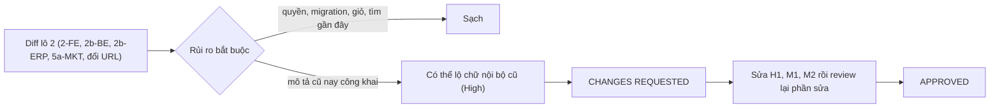

# 03b · Review code lô 2 Shop (techlead)

> techlead · 11/10/2026 · nhánh `shop/lo-2-catalog-cart` (chưa commit), so với `main`.
> Phạm vi: `backend/`, `frontend/`, `erp-console/`, `scripts/` + file chưa track. Bỏ qua `doc/` (trừ đối chiếu) và `.claude/worktrees`.
> Số kiểm chứng do điều phối chạy: BE 2798 OK (skipped=3), không có migration mới; FE build + 5 script; ERP 1340 test.
> Techlead tự chạy thêm: `check_naming.py` OK (6444 cũ, 0 mới), và thử `public_text_error` trên 16 câu mẫu.

## Kết luận: **APPROVED** (review lại 11/10, xem mục cuối). Lượt đầu: CHANGES REQUESTED

Lô 2 không rò giá vốn, số kg tồn, mã lô hay dữ liệu khách qua API mới. Catalog vẫn chỉ trả `stock_level`. Giỏ trong
`localStorage` chỉ giữ `{item_code, name, unit, price, qty}`, và "Tìm gần đây" bỏ chuỗi có từ 9 chữ số trở lên.
Phân quyền đúng 02b §3.10: chỉ `owner` sửa được món và slug nhóm. Test đã phủ 403 cho manager, warehouse_staff,
courier, customer_service và user không có nhóm, cùng 401 khi chưa đăng nhập, và DB không đổi sau các lần bị chặn.
Hai migration chỉ thêm và chạy ngược được: `catalog/0008` gồm 4 `AddField` có `default=""`, `content/0004` chỉ đổi `choices`.
Giỏ làm đúng luật mua: tối thiểu 1 kg, bước 0,5; combo chỉ số nguyên. Giỏ cũ có số lẻ được làm tròn lên mà không xoá món.
Món hết không tính vào tổng và chặn "Tiếp tục". Giá cũ hiện gạch ngang. Lỗi mạng vẫn cho đặt. Checkout cũng tự quay về giỏ khi còn món hết.
Combobox có đủ `aria-activedescendant`, `aria-controls`, Esc và vùng `role=status`. Dialog bỏ món tự đặt tiêu điểm vào "Giữ lại".

Còn **1 High** (mô tả cũ nay hiện công khai) và **2 Medium**. Sửa xong thì chỉ review lại phần đã sửa.

## Lỗi

### High
| # | File:dòng | Lỗi | Cách sửa | Ai |
|---|---|---|---|---|
| H1 | `backend/apps/catalog/items/shop_api.py:36`, `:85` | Shop trả nguyên `Item.description`. Cột này đã có từ Phase 2 với nhãn "Mô tả" nội bộ và chưa từng bị kiểm BR-DM-25, nên bản ghi cũ có thể chứa giá vốn, tên ghe/tàu, SĐT hay ghi chú nội bộ. Dữ liệu này nay lộ cho khách ẩn danh. Tình huống này thuộc bất biến 1 và 9. Kiểm tra lúc lưu không bảo vệ được dữ liệu cũ, cũng không chặn đường Django admin (`catalog/admin.py:21` lưu thẳng model). Dev đã ghi nợ này trong 03-dev-notes-be nhưng chưa có biện pháp chặn trong code. | (1) Trong `shop_api`, với `short_note` và cả 4 trường ở `DETAIL_TEXT_KEYS`, trả `""` khi `public_text_error(value)` khác `None`. Khoá vẫn giữ trong JSON. Đã ghi lại thành contract ở 02b §3.10. (2) Test: lưu qua ORM một `description` = "Giá vốn 180 nghìn, gọi 0900000001" và `short_note` có mã lô, rồi gọi cả list lẫn chi tiết. Kết quả phải là `""` và chuỗi JSON không chứa `180`/`0900000001`. (3) Tuỳ chọn, Low: lệnh `check_public_item_text` chỉ in mã hàng, tên trường và lý do, không in nội dung, để Lộc rà lại trước go-live. | be-dev |

### Medium
| # | File:dòng | Lỗi | Cách sửa | Ai |
|---|---|---|---|---|
| M1 | `erp-console/features/catalog/components/ItemForm.tsx:184`, `ItemDetailScreen.tsx:246-255` | Ô "Mô tả" nằm ngoài khối "Chữ hiển thị trên Shop" và không có dòng nào báo khách sẽ thấy. Lộc vẫn coi đây là ghi chú nội bộ như trước, nên đây chính là con đường tạo ra rủi ro H1 ở dữ liệu mới. | Chuyển ô Mô tả vào khối `sectionShopText` của ItemForm. Ở trang chi tiết, thêm câu gợi ý "Khách thấy ở trang món" cho Mô tả và 4 ô mới, dùng lại `M.shopTextHint`. Màn chi tiết sửa tại chỗ chưa có bộ đếm ký tự còn lại (2b-01 AC4 ghi "ERP đếm ký tự còn lại"). Nếu `InfoField` hỗ trợ thì bật bộ đếm, không thì ghi nợ. | fe-dev |
| M2 | `frontend/lib/text.ts:3` | Comment trỏ tới `scripts/test-catalog-view.mjs` nhưng file này không tồn tại. `looksLikePhone`, `parseRecent`, `foldVietnamese` và `filterAndSort` vì vậy chưa có test máy. Trong đó có 2-04 AC3/AC4 (bất biến 9: không lưu chuỗi giống SĐT) và 2-03 AC2 (món hết luôn ở cuối). e2e `catalog_cart_screens.py` cũng không kiểm phần này. | Thêm `scripts/test-catalog-view.mjs` theo mẫu `test-cart-reconcile.mjs`. Các ca cần có: "muc" khớp "Mực ống"; `0900000001` và `090 000 0001` không lưu; `parseRecent` nhận chuỗi hỏng hoặc chuỗi giống SĐT thì bỏ đi và giữ tối đa 5; sắp xếp tăng hoặc giảm thì món `out` vẫn ở cuối. | fe-dev |

### Low (không chặn, làm khi tiện)
| # | File:dòng | Ghi chú | Ai |
|---|---|---|---|
| L1 | `backend/apps/catalog/admin.py:21` | Django admin lưu 5 trường chữ mà không kiểm BR-DM-25. H1 đã chặn ở đầu ra. Nếu muốn chặn cả lúc nhập thì thêm `ModelForm.clean_<field>` gọi `public_text_error`. | be-dev |
| L2 | `backend/apps/catalog/items/public_text.py:19-22` | Kiểm bằng heuristic nên còn lọt: "Hàng về ngày 10/10 từ tàu BT-12345", hay chữ "giá vốn"/"lãi" khi không kèm số. Có thể thêm cụm `gi[áa]\s*v[ốo]n`, `\bt[àa]u\s`. Cần cân nhắc báo nhầm. Chỉ Chủ sửa được nên chấp nhận ở V1. | be-dev |
| L3 | `frontend/components/search/SearchBox.tsx:75` | Khách gõ SĐT vào ô tìm thì SĐT vẫn đi vào URL `?q=` (bất biến 9: không đưa dữ liệu cá nhân lên URL), dù không được lưu vào "Tìm gần đây". Khi `looksLikePhone(q)` thì nên chuyển tới `/shop/` mà không kèm `q`. | fe-dev |
| L4 | `frontend/features/catalog/useSearchSuggest.ts:63` | "Tìm gần đây" chưa giới hạn độ dài từ khoá. Khách có thể gõ tên hoặc địa chỉ vào đó. Nên cắt, ví dụ tối đa 40 ký tự, hoặc không lưu chuỗi dài. | fe-dev |
| L5 | `erp-console/features/content/pageRoles.ts:14-16` | 3 nhãn vai trò trang bị khai lặp, vì `shared/lib/enums.ts` đã có. Nên đọc cả 7 nhãn từ `ENUMS.entryPageRole`. | mkt-brand |
| L6 | `frontend/components/cart/CartLine.tsx:69` | `aria-label` đặt trên `<li>` có thể khiến trình đọc màn hình bỏ qua nội dung dòng. Nên đổi thành chữ ẩn "đã hết hàng" nằm trong dòng. | fe-dev |

## Lệch thiết kế: quyết định
| Nguồn | Lệch | Quyết định |
|---|---|---|
| 03-dev-notes-be (1) | Thêm kiểm cụm nhà cung cấp, tên tàu, ngày nhập, nhập lô | **Chấp nhận** vì đúng BR-DM-25. Đã ghi vào 02b §3.10 |
| 03-dev-notes-be (2) | Regex mã lô không phân biệt hoa thường | **Chấp nhận** vì chặt hơn thiết kế |
| 03-dev-notes-fe 1–5 | Dòng giỏ dùng `<ul>`+grid; `SuggestItem.image`; scrim thay `inert`; chưa có ô mã giảm giá (lô 3b); chưa có khối Đổi trả/Giao hàng (lô 5); chưa chạy axe | **Chấp nhận**. QA kiểm tay focus và nền mờ của popup tìm |
| 03-dev-notes-fe (nợ lô 1) | Thẻ hết hàng khi không có hotline dẫn tới `/pages/?slug=lien-he` thay vì ẩn nút | **Chấp nhận** vì khách luôn có đường liên hệ. Đã sửa 02b §6 |
| 03-dev-notes-mkt | `?chuyen-muc=` đổi thành `?category=` | **Chấp nhận**, khớp decisions 11/10 và skill |
| 03-dev-notes-mkt (4) | Cảnh báo cụm khẳng định cấm trong `scan.py` (02b §3.7.5) chưa làm | **Chấp nhận dời** sang 5c. Lệnh nạp đã chặn các cụm này. Điều phối ghi vào 02c |
| fe-dev sửa `frontend/app/about/AboutScreen.tsx` (file mkt-brand) | Bỏ bản `toCardItem` riêng, dùng `features/catalog/cardItem.ts` | **Chấp nhận** vì bỏ được code lặp và có lệnh điều phối |
| Test ngoài vùng | `test_standard_names` mở danh sách 4 vai trò lên 7 (4 cũ giữ thứ tự, chỉ thêm ở cuối); allowlist `short_note` trong `test_auditlog_note_no_free_text` | **Hợp lý**. Giá trị đã chạy không đổi. `short_note` là chữ công khai, đã kiểm BR-DM-25, và audit chỉ ghi tên trường |
| `scripts/check_naming.py` | Gỡ miễn trừ 3 thư mục route cũ | **Đúng** vì các thư mục này không còn |

## Đã soát, không có lỗi
- `ItemViewSet.perform_update` chỉ ghi tên trường đã đổi. `update_itemgroup` ghi slug cũ và slug mới, không chép chữ tự do. Có test cho ca không ghi audit khi không đổi gì hoặc khi bị từ chối.
- `ItemGroupSerializer.slug`: tạo nhóm mà bỏ trống slug thì tự sinh. Khi sửa thì không cho để trống, kiểm định dạng và kiểm trùng (trừ chính nhóm đó).
- `site_info` mở rộng: dict liệt kê field tường minh. Link và ảnh chỉ nhận `http(s)`. Không có dữ liệu khách. `seller_complete` giữ nghĩa 7 trường.
- `GOLIVE_PAGE_ROLES` thêm 3 vai trò, chỉ ảnh hưởng `golive-status` và khoá gỡ trang. Không chặn đặt hàng.
- Lệnh nạp gắn vai trò cho trang đã sửa tay mà không ghi đè nội dung. Có test cho ca chạy lại idempotent và ca vai trò đã thuộc trang khác.
- FE: không còn `CatalogGrid`, `AddToCartControl`, `ContactButton`. `CheckoutScreen` chỉ còn tóm tắt chỉ đọc. Không có `dangerouslySetInnerHTML` hay `console.*` mới. Màn mới không còn mã màu hex.
- ERP: nút "Sửa" nhóm và ô sửa tại chỗ chỉ hiện khi có `change_itemgroup`/`change_item`. Lỗi 400 hiện dưới đúng ô.

## Review lại (11/10): **APPROVED**
| # | Đã sửa | Kiểm của techlead |
|---|---|---|
| H1 | `shop_api.py` `_safe_text` chạy lại `public_text_error` khi đọc cho 5 ô (list và chi tiết), vi phạm thì trả `""`, khoá vẫn giữ. Test `PublicReadTimeFilterTests` | Đọc diff. Tự chạy `manage.py test apps.catalog.items`: OK |
| M1 | ERP: Mô tả vào khối "Chữ hiển thị trên Shop" (`ItemForm.tsx:186-196`). Trang chi tiết có khối riêng kèm câu gợi ý. `InfoField` thêm prop tuỳ chọn `maxLength`, có thì đổi sang textarea có bộ đếm | Chấp nhận sửa `shared/ui/detail/InfoField.tsx` ngoài phạm vi: prop tuỳ chọn, không truyền thì giữ hành vi cũ ở 19 nơi dùng |
| M2 | `scripts/test-catalog-view.mjs` + tách `features/catalog/recentSearches.ts` | Tự chạy: 21/21 đạt |
| L1 | `ItemAdminForm` kiểm 5 ô như API. `fields="__all__"` ở ModelForm admin, không phải serializer: chấp nhận | Có test `test_l1_admin_form_rejects_bad_text` |
| L2 | Bắt số hiệu tàu `XX-12345`, cụm "giá vốn" | Tự thử: chặn "BT 98765", "giá vốn rẻ"; vẫn cho qua "Size 20-25 con/kg", "ISO 22000", "Mực size M 2000 con/thùng" |
| L3, L4 | Chuỗi giống SĐT không lên `?q=` và không vào "Tìm gần đây"; tối đa 5 mục, mỗi mục ≤ 40 ký tự | Đọc `SearchBox.tsx:72-81`, `recentSearches.ts` |
| L5, L6 | `pageRoles.ts` đọc cả 7 nhãn từ ENUMS; `CartLine` bỏ `aria-label` trên `<li>` | Đọc file |

Ghi chú cho QA (không chặn): khi khách gõ chuỗi giống SĐT rồi nhấn Enter, ô tìm chỉ đóng gợi ý và không báo gì. Có thể thêm một câu nhắc ở lô sau.
Điều phối vẫn phải tự chạy lại toàn bộ kiểm chứng (BE, FE, ERP, `check_naming`) trước khi giao QA.
