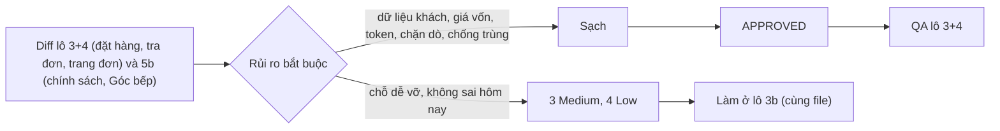

# 03b · Review code lô 3+4 Shop + 5b (techlead)

> techlead · 11/10/2026 · nhánh `shop/lo-34-checkout-orders` (chưa commit), so với `main`.
> Phạm vi: `backend/`, `frontend/`, `erp-console/`, `scripts/` + file chưa track + staged. Bỏ qua `doc/`, `.claude/worktrees`.
> Số kiểm chứng điều phối đã chạy: BE 10 app Ran 3790 OK (skipped=10), `makemigrations` sạch; FE ci/tsc/build `USE_MOCK=0`/check-no-mock/7 script 254 ca; ERP tsc + 1342.
> Techlead tự chạy thêm: `manage.py test apps.sales.orders apps.sales.payments` → Ran 646 OK (skipped=3); `node scripts/test-order-state.mjs` 78/78; `check_naming.py` OK (0 mới).

## Kết luận: **APPROVED**

Không có lỗi Critical hay High.

**Bất biến 9 (dữ liệu khách) sạch.**
- Tạo đơn, tra đơn và `cancel_notice` đều dựng dict tường minh (`shop_payload.py`, `shop_api.py::_lookup_payload`). Không có tên, SĐT, địa chỉ, `cancel_note` hay `Refund.reason`.
- Test quét đệ quy khoá và chuỗi, có cả dạng `+84…`/`9xxxxxxxx`.
- Log chỉ ghi mã đơn và `mask_phone` (`shop_api.py:205`). Không log `request.data`.
- Token ký bằng `django.core.signing` với salt riêng. Payload chỉ có `{"o": mã đơn}` và mốc giờ, hạn đọc từ settings, không lưu DB.
- FE chỉ giữ token và `client_request_id` trong `sessionStorage`, URL chỉ có `code`/`result`. Khoá cũ 4 số cuối được xoá khi mở trang đơn. Form tra đơn bỏ SĐT ngay khi tra xong. Không có `console`.

**Chặn dò đơn đúng §3.4/§3.11.**
- Mọi ca sai (mã sai, SĐT sai, token của đơn khác, token hỏng) đều trả cùng 404 và cùng một câu. Luôn chạy một truy vấn rồi so bằng `hmac.compare_digest`.
- Throttle tra theo SĐT: 20/phút/IP, và 10/giờ theo mã đơn đọc từ body (băm sha256).
- Thêm khoá `token` rác không lách được, vì khi có `token` thì SĐT bị bỏ qua.
- FE F2 chỉ hiện một câu chung, không gắn `aria-invalid`.

**Chống trùng đúng §3.3.**
- `client_request_id` là UUID unique, null được. Migration `sales/0020` chỉ có `AddField`, chạy ngược được.
- `place_order` kiểm đơn cũ trước, bắt `IntegrityError` ngoài `atomic` rồi đọc lại. `ATOMIC_REQUESTS` không bật nên đọc lại được.
- Bản ghi đơn được chèn trước mọi bước giữ chỗ, nên request thua đua không giữ chỗ.
- Test Postgres có viết nhưng bị skip ở SQLite (xem M2).

**Các điểm khác đạt.**
- Tra đơn không đổi trạng thái đơn (`shop_state.py` chỉ đọc, có test).
- `state` khớp bảng §3.4.2. `cancel_notice` khớp §3.4.3, gồm bảng nhãn cố định, mã lạ trả `OTHER` và không có khoá `refund*`.
- §3.5 trả đúng `ORDER_NOT_FOUND`/`CHECKOUT_UNAVAILABLE`.
- Không rò giá vốn: `lines.amount` là thành tiền gộp và `discount = subtotal − total`.
- Shop không có chữ "hoàn tiền" hay tên cổng thanh toán. Chỉ hiện "Chuyển khoản ngân hàng (quét mã QR)" và "Đã gồm giao hàng…".
- Ô đồng ý không tick sẵn (`CheckoutScreen.tsx:93`). Gửi đơn chặn bấm đúp bằng ref và nút ở trạng thái loading.
- Maps chỉ nạp khi bấm: không có key thì mở thẳng C5, 0 script. Dòng báo Google hiện trước khi nạp. Không lưu toạ độ, không dùng Geolocation.
- Form có `aria-invalid` + `aria-describedby`, FormErrorSummary có `role=alert` và nhận tiêu điểm.
- 5b không dùng `dangerouslySetInnerHTML`, link ngoài giữ `nofollow noopener`.

## Quyết định

**Q1. `delivery.awaiting_confirmation: bool` → CÓ.**
- FE hiện dò chữ "xác nhận" trong `step_label` (`OrderView.tsx:55`). Đúng hôm nay, nhưng sẽ vỡ im lặng khi đổi câu ở `shop_labels.py`.
- Contract: thêm vào khối `delivery`, `true` khi và chỉ khi phiếu mới nhất ở `CONFIRMING`. Đây là khoá mới, không phải dữ liệu cá nhân. Đã ghi vào 02b §3.4.
- Giao việc ở lô 3b (cùng file):
  - be-dev: `shop_state.delivery_block` + test.
  - fe-dev: `lib/types.ts`, `lib/mock.ts`, `OrderView.tsx:55` đổi sang đọc cờ.

**Q2. `phone_last4` trong `apps/ai/policy/rules.py:108` → GIỮ.**
- Đây là danh sách chặn khoá cá nhân trước khi gửi cho AI. Bỏ đi thì lớp phòng thủ yếu hơn. Test AI dùng chuỗi này làm "needle" là đúng.
- Cổng kiểm `grep phone_last4` ở 02b §7.1 đổi thành: bằng 0 trong `frontend/{app,components,features,lib}` và `backend/apps` **ngoài** `apps/ai/policy/rules.py`, test AI và test "needle" (khẳng định khoá không xuất hiện).

**Lệch thiết kế trong 03-dev-notes: chấp nhận cả.**
- BE: `client_request_id` để tuỳ chọn; thứ tự INVALID_QTY trước POLICY_CHANGED theo bảng 02b; viết lại test cũ.
- FE: X2 không có form; X4 hai nút theo 02a §6.1; E5 chỉ hiện Banner số tiền; FE thêm câu hotline; nhánh Maps có key còn là điểm dừng.
- MKT: Cách mua là trang riêng; không vẽ `item_card` ở `/pages/`; số trong Cách mua lấy lúc nạp; marker `naming: allow` ở `slugs.ts` cho slug CMS.

## Lỗi theo mức

| # | Mức | Chỗ | Vấn đề | Cách sửa | Ai |
|---|---|---|---|---|---|
| M1 | Medium | `frontend/features/checkout/components/OrderView.tsx:55` | Dò `/xác nhận/` trong `step_label` để hiện ConfirmCallBlock | Đọc `delivery.awaiting_confirmation` (Q1) | be-dev + fe-dev, lô 3b |
| M2 | Medium | `backend/apps/sales/orders/tests/test_shop_create_race.py` `ShopCreateSameRequestIdRaceTests` | Dùng Barrier nên không chắc tạo được ca "người thứ hai chờ khoá" (skill django-drf-patterns) | Thêm ca tất định: luồng chính mở `atomic` và `create_order` cùng mã (chưa commit), luồng phụ gọi `place_order`, đợi khoảng 0,5 s rồi commit. Luồng phụ phải nhận `(đơn cũ, False)`, `qty_reserved` chỉ tăng 1 lần. Chạy trên Postgres cloud | be-dev, lô 3b; điều phối chạy cloud |
| M3 | Medium | `backend/apps/sales/orders/customer_notices.py:79-82` + `shop_state.py:39` | Đơn `AUTO_CANCELLED` mà mọi giao dịch đều là dòng nghi trùng: `late_payment=true` và câu "trả lại 0đ" | Dùng một hàm chung: chỉ tính giao dịch `duplicate_warning=""`; nếu tổng là 0 thì coi như không có tiền về (`expired`, `cancel_notice: null`). Thêm test | be-dev, lô 3b |
| L1 | Low | `backend/apps/sales/orders/shop_api.py:205,208` | Log in `code` lấy thẳng từ body (có thể có xuống dòng, chuỗi dài) | Log `code[:32]`, bỏ ký tự điều khiển, hoặc chỉ log khi khớp mẫu mã đơn | be-dev, lô 3b |
| L2 | Low | `backend/apps/sales/orders/shop_api.py:53,153,213` | Gọi `services._now()` (hàm riêng) từ view; còn alias `_body = body_dict` thừa | Gọi `timezone.now()` hoặc đổi thành hàm công khai; bỏ alias | be-dev, lô 3b |
| L3 | Low | `frontend/features/content/policySummary.ts:33` | Cache vĩnh viễn kể cả khi lỗi mạng (cả hai dòng `null`), nên trong phiên SPA đó không bao giờ hiện lại | Lỗi mạng thì không cache (chỉ cache khi có phản hồi) | mkt-brand, lô 5c |
| L4 | Low | `frontend/features/checkout/components/CheckoutScreen.tsx:257` | `minQty: 1` viết cứng ở C3 | Đọc `policies.min_qty_kg` từ site-info (cùng nợ L7 lô 1) | fe-dev, lô 5c |

Ghi chú (không phải lỗi): khách hợp lệ có thể bị chặn tra bằng SĐT tới 10 lần/giờ cho một mã đơn nếu có người cố dò. Đây là đánh đổi đã chốt ở §3.11. Tra bằng token không bị ảnh hưởng.
