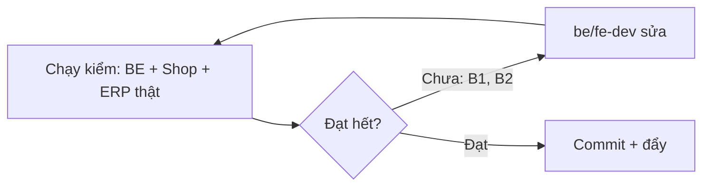

# QA — Shop lô 2 (danh mục, chi tiết, giỏ, ERP 2b, site-info/trang 5-01/5-02) · lần 1 · 2026-10-11

## Kết luận lần 1: REJECTED — 2 lỗi chặn mức Medium (B1 ERP báo lỗi chung chung, B2 G8 còn mã cũ); phần còn lại đạt
## Tổng: 62 ca · ✅ 59 · ❌ 2 · ⏸ 1 (lỗi chia: B1 = 1 ca ERP × 4 ô tính 1 ca, B2 = 1 ca G8)

Môi trường: BE Django thật (SQLite tạm riêng, seed_demo + `load_shop_content --publish`, thêm nhóm "Mực", món còn/sắp hết/hết/combo, SELLER_PHONE/ZALO giả), Shop build `USE_MOCK=0` API localhost:8000 (`npm ci` sạch), ERP build `USE_MOCK=0` cùng BE. Chromium headless 360 px + 1280 px. Dữ liệu giả toàn bộ. Ảnh: `shots/lo2-qa/` (82 ảnh).

## Theo AC
| Mã AC | KQ | Bằng chứng |
|---|---|---|
| SHOP-2-00 URL | ✅ | `/about/`, `/pages/?slug=lien-he|giao-hang|thanh-toan|khieu-nai`, `/blog/`, `/blog/?category=` đều 200, 0 lỗi console, không cuộn ngang; `/gioi-thieu/`, `/trang/`, `/bai-viet/` trả 404 (curl) |
| 2-03 AC1 lọc nhóm | ✅ | `?group=muc` còn 3 món, `aria-current` đúng, đếm "3 món" (`catalog-group-*.png`) |
| AC2 sắp xếp, hết ở cuối | ✅ | price_asc / price_desc: 3 món hết luôn cuối (log `asc/desc order`); sheet 360 chọn "Giá thấp" đổi URL |
| AC3/AC4 thêm 1 kg, +0,5 | ✅ | Thẻ → stepper "1 kg", focus vào nút "Thêm 0,5 kg", toast `role=status` "Đã thêm 1 kg Cá thu vào giỏ"+"Xem giỏ" (360) / MiniCart (1280); +,+ → 1,5 → 2 kg; localStorage `qty:2` |
| AC5 G4 bỏ món | ✅ | 2→1,5→1 kg rồi bấm lần nữa mở Dialog "Bỏ Cá thu khỏi giỏ?"; không có 0,5 kg; Esc đóng + trả focus nút thùng rác; "Giữ lại" giữ 1 kg; "Bỏ khỏi giỏ" xoá (ls `[]`); Dialog 440 px ở 1280, `aria-modal=true` |
| AC6 combo | ✅ | "Thêm 1 combo" → "1 combo" → "2 combo", không chữ kg |
| AC7 Sắp hết/Hết | ✅ | Nhãn "Sắp hết" (QA-LOW), "Hết hàng" ảnh mờ + giá + "Liên hệ chúng tôi"; có SELLER_PHONE → `tel:02839990000`, không hotline hợp lệ (placeholder "1900 xxxx") → dẫn `/pages/?slug=lien-he` không `tel:` |
| AC8 rỗng | ✅ | `?q=xyz` → A5 "Không tìm thấy “xyz”" + chip nhóm + "Liên hệ chúng tôi để hỏi hàng" |
| AC9 lỗi mạng | ✅ | Chặn `/api/shop/catalog/`: "Chưa tải được hàng" + Thử lại, header và bộ lọc còn; bấm Thử lại → hàng hiện; đang tải: A0 "Đang tải hàng" `aria-busy=true` |
| AC10 ô nhóm trang chủ | ✅ | Link `/shop/?group=hai-san`, `?group=muc` |
| AC11 CartBar | ✅ | Ảnh `catalog-cartbar-360.png`: giỏ có món → CartBar trên BottomNav |
| AC12 trang chủ | ✅ | Hàng "Đang có hàng" không có món hết; thẻ theo `stock_level` |
| 2-04 AC1 gợi ý | ✅ | Gõ "muc" (không dấu): 2 món + "Xem tất cả", tên + `/kg`, không số kg tồn |
| AC2 ↓↓Enter, Esc | ✅ | `aria-activedescendant` đổi opt-0→opt-1; Enter mở `/shop/item/?code=QA-MUC` (món thứ hai); Esc đóng, focus ở combobox |
| AC3 tìm gần đây | ✅ | Hiện "tôm", "mực"; localStorage chỉ `shop_recent_searches_v1=["tôm","mực"]` |
| AC4 giống SĐT | ✅ | `0900000001`, `+84900000001`, `0900 000 001` không lưu (xem Low L2) |
| 2-05 AC1 | ✅ | Tên, mã, giá, chip 1/1,5/2/3 kg (chọn 2 kg → tạm tính 330.000đ), bước 0,5, "Thêm vào giỏ" thêm đúng số kg đã chọn, "Chọn mua" → `/shop/cart/` |
| AC2 | ✅ | QA-TOM chỉ có Bảo quản: khối Quy cách/Nguồn hàng/Mô tả ẩn; CA-THU hiện đủ 4 khối + mô tả |
| AC3 món hết | ✅ | Nhãn "Hết hàng", ảnh mờ, banner Q-UX-7, "Gọi 0283 999 0000" + "Nhắn Zalo" (có Zalo), không nút mua |
| AC4 combo | ✅ | Bảng thành phần (Cá thu 0,5 kg, Mực ống 0,5 kg), câu "Nếu một món trong combo hết, combo tạm ngưng bán.", "−" tắt ở 1 combo |
| AC5 404 | ✅ | `?code=KHONG-CO` → "Không tìm thấy món này" + "Xem hàng đang có", không màn trắng |
| AC6 − tắt ở 1 kg | ✅ | "Bớt 0,5 kg" disabled ở 1 kg (kg và combo) |
| 2-06 AC1 | ✅ | Giỏ 3 món: CheckoutSteps, tổng 895.000đ đúng, câu "Đã gồm giao hàng. Bạn trả một lần, không trả thêm khi nhận hàng.", không chữ "Phí giao"; badge "Giỏ hàng, 3 món" |
| AC2 | ✅ | Thùng rác ở 1 kg → Dialog B2; Bỏ → badge 3→2 |
| AC3 giá đổi | ✅ | Đổi giá Bạch tuộc 280k→310k, tải lại: banner "Giỏ hàng có thay đổi từ lần trước", `<del>280.000đ</del> → 310.000đ`, nhãn "Giá đã cập nhật", tổng 760.000đ đúng |
| AC4 món hết | ✅ | Hết lô Bạch tuộc: dòng "Món này đã hết"+"không tính vào tổng", tổng chỉ còn 450.000đ; bấm "Tiếp tục" → "Bỏ món đã hết để đặt hàng." và focus vào "Bỏ Bạch tuộc khỏi giỏ"; bỏ xong → sang `/shop/checkout/` |
| AC5 rỗng | ✅ | B4 "Giỏ hàng đang trống" + "Xem hàng đang có" + gợi ý |
| AC6 giỏ cũ | ✅ | ls 0,3 kg và 1,2 kg → 1 kg và 1,5 kg; banner "Số lượng đã chỉnh theo mức bán"; không xoá món |
| AC7 lỗi mạng giỏ | ✅ | "Chưa cập nhật được giá. Thử lại"; nút Tiếp tục vẫn bấm được |
| AC8, AC9 | ✅ | Tiếp tục → `/shop/checkout/`; Header, BottomNav, CartBar, MiniCart, Chọn mua đều tới `/shop/cart/` |
| AC10 xoá code | ❌ | Xem B2 (frontend còn tham chiếu `sellable_qty`/`CatalogGrid`) |
| 2b-01 AC1 | ✅ | Chủ PATCH 5 ô → API công khai trả đúng chữ; thẻ hiện `short_note`; A3 hiện 4 khối |
| AC2/AC3 (API) | ✅ | 400 đúng câu: SĐT (`0900000001`, `+84…`, `0900.000.001`), giá (`250.000đ`, `250k`), mã lô hệ thống (`MUC-ONG-261010-A1B2C`), nhà cung cấp |
| AC2/AC3 (ERP hiện lỗi dưới ô) | ❌ | Xem B1 |
| AC4 | ✅ | 61 ký tự → API 400 "Tối đa 60 ký tự."; ERP có bộ đếm "n/2000", ô ghi chú cắt ở 60 |
| AC5 quyền | ✅ | Xem bảng quyền: manager/kho/giao/gọi xác nhận đều 403; ERP Quản lý không thấy nút sửa |
| AC6 AuditLog | ✅ | `update_item` `changes={"fields":[tên trường]}` không chép chữ; ERP hiện "Sửa thông tin mặt hàng" |
| AC7 giá vốn | ✅ | manager/giao xem món: không khoá cost/purchase/rate |
| 2b-02 AC1 | ✅ | Đổi `muc`→`muc-ong-ngon`: `/shop/?group=muc-ong-ngon` lọc đúng; AuditLog `{"slug":{"from","to"}}` |
| AC2 | ✅ | Trùng / rỗng / "Có Dấu" / khoảng trắng / HOA / `a_b` → 400 đúng lý do; ERP hiện lỗi dưới ô, giữ chữ đã nhập |
| AC3 | ✅ | manager, kho, anon: 403/401 |
| 5-01 AC1 | ✅ | Có env: `seller.zalo`, `working_hours`, `policies.return_report_hours=24` |
| AC2 | ✅ | Chưa đặt: mọi khoá mới là `null` (không `""`); footer ẩn Zalo khi không có |
| AC3, AC4 | ✅ | Không `search_chips`; chỉ dữ liệu người bán (phone/address là của người bán) |
| 5-02 AC1 | ✅ | `giao-hang`/`thanh-toan`/`khieu-nai` vai trò `shipping`/`payment`/`complaints`, có trong footer-links và footer |
| AC2 | ✅ | Chủ gỡ → 400 BR-ND-16; xoá → 400 BR-ND-02 |
| AC3 | ✅ | Có lịch sử phiên bản (v1–v3) |
| AC4 | ✅ | Kho PATCH/unpublish → 403 |
| G1 | ✅ | Quét JSON `/api/shop/*`, `/api/public/*` (21 endpoint) và HTML/chữ 15 trang × 2 khổ: 0 `sellable_qty`/`qty_available`…, 0 "còn N kg", 0 mã lô |
| G2 | ✅ | `localStorage` chỉ `cangcaloc_cart_v1` (+ tìm gần đây), `sessionStorage` rỗng; log BE sau POST đơn lỗi có SĐT giả: 0 lần xuất hiện; response 400 không dữ liệu khách |
| G3 | ✅ | Xem mục rò giá vốn |
| G4 BE | ✅ | POST `0.5`, `1.25`, `-1` kg, `1.5`, `0` combo → 400 `INVALID_QTY`; món hết → `OUT_OF_STOCK` chỉ `stock_level` |
| G5 | ✅ | Dialog bỏ món, sheet sắp xếp: `role=dialog`, `aria-modal`, Tab/Shift+Tab 40 lần không rơi vào nội dung nền, Esc đóng, focus về nút mở; Toast `role=status` |
| G6 | ✅ | 360 và 1280: `scrollWidth` bằng khổ ở mọi trang (Shop 15 trang, ERP chi tiết món) |
| G7 | ✅ | Không hex rời ở file lô 2 (còn `OrderLookup.tsx`/checkout của lô 3+4, ngoài phạm vi); `transition: all` 0 |
| G8 | ❌ | B2 |

## Ngoại lệ & biên
- Ngưỡng tồn (API thật, đổi sổ/giữ chỗ): 3,000 kg → `in`; 2,999 → `low`; 1,000 → `low`; 0,999 → `out`; 5,0 sổ giữ 2,5 → `low`; giữ 2,0 → `in`. ✅
- Bấm đúp "Thêm 1 kg": giỏ chỉ 1 kg, không mở Dialog. ✅
- Combo có thành phần hết → combo hiện hết (Mực ống hết → combo không tính). ✅
- Thao tác trên màn cũ: giá đổi/hết hàng sau khi mở giỏ → tải lại cập nhật; link nhóm cũ sau đổi slug (đã chấp nhận V1) hiện "Nhóm này chưa có món". ✅
- Giá đã áp vào đơn không sửa được (BE chặn PRICE_USED_BY_ORDERS) — nên dùng ORM để đổi giá thử; ghi chú, không lỗi.
- Lỗi mạng catalog/giỏ; offline: ✅.

## Phân quyền (PATCH món / PATCH slug nhóm / xem nhật ký)
| Nhóm | Sửa 5 ô món | Sửa slug nhóm | Nhật ký | Xem món |
|---|---|---|---|---|
| owner | 200 | 200 | 200 | 200 |
| manager | 403 | 403 | 200 | 200 |
| warehouse_staff | 403 | 403 | 403 | 200 |
| customer_service | 403 | 403 | 403 | 403 |
| delivery_staff | 403 | 403 | 403 | 403 |
| không nhóm | 403 (kèm câu hướng dẫn); ERP → `/no-role/` | — | — | — |
| chưa đăng nhập | 401 | 401 | — | — |

## Rò giá vốn
Không có khoá `purchase_rate`, `landed_unit_cost`, `unit_cost`, `rate`, `batch_id`, `margin`, `profit` ở 21 endpoint công khai; ERP manager/giao xem món không có khoá giá vốn; chữ hiện trong ERP chi tiết món không có "giá vốn". AuditLog chỉ tên trường/slug cũ→mới, không tính ngược ra giá vốn.

## Rò dữ liệu cá nhân
Đạt (xem G2). Chỉ dùng dữ liệu giả (`Nguyễn Văn A`, `0900000001`, `1 Đường Thử…`). Ghi chú Low L2.

## Hồi quy
- Backend: `manage.py test` → **Ran 3708 tests … OK (skipped=9)**. `makemigrations --check` không đổi. Adapter `pytest`: 68 passed.
- ERP: `npm ci` ok, `tsc --noEmit` exit 0, `npm run build` ok; `npm test` 113 file / 1340 ca xanh.
- Shop: `npm ci` ok, `tsc` exit 0, `npm run build` (USE_MOCK=0) ok 12 trang, `check-no-mock` XANH, 6 script test (cart-reconcile 20, catalog-view 21, format 33, phone 17, quantity 45, safe-href 40) đạt; `check_naming` OK.
- `frontend/out` để lại là bản build USE_MOCK=0 API localhost:8000; `erp-console/out` cũng đang là bản localhost:8000.

## Lỗi
### B1 — ERP sửa chữ món hiện lỗi chung "Dữ liệu gửi lên chưa hợp lệ." thay vì lý do · Medium · AC 2b-01 AC2/AC3 · fe-dev (ERP)
Bước tái hiện: đăng nhập `qa_owner` → Danh mục & giá → mở món Mực ống → bấm "Sửa mô tả" → gõ `Gọi 0900000001 để đặt` → Lưu. Làm tương tự ở Quy cách (`Giá chỉ 250k một ký`), Nguồn hàng (`Lô MUC-ONG-261010-A1B2C`), Bảo quản (`Từ nhà cung cấp Ba Hòn`).
Mong đợi: dưới ô hiện đúng câu BE ("Không ghi số điện thoại trong thông tin món." / "Không ghi giá trong thông tin món. Giá lấy từ bảng giá." / "Không ghi mã lô…" / "Không ghi nhà cung cấp…").
Thực tế: cả 4 ô đều hiện "Dữ liệu gửi lên chưa hợp lệ."; BE trả đúng `{"description":["Không ghi số điện thoại…"]}` (đã kiểm bằng API). Ảnh `erp-item-error-phone-1280.png`. Hộp sửa slug nhóm thì đúng (lỗi thật dưới ô). Ảnh hưởng: Chủ không biết vì sao bị từ chối.

### B2 — G8: frontend còn tham chiếu mã cũ của lô 2 · Medium · AC SHOP-2-06 AC10, G8 · fe-dev
Bước tái hiện: `grep -rnE "sellable_qty|CatalogGrid|AddToCartControl" frontend --exclude-dir=node_modules --exclude-dir=.next --exclude-dir=out`.
Thực tế: 6 file — `frontend/README.md:64`, `e2e/qa-lo6-sr21-shop.py`, `qa-lo7-shop-real.py`, `qa-lo8-shop-django.py`, `qa-lo8-shop-format.py`, `content_item_card.py` (fixture catalog còn `sellable_qty`, và kịch bản assert "tồn '…' ... .000 kg" đã lỗi thời). Mong đợi 0 kết quả (e2e cũ phải sửa/xoá trong chính lô). Backend không còn khoá `sellable_qty` ở API (chỉ hàm nội bộ `services.sellable_qty`, hợp lệ).

### Ghi nhận Low (không chặn)
- L1: ở 360 px, Toast "Đã thêm… Xem giỏ" phủ thanh nút "Thêm vào giỏ / Chọn mua" của trang chi tiết vài giây (`item-added-360.png`). fe-dev nên đẩy Toast lên trên thanh nút.
- L2: tìm "0900 000 001" chuyển URL `?q=0900%20000%20001` (không lưu vào "Tìm gần đây" nhưng SĐT gõ vào ô tìm nằm trong URL). Gợi ý: không đưa chuỗi giống SĐT vào `q`.
- L3: `/pages/?slug=khong-co` đặt `<title>` theo trang chủ; trang 404 có 2 thẻ robots (`noindex` và `noindex, follow`).
- L4: Nhóm cũ sau đổi slug hiện tiêu đề "Tất cả hải sản · 0 món" kèm "Nhóm này chưa có món" (hơi lệch chữ).
- L5: Trang Liên hệ (CMS nạp) còn chỗ giữ chỗ "[giờ mở] – [giờ đóng], [ngày trong tuần]" và BE `confirmation_policy.hotline="1900 xxxx"` (FE đã lọc, không hiện); thuộc việc chờ dữ liệu Lộc (mkt-brand).
- L6: Khối "Giao hàng / Đổi trả" trang chi tiết chưa dựng (đã ghi nợ ở dev-notes, thuộc lô 5).
- L7: Tiêu đề story 2b-01 ghi "Chủ/Quản lý" nhưng AC5 và chỉ thị chốt: chỉ Chủ sửa; code đúng chỉ thị (manager 403). Cần PO sửa tiêu đề cho khớp.
- L8: Lỗi console "Failed to fetch RSC payload" chỉ xuất hiện khi điều hướng ngắt giữa chừng trên máy chủ tĩnh Python của QA, không tái hiện ở các ca bình thường; không tính lỗi.

## Lệnh đã chạy
`cd backend && manage.py test` → Ran 3708 tests OK (skipped=9) · `makemigrations --check --dry-run` → No changes · `adapter pytest -q` → 68 passed · `frontend: npm ci; npx tsc --noEmit; NEXT_PUBLIC_USE_MOCK=0 NEXT_PUBLIC_API_BASE=http://localhost:8000 npm run build` exit 0 · `erp-console: npm ci; tsc --noEmit; build; npm test` 1340 ca xanh · `node frontend/scripts/*` · `python3 scripts/check_naming.py` OK · Playwright Python (scratchpad) trên BE/Shop/ERP thật, ~14 kịch bản; server và DB tạm đã dọn.

---

# Lần 2 · 2026-10-11 (kiểm lại sau sửa B1, B2, Low, review H1)

## Kết luận: APPROVED — B1, B2 và các Low đã sửa đều đạt trên BE/Shop/ERP chạy thật; còn 1 ghi nhận e2e cũ (không chặn)
Tổng lần 2: 16 ca · ✅ 15 · ⏸ 1 (`content_item_card.py` cần bài CMS dựng sẵn, chưa chạy)

| Ca | KQ | Bằng chứng |
|---|---|---|
| B1 ERP 4 ô hiện đúng câu BE (1280 + 360) | ✅ | Mô tả/Quy cách/Nguồn hàng/Bảo quản: "Không ghi số điện thoại…", "Không ghi giá…", "Không ghi mã lô…", "Không ghi nhà cung cấp, tên tàu hay ngày nhập lô…"; lưu chữ hợp lệ thành công; ô Mô tả nằm trong khối "Chữ hiển thị trên Shop"; không cuộn ngang (`erp2-item-*.png`) |
| B2 grep `sellable_qty|CatalogGrid|AddToCartControl` trong frontend | ✅ | 0 kết quả |
| B2 chạy thật e2e đã sửa | ⏸/ghi nhận | Chạy `qa-lo6-sr21-shop.py`, `qa-lo7-shop-real.py` trên bản build trỏ 8199: nhiều ca đỏ do kịch bản còn bám giao diện cũ (footer cũ, nút "Thêm vào giỏ" ở thẻ bài, và "0 request catalog" trong khi ô tìm gợi ý mới nạp catalog ở mọi trang). Không phải lỗi fixture; đã lỗi thời từ lô 1 (ghi ở dev-notes). `qa-lo8-shop-format` cần build mock, `content_item_card.py` cần bài CMS dựng sẵn: chưa chạy. Đề nghị lô sau (7) viết lại e2e; techlead xem việc ô tìm tải catalog ở mọi trang |
| H1 Shop lọc chữ khi đọc | ✅ | Ghi thẳng ORM `short_note="giá vốn 180 nghìn"`, mô tả có SĐT giả + "tàu Hải Long" + "giá vốn 180 nghìn", nguồn "nhà cung cấp Ba Hòn": Shop list và detail trả `""` cho các ô bẩn, giữ ô sạch (`spec`, `storage`); JSON không có `0900000001`, "Hải Long", "Ba Hòn" |
| SĐT gõ vào ô tìm | ✅ | `0900000001`, `+84900000001`, `0900 000 001` + Enter: URL không đổi sang `?q=` SĐT, không lưu; "Tìm gần đây" tối đa 5 mục |
| Toast che nút mua 360 | ✅ | Sau "Thêm vào giỏ", "Chọn mua" bấm được ngay ở 360 và 1280 |
| Nhóm không tồn tại | ✅ | `?group=khong-co` → "Không tìm thấy nhóm hàng" (360 và 1280) |
| Trang CMS không tồn tại | ✅ | `<title>` "Không tìm thấy trang | Cá Về", một thẻ `robots=noindex`; 404 chung cũng 1 thẻ robots |
| Hồi quy danh mục/chi tiết/giỏ | ✅ | Thêm 1 kg → stepper, 1,5 → 2; Dialog bỏ món (Esc trả focus, Giữ lại, Bỏ); combo 1 → 2; giỏ 3 món tổng đúng, không "Phí giao"; giá đổi → banner + `<del>` + tổng mới; món hết → "Bỏ món đã hết để đặt hàng." + focus; Tiếp tục → `/shop/checkout/`; 0 lỗi console (360 + 1280) |
| Hồi quy ERP sửa món/nhóm | ✅ | Lưu hợp lệ OK ở 360 + 1280 |

Điều phối đã chạy: BE Ran 2803 OK, ERP 1342, FE ci/tsc/build. Em đã build lại `frontend/out` USE_MOCK=0 API localhost:8000 (`check-no-mock` XANH); server và DB tạm đã dọn.
