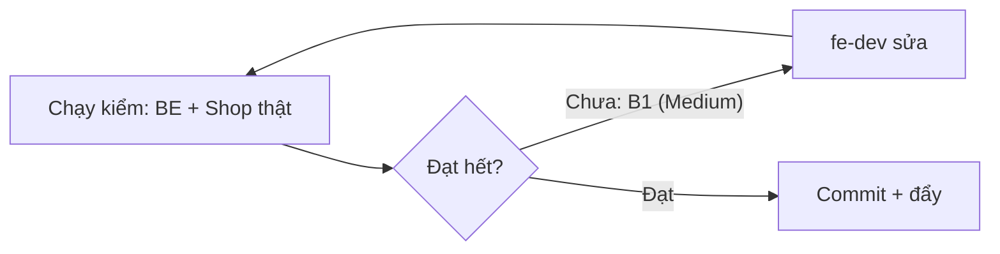

# QA — Shop lô 3+4 + 5b (đặt hàng, trang đơn, thanh toán, chính sách, Góc bếp) · lần 1 · 2026-10-11

## Kết luận: REJECTED — 1 lỗi chặn Medium (B1: bấm "Bản đồ" ngay sau khi chạm ô địa chỉ thì lần bấm đầu bị mất); còn lại đạt, kèm 2 ghi nhận Low
## Tổng: ~330 lần kiểm (mỗi AC chạy ở 360 và 1280 khi có giao diện) · ✅ ~320 · ❌ 3 (B1 ×2 độ rộng, B2 ×1) · ⏸ 1 (đua song song cần Postgres)

Môi trường: BE Django thật (SQLite tạm riêng, `seed_demo`, `load_shop_content --publish`, thêm combo QA, món còn/sắp hết/hết, `PRIVACY_CONSENT_REQUIRED=1`), Shop build `USE_MOCK=0` API `localhost:8000` (`npm ci` sạch, tsc 0 lỗi, build exit 0), Chromium headless 360/1280. Dữ liệu giả toàn bộ (Nguyễn Văn A, 0900000001, Trần Thị Quỳnh/0912345678 chỉ để quét rò). 89 ảnh ở `shots/lo34-qa/`.
Cách giả lập: thanh toán = gọi `confirm_payment(source="GATEWAY")` (đường IPN cổng) trong script `ops.py`; trạng thái E2–E5 = `cancel_paid_order`, `create_refund(is_partial)`, đổi trạng thái đơn/phiếu giao, `cancel_unpaid_expired` + tiền về muộn. C4/C8/X4/X2 dùng chặn mạng của Playwright (C4: để máy chủ nhận đơn rồi cắt phản hồi). Giờ máy lệch và "chờ >5 phút" dùng đồng hồ giả Playwright. Cổng SePay bị chặn ở trình duyệt (không gọi ra ngoài). Không thử được Google Maps có key (không có key): chỉ nhánh không key.

## Theo AC
| Mã AC | KQ | Bằng chứng |
|---|---|---|
| 3-01 AC1 201 đủ field, unit kg | ✅ | t5: đủ 10 khoá, hold_minutes 30 |
| AC2 trùng | ✅ / ⏸ | Gửi lại cùng id → 200 cùng mã; C4 thử lại: 2 request cùng id, +1 đơn. 6 request song song: 1 đơn, 5 lỗi 500 do SQLite "database is locked" (không phải lỗi sản phẩm); race thật cần Postgres cloud (nợ BE đã ghi) |
| AC3 SĐT +84 | ✅ | `+84912345678`, `84 912 345 678`, `0912 345 678` đều tra khớp |
| AC4 lỗi | ✅ | 400 `VALIDATION` có name/phone/delivery_address/consent |
| AC5 token | ✅ | base64 chỉ `{"o":"SO…"}`; sửa 3 ký tự → 404 |
| AC6 G2 | ✅ | response + log 0 tên/SĐT/địa chỉ |
| 3-02 AC1–AC3, AC5, AC8 | ✅ | 4 kiểu sai cùng 404 cùng câu; token hết hạn → 401 `TOKEN_EXPIRED` (server `SHOP_LOOKUP_TOKEN_DAYS=0`); JSON không PII/mã lô/giá vốn; `no-store`; log sạch |
| AC4 giới hạn | ✅ | mặc định: cùng mã sai lần 11 → 429; 25 mã sai cùng IP → 429; tạo đơn lần 3 trong ngưỡng thử → 429 |
| AC7 gỡ | ✅ / Low | GET `?phone_last4=` → 404. `grep phone_last4` còn trong `ai/policy/rules.py` (danh sách chặn), vài test và `frontend/e2e/*.py` cũ (xem L1) |
| 3-03 AC1–AC7 | ✅ | Form 3 ô + ô đồng ý không tick sẵn + link tab mới + câu BR-BH-30, không ô hoá đơn; lỗi thiếu/sai: khối "Còn N chỗ cần sửa" nhận focus, link nhảy ô, `aria-invalid`, không gọi API; +84 không lỗi; giỏ rỗng → `/shop/cart/`; X2 không form; 409 → C9, đóng thì bỏ tick, focus ô đồng ý, giữ chữ; sau reload ô trống, storage/URL 0 PII |
| 3-04 AC1, AC4, AC5, AC6 | ✅ | 0 request Google trước khi bấm; không key → dialog C5, "Nhập tay" và Esc đưa focus về ô địa chỉ, vẫn đặt được, body tạo đơn không lat/lng/place_id; không có "Vị trí của tôi"/geolocation |
| AC2, AC3 (có key) | ⏸ | Không có key Maps, chưa kiểm dòng thông báo Google và điền địa chỉ từ bản đồ |
| 3-04 (nhánh Bản đồ) | ❌ | **B1** |
| 3-05 AC1–AC6 | ✅ | Bấm đúp = 1 đơn (1 POST); URL chỉ `?code=`; sessionStorage chỉ `{mã: token}`; giỏ xoá sau 201; C3 (1 hết + 1 thiếu, không số kg, Esc = Quay lại giỏ không xoá món); C4 giữ 3 ô, cùng `client_request_id`; id mới mỗi lần; C8 |
| 4-01 AC1–AC7 | ✅ / Low | F1 điền sẵn mã, BottomNav `aria-current`; F2 câu chung, không `aria-invalid`, URL không SĐT; token + F5 giữ đúng màn; 401 → xoá token về F1; 429 câu đúng; server thắng `result` (PROCESSING + cancel → E1). Mất mạng: có câu "Chưa tải được đơn. Thử lại." nhưng không có nút "Thử lại" riêng (B2 Low) |
| 4-02 AC1–AC6 | ✅ | Đồng hồ đúng ±2 s khi máy lệch ±10 phút; <5 phút đổi hổ phách; 0 chữ SePay; không "Huỷ đơn"; D2 `result=cancel/error`; D6 giờ còn lại, focus "Ở lại", Esc; "Rời trang" giữ đơn BOOKED; "Thanh toán" gọi `/checkout/`; vùng live không đọc mỗi giây |
| 4-03 AC1–AC5 | ✅ | D3 hỏi 5 s, đơn thành PROCESSING → E1 banner; >5 phút đổi câu + hotline, đơn vẫn BOOKED; D4 dialog không đóng bằng lớp phủ, job chạy → trang D4; "Đặt lại đơn này" dựng giỏ (mã + 1,5 kg), không voucher |
| 4-04 AC1–AC5 | ✅ | Banner đóng được (nút 44 px), mốc giờ GMT+7 khớp `placed_at`, sao chép mã + toast, E3 "Mua lại" dựng giỏ + 24 giờ, E4 banner đúng câu, không số kg/mã lô |
| 4-05 AC1–AC5 | ✅ | `cancel_notice` đúng 7 khoá, không `refund*`; OTHER có ghi chú tự do → nhãn chung, JSON/trang không chứa ghi chú; E5 phần bị huỷ 310.000đ; E-03 `late_payment` + "Hết giờ giữ hàng, tiền về sau"; UNREACHABLE (mã `UNREACHABLE_AUTO` qua task tự huỷ chưa dựng, cùng nhãn) |
| 5-04 AC1–AC6 | ✅ | PolicyNav `aria-current`, mục lục, Liên hệ không form (tel/mailto/Zalo/giờ), Cách mua 5 bước + `
` + 1 kg/0,5 kg/30 phút, 404/lỗi mạng/410 đúng chữ, chi tiết món có "Giao hàng/Đổi trả" từ tóm tắt, "hoàn tiền" chỉ là tên trang |
| 5-05 AC1–AC4 | ✅ | Chip `?category=` `aria-current`, bài có thẻ món, "Thêm 1 kg" vào giỏ, bài không có → 404 |
| G1–G8 | ✅ | G1 không số kg tồn (C3, bài, catalog JSON); G2 không PII mọi màn đơn; G5 Esc/focus popup (C3, C4, C5, C9, D4, D6); G7/G8 build sạch, `features/home/content` 0 kết quả |

## Ngoại lệ & biên
Giỏ rỗng; SĐT +84; hết hàng + thiếu hàng cùng lúc; mất phản hồi sau khi máy chủ đã nhận; bấm đúp; 429 (giả lập + thật); Shop tạm ngưng; chính sách đổi (409 thật bằng version cũ); đồng hồ máy lệch ±10 phút; tab mới không có token; token hỏng/hết hạn; mở link `result=cancel` của đơn đã trả; tiền về muộn; bài/trang 404/410/lỗi mạng. Giới hạn tần suất lookup test trên server mặc định.

## Rò giá vốn / dữ liệu cá nhân
- Catalog, chi tiết món, site-info, lookup, create: 0 khoá giá vốn/lô/tồn (quét regex).
- Quét `page.content()` trang đơn (mọi trạng thái đã mở), console, localStorage, sessionStorage, URL, log BE (`be8000/8001`): 0 tên, SĐT, địa chỉ khách. Không có khối "Giao tới"/người nhận ở mọi màn đơn. `ghi chú huỷ` không lọt ra API/trang.
- Lưu ý: giỏ ở localStorage giữ `name/price` của món (không phải dữ liệu cá nhân).
- Ảnh/report chỉ dùng dữ liệu giả.

## Phân quyền
Không đổi quyền ở lô này; chạy toàn bộ BE (ma trận quyền, test scope Group) xanh.

## Hồi quy
BE `manage.py test`: **Ran 3790 tests OK (skipped=10)**. Adapter `pytest`: 68 passed. `makemigrations --check`: No changes. `check_naming`: OK. FE unit: cart-reconcile 20/20, catalog-view 21/21, format 33/33, order-state 78/78, phone 17/17, quantity 45/45, safe-href 40/40, check-no-mock XANH. Giỏ, danh mục, chi tiết món (lô 2) không vỡ (thêm giỏ từ bài, "Mua lại", "Đặt lại").

## Lỗi
### B1 — Bấm "Bản đồ" ngay sau khi chạm ô địa chỉ: lần bấm đầu không mở · Medium · AC 3-04 (và 3-03)
Tái hiện (360 và 1280): mở `/shop/checkout/` với giỏ có món → bấm vào ô "Địa chỉ giao hàng" (để trống) → bấm nút "Bản đồ" (có thể đo: `shots/lo34-qa/bug-map-click-lost-360.png`, `-1280.png`).
Mong đợi: popup bản đồ (hoặc C5) mở. Thực tế: ô địa chỉ mất focus nên hiện lỗi + khối "Còn 1 chỗ cần sửa" ở đầu trang, nút bị đẩy xuống ~107 px giữa mousedown và mouseup, lần bấm đầu bị mất; bấm lần hai mới mở. Ảnh hưởng: đúng thao tác phổ biến của khách (chạm ô rồi chọn bản đồ) bị "đơ" lần đầu.
Gợi ý: không chèn khối tóm tắt/lỗi khi blur mà chỉ khi bấm "Đặt hàng", hoặc giữ chỗ (min-height) cho khối. Ai sửa: fe-dev.

### B2 — F1 lỗi mạng không có nút "Thử lại" riêng · Low · AC 4-01 AC5
Tái hiện: ở F1 chặn `/api/shop/orders/lookup/` rồi bấm "Tra cứu". Thực tế: banner "Chưa tải được đơn. Thử lại." nhưng chỉ có nút "Tra cứu" (dùng lại được). Ghi nhận, không chặn.

### Ghi nhận khác (Low, không chặn)
- L1: AC7 3-02 literal: `phone_last4` còn trong `ai/policy/rules.py`, vài test AI/báo cáo, `frontend/e2e/qa-lo6-sr21-shop.py`, `golive_footer_checks.py` (e2e cũ lô 7). Dev đã giải thích.
- L2: "Đã chờ" của D3 tính từ lúc mở trang, tải lại thì đếm lại từ 0 (khách tải lại sau 10 phút vẫn thấy câu "vài giây").
- L3: F1 trên mobile có chân trang xanh (thiết kế `F1-Lookup` không có chân trang). Footer chính sách hiện tên trang "Chính sách đổi trả và hoàn tiền" ở mọi màn (hợp lệ, là tên trang).
- L4: `public_content` 120 lần/phút/IP: ~20 lần mở trang/phút, đủ cho khách thường, nhưng nhiều khách chung IP (NAT) có thể gặp 429 ở trang nội dung.
- L5: Nhánh bản đồ CÓ key chưa kiểm (⏸) — cần Duy/techlead cấp key.

## Lệnh đã chạy
`cd backend && .venv/bin/python manage.py test --parallel 1` → Ran 3790 OK; `cd adapter && pytest -q` → 68 passed; `cd frontend && rm -rf node_modules && npm ci && npx tsc --noEmit && NEXT_PUBLIC_USE_MOCK=0 NEXT_PUBLIC_API_BASE=http://localhost:8000 npm run build` → exit 0; `node scripts/test-*.mjs`, `check-no-mock.mjs` xanh; script Playwright t1–t7 (checkout, trang đơn/thanh toán, trạng thái E/D, lỗi gửi đơn, API/rò dữ liệu/throttle, nội dung); đã dọn server/DB tạm, `frontend/out` là build USE_MOCK=0 API localhost:8000.

## Lần 2 · 2026-10-11 — APPROVED
Chạy lại BE thật + `frontend/out` mới (USE_MOCK=0). Kết quả: 22/22 ca đạt, ảnh `shots/lo34-qa/lan2-*.png`.
- B1 ✅ ở 360 và 1280, cả khi ô khác đang lỗi: chạm ô địa chỉ rồi bấm "Bản đồ" thì nút không dịch (y 399 → 399,97) và popup mở ngay lần đầu. Chưa bấm "Đặt hàng" thì không có khối tóm tắt.
- C2 ✅ bấm "Đặt hàng" khi thiếu/sai: khối "Còn N chỗ cần sửa" hiện, nhận focus (`role=alert`), link nhảy tới ô SĐT, không gọi API.
- B2 ✅ F1 mất mạng có nút "Thử lại"; bấm sau khi mạng về thì vào đơn.
- D3 ✅ tải lại: "Đã chờ" tiếp tục (5 s → 6 s, không về 0); sau >5 phút (đồng hồ giả) tải lại vẫn hiện câu "gọi cho bạn". `shop_pending_since_v1` chỉ chứa mã đơn + mốc giờ; storage không có SĐT, tên, địa chỉ.
- Hồi quy ✅ đặt hàng (t1 ở 360: 30/30; ở 1280: 29/30, ca còn lại là selector của kịch bản, không phải lỗi) → trang đơn D1 → thanh toán → E1 banner; 0 lỗi console.
- Còn mở (Low, không chặn): L1, L3, L4; ⏸ Maps có key, đua song song trên Postgres.
Server tạm đã tắt; `frontend/out` là build USE_MOCK=0 API localhost:8000.
