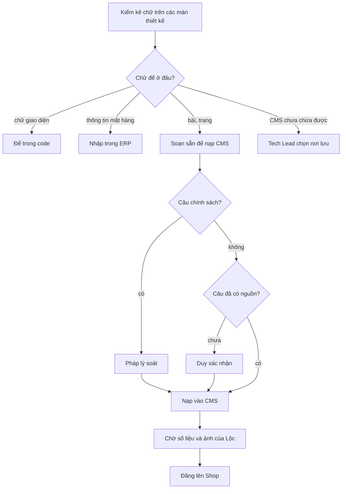

# 06 · Marketing: kiểm kê nội dung thiết kế Shop và nội dung soạn sẵn để nạp CMS

> `mkt-brand` · 10/10/2026 · Nhánh `shop/lo-0-quyet-dinh` · **Trạng thái: CHỜ DUYỆT** (Duy duyệt cùng story, theo D11 trong `00-dau-vao.md`)
> Nguồn: `doc/decisions.md:235-254` (chốt 10/10 tối), `doc/design/shop/UI-RULES.md` §6, `doc/design/shop/screens/*.dc.html`,
> `doc/business-process-spec.md`, hướng dẫn CMS `doc/ops/cms-cho-mkt.md` (viết cùng đợt, các mục "§" trong cột nguồn trỏ về file đó).
> Phần pháp lý (đổi trả, quyền riêng tư, khiếu nại, điều kiện giao dịch) ở đây **chỉ là khung**. `legal-vn` đang viết `05-phap-ly.md`. Khi hai bên khác nhau thì theo `05-phap-ly.md`.



Quy ước trạng thái từng câu:
- **ĐÃ ĐỐI CHIẾU**: có nguồn trong decisions hoặc BR.
- **CHỜ PHÁP LÝ**: câu chữ chính sách, cần `legal-vn` soát trước khi đăng.
- **CHỜ DUY**: câu khẳng định chưa có nguồn, hoặc phụ thuộc một mặc định chưa duyệt (D1–D13).
- `[…]` là chỗ chờ số liệu thật. Không tự điền.

---

## A. Thông điệp và giọng văn

**Thông điệp chính:** *"Từ cảng về bếp nhà bạn"*. Cá Về mua hải sản theo lô tại cảng, bán **hàng cấp đông** theo kg từ 1 kg, khách trả một lần bằng mã QR, nhân viên Cá Về giao tận nhà.

1. **Nói thật về hàng.** Hàng là hải sản cấp đông, nguồn theo mùa. Không viết "tươi sống", "đánh bắt sáng nay", "về cảng mỗi ngày", "luôn có hàng" (`decisions.md:14-20`; BR-ND-13 d).
2. **Không hứa điều hệ thống chưa làm.** Không viết "miễn phí giao", "giao trong ngày", "báo khi có hàng". Được viết "trả một lần qua mã QR, không thu thêm khi giao" (`decisions.md:247`; UI-RULES §6.4).
3. **Ngắn, xưng "bạn", động từ rõ.** Mỗi khối có một ý. Số chưa biết thì để `[…]`, không làm tròn hay ước chừng.
4. **Chữ "hoàn tiền" chỉ có trong tên trang "Chính sách đổi trả và hoàn tiền".** Mọi chỗ khác viết "Cá Về sẽ gọi cho bạn" (`decisions.md:243`).
5. **Thanh toán** viết là "chuyển khoản ngân hàng (quét mã QR)", không ghi tên cổng thanh toán (`decisions.md:245`). "VietQR" là tên chuẩn mã QR, không phải tên cổng, nhưng đề xuất vẫn dùng "quét mã QR" cho thống nhất.

---

## B. Bảng kiểm kê nội dung trong `screens/*.dc.html`

Cột "Nơi lưu":
- **CMS page**: một Entry `kind=page`, ghi kèm slug và `page_role`.
- **CMS post**: một Entry `kind=post`, ghi kèm chuyên mục.
- **Cấu hình**: site-info hoặc biến môi trường.
- **Mặt hàng**: dữ liệu `Item` trong ERP.
- **Code**: chữ giao diện hoặc khẩu hiệu cố định.
- **CMS CHƯA CHỨA**: cần techlead thiết kế ở 02b.

Chữ giao diện (nhãn nút, câu lỗi, tiêu đề màn, nhãn form, menu nhóm hàng, thanh đáy) **không liệt kê** ở bảng này. Chúng ở lại trong code.

### B1. Khung chung (header, footer) · `HeaderFooter-*`, có lặp lại trên mọi màn

| # | Vị trí | Chữ trên thiết kế | Nơi lưu đề xuất | Ghi chú |
|---|---|---|---|---|
| K1 | Logo phụ đề, banner | "Từ cảng về bếp nhà bạn" | **Code** (khẩu hiệu thương hiệu) | ĐÃ ĐỐI CHIẾU: chữ thương hiệu, không phải khẳng định nghiệp vụ |
| K2 | Dải chữ trên cùng (máy tính) | "Hải sản cấp đông theo lô · mua từ 1 kg · giao tận nhà" | **CMS CHƯA CHỨA**. Tạm để trong **Code** | ĐÃ ĐỐI CHIẾU (`decisions.md:14,240`; `:35-40`) |
| K3 | Footer, câu giới thiệu | "Hải sản cấp đông theo lô, giá tính theo kg, giao tận nhà." | **Code** | ĐÃ ĐỐI CHIẾU |
| K4 | Footer, Hotline · Zalo · Email | `[hotline]` `[số Zalo]` `[email]` | **Cấu hình**: `SHOP_HOTLINE`, `SELLER_EMAIL`; **chưa có Zalo** (BE-7) | `[placeholder]` ×3 |
| K5 | Footer, nhóm "Mua hàng" | Hàng đang có · Combo nấu nhanh · Cách mua hàng · Tra cứu đơn | **Code** (link điều hướng). "Cách mua hàng" trỏ `/trang/?slug=cach-mua-hang` | API footer không chia nhóm (cms-cho-mkt §2.4) |
| K6 | Footer, nhóm "Chính sách" (6 link) | Đổi trả và hoàn tiền · Giao hàng · Thanh toán · Quyền riêng tư · Điều khoản sử dụng · Cơ chế giải quyết khiếu nại | **CMS**: `GET /api/public/content/footer-links/`. Sáu trang đặt `show_in_footer=true`, thứ tự 1→6 (mục C3) | **Lệch quyết định:** trang `terms` tên là **"Điều kiện giao dịch chung"** (Duy chốt 07/10, `decisions.md:212`), thiết kế lại ghi "Điều khoản sử dụng". Đề xuất theo quyết định. CHỜ DUY xác nhận |
| K7 | Footer, nhóm "Về Cá Về" | Giới thiệu · Góc bếp · Liên hệ | **Code** (`/gioi-thieu/`, `/bai-viet/`, `/trang/?slug=lien-he`) | |
| K8 | Dải pháp lý | `[Tên doanh nghiệp] · MST [mã số thuế] · Địa chỉ: [địa chỉ kinh doanh]` · `GCN ĐKKD số [số] do [nơi cấp] cấp ngày [ngày]` · © 2026 Cá Về | **Cấu hình** `SELLER_*` qua site-info. **Thiếu** trường nơi cấp và ngày cấp GCN | `[placeholder]` ×7. CHỜ PHÁP LÝ: định dạng dải bắt buộc |
| K9 | Dải pháp lý, logo | Logo "Đã thông báo Bộ Công Thương" | **Code**. Link xác nhận để ở **Cấu hình** | CHỜ PHÁP LÝ: checklist ghi việc xác nhận nay do **UBND cấp tỉnh (Sở Công Thương)** làm, không còn là Bộ Công Thương (`doc/ops/go-live-phap-ly.md:17`). Tên logo và link cần `legal-vn` xác nhận. Chỉ gắn khi đã có link (D12) |
| K10 | Footer rút gọn F2 | 3 link: đổi trả, quyền riêng tư, thanh toán | **CMS**. FE lọc 3 slug `doi-tra`, `quyen-rieng-tu`, `thanh-toan` từ footer-links | Bỏ "hoàn tiền" khỏi các chỗ khác; ở đây được giữ vì là tên trang |

### B2. Trang chủ · `Home`, `DesktopHome`

| # | Vị trí | Chữ trên thiết kế | Nơi lưu đề xuất | Ghi chú và câu đề xuất |
|---|---|---|---|---|
| H1 | Banner chính, dòng nhỏ | "Từ cảng về bếp nhà bạn" | **CMS CHƯA CHỨA** (banner) | Giữ |
| H2 | Banner chính, tiêu đề | "Mua theo lô, biết rõ nguồn" | **CMS CHƯA CHỨA** | CHỜ DUY: "biết rõ nguồn" chỉ đúng khi trang sản phẩm có trường **Nguồn hàng** (L-23). Nếu chưa có trường đó thì dùng **"Mua theo lô tại cảng"** |
| H3 | Banner chính, câu phụ (máy tính) | "Hải sản cấp đông ngay tại cảng, cân đúng số kg bạn đặt." | **CMS CHƯA CHỨA** | **Sửa**: "cấp đông ngay tại cảng" chưa có nguồn. Đề xuất **"Hải sản cấp đông, mua theo lô tại cảng. Cân đúng số kg bạn đặt."** "Cân đúng" là giả định thiết kế (`decisions.md:81-89`), CHỜ DUY |
| H4 | Banner chính, nút | "Xem hàng đang có" / "Xem hàng" | Code | Chữ giao diện |
| H5 | Ô phụ "Combo nấu nhanh" | "Lẩu hải sản cho 3–4 người · 259.000đ / combo" | **Mặt hàng** (combo nổi bật lấy từ catalog) | Dữ liệu giả của thiết kế, **không nạp** |
| H6 | Ô phụ thanh toán | "Thanh toán VietQR · Quét mã là xong, xác nhận tự động · Quét mã QR bằng app ngân hàng" | **CMS CHƯA CHỨA** | **Sửa**: **"Chuyển khoản quét mã QR · Tiền về đủ là đơn tự xác nhận · Quét bằng app ngân hàng của bạn"**. ĐÃ ĐỐI CHIẾU (`decisions.md:184-185`; BR-TT-04: tiền thiếu thì không tự xác nhận) |
| H7 | Dải "Cam kết" (máy tính), ô 1 | "Cấp đông theo lô · Mua tại cảng, cấp đông ngay, rõ nguồn từng lô" | **CMS CHƯA CHỨA** | **Sửa** câu phụ: **"Mua tại cảng, mỗi lô có hạn dùng riêng"**. ĐÃ ĐỐI CHIẾU (`decisions.md:14-19`) |
| H8 | Dải "Cam kết", ô 2 | "Giao tận nhà, đóng thùng giữ lạnh · **Phí giao báo khi xác nhận đơn**" | **CMS CHƯA CHỨA** | **Bắt buộc sửa** (`decisions.md:247` bỏ dòng này). Đề xuất **"Giao tận nhà · Trả một lần qua mã QR, không thu thêm khi giao"**. "Đóng thùng giữ lạnh" CHỜ DUY (chưa có nguồn) |
| H9 | Dải "Cam kết", ô 3 | "Cân đúng, tính đúng · Tính tiền theo đúng số kg bạn đặt" | **CMS CHƯA CHỨA** | Giữ. CHỜ DUY: giả định thiết kế `decisions.md:81-89` thành lời hứa với khách |
| H10 | Dải "Cam kết" (điện thoại) | "Cấp đông theo lô · Giao tận nhà · Thanh toán VietQR" | **CMS CHƯA CHỨA** | Đổi ô 3 thành **"Quét mã QR"** |
| H11 | Khối Góc bếp | Tiêu đề bài, nhãn chuyên mục | **CMS post** (`GET …/entries/?kind=post`, lấy 3 bài mới nhất) | Đã có API |
| H12 | Lưới danh mục, hàng sản phẩm | Tên nhóm, số món, tên hàng, ghi chú, giá | **Mặt hàng** / nhóm hàng | Không phải CMS |

### B3. Landing `/gioi-thieu/` · `Landing`, `LandingMobile`

Toàn bộ trang này là **CMS CHƯA CHỨA** nếu muốn giữ đúng bố cục nhiều phần (cms-cho-mkt §7). Mục C2.3 có hai cách: (a) tạm dựng thành trang CMS dạng bài đọc, (b) chờ techlead làm model phần trang. Chữ đã sửa nằm ở C2.3.

| # | Phần | Chữ trên thiết kế | Vấn đề |
|---|---|---|---|
| L1 | Hero, đoạn mở | "…tại cảng, **làm sạch, cấp đông** rồi giao tận nhà. Giá tính theo kg, cân đúng số bạn đặt." | CHỜ DUY: chưa có nguồn cho việc Cá Về tự làm sạch và tự cấp đông. Chỉ có "hàng tươi nhưng cấp đông" (`decisions.md:16`). Đã sửa ở C2.3 |
| L2 | Hero, thẻ hàng mẫu | "Mực ống làm sạch · [giá] / kg" | **Mặt hàng**, lấy từ catalog |
| L3 | "Chúng tôi mua tận cảng" | "…tại cảng [tên cảng]. **Mỗi lô có mã và hạn dùng riêng**…" | ĐÃ ĐỐI CHIẾU (lô và hạn: `decisions.md:17`). `[tên cảng]` |
| L4 | Bước 01 | "**Xem tận mắt từng mẻ khi tàu cập bến, chỉ lấy lô đạt.**" | **Không có nguồn.** Bỏ, thay bằng câu ở C2.3 |
| L5 | Bước 02 | "Sơ chế, làm sạch và cấp đông theo từng lô." | CHỜ DUY (như L1) |
| L6 | Bước 03 | "Đóng thùng giữ lạnh, giao tận nhà bạn." | "Giao tận nhà" ĐÃ ĐỐI CHIẾU (`decisions.md:35-40`). "Thùng giữ lạnh" CHỜ DUY |
| L7 | "Giá theo kg" | "…**Lô gần hạn được xuất trước.**" | Đúng FEFO (`decisions.md:163-170`) nhưng dễ đọc thành "bán hàng sắp hết hạn". Viết lại ở C2.3 |
| L8 | Thẻ giá mẫu | Ghẹ xanh 420.000đ, Cá thu 330.000đ, Mực 278.000đ | **Dữ liệu giả, không nạp.** Lấy giá thật từ catalog |
| L9 | "Bảo quản" | "Hạn dùng ghi theo lô: [số] tháng trong ngăn đá." · "Rã đông… trước **8–12 giờ**." | `[số]` CHỜ DUY: hai quyết định nói khác nhau, 3 tháng (`decisions.md:17`) và 365 ngày mặc định (`:179`). Số giờ rã đông **lệch** với trang sản phẩm ("6–8 tiếng"). Cần Lộc chốt một số |
| L10 | "Giao tận nhà ở [khu vực]" | "…thanh toán qua VietQR. Cá Về gọi xác nhận và **báo phí giao** trước khi giao." | **Bắt buộc sửa** (`decisions.md:247`) |
| L11 | "Hàng có vấn đề" | "…chụp ảnh gửi trong [số] giờ, Cá Về **đổi món mới** hoặc gọi lại…" | CHỜ PHÁP LÝ. "Đổi món mới" là cam kết chính sách |
| L12 | CTA cuối | "**Bảng hàng chỉ hiện món còn bán**, giá ghi theo kg." | **Sai sự thật**: món hết hàng **vẫn hiện**, xếp cuối, có nút "Liên hệ chúng tôi" (UI-RULES §1.4). Sửa ở C2.3 |
| L13 | Footer | như B1 | |

### B4. Chính sách · `P1-Policy`, `DesktopPolicy` (6 trang)

| # | Trang (tên trên thiết kế) | Slug (`HeaderFooter-Desktop.dc.html:189`) | `page_role` | Mục trên thiết kế | Nơi lưu |
|---|---|---|---|---|---|
| P1 | Chính sách đổi trả và hoàn tiền | `doi-tra` | `refund` | Điều kiện đổi · Thời hạn báo · Cách liên hệ · Xử lý tiền đã chuyển khi đơn huỷ · Trường hợp không áp dụng | CMS page, footer 1. **CHỜ PHÁP LÝ** |
| P2 | Chính sách giao hàng | `giao-hang` | — (chưa có vai trò) | Khu vực giao · Thời gian giao · Phí giao · Giao không thành công | CMS page, footer 2 |
| P3 | Chính sách thanh toán | `thanh-toan` | — (chưa có vai trò) | Hình thức · Thời gian giữ hàng · Số tiền chưa khớp | CMS page, footer 3 |
| P4 | Chính sách quyền riêng tư | `quyen-rieng-tu` | `privacy` | Dữ liệu thu thập · Mục đích · Thời gian lưu · Quyền của bạn | CMS page, footer 4. **CHỜ PHÁP LÝ** |
| P5 | Điều khoản sử dụng → **Điều kiện giao dịch chung** | `dieu-khoan` | `terms` | Phạm vi · Đặt hàng · Giải quyết tranh chấp | CMS page, footer 5. **CHỜ PHÁP LÝ** |
| P6 | Cơ chế giải quyết khiếu nại | `khieu-nai` | — (chưa có vai trò) | Kênh tiếp nhận · Thời hạn trả lời · Các bước · Khi chưa thống nhất | CMS page, footer 6. **CHỜ PHÁP LÝ** |
| P7 | *(không có trên thiết kế)* Thông tin người bán | `thong-tin-nguoi-ban` | `seller_info` | — | CMS page, **không** hiện ở footer. Cần có vì là 1 trong 4 trang bắt buộc trước khi mở bán (cms-cho-mkt §2.3) |
| P8 | Dòng "Cập nhật [ngày]" | — | — | — | **Không nạp.** FE lấy `effective_from` của phiên bản đang đăng |
| P9 | Mục lục bên trái | — | — | — | FE dựng từ các khối H2 của thân bài |

### B5. Liên hệ · `P2-Contact`, `DesktopContact`

| # | Chữ | Nơi lưu | Ghi chú |
|---|---|---|---|
| C1 | "Hỏi về đơn hàng, bạn đọc mã đơn SO… để Cá Về tra nhanh." | **CMS page** `lien-he` (tóm tắt và đoạn mở) | ĐÃ ĐỐI CHIẾU (mã `SO…`: `decisions.md:246`) |
| C2 | Hotline `[hotline]` | **Cấu hình** `SHOP_HOTLINE` (site-info). Không chép vào CMS | Nếu chép vào thân bài thì máy quét báo "số giống SĐT", trừ khi số có trong `CONTENT_PHONE_ALLOWLIST` |
| C3 | Zalo `[số Zalo]` | **Cấu hình**, **chưa có trường** (BE-7) | |
| C4 | Email `[email]` | **Cấu hình** `SELLER_EMAIL` | |
| C5 | Địa chỉ kinh doanh `[địa chỉ]` | **Cấu hình** `SELLER_ADDRESS` | |
| C6 | Giờ làm việc `[giờ mở] – [giờ đóng] · [ngày trong tuần]` | **CMS page** `lien-he` (một mục trong thân bài) | Không dùng `CONFIRMATION_WORKING_HOURS`, vì đó là giờ **gọi xác nhận đơn**, không phải giờ làm việc |

Đề xuất bố cục: FE vẽ 4 thẻ (Hotline, Zalo, Email, Địa chỉ) từ site-info, rồi bên dưới hiện thân bài CMS `lien-he` (đoạn mở và giờ làm việc). Cách này giữ một nguồn duy nhất cho số điện thoại. Nếu techlead chọn để hết trong CMS thì dùng bản đầy đủ ở C2.2.

### B6. Cách mua hàng · `P3-HowToBuy`, `DesktopPolicy#cach-mua`

| # | Chữ trên thiết kế | Nơi lưu | Sửa |
|---|---|---|---|
| M1 | 5 bước: Chọn món · Vào giỏ · Nhập thông tin · Quét VietQR · Nhận hàng | **CMS page** `cach-mua-hang` (danh sách số) | Bước 5 "Cá Về gọi xác nhận, **báo phí giao** rồi giao" **bắt buộc sửa** |
| M2 | Hỏi đáp "Tối thiểu bao nhiêu kg?" | CMS page (H3 + đoạn) | "0,5 kg" là mặc định D4, CHỜ DUY |
| M3 | Hỏi đáp "Phí giao tính thế nào? Cá Về báo phí giao khi gọi xác nhận đơn." | CMS page | **Bắt buộc sửa**. Đã thay bằng "Giao hàng có tốn thêm tiền không?" (QA lô 1 B1: cấm chữ "Phí giao", BR-BH-30) |
| M4 | Hỏi đáp "Hết giờ giữ hàng thì sao?" | CMS page | ĐÃ ĐỐI CHIẾU (E-01) |
| M5 | Bố cục thẻ có số và hỏi đáp thu gọn | — | CMS chưa có khối tương ứng. FE trình bày riêng theo slug, hoặc techlead thêm khối |

### B7. Góc bếp · `G1-KitchenList`, `G2-KitchenArticle`, `DesktopKitchen*`

| # | Chữ | Nơi lưu | Ghi chú |
|---|---|---|---|
| G1 | Câu dưới tiêu đề danh sách: "Mẹo rã đông và cách nấu hải sản cấp đông." | **Code** (CMS không có chỗ cho đoạn giới thiệu của danh sách) | ĐÃ ĐỐI CHIẾU |
| G2 | Chip lọc: Tất cả · Rã đông · Món hấp · Món chiên | **CMS chuyên mục** (C1) | "Tất cả" là chữ giao diện |
| G3 | 6 bài (tiêu đề, nhãn, mô tả 1 dòng) | **CMS post**: tiêu đề, chuyên mục, **tóm tắt** | Soạn đủ ở C4, nạp ở trạng thái **Nháp** |
| G4 | Thân bài mẫu "Rã đông cá đúng cách…" | CMS post body | Thiết kế để `[…]`; đã soạn ở C4.1 |
| G5 | "Cá Về · [ngày đăng]" | API (`author`, `published_at`) | Không nạp |
| G6 | Khối "Món dùng trong bài" | Khối `item_card` | Chỉ chèn khi mã hàng có thật |
| G7 | "Bài liên quan" | FE lấy bài cùng chuyên mục | Không nạp |

### B8. Chi tiết sản phẩm · `Product`, `DesktopProduct` (**dữ liệu mặt hàng, không phải CMS**)

| # | Chữ | Nơi lưu | Ghi chú |
|---|---|---|---|
| S1 | Ghi chú ngắn trên thẻ ("Đã bỏ nội tạng · Cấp đông", "Cắt khúc dày 2–3 cm", "Size 3–4 con/kg") | **Mặt hàng**. Chưa có trường (L-23) | Techlead quyết trường |
| S2 | Quy cách · Bảo quản · Nguồn hàng · Đơn vị bán | **Mặt hàng** (L-23). Đơn vị bán do FE tự suy ra | Mẫu ở C6 |
| S3 | Mô tả (2 đoạn) | **Mặt hàng** `Item.description` | Có câu "**cấp đông theo từng lô ngay khi về cảng, đóng túi hút chân không**" chưa có nguồn, CHỜ DUY |
| S4 | "Rã đông thế nào cho đúng" | **Mặt hàng** (trường mới) hoặc link sang bài Góc bếp | "6–8 tiếng" lệch landing "8–12 giờ" |
| S5 | Dòng "Giao hàng: giao tận nhà, **phí giao Cá Về báo khi xác nhận đơn**." | **CMS**: lấy **tóm tắt** của trang `giao-hang` | **Bắt buộc sửa.** Tóm tắt soạn ở C3.2 |
| S6 | Dòng "Đổi trả: [chính sách đổi trả, chờ duyệt pháp lý]" | **CMS**: lấy **tóm tắt** của trang `doi-tra` | CHỜ PHÁP LÝ |
| S7 | "Tạm tính · Cân đúng số kg bạn đặt" | Code | CHỜ DUY (như H9) |
| S8 | "Mực · Mã CV-MUC-01" | Mặt hàng | Mã giả |

### B9. Trang 404 · `X1-NotFound404`, `DesktopNotFound404`

Chữ giao diện, **để trong code** (`app/not-found.tsx`). Copy ở C7.

---

## C. Nội dung soạn sẵn để nạp

Định dạng thân bài theo quy ước ở `doc/ops/cms-cho-mkt.md` §9 (`##` là H2, `-` là danh sách chấm, `1.` là danh sách số, `**…**` là chữ đậm, `[chữ](href)` là liên kết). Lệnh nạp phải bỏ qua mọi dòng bắt đầu bằng `⟨ghi chú⟩`.
Liên kết nội bộ dùng route hiện chạy được: `/trang/?slug=…`, `/bai-viet/?slug=…`. Nếu sau này có rewrite `/trang/<slug>` (L-13) thì sửa link một lượt.

### C1. Chuyên mục (nạp trước bài)

| Tên | Slug tự sinh | Thứ tự | Mô tả ngắn (công khai) | Trạng thái |
|---|---|---|---|---|
| Rã đông | `ra-dong` | 1 | Cách rã đông từng loại hải sản cấp đông trước khi nấu. | ĐÃ ĐỐI CHIẾU |
| Món hấp | `mon-hap` | 2 | Món hấp đơn giản từ cá, mực, tôm cấp đông. | ĐÃ ĐỐI CHIẾU |
| Món chiên | `mon-chien` | 3 | Món chiên giòn, ít bắn dầu, làm nhanh trong bữa tối. | ĐÃ ĐỐI CHIẾU |

⟨ghi chú⟩ Thiết kế để id chip là `hap` và `chien`, nhưng slug hệ thống tự sinh từ tên sẽ là `mon-hap` và `mon-chien` (`categories/services.py:18`). FE dùng slug từ API, không hard-code.

### C2. Trang thông tin

#### C2.1 Cách mua hàng
- `kind=page` · slug `cach-mua-hang` · `page_role` không · `show_in_footer=false` (link nằm ở nhóm "Mua hàng" trong code)
- **Tiêu đề:** Cách mua hàng
- **Tóm tắt:** Chọn món từ 1 kg, đặt hàng, quét mã QR để thanh toán, rồi nhận hàng tận nhà.
- **Tiêu đề tìm kiếm:** Cách mua hàng ở Cá Về
- **Mô tả tìm kiếm:** Năm bước đặt hải sản cấp đông ở Cá Về: chọn món từ 1 kg, đặt hàng, chuyển khoản quét mã QR và nhận hàng tận nhà.

```
## 5 bước đặt hàng
1. **Chọn món.** Mỗi món mua từ 1 kg, thêm từng 0,5 kg. Combo mua theo combo.
2. **Vào giỏ, bấm Đặt hàng.** Kiểm tra số kg và tạm tính. Có mã giảm giá thì nhập ở giỏ, mỗi đơn dùng 1 mã.
3. **Nhập thông tin nhận hàng.** Họ tên, số điện thoại và địa chỉ. Bạn có thể chọn địa chỉ trên bản đồ.
4. **Quét mã QR để thanh toán.** Cá Về giữ hàng cho bạn 30 phút kể từ lúc bấm Đặt hàng.
5. **Nhận hàng tận nhà.** Thanh toán xong, bạn vào thẳng trang đơn hàng để theo dõi. Nhân viên Cá Về giao hàng tận nhà.
## Câu hỏi thường gặp
### Mua ít nhất bao nhiêu?
Mỗi món từ 1 kg, thêm từng 0,5 kg. Combo mua từ 1 combo.
### Giao hàng có tốn thêm tiền không?
Không. Giá đã gồm giao hàng trong khu vực Phan Thiết. Bạn trả một lần khi quét mã QR, không trả thêm khi nhận hàng.
### Hết 30 phút mà chưa thanh toán thì sao?
Đơn tự huỷ và hàng được giữ cho người khác. Bạn đặt lại đơn mới là được.
### Đã chuyển khoản mà đơn chưa đổi trạng thái?
Đơn được xác nhận khi tiền về đủ. Nếu số tiền chưa khớp với đơn, Cá Về sẽ gọi cho bạn.
### Xem lại đơn ở đâu?
Vào [Tra cứu đơn](/shop/orders/), nhập mã đơn (bắt đầu bằng SO) và số điện thoại bạn đã dùng khi đặt.
### Hàng có phải tươi sống không?
Không. Cá Về bán hải sản cấp đông, mua theo từng lô tại cảng. Nhận hàng xong, bạn cất ngay vào ngăn đá nếu chưa nấu.
### Món đang hết hàng thì sao?
Nguồn hàng theo mùa đánh bắt nên có lúc tạm hết. Bạn bấm "Liên hệ chúng tôi" để hỏi Cá Về.
```

| Câu | Nguồn | Trạng thái |
|---|---|---|
| Từ 1 kg; combo theo combo | `decisions.md:240` | ĐÃ ĐỐI CHIẾU |
| Thêm từng 0,5 kg | D4 (`00-dau-vao.md:23`) | CHỜ DUY |
| Mỗi đơn 1 mã | `decisions.md:248` | ĐÃ ĐỐI CHIẾU |
| Bản đồ | `decisions.md:244` | ĐÃ ĐỐI CHIẾU |
| Giữ hàng 30 phút, quá giờ tự huỷ | `decisions.md:32`; E-01; `settings.py:228` | ĐÃ ĐỐI CHIẾU (phải sửa trang nếu đổi biến `SALES_ORDER_TTL_MINUTES`) |
| Trả xong vào thẳng trang đơn | `decisions.md:245` | ĐÃ ĐỐI CHIẾU |
| Nhân viên Cá Về giao | `decisions.md:35-38` | ĐÃ ĐỐI CHIẾU |
| Trả một lần, không thu thêm khi giao | `decisions.md:247` | ĐÃ ĐỐI CHIẾU · CHỜ PHÁP LÝ (câu về phí trong trang công khai) |
| Tiền về đủ mới xác nhận; chưa khớp thì Cá Về gọi | `decisions.md:185`; BR-TT-04, E-02 | ĐÃ ĐỐI CHIẾU |
| Tra đơn bằng mã + số điện thoại | UI-RULES §3.2; D6 | ĐÃ ĐỐI CHIẾU (route `/shop/orders/` theo `HeaderFooter-Desktop.dc.html:188`) |
| Cấp đông, theo mùa | `decisions.md:14-16` | ĐÃ ĐỐI CHIẾU |

#### C2.2 Liên hệ
- `kind=page` · slug `lien-he` · `show_in_footer=false`
- **Tiêu đề:** Liên hệ
- **Tóm tắt:** Gọi hotline, nhắn Zalo hoặc gửi email cho Cá Về. Hỏi về đơn hàng, bạn đọc mã đơn để Cá Về tra nhanh.
- **Tiêu đề tìm kiếm:** Liên hệ Cá Về
- **Mô tả tìm kiếm:** Hotline, Zalo, email, địa chỉ kinh doanh và giờ làm việc của Cá Về.

Bản A, khi FE vẽ thẻ liên hệ từ site-info (đề xuất):
```
Hỏi về đơn hàng, bạn đọc mã đơn (bắt đầu bằng SO) để Cá Về tra nhanh.
## Giờ làm việc
[giờ mở] – [giờ đóng], [ngày trong tuần].
```
Bản B, khi để hết trong CMS (phải thêm hotline vào `CONTENT_PHONE_ALLOWLIST` trước, nếu không máy quét sẽ cảnh báo):
```
Hỏi về đơn hàng, bạn đọc mã đơn (bắt đầu bằng SO) để Cá Về tra nhanh.
## Gọi hotline
[[hotline]](tel:[hotline])
## Nhắn Zalo
[[số Zalo]](https://zalo.me/[số Zalo])
## Email
[[email]](mailto:[email])
## Địa chỉ kinh doanh
[địa chỉ kinh doanh]
## Giờ làm việc
[giờ mở] – [giờ đóng], [ngày trong tuần].
```
Trạng thái: ĐÃ ĐỐI CHIẾU (không có form liên hệ: UI-RULES §3.3). Các số chờ Duy.

#### C2.3 Giới thiệu (`/gioi-thieu/`)
Hai cách nạp. Techlead chọn ở 02b:
- **(a) Tạm thời**: `kind=page`, slug `gioi-thieu`. FE dựng `/gioi-thieu/` từ trang này với bố cục bài đọc; chỉ thẻ hàng và nút là code.
- **(b) Đúng thiết kế**: techlead làm model hoặc khối "phần trang". Chữ bên dưới đã chia sẵn theo phần, mỗi phần có mã như `[hero]` để ánh xạ.

- **Tiêu đề:** Giới thiệu Cá Về
- **Tóm tắt:** Cá Về mua hải sản theo từng lô tại cảng, bán hàng cấp đông theo kg từ 1 kg và giao tận nhà bạn.
- SEO: xem C8.

```
⟨ghi chú⟩ [hero] nhãn: Hải sản cấp đông theo lô · H1 (code): Từ cảng về bếp nhà bạn · nút: Xem hàng đang có → /, Cách chúng tôi làm → #cach-lam
Cá Về mua hải sản theo từng lô tại cảng, bán hàng cấp đông theo kg và giao tận nhà bạn. Bạn đặt bao nhiêu kg, Cá Về tính tiền đúng bấy nhiêu.
⟨ghi chú⟩ [cach-lam]
## Chúng tôi mua tại cảng, theo từng lô
Nguồn hàng theo mùa đánh bắt. Cá Về mua theo từng lô tại cảng [tên cảng]. Mỗi lô có mã và hạn dùng riêng, nên chúng tôi biết món bạn mua thuộc lô nào.
1. **Mua theo lô tại cảng.** Mỗi lần mua là một lô riêng, ghi rõ ngày mua và hạn dùng.
2. **Giữ đông theo lô.** Lô nào hạn dùng sớm hơn thì bán trước, để không lô nào nằm kho quá lâu.
3. **Giao tận nhà.** Nhân viên Cá Về mang hàng đến tận nhà bạn.
⟨ghi chú⟩ [gia-theo-kg] khối bên phải là 3 thẻ hàng lấy từ catalog, không nạp
## Giá theo kg, tính đúng số bạn đặt
Mỗi món có một giá cho mỗi kg. Bạn chọn 1 kg hay 2 kg, Cá Về cân và tính tiền đúng số đó.
⟨ghi chú⟩ [bao-quan]
## Cấp đông theo lô, rã đông là nấu
### Khi nhận hàng
Cất ngay vào ngăn đá nếu chưa nấu. Hạn dùng ghi theo từng lô.
### Rã đông đúng
Chuyển xuống ngăn mát trước khi nấu khoảng [số giờ] giờ. Không ngâm nước nóng. Xem thêm ở [Rã đông cá đúng cách](/bai-viet/?slug=ra-dong-ca-dung-cach).
⟨ghi chú⟩ [giao-hang]
## Giao tận nhà ở [khu vực giao]
Đặt online, trả một lần bằng chuyển khoản quét mã QR. Cá Về không thu thêm tiền khi giao hàng. Xem [Chính sách giao hàng](/trang/?slug=giao-hang).
⟨ghi chú⟩ [ho-tro]
## Hàng có vấn đề, báo Cá Về
Nhận hàng có vấn đề, bạn gọi hoặc nhắn Zalo cho Cá Về, kèm mã đơn và ảnh hàng nhận được. Cách xử lý theo [Chính sách đổi trả và hoàn tiền](/trang/?slug=doi-tra).
⟨ghi chú⟩ [cta] H2 (code): Xem hàng đang có · nút: Mở bảng hàng → /
Giá ghi theo kg. Món tạm hết vẫn hiện để bạn gọi hỏi.
```

| Câu | Nguồn | Trạng thái |
|---|---|---|
| Mua theo lô tại cảng | `decisions.md:156` (nhập hàng trực tiếp tại cảng) | ĐÃ ĐỐI CHIẾU |
| Hàng cấp đông, theo mùa | `decisions.md:14-16` | ĐÃ ĐỐI CHIẾU |
| Mỗi lô có mã và hạn dùng | `decisions.md:17` | ĐÃ ĐỐI CHIẾU |
| "ghi rõ ngày mua" | Hệ thống có lưu ngày nhập lô, nhưng Shop **không hiện** ngày nhập (`decisions.md:241`). Câu chỉ nói Cá Về ghi lại, không hứa cho khách xem | CHỜ DUY |
| Hạn sớm bán trước | FEFO, `decisions.md:163-170` | ĐÃ ĐỐI CHIẾU |
| Nhân viên Cá Về giao | `decisions.md:35-38` | ĐÃ ĐỐI CHIẾU |
| Cân và tính đúng số đặt | `decisions.md:81-89` (giả định thiết kế) | CHỜ DUY |
| `[số giờ]` rã đông | Landing ghi 8–12, trang sản phẩm ghi 6–8 | CHỜ DUY (Lộc chốt) |
| Không thu thêm khi giao | `decisions.md:247` | ĐÃ ĐỐI CHIẾU · CHỜ PHÁP LÝ |
| Đoạn "Hàng có vấn đề" | Thời hạn báo và cách xử lý thuộc chính sách đổi trả | CHỜ PHÁP LÝ |
| Món hết vẫn hiện | UI-RULES §1.4 | ĐÃ ĐỐI CHIẾU |

### C3. Sáu trang chính sách và trang Thông tin người bán (**khung**)

⟨ghi chú chung⟩
- Mọi câu ở mục này đều **CHỜ PHÁP LÝ**. Câu nào có nguồn nghiệp vụ thì ghi thêm nguồn để `legal-vn` đối chiếu.
- Không dùng chữ "nhà cung cấp" (máy quét giá vốn sẽ cảnh báo, cms-cho-mkt §5). Viết "đơn vị cung cấp dịch vụ".
- Chữ "hoàn tiền" chỉ xuất hiện trong tên trang P1 và trong link trỏ tới P1.
- `footer_order` theo thứ tự ở B4.

#### C3.1 Chính sách đổi trả và hoàn tiền
- slug `doi-tra` · `page_role=refund` · `show_in_footer=true` · `footer_order=1`
- **Tóm tắt** (cũng là dòng "Đổi trả:" ở trang sản phẩm, S6): `[Một câu tóm tắt điều kiện đổi, do legal-vn viết]`
```
## 1. Điều kiện đổi
[Hàng được đổi khi nào. Do legal-vn soạn.]
## 2. Thời hạn báo
Báo Cá Về trong [số] giờ sau khi nhận hàng.
## 3. Cách liên hệ
Gọi hotline hoặc nhắn Zalo cho Cá Về, kèm mã đơn (bắt đầu bằng SO) và ảnh hàng nhận được. Thông tin liên hệ ở trang [Liên hệ](/trang/?slug=lien-he).
## 4. Xử lý tiền đã chuyển khi đơn bị huỷ
[Do legal-vn soạn. Dữ kiện nghiệp vụ: Cá Về chuyển khoản lại thủ công, có hỗ trợ một phần (BR-HT-01..04; decisions 10/09). Trên Shop, đơn huỷ sau khi đã trả tiền ghi "Cá Về sẽ gọi cho bạn" (decisions 10/10). Thời hạn xử lý `[số] ngày` (REFUND_DEADLINE_DAYS mặc định 30, chưa phải cam kết).]
## 5. Trường hợp không áp dụng
[Do legal-vn soạn.]
```

#### C3.2 Chính sách giao hàng
- slug `giao-hang` · không `page_role` · `show_in_footer=true` · `footer_order=2`
- **Tóm tắt** (cũng là dòng "Giao hàng:" ở trang sản phẩm, S5): **Nhân viên Cá Về giao tận nhà. Bạn trả một lần khi quét mã QR, không thu thêm tiền khi giao.**
```
## 1. Khu vực giao
Cá Về giao tận nhà trong [khu vực giao].
## 2. Ai giao, giao khi nào
Nhân viên của Cá Về giao hàng tận nhà bạn. Thời gian giao: [khung giờ hoặc số ngày sau khi thanh toán]. Trước khi giao, Cá Về có thể gọi xác nhận đơn trong khung [giờ gọi xác nhận].
## 3. Phí giao
Bạn trả một lần khi quét mã QR. Số tiền trên mã QR là toàn bộ số tiền của đơn. Cá Về không thu thêm tiền khi giao hàng. Nếu sau này có phí giao, phí sẽ hiện trong tổng tiền trước khi bạn thanh toán.
## 4. Khi giao không thành công
Nếu nhân viên giao không gặp được bạn, Cá Về sẽ gọi để hẹn lại. [Số lần giao lại và cách xử lý khi không giao được. Do legal-vn soạn.]
## 5. Khi nhận hàng
Bạn kiểm tra hàng lúc nhận. Hàng có vấn đề, xem [Chính sách đổi trả và hoàn tiền](/trang/?slug=doi-tra).
```
Nguồn: nhân viên nội bộ giao (`decisions.md:35-38`); phí giao (`decisions.md:247`, BR-BH-10); gọi xác nhận (`site-info.confirmation_policy`, `content/site/api.py:22-31`); giao thất bại (E-08, BR-GH-04, P-08). Từ "miễn phí" **không dùng**.

#### C3.3 Chính sách thanh toán
- slug `thanh-toan` · không `page_role` · `show_in_footer=true` · `footer_order=3`
- **Tóm tắt:** Thanh toán một lần bằng chuyển khoản ngân hàng quét mã QR. Cá Về giữ hàng cho bạn 30 phút.
```
## 1. Hình thức thanh toán
Cá Về nhận một hình thức thanh toán: chuyển khoản ngân hàng bằng cách quét mã QR. Bạn trả đủ giá trị đơn trước khi giao. Cá Về không thu tiền khi giao hàng.
## 2. Thời gian giữ hàng
Khi bạn bấm Đặt hàng, Cá Về giữ hàng cho đơn trong 30 phút. Quá 30 phút mà chưa nhận được tiền thì đơn tự huỷ.
## 3. Xác nhận thanh toán
Khi tiền về đủ, đơn được xác nhận tự động. Bạn xem trạng thái ở trang đơn hàng.
## 4. Số tiền chưa khớp
Nếu số tiền chuyển ít hơn giá trị đơn, đơn chưa được xác nhận tự động. Cá Về sẽ gọi cho bạn để xử lý. Nếu tiền về sau khi đơn đã huỷ, Cá Về cũng sẽ gọi cho bạn. [Cách xử lý số tiền đã chuyển. Do legal-vn soạn, đối chiếu Chính sách đổi trả và hoàn tiền.]
## 5. Mã giảm giá
Mỗi đơn dùng tối đa 1 mã giảm giá. Số tiền giảm hiện trong tổng tiền trước khi bạn thanh toán. [Quy tắc khi có ưu đãi khác cùng lúc: chờ Duy duyệt D1.]
```
Nguồn: `decisions.md:184-188` (chỉ QR, thanh toán 100%), `:32` và E-01 (30 phút), `:185` (chỉ IPN mới xác nhận), BR-TT-04 và E-02/E-03, `:248` (mã giảm giá). Không ghi tên cổng thanh toán (`:245`).

#### C3.4 Chính sách quyền riêng tư
- slug `quyen-rieng-tu` · `page_role=privacy` · `show_in_footer=true` · `footer_order=4`
- **Tóm tắt:** `[Do legal-vn viết]`
- Thiết kế ghi tên trang là "Chính sách quyền riêng tư", còn ERP ghi vai trò là "Chính sách bảo mật". Tên trang do `legal-vn` chốt.
```
## 1. Dữ liệu Cá Về thu thập
[Do legal-vn soạn. Dữ kiện: form đặt hàng chỉ thu họ tên, số điện thoại, địa chỉ giao hàng (UI-RULES §2.1). Ngân hàng gửi về nội dung chuyển khoản. Trình duyệt chỉ giữ giỏ hàng (mã hàng và số lượng), không giữ dữ liệu cá nhân (bất biến 9). Website không có analytics hay pixel quảng cáo (UI-RULES §3.4).]
## 2. Mục đích sử dụng
[Do legal-vn soạn. Dữ kiện: giao hàng, gọi xác nhận đơn, xử lý thanh toán và các yêu cầu sau bán.]
## 3. Chia sẻ dữ liệu
[Do legal-vn soạn. Phải nêu: khi bạn bấm nút Bản đồ, địa chỉ bạn tìm được gửi tới Google Maps (decisions 10/10). Đơn vị cung cấp dịch vụ thanh toán và lưu trữ: [tên, nơi đặt máy chủ].]
## 4. Thời gian lưu
[Do legal-vn soạn.]
## 5. Quyền của bạn
[Do legal-vn soạn. Dữ kiện: yêu cầu xoá được xử lý bằng ẩn danh hoá; chứng từ vẫn giữ theo luật (bất biến 9).]
## 6. Liên hệ về dữ liệu cá nhân
[Kênh và người phụ trách.]
```

#### C3.5 Điều kiện giao dịch chung
- slug `dieu-khoan` · `page_role=terms` · `show_in_footer=true` · `footer_order=5`
- **Tiêu đề:** Điều kiện giao dịch chung (`decisions.md:212`; thiết kế ghi "Điều khoản sử dụng", CHỜ DUY)
- **Tóm tắt:** `[Do legal-vn viết]`
```
## 1. Phạm vi áp dụng
[Do legal-vn soạn. Dữ kiện: Cá Về bán cho khách cá nhân (decisions 09/09), không cần tài khoản.]
## 2. Đặt hàng và giá
Giá niêm yết theo kg, combo niêm yết theo combo. Mỗi món mua từ 1 kg. Nếu giá hoặc tình trạng hàng trong giỏ thay đổi, Shop báo cho bạn trước khi đặt. [Câu chữ cuối do legal-vn soạn.]
## 3. Thanh toán
Xem [Chính sách thanh toán](/trang/?slug=thanh-toan).
## 4. Giao hàng
Xem [Chính sách giao hàng](/trang/?slug=giao-hang).
## 5. Đổi trả
Xem [Chính sách đổi trả và hoàn tiền](/trang/?slug=doi-tra).
## 6. Khiếu nại và tranh chấp
Xem [Cơ chế giải quyết khiếu nại](/trang/?slug=khieu-nai). [Phần tranh chấp do legal-vn soạn.]
```
Nguồn: `decisions.md:240` (theo kg, tối thiểu 1 kg), UI-RULES §7 (B3, giỏ đổi giá), `decisions.md:10`.

#### C3.6 Cơ chế giải quyết khiếu nại
- slug `khieu-nai` · không `page_role` · `show_in_footer=true` · `footer_order=6`
- **Tóm tắt:** `[Do legal-vn viết]`
```
## 1. Kênh tiếp nhận khiếu nại
Gọi hotline, nhắn Zalo, gửi email hoặc gửi thư tới địa chỉ kinh doanh của Cá Về. Thông tin ở trang [Liên hệ](/trang/?slug=lien-he). Bạn ghi kèm mã đơn nếu khiếu nại về một đơn hàng.
## 2. Thời hạn trả lời
[Do legal-vn soạn.]
## 3. Các bước giải quyết
[Do legal-vn soạn.]
## 4. Khi chưa thống nhất được
[Do legal-vn soạn.]
```
Nguồn: go-live mục 2 và 9 (`doc/ops/go-live-phap-ly.md:18,26`).

#### C3.7 Thông tin người bán
- slug `thong-tin-nguoi-ban` · `page_role=seller_info` · `show_in_footer=false`
- **Tóm tắt:** Thông tin đơn vị bán hàng trên website Cá Về.
```
## Đơn vị bán hàng
- Tên: [tên doanh nghiệp hoặc hộ kinh doanh]
- Loại hình: [loại hình kinh doanh]
- Giấy chứng nhận đăng ký kinh doanh số [số], do [nơi cấp] cấp ngày [ngày]
- Mã số thuế: [mã số thuế]
- Địa chỉ: [địa chỉ kinh doanh]
- Điện thoại: [hotline]
- Email: [email]
```
⟨ghi chú⟩ Các giá trị này trùng với `SELLER_*` ở site-info. Đề xuất techlead cho FE vẽ khối người bán từ site-info rồi thêm đoạn này. Nếu không, mỗi lần đổi thông tin phải sửa cả hai chỗ. CHỜ PHÁP LÝ (danh mục bắt buộc theo NĐ 248).

### C4. Sáu bài Góc bếp (nạp ở trạng thái **Nháp**, chờ ảnh bìa)

⟨ghi chú chung⟩
- Không đăng được khi chưa có ảnh bìa có mô tả (BR-ND-03). Lộc tải ảnh rồi đăng.
- Ảnh minh hoạ phải gắn chữ "Ảnh minh hoạ" ở chú thích (UI-RULES §1.6).
- Khối `item_card` chỉ chèn khi mã hàng có thật; ghi `[mã hàng: …]` để Lộc chọn.
- Nội dung là mẹo nấu ăn phổ thông, không nói công dụng sức khoẻ.
- Thời gian rã đông để `[số giờ]` cho Lộc chốt một con số dùng chung (L9).

#### C4.1 Rã đông cá đúng cách để thịt không bở
- slug `ra-dong-ca-dung-cach` · chuyên mục **Rã đông**
- **Tóm tắt:** Ngăn mát hay nước lạnh, chọn cách nào cho từng món, và vì sao không nên dùng nước nóng.
- **Tiêu đề tìm kiếm:** Rã đông cá đúng cách để thịt không bở | Cá Về
```
Cá cấp đông rã đúng cách thì thịt vẫn chắc. Rã vội bằng nước nóng hay để ngoài lâu thì phần ngoài mềm nhũn trong khi lõi còn đá, nấu lên dễ bở.
## Vì sao thịt cá bị bở
Khi cá tan đá quá nhanh hoặc không đều, nước trong thớ thịt chảy ra ngoài. Thịt mất nước nên rời và bở khi nấu.
## Cách 1: rã đông trong ngăn mát (nên dùng)
1. Để nguyên túi, đặt cá lên đĩa để hứng nước.
2. Chuyển xuống ngăn mát trước khi nấu khoảng [số giờ] giờ. Khúc dày cần lâu hơn.
3. Lấy ra, thấm khô mặt cá bằng khăn giấy rồi mới nấu.
## Cách 2: khi cần gấp
- Ngâm **cả túi kín** trong nước lạnh. Không để nước lọt vào túi.
- Thay nước lạnh khoảng 30 phút một lần.
- Rã xong thì nấu ngay.
## Những điều nên tránh
- Không ngâm nước nóng, không rã đông bằng vòi nước nóng.
- Không để cá ngoài nhiệt độ phòng nhiều giờ.
- Cá đã rã đông thì không cấp đông lại.
⟨ghi chú⟩ [item_card: mã hàng cá thu cắt khúc]
```

#### C4.2 Rã đông tôm mà vẫn giữ vị ngọt
- slug `ra-dong-tom` · chuyên mục **Rã đông**
- **Tóm tắt:** Để nguyên túi, rã trong ngăn mát hoặc nước lạnh, không xả nước trực tiếp lên tôm.
```
Tôm nhỏ và mỏng nên tan đá nhanh. Rã đúng cách giúp tôm không bị nhũn và giữ được vị.
## Rã trong ngăn mát
1. Để nguyên túi, đặt lên đĩa.
2. Chuyển xuống ngăn mát trước khi nấu khoảng [số giờ] giờ.
3. Rã xong, để ráo rồi chế biến.
## Khi cần gấp
- Ngâm cả túi kín trong âu nước lạnh, thay nước nếu nước bớt lạnh.
- Không xả nước trực tiếp lên tôm đã bóc vỏ.
- Rã xong thì nấu ngay, không cấp đông lại.
⟨ghi chú⟩ [item_card: mã hàng tôm]
```

#### C4.3 Mực ống: hấp, chiên hay xào?
- slug `muc-ong-hap-chien-hay-xao` · chuyên mục **Món hấp** (giữ như thiết kế)
- **Tóm tắt:** Mỗi cách nấu hợp với một kiểu cắt mực. Gợi ý nhanh để chọn món cho bữa tối.
```
Mực ống đã làm sạch chỉ cần rã đông, rửa lại là nấu được. Cách cắt quyết định món nào hợp hơn.
## Hấp: để nguyên con hoặc cắt khoanh to
Hấp cùng gừng và hành trong vài phút là chín. Hấp lâu mực sẽ dai.
## Chiên: cắt khoanh tròn
Thấm thật khô, lăn qua bột rồi chiên ngập dầu đến khi vàng. Mực càng khô thì càng ít bắn dầu.
## Xào: khía vảy rồng, cắt miếng vừa ăn
Xào lửa lớn, nhanh tay, cho mực vào sau cùng để mực giòn.
> Mực chín nhanh. Nấu quá lửa là cách dễ nhất làm mực dai.
⟨ghi chú⟩ [item_card: mã hàng mực ống làm sạch]
```

#### C4.4 Cá thu hấp gừng hành
- slug `ca-thu-hap-gung-hanh` · chuyên mục **Món hấp**
- **Tóm tắt:** Món hấp nhẹ cho bữa tối, không cần dầu chiên, làm trong khoảng nửa giờ.
```
## Nguyên liệu (2–3 người)
- 500 g cá thu cắt khúc, đã rã đông
- 1 nhánh gừng, thái sợi
- 3 cây hành lá
- Nước mắm, tiêu, một ít dầu ăn
## Cách làm
1. Thấm khô cá, ướp chút nước mắm và tiêu khoảng 10 phút.
2. Xếp cá vào đĩa, rải gừng lên trên.
3. Hấp cách thuỷ đến khi thịt cá chuyển màu trắng đục và tách thớ.
4. Rắc hành lá, rưới một thìa dầu nóng lên trên rồi tắt bếp.
⟨ghi chú⟩ [item_card: mã hàng cá thu cắt khúc]
```

#### C4.5 Cá nục chiên giòn không bắn dầu
- slug `ca-nuc-chien-gion` · chuyên mục **Món chiên**
- **Tóm tắt:** Thấm khô cá trước khi cho vào chảo là bước quan trọng nhất.
```
Dầu bắn chủ yếu vì cá còn nước. Thấm khô kỹ thì cá giòn hơn và bếp sạch hơn.
## Cách làm
1. Rã đông cá trong ngăn mát, rửa sơ rồi để ráo.
2. Thấm khô cả trong bụng và ngoài da bằng khăn giấy.
3. Khứa vài đường trên thân, ướp chút muối.
4. Đun dầu thật nóng rồi mới cho cá vào. Không lật cá khi mặt dưới chưa vàng.
5. Chiên vàng hai mặt, vớt ra giấy thấm dầu.
⟨ghi chú⟩ [item_card: mã hàng cá nục]. Chỉ đăng khi Cá Về có bán cá nục (CHỜ DUY)
```

#### C4.6 Cá thu chiên sả ớt
- slug `ca-thu-chien-sa-ot` · chuyên mục **Món chiên**
- **Tóm tắt:** Ướp sả ớt, chiên vàng hai mặt. Món đậm vị cho bữa cơm nhà.
```
## Nguyên liệu (2–3 người)
- 500 g cá thu cắt khúc, đã rã đông
- 3 cây sả băm nhỏ, 1–2 quả ớt
- Nước mắm, đường, dầu ăn
## Cách làm
1. Thấm khô cá, ướp nước mắm, chút đường và một nửa phần sả khoảng 15 phút.
2. Chiên cá vàng hai mặt rồi vớt ra.
3. Phi thơm phần sả còn lại với ớt, cho cá vào đảo nhẹ cho thấm.
⟨ghi chú⟩ [item_card: mã hàng cá thu cắt khúc]
```
Trạng thái C4: ĐÃ ĐỐI CHIẾU với luật viết (không "tươi sống", không công dụng sức khoẻ, không giá cứng). Định lượng trong công thức là gợi ý nấu ăn, không phải số liệu kinh doanh. `[số giờ]` CHỜ DUY.

### C5. Nội dung CMS chưa chứa được: soạn sẵn để techlead chọn nơi lưu

| Khối | Chữ đề xuất | Trạng thái |
|---|---|---|
| Banner trang chủ (slide 1) | nhãn "Từ cảng về bếp nhà bạn" · tiêu đề "Mua theo lô tại cảng" (hoặc "Mua theo lô, biết rõ nguồn" nếu có trường Nguồn hàng) · câu "Hải sản cấp đông, mua theo lô tại cảng. Cân đúng số kg bạn đặt." · nút "Xem hàng đang có" | CHỜ DUY (H2, H3) |
| Banner phụ thanh toán | "Chuyển khoản quét mã QR" · "Tiền về đủ là đơn tự xác nhận" · "Quét bằng app ngân hàng của bạn" | ĐÃ ĐỐI CHIẾU |
| Slide 2–3 (thiết kế có 3 chấm) | `[nội dung slide: chờ Duy, ví dụ combo theo mùa hoặc mã giảm giá đang chạy]` | CHỜ DUY. Khuyến mãi phải qua `legal-vn` |
| Cam kết 1 | "Cấp đông theo lô" · "Mua tại cảng, mỗi lô có hạn dùng riêng" | ĐÃ ĐỐI CHIẾU |
| Cam kết 2 | "Giao tận nhà" · "Trả một lần qua mã QR, không thu thêm khi giao" | ĐÃ ĐỐI CHIẾU · CHỜ PHÁP LÝ |
| Cam kết 3 | "Cân đúng, tính đúng" · "Tính tiền theo đúng số kg bạn đặt" | CHỜ DUY |
| Dải chữ trên cùng | "Hải sản cấp đông theo lô · mua từ 1 kg · giao tận nhà" | ĐÃ ĐỐI CHIẾU |

### C6. Dữ liệu mặt hàng (ERP, không phải CMS): mẫu viết

⟨ghi chú⟩ Lộc nhập ở màn Mặt hàng. Trường lấy theo quyết định L-23 của techlead. Mẫu cho "Mực ống làm sạch":

| Trường | Mẫu | Trạng thái |
|---|---|---|
| Ghi chú ngắn (thẻ) | Đã bỏ nội tạng · Cấp đông | CHỜ DUY (Lộc xác nhận quy cách thật) |
| Quy cách | Đã làm sạch, bỏ nội tạng | CHỜ DUY |
| Bảo quản | Cấp đông. Cất ngăn đá ngay khi nhận | ĐÃ ĐỐI CHIẾU |
| Nguồn hàng | [cảng hoặc vùng biển] | `[placeholder]` |
| Mô tả | Mực ống đã làm sạch sẵn, rã đông là nấu được. Hợp hấp gừng, chiên giòn hoặc xào. | ĐÃ ĐỐI CHIẾU (bỏ "thân dày" nếu không đúng từng lô) |
| Câu bị bỏ khỏi mẫu | "cấp đông theo từng lô **ngay khi về cảng**, đóng túi **hút chân không**" | CHỜ DUY: chỉ thêm lại khi Lộc xác nhận |
| Rã đông | Chuyển xuống ngăn mát trước khi nấu khoảng [số giờ] giờ. Không ngâm nước nóng. | `[số giờ]` thống nhất với C4 |

Luật cho mọi mô tả mặt hàng: không ghi giá trong chữ, không ghi tên nhà cung cấp hay tên tàu, không ghi "tươi sống", không ghi ngày nhập lô.

### C7. Trang 404 và bài đã gỡ (chữ giao diện, để trong code)

| Màn | Tiêu đề | Câu | Nút |
|---|---|---|---|
| 404 | Không tìm thấy trang này | Link có thể đã cũ hoặc gõ nhầm. | "Về trang chủ" · "Xem hàng đang có" |
| Bài hoặc trang CMS trả 404 | Không tìm thấy bài này | Bài có thể đã đổi hoặc chưa đăng. | "Xem bài khác ở Góc bếp" · "Về trang chủ" |
| Bài CMS trả 410 (đã gỡ) | Bài này không còn trên web | Cá Về đã gỡ bài này. Bạn xem các bài khác ở Góc bếp. | "Xem Góc bếp" |
| Trang chính sách lỗi tải | Chưa tải được trang | Kiểm tra mạng rồi thử lại. | "Thử lại" |

Metadata 404: title "Không tìm thấy trang — Cá Về", có `noindex`.

### C8. Metadata SEO

| Route | `title` (≤ 60 ký tự) | `description` (≤ 160 ký tự) | Nơi lưu | Trạng thái |
|---|---|---|---|---|
| `/` | Cá Về — Hải sản cấp đông theo lô, giao tận nhà | Mua hải sản cấp đông theo kg, từ 1 kg: cá, tôm, mực, cua ghẹ và combo nấu nhanh. Thanh toán quét mã QR, giao tận nhà ở [khu vực giao]. | Code (`app/page.tsx` metadata) | ĐÃ ĐỐI CHIẾU · `[khu vực giao]` |
| `/gioi-thieu/` | Giới thiệu Cá Về — Từ cảng về bếp nhà bạn | Cá Về mua hải sản theo từng lô tại cảng [tên cảng], bán hàng cấp đông theo kg và giao tận nhà. Xem cách chúng tôi mua, bảo quản và giao hàng. | Cách (a): `seo_title` và `seo_description` của trang `gioi-thieu`. Cách (b): code | ĐÃ ĐỐI CHIẾU · `[tên cảng]` |
| Ảnh chia sẻ `/` và `/gioi-thieu/` | — | — | `[ảnh chia sẻ 1200×630: chờ ảnh thật hoặc logo]` | `[placeholder]` |

Đo lường: chỉ dùng UTM theo BR-ND-09 và số liệu của chính hệ thống. **Không** gắn pixel hay analytics bên thứ ba (UI-RULES §3.4).

---

## D. Câu cần `legal-vn` soát (CHỜ PHÁP LÝ)

1. Toàn bộ C3.1 Đổi trả, C3.4 Quyền riêng tư, C3.5 Điều kiện giao dịch chung, C3.6 Khiếu nại, C3.7 Thông tin người bán. Đây mới là khung.
2. C3.2 Giao hàng, C3.3 Thanh toán: câu về phí ("không thu thêm tiền khi giao", "nếu sau này có phí giao…"), câu "Cá Về sẽ gọi cho bạn" khi tiền chưa khớp hoặc đơn đã huỷ, và câu về mã giảm giá.
3. Tóm tắt của trang `doi-tra` (hiện ở trang sản phẩm, S6) và đoạn "Hàng có vấn đề" ở landing (L11).
4. Tên logo và link "Đã thông báo Bộ Công Thương", trong khi checklist ghi việc xác nhận nay do Sở Công Thương làm (K9). Định dạng dải pháp lý ở footer (K8).
5. Tên trang `privacy`: "Chính sách quyền riêng tư" hay "Chính sách bảo mật".
6. Câu "Không thu thêm khi giao" ở dải Cam kết trang chủ (C5) có bị coi là quảng cáo về phí giao không.

## E. Câu khẳng định chưa có nguồn, cần Duy xác nhận (CHỜ DUY)

1. **Cá Về tự làm sạch và tự cấp đông?** Thiết kế ghi "làm sạch, cấp đông", "cấp đông ngay tại cảng", "đóng túi hút chân không". Nguồn chỉ có "hàng tươi nhưng cấp đông". Đã bỏ khỏi bản soạn.
2. **"Xem tận mắt từng mẻ khi tàu cập bến, chỉ lấy lô đạt"**: đã bỏ vì chưa có nguồn.
3. **"Đóng thùng giữ lạnh" khi giao**: có làm thật không?
4. **"Cân đúng số kg bạn đặt"**: đây là giả định thiết kế (`decisions.md:81-89`). Có muốn biến nó thành lời hứa với khách không?
5. **"Mua theo lô, biết rõ nguồn"**: chỉ giữ được nếu trang sản phẩm có trường Nguồn hàng.
6. **Thời gian rã đông**: landing ghi 8–12 giờ, trang sản phẩm ghi 6–8 tiếng. Cần một số. **Hạn dùng công bố cho khách**: `decisions.md` ghi 3 tháng ở một chỗ và 365 ngày mặc định ở chỗ khác.
7. Bước tăng **0,5 kg** (D4) và quy tắc mã giảm giá không cộng dồn (D1) đang nằm trong câu chữ trang Cách mua và Thanh toán.
8. Tên trang `terms`: theo quyết định 07/10 là **"Điều kiện giao dịch chung"**, còn thiết kế footer ghi "Điều khoản sử dụng". Bản soạn theo quyết định.
9. Cá Về có bán **cá nục** không? Có thì đăng bài C4.5, không có thì bỏ bài này.
10. MKT đăng nhập ERP bằng nhóm nào (`doc/ops/cms-cho-mkt.md` §11)?

## F. Đề xuất cho techlead (02b), không tự làm

1. Làm model hoặc khối cho **banner trang chủ, dải Cam kết, các phần của landing `/gioi-thieu/`**. Nếu chưa kịp thì dùng cách (a) ở C2.3.
2. Thêm `page_role` **`shipping`, `payment`, `complaints`**, để 3 trang này cũng được khoá như trang bắt buộc.
3. Footer: nhóm "Chính sách" lấy từ `footer-links`, hai nhóm còn lại để trong code. F2 lọc 3 slug.
4. **Một nguồn** cho hotline, Zalo, email, địa chỉ và giờ làm việc. Thêm `zalo` vào site-info (BE-7) và thêm nơi cấp, ngày cấp GCN cho dải pháp lý. Nạp hotline vào `CONTENT_PHONE_ALLOWLIST`.
5. Dòng "Giao hàng:" và "Đổi trả:" ở trang sản phẩm lấy **tóm tắt** của trang `giao-hang` và `doi-tra`.
6. Thêm trường mặt hàng cho L-23: ghi chú ngắn, quy cách, bảo quản, nguồn hàng, cách rã đông.
7. Lệnh nạp nội dung: dùng `save_draft`, idempotent theo slug và `page_role`. Bài viết để Nháp. Trang Cách mua và Liên hệ đăng ngay được. Các trang chính sách **chỉ đăng sau khi `legal-vn` duyệt**.
8. Phụ (ngoài phạm vi Shop): câu trống trong ERP `erp-console/features/content/messages.ts:30` "…giới thiệu **cá tươi** và công thức…" lệch với "hàng cấp đông". Đề xuất sửa thành "Viết bài đầu tiên để giới thiệu hàng và công thức cho khách."

## G. Placeholder cần điền

Đếm theo loại (một loại xuất hiện nhiều chỗ chỉ tính một lần): **19 loại**.
- **Liên hệ:** `[hotline]` · `[số Zalo]` · `[email]` · `[địa chỉ kinh doanh]` · `[giờ mở]`/`[giờ đóng]`/`[ngày trong tuần]`
- **Pháp lý:** `[tên doanh nghiệp]` · `[loại hình kinh doanh]` · `[mã số thuế]` · `[số GCN]` · `[nơi cấp]` · `[ngày cấp]` · `[link xác nhận thông báo website]`
- **Nghiệp vụ:** `[khu vực giao]` · `[tên cảng]` · `[số giờ]` rã đông · `[số]` giờ báo đổi trả · `[khung giờ/số ngày giao]` · `[giờ gọi xác nhận]` (lấy từ cấu hình)
- **Ảnh:** `[ảnh chia sẻ]`

Ngoài ra còn 6 bài Góc bếp chờ ảnh bìa, 6 khối `item_card` chờ mã hàng thật, và mọi đoạn `[Do legal-vn soạn]` ở C3.
