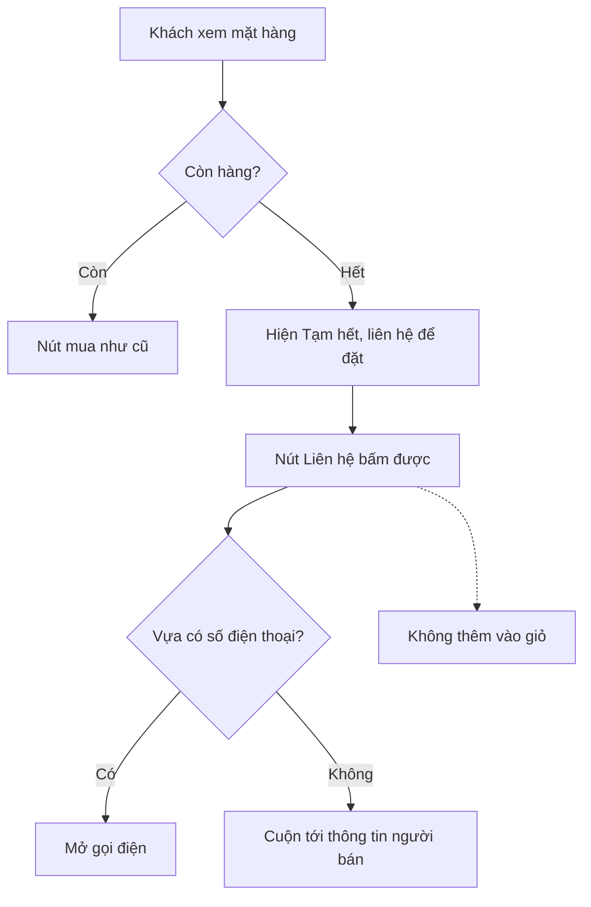

# Shop: mặt hàng hết hàng hiện nút "Liên hệ" (luồng NHANH, 2026-10-06)

Yêu cầu của Duy: "nếu mặt hàng bị hết thì button ko hiển thị hết hàng mà là Liên Hệ nhé".

## AC
1. Mặt hàng `sellable_qty <= 0`: nút không ghi "Hết hàng", không disabled; ghi **"Liên hệ"**, nút phụ (`btn-secondary`), bấm được.
2. Bấm "Liên hệ": có `seller.phone` thì mở `tel:` (bỏ khoảng trắng); không có số thì cuộn tới khối "Thông tin đơn vị bán hàng" ở footer (`#thong-tin-nguoi-ban`). Không bao giờ thêm vào giỏ.
3. Nhãn tồn ở thẻ mặt hàng và trang chi tiết: "Tạm hết · liên hệ để đặt".
4. Mặt hàng còn hàng: không đổi.
5. Giỏ hàng/checkout: giữ nguyên (BE vẫn chặn đặt quá tồn).
