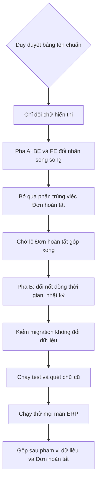

# 02b — Thiết kế kỹ thuật: lô áp tên chuẩn

> Tech Lead · 07/10/2026 · Luồng NHANH (chỉ đổi nhãn) · Nguồn: `doc/thuat-ngu-va-trang-thai.md` mục 4 (C1–C9, T1–T76, P1–P13),
> mục 2.10 (W1–W41). Duy duyệt mục 4 ngày 07/10 ("ok hết", Q-1..Q-5 theo đề xuất PO). Đọc trên `main` @ `d807a2d`.
> Quyết định nền: `doc/decisions.md` 06/10 "Một tên cho mỗi chứng từ".

## 0. Phạm vi và bất biến của lô

- **Chỉ đổi chữ hiển thị.** Không đổi giá trị DB (`DB` ở bảng T), không đổi `AuditLog.action`, không đổi khoá JSON, route hay
  codename quyền. Một ngoại lệ là khoá **phụ thêm** `auto_cancel_blocked_label` (T43). Khoá cũ giữ nguyên.
- Không đụng phần AI (W26–W28, W31, W36, W39, giá trị `ai` của `actor_kind` và `Entry.source`).
- Ngoài bảng tên, lô xử lý **W11** (Nhật ký dịch trạng thái theo `model_name`) và **W34** (nhãn chết ở `auditModel.ts`). Nếu không sửa
  W11 thì đổi chữ T23/T29/T30/T47 vẫn sai. W35 đã xong ở main (4 file không còn). W38 và W41 **không** thuộc lô này: W38 xem lại sau
  W37 L3, W41 cần story.
- Quy ước chung: mã `OTHER`/`other` của **lý do** (huỷ đơn, trả về nháp, gỡ bài) là "Lý do khác". `OTHER` của **loại** (chi phí mua,
  lý do giao thất bại) giữ "Khác".
- Dòng thời gian khoản tiền (T3–T7): bỏ đuôi "— chờ Chủ", **không** ghép thêm tình trạng xử lý. Dòng thời gian là lịch sử, còn tình
  trạng xử lý đã có chip riêng.

## 1. Bảng việc theo file

Tất cả nhãn lấy đúng cột "Chuẩn" và cột "Shop" ở mục 4. Bảng dưới chỉ ghi **file → dòng mục 4**, không chép lại chữ.

### 1.1 BE (`be-dev`), chạy song song với FE

| # | File | Việc | Dòng mục 4 |
|---|---|---|---|
| B1 | `backend/apps/sales/models/orders.py` | `Status.AUTO_CANCELLED` label | T2 |
| B2 | `backend/apps/sales/models/payments.py` | `MatchStatus` 5 nhãn, `Resolution` ATTACHED/CONFIRMED, `Source.WEBHOOK`, `Environment` 2 nhãn; `verbose_name(_plural)` | T3–T13, C5 |
| B3 | `backend/apps/sales/models/refunds.py` | `Method.GATEWAY`, `Status` 3 nhãn; `verbose_name` của field `payment` ("Giao dịch thanh toán (không hoá đơn)" → "Khoản tiền về (không hoá đơn)") | T20–T23, C5 |
| B4 | `backend/apps/sales/models/credit_notes.py` | `verbose_name(_plural)` | C2 (Q-1) |
| B5 | `backend/apps/sales/models/invoices.py` | `Meta.permissions` `confirm_payment_manual` | P1 |
| B6 | `backend/apps/sales/orders/services.py` (`CANCEL_REASON_LABELS`, `SYSTEM_CANCEL_REASON_CODES`) | 4 nhãn lý do huỷ | T15, T16, T18, T19 |
| B7 | `backend/apps/sales/orders/shop_labels.py` | `SHOP_ORDER_STATUS_LABELS` thêm `BOOKED` (cột Shop T1). Bảng giao hàng T24–T30 đã đúng, chỉ sửa docstring "chờ áp" | T1, T2, T24–T30 |
| B8 | `backend/apps/sales/orders/customer_notices.py` | `status_label` hoàn tiền phía Shop | T21, T22 (cột Shop) |
| B9 | `backend/apps/sales/orders/timeline.py` ⚠ va chạm W37 L3 | "Lập chứng từ đảo doanh thu" → P6; "Tạo phiếu hoàn" → P7; "Thử chuyển lại phiếu hoàn" → P7; "Mang hàng về kho" giữ; "Huỷ phiếu hàng về kho" → P5; "Duyệt hàng về kho: …" → P4; dòng tự huỷ đơn theo T2; "Tạo phiếu giao … (Soạn hàng)" theo T25 | C1–C3, P4–P7, T2, T25 |
| B10 | `backend/apps/sales/payments/timeline.py`, `sales/refunds/timeline.py`, `sales/orders/next_steps.py`, `sales/payments/next_steps.py` | "Nhận giao dịch thanh toán" → C5; "Tạo phiếu hoàn" → P7 | C3, C5, P7 |
| B11 | `backend/apps/delivery/models.py` | `DeliveryNote.Status` CONFIRMING/PREPARING/COMPLETED; `verbose_name` DeliveryNote và ConfirmationTask; `Meta.permissions` pack/assign; `ConfirmationTask.State.DONE`; `EscalationReason` 3 nhãn; `CustomerCall.Result` 4 nhãn | C4, C9, T24–T38, P9, P10 |
| B12 | `backend/apps/delivery/confirmation/serializers.py` | `escalation_label` WANT_CHANGE/WANT_CANCEL bỏ chữ riêng, dùng `get_escalation_reason_display()`; thêm khoá `auto_cancel_blocked_label` (T43) cạnh `auto_cancel_blocked` | T36, T37, T43 |
| B13 | `backend/apps/delivery/next_steps.py` (`ACTION_LABELS`) | `delivery_confirm_skipped`, `delivery_extended` | P11 |
| B14 | `backend/apps/inventory/models/stock.py` | `MovementType.WRITE_OFF`; `StockEntry.verbose_name` | T44, C7 |
| B15 | `backend/apps/inventory/models/returns.py` | `Decision.WRITE_OFF`; `verbose_name`; `Meta.permissions` | T45, C1 (Q-3), P4 |
| B16 | `backend/apps/inventory/returns/serializers.py` (`DECISION_LABELS`) và `returns/next_steps.py` (`ACTION_LABELS`) | WRITE_OFF; `return_to_warehouse`, `approve_returntostock`. **Xoá** `DECISION_LABELS`, dùng `get_decision_display()`, vì chú thích "không đổi choices để tránh migration" không còn đúng | T45, P4, P5 |
| B17 | `backend/apps/inventory/models/batches.py` | `Meta.permissions` `publish_batch`, `cancel_expired_batch`; comment "hạch toán lỗ" giữ được (tài liệu) | P2, P3 |
| B18 | `backend/apps/inventory/models/supplier_returns.py` | `verbose_name` | C8 |
| B19 | `backend/apps/purchasing/models/receipts.py` | `verbose_name` | C6 |
| B20 | `backend/apps/catalog/models/items.py` | `ItemType.BUNDLE`; `Meta.permissions` `change_item_image` | T50, P13 |
| B21 | `backend/apps/catalog/models/pricing.py` | `ApplyOn` 2 nhãn (phần "≥ N kg" chuyển sang chữ gợi ý ở form ERP) | T51, T52 |
| B22 | `backend/apps/catalog/items/next_steps.py` | Sửa lỗi khoá `item_image_upload` → `item_image_add` (BE ghi `item_image_add`, map đang dò sai). `admin_edit` theo T76 | T73, T76 |
| B23 | `backend/apps/content/models/entries.py` | `PAGE_ROLE_CHOICES` privacy/terms/refund. **Không** đụng `SOURCE_CHOICES` (phần AI) | T54–T56 (Q-5) |
| B24 | `backend/apps/accounts/models.py` | `StaffProfile.Status.INACTIVE`; `AuditLog.ActorKind.USER` | T48, T49 |
| B25 | `backend/apps/reports/models.py` | `Meta.permissions` `view_profitreport`, `view_dashboard` | P12 |
| B26 | `backend/apps/accounts/capabilities/registry.py` | Nhãn ma trận: `create_refund`, `assign_delivery`, `create_return` ("Ghi hàng hoàn"), `approve_return` | P4, P7, P9, C1 |
| B27 | `backend/apps/accounts/auth/services.py` (`CAPABILITY_LABELS`) ⚠ va chạm nhẹ PV Lô 4+5 | `create_refund`, `pack_deliverynote`, `assign_deliverynote`, `content.publish_entry` | P7, P9, P10, P13 |
| B28 | `backend/apps/accounts/data_scopes/catalog.py` | `label` của scope `returns` | C1 |
| B29 | `backend/apps/common/guidance/reasons.py` | Câu `BR-HT-04` dùng "phiếu hoàn tiền" | C3 |
| B30 | `backend/apps/{sales/customers,purchasing/receipts,accounts/staff}/next_steps.py` | `admin_edit` theo T76 (đồng bộ một chữ) | T76 |
| B31 | Migration (mục 2) | 8 file `AlterField`/`AlterModelOptions` + 1 data migration đổi `auth_permission.name` | — |

**BE không sửa:** `shop_api.py` (chỉ đọc `shop_labels.py`), mọi `record_audit("…")`, mọi `migrations/` đã có,
`apps/ai/**`, `common/ai_visibility.py`, `sales/orders/{api,scope}.py`.

### 1.2 FE (`fe-dev`), chạy song song với BE

**Nguồn duy nhất:** `erp-console/shared/lib/enums.ts`. Nhãn trạng thái hay lựa chọn có trong mục 4 chỉ được viết ở đây. Nơi khác lấy bằng
`ENUMS.x` / `enumLabel()`. Ô chọn dựng từ `Object.entries(ENUMS.x)` (cộng mục "Mọi …" nếu cần).

| # | File | Việc | Dòng mục 4 |
|---|---|---|---|
| F1 | `erp-console/shared/lib/enums.ts` | Sửa theo cột Chuẩn: `salesOrderStatus.AUTO_CANCELLED` = "Hết giờ giữ chỗ", tone `mute` (Q-2); `paymentMatchStatus`, `paymentSource`, `cancelReason` (đủ 6 mã, thêm UNREACHABLE và UNREACHABLE_AUTO), `refundMethod`, `refundStatus`, `deliveryStatus`, `confirmTaskState.DONE`, `confirmEscalationReason`, `confirmCallResult`, `unconfirmedDecision`, `stockMovementType.WRITE_OFF`, `returnToStockDecision.WRITE_OFF`, `pricingRuleActive.true`, `entryPageRole`, `entryReturnReason`, `entryUnpublishReason`. Thêm bảng `confirmQueueTab` (T39) | T2–T66 |
| F2 | **Xoá bản chép 1** `features/orders/labels.ts` | `QUEUE_TYPE_FILTERS` và `CANCEL_REASONS` dựng từ ENUMS. `STATUS_FILTERS` giữ nhóm lọc, nhãn đơn lẻ lấy từ ENUMS. Nhóm "Đã huỷ" vẫn gộp `CANCELLED,AUTO_CANCELLED` (Q-2) | T5, T15–T18 |
| F3 | **Xoá bản chép 2** `features/confirmation/confirmationUi.ts:253` (`CANCEL_REASON_CODES`) và `:86` (`PATH_STEPS` DONE) | Dựng từ `ENUMS.cancelReason` (lọc 3 mã) và `ENUMS.confirmTaskState` | T17, T18, T38 |
| F4 | **Xoá bản chép 3** `features/content/messages.ts:298-311` (`RETURN_REASONS`, `UNPUBLISH_REASONS`) | Dựng từ `ENUMS.entryReturnReason/entryUnpublishReason` | T58–T66 |
| F5 | **Xoá bản chép 4** `features/content/components/EntrySettings.tsx:16` (`PAGE_ROLE_OPTIONS`) | Dựng từ `ENUMS.entryPageRole` | T54–T57 |
| F6 | **Xoá bản chép 5, 6** `features/suppliers/suppliersModel.ts:10` (`TYPE_OPTIONS`), `features/suppliers/components/SupplierFormModal.tsx:32` (`TYPE_FIELD_OPTIONS`) | Dựng từ `ENUMS.supplierType` (nhãn không đổi, chỉ gom) | — |
| F7 | Các file khác đang tự chép nhãn trạng thái: `features/orders/orderDetailModel.ts:165-170` (thanh bước phiếu hoàn tiền), `features/orders/components/RefundQueueScreen.tsx:28-30`, `features/orders/messages.ts:262`, `features/deliveries/types.ts:112-113`, `features/deliveries/deliveryUi.ts:8-12`, `features/confirmation/types.ts:211` (tab "Cần gọi ngay"), `features/returns/returnsModel.ts:86`, `features/returns/messages.ts:36,53,83` | Lấy nhãn từ ENUMS | T21–T25, T28, T39, T45 |
| F8 | Tên chứng từ, tên việc trong chữ màn hình: `shared/lib/nav.ts:226-227` ("Hoàn tiền chờ chuyển", short "Hoàn tiền"), `nav.ts:348` ("Hàng hoàn"), `features/orders/messages.ts` (`refundTitle`, `refundSubmitNoAmount`, `tlRefundCreated`, `paymentsCaption`), `features/orders/orderDetailModel.ts:92-95,151` ("Lập phiếu hoàn tiền"), `features/reports/reportView.ts:47` (C2), `features/deliveries/deliveryUi.ts:30` (P9), `features/catalog/messages.ts:158,200` (T53), `features/confirmation/components/DecideModal.tsx` (đã dùng ENUMS, chỉ sửa comment) | C1–C3, C5, P6, P7, P9, T53 |
| F9 | `features/audit/auditModel.ts` ⚠ va chạm W37 L3 | Nhãn P1, P3–P9, P11 (sửa `cancel_unpaid_expired`/`order_auto_cancelled`/`auto_cancel` theo T2); **thêm** T67–T76 (18 mã, gồm cả `item_image_remove` = "Gỡ ảnh mặt hàng" mà bảng T73 bỏ sót); **W11**: `statusLabel` chọn bảng theo `row.model_name` (`sales.SalesOrder`→`salesOrderStatus`, `sales.Refund`→`refundStatus`, `delivery.DeliveryNote`→`deliveryStatus`, `inventory.Batch`→`batchStatus`, `inventory.StockReconciliation`, `inventory.ReturnToStock`), không dò lần lượt; **W34**: xoá nhãn của mã mà `grep record_audit` ở BE không thấy, bỏ `confirm_proposal` khỏi `AUDIT_FILTER_ACTIONS` | P1–P11, T67–T76, W11, W33, W34 |
| F10 | Chi tiết việc gọi xác nhận (`features/confirmation/components/` màn chi tiết) + `types.ts` | Thêm `auto_cancel_blocked_label: string \| null`. Khi khác null, hiện một dòng gợi ý dưới chip | T43 |
| F11 | `features/orders/components/RefundModal.tsx` | Ô chọn phương thức không hiện GATEWAY (chưa làm) | T20 |
| F12 | Mock ERP (phải khớp chữ BE, nếu không thì quét e2e mock báo sai): `features/orders/mock.ts:504,519-520,588,598,914-915`, `features/customers/mock.ts:70`, `features/guidance/mock.ts`, `features/confirmation/mock.ts:250,852`, `features/deliveries/mock.ts:33,65,464`, `features/auth/mock.ts:248,254`, `features/returns/mock.ts`, `features/audit/mock.ts:47`, `shared/lib/dashboardSummary.mock.ts:57` | Đổi chữ theo bảng | — |
| F13 | Shop `frontend/lib/mock.ts` ⚠ va chạm W37 L3 | `status_label` mock: BOOKED theo T1 Shop, hoàn tiền theo T21/T22 Shop. `OrderLookup.tsx` đã in `*_label`, không sửa | T1, T21, T22 |

**FE không sửa:** `erp-console/features/permissions/**` (nhánh `feat/pham-vi-fe` F1 đang giữ). Nhãn ma trận đến từ BE `registry.py` (B26), nên màn thật
vẫn đúng. Mock `features/permissions/mock.ts:37,40` còn chữ cũ, F1 tự sửa khi gộp, hoặc lô này sửa sau khi F1 đã gộp. Cũng không sửa `features/ai/**`,
`OrderDetailScreen.tsx` (W37 L3), `frontend/app/**`.

## 2. Migration

Đổi `choices` → `AlterField`; đổi `verbose_name`/`Meta.permissions` → `AlterModelOptions`. Cả hai chỉ đổi trạng thái migration của Django.
Trên Postgres, `sqlmigrate` phải ra **no-op** (không `ALTER TABLE`, không `UPDATE`).

| App | Migration sinh ra (`makemigrations <app>`) | Nội dung |
|---|---|---|
| `sales` | `0017_…` | AlterField: `salesorder.status`, `paymenttransaction.{match_status,resolution,source,environment}`, `refund.{method,status,payment}`; AlterModelOptions: `paymenttransaction`, `salescreditnote`, `salesinvoice` (permissions) |
| `delivery` | `0011_…` | AlterField: `deliverynote.status`, `confirmationtask.{state,escalation_reason}`, `customercall.result`; AlterModelOptions: `deliverynote`, `confirmationtask` |
| `inventory` | `0010_…` | AlterField: `stockledgerentry.movement_type`, `returntostock.decision`; AlterModelOptions: `stockentry`, `returntostock`, `batch`, `batchsupplierreturn` |
| `catalog` | `0004_…` | AlterField: `item.item_type`, `pricingrule.apply_on`; AlterModelOptions: `item` |
| `content` | `0003_…` | AlterField: `entry.page_role` |
| `accounts` | `0016_…` (tự sinh) + `0017_rename_permission_labels` (viết tay) | AlterField: `staffprofile.status`, `auditlog.actor_kind`. 0017 xem dưới |
| `reports` | `0003_…` | AlterModelOptions (permissions) |
| `purchasing` | `0004_…` | AlterModelOptions: `purchasereceipt` |

**Bẫy phải xử lý:** Django **không** cập nhật `auth_permission.name` của quyền đã có khi đổi `Meta.permissions`. `post_migrate` chỉ tạo quyền
thiếu. Nếu chỉ chạy migration tự sinh, Django Admin vẫn hiện "Publish lô ra Shop". Vì vậy cần `accounts/0017_rename_permission_labels`:
- `RunPython` cập nhật `Permission.name` theo `(app_label, codename)` cho đúng các quyền P1, P2, P3, P4, P9, P10, P12, P13. Dependencies là
  migration mới nhất của 8 app trên. Có hàm reverse trả về tên cũ. Idempotent: `filter(...).update(name=...)`, chạy hai lần kết quả như nhau.
- Chỉ đụng bảng `auth_permission`, cột `name`. Không đụng `codename`, gán Group, hay dữ liệu nghiệp vụ.
- Tên quyền mặc định "Can add …" theo `verbose_name` cũ giữ nguyên. Chỉ Admin kỹ thuật thấy và không có trong mục 4.

**Xác nhận:**
1. Không đổi giá trị DB. Test B-T2 (mục 3) khoá danh sách `value` của mọi `choices` đã sửa.
2. Không đổi `AuditLog.action`: lô không sửa chuỗi trong `record_audit(...)`. Review dùng `git diff main -- backend | grep -n 'record_audit\|action ='`, kết quả phải rỗng.
3. `makemigrations --check --dry-run` sạch sau khi thêm migration; `sqlmigrate` các file tự sinh không có SQL thật.

## 3. Kiểm thử

### 3.1 BE: `backend/apps/common/tests/test_standard_names.py` (mới)
Một file, chia lớp theo bảng mục 4. Mỗi dòng là một cặp (mã dòng, giá trị mong đợi), để lỗi in đúng mã T/C/P.
- **B-T1 nhãn:** `Model.Field(value).label` cho T2–T13, T15–T38 (phần có choices), T44–T56; `CANCEL_REASON_LABELS` T14–T19;
  `get_escalation_reason_display` T35–T37; `SHOP_*_STATUS_LABELS` cột Shop T1, T2, T24–T30; `customer_notices` T21/T22 Shop.
- **B-T2 giá trị DB không đổi:** `[c.value for c in X.choices]` bằng danh sách đóng băng, cho mọi field ở bảng migration.
- **B-C:** `_meta.verbose_name` và `verbose_name_plural` cho C1–C9.
- **B-P:** `dict(Model._meta.permissions)[codename]` cho P1–P4, P9, P10, P12, P13; `registry.py` theo khoá capability; `CAPABILITY_LABELS`
  theo perm; sau migrate thì `Permission.objects.get(codename=…).name` đúng (bắt bẫy mục 2).
- **B-timeline:** dựng đơn có huỷ, phiếu hoàn tiền, phiếu trừ doanh thu, hàng hoàn, rồi assert `build_timeline` không chứa
  "đảo doanh thu", "phiếu hàng về kho", "hàng về kho:", "Tạo phiếu hoàn ", "hạch toán", "chờ Chủ", "Webhook".
- **B-T43:** API chi tiết việc gọi có `auto_cancel_blocked_label` đúng chữ khi code là `BR-LO-05`, `null` khi rỗng.
  `auto_cancel_blocked` giữ giá trị cũ.
- **B-T73:** guidance timeline của mặt hàng có dòng `item_image_add` thì in "Thêm ảnh mặt hàng", không in "Có thay đổi".
- Cập nhật các test cũ đang khoá chữ cũ (khoảng 24 file, ví dụ `orders/tests/test_timeline_*.py`, `capabilities/tests/test_registry.py`,
  `auth/tests/test_s47_me_labels.py`, `delivery/tests/test_confirmation_escalation.py`). Chỉ đổi chuỗi mong đợi, không nới assert.

Lệnh: `manage.py test` (toàn bộ), `makemigrations --check --dry-run`, `sqlmigrate` 8 file, `python3 scripts/check_naming.py`.

### 3.2 Vitest ERP
- `erp-console/shared/lib/enums.standardNames.test.ts` (mới): bảng `[mã dòng, bảng ENUMS, mã, nhãn]` cho mọi dòng T có ở ERP;
  `actionLabel()` cho T67–T76 và P1, P3–P9, P11; nav `Hàng hoàn`, `Hoàn tiền chờ chuyển`.
- `erp-console/shared/lib/noLabelCopies.test.ts` (mới): đọc bằng `fs` mọi `features/**/*.ts(x)`, `shared/**/*.ts(x)` (trừ `*.test.ts`)
  rồi assert **không** chứa chuỗi trong danh sách cấm (3.3, nhóm A). Mock cũng bị quét, nên mock lệch là đỏ.
- `auditModel.test.ts`: W11 FAILED của `delivery.DeliveryNote` → "Giao thất bại", của `sales.Refund` → "Hoàn thất bại";
  DRAFT của `inventory.ReturnToStock` → "Chờ duyệt".
- Sửa `enums.test.ts` (đoạn "AUTO_CANCELLED hiện là Đã huỷ", "hai nhãn WRITE_OFF") và các test đang khoá chữ cũ (`confirmationUi`,
  `orderDetailModel`, `queueModels`, `returns`, `deliveryUi`, `deliveries_assign_failure`, `pickSheet`).

Lệnh: `npx vitest run`, `tsc --noEmit`, `npm run build` (ERP và Shop), `npm ci` sạch.

### 3.3 E2E: `erp-console/e2e/standard_names_all_routes.py` (mới, theo mẫu `ai_text_hidden_all_routes.py`)
Quét toàn bộ `ROUTES` của mẫu đó với vai `owner`, chạy hai lần: bản build mock và BE thật (staging local, dữ liệu giả có đủ trạng thái).
Thêm Shop `/shop/orders/` tra đơn mock ở các trạng thái BOOKED, AUTO_CANCELLED, có hoàn tiền, có phiếu giao.

**Nhóm A, cấm ở mọi nơi (so chuỗi con trên `innerText`):**
`TTL` · `Webhook` · `Sandbox` · `Production` · `chờ Chủ` · `Khớp — đã xác nhận` · `Về sau khi đơn tự huỷ` · `Hư khi đóng hàng` ·
`Hư hỏng khi soạn hàng` · `Bỏ sau khi giao thất bại` · `Bỏ giao sau khi thất bại` · `chưa hiện thực` · `Hàng hoàn về kho` ·
`Trả hàng về kho` · `trả về kho` · `hàng về kho:` · `phiếu hàng về kho` · `đảo doanh thu` · `hoá đơn điều chỉnh` · `phiếu giảm trừ` ·
`Phiếu hoàn chờ chuyển` · `Lập phiếu hoàn` (regex `phiếu hoàn(?! tiền)`, không phân biệt hoa thường) · `Tạo phiếu hoàn` ·
`Thử hoàn lại` · `Publish` · `hạch toán` · `Huỷ bỏ, ghi lỗ` · `Mục chờ gọi CSKH` · `Phiếu giao hàng` · `Giao dịch thanh toán` ·
`Phiếu nhập kho` · `Phiếu điều chỉnh kho` · `Trả NCC` · `Trả lô về nhà cung cấp` · `Giao không xác nhận` · `Gia hạn thêm` ·
`Gia hạn giao` · `Bỏ qua bước` · `Cần gọi ngay` · `Xác nhận thanh toán thủ công` · `Giao phiếu cho người giao` · `Gán phiếu giao` ·
`Đóng gói phiếu giao` · `Điều khoản mua hàng` · `Đổi trả hoàn tiền` · `Combo dạng gói` · `Khách muốn đổi món –` · `BR-`.

**Nhóm B, cấm theo ngữ cảnh (so bằng nguyên text của chip hoặc ô; không cấm toàn trang vì trùng chữ chuẩn khác):**
- Chip phiếu giao (`/deliveries/`, `/my-deliveries/`, chi tiết đơn): `Chờ xác nhận`, `Soạn hàng`, `Hoàn tất`.
  "Soạn hàng" là tên việc P10, chỉ cấm khi là chip.
- Chip việc gọi (`/confirmation/`): `Hoàn tất`, `Sai số`, `Khách muốn huỷ`, `Khách muốn đổi`.
- Chip phiếu hoàn tiền: `Chờ hoàn`, `Đã hoàn`, `Thất bại`.
- Chip đơn AUTO_CANCELLED: phải là `Hết giờ giữ chỗ`, không phải `Đã huỷ`.
- `/catalog/` cột ưu đãi: `Đang bật`. `/content/` vai trò trang: `Bảo mật` đứng một mình.
- `/audit-logs/` cột Thao tác: `Thao tác khác` (không cấm nút "Thao tác khác" của `MoreMenu`). Cột Người: `Người dùng`.
- Shop tra đơn: mã thô `CONFIRMING|PREPARING|READY|DELIVERING|COMPLETED|FAILED|CANCELLED|BOOKED|AUTO_CANCELLED` ở bất kỳ đâu.

Kèm theo, QA so tay từng dòng C, T, P với màn thật như PO đề xuất. Django Admin thì kiểm C1–C9 và P1–P13 bằng ảnh chụp (dữ liệu giả).

## 4. Va chạm và thứ tự

| Đang chạy | File chung với lô này | Cách tránh |
|---|---|---|
| W37 L3 BE (`feat/w37-l3-be`, đã có commit) | `sales/orders/timeline.py` (B9) | B9 làm **sau** khi L3 BE gộp. L3 thêm nhãn "Đã giao — đơn hoàn tất" và "Hệ thống chuyển đơn sang Hoàn tất (chuyển bù)". Nhãn **đơn** vẫn là "Hoàn tất" nên không xung đột chữ |
| W37 L3 FE (`feat/w37-l3-fe`, chưa có commit) | `auditModel.ts` (F9), `frontend/lib/mock.ts` (F13), `orderDetailModel.ts` (F7, F8, cùng vùng thanh bước) | F9, F13 và phần `orderDetailModel.ts` làm **sau** khi L3 FE gộp. Không đụng `OrderDetailScreen.tsx` |
| PV Lô 4+5 BE (`feat/pham-vi-du-lieu`, APPROVED, chưa gộp) | `auth/services.py` (B27, khác dòng), `confirmation/serializers.py` (B12, khác hàm con), `refunds/next_steps.py` (lô này không sửa) | Nên gộp PV trước. Lô này rebase sau; xung đột nếu có chỉ là chữ |
| F1 FE (`feat/pham-vi-fe`) | `features/permissions/**` | Lô này **không** sửa thư mục này (mục 1.2) |

**Thứ tự đề xuất:**
1. **Pha A (làm ngay, song song W37 L3):** BE B1–B8, B10–B31 (trừ B9); FE F1–F8 (trừ phần `orderDetailModel.ts`), F10–F12. Test 3.1 và 3.2,
   trừ phần timeline và auditModel.
2. **Pha B (sau khi W37 L3 BE và FE gộp vào main):** rebase; B9 + test B-timeline; F9 + W11 test; F13; phần `orderDetailModel.ts`.
   Rồi chạy e2e 3.3.
3. Thứ tự gộp: PV Lô 4+5 BE → W37 L3 → lô áp tên chuẩn. Migration lô này đánh số sau mọi migration đã ở main lúc gộp. Hiện chưa nhánh
   nào thêm migration cho 8 app, nhưng be-dev vẫn phải `makemigrations` lại sau rebase nếu số trùng.

Nếu điều phối viên muốn gọn thì bỏ Pha A, làm cả lô sau khi W37 L3 gộp. Lô nhỏ nên chỉ chậm hơn chừng nửa ngày.

## 5. Rủi ro bắt buộc

| Rủi ro | Cơ chế chặn | Test bắt |
|---|---|---|
| Giá vốn | Lô không thêm field. Chỉ thêm khoá `auto_cancel_blocked_label` (chuỗi hằng) | Test giá vốn hiện có xanh y nguyên |
| Dữ liệu cá nhân | Nhãn là hằng, không ghép `reason`/`note`/SĐT. B12 bỏ chữ riêng chứ không ghép thêm. Shop chỉ nhận `*_label` hằng | `test_timeline_privacy.py`, `test_timeline_no_free_text.py` xanh |
| Phân quyền | Không đổi codename, Group, hay `requires`. Data migration chỉ đổi `Permission.name` | `capabilities/tests/*`, B-P; ma trận e2e `ed_batch14_permissions.py` (chữ mới) |
| Chứng từ / dữ liệu | Không `UPDATE` bảng nghiệp vụ, không đổi giá trị choices | B-T2; `sqlmigrate` no-op; review grep `record_audit` |
| Chữ cũ sót ở chỗ lạ (mock, comment chuỗi UI) | Vitest quét nguồn (3.2) + e2e nhóm A/B | 3.2, 3.3 |
| Code đang so sánh với nhãn | Đã grep BE: không có `get_*_display() ==` hay `.label ==` | — |

## 6. Câu hỏi còn mở

Mục 4.4 (Q-1..Q-5) đã chốt, nên **không còn câu hỏi 🔴 nào trong mục 4**. Ba điểm Tech Lead tự quyết, ghi lại để Duy biết:
- T3–T7: không ghép "Chờ xử lý" vào dòng thời gian (mục 0).
- T73: thêm `item_image_remove` = "Gỡ ảnh mặt hàng" (bảng bỏ sót). Sửa luôn lỗi khoá `item_image_upload` ở BE (B22).
- C2 (Q-1) kéo theo việc BA sửa chữ "chứng từ đảo doanh thu" trong spec BR-HT-06/10 (theo 4.4). Đây là việc tài liệu, không thuộc be-dev/fe-dev.
  Docstring và comment trong code được giữ chữ cũ, vì không hiện cho người dùng.

## 7. Review

_(chưa có)_
