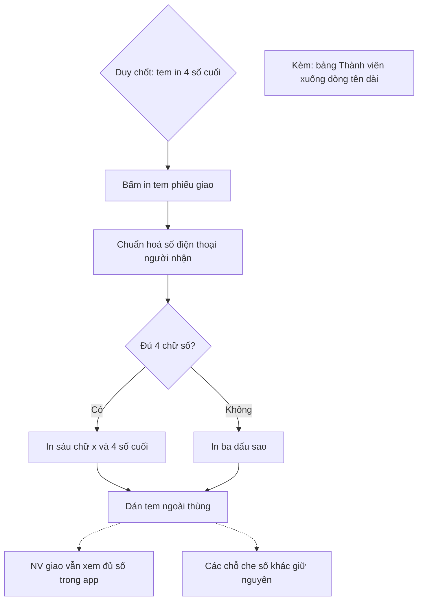

# Tem in chỉ hiện 4 số cuối SĐT người nhận — luồng NHANH

Trạng thái: ĐÃ DUYỆT (Duy, 10/10/2026: "in 4 số cuối thôi"). Trả lời Q1 của `doc/features/2026-10-02-pham-vi-du-lieu-cau-hinh/02c-quyet-dinh-08-10.md`.

Hiện tại tem (`GET /api/delivery/notes/<id>/label/`) in SĐT người nhận dạng `09xx xxx 123` (`mask_phone`: 2 số đầu, 3 số cuối).
Tem dán ngoài thùng nên ai cầm thùng cũng đọc được. Duy chốt: tem chỉ để lộ **4 số cuối**.
NV giao vẫn có SĐT đầy đủ trong app như cũ, không đổi.

## TEM-01 · Must · BE + FE (mock)
| AC | Cho | Khi | Thì |
|---|---|---|---|
| AC1 | Phiếu giao có SĐT người nhận `0901234567` | in tem | `recipient_phone_masked` = `xxxxxx4567` (đúng 6 ký tự `x` rồi 4 số cuối; hiển thị không có chữ số nào khác ngoài 4 số cuối) |
| AC2 | SĐT dạng `+84 901 234 567`, `84901234567`, có dấu cách/chấm | in tem | chuẩn hoá trước rồi che như AC1 (4 số cuối `4567`) |
| AC3 | SĐT rỗng hoặc dưới 4 chữ số | in tem | trả `***`, không lỗi |
| AC4 | Hàng chờ gọi xác nhận, quét nội dung bài viết, AI và mọi chỗ khác đang dùng `mask_phone` | — | **không đổi** định dạng (chỉ tem đổi) |
| AC5 | Mock ERP tem | — | mock trả cùng định dạng mới; màn in tem hiện đúng chuỗi |
| AC6 | Mọi API khác | — | không trả thêm chữ số SĐT nào; không ghi SĐT vào log |

Không migration. Không đổi tên khoá JSON (`recipient_phone_masked` giữ nguyên).

## L2 (nợ Lô 6+7, cùng lượt) · FE
Bảng Thành viên ở 360: tên đăng nhập rất dài (22–150 ký tự) đẩy nút "Bỏ khỏi nhóm" ra ngoài khung.
AC: ở 360 và 1280, tên đăng nhập 52 và 150 ký tự xuống dòng trong ô Nhân viên (`overflow-wrap: anywhere`), nút nằm trong khung, không cuộn ngang.
