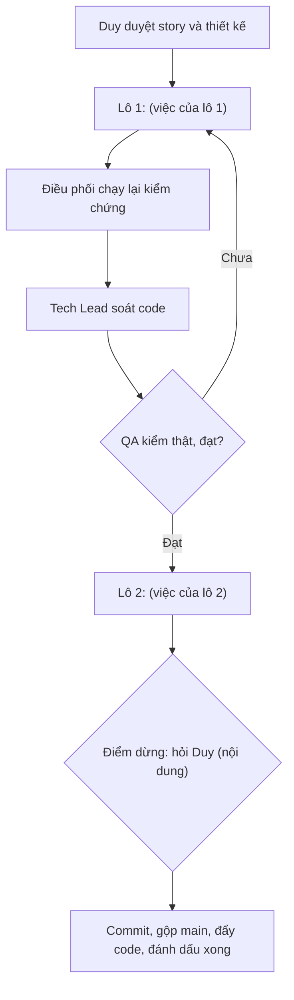

# Giao việc — <tên tính năng>

> Claude (Tech Lead) · <ngày> · Trạng thái: **NHÁP** | **SẴN SÀNG CODE** (Duy duyệt ngày …) | **XONG**
> Người hiện thực: đội Claude (`be-dev` ∥ `fe-dev`, `mkt-brand` khi đụng nội dung) → `techlead` review → `qa-tester`, theo quy trình lô trong `CLAUDE.md` (Gemini/AGY tạm dừng từ 30/09).
> Nhánh làm việc: mỗi lô một nhánh `<đợt>/lo-<n>-<slug>` tách từ `main`; QA APPROVED thì commit theo pathspec, gộp `main`, push.

## Điều kiện đầu vào
- `02-stories.md`: ĐÃ DUYỆT (ngày …) · `02b-tech-design.md`: ĐÃ DUYỆT (ngày …)
- Việc phải xong trước (lỗi có sẵn, migration, hồ sơ khác): …

## Lô
| ☐/☑ | Lô | Story | BE / FE | Được sửa (thư mục/file) | Không được đụng | Commit |
|---|---|---|---|---|---|---|
| ☐ | 1 | S01, S02 | BE ∥ FE | `backend/apps/<app>/`, `erp-console/features/<x>/` | `decisions.md`, migration cũ | — |

## Mỗi lô: điều kiện xong
- Lệnh kiểm chứng (dán output vào `03-dev-notes.md`): …
- Test bắt buộc: phân quyền theo từng vai, không rò giá vốn, không rò dữ liệu cá nhân, AC mã …
- `techlead` review diff, rồi QA APPROVED (`04-qa-report.md`, không PASS bằng đọc code).

## Điểm dừng hỏi Duy
- Contract/thiết kế không khớp code → ghi "Lệch thiết kế" trong `03-dev-notes.md`, dừng lô.
- Bất kỳ việc nào đụng tiền, giá vốn, phân quyền ngoài phạm vi story.
