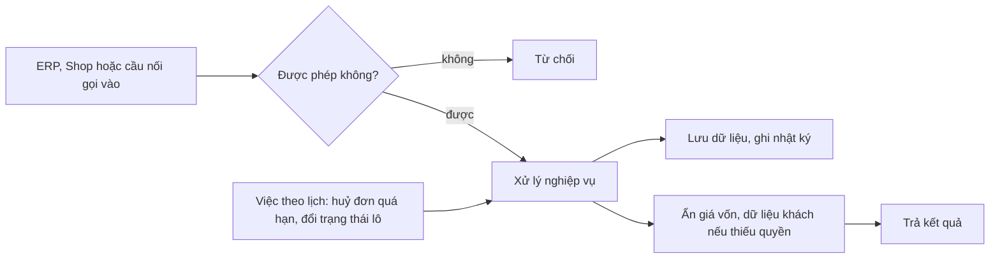

# Backend (Django + DRF)

> Cập nhật 02/10/2026, theo code `main` `bf62b81`.
> Bản đồ module chi tiết hơn: `backend/README.md` và `backend/apps/<app>/README.md`. Khi các README đó lệch code, xem mục "Doc cũ lệch code" cuối file này.



## Cấu trúc

```
backend/
  manage.py                cửa vào lệnh quản trị (runserver, test, migrate, job)
  config/
    settings.py            "bảng công tắc": DB, app, bảo mật, mọi tham số nghiệp vụ đọc từ env
    urls.py                /admin/ (Django Admin) và /api/
    api_urls.py            danh bạ toàn bộ route /api/...
    celery.py              job nền Celery (chỉ dùng khi chạy máy có Redis; Cloud Run dùng Cloud Run Job)
  apps/<app>/              một app = một miền nghiệp vụ
    models/ hoặc models.py bảng dữ liệu
    <module>/              services.py (nghiệp vụ) · api.py (endpoint) · serializers.py · tests/ · README.md
    management/commands/   lệnh chạy tay hoặc theo lịch
    migrations/
  Dockerfile               image Cloud Run (gunicorn)
  requirements.txt         thư viện Python
  .env.example             mẫu biến môi trường (chép thành .env, không commit .env)
```

Quy tắc code:
- Nghiệp vụ chỉ nằm trong `services.py`. `api.py` nhận input, kiểm quyền, gọi service, trả JSON.
- Module gọi module khác qua `services` của module đó.
- Lỗi nghiệp vụ raise `apps.common.exceptions.BusinessError` (thông điệp tiếng Việt, kèm mã BR). Handler ở `apps/common/api.py` đổi thành HTTP 400.
- Định danh tiếng Anh chuẩn, không viết tắt tiếng Việt. Kiểm bằng `python3 scripts/check_naming.py` ở gốc repo.

## Các app

| App | Làm gì | Model chính | Endpoint chính (`/api/...`) |
|---|---|---|---|
| `accounts` | Nhân viên, nhóm quyền, đăng nhập, nhật ký, dữ liệu demo | `StaffProfile`, `AuditLog`, `DemoRecord` (+ `User`, `Group` của Django) | `auth/token/`, `auth/me/`, `auth/logout/`, `auth/change-password/`; `staff/` (+ `groups`, `deactivate`, `reactivate`, `reset-password`); `audit-logs/` |
| `catalog` | Mặt hàng, combo, bảng giá, ưu đãi, ảnh mặt hàng (P-01) | `ItemGroup`, `Item`, `BundleLine`, `PriceList`, `ItemPrice`, `PricingRule`, `ItemImage` | `catalog/items/`, `catalog/item-groups/`, `catalog/bundle-lines/`, `catalog/price-lists/`, `catalog/item-prices/`, `catalog/pricing-rules/`, `catalog/items/{id}/image/`; Shop: `shop/catalog/`, `shop/catalog/{item_code}/` |
| `purchasing` | Nhà cung cấp, phiếu nhập sinh lô, hoá đơn mua, chi phí phụ (P-02, P-03) | `Supplier`, `PurchaseReceipt`, `PurchaseReceiptLine`, `PurchaseInvoice`, `PurchaseCost`, `PurchaseCostAllocation` | `purchasing/suppliers/`, `purchasing/receipts/` (+ `submit`, `cancel`), `purchasing/receipts/receive-batches/`, `purchasing/invoices/`, `purchasing/costs/` |
| `inventory` | Lô, sổ kho, kho, phiếu điều chỉnh, kiểm kê, hàng hoàn, trả NCC (P-04, P-08, P-09) | `Warehouse`, `Batch`, `StockLedgerEntry`, `StockEntry`, `StockReconciliation(+Line)`, `ReturnToStock`, `BatchSupplierReturn` | `inventory/batches/` (+ `publish`, `close`, `cancel-expired`, `return-to-supplier`), `inventory/warehouses/`, `inventory/ledger/`, `inventory/stock-entries/`, `inventory/reconciliations/` (+ `approve`), `inventory/returns/` (+ `approve`) |
| `sales` | Khách, đơn, hoá đơn, thanh toán, hoàn tiền, chứng từ đảo (P-05, P-07) | `Customer`, `SalesOrder(+Line, +LineBatch)`, `SalesInvoice(+Line, +LineBatch)`, `PaymentTransaction`, `Refund`, `SalesCreditNote(+Line)` | Shop: `shop/orders/`, `shop/orders/{code}/`, `shop/orders/{code}/checkout/`; nội bộ: `sales/orders/` (+ `cancel`, `confirm-payment`), `sales/invoices/`, `sales/payments/` (+ `resolve`), `sales/refunds/` (+ `create`, `confirm`, `mark-failed`, `retry`), `sales/customers/`; adapter: `internal/payments/sepay-ipn/`, `internal/payments/sepay-webhook/` |
| `delivery` | Phiếu giao, gọi xác nhận đơn, in tem (P-06, P-08) | `DeliveryNote`, `ConfirmationTask`, `CustomerCall`, `LabelPrint` | `delivery/notes/` (+ `status`, `label`, `label/print`, `label/void`); `confirmation/queue/` (+ `claim`, `calls`, `unconfirm`, `recipient`, `decide`); `confirmation/search/`; `dashboard/attention/` |
| `reports` | Lãi lỗ theo lô và theo tháng, bảng điều hành (P-10). Không có bảng riêng, tính lại từ chứng từ | `ProfitReport` (chỉ để giữ quyền) | `reports/batch/{batch_id}/`, `reports/period/`, `dashboard/summary/` |
| `content` | CMS: bài viết, trang chính sách, chuyên mục, ảnh bài | `Entry`, `EntryVersion`, `Category`, `ContentImage` | `content/entries/` (+ `publish`, `unpublish`, `submit`, `return`, `versions`...), `content/categories/`, `content/images/`, `content/golive-status/`; công khai: `public/content/...`, `public/site-info/` |
| `ai` | Lớp lệnh AI Native: chỉ mục lệnh, gọi lệnh, việc AI, cấu hình và chính sách AI, báo cáo AI | `AiAction`, `AiConfigVersion`, `AiPolicyVersion` | `ai/commands/index/`, `ai/commands/{id}/`, `ai/commands/{id}/call/`, `ai/actions/` (+ `confirm`, `reject`, `undo`, `escalate`), `ai/my-config/`, `ai/policy/`, `ai/report/daily/` |
| `common` | Dùng chung, không có model | | `guidance/{doc_type}/{doc_id}/` ("Tiếp theo · Đã làm") |

Ba nhóm route theo cách xác thực:
- **Shop và công khai** (`shop/*`, `public/*`): không đăng nhập, có giới hạn tần suất (`THROTTLE_*`). Không bao giờ trả dữ liệu cá nhân đầy đủ hay giá vốn.
- **Nội bộ** (còn lại): Token DRF (ERP) hoặc Session (Django Admin, browsable API) và kiểm quyền.
- **Internal** (`internal/*`): chỉ adapter gọi, header `X-Internal-Token` bằng `INTERNAL_SERVICE_TOKEN`.

Django Admin ở `/admin/`: field trạng thái, tồn, giá vốn khoá chỉ đọc với người không phải superuser. Superuser sửa thì ghi `AuditLog`.

## Phân quyền

### Năm nhóm (Group), cộng dồn

| Group | Ai | Ghi chú |
|---|---|---|
| `owner` | Lộc (Chủ) | Toàn quyền nghiệp vụ, kể cả tiền và giá vốn |
| `manager` | Quản lý | Duyệt vận hành, không đụng tiền và giá vốn |
| `warehouse_staff` | NV kho | Nhập lô, soạn hàng, kiểm kê |
| `delivery_staff` | NV giao | Chỉ thấy phiếu giao được gán cho mình |
| `customer_service` | CSKH | Gọi xác nhận đơn, đổi thông tin nhận hàng |

Một người có thể ở nhiều nhóm (ví dụ NV kho kiêm giao). Tên nhóm đổi sang tiếng Anh ở P8b (migration `accounts/0013`, giữ id).
Tên cũ (`chu`, `quan_ly`, `nv_kho`, `nv_giao`, `cskh`) bị từ chối ở đường ghi. Hằng tên nhóm chỉ nằm ở `apps/accounts/roles.py` (BE) và `erp-console/shared/lib/roles.ts` (ERP).

### Ba tầng

| Tầng | Cơ chế | Ở đâu |
|---|---|---|
| 1. CRUD theo model | `auth.Permission` gán cho Group qua data migration | `BusinessModelPermissions` trong `apps/common/api.py`; migration `accounts/0002`, `0003`, `0011`, `0012` |
| 2. Hành động tuỳ biến | `Meta.permissions`, khai bằng `@action(required_perms=...)` | Xem bảng dưới |
| 3. Phạm vi dòng và cột | `get_queryset` lọc dòng; serializer ẩn cột giá vốn và dữ liệu cá nhân | `CostFieldSerializerMixin` (`apps/common/api.py`), `delivery/confirmation/scope.py` |

Quyền Tầng 2 hiện có trong code:

| App | Quyền |
|---|---|
| `inventory` | `publish_batch`, `close_batch`, `view_costprice`, `cancel_expired_batch`, `approve_stockreconciliation`, `approve_returntostock` |
| `sales` | `cancel_paid_order`, `view_privacy_consent`, `confirm_payment_manual`, `create_refund`, `confirm_refund` |
| `delivery` | `confirm_with_customer`, `change_recipient`, `decide_unconfirmed`, `pack_deliverynote`, `print_label` |
| `reports` | `view_profitreport`, `view_dashboard` |
| `accounts` | `manage_staff` (+ `view_auditlog`) |
| `catalog` | `change_item_image` |
| `content` | `publish_entry` |
| `ai` | `manage_ai_policy` |

Gán quyền cho nhóm nào: xem `doc/business-process-spec.md` §1.4, §1.5 và các data migration trong `apps/*/migrations/`. Spec §1.3 vẫn ghi "bốn nhóm"; nhóm thứ năm `customer_service` đến từ hồ sơ `2026-09-28-cskh-xac-nhan-in-tem`.

### Đăng nhập
- ERP gọi `POST /api/auth/token/` lấy Token DRF, gửi kèm header `Authorization: Token ...`.
- Người còn mật khẩu tạm (`StaffProfile.must_change_password`) bị chặn mọi API (BR-PQ-19), trừ view khai `allow_must_change_password = True` (đổi mật khẩu...). Django Admin cũng chặn (`AdminMustChangePasswordMiddleware`).
- Đăng nhập có giới hạn tần suất (`THROTTLE_LOGIN_IP`, `THROTTLE_LOGIN_USER`).

## Job nền

Production không có Celery/Redis. Job chạy bằng **Cloud Run Job + Cloud Scheduler** gọi `manage.py <lệnh>`. Không có endpoint HTTP để kích job.
Mọi job đều idempotent (chạy lại không làm hai lần). Log job chỉ ghi mã, không ghi tên, SĐT, địa chỉ.

| Lệnh | Việc | Lịch khuyến nghị |
|---|---|---|
| `cancel_expired_orders` | Huỷ đơn giữ chỗ quá TTL, nhả hàng (BR-BH-03/04) | Production `cangca-ttl` mỗi 15 phút. Celery beat (nếu dùng) mỗi phút |
| `check_ttl_job_health` | Exit 1 nếu còn đơn `BOOKED` quá hạn lâu hơn `TTL_JOB_HEALTH_GRACE_MINUTES` | Theo dõi |
| `update_batch_status` | Đổi lô sang cận hạn / quá hạn (BR-LO-01/02/06) | 00:05 giờ VN (`cangca-batch-status`) |
| `process_confirmation_deadlines` | Nhắc gọi, chuyển Quản lý, tự huỷ (nếu bật) | Mỗi 5 phút |
| `check_confirmation_job_health` | Giám sát job trên, exit 1 thì cảnh báo | Mỗi 15 phút |
| `run_due_ai_actions` | Chạy việc AI mức B tới hạn, hạ mức, chuyển việc quá hạn lên Chủ | Mỗi 5 phút khi bật AI |
| `auto_confirm_exact_payments` | Tự khớp giao dịch chuyển khoản khớp tuyệt đối (DW-26) | Chỉ staging, khi `AI_PRODUCTION_READY=1` |

Lịch thật và job nào đã tạo: `doc/ops/moi-truong.md` mục "Lịch chạy các job".

## AI Native (app `ai`)

Không có model ngôn ngữ nào chạy ở backend. Backend lo **lệnh, quyền và nhật ký**:
- **Lệnh tự sinh** từ API DRF: `registry/discovery.py` quét các ViewSet và `@action`, đọc khai báo `ai=AiMeta(...)` (`apps/ai/declare.py`), sinh `CommandSpec`.
  Nhóm lệnh và mức nhạy cảm là hằng ở `apps/ai/command_groups.py` (`purchasing`, `sales`, `customer_service` / `high`, `medium`, `low`).
- **Gọi lệnh** qua một cửa: `POST /api/ai/commands/{id}/call/` (`execution/pipeline.py`). Phân quyền 3 tầng áp nguyên cho kênh AI.
  Kết quả được lọc bỏ giá vốn và dữ liệu cá nhân (`execution/scrub.py`).
- **Danh sách cấm**: `apps/ai/policy/rules.py` (`FORBIDDEN_PREFIXES` gồm `/api/shop/`, `/api/internal/`, `/api/auth/`, `/api/public/`, `/api/confirmation/`, `/api/cskh/`, `/api/staff/`...). Route mới có trả dữ liệu khách phải thêm vào đây.
- **Mức tự chủ**: A = đọc; C = AI soạn, người bấm xác nhận; B = AI ghi rồi cho hoàn tác hoặc trì hoãn. Mỗi lần ghi là một `AiAction`, id của nó là `proposal_ref` trong `AuditLog` (`actor_kind = ai`).
- **Cấu hình**: Chủ đặt chính sách (`AiPolicyVersion`, quyền `manage_ai_policy`), từng người có "AI của tôi" (`AiConfigVersion`). Cả hai lưu theo phiên bản, có công tắc tắt khẩn.
- **Biến môi trường**: `AI_ENABLED` (công tắc gốc, mặc định tắt), `AI_WRITE_LEVELS_ALLOWED` (`C` mặc định), `AI_PRODUCTION_READY` (chỉ `1` ở staging), và các trần `AI_DAILY_LIMIT_*`, `AI_UNDO_WINDOW_MINUTES`...
- Phần chạy model trên máy người dùng nằm ở ERP (`erp-console/features/ai/runtime/`), xem `erp-console.md`.

## Tham số nghiệp vụ (env, đọc trong `config/settings.py`)

| Biến | Mặc định trong code | Ý nghĩa |
|---|---|---|
| `BATCH_DEFAULT_SHELF_LIFE_DAYS` | 365 | Hạn dùng mặc định của lô (decisions 2026-09-26) |
| `BATCH_NEAR_EXPIRY_DAYS` | 14 | Ngưỡng cận hạn |
| `SALES_ORDER_TTL_MINUTES` | 30 | Thời gian giữ chỗ |
| `DELIVERY_MAX_FAILED_ATTEMPTS` | 2 | Số lần giao thất bại trước khi cần quyết định |
| `COLD_CHAIN_MAX_HOURS` | 6 | Ngưỡng ngoài chuỗi lạnh (chờ Lộc cho số thật) |
| `TTL_JOB_HEALTH_GRACE_MINUTES` | 5 | Ngưỡng báo job TTL chết |
| `DELIVERY_PII_RECENT_DAYS`, `CONFIRMATION_PII_RECENT_DAYS` | 7 | Số ngày NV giao / CSKH còn thấy dữ liệu khách |
| `CONFIRMATION_*` | xem `settings.py` | Luật gọi xác nhận (số lần, cửa sổ, khung giờ, tự huỷ) |
| `REFUND_DEADLINE_DAYS` | 30 | Hạn hoàn tiền |
| `PRIVACY_CONSENT_REQUIRED` | tắt khi dev/test, bật ở nơi khác | Bắt khách đồng ý chính sách khi đặt đơn |
| `SEPAY_ENV`, `SEPAY_MERCHANT_ID`, `SEPAY_SECRET_KEY` | `SANDBOX`, rỗng, rỗng | Cổng SePay. Khoá rỗng thì từ chối ký |
| `ITEM_IMAGE_STORAGE`, `ITEM_IMAGE_BUCKET` | `local`, rỗng | Lưu ảnh mặt hàng (`gcs` ở staging/production) |
| `SELLER_*` | rỗng | Thông tin người bán hiện ở Shop (không đưa giá trị thật vào repo) |
| `THROTTLE_*` | xem `settings.py` | Giới hạn tần suất API công khai và đăng nhập |

Danh sách đủ ở `backend/.env.example` và `config/settings.py`. Không có `DATABASE_URL` thì Django dùng SQLite `db.sqlite3` (chỉ cho dev).

## Lệnh quản trị hay dùng

```bash
cd backend
.venv/bin/python manage.py migrate                         # tạo/cập nhật bảng, seed nhóm quyền
.venv/bin/python manage.py bootstrap_masterdata            # Kho chính + bảng giá Bán lẻ
.venv/bin/python manage.py seed_demo                       # thêm dữ liệu demo (chạy lại không nhân đôi)
.venv/bin/python manage.py seed_demo --remove --dry-run    # xem trước việc gỡ dữ liệu demo (bỏ --dry-run để gỡ)
.venv/bin/python manage.py createsuperuser
.venv/bin/python manage.py preview_group_rename            # kiểm trước/sau đổi tên Group (dùng khi deploy P8b)
.venv/bin/python manage.py backfill_credit_notes           # in đơn huỷ thiếu chứng từ đảo; thêm --apply để ghi
```

## Chạy test

```bash
cd backend && .venv/bin/python manage.py test                      # toàn bộ
cd backend && .venv/bin/python manage.py test apps.sales            # một app
cd backend && .venv/bin/python manage.py test apps.sales.orders     # một module
cd adapter && .venv/bin/python -m pytest -q                         # adapter (cần requirements-dev.txt)
python3 scripts/check_naming.py                                     # kiểm định danh tiếng Anh (gốc repo, không cần venv)
```

Khi chạy test, `settings.py` tự đổi băm mật khẩu sang MD5 cho nhanh và tắt throttle. Production vẫn PBKDF2.
Test viết bằng Django `TestCase`, nằm trong `apps/<app>/<module>/tests/`. Dữ liệu test dùng chung: `apps/common/tests/fixtures.py`, `apps/sales/orders/tests/base.py`.

## Doc cũ lệch code (tại `bf62b81`)

- `backend/README.md` ghi `BATCH_DEFAULT_SHELF_LIFE_DAYS (90)`. Code mặc định **365** (đúng decisions 2026-09-26).
- `backend/README.md` mục "Còn lại" vẫn ghi "VietQR stub `_vietqr_stub`". Đã thay bằng cổng SePay (`sales/payments/checkout.py`) từ P1.
- `backend/README.md` và `apps/accounts/README.md` ghi "4 Group". Code có **5** (`customer_service`, migration `accounts/0011`, `0013`).
- `backend/apps/ai/README.md` mô tả module `commands/`, `status.py`, `usage/`, `cloud/`, `alerts/` và route `/api/commands/catalog`, `/api/ai/status`. Code hiện tại không có các module và route đó. Module thật là `registry/`, `execution/`, `actions/`, `policy/`, `settings/`, `report/`.
- ERP gọi `GET /api/ai/status/` (`erp-console/features/ai/api.ts`) nhưng `config/api_urls.py` không có route này. Theo đọc code (chưa chạy thử), với backend thật request trả 404, ERP coi như AI tắt và không hiện trợ lý. Cần xác nhận và quyết định: thêm route hay đổi ERP sang endpoint khác.
- `apps/delivery/README.md` ghi state machine bắt đầu từ `PREPARING`. Phiếu giao thật bắt đầu ở `CONFIRMING` (chờ gọi xác nhận).
