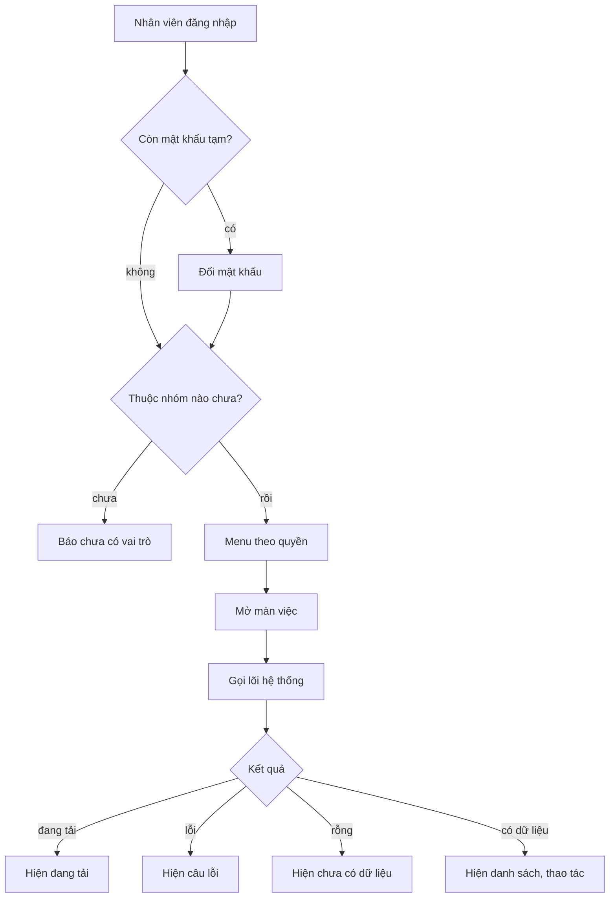

# ERP console (`erp-console/`)

> Cập nhật 02/10/2026, theo code `main` `bf62b81`.
> **Đang chuyển sang bộ thiết kế mới** (màn máy tính theo design): hồ sơ `doc/features/2026-10-01-erp-theo-design/`
> (17 lô ở `02c-giao-viec.md`, quy tắc giao diện ở `doc/design/erp/UI-RULES.md`). File này mô tả ERP **hiện tại**; sau mỗi lô của hồ sơ đó cần cập nhật lại.
> Hướng dẫn chi tiết cho dev: `erp-console/README.md`.



## Là gì

Console vận hành nội bộ cho Chủ, Quản lý, NV kho, NV giao, CSKH. Next.js 14 (App Router), **xuất tĩnh** ra `out/`,
đưa lên Firebase Hosting (site `cangca-erp`, staging `cangca-erp-staging`). Không có server Next lúc chạy.
Gọi Django API bằng Token DRF. Duy muốn mọi tính năng có màn ERP, kể cả việc của Chủ (không dồn sang Django Admin).

## Cấu trúc thư mục

```
erp-console/
  app/                    CHỈ route, rất mỏng: mỗi page.tsx bọc <ViewGuard> rồi render một màn từ features/
    login/ set-password/ no-role/      màn ngoài console
    print/label/          trang in tem giao
    (console)/            nhóm route cần đăng nhập và có Group (layout = ConsoleGate -> Shell 3 cột)
  features/<module>/      code theo module tính năng: api.ts, mock.ts, types.ts, messages.ts, components/, README.md
  shared/
    lib/                  http.ts (apiFetch), token.ts, nav.ts (menu <-> quyền, hằng PERM), roles.ts (hằng tên Group),
                          messages.ts, format.ts (tiền, kg, giờ VN), useResource.ts, usePagedList.ts, drafts.ts, personalData.ts...
    ui/                   Shell, RightRail, Sheet, SideSheet, Toast, StateBox, ResourceView, PasswordInput, PersonalText,
                          tokens.css (file DUY NHẤT chứa mã màu, theo DESIGN.md), globals.css
  e2e/                    kịch bản Playwright viết bằng Python
  next.config.mjs         output: "export", trailingSlash, cờ mock luôn được định nghĩa lúc build
  firebase.json / firebase.staging.json   cấu hình Hosting production / staging (staging có header noindex)
  .env.example            mẫu NEXT_PUBLIC_API_BASE, NEXT_PUBLIC_USE_MOCK
```

Quy tắc chính (đủ ở `erp-console/README.md`):
- Module không import vào trong module khác, chỉ dùng `shared/` và `features/auth`. `shared/` không import `features/`.
- Không dùng barrel `index.ts`. Import thẳng bằng alias `@/`.
- Mọi gọi API qua `apiFetch` (`shared/lib/http.ts`). Lỗi nghiệp vụ hiện nguyên văn `detail` của BE, logic chỉ dựa vào `code`.
- Không viết cứng thông điệp, mã lỗi, tên quyền, tên Group trong component. Dùng `messages.ts`, `PERM` (`nav.ts`), `ROLE` (`roles.ts`).
- Chỉ dùng token màu trong `shared/ui/tokens.css`, không mã hex, không `style={{...}}`.
- Mỗi màn dữ liệu có đủ ba trạng thái tải, lỗi, rỗng. Mobile-first: 360px không cuộn ngang, nút cao từ 44px.
- Không lưu mật khẩu hay dữ liệu cá nhân của khách vào `localStorage`, nháp, URL.

## Màn và module

| Route | Module | Nội dung | Trạng thái |
|---|---|---|---|
| `/overview/` | `overview` | KPI, đơn gần đây, lô cận hạn, tồn theo lô | Có |
| `/orders/` | `orders` | Danh sách, chi tiết đơn, xác nhận nhận tiền (Chủ), huỷ đơn, tạo phiếu hoàn | Có |
| `/orders/payments/` | `orders` | Hàng chờ thanh toán lệch | Có |
| `/orders/refunds/` | `orders` | Phiếu hoàn chờ chuyển (xác nhận, thất bại, thử lại) | Có |
| `/confirmation/` | `confirmation` | Hàng chờ gọi xác nhận đơn | Có |
| `/deliveries/` | `deliveries` | Phiếu giao, đổi trạng thái, in tem | Có |
| `/my-deliveries/` | | Việc giao của tôi (NV giao) | **Màn chờ** (`<Placeholder>`) |
| `/inventory/` | `inventory` | Kho và lô, sổ kho | Có |
| `/purchasing/` | `purchasing` | Mua hàng, nhập lô | Có |
| `/stocktake/` | | Kiểm kê | **Màn chờ** |
| `/reports/` | | Báo cáo lãi lỗ | **Màn chờ** |
| `/catalog/` | `catalog` | Danh mục, giá, ảnh mặt hàng | Có |
| `/content/`, `/content/edit/`, `/content/categories/` | `content` | CMS bài viết (Tiptap), chuyên mục | Có |
| `/staff/` | `staff` | Nhân viên, đổi nhóm, cho nghỉ, đặt lại mật khẩu | Có |
| `/audit-logs/` | `audit` | Nhật ký hoạt động | Có |
| `/ai/actions/`, `/ai/settings/`, `/ai/policy/`, `/ai/report/` | `ai` | Việc AI, AI của tôi, Chính sách AI, Báo cáo AI | Có |
| `/account/` | `auth` | Tài khoản của tôi, đổi mật khẩu | Có |

Module `guidance` vẽ khung "Tiếp theo · Đã làm" ở các màn chi tiết. Menu và quyền xem từng màn khai một chỗ ở `shared/lib/nav.ts`.
`<ViewGuard>` chỉ ẩn màn cho gọn; backend mới là lớp chặn quyền thật.

### AI trong ERP
`features/ai/` có hai phần:
- **Lệnh**: chỉ mục lệnh (`/api/ai/commands/index/`), tìm lệnh, gọi lệnh (`/api/ai/commands/{id}/call/`), màn Việc AI, cấu hình, chính sách, báo cáo.
- **Trợ lý chạy trên máy** (`runtime/`): kiểm máy, tải model GGUF vào IndexedDB, chạy trong Web Worker. Bản mock dùng engine giả `llmock`. Bản thật chọn
  `wllama`, nhưng thư viện `@wllama/wllama` **chưa cài** và chưa chốt model, nên trợ lý báo lỗi và không chạy (fail-closed). Việc này thuộc P9 (`doc/ke-hoach-tong.md`).
  Cánh cổng `AiAssistantGate` gọi `GET /api/ai/status/` và chỉ nạp phần nặng khi AI bật và người dùng đồng ý.
  Lưu ý: tại `bf62b81` backend **không có route** `/api/ai/status/` (xem `backend.md` mục "Doc cũ lệch code"), nên với backend thật cánh cổng luôn coi là AI tắt.

## Mock

| | Là gì | Bật |
|---|---|---|
| Mock của console | Không gọi mạng. Mỗi module trả JSON giả theo contract từ `features/*/mock.ts` | `NEXT_PUBLIC_USE_MOCK=1` khi `npm run dev` / `npm run build` |
| Dữ liệu demo trên backend | Bản ghi mẫu nằm trong DB thật | `manage.py seed_demo` (gỡ: `seed_demo --remove`) |

Mỗi hàm API viết nguyên biểu thức `mock: process.env.NEXT_PUBLIC_USE_MOCK === "1" ? mockX : undefined` để bản build thật bỏ hẳn code mock.
Tài khoản mock liệt kê ở `erp-console/README.md` (chỉ dùng cho mock, không phải tài khoản thật).

## Lệnh

```bash
cd erp-console
npm ci                                              # cài đúng theo package-lock.json
NEXT_PUBLIC_USE_MOCK=1 npm run dev                  # mock, không cần backend -> http://localhost:3100
NEXT_PUBLIC_API_BASE=http://localhost:8000 npm run dev   # nối Django chạy máy mình
npm test                                            # unit test (vitest)
./node_modules/.bin/tsc --noEmit && npm run build   # kiểm kiểu + build tĩnh ra out/
```

**Build để deploy** (chỉ khi Duy yêu cầu): luôn **truyền biến trực tiếp** trên dòng lệnh, vì `.env.local` (thường để mock) đè lên `.env.production`.

```bash
NEXT_PUBLIC_USE_MOCK=0 NEXT_PUBLIC_API_BASE=<URL API staging> npm run build
firebase deploy --only hosting --config firebase.staging.json --project keolai-63ec1     # staging
```

URL API từng môi trường và lệnh production: `doc/ops/moi-truong.md`. Sau build, grep `out/_next` để chắc trỏ đúng URL.

## E2E

Kịch bản Playwright (Python) ở `erp-console/e2e/`. Phần lớn chạy trên **bản build mock phục vụ tĩnh**, một số chạy với backend thật (tên có `real`).
Đầu mỗi file ghi cách chạy. Mẫu:

```bash
cd erp-console && NEXT_PUBLIC_USE_MOCK=1 npm run build
(cd out && python3 -m http.server 3101 &)
BASE=http://127.0.0.1:3101 python3 e2e/s7_shell.py
```

Quy ước: không `wait_for_timeout`, chờ theo điều kiện (URL, phần tử, `aria-busy`, `__caveMock.pending() === 0`).
QA không chấm PASS bằng đọc code (luật đội từ 30/09).
