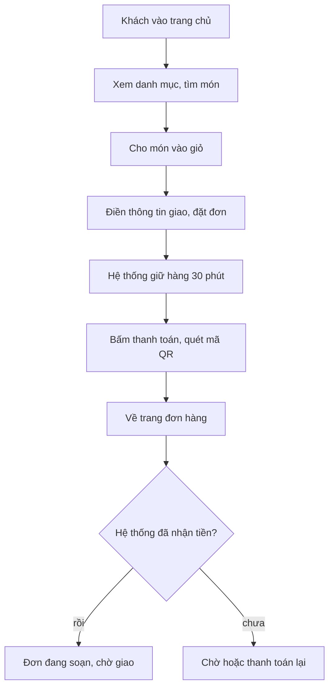

# Shop cho khách (`frontend/`)



> Cập nhật 11/10/2026, sau Shop lô 1 (đã gộp `main` ở `a5a5da2`). Shop đang **làm lại từ đầu theo lô** (quyết định 10/10);
> cập nhật file này cuối mỗi lô Shop. Nguồn chuẩn: `doc/features/2026-10-06-shop-giao-dien-moi/02b-tech-design.md`
> (§1.1 cây thư mục, §1.4 khung trang, §1.10 component, §1.11 code cũ bị xoá theo lô, §3 contract API, §7.1 bảng lô).
> Thiết kế: `doc/design/shop/` (`UI-RULES.md`, `COMPONENTS.md`, `SO-CHUAN.md`).

## Là gì

Shop bán lẻ cho khách, bố cục kiểu nhà thuốc bán lẻ (Long Châu), token màu chung `DESIGN.md` (màu nhấn `#1F66D1`).
Khách **không đăng nhập** (guest checkout, gộp theo SĐT). Next.js 14 (App Router), **xuất tĩnh** ra `out/`, đưa lên
Firebase Hosting (site `cangca-loc`, staging `cangca-loc-staging`). Mọi dữ liệu lấy từ API công khai của Django lúc chạy.

## Trang

| Route | Nội dung | API dùng |
|---|---|---|
| `/` | Trang chủ Shop (`HomeScreen`) | `shop/catalog/`, `public/content/...` |
| `/shop/` | Danh mục theo nhóm, tồn hiện 3 mức | `shop/catalog/` |
| `/shop/item/?code=<mã hàng>` | Chi tiết món hoặc combo | `shop/catalog/{item_code}/` |
| `/shop/cart/` | Giỏ hàng (✚ lô 2) | `shop/catalog/` (so giá) |
| `/shop/checkout/` | Form giao hàng, đặt đơn, thanh toán (viết lại ở lô 3+4) | `shop/orders/`, `shop/orders/{code}/checkout/` |
| `/shop/orders/?code=...` | Trang đơn hàng, cũng là trang tra đơn | hiện `shop/orders/{code}/?phone_last4=`; lô 3+4 đổi sang `POST shop/orders/lookup/` |
| `/about/` | Trang giới thiệu thương hiệu (nội dung CMS) | `public/content/...` |
| `/blog/` | Danh sách bài viết (`?category=`) và chi tiết (`?slug=`) | `public/content/...` |
| `/pages/?slug=...` | Trang CMS: chính sách, liên hệ, cách mua | `public/content/pages/...` |
| `/ui-preview/` | Bộ sưu tập component, chỉ có khi build với `NEXT_PUBLIC_UI_PREVIEW=1` (production 404) | — |

Chân trang (`ShopFooter`) hiện thông tin người bán và liên kết chính sách (`public/site-info/`, `public/content/footer-links/`).
URL và thư mục là tiếng Anh (quyết định 11/10: `/gioi-thieu/` → `/about/`, `/trang/` → `/pages/`, `/bai-viet/` → `/blog/`, không giữ đường cũ).
Slug nội dung CMS là dữ liệu, giữ tiếng Việt. Route chi tiết dùng query string vì xuất tĩnh không dựng trước được trang cho mã chưa biết.

## Cấu trúc thư mục

```
frontend/
  app/                    route; layout.tsx bọc CartProvider + ToastProvider ở root; globals.css (token), legacy.css (xoá lô 5)
  components/
    ShopFrame.tsx         khung: header + main + footer + BottomNav theo props, mỗi màn tự bọc
    ShopHeader, ShopFooter, BottomNav, LogoSlot, CartContext, shopLinks.ts
    ui/                   component trình bày dùng chung (Button, Chip, Dialog, Sheet, Popover, Toast, Banner, Icon…)
    catalog/              PriceTag, ImageFrame, CategoryTile, ProductCard, StockBadge
    search/               SearchBox
    cart/                 (✚ lô 2)
  features/
    home/                 HomeScreen, content.ts (xoá lô 5)
    catalog/              groupIcon.ts; lô 2 thêm CatalogScreen, ItemDetailScreen
    checkout/             luồng thanh toán cổng SePay: gateway.ts, MockGatewayPanel; phần còn lại viết lại ở lô 3+4
    content/              bài viết, ArticleBody, safeHref.ts (chặn link nguy hiểm) — mkt-brand
    site/                 thông tin người bán, thông báo gọi xác nhận — mkt-brand
    ui-preview/           PreviewGallery + dữ liệu giả
  lib/                    api.ts (MỌI gọi Shop API đi qua đây), mock.ts, types.ts, format.ts, quantity.ts, phone.ts
  scripts/                check-no-mock.mjs, test-format.mjs, test-quantity.mjs, test-phone.mjs, test-safe-href.mjs
  e2e/                    kịch bản Playwright (Python)
  next.config.mjs         output: "export", trailingSlash, pageExtensions theo cờ UI preview
  firebase.json / firebase.staging.json   Hosting production / staging (staging có header noindex)
```

Component trong `components/ui|catalog|cart|search` chỉ **trình bày** (props vào, callback ra, không gọi API, không đọc storage).
Chỉ `*Screen.tsx`, `ShopHeader`, `ShopFooter` được gọi `lib/api.ts` hoặc `features/site/api.ts`.

Code cũ còn tồn tại, sẽ xoá theo 02b §1.11: `CatalogGrid`, `AddToCartControl`, `ContactButton` (lô 2); `CountdownTimer`,
`app/shop/orders/OrderLookup.tsx`, `features/checkout/storage.ts`, `PaymentPanel`, `OrderPaymentPanel`, `ConfirmCallNotice` (lô 3+4).
Đã xoá ở lô 1: landing cũ ở `app/page.tsx`, `components/ItemImageFrame.tsx`, `features/site/components/SiteLegalFooter.*`.

## Danh mục

`GET /api/shop/catalog/` trả `{groups, items}`. Mỗi món có `stock_level` (`in` / `low` / `out`), Shop hiện ba mức
Còn hàng / Sắp hết / Hết, không hiện số kg, ngày nhập hay mã lô (quyết định 10/10). Hết hàng thì nút "Liên hệ chúng tôi".
Bán theo kg, tối thiểu 1 kg, bước 0,5 kg; combo tính theo combo, số nguyên.

## Thanh toán

1. Đặt đơn: `POST /api/shop/orders/` trả mã đơn và `booked_expires_at` (hạn giữ chỗ).
2. Bấm thanh toán: `POST /api/shop/orders/{code}/checkout/` trả `checkout_url` và mảng `fields` có thứ tự.
   `features/checkout/gateway.ts` dựng `<form method="POST">` đúng thứ tự field rồi submit sang cổng. FE **không** tính tiền, không ký, không đổi field.
3. Cổng đưa khách về `/shop/orders/?code=...&result=success|cancel|error`. Trang đơn hàng hiện trạng thái thật từ API.
   Về trang `success` chưa có nghĩa đã trả tiền; chỉ IPN qua adapter mới xác nhận. Không có màn "thành công" riêng.

Giao diện khách chỉ ghi "Chuyển khoản ngân hàng (quét mã QR)", không ghi tên nhà cung cấp cổng. Hiện chưa có phí ship;
khách trả một lần qua QR.

## Dữ liệu cá nhân (bất biến 9)

- Giỏ hàng trong `localStorage` chỉ giữ mã hàng, tên hàng, đơn vị, giá và số lượng.
- Trang đơn hàng công khai **không hiện người nhận** (tên, SĐT, địa chỉ).
- Tra đơn hiện còn GET với 4 số cuối SĐT; lô 3+4 gỡ đường này, thay bằng POST với mã đơn + SĐT đầy đủ, hoặc mã tra đơn tạm
  lưu ở `sessionStorage` (02b §1.7, §3.4).
- Không lưu tên, SĐT đầy đủ, địa chỉ vào storage hay URL; không `console.log` dữ liệu form.

## Mock

`NEXT_PUBLIC_USE_MOCK=1` thì `lib/mock.ts` (và `features/*/mock.ts`) trả dữ liệu giả đúng JSON của 02b §3, không cần backend.
Có cổng thanh toán giả (`MockGatewayPanel`, bật khi URL có `?mock_gateway=1`). Dữ liệu mock chỉ dùng tên/SĐT giả.

`.env.example` để `NEXT_PUBLIC_USE_MOCK=1`, nên `.env.local` chép từ đó sẽ bật mock khi chạy máy mình.

## Lệnh

```bash
cd frontend
npm ci
NEXT_PUBLIC_USE_MOCK=1 npm run dev                       # mock -> http://localhost:3000
NEXT_PUBLIC_USE_MOCK=0 NEXT_PUBLIC_API_BASE=http://localhost:8000 npm run dev   # nối Django máy mình
NEXT_PUBLIC_USE_MOCK=0 npm run build                     # build tĩnh ra out/, phải sạch
test ! -e out/ui-preview/index.html                      # bản build thường không có /ui-preview/
node scripts/test-format.mjs && node scripts/test-quantity.mjs && node scripts/test-safe-href.mjs
```

**Build để deploy** (chỉ khi Duy yêu cầu): luôn truyền biến **trực tiếp** trên dòng lệnh, vì `frontend/.env.local` (mock) đè lên `.env.production`.

```bash
NEXT_PUBLIC_USE_MOCK=0 NEXT_PUBLIC_API_BASE=<URL API staging> npm run build
node scripts/check-no-mock.mjs out      # bản build thật không được chứa chuỗi mock
firebase deploy --only hosting --config firebase.staging.json --project keolai-63ec1     # staging
```

URL API từng môi trường và lệnh production: `doc/ops/moi-truong.md`.

## E2E

Kịch bản Playwright (Python) ở `frontend/e2e/`, ví dụ `qa_sepay_checkout.py` (luồng thanh toán mock), `qa-lo8-shop-django.py`
(với backend thật), `about_page.py` (trang giới thiệu), `content_public_pages.py` (bài viết và trang CMS công khai).
Đọc đầu mỗi file để biết cần build mock hay backend thật.
