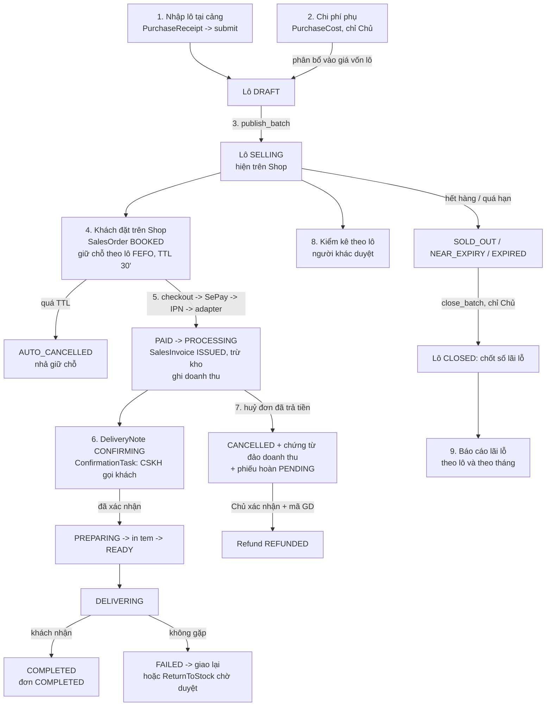

# Nghiệp vụ: luồng chính và bất biến

> Cập nhật 02/10/2026, theo code `main` `bf62b81`.
> File này là **bản đồ**. Luật chi tiết nằm ở `doc/business-process-spec.md` (mã `BR-*`), quyết định ở `doc/decisions.md`,
> bất biến tóm tắt cho agent ở `.claude/skills/caveve-domain/SKILL.md`. Khi các file đó và file này khác nhau thì các file đó đúng.

## Danh mục quy trình

| Mã | Quy trình | Tiền tố BR | App / module code |
|---|---|---|---|
| §1 | Phân quyền | BR-PQ | `accounts`, `common` |
| P-01 | Danh mục, giá, combo | BR-DM | `catalog/items`, `catalog/pricing`, `catalog/images` |
| P-02 | Mua hàng và nhập lô | BR-MH | `purchasing/receipts`, `purchasing/invoices` |
| P-03 | Chi phí mua và giá vốn lô | BR-GV | `purchasing/costs` |
| P-04 | Vòng đời lô | BR-LO | `inventory/batches` |
| P-05 | Bán hàng trên Shop, thanh toán | BR-BH, BR-TT | `sales/orders`, `sales/payments`, `sales/customers` |
| P-06 | Gọi xác nhận, soạn và giao hàng | BR-GH | `delivery`, `delivery/confirmation`, `delivery/labels` |
| P-07 | Huỷ đơn và hoàn tiền | BR-HT | `sales/orders` (huỷ), `sales/refunds`, `sales/credit_notes` |
| P-08 | Giao thất bại, hàng về kho | BR-HV | `delivery` (tạo phiếu), `inventory/returns` (duyệt) |
| P-09 | Kiểm kê và hao hụt | BR-KK | `inventory/stocktake` |
| P-10 | Báo cáo lãi lỗ | BR-BC | `reports` |
| (CMS) | Bài viết, trang chính sách | BR-ND | `content` (hồ sơ `2026-09-28-cms-viet-bai`) |
| (AI) | Lệnh AI, việc AI, chính sách AI | BR-AI | `ai` (hồ sơ `2026-09-27-ai-native-erp`, `2026-09-28-ai-digital-worker`) |

## Luồng chính, từ cảng tới báo cáo

### 1. Nhập lô tại cảng (P-02, P-03)
- Mua trực tiếp tại cảng, không có đơn mua (PO). NV kho, Quản lý hoặc Chủ lập **phiếu nhập** (`PurchaseReceipt`).
  `submit` ghi nhận phiếu, **mỗi dòng sinh một lô** (`Batch`, BR-MH-01). Lô mới ở trạng thái `DRAFT`, chưa hiện trên Shop (BR-MH-05).
- Có lệnh nhập nhanh nhiều lô: `POST /api/purchasing/receipts/receive-batches/`.
- Hạn dùng mặc định 365 ngày kể từ ngày nhập (decisions 2026-09-26, `BATCH_DEFAULT_SHELF_LIFE_DAYS`). Hạn chỉ được sửa ngắn lại (BR-MH-02).
- **Chi phí phụ** (xe, đá, bốc xếp...) ghi bằng `PurchaseCost` và phân bổ vào giá vốn lô (landed cost). Chỉ Chủ làm được vì nó đổi giá vốn.
- NV kho chỉ sửa phiếu nhập do chính mình tạo, trong ngày.

### 2. Mở bán và vòng đời lô (P-04)
Trạng thái lô (`Batch.Status`):

| Mã | Nghĩa | Ai/cái gì đổi |
|---|---|---|
| `DRAFT` | Nháp, chưa bán | Sinh khi submit phiếu nhập |
| `SELLING` | Đang bán | `publish_batch` (Chủ, Quản lý) |
| `NEAR_EXPIRY` | Cận hạn (còn bán) | Job `update_batch_status`, ngưỡng `BATCH_NEAR_EXPIRY_DAYS` |
| `SOLD_OUT` | Hết hàng | Hệ thống |
| `EXPIRED` | Quá hạn, rút khỏi bán ngay | Job `update_batch_status` (BR-LO-02) |
| `CANCELLED` | Huỷ lô quá hạn, hạch toán lỗ | `cancel-expired` (BR-LO-03) |
| `CLOSED` | Đã chốt, đông cứng lãi lỗ | `close_batch` (chỉ Chủ, BR-LO-05) |

Lô quá hạn có thể **trả nhà cung cấp** một phần hoặc toàn bộ (`return-to-supplier`, `BatchSupplierReturn`, BR-LO-07, BR-MH-08). Tiền NCC hoàn trừ vào chi phí lô.

### 3. Khách đặt hàng (P-05)
- Khách không có tài khoản. `Customer` gộp theo số điện thoại. Địa chỉ giao bắt buộc (BR-BH-09). Không có phí giao trên đơn (BR-BH-10).
- Tạo đơn: `POST /api/shop/orders/`. Đơn `BOOKED`, mã dạng `SO<yymmdd>-<6 ký tự>`.
  Hệ thống **giữ chỗ ở mức lô**, chọn lô theo **FEFO**, ghi bảng phân bổ `SalesOrderLineBatch` (BR-BH-02, 05, 06).
  Combo giữ chỗ đủ mọi thành phần, thiếu một là không tạo đơn (BR-BH-07). Giá và công thức combo đóng băng lúc tạo đơn (BR-BH-08).
- Giữ chỗ có hạn `SALES_ORDER_TTL_MINUTES` (30 phút). Job `cancel_expired_orders` chuyển đơn quá hạn sang `AUTO_CANCELLED` và nhả hàng (BR-BH-03, 04).
- Nếu bật `PRIVACY_CONSENT_REQUIRED` mà chưa đăng trang chính sách bảo mật thì Shop từ chối tạo đơn (503, BR-BH-17).
- Tra đơn: `GET /api/shop/orders/{mã}/?phone_last4=` (mã đơn và 4 số cuối SĐT, có giới hạn tần suất).

### 4. Thanh toán SePay / VietQR (P-05 §7.4)
1. Shop gọi `POST /api/shop/orders/{mã}/checkout/`. Backend lập và ký sẵn tham số, trả `checkout_url` và mảng `fields` có thứ tự.
2. Trình duyệt submit form POST sang trang thanh toán SePay. Khách quét VietQR. V1 chỉ VietQR, trả 100%, không cọc (decisions 2026-09-26).
3. SePay gửi IPN `ORDER_PAID` tới adapter `/ipn/sepay`. Adapter kiểm `X-Secret-Key`, đổi dạng, gọi `POST /api/internal/payments/sepay-ipn/` của Django.
4. Django ghi `PaymentTransaction`, chống trùng theo mã giao dịch ngân hàng (BR-TT-03). Khớp đủ thì đơn `PAID`, xuất `SalesInvoice`, trừ kho thật đúng các lô đã giữ (không chọn lại, BR-BH-11), đơn sang `PROCESSING`, ghi doanh thu (BR-TT-06).
5. Khách quay về trang `success_url` **không** có nghĩa là đã trả tiền. Chỉ IPN mới xác nhận.

Tiền lệch không tự xác nhận mà vào **hàng chờ Chủ** (`PaymentTransaction.match_status`):
`UNDERPAID` (thiếu), `ORPHAN` (tới sau khi đơn đã tự huỷ), `UNMATCHED` (không khớp đơn), `OVERPAID` (chuyển thừa).
Chủ xử lý bằng `POST /api/sales/payments/{id}/resolve` (gắn đơn, xác nhận, hoặc hoàn tiền). Chủ cũng có thể xác nhận tay một đơn sau khi đối chiếu sao kê
(`POST /api/sales/orders/{id}/confirm-payment`, quyền `confirm_payment_manual`, BR-TT-07).

Route webhook biến động số dư cũ `/webhook/sepay` vẫn còn code nhưng **tắt mặc định**.

### 5. Gọi xác nhận đơn (CSKH)
- Hoá đơn được xuất thì `delivery/signals.py` tự tạo **phiếu giao** (`DeliveryNote`) ở trạng thái `CONFIRMING` và một việc gọi (`ConfirmationTask`).
- Nhân viên CSKH (nhóm `customer_service`) nhận việc trong hàng chờ `/api/confirmation/queue/`, gọi khách, ghi kết quả (`CustomerCall`):
  đã xác nhận, xác nhận có đổi thông tin, không nghe máy, sai số, hẹn gọi lại, muốn đổi, muốn huỷ.
- Gọi không được quá số lần cho phép trong cửa sổ thời gian thì chuyển Quản lý quyết định (`ESCALATED`). Có thể bật tự huỷ sau hạn (`CONFIRMATION_AUTO_CANCEL_ENABLED`, mặc định tắt, chỉ bật sau khi pháp lý duyệt).
- Phiếu còn `CONFIRMING` thì chưa soạn được (BR-GH-11). Job `process_confirmation_deadlines` xử lý nhắc, chuyển cấp, tự huỷ.

### 6. Soạn và giao hàng (P-06)
Trạng thái phiếu giao (`DeliveryNote.Status`):
`CONFIRMING` → `PREPARING` (soạn) → `READY` (đóng gói xong, cần quyền `pack_deliverynote`) → `DELIVERING` → `COMPLETED`.
Từ `DELIVERING` có thể sang `FAILED`, rồi giao lại (`DELIVERING`). `COMPLETED` và `CANCELLED` không quay lui (BR-GH-05, BR-GH-07).
- In tem giao: `GET/POST /api/delivery/notes/{id}/label/`, `label/print/`, `label/void/` (quyền `print_label`). Mỗi lần in ghi `LabelPrint`.
- Phiếu giao hoàn tất thì đơn sang `COMPLETED`.
- Giao thất bại quá `DELIVERY_MAX_FAILED_ATTEMPTS` lần (mặc định 2) thì hệ thống báo cần quyết định (BR-GH-04).
- NV giao chỉ thấy phiếu được gán cho mình (BR-GH-06, BR-PQ-12) và chỉ thấy dữ liệu khách của phiếu đã kết thúc trong `DELIVERY_PII_RECENT_DAYS` ngày.

### 7. Giao thất bại, hàng về kho (P-08)
NV giao tạo phiếu hàng hoàn (`ReturnToStock`) về **đúng lô gốc**. Quản lý hoặc Chủ duyệt (`approve_returntostock`, BR-HV-02):
**tái nhập** (cộng lại lô gốc) hoặc **huỷ bỏ** (hạch toán hàng hỏng vào lô gốc). Lô đã chốt không nhận hàng hoàn (BR-HV-04).

### 8. Huỷ đơn và hoàn tiền (P-07)
- Đơn chưa trả tiền: tự huỷ khi quá TTL.
- Đơn đã trả tiền: `POST /api/sales/orders/{id}/cancel/` với `reason_code` (quyền `cancel_paid_order`, Chủ và Quản lý).
  Bị chặn khi phiếu giao đang `DELIVERING` (BR-GH-07) hoặc `COMPLETED` (BR-GH-05).
  Hoàn kho về lô gốc **chỉ khi hàng còn ở kho** (soạn hàng, chờ lấy). Phiếu giao thất bại thì đi luồng P-08, không cộng kho hai lần.
- Huỷ đơn đã trả tiền thì hệ thống lập **chứng từ đảo doanh thu** (`SalesCreditNote`, BR-HT-10) ngay trong giao dịch huỷ.
  Doanh thu và giá vốn đảo vào **kỳ phát sinh huỷ**, không sửa kỳ cũ (BR-HT-06). Hoá đơn gốc giữ nguyên.
- **Phiếu hoàn tiền** (`Refund`): Chủ hoặc Quản lý tạo (`create_refund`), trạng thái `PENDING`.
  Chỉ Chủ xác nhận đã chuyển (`confirm_refund`), bắt buộc nhập mã giao dịch (BR-HT-03). Có `mark-failed` và `retry`.
  Hoàn tiền là chuyển khoản tay của Lộc. SePay không có API hoàn tiền (spec §9.1).
- Đơn huỷ trước P8 chưa có chứng từ đảo thì chạy `manage.py backfill_credit_notes` (mặc định chỉ in, `--apply` mới ghi).

### 9. Kiểm kê (P-09)
Kiểm kê **theo lô** (`StockReconciliation`). Người nhập số và người duyệt phải khác nhau (BR-KK-02). Chưa duyệt thì tồn sổ không đổi.
Chênh âm là hao hụt của lô đó. Chênh dương phải ghi lý do.
Backend đã có API `/api/inventory/reconciliations/` (+ `approve`). **Màn ERP "Kiểm kê" còn là màn chờ** (xem `erp-console.md`).

### 10. Báo cáo lãi lỗ (P-10)
- **Theo lô** là nguồn sự thật: doanh thu bán từ lô (trừ chứng từ đảo) − (giá mua + chi phí phân bổ − tiền NCC hoàn). Hao hụt và hàng hỏng hiện riêng, không cộng thêm vào chi phí (BR-BC-04). Lô chưa chốt phải gắn nhãn "tạm tính" (BR-BC-05).
- **Theo tháng** để điều hành. Hoàn tiền và chứng từ đảo ghi vào kỳ phát sinh. **Không sửa số kỳ đã qua.**
- API: `/api/reports/batch/{batch_id}/`, `/api/reports/period/?year=&month=` (quyền `view_profitreport`, chỉ Chủ).
  Bảng điều hành `/api/dashboard/summary/` (quyền `view_dashboard`).
- **Màn ERP "Báo cáo lãi lỗ" còn là màn chờ.**

## Bất biến (vi phạm là lỗi nghiêm trọng)

Chi tiết và ví dụ ở `.claude/skills/caveve-domain/SKILL.md` mục "Bất biến". Tóm tắt:

| # | Bất biến | Kiểm ở đâu trong code |
|---|---|---|
| 1 | **Không rò giá vốn.** `Batch.purchase_rate`, `Batch.landed_unit_cost`, `PurchaseReceiptLine.rate`, `*LineBatch.unit_cost`, lãi lỗ chỉ lộ với quyền `view_costprice` / `view_profitreport`. Serializer liệt kê field tường minh, cấm `fields="__all__"` | `apps/common/api.py` (`CostFieldSerializerMixin`), test `apps/inventory/batches/tests/test_api.py`, `apps/reports/tests/test_dashboard_cost_leak.py` |
| 2 | **Phân quyền 3 tầng** (xem `backend.md`) | `apps/common/api.py`, `get_queryset` từng ViewSet |
| 3 | **Chứng từ không xoá.** Huỷ bằng trạng thái. FK tới `User` dùng `PROTECT`. Ngoại lệ duy nhất: `seed_demo --remove` chỉ gỡ bản ghi demo đã ghi sổ `DemoRecord` | model `Meta.default_permissions` |
| 4 | `SalesOrder`, `SalesInvoice` chỉ Hệ thống tạo (BR-PQ-11). `AuditLog`, `StockLedgerEntry`, `*LineBatch`, chứng từ đảo là append-only | `default_permissions=("view", "change")` hoặc `("view",)` |
| 5 | Đổi trạng thái quan trọng phải ghi `AuditLog` (BR-PQ-04/05). `actor=None` nghĩa là Hệ thống | `apps/common/audit.py` (`record_audit`) |
| 6 | **FEFO**: lô hạn sớm nhất ra trước, cùng hạn thì lô nhập trước, rồi lô tạo trước. Lô chốt một lần lúc tạo đơn. Giữ chỗ có TTL, job huỷ phải idempotent | `inventory/batches/services.py` (`sellable_batches`), `sales/orders/tasks.py` |
| 7 | Tiền dùng `Decimal`. Tham số nghiệp vụ đọc từ `settings`/env, không viết cứng | `config/settings.py` |
| 8 | Thêm model/field phải có lý do trong hồ sơ tính năng và có migration đi kèm | |
| 9 | **Không rò dữ liệu cá nhân của khách** (tên, SĐT, địa chỉ). API công khai không trả đủ, chỉ che bớt. Không ghi vào log. Không đưa dữ liệu thật vào test, doc, commit. NV giao, CSKH chỉ thấy khách cần cho việc của mình. Không gửi cho bên thứ ba khi Duy chưa duyệt | `delivery/confirmation/scope.py`, `FORBIDDEN_PREFIXES` của AI, checklist `doc/ops/go-live-phap-ly.md` |

Ranh giới Chủ và Quản lý (spec §1.5): Quản lý được uỷ **việc làm khách phải chờ** (mở bán lô, duyệt kiểm kê, duyệt hàng hoàn, huỷ đơn đã trả, tạo phiếu hoàn).
Chủ giữ **việc làm tiền rời túi hoặc đổi con số lời lỗ** (chốt lô, chi phí mua, xác nhận hoàn tiền, xác nhận thanh toán tay, xem giá vốn, xem lãi lỗ, quản lý nhân viên).

## Câu hỏi nghiệp vụ còn mở

Xem `doc/business-process-spec.md` §15 và `doc/decisions.md` mục "Bối cảnh dự án". Ví dụ còn treo: ngưỡng giờ ngoài chuỗi lạnh
(`COLD_CHAIN_MAX_HOURS`, đang để 6 chờ Lộc cho số thật), giả định "số kg đặt = số kg giao" (BR-GH-03), combo bán thực tế dạng nào.
