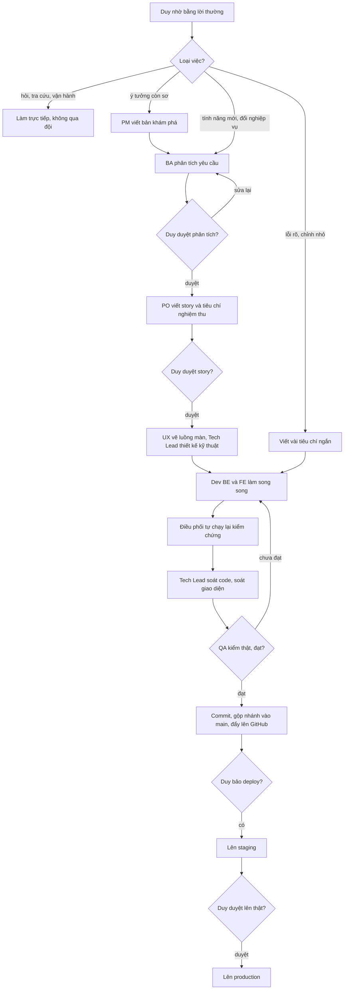

# Quy trình đội dự án

> Cập nhật 11/10/2026 (rà tài liệu legacy).
> Nguồn: `CLAUDE.md` ở gốc repo (luật gốc, file này chỉ tóm tắt), skill `.claude/skills/feature/`, các agent ở `.claude/agents/`.



## Ai làm gì

Duy là PO, chỉ nhờ bằng lời thường, không phải gõ lệnh. Từ P8 (30/09/2026) **đội Claude** tự code, QA và commit.
Gemini CLI / Antigravity tạm dừng (`AGENTS.md`, `.agents/`, `.gemini/` giữ nguyên để có thể bật lại). Không cho hai bên cùng làm một phase.

| Vai | Agent (`.claude/agents/`) | Model | Đầu ra |
|---|---|---|---|
| Điều phối | phiên chính | Opus | chọn luồng, giao việc, tự chạy lại lệnh kiểm chứng, commit |
| BA | `ba-analyst` | Opus | `01-analysis.md` |
| PO | `po-owner` | Opus | `02-stories.md` và tiêu chí nghiệm thu |
| PM | `product-manager` | Opus | `00-product-brief.md` (khi tính năng còn ở mức ý tưởng, chạy trước BA) |
| UX | `ux-designer` | Opus | `02a-ux-flow.md` + link prototype (sau PO, song song Tech Lead) |
| Tech Lead | `techlead` | Opus | `02b-tech-design.md`, review diff (trước QA) |
| Marketing/Brand | `mkt-brand` | Opus | `0X-marketing.md` + **tự code** phần nội dung/CMS (app `content`, lệnh nạp nội dung, trang nội dung Shop), Duy chốt 10/10 |
| Pháp lý | `legal-vn` | Opus | `0X-phap-ly.md` trong hồ sơ hoặc `doc/ops/` |
| BE | `be-dev` | Sonnet 5.5 | code `backend/`, `adapter/`, `03-dev-notes.md` |
| FE | `fe-dev` | Sonnet 5.5 | code `frontend/`, `erp-console/`, `03-dev-notes.md` |
| QA | `qa-tester` | Sonnet 5.5 | `04-qa-report.md` |

## Chọn luồng

Mọi yêu cầu làm đổi sản phẩm (thêm, sửa chức năng, sửa lỗi, đổi giao diện, đổi quy tắc, viết story, test, review, deploy) đi qua skill `feature` trước:

```
ĐẦY ĐỦ  (tính năng mới / đổi nghiệp vụ)  BA -> [Duy duyệt] -> PO -> [Duy duyệt] -> Tech Lead -> BE ∥ FE -> UI review -> QA -> Review -> [Duy duyệt] -> Deploy
NHANH   (lỗi rõ / chỉnh nhỏ)             AC ngắn -> BE/FE -> QA -> tổng kết
CHỈ BA · CHỈ PO · CHỈ QA · REVIEW · DEPLOY · TIẾP TỤC (việc đang dở)
```

Trong luồng ĐẦY ĐỦ, `product-manager` chạy trước BA khi tính năng còn là ý tưởng; `ux-designer` chạy sau PO, song song Tech Lead;
`mkt-brand` được gọi khi đụng thương hiệu, câu chữ hay nội dung CMS.

Không chạy workflow cho câu hỏi tra cứu, hoặc việc vận hành không đổi code (xem log, seed dữ liệu, đổi mật khẩu).

## Hồ sơ tính năng

Mỗi tính năng có một thư mục `doc/features/<YYYY-MM-DD>-<slug>/`:

| File | Ai viết | Nội dung |
|---|---|---|
| `00-can-duy-quyet.md` (nếu có) | điều phối | Điểm cần Duy quyết |
| `01-analysis.md` | BA | Yêu cầu gốc, use case, business rule (nhãn L/D/PA), rủi ro, câu hỏi mở |
| `02-stories.md` | PO | Story, tiêu chí nghiệm thu |
| `00-product-brief.md` (nếu có) | PM | Vấn đề, chỉ số, lát MVP |
| `02a-ux-flow.md` (nếu có) | UX | Bảng luồng × trạng thái, prototype |
| `02b-tech-design.md` | Tech Lead | Thiết kế kỹ thuật, contract API, file được sửa, có thể kèm bảng lô (vd Shop §7.1) |
| `02c-giao-viec.md` | điều phối | Chia lô, thứ tự, phụ thuộc, ☐/☑ từng lô |
| `03-dev-notes.md` | BE, FE | Ghi chú hiện thực, lệch so với thiết kế |
| `04-qa-report.md` | QA | Kết quả kiểm, APPROVED / REJECTED |

Trạng thái file: NHÁP, CHỜ DUYỆT, ĐÃ DUYỆT. Một phase chỉ bắt đầu code khi `02c` ở **SẴN SÀNG CODE** (Duy đổi).
Thứ tự các phase P1–P9 (tới 01/10): `doc/ke-hoach-tong.md`. Đợt sau đó theo bảng lô trong hồ sơ (vd Shop: `doc/features/2026-10-06-shop-giao-dien-moi/02b-tech-design.md` §7.1).
Mỗi tính năng là một idea trên **Jira Product Discovery** (project FISH); chỉ điều phối cập nhật, theo skill `feature` mục "Cập nhật Jira Product Discovery".

## Quy trình một lô

1. Điều phối `git pull`, đọc dòng lô trong `02c`, chạy lệnh kiểm chứng để ghi số gốc.
2. Giao `be-dev` ∥ `fe-dev` (song song khi lô ghi BE ∥ FE), kèm mã story, file được sửa và không được đụng, contract từ `02b`.
3. Điều phối **tự chạy lại** lệnh kiểm chứng. Không tin báo cáo của subagent khi chưa chạy.
4. `techlead` review diff: giá vốn, dữ liệu cá nhân, phân quyền, migration, lệch `02b`.
5. `qa-tester` kiểm: không PASS bằng đọc code, có ca ngoài đường thuận, `npm ci` sạch.
6. REJECTED thì giao lại dev, quay về bước 3. APPROVED thì commit theo pathspec trên nhánh lô, gộp vào `main`, push, đánh ☑ ở `02c`. Gặp điểm dừng trong `02c` thì hỏi Duy.

## Lệnh kiểm chứng hay dùng

```bash
cd backend && .venv/bin/python manage.py test
cd adapter && .venv/bin/python -m pytest -q
cd erp-console && npm ci && npm test && ./node_modules/.bin/tsc --noEmit && npm run build
cd frontend && npm ci && npm run build
python3 scripts/check_naming.py        # gốc repo: định danh tiếng Anh, chạy trước khi báo xong mọi việc có sửa code
```

## Commit và push

- Mỗi lô làm trên **một nhánh riêng** tách từ `main` (vd Shop: `shop/lo-<n>-<slug>`).
- Xong một lô đã QA APPROVED: commit **tiếng Việt**, có mã lô/story và mã BR liên quan. Commit **theo pathspec**
  (`git add <file của lô>`, `git commit -- <file>`), **không** `git add -A` vì có thể cuốn file của agent khác hoặc file bí mật.
- Gộp nhánh lô vào `main`, chạy lại test tuần tự (phải thấy `Ran N tests … OK`), rồi `git push origin main` (quy ước push sau mỗi lô: Duy đặt 25/09/2026).
- Repo `github.com/DuyduyFedev46/fish` đang **công khai**: không commit `.env`, secret, mật khẩu, dữ liệu khách thật.
- Không báo "xong" hay "test xanh" khi chưa chạy lệnh kiểm chứng trong lượt đó.
- Không deploy khi Duy chưa yêu cầu. Deploy staging trước, Duy duyệt rồi mới production (`doc/ops/moi-truong.md`).

## Luật luôn áp dụng

- Không rò giá vốn, không xoá chứng từ, không lật quyết định trong `doc/decisions.md`.
- Không rò dữ liệu cá nhân của khách (bất biến 9, `nghiep-vu.md`). Rò là lỗi **Critical**.
- Định danh trong code là tiếng Anh chuẩn. Chữ hiển thị, comment, tài liệu là tiếng Việt (bảng ở `bang-thuat-ngu.md`).
- Tính năng phải có màn ở ERP, không chỉ Django Admin.
- Báo cáo kỳ đã qua không đổi số. Điều chỉnh ghi vào kỳ hiện tại.
- Tiền VNĐ, hiển thị giờ Việt Nam, DB lưu UTC.
